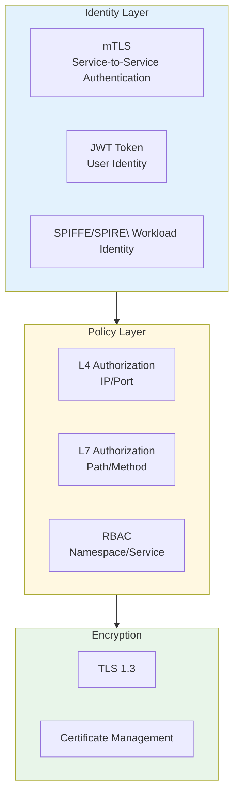

> **Production Environment Security Reminders**
>
> Commands included in this document are executable directly. Please confirm before execution: that the target cluster and Namespace are correct; that you have sufficient RBAC permissions; and that the commands have been validated in a non-production environment. Risk levels for commands: 🔴 High Risk (may result in data loss or service disruption), 🟡 Medium Risk (will modify cluster state but usually rollbackable), 🟢 Low Risk/Read-Only (information gathering with no side effects).


title: Microservice Governance and Service Mesh Architecture Design
description: '# Microservice Governance and [[Service|Service]]Mesh)[Service Mesh]] [[Kubernetes|Kubernetes]] Production Architecture Design'
category: application-architecture
tags:
- k8s
- architecture
- industry
- jaeger
- istio
- envoy
- cilium
- redis
- mysql
- statefulset
last_updated: '2026-05-18'
difficulty: expert
reading_level: expert
audience:
- Microservices Architect
- Cloud Native Engineer
- DevOps Engineer
- Alibaba Cloud Solution Architect
estimated_read_time: 5min
intent_queries:
- Service Mesh Service Mesh Architecture Design
- Istio Alibaba Cloud ASM Deployment Configuration
- Full-Link Rollout Solution
- Circuit Breaker Throttling Sentinel for Microservices
- Zero Trust Security Architecture mTLS
trigger_keywords:
- Service Mesh
- Istio
- ASM
- Microservice Governance
- Full-Link Rollout
- Sentinel
- MSE
- Nacos
- Envoy
- mTLS
related_domains:
- domain-03-networking-traffic
- domain-01-cluster-fundamentals
- domain-7-observability
- domain-26-service-mesh
related_topics:
- domain-20-application-patterns/topic-application-architecture/17-saas-multitenant-architecture
- domain-20-application-patterns/topic-application-architecture/11-smart-retail-architecture
- domain-02-workloads-applications/topic-functions/03-observability-monitoring
- domain-02-workloads-applications/topic-functions/06-service-mesh
k8s_versions:
- '1.28'
- '1.29'
- '1.30'
- '1.31'
- '1.32'
---

# Microservice Governance and Service Mesh Production Architecture Design

> **Applicable Scenarios**: Enterprise microservice transformation / Service Mesh governance / Full-Link rollout / Multi-active architecture / Zero-trust network
> **Cloud Providers**: Alibaba Cloud ACK + ASM (Alibaba Cloud Service Mesh) + MSE (Microservice Engine) product suite
> **Applicable Versions**: Kubernetes v1.29 - v1.33
> **Last Updated**: 2026-04-24
> **Target Readers**: Microservices Architect, Cloud Native Engineer, Alibaba Cloud Solution Architect

---

## 📋 Table of Contents

- [One, Overall Architecture Panorama](#1-overall-architecture-overview)
- [Two, Service Mesh Architecture](#2-service-mesh-architecture)
- [Three, Full-Link Gradual Release Architecture](#3-full-link-rollout-architecture)
- [Four, Traffic Governance and Circuit Breaker Degradation Architecture](#4-traffic-governance-and-circuit-breaker-degradation-architecture)
- [Six, Zero Trust Security Architecture](#6-multi-active-architecture-and-disaster-recovery)
- [Seven, Multi-active Architecture and Disaster Recovery](#7-service-registration-discovery-and-configuration-center)
- [Eight, ACK + ASM Alibaba Cloud Deployment Architecture](#8-ack-asm-alibaba-cloud-deployment-architecture)
- [Eight ACK ASM Alibaba Cloud Deployment Architecture](#8-ack-asm-alibaba-cloud-deployment-architecture)

---

## 1. Overall Architecture Overview

```mermaid
flowchart TB
    subgraph Clients["Clients"]
        WEB_APP["Web App"]
        MOBILE_APP["Mobile App"]
        OPEN_API["Open API<br>Third Party Access"]
    end

    subgraph IngressLayer["Ingress Layer"]
        MSE_GATEWAY["MSE Cloud Native Gateway<br>Ingress/AUTH/Rate Limiting"]
        ASM_INGRESS["ASM Ingress Gateway<br">Istio Gateway"]
    end

    subgraph Mesh["Service Mesh (ASM)"]
        ENVOY_PROXY["Envoy Sidecar<br>Flow Proxy"]
        PILOT["Istiod<br>Control Plane"]
        CILIUM_MESH["Cilium Mesh<br>Ebpf Data Plane"]
    end

    subgraph Services["Microservices"]
        SVC_A["Order Service<br>v1.0 / v1.1"]
        SVC_B["Payment Service<br">v2.0"]
        SVC_C["Inventory Service<br">v1.5"]
        SVC_D["User Service<br">v3.0"]
    end

    subgraph Governance["Governance Center"]
        NACOS["Nacos<br>Registry/Configuration"]
        SENTINEL["Sentinel<br>Breaker/Rate Limiting"]
        SEATA["Seata<br>Distributed Transaction"]
        SKYWALKING["SkyWalking<br>Trace Link"]
    end

    Clients --> IngressLayer --> Mesh --> Services
    Services --> Governance
    Mesh --> Governance

    style Mesh fill:#e3f2fd
    style Governance fill:#fff8e1
    style Services fill:#e8f5e9
```

## 10. Alibaba Cloud Product Mapping

| Architecture Layer | Alibaba Cloud Solution | Open Source Alternatives |
|:---|:---|:---|
| Service Mesh | **ASM (Alibaba Cloud Service Mesh)** | Istio / Cilium |
| API Gateway | **MSE Cloud Native Gateway** / **Cloud Native API Gateway** | Nginx / Kong |
| Registration Configuration | **MSE Nacos** | Nacos / Consul |
| Rate Limiting Circuit Breaker | **MSE Sentinel** | Sentinel / Hystrix |
| Distributed Transactions | **MSE Seata** | Seata |
| Trace Link | **ARMS** + **SkyWalking** | Jaeger / Zipkin |
| Gradual Release | **MSE Full-Link Gradual Release** | Flagger / Argo Rollouts |

---

## 2. Service Mesh Architecture

## Sidecar vs Ambient vs eBPF

```mermaid
flowchart TB
    subgraph Sidecar["Sidecar Mode (Istio/ASM)"]
        APP1["App Container"]
        PROXY1["Envoy Sidecar<br>Injection"]
        APP1 <-->|localhost| PROXY1
    end

    subgraph Ambient["Ambient Mode (Istio v1.18+)"]
        APP2["App Container"]
        ZTUNNEL["ztunnel<br">Node-level L4"]
        WAYPOINT["Waypoint Proxy<br">On-demand L7"]
        APP2 --> ZTUNNEL --> WAYPOINT
    end

    subgraph EBPF["eBPF Mode (Cilium)"]
        APP3["App Container"]
        CILIUM_EBPF["Cilium eBPF<br">Kernel-level"]
        APP3 --> CILIUM_EBPF
    end

    style Sidecar fill:#e3f2fd
    style Ambient fill:#fff8e1
    style EBPF fill:#c8e6c9
```

## ASM Traffic Management Configuration

```yaml
apiVersion: networking.istio.io/v1beta1
kind: VirtualService
metadata:
  name: order-service-route
  namespace: production
spec:
  hosts:
    - order-service
  http:
    - matchers:
      - - headers=""
      - x-canary=""
      - exact="true"
      - route=""
      - - destination=""
      - host="order-service"
      - subset="v2"
      - weight="100"
    - route:
        - destination:
            host: order-service
            subset: v1
          weight: 90
        - destination:
            host: order-service
            subset: v2
          weight: 10
---
apiVersion: networking.istio.io/v1beta1
kind: DestinationRule
metadata:
  name: order-service-dr
  namespace: production
spec:
  host: order-service
  trafficPolicy:
    connectionPool:
      tcp:
        maxConnections: 100
      http:
        http1MaxPendingRequests: 100
        maxRequestsPerConnection: 10
    outlierDetection:
      consecutiveErrors: 5
      interval: 30s
      baseEjectionTime: 30s
      maxEjectionPercent: 50
    loadBalancer:
      simple: LEAST_CONN
  subsets:
    - name: v1
      labels:
        version: v1.0
    - name: v2
      labels:
        version: v2.0
---
# Full-link canary: propagate canary labels
apiVersion: networking.istio.io/v1beta1
kind: EnvoyFilter
metadata:
  name: traffic-tag-pass-through
  namespace: production
spec:
  configPatches:
    - applyTo: HTTP_ROUTE
      match:
        context: SIDECAR_INBOUND
      patch:
        operation: MERGE
        value:
          route:
            request_headers_to_add:
              - header:
                  key: x-mse-tag
                  value: '%REQ(x-mse-tag)%'
```

---

## 3. Full-Link Rollout Architecture

```mermaid
flowchart TB
    subgraph TrafficEntry["Traffic Entry"]
        GW["MSE Gateway"]
        TAG["Tag Coloring<br">Header/Cookie]
    end

    subgraph GrayChain["Gray Chain"]
        SVC1["Order Service v2<br">Gray Instance"]
        SVC2["Payment Service v2<br">Gray Instance"]
        SVC3["Inventory Service v1<br">Stable Version"]
        SVC4["User Service v2<br">Gray Instance]
    end

    subgraph StableChain["Stable Chain"]
        SVC1_S["Order Service v1<br">Stable Instance"]
        SVC2_S["Payment Service v1<br">Stable Instance]
        SVC3_S["Inventory Service v1<br">Stable Instance]
        SVC4_S["User Service v1<br">Stable Instance]
    end

    TrafficEntry -->|x-gray=true| GrayChain
    TrafficEntry -->|x-gray=false| StableChain

    style GrayChain fill:#ffe0b2
    style StableChain fill:#c8e6c9
```

---

## 4. Traffic Governance and Circuit Breaker Degradation Architecture

```mermaid
flowchart TB
    subgraph SentinelRules["Sentinel Rules"]
        FLOW["Flow Control Rules<br">QPS/Concurrency]
        DEGRADE["Degradation Rules<br">RT/Abnormal Ratio"]
        SYSTEM["System Protection<br">CPU/Load"]
        AUTHORITY["Authorization Rules<br>Blacklist/Whitelist"]
    end

    subgraph Scenarios["Scenarios"]
        SPIKE["Spike Peak<br">Rate Limiting Queueing"]
        SLOW["Slow Call Isolation<br">Automatic Degradation"]
        HOT_SPOT["Hot Parameters\nProduct/IP Rate Limiting"]
        ISOLATION["Isolation chamber<BR>Cabin Wall Mode"]
    end

    SentinelRules --> Scenarios

    style SentinelRules fill:#e3f2fd
    style Scenarios fill:#e8f5e9
```

## Sentinel Rule Configuration

```yaml
apiVersion: v1
kind: ConfigMap
metadata:
  name: sentinel-rules
  namespace: production
data:
  flow-rules.json: |
    [
      {
        "resource": "order-create",
        "limitApp": "default",
        "grade": 1,
        "count": 10000,
        "strategy": 0,
        "controlBehavior": 0
      },
      {
        "resource": "seckill-order",
        "limitApp": "default",
        "grade": 1,
        "count": 1000,
        "strategy": 0,
        "controlBehavior": 2,
        "maxQueueingTimeMs": 500
      }
    ]
  degrade-rules.json: |
    [
      {
        "resource": "payment-query",
        "grade": 0,
        "count": 500,
        "timeWindow": 10,
        "minRequestAmount": 5,
        "statIntervalMs": 1000
      }
    ]
---
# Sentinel Sidecar injection
apiVersion: apps/v1
kind: Deployment
metadata:
  name: order-service
  namespace: production
spec:
  template:
    metadata:
      annotations:
        sidecar.sentinel.io/inject: "true"
    spec:
      containers:
        - name: order
          image: registry.cn-hangzhou.aliyuncs.com/mall/order-service:v2.0
          volumeMounts:
            - name: sentinel-rules
              mountPath: /home/sentinel/rules
      volumes:
        - name: sentinel-rules
          configMap:
            name: sentinel-rules
```

---

## 5. Zero Trust Security Architecture



---

## 6. Multi-active Architecture and Disaster Recovery

```mermaid
flowchart TB
    subgraph ZoneA["Zone A (Hangzhou)"]
        APP_A["Application Cluster"]
        DB_A["PolarDB Primary"]
        CACHE_A["Redis Primary"]
    end

    subgraph ZoneB["Zone B (Shanghai)"]
        APP_B["Application Cluster"]
        DB_B["PolarDB Replica"]
        CACHE_B["Redis Replica"]
    end

    subgraph GlobalService["Global Service"]
        ROUTER["Unitized Routing<br">User ID Sharding"]
        SEQ["Global Sequence<br">Sequencer"]
        CONFIG_GLOBAL["Global Configuration"]
    end

    ZoneA <-->DataSynchronization ZoneB
    GlobalService --> ZoneA & ZoneB

    style ZoneA fill:#e3f2fd
    style ZoneB fill:#e8f5e9
    style GlobalService fill:#fff8e1
```

---

## 7. Service Registration Discovery and Configuration Center

```mermaid
flowchart TB
    subgraph NacosCluster["Nacos Cluster"]
        N1["Nacos-1<br">Leader"]
        N2["Nacos-2<br">Follower"]
        N3["Nacos-3<br">Follower"]
    end

    subgraph Registry["Registry"]
        SERVICE_REG["Service Registration<br">Health Check"]
        DISCOVERY["Service Discovery<br">Subscription Push"]
        HEARTBEAT["Heartbeat Renewal<br">5s Interval"]
    end

    subgraph Config["Config Center"]
        CONFIG_PUSH["Config Push<br">Real-time Effectiveness"]
        CONFIG_HISTORY["Historical Versions<br">Rollback"]
        CONFIG_GRAY["Gray Release<br">Dimensional Push"]
    end

    NacosCluster --> Registry & Config

    style NacosCluster fill:#e3f2fd
    style Registry fill:#fff8e1
    style Config fill:#e8f5e9
```

## Nacos K8s Deployment

```yaml
apiVersion: apps/v1
kind: StatefulSet
metadata:
  name: nacos
  namespace: middleware
spec:
  serviceName: nacos-headless
  replicas: 3
  selector:
    matchLabels:
      app: nacos
  template:
    metadata:
      labels:
        app: nacos
    spec:
      affinity:
        podAntiAffinity:
          requiredDuringSchedulingIgnoredDuringExecution:
            - labelSelector:
                matchExpressions:
                  - key: app
                    operator: In
                    values:
                      - nacos
              topologyKey: kubernetes.io/hostname
      containers:
        - name: nacos
          image: nacos/nacos-server:v2.3.0
          ports:
            - containerPort: 8848
              name: http
            - containerPort: 9848
              name: grpc
            - containerPort: 7848
              name: old-raft
          env:
            - name: MODE
              value: "cluster"
            - name: NACOS_SERVER_PORT
              value: "8848"
            - name: NACOS_SERVERS
              value: "nacos-0.nacos-headless.middleware.svc.cluster.local:8848 nacos-1.nacos-headless.middleware.svc.cluster.local:8848 nacos-2.nacos-headless.middleware.svc.cluster.local:8848"
            - name: SPRING_DATASOURCE_PLATFORM
              value: "mysql"
            - name: MYSQL_SERVICE_HOST
              valueFrom:
                secretKeyRef:
                  name: nacos-db-secret
                  key: host
            - name: MYSQL_SERVICE_DB_NAME
              value: "nacos"
            - name: MYSQL_SERVICE_USER
              valueFrom:
                secretKeyRef:
                  name: nacos-db-secret
                  key: username
          resources:
            requests:
              cpu: "1"
              memory: "2Gi"
            limits:
              cpu: "4"
              memory: "8Gi"
          volumeMounts:
            - name: nacos-data
              mountPath: /home/nacos/data
            - name: nacos-logs
              mountPath: /home/nacos/logs
  volumeClaimTemplates:
    - metadata:
        name: nacos-data
      spec:
        storageClassName: fast-ssd
        accessModes: ["ReadWriteOnce"]
        resources:
          requests:
            storage: 50Gi
    - metadata:
        name: nacos-logs
      spec:
        storageClassName: fast-ssd
        accessModes: ["ReadWriteOnce"]
        resources:
          requests:
            storage: 50Gi
```

---

## 8. ACK + ASM Alibaba Cloud Deployment Architecture

## ASM Multicluster Mesh

```mermaid
flowchart TB
    subgraph ASMControl["ASM Control Plane (Managed)"]
        ISTIOD["Istiod<br>Configuration Distribution"]
        PILOT_ASM["Pilot\ Service Discovery"]
        CERT_MGMT_ASM["certificate management<br">Citadel"]
    end

    subgraph ClusterHZ["ACK Hangzhou Cluster"]
        INGRESS_HZ["Ingress Gateway"]
        SVC_HZ["Service Business"]
        ENVOY_HZ["Envoy Sidecar"]
    end

    subgraph ClusterSH["ACK Shanghai Cluster"]
        INGRESS_SH["Ingress Gateway"]
        SVC_SH["Service"]
        ENVOY_SH["Envoy Sidecar"]
    end

    ASMControl --> ClusterHZ
    ASMControl --> ClusterSH
    ClusterHZ <-->ServiceInterconnectivity ClusterSH

    style ASMControl fill:#e3f2fd
    style ClusterHZ fill:#c8e6c9
    style ClusterSH fill:#fff8e1
```

## ASM Unified Traffic Management

```yaml
apiVersion: networking.istio.io/v1beta1
kind: Gateway
metadata:
  name: ecommerce-gateway
  namespace: production
spec:
  selector:
    istio: ingressgateway
  servers:
    - port:
        number: 443
        name: https
        protocol: HTTPS
      tls:
        mode: SIMPLE
        credentialName: ecommerce-cert
      hosts:
        - "*.example.com"
---
# MSE full-link canary rules
apiVersion: mse.alibabacloud.com/v1alpha1
kind: TrafficLane
metadata:
  name: gray-release-lane
  namespace: production
spec:
  laneName: gray
  laneTag: gray
  selector:
    matchLabels:
      version: gray
  rules:
    - matchers:
      - - headers=""
      - x-canary=""
      - exact="true"
      - target=""
      - - lane="gray"
```

---

## References

- [Alibaba Cloud ASM Service Mesh](https://www.aliyun.com/product/servicemesh)
- [Alibaba Cloud MSE Microservices Engine](https://www.aliyun.com/product/aliware/mse)
- [Istio Documentation](https://istio.io/latest/docs/)
- [Sentinel Documentation](https://sentinelguard.io/)
- [Nacos Documentation](https://nacos.io/)

---

## Obsidian Related Documentation

- topic-application-architecture MOC
- [[domain-20-application-patterns/topic-application-architecture/README.md|Topic Application Architecture Design Best Practices]]
- [[domain-20-application-patterns/topic-application-architecture/01-ecommerce-architecture.md|E-commerce System Kubernetes Production Architecture Design]]
- [[domain-20-application-patterns/topic-application-architecture/02-mini-program-architecture.md|Mini Program Platform Architecture Design]]
- [[domain-20-application-patterns/topic-application-architecture/03-cms-architecture.md|Content Management System CMS Architecture Design]]
- [[domain-20-application-patterns/topic-application-architecture/04-im-rtc-architecture.md|Real-time Communication IM/RTC Architecture Design]]
- [[domain-20-application-patterns/topic-application-architecture/05-online-education-architecture.md|Online Education Platform Kubernetes Production Architecture Design]]
- [[domain-20-application-patterns/topic-application-architecture/06-fintech-architecture.md|Financial Technology FinTech Kubernetes Production Architecture Design]]
- [[domain-20-application-patterns/topic-application-architecture/07-iot-platform-architecture.md|IoT Platform Architecture Design]]
- [[domain-20-application-patterns/topic-application-architecture/08-ai-ml-inference-architecture.md|AI/ML Inference Service Kubernetes Production Architecture Design]]
- [[domain-20-application-patterns/topic-application-architecture/09-gaming-backend-architecture.md|Game Backend Kubernetes Production Architecture Design]]
- [[domain-20-application-patterns/topic-application-architecture/10-social-media-architecture.md|Social Media Platform Kubernetes Production Architecture Design]]

## See Also

- 18-data-midplatform-architecture
- 19-cloudnative-devops-architecture
- 21-cross-border-ecommerce
- 22-nev-connected-vehicle


<!-- risk-assessed -->
