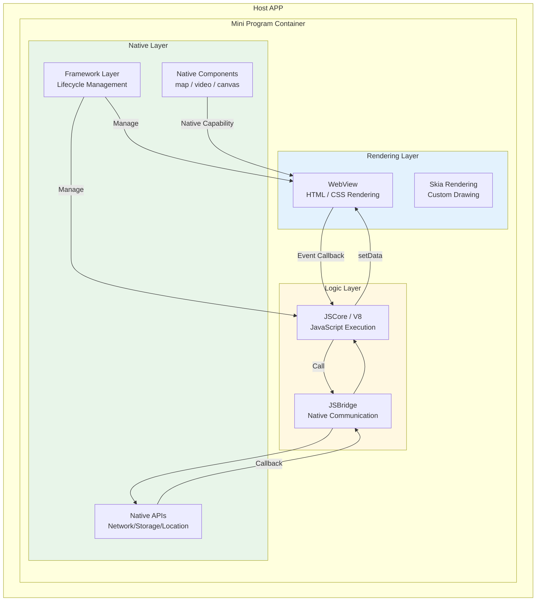
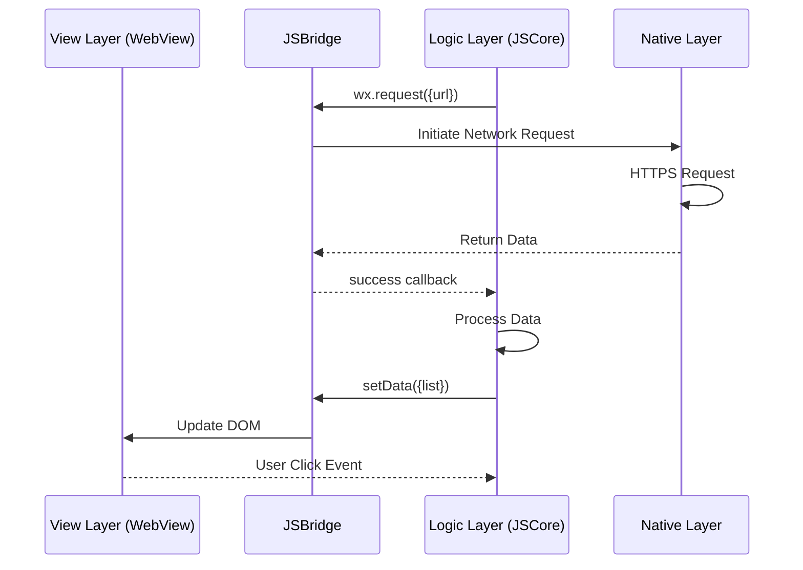
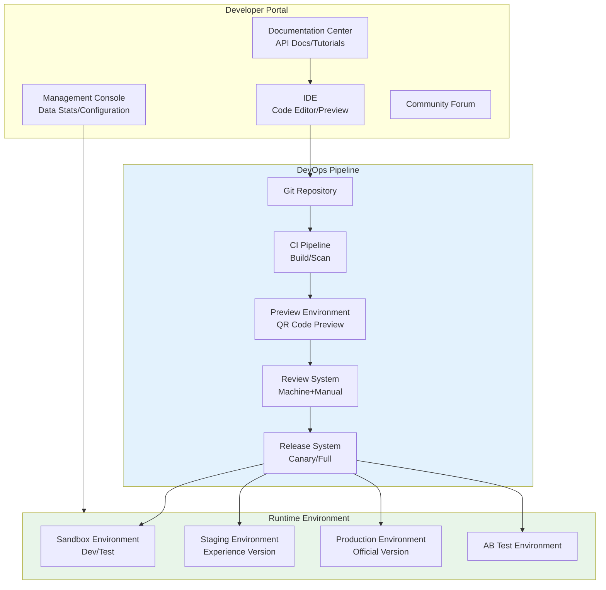
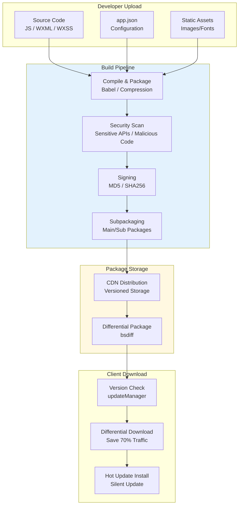
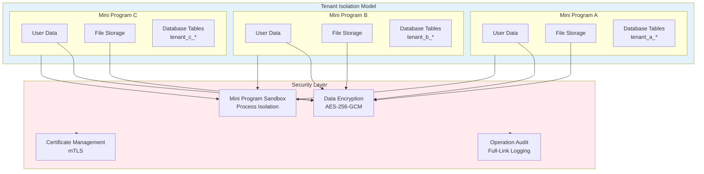
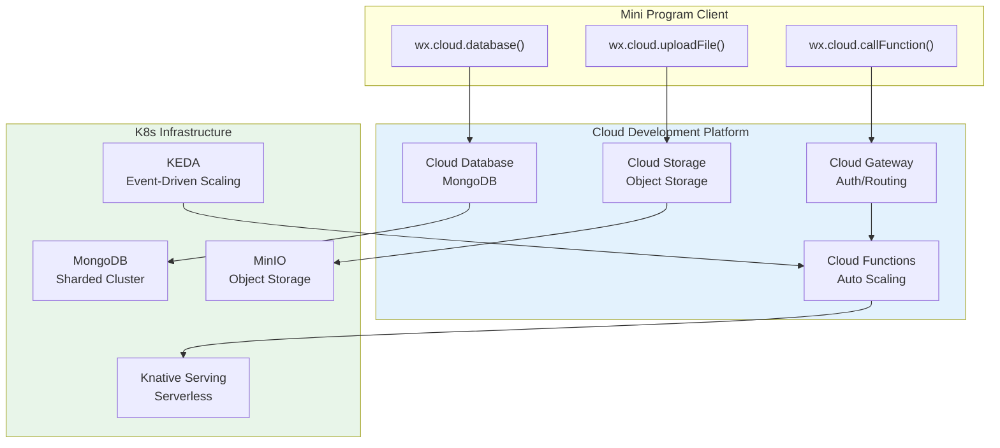
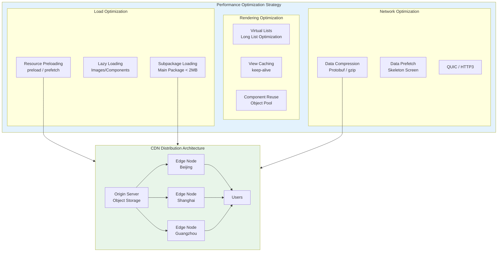

---title: Mini Program Platform Kubernetes Production Architecture Design
description: 'title: Mini Program Platform Architecture Design'
summary: 'title: Mini Program Platform Architecture Design'
category: general
tags:
- architecture
- best-practice
- prometheus
- docker
- minio
- kafka
- gateway
- serverless
- rag
tier: core
created: '2026-05-23'
last_updated: 2026-05
difficulty: intermediate
reading_level: intermediate
audience:
- All Engineers
estimated_read_time: 15min
intent_queries:
- What is Mini Program Platform Kubernetes Production Architecture Design
- How to implement Mini Program Platform Kubernetes Production Architecture Design
- Kubernetes 20 application patterns best practices
trigger_keywords:
- Mini Program Platform
- Kubernetes
- Production Architecture Design
- application
- patterns
prerequisites:
- kubectl-basics
- prometheus-basics
- kafka-basics
authors:
- name: Dillan Teagle
  role: contributor
source_path: /Users/teaglebuilt/github/teaglebuilt/knowledge/tree/application/architecture/mini-program-architecture.md
original_language: Chinese
---

> **Production Environment Safety Notice**
>
> This document contains operational commands that can be executed directly. Before executing, confirm: the target cluster and namespace are correct; you have sufficient RBAC permissions; the command has been tested in a non-production environment. Risk levels for commands: 🔴 High risk (may cause data loss or service interruption), 🟡 Medium risk (modifies cluster state but usually reversible), 🟢 Low risk/read-only (information gathering, no side effects).

title: Mini Program Platform Architecture Design
description: '# Mini Program Platform [[Kubernetes|Kubernetes]] Production Architecture Design'
category: application-architecture
tags:
- k8s
- architecture
- industry
- [[Prometheus|prometheus]]
- docker
- minio
- kafka
- gateway
- serverless
- rag
last_updated: 2026-05-18
difficulty: advanced
reading_level: advanced
audience:
- Mini Program Platform Architects
- Frontend Development Engineers
- Serverless Engineers
estimated_read_time: 5min
intent_queries:
- Mini Program Platform Kubernetes High Concurrency Architecture
- WeChat Alipay Douyin Mini Program Runtime
- Serverless Cloud Functions Knative
- Mini Program Security Sandbox Isolation
- Alibaba Cloud ACK Mini Program Cloud
trigger_keywords:
- Mini Program Platform
- WeChat Mini Program
- Alipay Mini Program
- Serverless
- Knative
- Cloud Functions
- Sandbox Isolation
- Hot Update
- Canary Release
- Review System
related_domains:
- domain-03-networking-traffic
- domain-10-troubleshooting-diagnostics
related_topics:
- topic-mini-program-architecture
- topic-serverless-architecture
k8s_versions:
- '1.28'
- '1.29'
- '1.30'
- '1.31'
- '1.32'
---

# Mini Program Platform Kubernetes Production Architecture Design

> **Applicable Scenarios**: WeChat Mini Programs / Alipay Mini Programs / Douyin Mini Programs / Kuaishou Mini Programs / Custom Mini Programs
> **Applicable Versions**: Kubernetes v1.29 - v1.33
> **Last Updated**: 2026-04-24
> **Target Readers**: Mini Program Platform Architects, Frontend/Backend Development TLs

---

## Table of Contents

- [1. Overall Architecture Overview](#1-overall-architecture-overview)
- [2. Mini Program Runtime Architecture](#2-mini-program-runtime-architecture)
- [3. Developer Platform Architecture](#3-developer-platform-architecture)
- [4. Mini Program Release & Review Architecture](#4-mini-program-release--review-architecture)
- [5. Data Isolation & Security Architecture](#5-data-isolation--security-architecture)
- [6. Serverless Backend Architecture](#6-serverless-backend-architecture)
- [7. Performance Optimization & CDN Architecture](#7-performance-optimization--cdn-architecture)
- [8. K8s Deployment Architecture](#8-k8s-deployment-architecture)

---

## 1. Overall Architecture Overview

```mermaid
flowchart TB
    subgraph Client["Client Layer"]
        WECHAT["WeChat Client<br/>JSRuntime + Native Rendering"]
        ALIPAY["Alipay Client"]
        DOUYIN["Douyin Client"]
        BAIDU["Baidu APP"]
        WEBVIEW["Generic WebView"]
    end

    subgraph Gateway["Access Gateway Layer"]
        DNS["Intelligent DNS"]
        LB["L7 Load Balancing"]
        API_GW["API Gateway<br/>Auth/Rate Limiting/Routing"]
        CDN["CDN / Edge<br/>Static Resource Acceleration"]
    end

    subgraph Platform["Platform Service Layer"]
        AUTH["Authorization Center<br/>OAuth2 / Code2Session"]
        RUNTIME["Mini Program Runtime<br/>JSSDK / Component Library"]
        SANDBOX["Sandbox Isolation<br/>Container/VM"]
        DEV_TOOLS["Developer Tools<br/>IDE / Debugger"]
    end

    subgraph Biz["Business Service Layer"]
        APP_MGMT["App Management<br/>Create/Configure/Version"]
        USER_MGMT["User Management<br/>OpenID / UnionID"]
        DATA_API["Data Interface<br/>Cloud Functions / Cloud Database"]
        PAYMENT["Payment Service<br/>Mini Program Payment"]
        MSG["Message Push<br/>Subscription / Template Messages"]
        ANALYTICS["Data Analytics<br/>Event Tracking / Funnels"]
    end

    subgraph Infra["Infrastructure Layer"]
        K8S["Kubernetes Cluster"]
        SERVERLESS["Serverless Runtime<br/>Knative / OpenFunction"]
        DB["Database Cluster"]
        CACHE["Cache Cluster"]
        OSS["Object Storage"]
    end

    Client --> Gateway
    Gateway --> Platform --> Biz --> Infra

    style Platform fill:#e3f2fd
    style Biz fill:#fff8e1
    style Infra fill:#e8f5e9
```



---

## 2. Mini Program Runtime Architecture



## Dual-Thread Model Communication



---

## 3. Developer Platform Architecture



---

## 4. Mini Program Release & Review Architecture



---

## 5. Data Isolation & Security Architecture



---

## 6. Serverless Backend Architecture



---

## 7. Performance Optimization & CDN Architecture



---

## 8. K8s Deployment Architecture

## Knative Cloud Function Configuration

```yaml
apiVersion: serving.knative.dev/v1
kind: Service
metadata:
  name: miniapp-cloud-function
  namespace: miniapp-serverless
spec:
  template:
    metadata:
      annotations:
        autoscaling.knative.dev/minScale: "0"
        autoscaling.knative.dev/maxScale: "100"
        autoscaling.knative.dev/targetConcurrency: "10"
        autoscaling.knative.dev/scale-down-delay: "5m"
    spec:
      containerConcurrency: 10
      timeoutSeconds: 30
      containers:
        - image: miniapp/cloud-function-runtime:v1.0
          ports:
            - containerPort: 8080
          env:
            - name: FUNCTION_NAME
              value: "user-login"
            - name: DB_URI
              valueFrom:
                secretKeyRef:
                  name: cloud-db-secret
                  key: uri
          resources:
            requests:
              cpu: "100m"
              memory: "128Mi"
            limits:
              cpu: "1"
              memory: "512Mi"
---
# KEDA scaling based on queue length
apiVersion: keda.sh/v1alpha1
kind: ScaledObject
metadata:
  name: miniapp-function-scaler
  namespace: miniapp-serverless
spec:
  scaleTargetRef:
    name: miniapp-cloud-function
  minReplicaCount: 0
  maxReplicaCount: 100
  triggers:
    - type: kafka
      metadata:
        bootstrapServers: kafka:9092
        consumerGroup: miniapp-functions
        topic: function-invocations
        lagThreshold: "10"
```

---

## Reference Links

- [WeChat Mini Program Official Docs](https://developers.weixin.qq.com/miniprogram/dev/framework/)
- [Alipay Mini Program Architecture](https://opendocs.alipay.com/mini/introduce)
- [Knative Documentation](https://knative.dev/docs/)

---

## Obsidian Related Documents

- topic-application-architecture MOC
- [[domain-20-application-patterns/topic-application-architecture/README.md|Topic Application Architecture Design Best Practices]]
- [[domain-20-application-patterns/topic-application-architecture/01-ecommerce-architecture.md|E-Commerce System Kubernetes Production Architecture Design]]
- [[domain-20-application-patterns/topic-application-architecture/03-cms-architecture.md|CMS Content Management System Architecture Design]]
- [[domain-20-application-patterns/topic-application-architecture/04-im-rtc-architecture.md|Real-Time Communication IM/RTC Architecture Design]]
- [[domain-20-application-patterns/topic-application-architecture/05-online-education-architecture.md|Online Education Platform Kubernetes Production Architecture Design]]
- [[domain-20-application-patterns/topic-application-architecture/06-fintech-architecture.md|FinTech Financial Technology Kubernetes Production Architecture Design]]
- [[domain-20-application-patterns/topic-application-architecture/07-iot-platform-architecture.md|IoT Internet of Things Platform Architecture Design]]
- [[domain-20-application-patterns/topic-application-architecture/08-ai-ml-inference-architecture.md|AI/ML Inference Service Kubernetes Production Architecture Design]]
- [[domain-20-application-patterns/topic-application-architecture/09-gaming-backend-architecture.md|Gaming Backend Kubernetes Production Architecture Design]]
- [[domain-20-application-patterns/topic-application-architecture/10-social-media-architecture.md|Social Media Platform Kubernetes Production Architecture Design]]
- [[domain-20-application-patterns/topic-application-architecture/11-smart-retail-architecture.md|Smart Retail & New Retail Kubernetes Production Architecture Design]]

## See Also

- 96-carbon-capture
- 01-ecommerce-architecture
- 03-cms-architecture
- 04-im-rtc-architecture


<!-- risk-assessed -->
