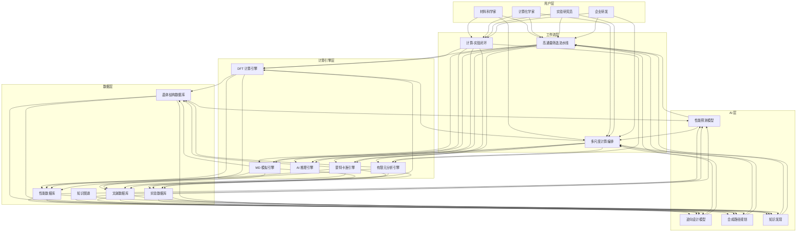
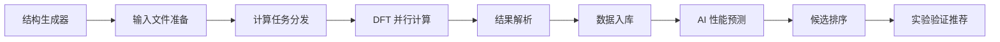
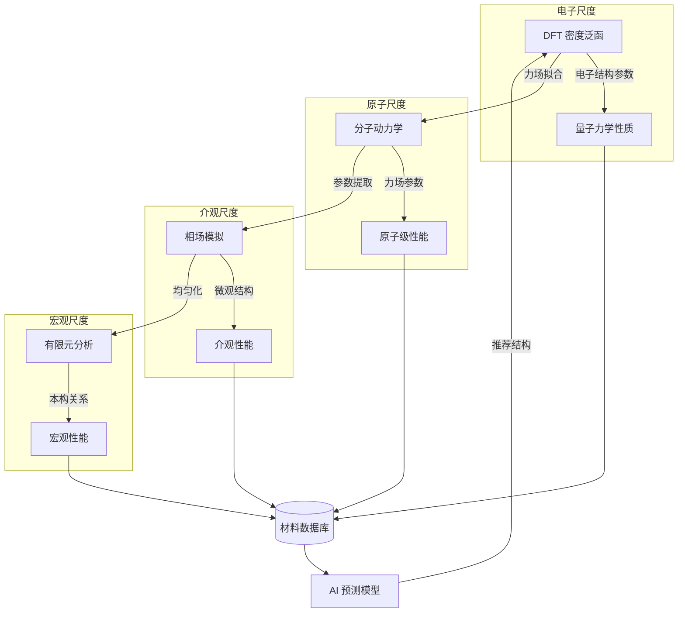

---title: 纳米材料架构设计 — 阿里云视角
description: 'title: 纳米材料架构设计'
summary: 'title: 纳米材料架构设计'
category: general
tags:
- architecture
- best-practice
- docker
- opa
- job
- gpu
- nvidia
tier: supporting
created: '2026-05-23'
last_updated: 2026-05
difficulty: intermediate
reading_level: intermediate
audience:
- 所有工程师
estimated_read_time: 25min
intent_queries:
- 纳米材料架构设计 — 阿里云视角 是什么
- 如何 纳米材料架构设计 — 阿里云视角
- Kubernetes 20 application patterns 最佳实践
trigger_keywords:
- 纳米材料架构设计
- 阿里云视角
- application
- patterns
prerequisites:
- kubectl-basics
- prometheus-basics
- gpu-scheduling-basics
- policy-basics
authors:
- name: Dillan Teagle
  role: contributor

---

> **生产环境安全提示**
>
> 本文档包含可直接执行的运维命令。执行前请确认：当前目标集群与 Namespace 是否正确；是否具备足够的 RBAC 权限；是否已在非生产环境验证。命令风险等级标注：🔴 高风险（可能造成数据丢失或服务中断）、🟡 中风险（会修改集群状态，但通常可回滚）、🟢 低风险/只读（信息收集，无副作用）。


title: 纳米材料架构设计
description: '# 纳米材料架构设计 — 阿里云视角'
category: application-architecture
tags:
- k8s
- architecture
- industry
- docker
- opa
- job
- gpu
- nvidia
last_updated: 2026-05-18
difficulty: expert
reading_level: expert
audience:
- 材料科学研究员
- 计算材料架构师
- 材料研发IT负责人
- HPC工程师
estimated_read_time: 5min
intent_queries:
- nanomaterials [[Kubernetes|kubernetes]] architecture
- 纳米材料高通量计算K8s
- 材料基因组平台设计
- 分子动力学模拟HPC
- 材料AI预测平台
trigger_keywords:
- 纳米材料
- 材料基因组
- 分子模拟
- 高通量计算
- DFT
- 分子动力学
- 材料AI
- 纳米材料架构
- 材料研发
- 计算材料学
related_domains:
- domain-01-cluster-fundamentals
- domain-03-networking-traffic
related_topics:
- solid-state-battery
- crispr-gene-editing
- neuromorphic-computing
k8s_versions:
- '1.28'
- '1.29'
- '1.30'
- '1.31'
- '1.32'
---

# 纳米材料架构设计 — 阿里云视角

> **适用版本**: Kubernetes v1.29 - v1.33 | **最后更新**: 2026-04-24
> **作者**: 阿里云解决方案架构师 | **标签**: `#纳米材料` `#材料基因组` `#分子模拟` `#高通量计算` `#阿里云`

---

<!-- chunk: 目录 -->## 目录

1. [概述](#1-概述)
2. [设计原则](#2-设计原则)
3. [架构模式](#3-架构模式)
4. [实现示例](#4-实现示例)
5. [在 Kubernetes 上的部署](#5-在-kubernetes-上的部署)
6. [最佳实践](#6-最佳实践)
7. [反模式](#7-反模式)
8. [参考资源](#8-参考资源)

---

<!-- chunk: 1. 概述 -->## 1. 概述

纳米材料是指在纳米尺度（1-100nm）上具有特殊性能的材料。纳米材料研发是材料科学、物理学、化学、生物学交叉融合的前沿领域，对新能源、电子信息、生物医药、航空航天等战略性新兴产业具有深远影响。

纳米材料的信息化平台需要支撑从原子级计算模拟到宏观性能预测的完整链条。这是一个典型的高性能计算（HPC）与人工智能（AI）深度融合的场景：密度泛函理论（DFT）计算需要 CPU 密集型算力，分子动力学（MD）模拟需要 GPU 加速，材料性能预测需要深度学习模型，高通量筛选需要大规模并行计算。

从架构角度看，纳米材料平台需要解决三个核心问题：一是如何高效管理大规模计算任务（每天数千个 DFT/MD 计算任务）；二是如何管理和关联海量材料数据（结构、性能、文献、实验数据）；三是如何建立计算-实验闭环，加速材料发现周期。

## 1.1 行业背景

| 挑战 | 说明 | 架构影响 |
|:---|:---|:---|
| 多尺度模拟 | 从量子（埃）到宏观（米）跨越 10 个数量级 | 多层级计算编排 |
| 高通量筛选 | 材料组合空间呈指数增长 | 大规模并行 Job |
| 实验验证 | 计算预测需要实验验证闭环 | LIMS 集成 |
| 性能预测 | 构效关系建模复杂 | 深度学习 + 图神经网络 |
| 安全评估 | 纳米材料毒理学数据匮乏 | 数据收集 + 风险模型 |

## 1.2 核心场景

- **材料计算**: DFT（VASP/Quantum ESPRESSO）、MD（LAMMPS/GROMACS）、有限元（FEniCS）模拟
- **高通量筛选**: 自动化计算流水线，每日处理数千材料组合
- **材料基因组**: 数据驱动材料发现，基于大数据和 AI 加速新材料研发
- **性能预测**: 图神经网络预测材料力学/电学/光学/热学性能
- **安全评估**: 纳米材料毒理学数据库和风险评估系统

---

<!-- chunk: 2. 设计原则 -->## 2. 设计原则

## 2.1 计算-数据-AI 闭环原则

纳米材料研发的核心方法论是"计算-数据-AI"闭环：通过第一性原理计算生成高质量材料数据，将数据用于训练 AI 预测模型，AI 模型指导新的计算方向，形成正向循环。架构设计需要支撑这一闭环的数据流和计算流。

## 2.2 多尺度协同原则

材料模拟涉及从电子结构（DFT）到分子动力学（MD）到相场模拟再到有限元分析的多尺度计算。架构需要支持跨尺度的计算编排和数据传递，包括参数自动传递、网格自适应、结果可视化等。

## 2.3 高通量自动化原则

高通量筛选的核心是自动化。从材料结构生成、输入文件准备、计算提交、结果解析到数据入库的每个环节都需要自动化。架构设计需要基于工作流引擎（如 Argo Workflows、FireWorks）构建可编排、可复现的计算流水线。

## 2.4 数据标准化原则

材料数据的标准化是实现数据共享和 AI 训练的基础。架构设计需要采用国际通用的材料数据标准（如 CIF、POSCAR、LMDB），建立统一的数据模型和 API，支持与 Materials Project、AFLOW、OQMD 等国际数据库的数据互通。

---

<!-- chunk: 3. 架构模式 -->## 3. 架构模式

## 3.1 纳米材料平台全景架构



## 3.2 高通量筛选流水线架构



## 3.3 多尺度计算编排架构



---

<!-- chunk: 4. 实现示例 -->## 4. 实现示例

## 4.1 高通量材料结构生成器

```python
from pymatgen.core import Structure, Lattice
from pymatgen.analysis.structure_prediction import StructurePredictor
from itertools import product
import numpy as np
from typing import List, Tuple

class HighThroughputStructureGenerator:
    def __init__(self, space_groups: List[int], compositions: List[str]):
        self.space_groups = space_groups
        self.compositions = compositions

    def generate_structures(self) -> List[Structure]:
        structures = []
        for sg in self.space_groups:
            for comp in self.compositions:
                generated = self._generate_for_composition(sg, comp)
                structures.extend(generated)
        return self._filter_duplicates(structures)

    def _generate_for_composition(self, space_group: int,
                                   composition: str) -> List[Structure]:
        elements = self._parse_composition(composition)
        structures = []

        lattice_params = self._sample_lattice_params(space_group)
        wyckoff_sites = self._get_wyckoff_positions(space_group, elements)

        for lp in lattice_params:
            for sites in wyckoff_sites:
                try:
                    lattice = self._create_lattice(space_group, lp)
                    structure = Structure(lattice, sites['elements'],
                                          sites['coords'])
                    if self._check_structure_validity(structure):
                        structures.append(structure)
                except Exception:
                    continue

        return structures

    def _sample_lattice_params(self, space_group: int,
                                n_samples: int = 100) -> List[dict]:
        params = []
        for _ in range(n_samples):
            a = np.random.uniform(3.0, 10.0)
            b = np.random.uniform(3.0, 10.0)
            c = np.random.uniform(3.0, 10.0)
            alpha = np.random.uniform(60, 120)
            beta = np.random.uniform(60, 120)
            gamma = np.random.uniform(60, 120)
            params.append({
                'a': a, 'b': b, 'c': c,
                'alpha': alpha, 'beta': beta, 'gamma': gamma
            })
        return params

    def _parse_composition(self, composition: str) -> dict:
        result = {}
        for part in composition.split('-'):
            result[part.strip()] = 1
        return result

    def _get_wyckoff_positions(self, sg, elements):
        return [{'elements': list(elements.keys()),
                 'coords': 0, 0, 0], [0.5, 0.5, 0.5}]

    def _create_lattice(self, sg, params):
        return Lattice.from_parameters(
            params['a'], params['b'], params['c'],
            params['alpha'], params['beta'], params['gamma']
        )

    def _check_structure_validity(self, structure) -> bool:
        if structure.volume < 1.0:
            return False
        min_dist = min(structure.distance_matrix[structure.distance_matrix > 0])
        return min_dist > 0.8

    def _filter_duplicates(self, structures: List[Structure]) -> List[Structure]:
        unique = []
        seen = set()
        for s in structures:
            key = s.composition.reduced_formula + str(round(s.volume, 2))
            if key not in seen:
                seen.add(key)
                unique.append(s)
        return unique
```

## 4.2 材料性能预测图神经网络

```python
import torch
import torch.nn as nn
from torch_geometric.nn import MessagePassing, global_mean_pool

class CrystalGraphConvLayer(MessagePassing):
    def __init__(self, in_channels, out_channels):
        super().__init__(aggr='mean')
        self.lin_node = nn.Linear(in_channels, out_channels)
        self.lin_message = nn.Linear(in_channels * 2, out_channels)
        self.bn = nn.BatchNorm1d(out_channels)

    def forward(self, x, edge_index, edge_weight=None):
        x = self.lin_node(x)
        out = self.propagate(edge_index, x=x, edge_weight=edge_weight)
        return self.bn(out + x)

    def message(self, x_i, x_j, edge_weight):
        msg = self.lin_message(torch.cat([x_i, x_j], dim=-1))
        if edge_weight is not None:
            msg = msg * edge_weight.view(-1, 1)
        return msg

class MaterialPropertyPredictor(nn.Module):
    def __init__(self, node_dim=92, hidden_dim=128, num_layers=4):
        super().__init__()
        self.embedding = nn.Linear(node_dim, hidden_dim)

        self.conv_layers = nn.ModuleList([
            CrystalGraphConvLayer(hidden_dim, hidden_dim)
            for _ in range(num_layers)
        ])

        self.predictor = nn.Sequential(
            nn.Linear(hidden_dim, hidden_dim),
            nn.ReLU(),
            nn.Dropout(0.1),
            nn.Linear(hidden_dim, hidden_dim // 2),
            nn.ReLU(),
            nn.Linear(hidden_dim // 2, 1)
        )

    def forward(self, data):
        x, edge_index, batch = data.x, data.edge_index, data.batch

        x = self.embedding(x)

        for conv in self.conv_layers:
            x = conv(x, edge_index)
            x = torch.relu(x)

        x = global_mean_pool(x, batch)

        return self.predictor(x).squeeze(-1)
```

## 4.3 高通量计算任务管理器

```go
package htcompute

import (
    "context"
    "fmt"
    "sync"
    "time"
)

type ComputeTask struct {
    ID          string
    MaterialID  string
    CalcType    string
    Status      TaskStatus
    InputRef    string
    OutputRef   string
    SubmittedAt time.Time
    CompletedAt time.Time
}

type TaskStatus string

const (
    StatusPending   TaskStatus = "pending"
    StatusRunning   TaskStatus = "running"
    StatusCompleted TaskStatus = "completed"
    StatusFailed    TaskStatus = "failed"
)

type TaskManager struct {
    tasks     map[string]*ComputeTask
    tasksMu   sync.RWMutex
    maxConcur int
    sem       chan struct{}
}

func NewTaskManager(maxConcurrent int) *TaskManager {
    return &TaskManager{
        tasks:     make(map[string]*ComputeTask),
        maxConcur: maxConcurrent,
        sem:       make(chan struct{}, maxConcurrent),
    }
}

func (tm *TaskManager) SubmitBatch(tasks []*ComputeTask) error {
    var wg sync.WaitGroup
    errCh := make(chan error, len(tasks))

    for _, task := range tasks {
        wg.Add(1)
        go func(t *ComputeTask) {
            defer wg.Done()

            tm.sem <- struct{}{}
            defer func() { <-tm.sem }()

            t.Status = StatusRunning
            tm.updateTask(t)

            err := tm.executeTask(t)
            if err != nil {
                t.Status = StatusFailed
                errCh <- fmt.Errorf("task %s failed: %w", t.ID, err)
            } else {
                t.Status = StatusCompleted
                t.CompletedAt = time.Now()
            }
            tm.updateTask(t)
        }(task)
    }

    go func() {
        wg.Wait()
        close(errCh)
    }()

    return nil
}

func (tm *TaskManager) executeTask(task *ComputeTask) error {
    ctx, cancel := context.WithTimeout(context.Background(), 4*time.Hour)
    defer cancel()

    switch task.CalcType {
    case "dft":
        return tm.runDFT(ctx, task)
    case "md":
        return tm.runMD(ctx, task)
    case "ml-predict":
        return tm.runMLPredict(ctx, task)
    default:
        return fmt.Errorf("unknown calc type: %s", task.CalcType)
    }
}

func (tm *TaskManager) updateTask(task *ComputeTask) {
    tm.tasksMu.Lock()
    defer tm.tasksMu.Unlock()
    tm.tasks[task.ID] = task
}

func (tm *TaskManager) runDFT(ctx context.Context, task *ComputeTask) error { return nil }
func (tm *TaskManager) runMD(ctx context.Context, task *ComputeTask) error   { return nil }
func (tm *TaskManager) runMLPredict(ctx context.Context, task *ComputeTask) error { return nil }
```

---

<!-- chunk: 5. 在 Kubernetes 上的部署 -->## 5. 在 Kubernetes 上的部署

## 5.1 高通量计算 GPU Job

```yaml
apiVersion: batch/v1
kind: Job
metadata:
  name: ht-screening-batch-001
  namespace: nanomaterials
  labels:
    calc-type: high-throughput
    project: nano-catalyst
spec:
  parallelism: 100
  completions: 1000
  completionMode: Indexed
  backoffLimit: 3
  template:
    metadata:
      labels:
        calc-type: high-throughput
    spec:
      nodeSelector:
        accelerator: nvidia-a100
      runtimeClassName: nvidia
      containers:
        - name: screening
          image: registry.cn-hangzhou.aliyuncs.com/nano/ht-screening:v2.0.0-gpu
          command: ["python", "run_screening.py"]
          args:
            - "--batch-id=$(JOB_COMPLETION_INDEX)"
            - "--output-dir=/output/batch-$(JOB_COMPLETION_INDEX)"
          env:
            - name: JOB_COMPLETION_INDEX
              valueFrom:
                fieldRef:
                  fieldPath: metadata.annotations['batch.kubernetes.io/job-completion-index']
            - name: BATCH_SIZE
              value: "10"
            - name: CALC_METHOD
              value: "dft"
          resources:
            requests:
              nvidia.com/gpu: 1
              memory: "32Gi"
              cpu: "8000m"
            limits:
              nvidia.com/gpu: 1
              memory: "64Gi"
              cpu: "16000m"
          volumeMounts:
            - name: structures
              mountPath: /input
            - name: results
              mountPath: /output
      volumes:
        - name: structures
          persistentVolumeClaim:
            claimName: structures-pvc
        - name: results
          persistentVolumeClaim:
            claimName: results-pvc
      restartPolicy: OnFailure
```

## 5.2 AI 推理服务

```yaml
apiVersion: apps/v1
kind: Deployment
metadata:
  name: property-predictor
  namespace: nanomaterials
spec:
  replicas: 3
  selector:
    matchLabels:
      app: property-predictor
  template:
    metadata:
      labels:
        app: property-predictor
    spec:
      nodeSelector:
        accelerator: nvidia-t4
      runtimeClassName: nvidia
      containers:
        - name: predictor
          image: registry.cn-hangzhou.aliyuncs.com/nano/property-predictor:v2.0.0-gpu
          ports:
            - containerPort: 8080
          env:
            - name: MODEL_PATH
              value: "/models/crystal-gnn-v3"
            - name: GPU_MEMORY_FRACTION
              value: "0.8"
          resources:
            requests:
              nvidia.com/gpu: 1
              memory: "8Gi"
              cpu: "4000m"
            limits:
              nvidia.com/gpu: 1
              memory: "16Gi"
              cpu: "8000m"
          readinessProbe:
            httpGet:
              path: /health
              port: 8080
            periodSeconds: 5
---
apiVersion: v1
kind: Service
metadata:
  name: property-predictor
  namespace: nanomaterials
spec:
  selector:
    app: property-predictor
  ports:
    - port: 8080
      targetPort: 8080
```

## 5.3 材料数据 API 服务

```yaml
apiVersion: apps/v1
kind: Deployment
metadata:
  name: materials-api
  namespace: nanomaterials
spec:
  replicas: 3
  selector:
    matchLabels:
      app: materials-api
  template:
    metadata:
      labels:
        app: materials-api
    spec:
      containers:
        - name: api
          image: registry.cn-hangzhou.aliyuncs.com/nano/materials-api:v2.0.0
          ports:
            - containerPort: 8080
          env:
            - name: DB_HOST
              valueFrom:
                configMapKeyRef:
                  name: nano-config
                  key: db-host
            - name: OSS_BUCKET
              value: "nano-structures"
          resources:
            requests:
              memory: "2Gi"
              cpu: "1000m"
            limits:
              memory: "4Gi"
              cpu: "2000m"
```

---

<!-- chunk: 6. 最佳实践 -->## 6. 最佳实践

## 6.1 计算资源管理

- **GPU 共享调度**: 使用 GPU 时间分片（MPS/MIG）提高 GPU 利用率，DFT 后处理和 AI 推理可共享 GPU
- **弹性队列调度**: 使用 Kubernetes Volcano 或 YuniKorn 管理计算队列，支持优先级抢占和公平调度
- **Spot 实例利用**: 非紧急计算任务使用抢占式实例，降低成本 70%+
- **检查点机制**: 长时间 DFT 计算任务定期保存检查点，失败后可从检查点恢复

## 6.2 数据管理

- **数据版本化**: 使用 DVC（Data Version Control）管理材料数据集，支持数据溯源和可复现性
- **分级存储**: 热数据（活跃项目）存 SSD、温数据（已完成项目）存 HDD、冷数据（历史数据）归档 OSS
- **标准化接口**: 提供符合 OPTIMADE 标准的 REST API，支持与 Materials Project 等数据库互操作

## 6.3 AI 模型管理

- **模型注册中心**: 使用 MLflow 或 PAI 模型管理平台管理模型版本和实验记录
- **自动重训练**: 当新数据积累到一定量时，自动触发模型重训练和评估
- **模型蒸馏**: 将大型 GNN 模型蒸馏为轻量模型，用于在线推理场景

---

<!-- chunk: 7. 反模式 -->## 7. 反模式

## 7.1 计算与数据脱节

大量计算任务盲目执行，不建立系统化的数据收集和管理机制，导致计算结果散落无法复用。

**解决方案**: 建立统一的材料数据库，所有计算任务的结果自动解析入库。通过标准 API 提供数据访问，确保计算产出的数据可发现、可访问、可复用。

## 7.2 单一尺度模拟

仅关注单一尺度的计算（如只做 DFT 或只做 MD），忽视跨尺度信息的传递和协同。

**解决方案**: 构建多尺度计算编排平台，支持从 DFT 到 MD 到介观到宏观的自动参数传递。使用 AI 模型建立跨尺度映射，减少多尺度耦合计算的成本。

## 7.3 忽视计算可复现性

计算环境、软件版本、参数设置等信息不记录，导致计算结果无法复现。

**解决方案**: 使用容器化（Docker/Singularity）封装计算环境，使用工作流引擎记录完整的计算流程和参数。确保每个计算结果都能追溯到完整的输入和执行环境。

## 7.4 AI 模型过度拟合

训练数据量不足或多样性不够时，AI 模型可能对已知材料过度拟合，对新材料预测能力差。

**解决方案**: 使用交叉验证评估模型泛化能力。对 AI 预测结果进行不确定性量化（如集成方法）。将 AI 预测结果与 DFT 计算进行对比验证。

## 7.5 数据孤岛

不同研究组、不同项目之间的数据不共享，形成数据孤岛，限制了数据驱动发现的能力。

**解决方案**: 建立统一的数据共享平台，采用标准数据格式和 API。通过数据访问控制和贡献激励机制促进数据共享。

---

<!-- chunk: 8. 参考资源 -->## 8. 参考资源

## 8.1 阿里云组件映射

| 功能域 | **阿里云云原生方案** |
|:---|:---|
| 容器平台 | **ACK Pro + GPU** |
| 高性能计算 | **E-HPC** |
| AI 平台 | **PAI + DSW** |
| 对象存储 | **OSS + 归档存储** |
| 数据库 | **PolarDB + Lindorm** |
| 工作流 | **Argo Workflows on ACK** |
| 可观测性 | **ARMS + SLS** |

## 8.2 生产检查清单

- [ ] 计算模型精度与实验数据对比验证
- [ ] 高通量计算并行效率（> 80%）
- [ ] AI 预测模型在测试集上的 MAE/R² 达标
- [ ] 纳米材料安全评估报告完成
- [ ] 核心配方数据加密隔离
- [ ] 计算环境可复现性验证
- [ ] 数据备份与灾难恢复演练
- [ ] GPU 集群利用率监控告警

## 8.3 外部参考

- Materials Project (materialsproject.org) — 材料数据库
- OPTIMADE API Specification — 材料数据 API 标准
- pymatgen — Python 材料分析库
- VASP / Quantum ESPRESSO — DFT 计算软件
- LAMMPS / GROMACS — 分子动力学模拟软件
- CGCNN / MEGNet — 晶体图神经网络模型

---

**维护者**: 阿里云解决方案架构师团队 | **许可证**: MIT

---

<!-- chunk: Obsidian 相关文档 -->## Obsidian 相关文档

- topic-application-architecture MOC
- [[domain-20-application-patterns/topic-application-architecture/README.md|Topic 应用层架构设计最佳实践]]
- [[domain-20-application-patterns/topic-application-architecture/01-ecommerce-architecture.md|电商系统 Kubernetes 生产架构设计]]
- [[domain-20-application-patterns/topic-application-architecture/02-mini-program-architecture.md|小程序平台架构设计]]
- [[domain-20-application-patterns/topic-application-architecture/03-cms-architecture.md|内容管理系统 CMS 架构设计]]
- [[domain-20-application-patterns/topic-application-architecture/04-im-rtc-architecture.md|实时通信 IM/RTC 架构设计]]
- [[domain-20-application-patterns/topic-application-architecture/05-online-education-architecture.md|在线教育平台 Kubernetes 生产架构设计]]
- [[domain-20-application-patterns/topic-application-architecture/06-fintech-architecture.md|金融科技FinTech Kubernetes生产架构设计]]
- [[domain-20-application-patterns/topic-application-architecture/07-iot-platform-architecture.md|物联网 IoT 平台架构设计]]
- [[domain-20-application-patterns/topic-application-architecture/08-ai-ml-inference-architecture.md|AI/ML 推理服务 Kubernetes 生产架构设计]]
- [[domain-20-application-patterns/topic-application-architecture/09-gaming-backend-architecture.md|游戏后端 Kubernetes 生产架构设计]]
- [[domain-20-application-patterns/topic-application-architecture/10-social-media-architecture.md|社交媒体平台Kubernetes生产架构设计]]

## See Also

- 86-solid-state-battery
- 87-flexible-manufacturing
- 89-crispr-gene-editing
- 90-neuromorphic-computing

## Related

- topic-application-architecture MOC — Cross-reference


<!-- risk-assessed -->
