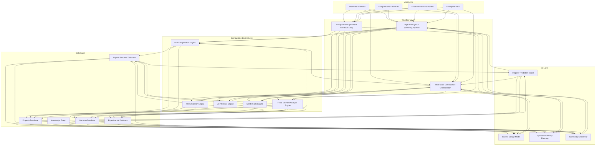
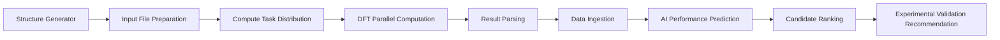
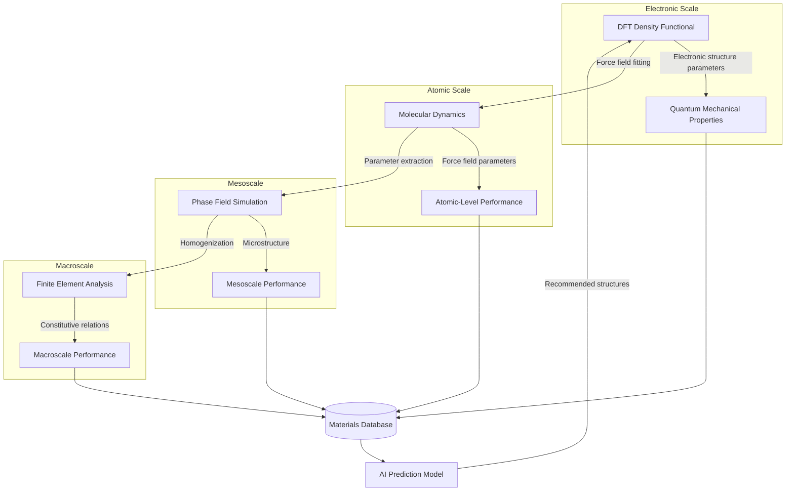

---title: Nanomaterial Architecture Design — Alibaba Cloud Perspective
description: 'title: Nanomaterial Architecture Design'
summary: 'title: Nanomaterial Architecture Design'
category: general
tags:
- architecture
- best-practice
- docker
- opa
- job
- gpu
- nvidia
tier: supporting
created: '2026-05-23'
last_updated: 2026-05
difficulty: intermediate
reading_level: intermediate
audience:
- All Engineers
estimated_read_time: 25min
intent_queries:
- What is Nanomaterial Architecture Design — Alibaba Cloud Perspective
- How to do Nanomaterial Architecture Design — Alibaba Cloud Perspective
- Kubernetes 20 application patterns best practices
trigger_keywords:
- Nanomaterial Architecture Design
- Alibaba Cloud Perspective
- application
- patterns
prerequisites:
- kubectl-basics
- prometheus-basics
- gpu-scheduling-basics
- policy-basics
authors:
- name: Dillan Teagle
  role: contributor

---

> **Production Environment Safety Notice**
>
> This document contains directly executable operational commands. Before executing, please confirm: whether the current target cluster and Namespace are correct; whether you have sufficient RBAC permissions; whether validation has been performed in a non-production environment. Command risk levels are marked as: 🔴 High Risk (may cause data loss or service interruption), 🟡 Medium Risk (modifies cluster state, but generally reversible), 🟢 Low Risk/Read-Only (information gathering, no side effects).


title: Nanomaterial Architecture Design
description: '# Nanomaterial Architecture Design — Alibaba Cloud Perspective'
category: application-architecture
tags:
- k8s
- architecture
- industry
- docker
- opa
- job
- gpu
- nvidia
last_updated: 2026-05-18
difficulty: expert
reading_level: expert
audience:
- Materials Science Researchers
- Computational Materials Architects
- Materials R&D IT Leads
- HPC Engineers
estimated_read_time: 5min
intent_queries:
- nanomaterials [[Kubernetes|kubernetes]] architecture
- Nanomaterials high-throughput computing K8s
- Materials genome platform design
- Molecular dynamics simulation HPC
- Materials AI prediction platform
trigger_keywords:
- Nanomaterials
- Materials genome
- Molecular simulation
- High-throughput computing
- DFT
- Molecular dynamics
- Materials AI
- Nanomaterial architecture
- Materials R&D
- Computational materials science
related_domains:
- domain-01-cluster-fundamentals
- domain-03-networking-traffic
related_topics:
- solid-state-battery
- crispr-gene-editing
- neuromorphic-computing
k8s_versions:
- '1.28'
- '1.29'
- '1.30'
- '1.31'
- '1.32'
---

# Nanomaterial Architecture Design — Alibaba Cloud Perspective

> **Applicable Versions**: Kubernetes v1.29 - v1.33 | **Last Updated**: 2026-04-24
> **Author**: Alibaba Cloud Solution Architect | **Tags**: `#Nanomaterials` `#MaterialsGenome` `#MolecularSimulation` `#HighThroughputComputing` `#AlibabaCloud`

---

<!-- chunk: Table of Contents -->## Table of Contents

1. [Overview](#11-industry-background)
2. [Design Principles](#21-computation-data-ai-feedback-loop-principle)
3. [Architecture Patterns](#31-nanomaterials-platform-panoramic-architecture)
4. [Implementation Examples](#41-high-throughput-materials-structure-generator)
5. [Deployment on Kubernetes](#51-high-throughput-computing-gpu-job)
6. [Best Practices](#61-compute-resource-management)
7. [Anti-Patterns](#71-disconnection-between-computation-and-data)
8. [Reference Resources](#81-alibaba-cloud-component-mapping)

---

<!-- chunk: 1. Overview -->## 1. Overview

Nanomaterials are materials with special properties at the nanoscale (1–100 nm). Nanomaterial research and development is a frontier field that integrates materials science, physics, chemistry, and biology, and has far-reaching implications for strategic emerging industries such as new energy, electronic information, biomedicine, and aerospace.

The information platform for nanomaterials must support the complete chain from atomic-level computational simulation to macroscopic property prediction. This is a typical scenario where high-performance computing (HPC) and artificial intelligence (AI) are deeply integrated: density functional theory (DFT) calculations require CPU-intensive computing power, molecular dynamics (MD) simulations require GPU acceleration, materials property prediction requires deep learning models, and high-throughput screening requires large-scale parallel computing.

From an architectural perspective, a nanomaterials platform needs to address three core challenges: first, how to efficiently manage large-scale computational tasks (thousands of DFT/MD calculation jobs per day); second, how to manage and associate massive materials data (structures, properties, literature, and experimental data); and third, how to establish a computation-experiment feedback loop to accelerate the materials discovery cycle.

## 1.1 Industry Background

| Challenge | Description | Architectural Impact |
|:---|:---|:---|
| Multi-scale simulation | Spanning 10 orders of magnitude from quantum (Ångström) to macroscopic (meter) | Multi-level computational orchestration |
| High-throughput screening | Materials composition space grows exponentially | Large-scale parallel Jobs |
| Experimental validation | Computational predictions require experimental validation loop | LIMS integration |
| Property prediction | Structure-property relationship modeling is complex | Deep learning + graph neural networks |
| Safety assessment | Nanomaterial toxicology data is scarce | Data collection + risk models |

## 1.2 Core Scenarios

- **Materials computation**: DFT (VASP/Quantum ESPRESSO), MD (LAMMPS/GROMACS), finite element (FEniCS) simulation
- **High-throughput screening**: Automated computational pipelines processing thousands of material combinations daily
- **Materials genome**: Data-driven materials discovery, accelerating new materials R&D based on big data and AI
- **Property prediction**: Graph neural networks predicting mechanical/electrical/optical/thermal properties of materials
- **Safety assessment**: Nanomaterial toxicology database and risk assessment system

---

<!-- chunk: 2. Design Principles -->## 2. Design Principles

## 2.1 Computation-Data-AI Feedback Loop Principle

The core methodology of nanomaterial R&D is the "Computation-Data-AI" feedback loop: generating high-quality materials data through first-principles calculations, using that data to train AI prediction models, and having AI models guide new computational directions, forming a virtuous cycle. The architecture must support the data flow and computation flow of this feedback loop.

## 2.2 Multi-Scale Collaboration Principle

Materials simulation involves multi-scale computation ranging from electronic structure (DFT) to molecular dynamics (MD) to phase-field simulation to finite element analysis. The architecture must support cross-scale computational orchestration and data transfer, including automatic parameter passing, adaptive meshing, and result visualization.

## 2.3 High-Throughput Automation Principle

The core of high-throughput screening is automation. Every step — from materials structure generation, input file preparation, job submission, result parsing, to database ingestion — must be automated. The architecture must be built on a workflow engine (such as Argo Workflows or FireWorks) to construct orchestrable and reproducible computational pipelines.

## 2.4 Data Standardization Principle

Standardization of materials data is the foundation for data sharing and AI training. The architecture must adopt internationally recognized materials data standards (such as CIF, POSCAR, LMDB), establish a unified data model and API, and support data interoperability with international databases such as Materials Project, AFLOW, and OQMD.

---

<!-- chunk: 3. Architecture Patterns -->## 3. Architecture Patterns

## 3.1 Nanomaterials Platform Panoramic Architecture


```mermaid
graph TB
    subgraph User Layer
        U1[Materials Scientists]
        U2[Computational Chemists]
        U3[Experimental Researchers]
        U4[Enterprise R&D]
    end

    subgraph Computation Engine Layer
        C1[DFT Computation Engine]
        C2[MD Simulation Engine]
        C3[Monte Carlo Engine]
        C4[Finite Element Analysis Engine]
        C5[AI Inference Engine]
    end

    subgraph Data Layer
        D1[Crystal Structure Database]
        D2[Property Database]
        D3[Literature Database]
        D4[Experimental Database]
        D5[Knowledge Graph]
    end

    subgraph AI Layer
        A1[Property Prediction Model]
        A2[Inverse Design Model]
        A3[Synthesis Pathway Planning]
        A4[Knowledge Discovery]
    end

    subgraph Workflow Layer
        W1[High-Throughput Screening Pipeline]
        W2[Multi-Scale Computation Orchestration]
        W3[Computation-Experiment Feedback Loop]
    end

    U1 & U2 & U3 & U4 --> W1 & W2 & W3
    W1 & W2 & W3 --> C1 & C2 & C3 & C4 & C5
    C1 & C2 & C3 & C4 --> D1 & D2 & D3 & D4
    D1 & D2 & D3 & D4 --> A1 & A2 & A3 & A4
    A1 & A2 & A3 & A4 --> W1 & W2
```
## 3.2 High-Throughput Screening Pipeline Architecture


```mermaid
flowchart LR
    A[Structure Generator] --> B[Input File Preparation]
    B --> C[Compute Task Distribution]
    C --> D[DFT Parallel Computation]
    D --> E[Result Parsing]
    E --> F[Data Ingestion]
    F --> G[AI Performance Prediction]
    G --> H[Candidate Ranking]
    H --> I[Experimental Validation Recommendation]
```

## 3.3 Multi-Scale Computation Orchestration Architecture


```mermaid
graph TB
    subgraph Electronic Scale
        DFT[DFT Density Functional]
        DFT --> |Electronic structure parameters| QM[Quantum Mechanical Properties]
    end

    subgraph Atomic Scale
        MD[Molecular Dynamics]
        MD --> |Force field parameters| AT[Atomic-Level Performance]
    end

    subgraph Mesoscale
        PF[Phase Field Simulation]
        PF --> |Microstructure| MESO[Mesoscale Performance]
    end

    subgraph Macroscale
        FEM[Finite Element Analysis]
        FEM --> |Constitutive relations| MACRO[Macroscale Performance]
    end

    DFT --> |Force field fitting| MD
    MD --> |Parameter extraction| PF
    PF --> |Homogenization| FEM

    QM --> DB[(Materials Database)]
    AT --> DB
    MESO --> DB
    MACRO --> DB

    DB --> AI[AI Prediction Model]
    AI --> |Recommended structures| DFT
```

---

<!-- chunk: 4. Implementation Examples -->## 4. Implementation Examples

## 4.1 High-Throughput Materials Structure Generator

```python
from pymatgen.core import Structure, Lattice
from pymatgen.analysis.structure_prediction import StructurePredictor
from itertools import product
import numpy as np
from typing import List, Tuple

class HighThroughputStructureGenerator:
    def __init__(self, space_groups: List[int], compositions: List[str]):
        self.space_groups = space_groups
        self.compositions = compositions

    def generate_structures(self) -> List[Structure]:
        structures = []
        for sg in self.space_groups:
            for comp in self.compositions:
                generated = self._generate_for_composition(sg, comp)
                structures.extend(generated)
        return self._filter_duplicates(structures)

    def _generate_for_composition(self, space_group: int,
                                   composition: str) -> List[Structure]:
        elements = self._parse_composition(composition)
        structures = []

        lattice_params = self._sample_lattice_params(space_group)
        wyckoff_sites = self._get_wyckoff_positions(space_group, elements)

        for lp in lattice_params:
            for sites in wyckoff_sites:
                try:
                    lattice = self._create_lattice(space_group, lp)
                    structure = Structure(lattice, sites['elements'],
                                          sites['coords'])
                    if self._check_structure_validity(structure):
                        structures.append(structure)
                except Exception:
                    continue

        return structures

    def _sample_lattice_params(self, space_group: int,
                                n_samples: int = 100) -> List[dict]:
        params = []
        for _ in range(n_samples):
            a = np.random.uniform(3.0, 10.0)
            b = np.random.uniform(3.0, 10.0)
            c = np.random.uniform(3.0, 10.0)
            alpha = np.random.uniform(60, 120)
            beta = np.random.uniform(60, 120)
            gamma = np.random.uniform(60, 120)
            params.append({
                'a': a, 'b': b, 'c': c,
                'alpha': alpha, 'beta': beta, 'gamma': gamma
            })
        return params

    def _parse_composition(self, composition: str) -> dict:
        result = {}
        for part in composition.split('-'):
            result[part.strip()] = 1
        return result

    def _get_wyckoff_positions(self, sg, elements):
        return [{'elements': list(elements.keys()),
                 'coords': 0, 0, 0], [0.5, 0.5, 0.5}]

    def _create_lattice(self, sg, params):
        return Lattice.from_parameters(
            params['a'], params['b'], params['c'],
            params['alpha'], params['beta'], params['gamma']
        )

    def _check_structure_validity(self, structure) -> bool:
        if structure.volume < 1.0:
            return False
        min_dist = min(structure.distance_matrix[structure.distance_matrix > 0])
        return min_dist > 0.8

    def _filter_duplicates(self, structures: List[Structure]) -> List[Structure]:
        unique = []
        seen = set()
        for s in structures:
            key = s.composition.reduced_formula + str(round(s.volume, 2))
            if key not in seen:
                seen.add(key)
                unique.append(s)
        return unique
```

## 4.2 Graph Neural Network for Materials Property Prediction

```python
import torch
import torch.nn as nn
from torch_geometric.nn import MessagePassing, global_mean_pool

class CrystalGraphConvLayer(MessagePassing):
    def __init__(self, in_channels, out_channels):
        super().__init__(aggr='mean')
        self.lin_node = nn.Linear(in_channels, out_channels)
        self.lin_message = nn.Linear(in_channels * 2, out_channels)
        self.bn = nn.BatchNorm1d(out_channels)

    def forward(self, x, edge_index, edge_weight=None):
        x = self.lin_node(x)
        out = self.propagate(edge_index, x=x, edge_weight=edge_weight)
        return self.bn(out + x)

    def message(self, x_i, x_j, edge_weight):
        msg = self.lin_message(torch.cat([x_i, x_j], dim=-1))
        if edge_weight is not None:
            msg = msg * edge_weight.view(-1, 1)
        return msg

class MaterialPropertyPredictor(nn.Module):
    def __init__(self, node_dim=92, hidden_dim=128, num_layers=4):
        super().__init__()
        self.embedding = nn.Linear(node_dim, hidden_dim)

        self.conv_layers = nn.ModuleList([
            CrystalGraphConvLayer(hidden_dim, hidden_dim)
            for _ in range(num_layers)
        ])

        self.predictor = nn.Sequential(
            nn.Linear(hidden_dim, hidden_dim),
            nn.ReLU(),
            nn.Dropout(0.1),
            nn.Linear(hidden_dim, hidden_dim // 2),
            nn.ReLU(),
            nn.Linear(hidden_dim // 2, 1)
        )

    def forward(self, data):
        x, edge_index, batch = data.x, data.edge_index, data.batch

        x = self.embedding(x)

        for conv in self.conv_layers:
            x = conv(x, edge_index)
            x = torch.relu(x)

        x = global_mean_pool(x, batch)

        return self.predictor(x).squeeze(-1)
```
## 4.3 High-Throughput Computing Task Manager

```go
package htcompute

import (
    "context"
    "fmt"
    "sync"
    "time"
)

type ComputeTask struct {
    ID          string
    MaterialID  string
    CalcType    string
    Status      TaskStatus
    InputRef    string
    OutputRef   string
    SubmittedAt time.Time
    CompletedAt time.Time
}

type TaskStatus string

const (
    StatusPending   TaskStatus = "pending"
    StatusRunning   TaskStatus = "running"
    StatusCompleted TaskStatus = "completed"
    StatusFailed    TaskStatus = "failed"
)

type TaskManager struct {
    tasks     map[string]*ComputeTask
    tasksMu   sync.RWMutex
    maxConcur int
    sem       chan struct{}
}

func NewTaskManager(maxConcurrent int) *TaskManager {
    return &TaskManager{
        tasks:     make(map[string]*ComputeTask),
        maxConcur: maxConcurrent,
        sem:       make(chan struct{}, maxConcurrent),
    }
}

func (tm *TaskManager) SubmitBatch(tasks []*ComputeTask) error {
    var wg sync.WaitGroup
    errCh := make(chan error, len(tasks))

    for _, task := range tasks {
        wg.Add(1)
        go func(t *ComputeTask) {
            defer wg.Done()

            tm.sem <- struct{}{}
            defer func() { <-tm.sem }()

            t.Status = StatusRunning
            tm.updateTask(t)

            err := tm.executeTask(t)
            if err != nil {
                t.Status = StatusFailed
                errCh <- fmt.Errorf("task %s failed: %w", t.ID, err)
            } else {
                t.Status = StatusCompleted
                t.CompletedAt = time.Now()
            }
            tm.updateTask(t)
        }(task)
    }

    go func() {
        wg.Wait()
        close(errCh)
    }()

    return nil
}

func (tm *TaskManager) executeTask(task *ComputeTask) error {
    ctx, cancel := context.WithTimeout(context.Background(), 4*time.Hour)
    defer cancel()

    switch task.CalcType {
    case "dft":
        return tm.runDFT(ctx, task)
    case "md":
        return tm.runMD(ctx, task)
    case "ml-predict":
        return tm.runMLPredict(ctx, task)
    default:
        return fmt.Errorf("unknown calc type: %s", task.CalcType)
    }
}

func (tm *TaskManager) updateTask(task *ComputeTask) {
    tm.tasksMu.Lock()
    defer tm.tasksMu.Unlock()
    tm.tasks[task.ID] = task
}

func (tm *TaskManager) runDFT(ctx context.Context, task *ComputeTask) error { return nil }
func (tm *TaskManager) runMD(ctx context.Context, task *ComputeTask) error   { return nil }
func (tm *TaskManager) runMLPredict(ctx context.Context, task *ComputeTask) error { return nil }
```

---

<!-- chunk: 5. Deployment on Kubernetes -->## 5. Deployment on Kubernetes

## 5.1 High-Throughput Computing GPU Job

```yaml
apiVersion: batch/v1
kind: Job
metadata:
  name: ht-screening-batch-001
  namespace: nanomaterials
  labels:
    calc-type: high-throughput
    project: nano-catalyst
spec:
  parallelism: 100
  completions: 1000
  completionMode: Indexed
  backoffLimit: 3
  template:
    metadata:
      labels:
        calc-type: high-throughput
    spec:
      nodeSelector:
        accelerator: nvidia-a100
      runtimeClassName: nvidia
      containers:
        - name: screening
          image: registry.cn-hangzhou.aliyuncs.com/nano/ht-screening:v2.0.0-gpu
          command: ["python", "run_screening.py"]
          args:
            - "--batch-id=$(JOB_COMPLETION_INDEX)"
            - "--output-dir=/output/batch-$(JOB_COMPLETION_INDEX)"
          env:
            - name: JOB_COMPLETION_INDEX
              valueFrom:
                fieldRef:
                  fieldPath: metadata.annotations['batch.kubernetes.io/job-completion-index']
            - name: BATCH_SIZE
              value: "10"
            - name: CALC_METHOD
              value: "dft"
          resources:
            requests:
              nvidia.com/gpu: 1
              memory: "32Gi"
              cpu: "8000m"
            limits:
              nvidia.com/gpu: 1
              memory: "64Gi"
              cpu: "16000m"
          volumeMounts:
            - name: structures
              mountPath: /input
            - name: results
              mountPath: /output
      volumes:
        - name: structures
          persistentVolumeClaim:
            claimName: structures-pvc
        - name: results
          persistentVolumeClaim:
            claimName: results-pvc
      restartPolicy: OnFailure
```

## 5.2 AI Inference Service

```yaml
apiVersion: apps/v1
kind: Deployment
metadata:
  name: property-predictor
  namespace: nanomaterials
spec:
  replicas: 3
  selector:
    matchLabels:
      app: property-predictor
  template:
    metadata:
      labels:
        app: property-predictor
    spec:
      nodeSelector:
        accelerator: nvidia-t4
      runtimeClassName: nvidia
      containers:
        - name: predictor
          image: registry.cn-hangzhou.aliyuncs.com/nano/property-predictor:v2.0.0-gpu
          ports:
            - containerPort: 8080
          env:
            - name: MODEL_PATH
              value: "/models/crystal-gnn-v3"
            - name: GPU_MEMORY_FRACTION
              value: "0.8"
          resources:
            requests:
              nvidia.com/gpu: 1
              memory: "8Gi"
              cpu: "4000m"
            limits:
              nvidia.com/gpu: 1
              memory: "16Gi"
              cpu: "8000m"
          readinessProbe:
            httpGet:
              path: /health
              port: 8080
            periodSeconds: 5
---
apiVersion: v1
kind: Service
metadata:
  name: property-predictor
  namespace: nanomaterials
spec:
  selector:
    app: property-predictor
  ports:
    - port: 8080
      targetPort: 8080
```
## 5.3 Materials Data API Service

```yaml
apiVersion: apps/v1
kind: Deployment
metadata:
  name: materials-api
  namespace: nanomaterials
spec:
  replicas: 3
  selector:
    matchLabels:
      app: materials-api
  template:
    metadata:
      labels:
        app: materials-api
    spec:
      containers:
        - name: api
          image: registry.cn-hangzhou.aliyuncs.com/nano/materials-api:v2.0.0
          ports:
            - containerPort: 8080
          env:
            - name: DB_HOST
              valueFrom:
                configMapKeyRef:
                  name: nano-config
                  key: db-host
            - name: OSS_BUCKET
              value: "nano-structures"
          resources:
            requests:
              memory: "2Gi"
              cpu: "1000m"
            limits:
              memory: "4Gi"
              cpu: "2000m"
```

---

<!-- chunk: 6. Best Practices -->## 6. Best Practices

## 6.1 Compute Resource Management

- **GPU Shared Scheduling**: Use GPU time-slicing (MPS/MIG) to improve GPU utilization; DFT post-processing and AI inference can share GPUs
- **Elastic Queue Scheduling**: Use Kubernetes Volcano or YuniKorn to manage compute queues, supporting priority preemption and fair scheduling
- **Spot Instance Utilization**: Use preemptible instances for non-urgent compute tasks to reduce costs by 70%+
- **Checkpoint Mechanism**: Periodically save checkpoints for long-running DFT compute tasks so that failed jobs can resume from the last checkpoint

## 6.2 Data Management

- **Data Versioning**: Use DVC (Data Version Control) to manage materials datasets, supporting data lineage and reproducibility
- **Tiered Storage**: Store hot data (active projects) on SSD, warm data (completed projects) on HDD, and archive cold data (historical data) to OSS
- **Standardized Interface**: Provide a REST API compliant with the OPTIMADE standard, supporting interoperability with databases such as Materials Project

## 6.3 AI Model Management

- **Model Registry**: Use MLflow or the PAI model management platform to manage model versions and experiment records
- **Automatic Retraining**: Automatically trigger model retraining and evaluation when new data accumulates to a certain volume
- **Model Distillation**: Distill large GNN models into lightweight models for online inference scenarios

---

<!-- chunk: 7. Anti-Patterns -->## 7. Anti-Patterns

## 7.1 Disconnection Between Computation and Data

A large number of compute tasks are executed blindly without establishing systematic data collection and management mechanisms, causing compute results to be scattered and impossible to reuse.

**Solution**: Establish a unified materials database where the results of all compute tasks are automatically parsed and ingested. Provide data access through a standard API to ensure that data produced by computations is discoverable, accessible, and reusable.

## 7.2 Single-Scale Simulation

Focusing only on computation at a single scale (e.g., only DFT or only MD), ignoring the transfer of information and collaboration across scales.

**Solution**: Build a multi-scale compute orchestration platform that supports automatic parameter passing from DFT to MD to mesoscale to macroscale. Use AI models to establish cross-scale mappings and reduce the cost of multi-scale coupled computations.

## 7.3 Neglecting Computational Reproducibility

Information such as the compute environment, software versions, and parameter settings is not recorded, making it impossible to reproduce compute results.

**Solution**: Use containerization (Docker/Singularity) to encapsulate the compute environment, and use workflow engines to record the complete computation workflow and parameters. Ensure that every compute result can be traced back to its complete inputs and execution environment.

## 7.4 AI Model Overfitting

When training data is insufficient or lacks diversity, AI models may overfit to known materials and have poor predictive capability for new materials.

**Solution**: Use cross-validation to evaluate model generalization. Apply uncertainty quantification to AI prediction results (e.g., ensemble methods). Compare and validate AI predictions against DFT calculations.

## 7.5 Data Silos

Data is not shared between different research groups or different projects, forming data silos that limit the capability for data-driven discovery.

**Solution**: Establish a unified data-sharing platform that adopts standard data formats and APIs. Promote data sharing through data access controls and contribution incentive mechanisms.

---

<!-- chunk: 8. Reference Resources -->## 8. Reference Resources

## 8.1 Alibaba Cloud Component Mapping

| Functional Domain | **Alibaba Cloud Cloud-Native Solution** |
|:---|:---|
| Container Platform | **ACK Pro + GPU** |
| High-Performance Computing | **E-HPC** |
| AI Platform | **PAI + DSW** |
| Object Storage | **OSS + Archive Storage** |
| Database | **PolarDB + Lindorm** |
| Workflow | **Argo Workflows on ACK** |
| Observability | **ARMS + SLS** |

## 8.2 Production Checklist

- [ ] Validation of computational model accuracy against experimental data
- [ ] High-throughput compute parallel efficiency (> 80%)
- [ ] MAE/R² of AI prediction model on the test set meets the target
- [ ] Nanomaterial safety assessment report completed
- [ ] Core formulation data encrypted and isolated
- [ ] Compute environment reproducibility verified
- [ ] Data backup and disaster recovery drill completed
- [ ] GPU cluster utilization monitoring and alerting in place

## 8.3 External References

- Materials Project (materialsproject.org) — Materials database
- OPTIMADE API Specification — Materials data API standard
- pymatgen — Python materials analysis library
- VASP / Quantum ESPRESSO — DFT computation software
- LAMMPS / GROMACS — Molecular dynamics simulation software
- CGCNN / MEGNet — Crystal graph neural network models

---

**Maintainer**: Alibaba Cloud Solutions Architect Team | **License**: MIT

---

<!-- chunk: Obsidian Related Documents -->## Obsidian Related Documents

- topic-application-architecture MOC
- [[domain-20-application-patterns/topic-application-architecture/README.md|Topic Application Layer Architecture Design Best Practices]]
- [[domain-20-application-patterns/topic-application-architecture/01-ecommerce-architecture.md|E-Commerce System Kubernetes Production Architecture Design]]
- [[domain-20-application-patterns/topic-application-architecture/02-mini-program-architecture.md|Mini Program Platform Architecture Design]]
- [[domain-20-application-patterns/topic-application-architecture/03-cms-architecture.md|Content Management System CMS Architecture Design]]
- [[domain-20-application-patterns/topic-application-architecture/04-im-rtc-architecture.md|Real-Time Communication IM/RTC Architecture Design]]
- [[domain-20-application-patterns/topic-application-architecture/05-online-education-architecture.md|Online Education Platform Kubernetes Production Architecture Design]]
- [[domain-20-application-patterns/topic-application-architecture/06-fintech-architecture.md|FinTech Kubernetes Production Architecture Design]]
- [[domain-20-application-patterns/topic-application-architecture/07-iot-platform-architecture.md|IoT Platform Architecture Design]]
- [[domain-20-application-patterns/topic-application-architecture/08-ai-ml-inference-architecture.md|AI/ML Inference Service Kubernetes Production Architecture Design]]
- [[domain-20-application-patterns/topic-application-architecture/09-gaming-backend-architecture.md|Gaming Backend Kubernetes Production Architecture Design]]
- [[domain-20-application-patterns/topic-application-architecture/10-social-media-architecture.md|Social Media Platform Kubernetes Production Architecture Design]]

## See Also

- 86-solid-state-battery
- 87-flexible-manufacturing
- 89-crispr-gene-editing
- 90-neuromorphic-computing

## Related

- topic-application-architecture MOC — Cross-reference


<!-- risk-assessed -->
