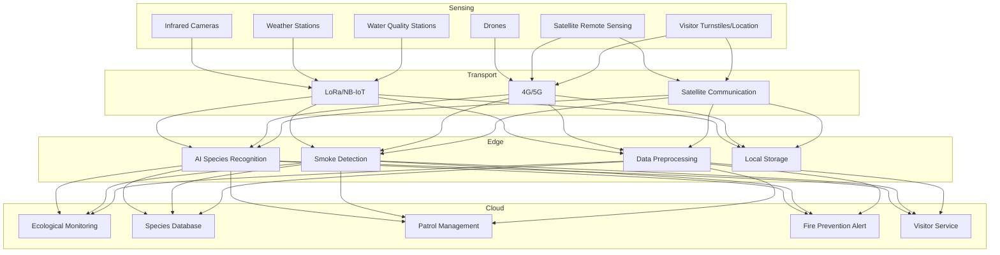

---title: National Park Architecture Design - Alibaba Cloud Perspective
description: 'title: National Park Intelligent Architecture Design'
summary: 'title: National Park Intelligent Architecture Design'
category: general
tags:
- architecture
- best-practice
- scheduler
- gpu
- nvidia
tier: supporting
created: '2026-05-23'
last_updated: 2026-05
difficulty: intermediate
reading_level: intermediate
audience:
- All Engineers
estimated_read_time: 15min
intent_queries:
- What is National Park Architecture Design - Alibaba Cloud Perspective
- How to implement National Park Architecture Design - Alibaba Cloud Perspective
- Kubernetes 20 application patterns best practices
trigger_keywords:
- National Park Architecture
- Alibaba Cloud Perspective
- application
- patterns
prerequisites:
- kubectl-basics
- prometheus-basics
- gpu-scheduling-basics
authors:
- name: Dillan Teagle
  role: contributor
source_path: /Users/teaglebuilt/github/teaglebuilt/knowledge/tree/application/architecture/national-park.md
original_language: Chinese
---

> **Production Environment Safety Notice**
>
> This document contains operational commands that can be executed directly. Before executing, confirm: the target cluster and namespace are correct; you have sufficient RBAC permissions; the command has been tested in a non-production environment. Risk levels for commands: 🔴 High risk (may cause data loss or service interruption), 🟡 Medium risk (modifies cluster state but usually reversible), 🟢 Low risk/read-only (information gathering, no side effects).

title: National Park Intelligent Architecture Design
description: '# National Park Architecture Design - Alibaba Cloud Perspective'
category: application-architecture
tags:
- k8s
- architecture
- industry
- scheduler
- gpu
- nvidia
last_updated: 2026-05-18
difficulty: intermediate
reading_level: intermediate
audience:
- National Park Informatization Leaders
- IoT Architects
- Environmental Protection Engineers
estimated_read_time: 5min
intent_queries:
- National Park Intelligent Patrol IoT Monitoring System
- Wildlife AI Species Identification Monitoring
- Forest Fire Prevention Warning System Architecture
- Edge Computing LoRa Broad Coverage
- Alibaba Cloud ACK Edge Outdoor Deployment
trigger_keywords:
- National Park
- Intelligent Patrol
- Wildlife Monitoring
- AI Species Identification
- Infrared Cameras
- Forest Fire Prevention
- LoRa Wide Area Network
- Edge Computing
- Ecological Protection
- Satellite Communication
related_domains:
- domain-03-networking-traffic
- domain-10-troubleshooting-diagnostics
related_topics:
- topic-iot-platform-architecture
- topic-edge-computing
k8s_versions:
- '1.28'
- '1.29'
- '1.30'
- '1.31'
- '1.32'
---

# National Park Architecture Design - Alibaba Cloud Perspective

> **Applicable Versions**: [[Kubernetes|Kubernetes]] v1.29 - v1.33 | **Last Updated**: 2026-04-24
> **Authors**: Alibaba Cloud Solution Architects | **Tags**: `#NationalPark` `#EcologicalProtection` `#IntelligentPatrol` `#AlibabaCloud`

---

## Table of Contents

1. [Overview](#1-overview)
2. [Design Principles](#2-design-principles)
3. [Architecture Patterns](#3-architecture-patterns)
4. [Implementation Examples](#4-implementation-examples)
5. [Kubernetes Deployment](#5-kubernetes-deployment)
6. [Best Practices](#6-best-practices)
7. [Anti-Patterns](#7-anti-patterns)
8. [Reference Resources](#8-reference-resources)

---

## 1. Overview

National parks are the top-tier design in the natural protected area system, with the core objective of protecting nationally representative natural ecosystems. China has established the first batch of national parks including Three-River Source, Giant Panda, Northeast Tiger-Leopard, Hainan Tropical Rainforest, and Wuyi Mountain, covering approximately 230,000 square kilometers. The goal of national park informatization is to utilize IoT, AI, and big data technologies to realize scientific ecological protection, intelligent patrol management, and convenient visitor services.

National park informatization faces unique challenges: monitoring spans vast areas (tens of thousands of square kilometers), weak communication infrastructure (no 4G/5G in remote areas), harsh device environments (high altitude/deep forests/wetlands), difficult power supply (off-grid power), and diverse data types (infrared camera images/audio/meteorology/water quality/satellite remote sensing). These constraints require a hybrid architecture of satellite communication + LoRa/NB-IoT + edge computing + cloud platform.

### 1.1 Industry Background

| Challenge | Description | Architecture Impact |
|:---|:---|:---|
| Large Coverage Area | Monitor tens of thousands of sq km | Satellite Remote Sensing + Drones + Ground Sensors |
| Harsh Environment | High Altitude / Deep Forests / Wetlands | Industrial-Grade Weather-Resistant Equipment + Solar Power |
| Species Protection | Rare Species Monitoring | AI Recognition + Individual Tracking |
| Fire Prevention | Forest Fires / Geological Disasters | Real-Time Alerts + Emergency Response |
| Visitor Management | Balancing Tourism & Protection | Reservation / Distribution / Capacity Control |

### 1.2 Core Scenarios

- **Ecological Monitoring**: Long-term monitoring of water/air/soil/vegetation/weather multi-factors
- **Wildlife Monitoring**: Infrared cameras / audio recognition / drone patrols / AI species recognition
- **Intelligent Patrol**: Patrol route management / event reporting / emergency dispatch
- **Fire Prevention Alert**: Satellite hotspot detection / video smoke detection / weather risk analysis
- **Visitor Service**: Reservation / Smart Navigation / Science Education / Safety Alerts

---

## 2. Design Principles

### 2.1 Low-Power Broad-Coverage Principle

Most national park areas lack power grids and communication networks. Sensors and monitoring devices require low-power design (solar + battery power, >6-month battery life), using LPWAN (Low-Power Wide-Area Network) like LoRa/NB-IoT for data transmission.

### 2.2 Edge-First Principle

Deploy edge computing nodes at park management centers to enable real-time AI species recognition and smoke detection. Original images and videos have large data volumes unsuitable for wholesale cloud upload. After local analysis at edge nodes, only recognition results and alerts are uploaded.

### 2.3 Non-Interference Principle

The monitoring system must not interfere with normal wildlife activity. Infrared cameras use flash-free design, acoustic monitoring uses passive collection mode, drone patrols maintain safe distances. All monitoring data is used for protection decisions, not commercial purposes.

### 2.4 Data Sharing Principle

Ecological monitoring data is a public resource and should be opened to research institutions and the public under security constraints. Establish a data sharing platform with standardized data access APIs to support cross-institutional research and public science education.

---

## 3. Architecture Patterns

### 3.1 National Park Full Landscape Architecture



---

## 4. Implementation Examples

### 4.1 AI Species Recognition Service

```python
from dataclasses import dataclass
from typing import List

@dataclass
class SpeciesDetection:
    species_name: str
    confidence: float
    bbox: tuple
    individual_id: str = ""

class WildlifeRecognizer:
    def detect(self, image_path: str) -> List[SpeciesDetection]:
        detections = self._run_model(image_path)
        results = []
        for det in detections:
            if det['confidence'] > 0.5:
                individual = self._match_individual(det)
                results.append(SpeciesDetection(
                    species_name=det['class'],
                    confidence=det['confidence'],
                    bbox=det['bbox'],
                    individual_id=individual,
                ))
        return results

    def _run_model(self, image_path: str) -> list:
        return []

    def _match_individual(self, detection: dict) -> str:
        return ""
```

---

## 5. Kubernetes Deployment

```yaml
apiVersion: apps/v1
kind: Deployment
metadata:
  name: wildlife-recognition
  namespace: national-park
spec:
  replicas: 2
  selector:
    matchLabels:
      app: wildlife-recognition
  template:
    metadata:
      labels:
        app: wildlife-recognition
    spec:
      nodeSelector:
        accelerator: nvidia-t4
      runtimeClassName: nvidia
      containers:
        - name: recognizer
          image: registry.cn-hangzhou.aliyuncs.com/park/wildlife-recognition:v2.0.0-gpu
          env:
            - name: SPECIES_DATABASE
              value: "/data/species-db"
            - name: CONFIDENCE_THRESHOLD
              value: "0.5"
          resources:
            requests:
              nvidia.com/gpu: 1
              memory: "8Gi"
              cpu: "4000m"
            limits:
              nvidia.com/gpu: 1
              memory: "16Gi"
              cpu: "8000m"
```

---

## 6. Best Practices

- **Solar + Battery**: Outdoor devices use solar panels + battery power with >6-month battery life
- **LoRa Networking**: Use LoRa gateway + terminal networking with 5-15km coverage radius
- **AI Edge Recognition**: Infrared camera images undergo AI recognition at edge nodes, reducing data transmission
- **Data Opening**: Ecological data exposed via standard APIs to research institutions

## 7. Anti-Patterns

- **4G Full Coverage Thinking**: Attempting to build 4G networks in all areas with prohibitive costs. Should use LoRa + satellite hybrid communication
- **Real-Time Video Backhaul**: Transmitting all infrared camera video in real-time; insufficient bandwidth. Should use edge AI filtering
- **Ignoring Device Durability**: Deploying standard consumer devices outdoors, which fail quickly. Should use industrial-grade waterproof/dustproof equipment

---

## 8. Reference Resources

### 8.1 Alibaba Cloud Component Mapping

| Functional Domain | **Alibaba Cloud Cloud-Native Solution** |
|:---|:---|
| Container Platform | **ACK Edge** |
| IoT | **Alibaba Cloud IoT Platform** |
| AI | **PAI + Vision Intelligence** |
| Database | **PolarDB + Lindorm** |
| Object Storage | **OSS** |
| Observability | **ARMS + SLS** |

### 8.2 Production Checklist

- [ ] Species Recognition Model Accuracy > 90%
- [ ] Fire Alert False Positive Rate < 5%
- [ ] Outdoor Device Battery Life > 6 Months
- [ ] Visitor Capacity System Stress Testing
- [ ] Ecological Data Privacy Protection

---

**Maintainers**: Alibaba Cloud Solution Architecture Team | **License**: MIT

---

## Obsidian Related Documents

- topic-application-architecture KUDIG Database — Global MOC
- [[domain-20-application-patterns/topic-application-architecture/README.md|Topic Application Architecture Design Best Practices]]
- [[domain-20-application-patterns/topic-application-architecture/01-ecommerce-architecture.md|E-Commerce System Kubernetes Production Architecture Design]]
- [[domain-20-application-patterns/topic-application-architecture/02-mini-program-architecture.md|Mini Program Platform Architecture Design]]
- [[domain-20-application-patterns/topic-application-architecture/03-cms-architecture.md|CMS Content Management System Architecture Design]]
- [[domain-20-application-patterns/topic-application-architecture/04-im-rtc-architecture.md|Real-Time Communication IM/RTC Architecture Design]]
- [[domain-20-application-patterns/topic-application-architecture/05-online-education-architecture.md|Online Education Platform Kubernetes Production Architecture Design]]
- [[domain-20-application-patterns/topic-application-architecture/06-fintech-architecture.md|FinTech Financial Technology Kubernetes Production Architecture Design]]
- [[domain-20-application-patterns/topic-application-architecture/07-iot-platform-architecture.md|IoT Internet of Things Platform Architecture Design]]
- [[domain-20-application-patterns/topic-application-architecture/08-ai-ml-inference-architecture.md|AI/ML Inference Service Kubernetes Production Architecture Design]]
- [[domain-20-application-patterns/topic-application-architecture/09-gaming-backend-architecture.md|Gaming Backend Kubernetes Production Architecture Design]]
- [[domain-20-application-patterns/topic-application-architecture/10-social-media-architecture.md|Social Media Platform Kubernetes Production Architecture Design]]

## See Also

- 82-legaltech
- 83-cultural-digitization
- 85-hydrogen-energy
- 86-solid-state-battery

## Related

- topic-application-architecture MOC — Cross-reference


<!-- risk-assessed -->
