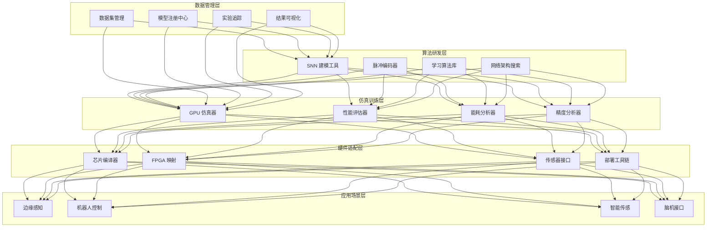
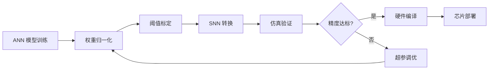
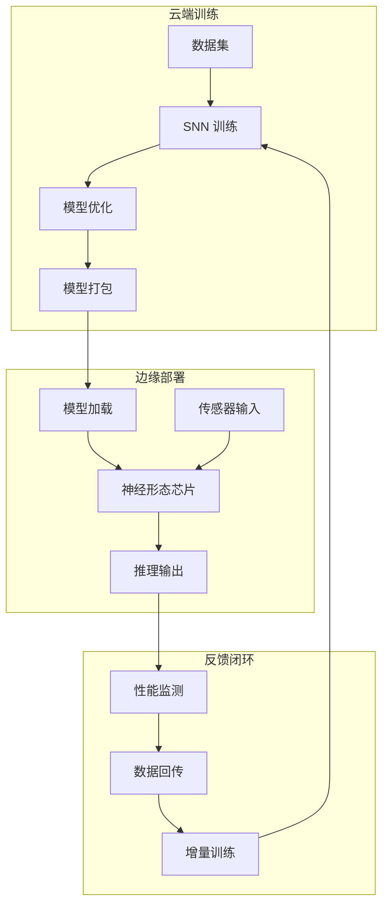

---title: 类脑计算架构设计 — 阿里云视角
description: 'title: 类脑计算架构设计'
summary: 'title: 类脑计算架构设计'
category: general
tags:
- architecture
- best-practice
- gpu
- nvidia
tier: supporting
created: '2026-05-23'
last_updated: 2026-05
difficulty: intermediate
reading_level: intermediate
audience:
- 所有工程师
estimated_read_time: 15min
intent_queries:
- 类脑计算架构设计 — 阿里云视角 是什么
- 如何 类脑计算架构设计 — 阿里云视角
- Kubernetes 20 application patterns 最佳实践
trigger_keywords:
- 类脑计算架构设计
- 阿里云视角
- application
- patterns
prerequisites:
- kubectl-basics
- prometheus-basics
- gpu-scheduling-basics
authors:
- name: Dillan Teagle
  role: contributor

---

> **生产环境安全提示**
>
> 本文档包含可直接执行的运维命令。执行前请确认：当前目标集群与 Namespace 是否正确；是否具备足够的 RBAC 权限；是否已在非生产环境验证。命令风险等级标注：🔴 高风险（可能造成数据丢失或服务中断）、🟡 中风险（会修改集群状态，但通常可回滚）、🟢 低风险/只读（信息收集，无副作用）。


title: 类脑计算架构设计
description: '# 类脑计算架构设计 — 阿里云视角'
category: application-architecture
tags:
- k8s
- architecture
- industry
- gpu
- nvidia
last_updated: 2026-05-18
difficulty: expert
reading_level: expert
audience:
- AI 芯片架构师
- 神经形态计算研究员
- 边缘计算工程师
- 阿里云 HPC 解决方案架构师
estimated_read_time: 5min
intent_queries:
- 类脑计算 SNN 脉冲神经网络 [[Kubernetes|Kubernetes]] 部署
- 神经形态芯片 AI 推理架构
- ANN-to-SNN 转换工具链
- 边缘类脑计算低功耗推理
- STDP 突触可塑性训练
trigger_keywords:
- 类脑计算
- 脉冲神经网络
- SNN
- 神经形态芯片
- Loihi
- 边缘智能
- 事件驱动
- 脑机接口
- 突触可塑性
- 低功耗推理
related_domains:
- domain-7-ai-ml-platform
- domain-03-networking-traffic
- domain-12-observability-comprehensive
related_topics:
- domain-20-application-patterns/topic-application-architecture/67-brain-computer-interface
- domain-20-application-patterns/topic-application-architecture/88-nanomaterials
k8s_versions:
- '1.28'
- '1.29'
- '1.30'
- '1.31'
- '1.32'
---

# 类脑计算架构设计 — 阿里云视角

> **适用版本**: Kubernetes v1.29 - v1.33 | **最后更新**: 2026-05-18
> **作者**: 阿里云解决方案架构师 | **标签**: `#类脑计算` `#脉冲神经网络` `#神经形态芯片` `#边缘智能` `#阿里云`

---

<!-- chunk: 目录 -->## 目录

1. [概述](#1-概述)
2. [设计原则](#2-设计原则)
3. [架构模式](#3-架构模式)
4. [实现示例](#4-实现示例)
5. [在 Kubernetes 上的部署](#5-在-kubernetes-上的部署)
6. [最佳实践](#6-最佳实践)
7. [反模式](#7-反模式)
8. [参考资源](#8-参考资源)

---

<!-- chunk: 1. 概述 -->## 1. 概述

类脑计算（Neuromorphic Computing）是受生物神经系统启发的全新计算范式。与传统冯·诺依曼架构不同，类脑计算采用脉冲神经网络（SNN，Spiking Neural Network）作为信息处理模型，通过模拟生物神经元的脉冲发放、突触可塑性等机制实现信息处理。类脑计算的核心优势在于：极低功耗（mW 级推理）、高时空效率（事件驱动计算）、天然适合感知-决策任务。

类脑计算生态系统包含三个核心层次：算法层（SNN 建模、学习算法）、仿真层（软件仿真器、性能评估）和硬件层（神经形态芯片、FPGA 原型）。目前主流的神经形态芯片包括 Intel Loihi 2、IBM TrueNorth、BrainScaleS-2、清华天机芯等。这些芯片在神经元模型、突触精度、片上学习能力等方面各有特点。

从云平台角度看，类脑计算平台需要提供：SNN 训练所需的 GPU 算力（ANN-to-SNN 转换或直接 SNN 训练）；大规模网络仿真所需的并行计算能力；模型部署到边缘神经形态芯片的工具链；实验管理和模型版本管理能力。

## 1.1 行业背景

| 挑战 | 说明 | 架构影响 |
|:---|:---|:---|
| 脉冲编码 | 事件驱动异步计算范式 | 新型编程模型与编译器 |
| 芯片异构 | 多种神经形态硬件 | 跨平台编译与适配 |
| 训练困难 | SNN 不可微，训练复杂 | ANN-SNN 转换 + STDP |
| 边缘部署 | 超低功耗推理需求 | 模型量化 + 芯片适配 |
| 软硬件协同 | 算法与芯片深度耦合 | 协同设计工具链 |

## 1.2 核心场景

- **脉冲神经网络**: LIF/Izhikevich 等神经元模型的 SNN 建模与训练
- **神经形态芯片**: Loihi/TrueNorth/天机芯等芯片设计与验证
- **边缘智能**: 无人机/机器人/物联网终端超低功耗感知决策
- **脑机接口**: 神经信号实时编解码
- **机器人控制**: 类脑运动控制与自适应学习

---

<!-- chunk: 2. 设计原则 -->## 2. 设计原则

## 2.1 软硬件协同原则

类脑计算的性能高度依赖算法与硬件的匹配。SNN 的神经元模型、突触精度、连接拓扑等参数需要与目标芯片的能力对齐。平台设计需要提供软硬件协同仿真工具，让研究人员在软件仿真阶段就能评估模型在目标硬件上的性能表现。

## 2.2 训练-部署闭环原则

SNN 的训练比传统 ANN 更复杂。主流方法有两种：一是 ANN-to-SNN 转换（先训练 ANN，再转换为 SNN），适合图像分类等静态任务；二是直接 SNN 训练（如替代梯度法、STDP 等），适合时序处理和在线学习。平台需要支持两种训练路径，并提供从训练到部署的完整工具链。

## 2.3 事件驱动原则

类脑计算的核心特征是事件驱动。不同于传统 ANN 的稠密矩阵运算，SNN 只在神经元发放脉冲时进行计算，天然稀疏。平台设计需要充分利用这一特性，在数据输入（事件相机/DVS）、网络计算、芯片执行三个层面都采用事件驱动模式。

## 2.4 可观测性原则

SNN 的内部状态（膜电位、脉冲发放率、突触权重）比 ANN 更复杂，需要专门的 visualization 工具。平台需要提供网络拓扑可视化、脉冲活动光栅图、膜电位时序图、权重分布热力图等分析工具，帮助研究人员理解网络行为。

---

<!-- chunk: 3. 架构模式 -->## 3. 架构模式

## 3.1 类脑计算平台全景架构



## 3.2 ANN-to-SNN 转换流水线



## 3.3 边缘推理部署架构



---

<!-- chunk: 4. 实现示例 -->## 4. 实现示例

## 4.1 LIF 神经元脉冲神经网络

```python
import numpy as np
from dataclasses import dataclass
from typing import List, Tuple

@dataclass
class LIFParams:
    tau_m: float = 20.0       # 膜时间常数 ms
    tau_s: float = 5.0        # 突触时间常数 ms
    v_threshold: float = 1.0  # 发放阈值
    v_reset: float = 0.0      # 重置电位
    v_decay: float = 0.0      # 泄漏项
    refractory: int = 2       # 不应期 时间步

class LIFNeuronLayer:
    def __init__(self, n_neurons: int, params: LIFParams = LIFParams()):
        self.n = n_neurons
        self.params = params
        self.v = np.zeros(n_neurons)
        self.i_syn = np.zeros(n_neurons)
        self.refractory_count = np.zeros(n_neurons, dtype=int)
        self.spike_history = []

    def forward(self, input_current: np.ndarray,
                dt: float = 1.0) -> np.ndarray:
        self.refractory_count = np.maximum(0, self.refractory_count - 1)

        alpha = np.exp(-dt / self.params.tau_m)
        beta = np.exp(-dt / self.params.tau_s)

        self.i_syn = beta * self.i_syn + input_current
        self.v = alpha * self.v + (1 - alpha) * self.i_syn

        in_refractory = self.refractory_count > 0
        self.v[in_refractory] = self.params.v_reset

        spikes = (self.v >= self.params.v_threshold).astype(float)
        self.v[spikes > 0] = self.params.v_reset
        self.refractory_count[spikes > 0] = self.params.refractory

        self.spike_history.append(spikes.copy())
        return spikes

class SNNNetwork:
    def __init__(self, layer_sizes: List[int], params: LIFParams = None):
        if params is None:
            params = LIFParams()
        self.params = params
        self.layers = [LIFNeuronLayer(n, params) for n in layer_sizes]
        self.weights = []
        for i in range(len(layer_sizes) - 1):
            w = np.random.randn(layer_sizes[i], layer_sizes[i+1]) * 0.1
            self.weights.append(w)

    def forward(self, input_spikes: np.ndarray,
                n_timesteps: int = 100) -> Tuple[List[np.ndarray], np.ndarray]:
        all_spikes = []
        membrane_potentials = [[] for _ in self.layers]

        for t in range(n_timesteps):
            layer_input = input_spikes[t] if t < len(input_spikes) else np.zeros(self.layers[0].n)

            spikes_per_layer = []
            for i, layer in enumerate(self.layers):
                if i == 0:
                    s = layer.forward(layer_input)
                else:
                    current = np.dot(spikes_per_layer[-1], self.weights[i-1])
                    s = layer.forward(current)
                spikes_per_layer.append(s)
                membrane_potentials[i].append(layer.v.copy())

            all_spikes.append(spikes_per_layer)

        output_spikes = np.stack([s[-1] for s in all_spikes])
        return all_spikes, output_spikes

    def get_spike_rates(self, output_spikes: np.ndarray) -> np.ndarray:
        return np.mean(output_spikes, axis=0)

    def predict(self, input_spikes: np.ndarray,
                n_timesteps: int = 100) -> int:
        _, output = self.forward(input_spikes, n_timesteps)
        rates = self.get_spike_rates(output)
        return np.argmax(rates)
```

## 4.2 STDP 学习规则实现

```python
import numpy as np

class STDPLearner:
    def __init__(self, n_pre: int, n_post: int,
                 lr: float = 0.01,
                 tau_plus: float = 20.0,
                 tau_minus: float = 20.0,
                 w_max: float = 1.0,
                 w_min: float = 0.0):
        self.lr = lr
        self.tau_plus = tau_plus
        self.tau_minus = tau_minus
        self.w_max = w_max
        self.w_min = w_min
        self.weights = np.random.uniform(0.1, 0.5, (n_pre, n_post))
        self.trace_pre = np.zeros(n_pre)
        self.trace_post = np.zeros(n_post)

    def update(self, pre_spikes: np.ndarray,
               post_spikes: np.ndarray, dt: float = 1.0):
        alpha_pre = np.exp(-dt / self.tau_plus)
        alpha_post = np.exp(-dt / self.tau_minus)

        self.trace_pre = alpha_pre * self.trace_pre + pre_spikes
        self.trace_post = alpha_post * self.trace_post + post_spikes

        dw_ltp = self.lr * np.outer(pre_spikes, self.trace_post)
        dw_ltd = -self.lr * self.trace_pre[:, np.newaxis] * post_spikes[np.newaxis, :]

        self.weights += dw_ltp + dw_ltd
        self.weights = np.clip(self.weights, self.w_min, self.w_max)

        return self.weights.copy()

    def get_weight_matrix(self) -> np.ndarray:
        return self.weights.copy()
```

## 4.3 SNN 模型管理与部署

```go
package neuromorphic

import (
    "crypto/sha256"
    "fmt"
    "time"
)

type NeuronModel string

const (
    NeuronLIF       NeuronModel = "LIF"
    NeuronIzhikevich NeuronModel = "Izhikevich"
    NeuronHodgkin   NeuronModel = "HodgkinHuxley"
)

type SNNModel struct {
    ID           string
    Name         string
    Version      string
    NeuronModel  NeuronModel
    LayerSizes   []int
    WeightsRef   string
    Accuracy     float64
    EnergyMW     float64
    LatencyMS    float64
    TargetChip   string
    CreatedAt    time.Time
    Checksum     string
}

type ModelRegistry struct {
    models map[string]*SNNModel
}

func NewModelRegistry() *ModelRegistry {
    return &ModelRegistry{
        models: make(map[string]*SNNModel),
    }
}

func (r *ModelRegistry) Register(model *SNNModel) error {
    if model.ID == "" {
        model.ID = fmt.Sprintf("snn-%s-%d", model.Name, time.Now().UnixNano())
    }
    if model.CreatedAt.IsZero() {
        model.CreatedAt = time.Now()
    }
    checksum := sha256.Sum256([]byte(fmt.Sprintf("%v", model.WeightsRef)))
    model.Checksum = fmt.Sprintf("%x", checksum[:8])

    r.models[model.ID] = model
    return nil
}

func (r *ModelRegistry) Get(id string) (*SNNModel, error) {
    m, ok := r.models[id]
    if !ok {
        return nil, fmt.Errorf("model %s not found", id)
    }
    return m, nil
}

func (r *ModelRegistry) ListByChip(chip string) []*SNNModel {
    var result []*SNNModel
    for _, m := range r.models {
        if m.TargetChip == chip {
            result = append(result, m)
        }
    }
    return result
}

func (r *ModelRegistry) GetBestModel(chip string) (*SNNModel, error) {
    candidates := r.ListByChip(chip)
    if len(candidates) == 0 {
        return nil, fmt.Errorf("no models for chip %s", chip)
    }

    best := candidates[0]
    for _, m := range candidates[1:] {
        score := m.Accuracy * 0.5 + (1 - m.EnergyMW/100.0) * 0.3 + (1 - m.LatencyMS/100.0) * 0.2
        bestScore := best.Accuracy * 0.5 + (1 - best.EnergyMW/100.0) * 0.3 + (1 - best.LatencyMS/100.0) * 0.2
        if score > bestScore {
            best = m
        }
    }
    return best, nil
}
```

---

<!-- chunk: 5. 在 Kubernetes 上的部署 -->## 5. 在 Kubernetes 上的部署

## 5.1 SNN 训练 GPU 集群

```yaml
apiVersion: apps/v1
kind: Deployment
metadata:
  name: snn-training
  namespace: neuromorphic
  labels:
    app: snn-training
    workload: training
spec:
  replicas: 4
  selector:
    matchLabels:
      app: snn-training
  template:
    metadata:
      labels:
        app: snn-training
    spec:
      nodeSelector:
        accelerator: nvidia-a100
      runtimeClassName: nvidia
      containers:
        - name: snn-train
          image: registry.cn-hangzhou.aliyuncs.com/neuro/snn-training:v2.0.0-gpu
          ports:
            - containerPort: 8080
          env:
            - name: NEURON_MODEL
              value: "lif"
            - name: LEARNING_RULE
              value: "surrogate_gradient"
            - name: TIMESTEPS
              value: "100"
            - name: BATCH_SIZE
              value: "64"
          resources:
            requests:
              nvidia.com/gpu: 2
              memory: "64Gi"
              cpu: "16000m"
            limits:
              nvidia.com/gpu: 2
              memory: "128Gi"
              cpu: "32000m"
          volumeMounts:
            - name: datasets
              mountPath: /data
            - name: models
              mountPath: /models
      volumes:
        - name: datasets
          persistentVolumeClaim:
            claimName: snn-datasets-pvc
        - name: models
          persistentVolumeClaim:
            claimName: snn-models-pvc
```

## 5.2 SNN 仿真服务

```yaml
apiVersion: apps/v1
kind: Deployment
metadata:
  name: snn-simulator
  namespace: neuromorphic
spec:
  replicas: 3
  selector:
    matchLabels:
      app: snn-simulator
  template:
    metadata:
      labels:
        app: snn-simulator
    spec:
      containers:
        - name: simulator
          image: registry.cn-hangzhou.aliyuncs.com/neuro/snn-simulator:v2.0.0
          ports:
            - containerPort: 8080
          env:
            - name: MAX_NEURONS
              value: "1000000"
            - name: MAX_TIMESTEPS
              value: "10000"
            - name: BACKEND
              value: "gpu"
          resources:
            requests:
              memory: "16Gi"
              cpu: "8000m"
            limits:
              memory: "32Gi"
              cpu: "16000m"
```

## 5.3 模型部署工具链

```yaml
apiVersion: apps/v1
kind: Deployment
metadata:
  name: snn-compiler
  namespace: neuromorphic
spec:
  replicas: 2
  selector:
    matchLabels:
      app: snn-compiler
  template:
    metadata:
      labels:
        app: snn-compiler
    spec:
      containers:
        - name: compiler
          image: registry.cn-hangzhou.aliyuncs.com/neuro/snn-compiler:v2.0.0
          ports:
            - containerPort: 8080
          env:
            - name: TARGET_CHIPS
              value: "loihi2,tianyiji,truenorth"
            - name: MODEL_REGISTRY
              value: "http://model-registry:8080"
          resources:
            requests:
              memory: "4Gi"
              cpu: "2000m"
            limits:
              memory: "8Gi"
              cpu: "4000m"
```

---

<!-- chunk: 6. 最佳实践 -->## 6. 最佳实践

## 6.1 SNN 训练优化

- **ANN-SNN 转换**: 对于图像分类等静态任务，先训练 ReLU-ANN，再通过权重归一化和阈值标定转换为 SNN，转换损失通常 < 1%
- **替代梯度训练**: 对于需要时序处理的任务，使用替代梯度（Surrogate Gradient）方法直接训练 SNN
- **混合训练**: 先用 ANN 预训练初始化权重，再用 STDP 等生物学习规则微调
- **量化感知训练**: 训练时模拟目标芯片的精度约束（如 4-bit 突触权重），减少部署时的精度损失

## 6.2 模型优化

- **权重剪枝**: 利用 SNN 的稀疏性，剪除低发放率的神经元和弱突触
- **分层量化**: 输入层保持高精度，深层使用低精度（4-bit 或 2-bit）
- **拓扑优化**: 根据目标芯片的片上连接约束调整网络拓扑
- **能耗建模**: 在仿真阶段使用能耗模型估算推理功耗，指导模型优化

## 6.3 部署管理

- **模型注册中心**: 管理不同版本的 SNN 模型，记录训练参数、精度、能耗指标
- **芯片适配层**: 为不同神经形态芯片提供统一的编译接口
- **OTA 更新**: 边缘设备的 SNN 模型支持远程更新，通过增量更新减少传输量

---

<!-- chunk: 7. 反模式 -->## 7. 反模式

## 7.1 直接套用 ANN 训练方法

将传统 ANN 的训练方法（如标准反向传播）直接用于 SNN，忽视 SNN 不可微的特性。

**解决方案**: 使用替代梯度方法（用可微函数近似阶跃函数的梯度）或 ANN-to-SNN 转换策略。对于在线学习场景使用 STDP 等生物学习规则。

## 7.2 忽视硬件约束

在仿真器上设计 SNN 时忽视目标芯片的约束（如最大神经元数、突触精度、连接带宽）。

**解决方案**: 仿真时加入硬件约束模型，限制网络规模、权重精度和连接拓扑。使用硬件感知的神经架构搜索（HW-NAS）自动搜索适合目标芯片的网络结构。

## 7.3 过度追求生物真实性

在工程应用中过度追求神经元模型的生物真实性（如使用 Hodgkin-Huxley 模型），导致计算开销过大。

**解决方案**: 根据任务需求选择合适的神经元模型精度。大多数工程应用使用 LIF（Leaky Integrate-and-Fire）模型即可获得良好性能，计算开销远低于高精度模型。

## 7.4 忽视脉冲编码设计

忽视输入数据的脉冲编码方式设计，导致信息在编码过程中丢失。

**解决方案**: 根据数据类型选择合适的编码方式：图像数据常用频率编码（rate coding）或首脉冲时间编码（TTFS）；时序数据常用时间编码；事件相机数据天然就是脉冲形式。编码方式直接影响 SNN 性能。

## 7.5 单一评估指标

仅使用精度作为 SNN 评估指标，忽视能耗和延迟。

**解决方案**: 综合评估精度、能耗（每推理 mJ）、延迟（ms）、神经元利用率等指标。类脑计算的核心优势是能效比，需要在精度和能耗之间找到最佳平衡点。

---

<!-- chunk: 8. 参考资源 -->## 8. 参考资源

## 8.1 阿里云组件映射

| 功能域 | **阿里云云原生方案** |
|:---|:---|
| 容器平台 | **ACK Pro + GPU** |
| GPU 实例 | **GN10/GN7（A100/V100）** |
| AI 平台 | **PAI + DSW** |
| 对象存储 | **OSS** |
| 数据库 | **PolarDB** |
| 可观测性 | **ARMS + SLS** |
| 工作流 | **[[Argo|Argo]]go Workflows|Argo Workflows]]** |

## 8.2 生产检查清单

- [ ] SNN 训练收敛性验证（与 ANN 基线对比）
- [ ] ANN-to-SNN 转换精度损失 < 2%
- [ ] 芯片能耗效率验证（< 10mW 推理）
- [ ] 边缘推理延迟测试（< 10ms）
- [ ] 神经数据隐私保护措施
- [ ] 算法可解释性报告
- [ ] 模型注册中心版本管理

## 8.3 外部参考

- Intel Loihi 2 — 英特尔神经形态芯片
- IBM TrueNorth — IBM 神经形态芯片
- Neuromorphic Computing Roadmap — IEEE 神经形态计算路线图
- BindsNET — Python SNN 仿真框架
- Norse — PyTorch SNN 扩展库
- SpiNNaker — 大规模 SNN 仿真硬件

---

**维护者**: 阿里云解决方案架构师团队 | **许可证**: MIT

---

<!-- chunk: Obsidian 相关文档 -->## Obsidian 相关文档

- topic-application-architecture MOC
- [[domain-20-application-patterns/topic-application-architecture/README.md|Topic 应用层架构设计最佳实践]]
- [[domain-20-application-patterns/topic-application-architecture/01-ecommerce-architecture.md|电商系统 Kubernetes 生产架构设计]]
- [[domain-20-application-patterns/topic-application-architecture/02-mini-program-architecture.md|小程序平台架构设计]]
- [[domain-20-application-patterns/topic-application-architecture/03-cms-architecture.md|内容管理系统 CMS 架构设计]]
- [[domain-20-application-patterns/topic-application-architecture/04-im-rtc-architecture.md|实时通信 IM/RTC 架构设计]]
- [[domain-20-application-patterns/topic-application-architecture/05-online-education-architecture.md|在线教育平台 Kubernetes 生产架构设计]]
- [[domain-20-application-patterns/topic-application-architecture/06-fintech-architecture.md|金融科技FinTech Kubernetes生产架构设计]]
- [[domain-20-application-patterns/topic-application-architecture/07-iot-platform-architecture.md|物联网 IoT 平台架构设计]]
- [[domain-20-application-patterns/topic-application-architecture/08-ai-ml-inference-architecture.md|AI/ML 推理服务 Kubernetes 生产架构设计]]
- [[domain-20-application-patterns/topic-application-architecture/09-gaming-backend-architecture.md|游戏后端 Kubernetes 生产架构设计]]
- [[domain-20-application-patterns/topic-application-architecture/10-social-media-architecture.md|社交媒体平台Kubernetes生产架构设计]]

## See Also

- 88-nanomaterials
- 89-crispr-gene-editing
- 91-urban-air-mobility
- 92-smart-sports-venue

## Related

- topic-application-architecture MOC — Cross-reference


<!-- risk-assessed -->
