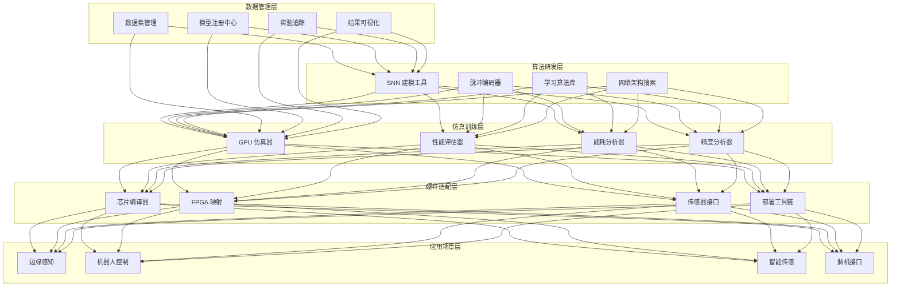
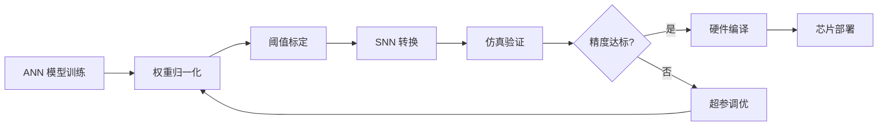
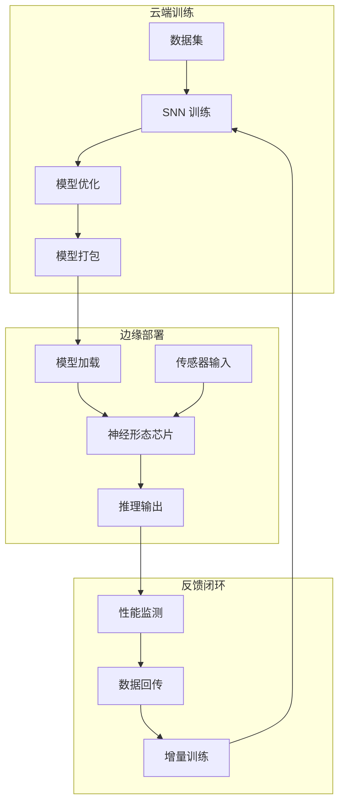

# Brain-like Computing Architecture Design — Alibaba Cloud Perspective

> **Applicable Version**: Kubernetes v1.29 - v1.33 | **Last Updated**: 2026-05-18
> **Author**: Alibaba Cloud Solution Architect | **Tags**: `#Brain-like Computing` `#Spiking Neural Networks` `#Neuromorphic Chips` `#Edge Intelligence` `#Alibaba Cloud`

## Table of Contents

1. [Overview](#1-overview)
2. [Design Principles](#2-design-principles)
3. [Architecture Patterns](#3-architectural-patterns)
4. [Implementation Examples](#4-implementation-examples)
5. [Deployment on Kubernetes](#5-deployment-on-kubernetes)
6. [Best Practices](#6-best-practices)
7. [Anti-patterns](#7-anti-patterns)
8. [Reference Resources](#8-references)


## 1. Overview

Neuromorphic Computing is a new computing paradigm inspired by biological neural systems. Unlike the traditional von Neumann architecture, neuromorphic computing employs spiking neural networks (SNN) as an information processing model, simulating mechanisms such as the firing of biological neurons and synaptic plasticity to achieve information processing. The core advantage of neuromorphic computing lies in extremely low power consumption (in the mW range for inference), high spatial-temporal efficiency (event-driven computation), and natural suitability for perception-decision tasks.

The neuromorphic computing ecosystem comprises three core layers: the algorithm layer (SNN modeling, learning algorithms), the simulation layer (software simulators, performance evaluation), and the hardware layer (neuromorphic chips, FPGA prototypes). Current mainstream neuromorphic chips include Intel Loihi 2, IBM TrueNorth, BrainScaleS-2, and Tsinghua Tianjic chip. Each of these chips has its own characteristics in terms of neuron models, synaptic precision, on-chip learning capabilities, etc.

From a cloud platform perspective, neuromorphic computing platforms need to provide: GPU computing power required for SNN training (ANN-to-SNN conversion or direct SNN training); parallel computing capability needed for large-scale network simulations; toolchains for deploying models onto edge neuromorphic chips; experimental management and version control capabilities.

## 1.1 Industry Background

| Challenge | Explanation | Impact on Architecture |
|:---|:---|:---|
| Pulse Coding | Event-driven asynchronous computing paradigm | New programming model and compiler |
| Chip Heterogeneity | Multiple neuromorphic hardware platforms | Cross-platform compilation and adaptation |
| Training Difficulty | SNN is not differentiable, making training complex | ANN-to-SNN conversion + STDP |
| Edge Deployment | Ultra-low-power inference requirements | Model quantization + chip adaptation |
| Hardware-software Co-design | Deep integration between algorithms and chips | Co-design toolchain |

## 1.2 Core Scenarios

- **Spiking Neural Networks**: Modeling and training with LIF/Izhikevich and other SNN models
- **Neuromorphic Chips**: Design and validation of chips like Loihi/TrueNorth/Tianjic
- **Edge Intelligence**: Perception and decision-making at ultra-low power for drones/robots/Internet of Things terminals
- **Brain-Computer Interfaces**: Real-time encoding/decoding of neural signals
- **Robot Control**: Brain-inspired movement control and adaptive learning

---

## 2. Design Principles

## 2.1 Synergistic Principle between Software and Hardware

SNN's performance heavily depends on the alignment between algorithms and hardware. Parameters such as the neural model, synaptic precision, and connectivity topology need to match the capabilities of the target chip. Platform design should provide soft-hardware co-simulation tools so that researchers can evaluate the model's performance on the target hardware during the software simulation phase.

## 2.2 Training-Deployment Loop Principle

SNN training is more complex than traditional ANN training. Two mainstream methods exist: one is ANN-to-SNN conversion (training ANN first, then converting it to SNN), suitable for static tasks like image classification; the other is direct SNN training (e.g., using alternative gradient methods, STDP, etc.), suitable for time-series processing and online learning. The platform needs to support both training paths and provide a complete toolchain from training to deployment.

## 2.3 Event-Driven Principle

The core characteristic of brain-inspired computing is event-driven. Unlike the dense matrix operations of traditional ANN, SNN only performs calculations when neurons fire, naturally being sparse. Platform design should leverage this feature at all levels, including data input (event cameras/DVS), network computation, and chip execution, adopting an event-driven mode.

## 2.4 Observability Principle

The internal states of SNN (membrane potential, firing rate, synaptic weights) are more complex than those of ANN and require specialized visualization tools. The platform should provide analysis tools such as network topology visualization, pulse activity raster plots, membrane potential time series plots, and heat maps of weight distributions to help researchers understand network behavior.

---

## 3. Architectural Patterns

## 3.1 Panoramic Architecture of Brain-Inspired Computing Platforms


```mermaid
graph TB
    subgraph 算法研发层
        A1[SNN 建模工具]
        A2[脉冲编码器]
        A3[学习算法库]
        A4[网络架构搜索]
    end

    subgraph 仿真训练层
        S1[GPU 仿真器]
        S2[性能评估器]
        S3[能耗分析器]
        S4[精度分析器]
    end

    subgraph 硬件适配层
        H1[芯片编译器]
        H2[FPGA 映射]
        H3[传感器接口]
        H4[部署工具链]
    end

    subgraph 应用场景层
        APP1[边缘感知]
        APP2[机器人控制]
        APP3[智能传感]
        APP4[脑机接口]
    end

    subgraph 数据管理层
        D1[数据集管理]
        D2[模型注册中心]
        D3[实验追踪]
        D4[结果可视化]
    end

    A1 & A2 & A3 & A4 --> S1 & S2 & S3 & S4
    S1 & S2 & S3 & S4 --> H1 & H2 & H3 & H4
    H1 & H2 & H3 & H4 --> APP1 & APP2 & APP3 & APP4
    D1 & D2 & D3 & D4 --> A1 & S1
```

## 3.2 ANN-to-SNN Conversion Pipeline


```mermaid
flowchart LR
    A[ANN 模型训练] --> B[权重归一化]
    B --> C[阈值标定]
    C --> D[SNN 转换]
    D --> E[仿真验证]
    E --> F{精度达标?}
    F -->|是| G[硬件编译]
    F -->|否| H[超参调优]
    H --> B
    G --> I[芯片部署]
```

## 3.3 Edge Inference Deployment Architecture


```mermaid
graph TB
    subgraph 云端训练
        C1[数据集]
        C2[SNN 训练]
        C3[模型优化]
        C4[模型打包]
    end

    subgraph 边缘部署
        E1[模型加载]
        E2[神经形态芯片]
        E3[传感器输入]
        E4[推理输出]
    end

    subgraph 反馈闭环
        F1[性能监测]
        F2[数据回传]
        F3[增量训练]
    end

    C1 --> C2 --> C3 --> C4
    C4 --> E1 --> E2
    E3 --> E2 --> E4
    E4 --> F1 --> F2 --> F3 --> C2
```

---

## 4. Implementation Examples

## 4.1 Leaky Integrate-and-Fire Neuron Pulse Neural Network

```python
import numpy as np
from dataclasses import dataclass
from typing import List, Tuple

@dataclass
class LIFParams:
    tau_m: float = 20.0       # 膜时间常数 ms
    tau_s: float = 5.0        # 突触时间常数 ms
    v_threshold: float = 1.0  # 发放阈值
    v_reset: float = 0.0      # 重置电位
    v_decay: float = 0.0      # 泄漏项
    refractory: int = 2       # 不应期 时间步

class LIFNeuronLayer:
    def __init__(self, n_neurons: int, params: LIFParams = LIFParams()):
        self.n = n_neurons
        self.params = params
        self.v = np.zeros(n_neurons)
        self.i_syn = np.zeros(n_neurons)
        self.refractory_count = np.zeros(n_neurons, dtype=int)
        self.spike_history = []

    def forward(self, input_current: np.ndarray,
                dt: float = 1.0) -> np.ndarray:
        self.refractory_count = np.maximum(0, self.refractory_count - 1)

        alpha = np.exp(-dt / self.params.tau_m)
        beta = np.exp(-dt / self.params.tau_s)

        self.i_syn = beta * self.i_syn + input_current
        self.v = alpha * self.v + (1 - alpha) * self.i_syn

        in_refractory = self.refractory_count > 0
        self.v[in_refractory] = self.params.v_reset

        spikes = (self.v >= self.params.v_threshold).astype(float)
        self.v[spikes > 0] = self.params.v_reset
        self.refractory_count[spikes > 0] = self.params.refractory

        self.spike_history.append(spikes.copy())
        return spikes

class SNNNetwork:
    def __init__(self, layer_sizes: List[int], params: LIFParams = None):
        if params is None:
            params = LIFParams()
        self.params = params
        self.layers = [LIFNeuronLayer(n, params) for n in layer_sizes]
        self.weights = []
        for i in range(len(layer_sizes) - 1):
            w = np.random.randn(layer_sizes[i], layer_sizes[i+1]) * 0.1
            self.weights.append(w)

    def forward(self, input_spikes: np.ndarray,
                n_timesteps: int = 100) -> Tuple[List[np.ndarray], np.ndarray]:
        all_spikes = []
        membrane_potentials = [[] for _ in self.layers]

        for t in range(n_timesteps):
            layer_input = input_spikes[t] if t < len(input_spikes) else np.zeros(self.layers[0].n)

            spikes_per_layer = []
            for i, layer in enumerate(self.layers):
                if i == 0:
                    s = layer.forward(layer_input)
                else:
                    current = np.dot(spikes_per_layer[-1], self.weights[i-1])
                    s = layer.forward(current)
                spikes_per_layer.append(s)
                membrane_potentials[i].append(layer.v.copy())

            all_spikes.append(spikes_per_layer)

        output_spikes = np.stack([s[-1] for s in all_spikes])
        return all_spikes, output_spikes

    def get_spike_rates(self, output_spikes: np.ndarray) -> np.ndarray:
        return np.mean(output_spikes, axis=0)

    def predict(self, input_spikes: np.ndarray,
                n_timesteps: int = 100) -> int:
        _, output = self.forward(input_spikes, n_timesteps)
        rates = self.get_spike_rates(output)
        return np.argmax(rates)
```

## 4.2 STDP Learning Rule Implementation

```python
import numpy as np

class STDPLearner:
    def __init__(self, n_pre: int, n_post: int,
                 lr: float = 0.01,
                 tau_plus: float = 20.0,
                 tau_minus: float = 20.0,
                 w_max: float = 1.0,
                 w_min: float = 0.0):
        self.lr = lr
        self.tau_plus = tau_plus
        self.tau_minus = tau_minus
        self.w_max = w_max
        self.w_min = w_min
        self.weights = np.random.uniform(0.1, 0.5, (n_pre, n_post))
        self.trace_pre = np.zeros(n_pre)
        self.trace_post = np.zeros(n_post)

    def update(self, pre_spikes: np.ndarray,
               post_spikes: np.ndarray, dt: float = 1.0):
        alpha_pre = np.exp(-dt / self.tau_plus)
        alpha_post = np.exp(-dt / self.tau_minus)

        self.trace_pre = alpha_pre * self.trace_pre + pre_spikes
        self.trace_post = alpha_post * self.trace_post + post_spikes

        dw_ltp = self.lr * np.outer(pre_spikes, self.trace_post)
        dw_ltd = -self.lr * self.trace_pre[:, np.newaxis] * post_spikes[np.newaxis, :]

        self.weights += dw_ltp + dw_ltd
        self.weights = np.clip(self.weights, self.w_min, self.w_max)

        return self.weights.copy()

    def get_weight_matrix(self) -> np.ndarray:
        return self.weights.copy()
```

## 4.3 SNN Model Management and Deployment

```go
package neuromorphic

import (
    "crypto/sha256"
    "fmt"
    "time"
)

type NeuronModel string

const (
    NeuronLIF       NeuronModel = "LIF"
    NeuronIzhikevich NeuronModel = "Izhikevich"
    NeuronHodgkin   NeuronModel = "HodgkinHuxley"
)

type SNNModel struct {
    ID           string
    Name         string
    Version      string
    NeuronModel  NeuronModel
    LayerSizes   []int
    WeightsRef   string
    Accuracy     float64
    EnergyMW     float64
    LatencyMS    float64
    TargetChip   string
    CreatedAt    time.Time
    Checksum     string
}

type ModelRegistry struct {
    models map[string]*SNNModel
}

func NewModelRegistry() *ModelRegistry {
    return &ModelRegistry{
        models: make(map[string]*SNNModel),
    }
}

func (r *ModelRegistry) Register(model *SNNModel) error {
    if model.ID == "" {
        model.ID = fmt.Sprintf("snn-%s-%d", model.Name, time.Now().UnixNano())
    }
    if model.CreatedAt.IsZero() {
        model.CreatedAt = time.Now()
    }
    checksum := sha256.Sum256([]byte(fmt.Sprintf("%v", model.WeightsRef)))
    model.Checksum = fmt.Sprintf("%x", checksum[:8])

    r.models[model.ID] = model
    return nil
}

func (r *ModelRegistry) Get(id string) (*SNNModel, error) {
    m, ok := r.models[id]
    if !ok {
        return nil, fmt.Errorf("model %s not found", id)
    }
    return m, nil
}

func (r *ModelRegistry) ListByChip(chip string) []*SNNModel {
    var result []*SNNModel
    for _, m := range r.models {
        if m.TargetChip == chip {
            result = append(result, m)
        }
    }
    return result
}

func (r *ModelRegistry) GetBestModel(chip string) (*SNNModel, error) {
    candidates := r.ListByChip(chip)
    if len(candidates) == 0 {
        return nil, fmt.Errorf("no models for chip %s", chip)
    }

    best := candidates[0]
    for _, m := range candidates[1:] {
        score := m.Accuracy * 0.5 + (1 - m.EnergyMW/100.0) * 0.3 + (1 - m.LatencyMS/100.0) * 0.2
        bestScore := best.Accuracy * 0.5 + (1 - best.EnergyMW/100.0) * 0.3 + (1 - best.LatencyMS/100.0) * 0.2
        if score > bestScore {
            best = m
        }
    }
    return best, nil
}
```

---

## 5. Deployment on Kubernetes

## 5.1 GPU Cluster for SNN Training

```yaml
apiVersion: apps/v1
kind: Deployment
metadata:
  name: snn-training
  namespace: neuromorphic
  labels:
    app: snn-training
    workload: training
spec:
  replicas: 4
  selector:
    matchLabels:
      app: snn-training
  template:
    metadata:
      labels:
        app: snn-training
    spec:
      nodeSelector:
        accelerator: nvidia-a100
      runtimeClassName: nvidia
      containers:
        - name: snn-train
          image: registry.cn-hangzhou.aliyuncs.com/neuro/snn-training:v2.0.0-gpu
          ports:
            - containerPort: 8080
          env:
            - name: NEURON_MODEL
              value: "lif"
            - name: LEARNING_RULE
              value: "surrogate_gradient"
            - name: TIMESTEPS
              value: "100"
            - name: BATCH_SIZE
              value: "64"
          resources:
            requests:
              nvidia.com/gpu: 2
              memory: "64Gi"
              cpu: "16000m"
            limits:
              nvidia.com/gpu: 2
              memory: "128Gi"
              cpu: "32000m"
          volumeMounts:
            - name: datasets
              mountPath: /data
            - name: models
              mountPath: /models
      volumes:
        - name: datasets
          persistentVolumeClaim:
            claimName: snn-datasets-pvc
        - name: models
          persistentVolumeClaim:
            claimName: snn-models-pvc
```

## 5.2 SNN Simulation Service

```yaml
apiVersion: apps/v1
kind: Deployment
metadata:
  name: snn-simulator
  namespace: neuromorphic
spec:
  replicas: 3
  selector:
    matchLabels:
      app: snn-simulator
  template:
    metadata:
      labels:
        app: snn-simulator
    spec:
      containers:
        - name: simulator
          image: registry.cn-hangzhou.aliyuncs.com/neuro/snn-simulator:v2.0.0
          ports:
            - containerPort: 8080
          env:
            - name: MAX_NEURONS
              value: "1000000"
            - name: MAX_TIMESTEPS
              value: "10000"
            - name: BACKEND
              value: "gpu"
          resources:
            requests:
              memory: "16Gi"
              cpu: "8000m"
            limits:
              memory: "32Gi"
              cpu: "16000m"
```

## 5.3 Model Deployment Toolchain

```yaml
apiVersion: apps/v1
kind: Deployment
metadata:
  name: snn-compiler
  namespace: neuromorphic
spec:
  replicas: 2
  selector:
    matchLabels:
      app: snn-compiler
  template:
    metadata:
      labels:
        app: snn-compiler
    spec:
      containers:
        - name: compiler
          image: registry.cn-hangzhou.aliyuncs.com/neuro/snn-compiler:v2.0.0
          ports:
            - containerPort: 8080
          env:
            - name: TARGET_CHIPS
              value: "loihi2,tianyiji,truenorth"
            - name: MODEL_REGISTRY
              value: "http://model-registry:8080"
          resources:
            requests:
              memory: "4Gi"
              cpu: "2000m"
            limits:
              memory: "8Gi"
              cpu: "4000m"
```

---

## 6. Best Practices

## 6.1 SNN Training Optimization

- **ANN-SNN Conversion**: For static tasks like image classification, first train a ReLU-ANN, then convert to an SNN using weight normalization and threshold calibration, typically with a conversion loss < 1%
- **Alternative Gradient Training**: For tasks requiring sequential processing, use alternative gradient (Surrogate Gradient) methods to directly train an SNN
- **Hybrid Training**: Pre-train weights using an ANN to initialize, then fine-tune using biological learning rules like STDP
- **Quantized Sensitivity Training**: During training, simulate the precision constraints of the target neuromorphic chip (e.g., 4-bit synaptic weights) to reduce deployment losses

## 6.2 Model Optimization

- **Weight Pruning**: Leverage the sparsity of SNNs by pruning neurons with low firing rates and weak synapses
- **Layered Quantization**: Keep the input layer at high precision while using lower precision (4-bit or 2-bit) for deeper layers
- **Topology Optimization**: Adjust network topology based on on-chip connectivity constraints of the target chip
- **Energy Modeling**: Estimate inference energy during simulation using an energy model to guide model optimization

## 6.3 Deployment Management

- **Model Registry Center**: Manage different versions of SNN models, record training parameters, accuracy, and energy metrics
- **Chip Adaption Layer**: Provide a unified compilation interface for different neuromorphic chips
- **OTA Updates**: Support remote updates for SNN models on edge devices through incremental updates to reduce transmission volume

---

## 7. Anti-patterns

## 7.1 Directly Applying ANN Training Methods

Apply traditional ANN training methods (such as standard backpropagation) directly to SNNs without considering the non-differentiable nature of SNNs.

**Solution**: Use alternative gradient methods (approximating the gradient of step functions with differentiable functions) or ANN-to-SNN conversion strategies. For online learning scenarios, use biological learning rules like STDP.

## 7.2 Ignoring Hardware Constraints

When designing SNNs on simulators while ignoring the constraints of the target chip (such as the maximum number of neurons, synaptic precision, and connection bandwidth), it leads to excessive computational overhead.

**Solution**: Incorporate hardware constraint models during simulation to limit network size, weight precision, and connection topology. Use hardware-aware neural architecture search (HW-NAS) to automatically search for network structures suitable for the target chip.

## 7.3 Overemphasizing Biological Realism

Overemphasizing the biological realism of neuron models in engineering applications (such as using the Hodgkin-Huxley model) leads to excessive computational costs.

**Solution**: Choose an appropriate level of neuron model accuracy based on task requirements. Most engineering applications can achieve good performance using the LIF (Leaky Integrate-and-Fire) model, which has much lower computational costs compared to high-precision models.

## 7.4 Ignoring Spike Encoding Design

Ignoring the design of spike encoding for input data leads to information loss during encoding.

**Solution**: Choose an appropriate encoding method based on the data type: frequency encoding (rate coding) or first-pulse time encoding (TTFS) is commonly used for image data; time encoding is typically used for sequential data; event cameras naturally encode data as spikes. The choice of encoding method significantly impacts the performance of SNNs.

## 7.5 Single Evaluation Metric

Only using accuracy as an evaluation metric for SNNs ignores energy consumption and latency.

**Solution**: Evaluate accuracy, energy consumption (in mJ per inference), latency (in ms), and neuron utilization comprehensively. The core advantage of brain-inspired computing lies in its efficiency-to-performance ratio, requiring finding the optimal balance between accuracy and energy consumption.

---

## 8. References

## 8.1 AliCloud Component Mapping

| Function Domain | **AliCloud Native Solutions** |
|:---|:---|
| Container Platform | **ACK Pro + GPU** |
| GPU Instance | **GN10/GN7 (A100/V100)** |
| AI Platform | **PAI + DSW** |
| Object Storage | **OSS** |
| Database | **PolarDB** |
| Observability | **ARMS + SLS** |
| Workflow | **[[Argo|Argo]] Go Workflows|Argo Workflows]]** |

## 8.2 Production Checklist

- [ ] SNN Convergence Validation (Compared to ANN Baseline)
- [ ] Precision Loss During ANN-to-SNN Conversion < 2%
- [ ] Chip Energy Efficiency Validation (< 10mW Inference)
- [ ] Edge Inference Latency Testing (< 10ms)
- [ ] Neural Data Privacy Protection Measures
- [ ] Algorithm Explainability Report
- [ ] Model Registry Version Management

## 8.3 External References

- Intel Loihi 2 — Intel Neuromorphic Chip
- IBM TrueNorth — IBM Neuromorphic Chip
- Neuromorphic Computing Roadmap — IEEE Neuromorphic Computing Roadmap
- BindsNET — Python SNN Simulation Framework
- Norse — PyTorch SNN Extension Library
- SpiNNaker — Large-scale SNN Simulation Hardware

---

**Maintainer**: Alibaba Cloud Solution Architects Team | **License**: MIT

---

## Obsidian Related Documentation

- topic-application-architecture MOC
- [[domain-20-application-patterns/topic-application-architecture/README.md|Topic Application Architecture Design Best Practices]]
- [[domain-20-application-patterns/topic-application-architecture/01-ecommerce-architecture.md|E-commerce System Kubernetes Production Architecture Design]]
- [[domain-20-application-patterns/topic-application-architecture/02-mini-program-architecture.md|Micro Program Platform Architecture Design]]
- [[domain-20-application-patterns/topic-application-architecture/03-cms-architecture.md|Content Management System CMS Architecture Design]]
- [[domain-20-application-patterns/topic-application-architecture/04-im-rtc-architecture.md|Real-Time Communication IM/RTC Architecture Design]]
- [[domain-20-application-patterns/topic-application-architecture/05-online-education-architecture.md|Online Education Platform Kubernetes Production Architecture Design]]
- [[domain-20-application-patterns/topic-application-architecture/06-fintech-architecture.md|Financial Technology FinTech Kubernetes Production Architecture Design]]
- [[domain-20-application-patterns/topic-application-architecture/07-iot-platform-architecture.md|Internet of Things IoT Platform Architecture Design]]
- [[domain-20-application-patterns/topic-application-architecture/08-ai-ml-inference-architecture.md|Artificial Intelligence/ Machine Learning Inference Service Kubernetes Production Architecture Design]]
- [[domain-20-application-patterns/topic-application-architecture/09-gaming-backend-architecture.md|Game Backend Kubernetes Production Architecture Design]]
- [[domain-20-application-patterns/topic-application-architecture/10-social-media-architecture.md|Social Media Platform Kubernetes Production Architecture Design]]

## See Also

- 88-nanomaterials
- 89-crispr-gene-editing
- 91-urban-air-mobility
- 92-smart-sports-venue

## Related

- topic-application-architecture MOC — Cross-reference


<!-- risk-assessed -->
