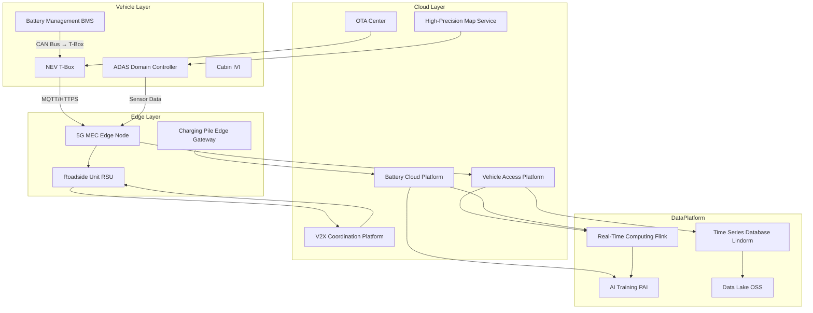
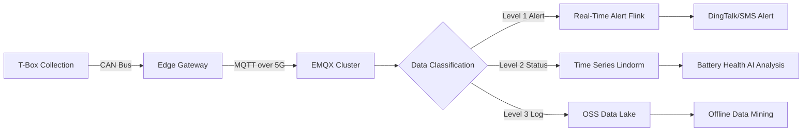
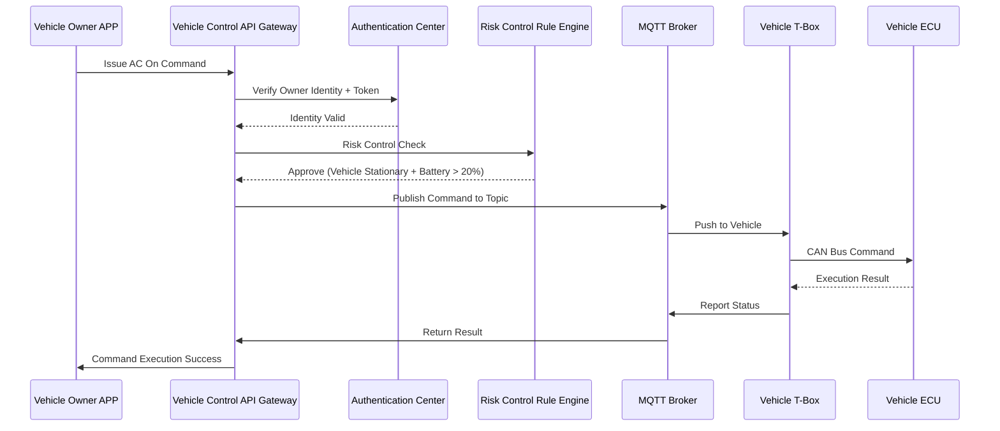
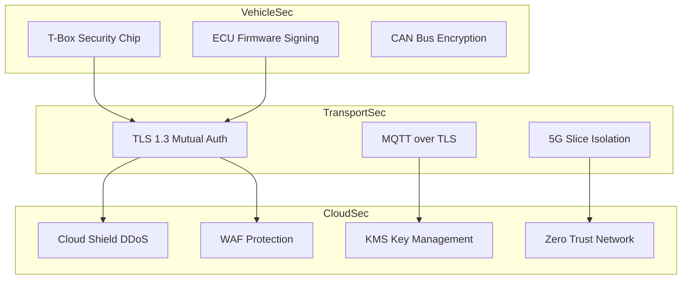

---title: NEV Connected Vehicle Architecture Design - Alibaba Cloud Perspective
description: 'title: NEV Connected Vehicle Architecture Design'
summary: 'title: NEV Connected Vehicle Architecture Design'
category: general
tags:
- architecture
- best-practice
- prometheus
- flux
- falco
- ceph
- redis
- mysql
- kafka
- daemonset
tier: supporting
created: '2026-05-23'
last_updated: 2026-05
difficulty: intermediate
reading_level: intermediate
audience:
- All Engineers
estimated_read_time: 15min
intent_queries:
- What is NEV Connected Vehicle Architecture Design - Alibaba Cloud Perspective
- How to implement NEV Connected Vehicle Architecture Design - Alibaba Cloud Perspective
- Kubernetes 20 application patterns best practices
trigger_keywords:
- NEV Connected Vehicle
- Alibaba Cloud Perspective
- application
- patterns
prerequisites:
- kubectl-basics
- prometheus-basics
- kafka-basics
- redis-basics
- mysql-basics
authors:
- name: Dillan Teagle
  role: contributor
source_path: /Users/teaglebuilt/github/teaglebuilt/knowledge/tree/application/architecture/nev-connected-vehicle.md
original_language: Chinese
---

> **Production Environment Safety Notice**
>
> This document contains operational commands that can be executed directly. Before executing, confirm: the target cluster and namespace are correct; you have sufficient RBAC permissions; the command has been tested in a non-production environment. Risk levels for commands: 🔴 High risk (may cause data loss or service interruption), 🟡 Medium risk (modifies cluster state but usually reversible), 🟢 Low risk/read-only (information gathering, no side effects).

title: NEV Connected Vehicle Architecture Design
description: '# NEV Connected Vehicle Architecture Design - Alibaba Cloud Perspective'
category: application-architecture
tags:
- k8s
- architecture
- industry
- [[Prometheus|prometheus]]
- [[Flux|flux]]
- [[Falco|falco]]
- ceph
- redis
- mysql
- kafka
last_updated: 2026-05-18
difficulty: advanced
reading_level: advanced
audience:
- Connected Vehicle Architects
- Automotive Software Engineers
- Edge Computing Engineers
estimated_read_time: 5min
intent_queries:
- New Energy Vehicle Connected Kubernetes MQTT
- T-Box Access K8s Million-Level Concurrency
- Battery BMS Time Series Database Kubernetes
- OTA Upgrade Kubernetes Differential Upgrade
- V2X Vehicle-Road Cooperation K8s Edge
trigger_keywords:
- Connected Vehicle
- New Energy
- Edge Computing
- V2X
- T-Box
- BMS
- OTA
- MQTT
- KubeEdge
- Alibaba Cloud
related_domains:
- domain-01-cluster-fundamentals
- domain-11-production-operations
- domain-11-ai-infra
- domain-7-observability
related_topics:
- 60-v2x-autonomous-driving
- 59-industrial-internet-platform
- 07-iot-platform-architecture
k8s_versions:
- '1.28'
- '1.29'
- '1.30'
- '1.31'
- '1.32'
---

# NEV Connected Vehicle Architecture Design - Alibaba Cloud Perspective

> **Applicable Versions**: Kubernetes v1.29 - v1.33 | **Last Updated**: 2026-04-24
> **Authors**: Alibaba Cloud Solution Architects | **Tags**: `#ConnectedVehicle` `#NewEnergy` `#EdgeComputing` `#V2X` `#AlibabaCloud`

---

## Table of Contents

1. [Industry Background](#1-industry-background)
2. [Business Architecture](#2-business-architecture)
3. [Technical Architecture](#3-technical-architecture)
4. [Core Data Flows](#4-core-data-flows)
5. [Security & Compliance](#5-security--compliance)
6. [Observability](#6-observability)
7. [Alibaba Cloud Component Mapping](#7-alibaba-cloud-component-mapping)
8. [Production Checklist](#8-production-checklist)

---

## 1. Industry Background

## 1.1 Business Characteristics

NEV connected vehicles form an integrated "vehicle-road-cloud-network-map" complex system:

| Challenge | Description | Architecture Impact |
|:---|:---|:---|
| Massive Vehicle Access | Millions of vehicles with T-Box online | High-concurrency MQTT + Edge Distribution |
| Low-Latency Commands | Remote control / OTA < 200ms | Edge Computing Nodes Deployed Locally |
| Data Torrent | Single vehicle 1-10GB/day sensor data | Tiered Storage + Hot/Cold Separation |
| Functional Safety | ASIL-D level requirements | Redundant Architecture + Fault Isolation |
| Geographic Distribution | Vehicles flowing nationwide | Cloud-Edge Collaboration + Local Access |

## 1.2 Core Scenarios

- **T-Box Access**: Real-time vehicle status reporting and remote control
- **Battery Management BMS**: Real-time monitoring, issue alerts, lifespan prediction
- **Intelligent Driving ADAS**: Perception data fusion, decision delivery
- **OTA Upgrade**: Whole vehicle firmware differential upgrade
- **V2X Vehicle-Road Cooperation**: Roadside Unit RSU coordination

---

## 2. Business Architecture

## 2.1 Vehicle-Road-Cloud Integration Architecture

---

## 3. Technical Architecture

## 3.1 Cloud-Edge Collaborative K8s Architecture

K8s deployments spanning cloud center and regional edge nodes with EMQX MQTT clusters, time-series databases, and AI training platforms integrated for vehicle data processing.

---

## 4. Core Data Flows

## 4.1 Vehicle Real-Time Data Reporting

## 4.2 Remote Control Command Delivery

---

## 5. Security & Compliance

## 5.1 Connected Vehicle Security System

---

## 6. Observability

## 6.1 Monitoring Architecture

- **Vehicle Online Rate**: Custom metrics in ARMS showing real-time vehicle online ratio by region
- **MQTT Connection Quality**: EMQX built-in metrics + Prometheus Exporter
- **Battery Alerts**: Lindorm time-series anomaly detection + DingTalk alerts
- **OTA Success Rate**: Upgrade success rate dashboard by vehicle model/version

---

## 7. Alibaba Cloud Component Mapping

| Functional Domain | Self-Built/Open Source | **Alibaba Cloud Cloud-Native Solution** | Selection Rationale |
|:---|:---|:---|:---|
| Container Platform | Self-built K8s | **ACK Pro + ACK Edge** | Unified cloud-edge management |
| Vehicle Access | Self-built EMQX | **IoT Platform + EMQX Enterprise** | Million-level concurrent connections |
| Time Series Database | InfluxDB/TDengine | **Lindorm Time-Series Engine** | PB-scale time-series data, cold-hot tiering |
| Real-Time Computing | Self-built Flink | **Flink Serverless** | Elastic scaling, pay-per-use |
| AI Training | Kubeflow | **PAI Platform** | Distributed training, model management |
| Object Storage | Ceph | **OSS Low-Frequency/Archive** | Long-term vehicle video storage |
| Message Queue | Kafka | **RocketMQ 5.0** | Financial-grade reliability, ordered messages |
| Relational Database | MySQL | **PolarDB** | High-concurrency writes, read-write separation |
| Edge Computing | Self-built | **ENS Edge Node Service** | 5G MEC integration, local computing |
| Observability | Prometheus + ELK | **ARMS + SLS** | Distributed tracing, log analysis |
| Security | Vault + Falco | **Cloud Shield + KMS + WAF** | Compliance, national cryptography support |
| Network | IPSec | **CEN Cloud Enterprise Network + 5G Slice** | Low-latency, high-reliability |

---

## 8. Production Checklist

- [ ] T-Box to Cloud Mutual TLS Certificates Configured Correctly
- [ ] Edge Node 5G Network QoS Policies Configured
- [ ] Vehicle Data Classification Strategy (L1/L2/L3) Verified
- [ ] OTA Upgrade Rollback Mechanism End-to-End Tested
- [ ] Battery Alert Thresholds Tuned (SOH/SOC/Temperature)
- [ ] Million-Level MQTT Connection Stress Testing Passed
- [ ] Level 3 Information Security / ISO 26262 Compliance Audit
- [ ] Disaster Recovery: Single-Region Issue Vehicle Failover Verified

---

**Maintainers**: Alibaba Cloud Solution Architecture Team | **License**: MIT

---

## Obsidian Related Documents

- topic-application-architecture MOC
- [[domain-20-application-patterns/topic-application-architecture/README.md|Topic Application Architecture Design Best Practices]]
- [[domain-20-application-patterns/topic-application-architecture/01-ecommerce-architecture.md|E-Commerce System Kubernetes Production Architecture Design]]
- [[domain-20-application-patterns/topic-application-architecture/02-mini-program-architecture.md|Mini Program Platform Architecture Design]]
- [[domain-20-application-patterns/topic-application-architecture/03-cms-architecture.md|CMS Content Management System Architecture Design]]
- [[domain-20-application-patterns/topic-application-architecture/04-im-rtc-architecture.md|Real-Time Communication IM/RTC Architecture Design]]
- [[domain-20-application-patterns/topic-application-architecture/05-online-education-architecture.md|Online Education Platform Kubernetes Production Architecture Design]]
- [[domain-20-application-patterns/topic-application-architecture/06-fintech-architecture.md|FinTech Financial Technology Kubernetes Production Architecture Design]]
- [[domain-20-application-patterns/topic-application-architecture/07-iot-platform-architecture.md|IoT Internet of Things Platform Architecture Design]]
- [[domain-20-application-patterns/topic-application-architecture/08-ai-ml-inference-architecture.md|AI/ML Inference Service Kubernetes Production Architecture Design]]
- [[domain-20-application-patterns/topic-application-architecture/09-gaming-backend-architecture.md|Gaming Backend Kubernetes Production Architecture Design]]
- [[domain-20-application-patterns/topic-application-architecture/10-social-media-architecture.md|Social Media Platform Kubernetes Production Architecture Design]]

## See Also

- 20-microservice-governance-architecture
- 21-cross-border-ecommerce
- 23-xinchuang-it-innovation
- 24-insurtech

<!-- risk-assessed -->
