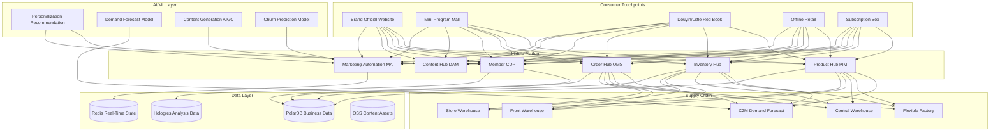
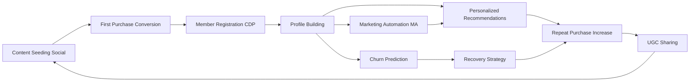

---title: New Retail DTC Architecture Design - Alibaba Cloud Perspective
description: 'title: New Retail DTC Architecture Design'
summary: 'title: New Retail DTC Architecture Design'
category: general
tags:
- architecture
- best-practice
- prometheus
- grafana
- opa
- redis
- mysql
- gateway
- llm
- rag
tier: supporting
created: '2026-05-23'
last_updated: 2026-05
difficulty: intermediate
reading_level: intermediate
audience:
- All Engineers
estimated_read_time: 15min
intent_queries:
- What is New Retail DTC Architecture Design - Alibaba Cloud Perspective
- How to implement New Retail DTC Architecture Design - Alibaba Cloud Perspective
- Kubernetes 20 application patterns best practices
trigger_keywords:
- New Retail
- DTC
- Architecture Design
- Alibaba Cloud Perspective
- application
- patterns
prerequisites:
- kubectl-basics
- prometheus-basics
- monitoring-basics
- redis-basics
- mysql-basics
- policy-basics
authors:
- name: Dillan Teagle
  role: contributor
source_path: /Users/teaglebuilt/github/teaglebuilt/knowledge/tree/application/architecture/new-retail-dtc.md
original_language: Chinese
---

> **Production Environment Safety Notice**
>
> This document contains operational commands that can be executed directly. Before executing, confirm: the target cluster and namespace are correct; you have sufficient RBAC permissions; the command has been tested in a non-production environment. Risk levels for commands: 🔴 High risk (may cause data loss or service interruption), 🟡 Medium risk (modifies cluster state but usually reversible), 🟢 Low risk/read-only (information gathering, no side effects).

title: New Retail DTC Architecture Design
description: '# New Retail DTC Architecture Design - Alibaba Cloud Perspective'
category: application-architecture
tags:
- k8s
- architecture
- industry
- [[Prometheus|prometheus]]
- grafana
- opa
- redis
- mysql
- gateway
- llm
last_updated: 2026-05-18
difficulty: advanced
reading_level: advanced
audience:
- New Retail Architects
- E-Commerce Platform Engineers
- CDP Experts
estimated_read_time: 5min
intent_queries:
- DTC Brand Private Domain CDP Customer Data Platform
- New Retail Omnichannel Inventory Hub
- Subscription E-Commerce Fulfillment Engine
- C2M Flexible Supply Chain Reverse Customization
- Alibaba Cloud Hologres Real-Time Analysis
trigger_keywords:
- New Retail
- DTC Direct-to-Consumer Brand
- CDP Customer Data Platform
- Private Domain Operations
- Omnichannel
- Subscription E-Commerce
- C2M Customization
- Flexible Supply Chain
- Membership System
- Marketing Automation
related_domains:
- domain-03-networking-traffic
- domain-10-troubleshooting-diagnostics
related_topics:
- topic-new-retail-architecture
- topic-ecommerce-architecture
k8s_versions:
- '1.28'
- '1.29'
- '1.30'
- '1.31'
- '1.32'
---

# New Retail DTC Architecture Design - Alibaba Cloud Perspective

> **Applicable Versions**: [[Kubernetes|Kubernetes]] v1.29 - v1.33 | **Last Updated**: 2026-04-24
> **Authors**: Alibaba Cloud Solution Architects | **Tags**: `#NewRetail` `#DTC` `#BrandDirect` `#AlibabaCloud`

---

## Table of Contents

1. [Industry Overview](#1-industry-overview)
2. [Business Scenarios](#2-business-scenarios)
3. [Architecture Design](#3-architecture-design)
4. [Core Technology Stack](#4-core-technology-stack)
5. [Kubernetes Deployment](#5-kubernetes-deployment)
6. [Data Architecture](#6-data-architecture)
7. [AI/ML Components](#7-aiml-components)
8. [Security & Compliance](#8-security--compliance)
9. [Best Practices](#9-best-practices)
10. [Anti-Patterns](#10-anti-patterns)
11. [Reference Resources](#11-reference-resources)

---

## 1. Industry Overview

## 1.1 Market Scale & Trends

DTC (Direct-to-Consumer) brands bypass intermediaries to connect directly with consumers through owned channels (official website / mini program / retail stores). Global DTC market expected to grow from $500B in 2024 to $2T by 2030. China's new retail DTC market led by brands like Perfect Diary, Nayuki Qvantum, Molly Entertainment, and SHEIN, with core trends including private domain operations, CDP customer data platforms, C2M reverse customization, and flexible supply chains.

| Metric | 2024 | 2026 (Forecast) | 2030 (Forecast) |
|:---|:---|:---|:---|
| Global DTC Market | $500B | $900B | $2000B |
| China DTC Brands | 50,000+ | 100,000+ | 300,000+ |
| CDP Deployment Rate | 25% | 50% | 80% |
| C2M Customization Ratio | 5% | 15% | 35% |
| Subscription Retail Ratio | 3% | 8% | 20% |

## 1.2 Industry Pain Points

| Pain Point | Description | Digital Transformation Driver |
|:---|:---|:---|
| Omnichannel Integration | Website / Mini Program / Retail / Social E-Commerce Data Fragmentation | Unified Product / Inventory / Member Hub |
| Private Domain Operations | User Data Self-Control & Deep Operations | CDP + Marketing Automation |
| Rapid Iteration | Small-Batch Fast-Response Flexible Supply Chain Needs | Data Hub-Driven C2M |
| Content Marketing | Brand Story / UGC / KOL Content Management | Content Hub + AIGC |
| Subscription Model | Periodic Delivery Service Management Complexity | Subscription Engine + Intelligent Fulfillment |

---

## 2. Business Scenarios

## 2.1 Brand Independent Website Mall

Build brand-owned official website mall supporting product display, shopping cart, payment, order tracking. Differentiate from Shopify/WooCommerce with deeper brand customization and data ownership. P99 < 1s, supporting 10x traffic peaks during major sales.

## 2.2 Private Domain CDP Customer Data Platform

Aggregate cross-channel user data (website browsing / mini program behavior / retail consumption / social interaction) to build unified user profiles. Support audience segmentation, personalization, marketing automation and attribution. CDP is core data asset for DTC brands.

## 2.3 Member Subscription Services

Periodic product subscriptions (coffee / cosmetics / snacks subscription boxes) supporting flexible subscription plan management (monthly/quarterly/annual), auto-renewal, pause/resume, address changes and gift functionality. Subscription engine requires precise delivery date calculation and inventory reservation.

## 2.4 Smart Retail Digitalization

Offline retail digitalization including smart guidance (guidance app + customer profile), QR code purchase, electronic price tags, smart fitting rooms and O2O (online order store pickup/delivery). Store inventory syncs real-time with online inventory.

## 2.5 C2M Flexible Supply Chain

Leverage consumer demand data to drive product development and production. Through pre-order / crowdfunding test market response, arrange production based on actual orders, reducing inventory accumulation. Flexible factories support small-batch multi-variety rapid switching.

---

## 3. Architecture Design

## 3.1 DTC Brand Full Landscape Architecture



---

## 4. Core Technology Stack

| Component | Purpose | Technology | License |
|:---|:---|:---|:---|
| Container Orchestration | Platform Management | ACK Pro | Proprietary |
| Frontend Framework | Brand Website | Next.js 14 / Nuxt 3 | MIT |
| CDN | Global Content Delivery | Aliyun CDN + DCDN | Proprietary |
| Relational DB | Business Data | PolarDB MySQL | Proprietary |
| Cache | Session & Hot Data | Redis Enterprise | Proprietary |
| Search Engine | Product Search | OpenSearch | Apache 2.0 |
| CDP | Customer Data Platform | Alibaba Cloud CDP / Self-Built | Proprietary |
| Message Queue | Event-Driven | RocketMQ 5.x | Apache 2.0 |
| Object Storage | Assets & Media | OSS + CDN | Proprietary |
| AI Platform | Personalization | PAI / PyTorch | Proprietary / BSD |
| Analytics | Real-Time Analytics | Hologres | Proprietary |
| Subscription Engine | Recurring Billing | Self-Built / Stripe Billing | Proprietary |
| Monitoring | Observability | ARMS + SLS + Grafana | Proprietary / Apache 2.0 |

---

## 5. Kubernetes Deployment

## 5.1 DTC Frontend Deployment

```yaml
apiVersion: apps/v1
kind: Deployment
metadata:
  name: dtc-frontend
  namespace: new-retail-dtc
  labels:
    app: dtc-frontend
    tier: web
spec:
  replicas: 6
  selector:
    matchLabels:
      app: dtc-frontend
  strategy:
    rollingUpdate:
      maxSurge: 2
      maxUnavailable: 1
  template:
    metadata:
      labels:
        app: dtc-frontend
        tier: web
      annotations:
        prometheus.io/scrape: "true"
        prometheus.io/port: "9090"
    spec:
      containers:
        - name: nextjs
          image: registry.cn-hangzhou.aliyuncs.com/dtc/frontend:v3.0.0
          ports:
            - containerPort: 3000
              name: http
            - containerPort: 9090
              name: metrics
          env:
            - name: CDN_DOMAIN
              value: "https://cdn.brand.com"
            - name: API_URL
              value: "https://api.brand.com"
            - name: NEXT_PUBLIC_GA_ID
              value: "G-XXXXXXXXXX"
            - name: REDIS_URL
              valueFrom:
                secretKeyRef:
                  name: dtc-secrets
                  key: redis-url
          resources:
            requests:
              memory: "1Gi"
              cpu: "500m"
            limits:
              memory: "2Gi"
              cpu: "1000m"
          readinessProbe:
            httpGet:
              path: /api/health
              port: 3000
            initialDelaySeconds: 10
            periodSeconds: 5
          livenessProbe:
            httpGet:
              path: /api/health
              port: 3000
            initialDelaySeconds: 20
            periodSeconds: 10
```

---

## 6. Data Architecture

## 6.1 User Journey Data Closed Loop



---

## 7. AI/ML Components

## 7.1 Core Models

| Model | Purpose | Input | Output | Framework |
|:---|:---|:---|:---|---|
| Personalization Recommendation | Product Recommendation | User Behavior / Profile / Context | Recommended Product List | Two-Tower + DIN |
| Demand Forecast | Sales Forecast & Replenishment | Historical Sales / Promotions / Seasonality | 30-Day Future Sales | Prophet + LSTM |
| Churn Prediction | User Churn Prediction | Behavior Frequency / Purchase Interval | Churn Probability | XGBoost |
| Content Generation AIGC | Marketing Copy / Image Generation | Product Description / Style | Marketing Copy / Image | LLM + Diffusion |
| Price Optimization | Dynamic Pricing | Cost / Competition / Demand Elasticity | Optimal Price | RL |
| Size Recommendation | Clothing Size Recommendation | Height / Weight / History | Recommended Size | ML Classifier |

---

## 8. Security & Compliance

## 8.1 Industry Regulations & Standards

| Regulation/Standard | Scope | Architecture Requirements |
|:---|:---|:---|
| GDPR | European User Data Protection | Data Consent + Deletion Rights |
| Personal Information Protection Law | China Personal Information Protection | Data Minimization + User Authorization |
| PCI-DSS | Payment Data Security | Payment Info Tokenization |
| Cybersecurity Law | E-Commerce System Security | Compliance + Data Protection |
| Advertising Law | Marketing Content Compliance | Content Audit System |
| Cross-Border E-Commerce | Cross-Border DTC Compliance | Data Localization + Customs Compliance |

---

## 9. Best Practices

1. **CDP as Core Asset**: Invest in building CDP customer data platform, unifying cross-channel user data
2. **Omnichannel Inventory**: Real-time online-offline inventory sync, supporting store dispatch and online returns
3. **Content Hub AIGC**: Use AIGC for batch marketing copy and image generation, reducing content costs
4. **Flexible Subscription Configuration**: Support multiple subscription plans with flexible pause/resume and gift functions
5. **C2M Demand-Driven**: Verify demand through pre-sales / crowdfunding, flexible production reduces inventory
6. **Private Domain Community**: Build brand communities (WeChat groups / enterprise WeChat) increasing user stickiness
7. **Real-Time Personalization**: Based on real-time behavior data personalized recommendations and marketing triggers
8. **Full-Link Attribution**: Complete attribution analysis from seeding to purchase optimizing marketing ROI
9. **Global CDN**: Cross-border DTC uses global CDN for accelerated official website access
10. **A/B Testing Normalized**: Continuous A/B testing of pages / recommendations / marketing strategies

---

## 10. Anti-Patterns

1. **Third-Party Platform Dependency**: All sales dependent on Tmall/Amazon, losing data autonomy. Should build owned channels
2. **Data Silos**: Each channel has separate data, unable to build unified profiles. Should unify through CDP
3. **Ignoring Subscription Model**: Focus only on single sales, ignoring LTV improvement. Should develop subscriptions
4. **Over-Discounting**: Frequent discounting damages brand value. Should improve repeat purchases through personalization
5. **Neglecting Content**: No investment in content marketing, low brand awareness. Should build content hub

---

## 11. Reference Resources

- [Shopify DTC Report](https://www.shopify.com/research)
- [Alibaba Cloud CDP Docs](https://help.aliyun.com/product/)
- [Next.js Official Docs](https://nextjs.org/docs)
- [Alibaba Cloud CDN Docs](https://help.aliyun.com/product/)
- [OpenSearch Documentation](https://opensearch.org/docs/)

---

**Maintainers**: Alibaba Cloud Solution Architecture Team | **License**: MIT

---

## Obsidian Related Documents

- topic-application-architecture MOC
- [[domain-20-application-patterns/topic-application-architecture/README.md|Topic Application Architecture Design Best Practices]]
- [[domain-20-application-patterns/topic-application-architecture/01-ecommerce-architecture.md|E-Commerce System Kubernetes Production Architecture Design]]
- [[domain-20-application-patterns/topic-application-architecture/02-mini-program-architecture.md|Mini Program Platform Architecture Design]]
- [[domain-20-application-patterns/topic-application-architecture/03-cms-architecture.md|CMS Content Management System Architecture Design]]
- [[domain-20-application-patterns/topic-application-architecture/04-im-rtc-architecture.md|Real-Time Communication IM/RTC Architecture Design]]
- [[domain-20-application-patterns/topic-application-architecture/05-online-education-architecture.md|Online Education Platform Kubernetes Production Architecture Design]]
- [[domain-20-application-patterns/topic-application-architecture/06-fintech-architecture.md|FinTech Financial Technology Kubernetes Production Architecture Design]]
- [[domain-20-application-patterns/topic-application-architecture/07-iot-platform-architecture.md|IoT Internet of Things Platform Architecture Design]]
- [[domain-20-application-patterns/topic-application-architecture/08-ai-ml-inference-architecture.md|AI/ML Inference Service Kubernetes Production Architecture Design]]
- [[domain-20-application-patterns/topic-application-architecture/09-gaming-backend-architecture.md|Gaming Backend Kubernetes Production Architecture Design]]
- [[domain-20-application-patterns/topic-application-architecture/10-social-media-architecture.md|Social Media Platform Kubernetes Production Architecture Design]]

## See Also

- 51-smart-manufacturing-mes
- 52-smart-water
- 54-social-gaming-metaverse
- 55-crossborder-dtc

## Related

- topic-application-architecture MOC — Cross-reference


<!-- risk-assessed -->
