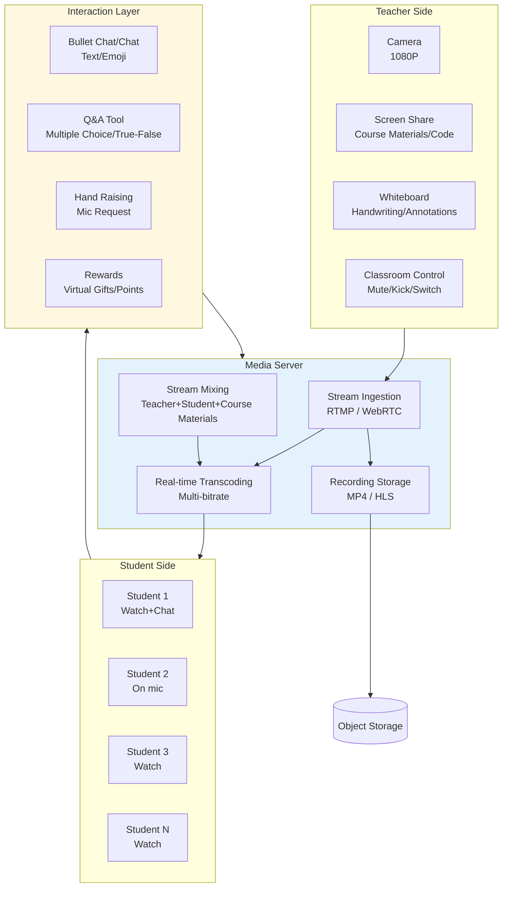
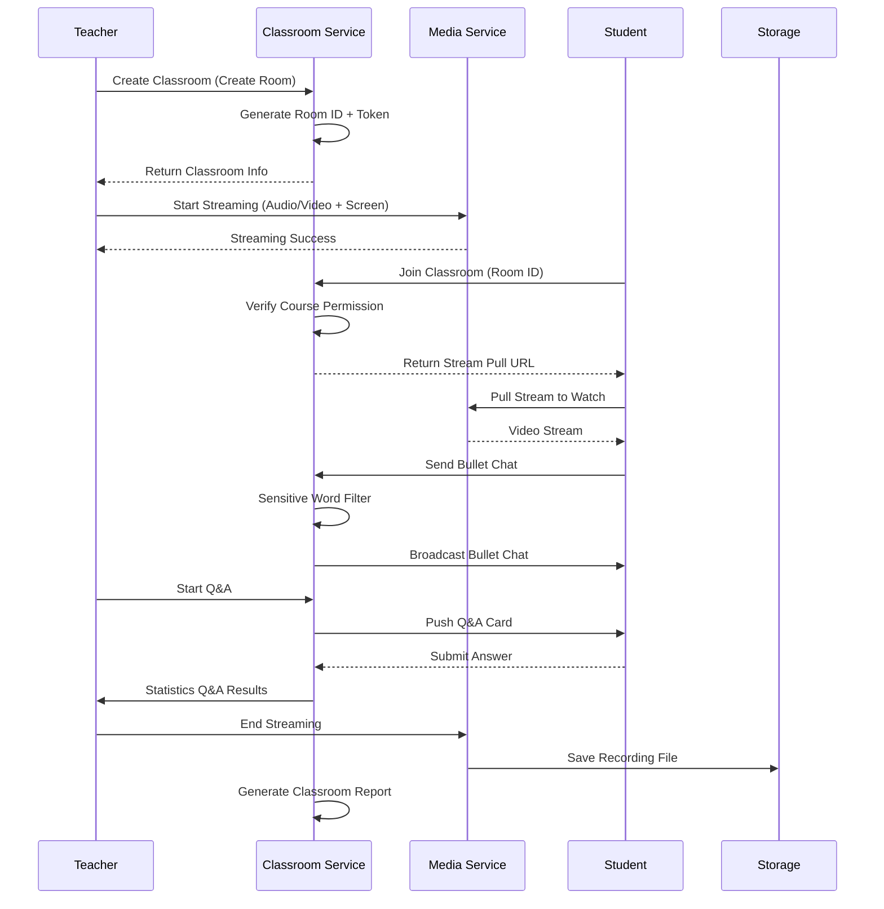
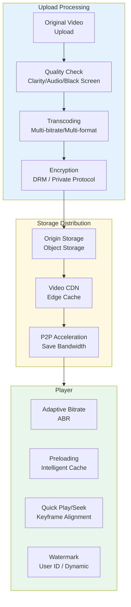
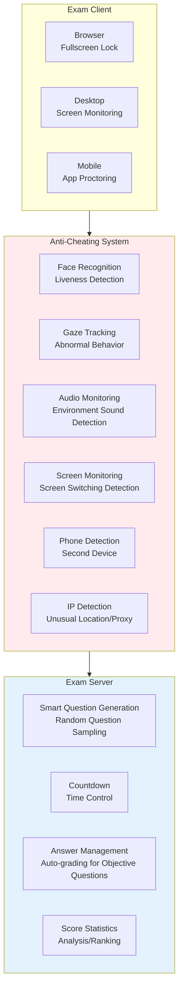
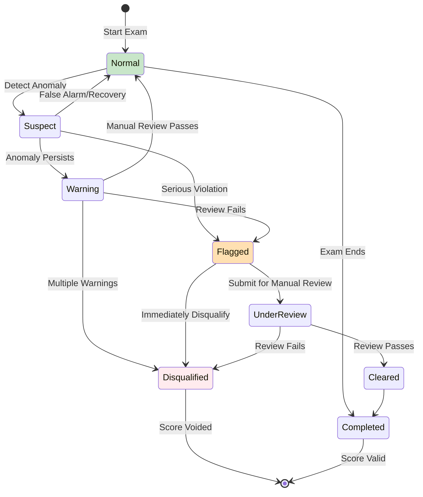
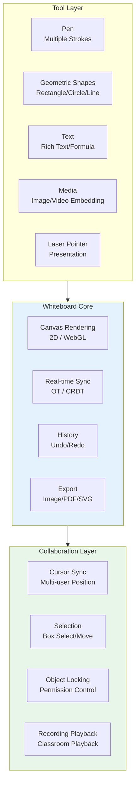
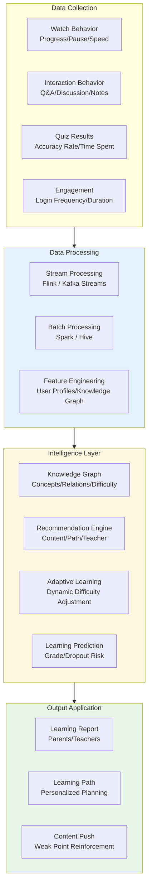
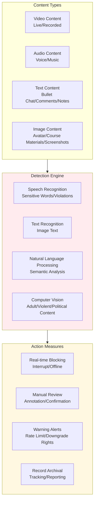

```mermaid
flowchart TB
    subgraph Users["User Roles"]
        STUDENT["Students<br/>Listen/Practice/Interact"]
        TEACHER["Teachers<br/>Teach/Q&A/Grade"]
        PARENT["Parents<br/>Supervise/Reports"]
        ADMIN["Administrators<br/>Courses/Users/Data"]
    end

    subgraph Frontend["Frontend Layer"]
        APP["Mobile App<br/>iOS/Android"]
        WEB["Web<br/>PC/Tablet"]
        MINI["Mini Program<br/>Lightweight Access"]
        PAD["Pad<br/>Large Screen Experience"]
    end

    subgraph Platform["Platform Services Layer"]
        LIVE["Live Service<br/>RTC / CDN"]
        VOD["Video on Demand<br/>Transcoding/Encryption/Playback"]
        CLASS["Classroom Service<br/>Attendance/Hand-raising/Q&A"]
        EXAM["Exam Service<br/>Question Generation/Anti-Cheating/Grading"]
        WHITEBOARD["Whiteboard Service<br/>Interaction/Recording"]
        MSG["Messaging Service<br/>IM / Notifications"]
    end

    subgraph Business["Business Middleware"]
        COURSE["Course Center<br/>Create/Manage/Sell"]
        USER["User Center<br/>Register/Permissions/Profiles"]
        ORDER["Order Center<br/>Payment/Refund/Reconciliation"]
        DATA["Data Center<br/>Learning Reports/Analytics"]
    end

    subgraph Infra["Infrastructure Layer"]
        DB[(Database)]
        CACHE[(Cache)]
        OSS[(Object Storage)]
        CDN[(CDN)]
    end

    Users --> Frontend --> Platform --> Business --> Infra

    style Platform fill:#e3f2fd
    style Business fill:#fff8e1
    style Infra fill:#e8f5e9
```

> **Production Environment Security Notice**
>
> This document contains directly executable operations commands. Before execution, please verify: whether the target cluster and namespace are correct; whether you have sufficient RBAC permissions; whether the commands have been tested in non-production environments. Command risk levels are marked as: 🔴 High risk (may cause data loss or service interruption), 🟡 Medium risk (modifies cluster state, but usually rollbackable), 🟢 Low risk/read-only (information gathering, no side effects).

title: Online Education Platform [[Kubernetes|Kubernetes]] Production Architecture Design
description: '# Online Education Platform Kubernetes Production Architecture Design'
category: application-architecture
tags:
- k8s
- architecture
- industry
- redis
- kafka
- hpa
- crd
- operator
- rag
last_updated: 2026-05-18
difficulty: advanced
reading_level: advanced
audience:
- Education Platform Architects
- Product Technology Leads
- SRE
estimated_read_time: 5min
intent_queries:
- Online Education Kubernetes Live Classroom
- Education Platform RTC Kubernetes Deployment
- Online Exam Anti-Cheating Kubernetes
- Interactive Whiteboard Kubernetes Real-time Synchronization
- Learning Data Recommendation System K8s
trigger_keywords:
- Online Education
- Kubernetes
- Live Classroom
- RTC
- Anti-Cheating
- Interactive Whiteboard
- Learning Recommendation
- Tekton
- HPA
related_domains:
- domain-01-cluster-fundamentals
- domain-11-production-operations
- domain-11-ai-infra
related_topics:
- 02-mini-program-architecture
- 04-im-rtc-architecture
- 48-vocational-edtech
authors:
- name: KUDIG Team
  role: contributor
k8s_versions:
- '1.28'
- '1.29'
- '1.30'
- '1.31'
- '1.32'
---

# Online Education Platform Kubernetes Production Architecture Design

> **Applicable Scenarios**: K12 Education / Vocational Education / Enterprise Training / Live Classroom / Online Exam  
> **Applicable Versions**: Kubernetes v1.29 - v1.33  
> **Last Updated**: 2026-04-24  
> **Target Readers**: Education Platform Architects, Product Technology Leads

---

<!-- chunk: 📋 Table of Contents -->## 📋 Table of Contents

- [I. Overall Architecture Overview](#i-overall-architecture-overview)
- [II. Live Classroom Architecture](#ii-live-classroom-architecture)
- [III. Recorded Course Architecture](#iii-recorded-course-architecture)
- [IV. Online Exam and Anti-Cheating Architecture](#iv-online-exam-and-anti-cheating-architecture)
- [V. Interactive Whiteboard Architecture](#v-interactive-whiteboard-architecture)
- [VI. Learning Data and Recommendation Architecture](#vi-learning-data-and-recommendation-architecture)
- [VII. Content Safety and Compliance Architecture](#vii-content-safety-and-compliance-architecture)
- [VIII. K8s Deployment Architecture](#viii-k8s-deployment-architecture)

---

<!-- chunk: I. Overall Architecture Overview -->## I. Overall Architecture Overview



---

<!-- chunk: II. Live Classroom Architecture -->## II. Live Classroom Architecture



## Live Classroom Sequence



---

<!-- chunk: III. Recorded Course Architecture -->## III. Recorded Course Architecture



## Video Encryption K8s Pipeline

```yaml
apiVersion: tekton.dev/v1beta1
kind: Pipeline
metadata:
  name: video-processing-pipeline
  namespace: edu-media
spec:
  workspaces:
    - name: source
  params:
    - name: video-url
      type: string
    - name: course-id
      type: string
  tasks:
    - name: download
      taskSpec:
        steps:
          - name: wget
            image: alpine
            script: |
              wget $(params.video-url) -O /workspace/source/video.mp4
      workspaces:
        - name: source
          workspace: source

    - name: inspect
      runAfter: [download]
      taskSpec:
        steps:
          - name: ffprobe
            image: jrottenberg/ffmpeg:latest
            script: |
              ffprobe -v error \
                -select_streams v:0 \
                -show_entries stream=width,height,bit_rate \
                -of csv /workspace/source/video.mp4
      workspaces:
        - name: source
          workspace: source

    - name: transcode
      runAfter: [inspect]
      taskSpec:
        steps:
          - name: ffmpeg
            image: jrottenberg/ffmpeg:latest
            script: |
              # 1080p
              ffmpeg -i /workspace/source/video.mp4 \
                -c:v libx264 -crf 23 -preset fast \
                -c:a aac -b:a 128k \
                -s 1920x1080 \
                /workspace/source/1080p.mp4
              # 720p
              ffmpeg -i /workspace/source/video.mp4 \
                -c:v libx264 -crf 26 -preset fast \
                -c:a aac -b:a 96k \
                -s 1280x720 \
                /workspace/source/720p.mp4
      workspaces:
        - name: source
          workspace: source

    - name: encrypt-and-upload
      runAfter: [transcode]
      taskSpec:
        steps:
          - name: encrypt
            image: edu/video-encryptor:v1.0
            script: |
              encrypt-video \
                --input /workspace/source/ \
                --output-prefix $(params.course-id) \
                --drm fairplay-widevine
          - name: upload
            image: ossutil:latest
            script: |
              ossutil cp -r /workspace/source/ \
                oss://edu-videos/courses/$(params.course-id)/
      workspaces:
        - name: source
          workspace: source
```

---

<!-- chunk: IV. Online Exam and Anti-Cheating Architecture -->## IV. Online Exam and Anti-Cheating Architecture



## Anti-Cheating Detection State Machine



---

<!-- chunk: V. Interactive Whiteboard Architecture -->## V. Interactive Whiteboard Architecture



---

<!-- chunk: VI. Learning Data and Recommendation Architecture -->## VI. Learning Data and Recommendation Architecture



---

<!-- chunk: VII. Content Safety and Compliance Architecture -->## VII. Content Safety and Compliance Architecture



---

<!-- chunk: VIII. K8s Deployment Architecture -->## VIII. K8s Deployment Architecture

```yaml
apiVersion: apps/v1
kind: Deployment
metadata:
  name: edu-live-classroom
  namespace: edu-platform
spec:
  replicas: 5
  selector:
    matchLabels:
      app: edu-live-classroom
  template:
    metadata:
      labels:
        app: edu-live-classroom
    spec:
      affinity:
        podAntiAffinity:
          requiredDuringSchedulingIgnoredDuringExecution:
            - labelSelector:
                matchExpressions:
                  - key: app
                    operator: In
                    values:
                      - edu-live-classroom
              topologyKey: kubernetes.io/hostname
      containers:
        - name: classroom
          image: edu/live-classroom:v2.0
          ports:
            - containerPort: 8080
            - containerPort: 9090
              name: grpc
          env:
            - name: RTC_SERVER_URL
              value: "wss://rtc.edu.com"
            - name: MAX_STUDENTS_PER_CLASS
              value: "500"
            - name: REDIS_URL
              value: "redis://redis-cluster:6379"
          resources:
            requests:
              cpu: "1"
              memory: "2Gi"
            limits:
              cpu: "4"
              memory: "8Gi"
---
# HPA Configuration (scale based on active classrooms)
apiVersion: autoscaling/v2
kind: HorizontalPodAutoscaler
metadata:
  name: edu-live-hpa
  namespace: edu-platform
spec:
  scaleTargetRef:
    apiVersion: apps/v1
    kind: Deployment
    name: edu-live-classroom
  minReplicas: 3
  maxReplicas: 50
  metrics:
    - type: Pods
      pods:
        metric:
          name: active_classrooms
        target:
          type: AverageValue
          averageValue: "10"
    - type: Resource
      resource:
        name: cpu
        target:
          type: Utilization
          averageUtilization: 70
```

---

<!-- chunk: Reference Links -->## Reference Links

- [Agora Education Solution](https://www.agora.io/solutions/education)
- [Tencent Cloud TRTC Education](https://cloud.tencent.com/document/product/647/45458)
- [Kubernetes HPA Custom Metrics](https://kubernetes.io/docs/tasks/run-application/horizontal-pod-autoscale/)

---

<!-- chunk: Obsidian Related Documents -->## Obsidian Related Documents

- topic-application-architecture KUDIG Database — Global MOC
- [[domain-20-application-patterns/topic-application-architecture/README.md|[[Topic Application Layer Architecture Design Best Practices|Topic Application Layer Architecture Design Best Practices]]]]
- [[domain-20-application-patterns/topic-application-architecture/01-ecommerce-architecture.md|E-Commerce System Kubernetes Production Architecture Design]]
- [[domain-20-application-patterns/topic-application-architecture/02-mini-program-architecture.md|Mini Program Platform Architecture Design]]
- [[domain-20-application-patterns/topic-application-architecture/03-cms-architecture.md|Content Management System CMS Architecture Design]]
- [[domain-20-application-patterns/topic-application-architecture/04-im-rtc-architecture.md|Real-time Communication IM/RTC Architecture Design]]
- [[domain-20-application-patterns/topic-application-architecture/06-fintech-architecture.md|FinTech Kubernetes Production Architecture Design]]
- [[domain-20-application-patterns/topic-application-architecture/07-iot-platform-architecture.md|IoT Platform Architecture Design]]
- [[domain-20-application-patterns/topic-application-architecture/08-ai-ml-inference-architecture.md|AI/ML Inference Service Kubernetes Production Architecture Design]]
- [[domain-20-application-patterns/topic-application-architecture/09-gaming-backend-architecture.md|Game Backend Kubernetes Production Architecture Design]]
- [[domain-20-application-patterns/topic-application-architecture/10-social-media-architecture.md|Social Media Platform Kubernetes Production Architecture Design]]
- [[domain-20-application-patterns/topic-application-architecture/11-smart-retail-architecture.md|Smart Retail and New Retail Kubernetes Production Architecture Design]]

## See Also

- 03-cms-architecture
- 04-im-rtc-architecture
- 06-fintech-architecture
- 07-iot-platform-architecture


<!-- risk-assessed -->
