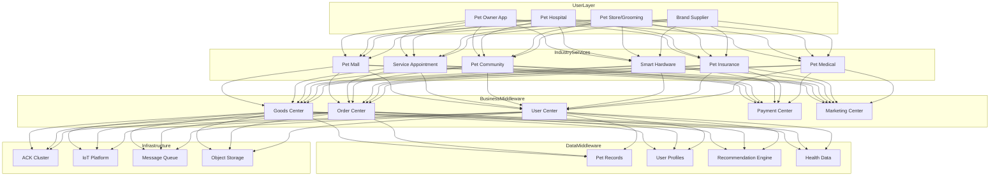
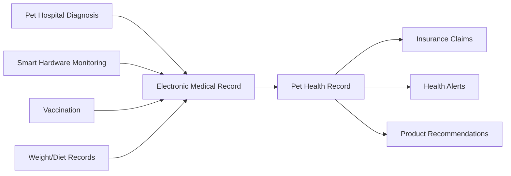

> **Production Environment Security Notice**
>
> This document contains directly executable operations commands. Before execution, please verify: whether the target cluster and namespace are correct; whether you have sufficient RBAC permissions; whether the commands have been tested in non-production environments. Command risk levels are marked as: 🔴 High risk (may cause data loss or service interruption), 🟡 Medium risk (modifies cluster state, but usually rollbackable), 🟢 Low risk/read-only (information gathering, no side effects).

title: Pet Economy Architecture Design
description: '# Pet Economy Architecture Design — Alibaba Cloud Perspective'
category: application-architecture
tags:
- k8s
- architecture
- industry
- redis
- mysql
last_updated: 2026-05-18
difficulty: intermediate
reading_level: intermediate
audience:
- Pet Industry Architects
- Pet Platform Developers
- Pet IoT Solution Engineers
- Alibaba Cloud New Retail Solution Architects
estimated_read_time: 5min
intent_queries:
- Pet Economy Platform [[Kubernetes|Kubernetes]] Deployment Architecture
- Pet E-Commerce Service Appointment Scheduling System
- Pet Smart Hardware IoT Device Management
- Pet Insurance Claim Automation
- Pet Health Record Data Management
trigger_keywords:
- Pet Economy
- Pet E-Commerce
- Pet Services
- Pet Insurance
- Pet Medical
- Pet Community
- Smart Hardware
- Pet Food
- Pet Hospital
- Pet Grooming
related_domains:
- domain-03-networking-traffic
- domain-5-edge-computing
- domain-7-ai-ml-platform
related_topics:
- domain-20-application-patterns/topic-application-architecture/49-livestream-ecommerce
- domain-20-application-patterns/topic-application-architecture/56-smart-elderly-care
authors:
- name: KUDIG Team
  role: contributor
k8s_versions:
- '1.28'
- '1.29'
- '1.30'
- '1.31'
- '1.32'
---

# Pet Economy Architecture Design — Alibaba Cloud Perspective

> **Applicable Versions**: Kubernetes v1.29 - v1.33 | **Last Updated**: 2026-05-18
> **Authors**: Alibaba Cloud Solution Architects | **Tags**: `#PetEconomy` `#PetE-Commerce` `#PetServices` `#AlibabCloud`

---

## Table of Contents

1. [Overview](#1-overview)
2. [Design Principles](#2-design-principles)
3. [Architecture Patterns](#3-architecture-patterns)
4. [Implementation Examples](#4-implementation-examples)
5. [Deployment on Kubernetes](#5-deployment-on-kubernetes)
6. [Best Practices](#6-best-practices)
7. [Anti-Patterns](#7-anti-patterns)
8. [Reference Resources](#8-reference-resources)

---

## 1. Overview

The pet economy is one of the fastest-growing consumer sectors globally. China's pet market size has exceeded 300 billion yuan, covering multiple sub-industries including pet food, supplies, medical care, services, social platforms, and smart hardware. With the deepening trend of "anthropomorphizing" pets, consumers have increasingly higher quality demands, creating fine-segmented markets such as premium pet food, pet medical insurance, pet behavior training, and pet funeral services.

The core business characteristics of pet economy platforms are "e-commerce + services + content + IoT" in integration: e-commerce (online sales of pet food/supplies/medicine), services (appointment scheduling for grooming/medical/boarding/training), content (pet short videos/communities/Q&A), and IoT (smart feeders/water dispensers/locators). These four business lines share user data and pet records, requiring unified data platform support.

From an architecture perspective, pet economy platforms are typical multi-business integrated e-commerce platforms. Technical challenges include: non-standardized goods (diverse pet food specifications, complex SKU management), service appointment scheduling (multi-store/multi-technician/multi-time segment resource scheduling), content review (UGC pet content compliance), IoT device management (millions of smart devices connection and data collection), and same-day delivery (pet food hour-level logistics).

### 1.1 Industry Background

| Challenge | Description | Architecture Impact |
|:---|:---|:---|
| Non-standardized Goods | Diverse pet food/supply specifications | Flexible goods system + attribute management |
| Service Appointment | Multiple types of grooming/medical/boarding | Calendar scheduling engine + resource management |
| Content Community | UGC pet short videos/images | Content review + recommendation system |
| Smart Hardware | Feeders/water dispensers/locators | IoT platform + device management |
| Same-day Delivery | Pet food hour-level delivery | Same-city delivery + inventory management |

### 1.2 Core Scenarios

- **Pet E-Commerce**: Main food/snacks/supplies/prescription medicine sales, supporting recommendations by pet type/breed/age
- **Service Appointment**: Online booking and scheduling for pet hospitals/grooming/beauty/boarding/training
- **Pet Community**: Pet photos/Q&A/knowledge/adoption content community
- **Smart Hardware**: Connection management and data display for smart feeders/water dispensers/locators
- **Pet Insurance**: Medical/accidental/third-party liability insurance offerings and claims

---

## 2. Design Principles

### 2.1 Pet-Centric Principle

Traditional e-commerce centers on users, but pet economy platforms need to build data models centered on "pets". Each pet has an independent record (breed, age, weight, health records, dietary preferences), and recommendation algorithms are based on pet characteristics rather than user behavior alone.

### 2.2 Service Standardization Principle

Pet services (grooming, medical, etc.) have strong non-standardization, with large quality variance between stores/technicians. Platforms need to establish service standardization: standard procedures (SOP), technician certification system, user rating system, service dispute handling mechanisms.

### 2.3 Content Safety Principle

Pet community content requires review control: preventing animal abuse content transmission, preventing false pet medical information, protecting user privacy (pet owner information non-disclosure). Adopt dual mechanisms of AI review + manual review.

### 2.4 Compliant Operations Principle

Pet economy involves multiple regulatory requirements: prescription veterinary drug sales require veterinary practice licenses and practicing veterinarian prescriptions; live animal transactions require animal health certificates; pet medical care requires animal clinical licenses. Systems need to embed compliance checks into business processes.

---

## 3. Architecture Patterns

### 3.1 Pet Economy Platform Comprehensive Architecture



### 3.2 Pet Health Record Data Flow



### 3.3 Service Appointment Scheduling


---

## 4. Implementation Examples

### 4.1 Pet Record Management

```go
package pet

import (
    "time"
)

type PetType string

const (
    PetDog PetType = "dog"
    PetCat PetType = "cat"
)

type Pet struct {
    ID          string
    OwnerID     string
    Name        string
    Type        PetType
    Breed       string
    BirthDate   time.Time
    Weight      float64
    Gender      string
    IsNeutered  bool
    ChipID      string
    Allergies   []string
    Medications []string
}

type HealthRecord struct {
    ID          string
    PetID       string
    Type        string
    Date        time.Time
    Description string
    VetID       string
    Attachments []string
}

type PetProfileService struct {
    pets    map[string]*Pet
    records map[string][]*HealthRecord
}

func NewPetProfileService() *PetProfileService {
    return &PetProfileService{
        pets:    make(map[string]*Pet),
        records: make(map[string][]*HealthRecord),
    }
}

func (s *PetProfileService) CreatePet(pet *Pet) error {
    s.pets[pet.ID] = pet
    return nil
}

func (s *PetProfileService) AddHealthRecord(record *HealthRecord) error {
    s.records[record.PetID] = append(s.records[record.PetID], record)
    return nil
}

func (s *PetProfileService) GetPetProfile(petID string) (*Pet, []*HealthRecord) {
    pet := s.pets[petID]
    records := s.records[petID]
    return pet, records
}
```

### 4.2 Intelligent Recommendation Service

```python
from dataclasses import dataclass
from typing import List

@dataclass
class Pet:
    pet_type: str
    breed: str
    age_months: int
    weight_kg: float
    allergies: List[str]
    activity_level: str

class PetProductRecommender:
    def recommend(self, pet: Pet, category: str = None) -> List[dict]:
        recommendations = []

        if category is None or category == "food":
            recommendations.extend(self._recommend_food(pet))
        if category is None or category == "toys":
            recommendations.extend(self._recommend_toys(pet))
        if category is None or category == "health":
            recommendations.extend(self._recommend_health(pet))

        return sorted(recommendations, key=lambda x: x['score'], reverse=True)

    def _recommend_food(self, pet: Pet) -> List[dict]:
        if pet.age_months < 12:
            life_stage = "puppy" if pet.pet_type == "dog" else "kitten"
        elif pet.age_months < 84:
            life_stage = "adult"
        else:
            life_stage = "senior"

        size = "small" if pet.weight_kg < 10 else \
               "medium" if pet.weight_kg < 25 else "large"

        return [{
            'product_id': f"food-{life_stage}-{size}",
            'name': f"{life_stage.title()} Formula {size.title()} Breed",
            'score': 0.9,
            'reason': f"Suitable for {life_stage} {size} {pet.pet_type}",
        }]

    def _recommend_toys(self, pet: Pet) -> List[dict]:
        activity = pet.activity_level
        return [{
            'product_id': f"toy-{activity}",
            'name': f"Interactive {activity.title()} Toy",
            'score': 0.7,
            'reason': f"Suitable for {activity} activity level pets",
        }]

    def _recommend_health(self, pet: Pet) -> List[dict]:
        products = []
        if pet.age_months > 84:
            products.append({
                'product_id': "supp-joint",
                'name': "Joint Support Supplement",
                'score': 0.8,
                'reason': "Senior pet joint care",
            })
        return products
```

---

## 5. Deployment on Kubernetes

```yaml
apiVersion: apps/v1
kind: Deployment
metadata:
  name: pet-shop
  namespace: pet-economy
spec:
  replicas: 5
  selector:
    matchLabels:
      app: pet-shop
  template:
    metadata:
      labels:
        app: pet-shop
    spec:
      containers:
        - name: shop
          image: registry.cn-hangzhou.aliyuncs.com/pet/shop:v2.0.0
          ports:
            - containerPort: 8080
          env:
            - name: RECOMMEND_API
              value: "http://recommend-service:8080"
            - name: DB_HOST
              valueFrom:
                configMapKeyRef:
                  name: pet-config
                  key: db-host
          resources:
            requests:
              memory: "1Gi"
              cpu: "500m"
            limits:
              memory: "2Gi"
              cpu: "1000m"
```

---

## 6. Best Practices

- **Pet Profiles**: Build complete pet records (breed/age/weight/health/dietary preferences), driving personalized recommendations
- **Service SOP**: Standardize grooming/medical service processes, ensuring consistent service quality
- **Content Review**: AI + manual dual review to prevent non-compliant content transmission
- **Compliance Check**: Prescription drug sales auto-verify veterinary prescriptions, live animal transactions verify health certificates
- **IoT Device Management**: Use MQTT protocol to manage millions of smart devices, supporting OTA upgrades

## 7. Anti-Patterns

### 7.1 Ignoring Prescription Drug Compliance

Online sales of pet prescription drugs without veterinary prescriptions violate veterinary drug regulations.

**Solution**: Embed prescription review into prescription drug sales, requiring veterinary professionals to review uploaded prescription photos before purchase authorization.

### 7.2 Generic Recommendation Algorithm

Using generic e-commerce recommendation algorithms to recommend pet products, ignoring breed/age/weight differences.

**Solution**: Build pet profile system where recommendation algorithms consider pet characteristics alongside user behavior. For example, recommend puppy food for puppies, large-breed specific food for large dogs.

### 7.3 Uncontrolled Service Quality

Different stores on platforms have inconsistent service quality, leading to high complaint rates.

**Solution**: Establish technician certification system, service standard procedures, and user rating mechanisms. Automatically downgrade or delist low-rated stores.

---

## 8. Reference Resources

### 8.1 Alibaba Cloud Component Mapping

| Functional Domain | **Alibaba Cloud Cloud Native Solution** |
|:---|:---|
| Container Platform | **ACK Pro** |
| Database | **PolarDB MySQL** |
| Cache | **Redis Enterprise Edition** |
| IoT | **IoT Platform** |
| AI | **Vision Intelligence + NLP** |
| Object Storage | **OSS + CDN** |
| Observability | **ARMS + SLS** |

### 8.2 Production Checklist

- [ ] Veterinary drug sales qualification verification flow
- [ ] Live animal transportation compliance verification
- [ ] Pet smart hardware access testing
- [ ] UGC content review accuracy > 95%
- [ ] Same-city delivery time < 2h
- [ ] Pet data privacy protection measures

---

**Maintainer**: Alibaba Cloud Solution Architect Team | **License**: MIT

---

## Obsidian Related Documents

- topic-application-architecture KUDIG Database — Global MOC
- [[domain-20-application-patterns/topic-application-architecture/README.md|[[Topic Application Layer Architecture Design Best Practices|Topic Application Layer Architecture Design Best Practices]]]]
- [[domain-20-application-patterns/topic-application-architecture/01-ecommerce-architecture.md|E-Commerce System Kubernetes Production Architecture Design]]
- [[domain-20-application-patterns/topic-application-architecture/02-mini-program-architecture.md|Mini Program Platform Architecture Design]]
- [[domain-20-application-patterns/topic-application-architecture/03-cms-architecture.md|Content Management System CMS Architecture Design]]
- [[domain-20-application-patterns/topic-application-architecture/04-im-rtc-architecture.md|Real-time Communication IM/RTC Architecture Design]]
- [[domain-20-application-patterns/topic-application-architecture/05-online-education-architecture.md|Online Education Platform Kubernetes Production Architecture Design]]
- [[domain-20-application-patterns/topic-application-architecture/06-fintech-architecture.md|FinTech Kubernetes Production Architecture Design]]
- [[domain-20-application-patterns/topic-application-architecture/07-iot-platform-architecture.md|IoT Platform Architecture Design]]
- [[domain-20-application-patterns/topic-application-architecture/08-ai-ml-inference-architecture.md|AI/ML Inference Service Kubernetes Production Architecture Design]]
- [[domain-20-application-patterns/topic-application-architecture/09-gaming-backend-architecture.md|Game Backend Kubernetes Production Architecture Design]]
- [[domain-20-application-patterns/topic-application-architecture/10-social-media-architecture.md|Social Media Platform Kubernetes Production Architecture Design]]

## See Also

- 35-metaverse-digital-twin
- 36-carbon-esg-management
- 38-supply-chain-finance
- 39-smart-campus


<!-- risk-assessed -->
