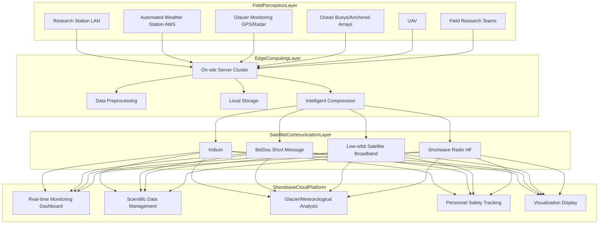
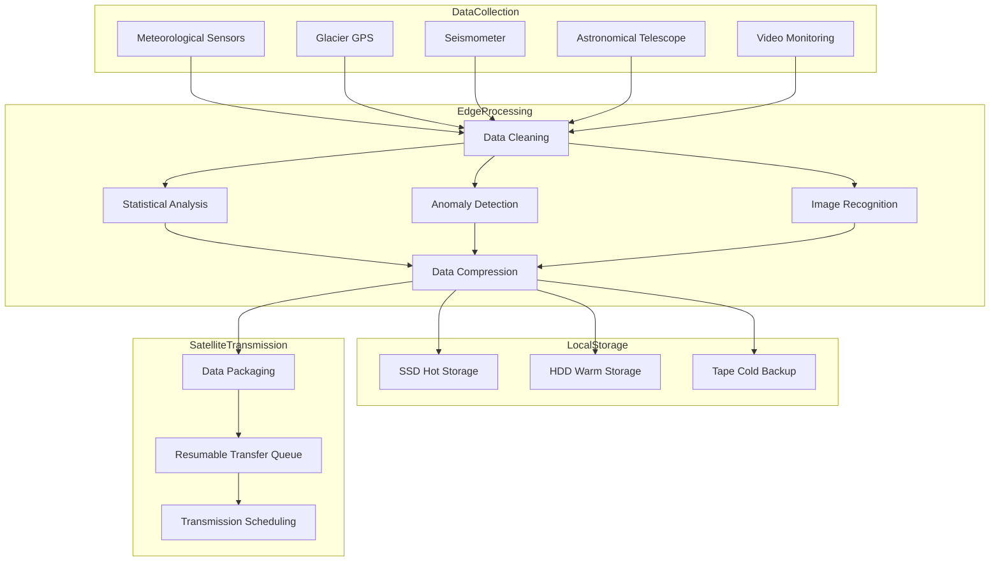
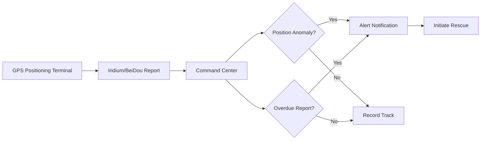

> **Production Environment Security Notice**
>
> This document contains directly executable operations commands. Before execution, please verify: whether the target cluster and namespace are correct; whether you have sufficient RBAC permissions; whether the commands have been tested in non-production environments. Command risk levels are marked as: 🔴 High risk (may cause data loss or service interruption), 🟡 Medium risk (modifies cluster state, but usually rollbackable), 🟢 Low risk/read-only (information gathering, no side effects).

title: Polar Research Architecture Design
description: '# Polar Research Architecture Design — Alibaba Cloud Perspective'
category: application-architecture
tags:
- k8s
- architecture
- industry
- scheduler
- [[DaemonSet|daemonset]]
- operator
- webhook
last_updated: 2026-05-18
difficulty: advanced
reading_level: advanced
audience:
- Polar Research Information Infrastructure Architects
- Edge Computing Engineers
- Extreme Environment Systems Experts
estimated_read_time: 5min
intent_queries:
- Polar Research [[Kubernetes|Kubernetes]] Edge Computing
- Glacier Monitoring Satellite Communication K8s
- Polar Environment Low-bandwidth Kubernetes
- Antarctic Arctic Research Station K8s Deployment
- Polar Research Energy Optimization Kubernetes
trigger_keywords:
- Polar Research
- Glacier Monitoring
- Antarctica
- Arctic
- Satellite Communication
- Iridium
- Edge Computing
- Alibaba Cloud
related_domains:
- domain-01-cluster-fundamentals
- domain-11-production-operations
- domain-7-observability
related_topics:
- 78-deep-sea-exploration
- 77-fusion-energy-monitoring
- 66-space-internet
authors:
- name: KUDIG Team
  role: contributor
k8s_versions:
- '1.28'
- '1.29'
- '1.30'
- '1.31'
- '1.32'
---

# Polar Research Architecture Design — Alibaba Cloud Perspective

> **Applicable Versions**: Kubernetes v1.29 - v1.33 | **Last Updated**: 2026-04-24
> **Authors**: Alibaba Cloud Solution Architects | **Tags**: `#PolarResearch` `#GlacierMonitoring` `#AntarcticArctic` `#AlibabCloud`

---

<!-- chunk: Table of Contents -->## Table of Contents

1. [Overview](#1-overview)
2. [Design Principles](#2-design-principles)
3. [Architecture Patterns](#3-architecture-patterns)
4. [Implementation Examples](#4-implementation-examples)
5. [Deployment on Kubernetes](#5-deployment-on-kubernetes)
6. [Best Practices](#6-best-practices)
7. [Anti-Patterns](#7-anti-patterns)
8. [Reference Resources](#8-reference-resources)

---

<!-- chunk: 1. Overview -->## 1. Overview

The poles (Antarctica and Arctic) are key components of Earth's climate system, with profound impacts on global climate change, sea level rise, and ocean circulation. Polar research is humanity's core means of understanding and protecting the poles, involving multiple disciplines such as glaciology, meteorology, oceanography, biology, astronomy, and geology.

The extreme nature of polar environments poses unique challenges for information systems: Antarctic inland winter temperatures can reach -80°C, making conventional electronic devices non-functional; polar satellite passes are limited, with extremely scarce communication bandwidth (Iridium communication typically only 2.4-128kbps); during polar night, solar power is unavailable, relying on diesel generators and batteries; personnel safety is the highest priority, with real-time positioning and communication as lifelines.

Polar research information systems adopt three-layer architecture: field layer (research stations, automated observation stations, UAVs) responsible for data collection and basic processing; communication layer (Iridium, BeiDou, low-orbit satellites) responsible for data transmission; platform layer (cloud platform) responsible for data management, scientific analysis and visualization. The three layers communicate through delay-tolerant network protocols.

## 1.1 Industry Background

| Challenge | Description | Architecture Impact |
|:---|:---|:---|
| Extreme Cold | Antarctic Inland -80°C | Industrial-grade cold-resistant equipment + heating cabinets |
| Network Limitations | Satellite bandwidth 2.4-128kbps | Edge computing + deep compression |
| Energy Scarcity | No solar power in winter | Low-power design + intelligent power saving |
| Personnel Safety | Extreme environment isolation | Real-time positioning + emergency communication |
| Valuable Data | Extremely high collection cost | Multi-level backups + resumable transfers |

## 1.2 Core Scenarios

- **Glacier Monitoring**: Glacier movement speed, thickness changes, sub-glacier melting and thawing monitoring
- **Meteorological Observation**: Long-term polar climate observation, temperature/pressure/wind/radiation
- **Ecological Research**: Penguin/seal population monitoring, krill resource assessment
- **Astronomical Observation**: Dome A Antarctic astronomical observatory, utilizing polar night and atmospheric stability
- **Oceanic Survey**: Sub-ice ocean temperature, salinity, ocean current observation

---

<!-- chunk: 2. Design Principles -->## 2. Design Principles

## 2.1 Extreme Reliability Principle

Once deployed in polar regions, equipment may need to run for years without human maintenance. System design must pursue extreme reliability: hardware uses industrial-grade cold-resistant components (-40°C ~ +85°C); software uses watchdog and automatic recovery mechanisms; communication uses multi-link redundancy (Iridium+BeiDou+shortwave); data uses multi-level backups and periodic verification.

## 2.2 Extreme Low-Bandwidth Adaptation Principle

Polar communication bandwidth is extremely limited (typically just kilobits per second), system design must adapt to this constraint: edge terminals complete preprocessing and compression, only transmitting results and critical raw data; transmission protocols support resumable transfers and incremental synchronization; text data uses extreme compression, image data significantly reduces resolution.

## 2.3 Energy Optimization Principle

Polar energy is extremely precious (winter completely depends on diesel generators, transportation costs far exceed fuel itself). System design needs extreme power saving: compute devices choose low-power ARM platforms; non-continuous observation devices use intermittent operation (e.g., wake for 5 minutes hourly); communication modules only activate on demand, keeping radio off when idle.

## 2.4 Safety-First Principle

Personnel safety is the highest priority. System must guarantee: researcher GPS position updates to command center every minute; emergency communication channels always available; weather warnings (blizzard, whiteout) real-time push; field expedition plans auto-approval with overtime alerts.

---

<!-- chunk: 3. Architecture Patterns -->## 3. Architecture Patterns

## 3.1 Polar Research System Comprehensive Architecture



## 3.2 Research Station Edge Computing Architecture



## 3.3 Personnel Safety Monitoring Architecture



---

## 4. Data Compression and Transmission

```python
import struct
import zlib
from datetime import datetime
from typing import List, Tuple

class PolarDataPacker:
    MAX_IRIDIUM_BYTES = 340

    def __init__(self):
        self.sequence = 0

    def pack_weather_data(self, readings: List[dict]) -> List[bytes]:
        packets = []
        buffer = bytearray()

        for r in readings:
            entry = struct.pack('<IfHHHBB',
                                int(r['timestamp']),
                                r['temperature'] * 10,
                                int(r['pressure'] * 10),
                                int(r['humidity']),
                                int(r['wind_speed'] * 10),
                                r['wind_direction'] // 15,
                                r['battery_percent'])
            if len(buffer) + len(entry) > self.MAX_IRIDIUM_BYTES - 8:
                packets.append(self._finalize_packet(buffer))
                buffer = bytearray()
            buffer.extend(entry)

        if buffer:
            packets.append(self._finalize_packet(buffer))

        return packets

    def pack_gps_track(self, points: List[dict]) -> List[bytes]:
        packets = []
        buffer = bytearray()

        if not points:
            return packets

        base_lat = points[0]['latitude']
        base_lon = points[0]['longitude']
        buffer.extend(struct.pack('<dff',
                                   int(points[0]['timestamp']),
                                   base_lat, base_lon))

        for p in points[1:]:
            dlat = int((p['latitude'] - base_lat) * 1e6)
            dlon = int((p['longitude'] - base_lon) * 1e6)
            dt = int(p['timestamp'] - points[0]['timestamp'])
            delta = struct.pack('<hhI', dlat, dlon, dt)

            if len(buffer) + len(delta) > self.MAX_IRIDIUM_BYTES - 4:
                packets.append(self._finalize_packet(buffer))
                buffer = bytearray()
                base_lat = p['latitude']
                base_lon = p['longitude']
                buffer.extend(struct.pack('<dff',
                                           int(p['timestamp']),
                                           base_lat, base_lon))
            else:
                buffer.extend(delta)

        if buffer:
            packets.append(self._finalize_packet(buffer))

        return packets

    def _finalize_packet(self, data: bytearray) -> bytes:
        self.sequence = (self.sequence + 1) % 65536
        compressed = zlib.compress(bytes(data), level=9)
        header = struct.pack('<HB', self.sequence, len(compressed))
        crc = zlib.crc32(compressed) & 0xFFFF
        checksum = struct.pack('<H', crc)
        return header + compressed + checksum
```

## 4.2 Glacier Movement Monitoring

```python
import numpy as np
from datetime import datetime, timedelta
from typing import List, Tuple

class GlacierMonitor:
    def __init__(self, gps_stations: List[dict]):
        self.stations = {s['id']: s for s in gps_stations}
        self.velocity_history = {s['id']: [] for s in gps_stations}

    def compute_velocity(self, station_id: str,
                          pos_prev: Tuple[float, float, float],
                          pos_curr: Tuple[float, float, float],
                          dt_hours: float) -> dict:
        dx = pos_curr[0] - pos_prev[0]
        dy = pos_curr[1] - pos_prev[1]
        dz = pos_curr[2] - pos_prev[2]

        dist = np.sqrt(dx**2 + dy**2 + dz**2)
        velocity = dist / (dt_hours / 24.0)

        if dist > 0:
            direction = np.degrees(np.arctan2(dy, dx))
        else:
            direction = 0

        result = {
            'station_id': station_id,
            'velocity_m_day': velocity,
            'direction_deg': direction,
            'vertical_change_m': dz,
            'timestamp': datetime.utcnow().isoformat(),
        }

        self.velocity_history[station_id].append(result)
        if len(self.velocity_history[station_id]) > 365:
            self.velocity_history[station_id] = self.velocity_history[station_id][-365:]

        return result

    def detect_anomaly(self, station_id: str,
                        current_velocity: float) -> dict:
        history = self.velocity_history.get(station_id, [])
        if len(history) < 30:
            return {'anomaly': False, 'reason': 'insufficient_data'}

        recent_velocities = [h['velocity_m_day'] for h in history[-30:]]
        mean_v = np.mean(recent_velocities)
        std_v = np.std(recent_velocities)

        if std_v == 0:
            return {'anomaly': False}

        z_score = abs(current_velocity - mean_v) / std_v

        if z_score > 3:
            return {
                'anomaly': True,
                'type': 'surge' if current_velocity > mean_v else 'stagnation',
                'z_score': z_score,
                'mean_velocity': mean_v,
                'current_velocity': current_velocity,
            }

        return {'anomaly': False, 'z_score': z_score}
```

---

## 5. Kubernetes Deployment

## 5.1 Research Station Edge Computing DaemonSet

```yaml
apiVersion: apps/v1
kind: DaemonSet
metadata:
  name: polar-edge-compute
  namespace: polar-research
  labels:
    app: polar-edge-compute
    tier: edge
spec:
  selector:
    matchLabels:
      app: polar-edge-compute
  updateStrategy:
    type: OnDelete
  template:
    metadata:
      labels:
        app: polar-edge-compute
    spec:
      nodeSelector:
        node-type: polar-station
      tolerations:
        - key: "extreme-cold"
          operator: "Exists"
          effect: "NoSchedule"
        - key: "low-bandwidth"
          operator: "Exists"
          effect: "NoSchedule"
      containers:
        - name: edge
          image: registry.cn-hangzhou.aliyuncs.com/polar/edge-compute:v2.0.0
          env:
            - name: SATELLITE_LINK
              value: "iridium"
            - name: BUFFER_SIZE_MB
              value: "1024"
            - name: POWER_MODE
              value: "eco"
            - name: REPORT_INTERVAL_S
              value: "300"
            - name: COMPRESSION_LEVEL
              value: "9"
          resources:
            requests:
              memory: "512Mi"
              cpu: "250m"
            limits:
              memory: "1Gi"
              cpu: "500m"
```

---

## 6. Best Practices

## 6.1 Edge Computing Optimization

- **Low-power Hardware**: Choose ARM architecture computing platforms (e.g. Raspberry Pi CM4 industrial), typical power consumption < 5W
- **Intermittent Operation Mode**: Non-continuous observation devices wake for 5 minutes hourly, deep sleep otherwise
- **Intelligent Compression**: Edge terminals detect anomalies and only transmit changed data
- **Local Priority**: Complete all data processing locally, batch synchronization only when network available

## 6.2 Communication Strategy

- **Multi-link Redundancy**: Critical data transmitted via both Iridium and BeiDou
- **Bandwidth Allocation**: Safety data priority (30%), scientific data secondary (60%), system data last (10%)
- **Intelligent Scheduling**: Full-speed transmission during satellite passes, local buffering otherwise
- **Resumable Transfer**: All data transmission supports resumable transfers

## 6.3 Data Management

- **Three-level Backup**: Research station local SSD + external drives + cloud endpoint, ensuring no data loss
- **Data Stratification**: Real-time data (safety/weather) priority transmission, historical data delayed
- **Standardization**: Use CF (Climate and Forecast) standards for scientific data

---

## 7. Anti-Patterns

## 7.1 Real-time Data Synchronization

Attempting to sync all data to cloud in real-time, ignoring polar communication bandwidth limits.

**Solution**: Edge-first processing, batch synchronization. Daily summary retransmission of scientific data, raw data brought back after expedition.

## 7.2 Commercial Hardware

Deploying commercial servers in polar environments, ignoring temperature, humidity, vibration factors.

**Solution**: Use industrial-grade hardware (-40°C ~ +85°C operating temperature), place equipment in heated cabinets, use waterproof connectors.

## 7.3 Single Communication Link

Relying only on Iridium, complete isolation if terminal malfunction.

**Solution**: Deploy triple communication protection: Iridium + BeiDou + shortwave. BeiDou short message as minimum communication guarantee.

---

**Maintainer**: Alibaba Cloud Solution Architect Team | **License**: MIT

---

## Obsidian Related Documents

- topic-application-architecture MOC
- [[domain-20-application-patterns/topic-application-architecture/README.md|Topic Application Layer Architecture Design Best Practices]]
- [[domain-20-application-patterns/topic-application-architecture/01-ecommerce-architecture.md|E-Commerce System Kubernetes Production Architecture Design]]

## See Also

- 77-fusion-energy-monitoring
- 78-deep-sea-exploration
- 80-tsn-network
- 81-smart-customs


<!-- risk-assessed -->
