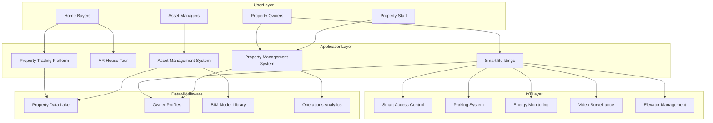
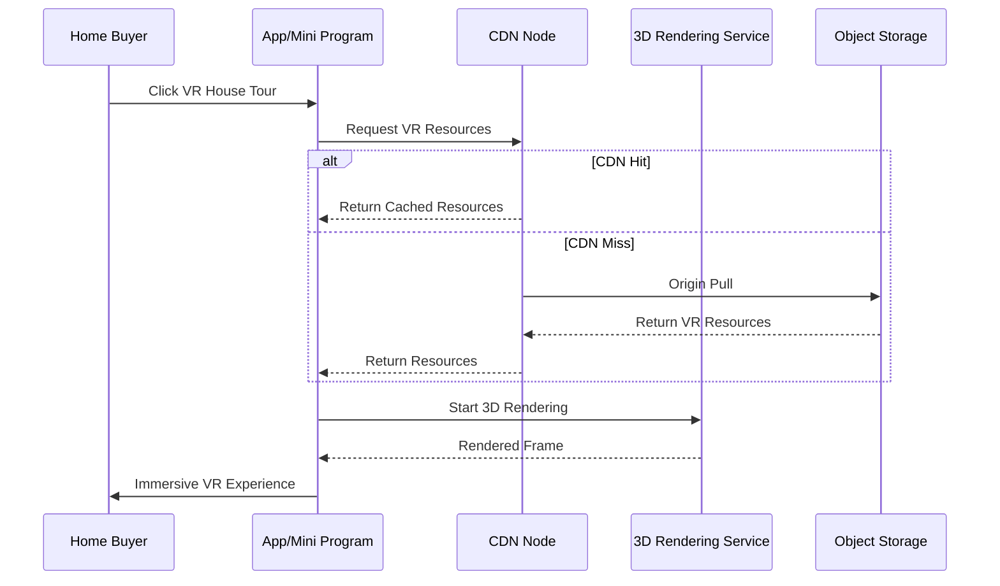
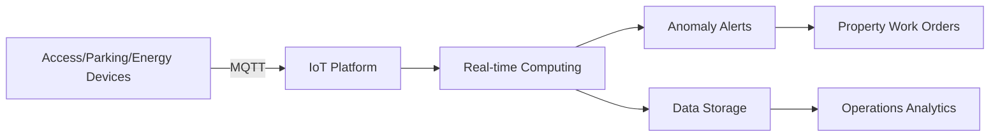

> **Production Environment Security Notice**
>
> This document contains directly executable operations commands. Before execution, please verify: whether the target cluster and namespace are correct; whether you have sufficient RBAC permissions; whether the commands have been tested in non-production environments. Command risk levels are marked as: 🔴 High risk (may cause data loss or service interruption), 🟡 Medium risk (modifies cluster state, but usually rollbackable), 🟢 Low risk/read-only (information gathering, no side effects).

title: Real Estate Technology Architecture Design
description: '# Real Estate Technology Architecture Design — Alibaba Cloud Perspective'
category: application-architecture
tags:
- k8s
- architecture
- industry
- mysql
- gpu
- nvidia
last_updated: 2026-05-18
difficulty: intermediate
reading_level: intermediate
audience:
- Real Estate Technology Architects
- Smart Building Technology Leads
- SRE
estimated_read_time: 5min
intent_queries:
- Real Estate Technology [[Kubernetes|Kubernetes]] PropTech
- Smart Building IoT Alibaba Cloud Architecture
- VR House Tour Kubernetes GPU Rendering
- Real Estate Transaction Platform K8s Microservices
- BIM Digitalization Real Estate Kubernetes
trigger_keywords:
- Real Estate Technology
- PropTech
- Smart Building
- VR House Tour
- IoT
- BIM
- Alibaba Cloud
related_domains:
- domain-01-cluster-fundamentals
- domain-11-production-operations
- domain-7-observability
related_topics:
- 39-smart-campus
- 72-digital-twin-city
- 52-smart-water
authors:
- name: KUDIG Team
  role: contributor
k8s_versions:
- '1.28'
- '1.29'
- '1.30'
- '1.31'
- '1.32'
---

# Real Estate Technology Architecture Design — Alibaba Cloud Perspective

> **Applicable Versions**: Kubernetes v1.29 - v1.33 | **Last Updated**: 2026-04-24
> **Authors**: Alibaba Cloud Solution Architects | **Tags**: `#RealEstateTech` `#PropTech` `#SmartBuilding` `#AlibabCloud`

---

## Table of Contents

1. [Industry Background](#1-industry-background)
2. [Business Architecture](#2-business-architecture)
3. [Technical Architecture](#3-technical-architecture)
4. [Core Data Flow](#4-core-data-flow)
5. [Security and Compliance](#5-security-and-compliance)
6. [Observability](#6-observability)
7. [Alibaba Cloud Component Mapping](#7-alibaba-cloud-component-mapping)
8. [Production Checklist](#8-production-checklist)

---

## 1. Industry Background

### 1.1 Business Characteristics

Real estate technology integrates property transactions, smart buildings, property management, space management:

| Challenge | Description | Architecture Impact |
|:---|:---|:---|
| Low-Frequency High-Value Transactions | Long decision cycles, complex processes | Long workflow processes |
| Property Authenticity | False property prevention | AI review + on-site verification |
| Smart Building IoT | Multiple devices (access/parking/energy) | Edge computing + IoT platform |
| Data Security | Owner privacy protection | Data encryption + desensitization |
| BIM/CIM | Building information models | 3D rendering + big data |

### 1.2 Core Scenarios

- **Property Trading**: Property listing, VR house tours, online signing
- **Smart Buildings**: Access control, parking, energy consumption, security
- **Property Management**: Work order management, equipment maintenance, owner services
- **Asset Management**: Space planning, lease management, revenue analysis

---

## 2. Business Architecture

### 2.1 Real Estate Technology Comprehensive Architecture



### 2.2 VR House Tour Sequence



---

## 3. Technical Architecture

### 3.1 Kubernetes Deployment

```yaml
# VR Rendering Service GPU Deployment
apiVersion: apps/v1
kind: Deployment
metadata:
  name: vr-render-service
  namespace: proptech
spec:
  replicas: 3
  selector:
    matchLabels:
      app: vr-render-service
  template:
    metadata:
      labels:
        app: vr-render-service
    spec:
      nodeSelector:
        accelerator: nvidia-t4
      runtimeClassName: nvidia
      containers:
        - name: render
          image: registry.cn-hangzhou.aliyuncs.com/proptech/vr-render:v1.2.0-gpu
          ports:
            - containerPort: 8080
          resources:
            requests:
              nvidia.com/gpu: 1
              memory: "8Gi"
              cpu: "4000m"
            limits:
              nvidia.com/gpu: 1
              memory: "16Gi"
              cpu: "8000m"
```

---

## 4. Core Data Flow

### 4.1 Smart Building IoT Data Flow



---

## 5. Security and Compliance

- **Personal Information Protection**: Owner information encryption
- **Information Security Level 3**: Smart building systems
- **Video Security**: Compliant surveillance data storage

---

## 6. Observability

- **VR Load Time**: P99 < 3s
- **IoT Data Latency**: < 1s
- **System Availability**: 99.9%

---

## 7. Alibaba Cloud Component Mapping

| Functional Domain | **Alibaba Cloud Cloud Native Solution** |
|:---|:---|
| Container Platform | **ACK Pro** |
| IoT | **Alibaba Cloud IoT Platform** |
| Database | **PolarDB MySQL** |
| Object Storage | **OSS + CDN** |
| Real-time Computing | **Flink** |
| AI | **PAI / Vision Intelligence** |
| Observability | **ARMS + SLS** |

---

## 8. Production Checklist

- [ ] VR resource CDN preheating
- [ ] IoT device access verification
- [ ] Property review accuracy testing
- [ ] Owner privacy data encryption verification
- [ ] Information Security Level 3 compliance audit

---

**Maintainer**: Alibaba Cloud Solution Architect Team | **License**: MIT

---

## Obsidian Related Documents

- topic-application-architecture KUDIG Database — Global MOC
- [[domain-20-application-patterns/topic-application-architecture/README.md|Topic Application Layer Architecture Design Best Practices]]
- [[domain-20-application-patterns/topic-application-architecture/01-ecommerce-architecture.md|E-Commerce System Kubernetes Production Architecture Design]]

## See Also

- 26-aviation-travel
- 27-hospitality-tourism
- 29-agritech-iot
- 30-hrtech-saas


<!-- risk-assessed -->
