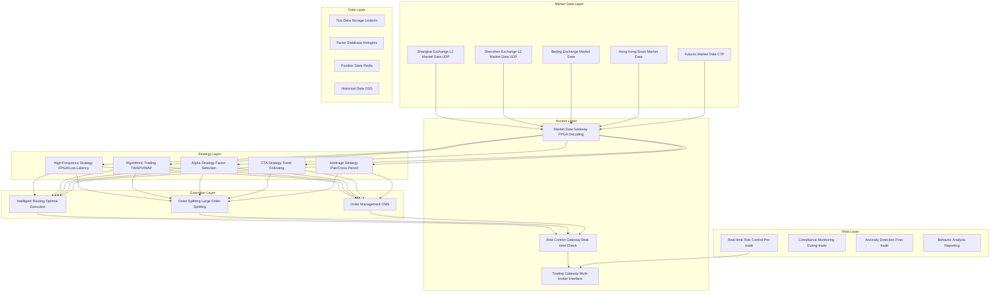

> **Production Environment Security Notice**
>
> This document contains directly executable operations commands. Before execution, please verify: whether the target cluster and namespace are correct; whether you have sufficient RBAC permissions; whether the commands have been tested in non-production environments. Command risk levels are marked as: 🔴 High risk (may cause data loss or service interruption), 🟡 Medium risk (modifies cluster state, but usually rollbackable), 🟢 Low risk/read-only (information gathering, no side effects).

title: Securities Quantitative Trading Architecture Design
description: '# Securities Quantitative Trading Architecture Design — Alibaba Cloud Perspective'
category: application-architecture
tags:
- k8s
- architecture
- industry
- [[Prometheus|prometheus]]
- grafana
- redis
- mysql
- kafka
- [[StatefulSet|statefulset]]
- [[DaemonSet|daemonset]]
last_updated: '2026-05-18'
difficulty: expert
reading_level: expert
audience:
- Quantitative Trading Architects
- FinTech Developers
- FPGA Engineers
- Alibaba Cloud Financial Cloud Architects
estimated_read_time: 5min
intent_queries:
- Quantitative Trading System Architecture Design
- FPGA Market Data Decoding Ultra-Low Latency
- High-Frequency Trading Strategy Engine
- Real-time Risk Control Engine Flink
- Tick Data Time-Series Storage
trigger_keywords:
- Quantitative Trading
- High-Frequency Trading
- HFT
- FPGA
- Ultra-Low Latency
- Market Data Decoding
- Strategy Engine
- Risk Control
- Tick Data
- Market Making
related_domains:
- domain-01-cluster-fundamentals
- domain-9-ai-ml
- domain-7-observability
- domain-03-networking-traffic
related_topics:
- domain-20-application-patterns/topic-application-architecture/58-web3-gamefi
- domain-20-application-patterns/topic-application-architecture/81-smart-customs
- domain-02-workloads-applications/topic-functions/04-high-concurrency-system
- domain-02-workloads-applications/topic-functions/03-observability-monitoring
authors:
- name: KUDIG Team
  role: contributor
k8s_versions:
- '1.28'
- '1.29'
- '1.30'
- '1.31'
- '1.32'
---

# Securities Quantitative Trading Architecture Design — Alibaba Cloud Perspective

> **Applicable Versions**: Kubernetes v1.29 - v1.33 | **Last Updated**: 2026-04-24
> **Authors**: Alibaba Cloud Solution Architects | **Tags**: `#QuantitativeTrading` `#UltraLowLatency` `#FPGA` `#HighFrequencyTrading` `#AlibabCloud`

---

## Table of Contents

1. [Industry Overview](#1-industry-overview)
2. [Business Scenarios](#2-business-scenarios)
3. [Architecture Design](#3-architecture-design)
4. [Core Technology Stack](#4-core-technology-stack)
5. [Kubernetes Deployment](#5-kubernetes-deployment)
6. [Data Architecture](#6-data-architecture)
7. [AI/ML Components](#7-aiml-components)
8. [Security and Compliance](#8-security-and-compliance)
9. [Best Practices](#9-best-practices)
10. [Anti-Patterns](#10-anti-patterns)
11. [Reference Resources](#11-reference-resources)

---

## 1. Industry Overview

## 1.1 Industry Background

Quantitative trading uses mathematical models and computer algorithms for securities investment decision-making, becoming the mainstream trading method in global capital markets. Quantitative trading accounts for over 70% in US markets and over 25% in Chinese markets. Core advantages include: fast decision speed (millisecond response), emotion-free (rule-based decisions), broad coverage (full market scanning), backtestable performance verification.

Quantitative trading systems have extreme system requirements: high-frequency trading (HFT) requires end-to-end latency < 10μs (from market data reception to order submission), requiring FPGA hardware acceleration and kernel bypass techniques; algorithmic trading (TWAP/VWAP) requires millisecond strategy computation; strategy backtesting requires massive historical data processing and parallel computation; real-time risk control requires processing millions of events per second with blocking decisions.

## 1.2 Industry Challenges

| Challenge | Description | Architecture Impact |
|:---|:---|:---|
| Ultra-Low Latency | HFT end-to-end < 10μs | FPGA/DPDK/Kernel Bypass/Shared Memory |
| Traffic Surges | 10x peak traffic at market open/close | Elastic scaling + preheating + backpressure |
| Strategy Confidentiality | Quantitative models are core assets | Code encryption + sandbox isolation |
| Backtest Data Volume | Hundreds of billions of tick-level data | Distributed parallel computing + GPU acceleration |
| Regulatory Compliance | Stricter monitoring, new reporting requirements | Strategy registration + behavior monitoring + audit logs |
| Data Consistency | Multi-market/multi-product position consistency | Distributed transactions + in-memory state sync |

---

## 2. Business Scenarios

## 2.1 Market Data Reception

Market data reception is the starting point. China's A-share market provides Level 1 (snapshot quotes, 3s/5 best) and Level 2 (tick-by-tick quotes, millisecond/10 best). Multicast distribution handles peak traffic of 100,000 ticks/second. High-frequency strategies need microsecond-level market data decoding → strategy computation → order submission. FPGA hardware decoding is the only way to meet latency: L2 market data UDP multicast → FPGA hardware decoding (< 1μs) → zero-copy shared memory → strategy engine reading.

---

## 3. Architecture Design

## 3.1 Quantitative Trading System Comprehensive Architecture



---

## 4. Core Technology Stack

| Category | Technology | Alibaba Cloud Solution | Description |
|:---|:---|:---|:---|
| Hardware Acceleration | FPGA, DPDK, RDMA | f3 FPGA Instance + eRDMA | Ultra-low latency hardware acceleration |
| Market Data Decoding | FPGA/Bitstream | Alibaba Cloud Financial L2 Reception | L2 Market Data Hardware Decoding |
| Low-Latency Communication | Aeron, Chronicle Queue | Custom Shared Memory Queue | Process Zero-Copy Communication |
| Strategy Engine | C++/Rust | ACK + Low-Latency Node Pool | Strategy Computation Core |
| Risk Control Engine | Drools/Custom | Real-time Flink + Rule Engine | Real-time Risk Control |
| Backtesting | Zipline, Backtrader | MaxCompute Distributed Backtesting | Massive Historical Data Backtesting |
| Time-Series Storage | Arctic, QuestDB | Lindorm TSDB | Tick Data Storage |
| Real-time Analytics | Flink, Kafka Streams | Flink Edition | Real-time Market/Trade Analysis |
| Order Management | Custom OMS | ACK StatefulSet | Stateful Order Management |
| Monitoring | Prometheus, Grafana | ARMS + SLS | Full-link Latency Monitoring |

---

## 5. Kubernetes Deployment

## 5.1 Market Data Processing DaemonSet

```yaml
apiVersion: apps/v1
kind: DaemonSet
metadata:
  name: market-data-processor
  namespace: quant
spec:
  selector:
    matchLabels:
      app: market-data-processor
  template:
    metadata:
      labels:
        app: market-data-processor
    spec:
      hostNetwork: true
      nodeSelector:
        hardware: fpga-alibaba-f3
      tolerations:
        - key: "dedicated"
          operator: "Equal"
          value: "fpga"
          effect: "NoSchedule"
      containers:
        - name: md-processor
          image: registry.cn-hangzhou.aliyuncs.com/quant/md-processor:v5.0.0
          securityContext:
            privileged: true
            capabilities:
              add: ["NET_ADMIN", "IPC_LOCK"]
          env:
            - name: FPGA_BITSTREAM_VERSION
              value: "v3.2-sh-sse-l2"
            - name: SHM_SIZE_BYTES
              value: "8589934592"
            - name: MULTICAST_GROUP
              value: "239.255.0.1"
          resources:
            requests:
              memory: "32Gi"
              cpu: "16000m"
              alibabacloud.com/fpga: 1
            limits:
              memory: "64Gi"
              cpu: "32000m"
              alibabacloud.com/fpga: 1
          volumeMounts:
            - name: hugepage
              mountPath: /dev/hugepages
            - name: fpga-bitstream
              mountPath: /fpga
      volumes:
        - name: hugepage
          emptyDir:
            medium: HugePages
        - name: fpga-bitstream
          configMap:
            name: fpga-bitstream-v3
```

---

## 6. Data Architecture

| Data Type | Storage Solution | Retention | Access Pattern | Volume |
|:---|:---|:---|:---|:---|
| Tick Market Data | Lindorm TSDB | 5 years hot + permanent cold | Ultra-high frequency reads | Billions |
| Tick Execution/Orders | Lindorm + OSS | 3 years hot + permanent cold | Batch+real-time | Hundreds of billions |
| Factor Data | Hologres | 3 years | Interactive queries | TB-level |
| Position/Funds | Redis + PolarDB | Permanent | Ultra-high frequency real-time | Memory-level |
| Strategy Parameters | PolarDB MySQL | Permanent | Low-frequency read-write | GB-level |
| Risk Control Logs | SLS | 10 years | Write intensive | TB/day |
| Audit Logs | OSS + SLS | Permanent | Write intensive/low-frequency read | TB/month |

---

## 7. AI/ML Components

| AI Scenario | Model/Algorithm | Input | Output | Description |
|:---|:---|:---|:---|:---|
| Alpha Factor Discovery | Deep Learning/Genetic Programming | Price/Volume/Fundamentals/Alternative Data | Alpha Factors | Automatic Factor Discovery |
| Volatility Prediction | GARCH/LSTM | Historical Volatility Series | Future Volatility | Option Pricing/Risk Control |
| Order Flow Prediction | Transformer | Level 2 Market Data | Short-term Price Direction | HFT Signal |
| Optimal Execution | Reinforcement Learning | Order Book State | Execution Strategy | Minimize Slippage |
| Anomalous Trade Detection | Autoencoder + Rules | Trade Behavior Sequence | Anomaly Alert | Compliance Monitoring |

---

## 8. Security and Compliance

## 8.1 Security Measures

| Security Level | Measure | Implementation |
|:---|:---|:---|
| Strategy Isolation | Different strategies sandbox | K8s Namespace + NetworkPolicy |
| Strategy Encryption | Strategy code encrypted storage | AES-256 Encryption + Memory Decryption |
| Trade Monitoring | Real-time anomalous trade alerts | Flink Real-time + Rule Engine |
| Data Isolation | Different strategies/teams isolated | RBAC + Column-level Permissions + Encryption |
| Audit Trail | Full-chain operation immutability | SLS Audit Logs + Blockchain Notarization |
| Network Security | Financial Cloud VPC dedicated network | Dedicated Line + VPC + Security Groups |

---

## 9. Best Practices

- **Hardware Acceleration**: FPGA market data decoding + eRDMA low-latency network + HugePage shared memory, three-pronged latency reduction
- **Strategy Isolation**: Each strategy independent Namespace and resource quotas, preventing strategy information leakage
- **Backtesting Reproducibility**: Version control strategy code/parameters, DVC manages historical data versions
- **Pre-trade Risk Control**: Risk engine on trading path, every order requires risk check, latency budget < 5ms
- **Elastic Preheating**: Preheat GPU compute nodes and strategy engines before market open, handle 10x opening surge
- **Canary Deployment**: New strategies tested in simulation first, then small positions real trading, gradually increasing positions

---

## 10. Anti-Patterns

## 10.1 Risk Control Bypass

Risk engine not on trading path, only post-trade audit checks.

**Solution**: Risk engine as mandatory trading path (synchronous call), every order requires pre-trade checks before transmission.

## 10.2 Ignoring Traffic Surges

System designed for average traffic, market open/close surges cause crashes.

**Solution**: Backpressure mechanisms, elastic scaling strategy, node preheating before market open.

## 10.3 Plain Text Strategy Code

Strategy code plain text in images/configs, leakage risk.

**Solution**: Encrypt strategy code post-compilation, memory decryption at runtime. Use Vault/KMS for key management.

---

## 11. Reference Resources

## 11.1 Alibaba Cloud Component Mapping

| Functional Domain | Alibaba Cloud Solution | Description |
|:---|:---|:---|
| Container Platform | **ACK Pro + FPGA Node Pool** | Low-latency compute scheduling |
| FPGA Acceleration | **f3 Instance** | L2 Market Data Decoding |
| Low-Latency Network | **eRDMA + Godly Architecture** | Ultra-low latency network |
| Market Data Access | **Financial Cloud Market Data** | Exchange dedicated lines |
| Real-time Computing | **Flink + Hologres** | Real-time risk control/factor computation |
| Time-Series Storage | **Lindorm** | Tick Data Storage |
| Offline Computing | **MaxCompute** | Strategy Backtesting/Factor Research |
| AI Platform | **PAI-DSW** | Factor Discovery/Model Training |
| Object Storage | **OSS** | Historical Data Archival |
| Observability | **ARMS + SLS** | Full-link Latency Monitoring |
| Key Management | **KMS + HSM** | Strategy Encryption Key Management |

---

**Maintainer**: Alibaba Cloud Solution Architect Team | **License**: MIT

---

## Obsidian Related Documents

- topic-application-architecture MOC
- [[domain-20-application-patterns/topic-application-architecture/README.md|Topic Application Layer Architecture Design Best Practices]]
- [[domain-20-application-patterns/topic-application-architecture/01-ecommerce-architecture.md|E-Commerce System Kubernetes Production Architecture Design]]

## See Also

- 23-xinchuang-it-innovation
- 24-insurtech
- 26-aviation-travel
- 27-hospitality-tourism


<!-- risk-assessed -->
