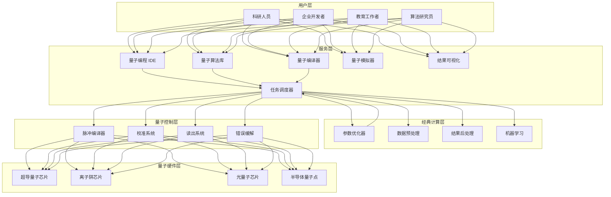
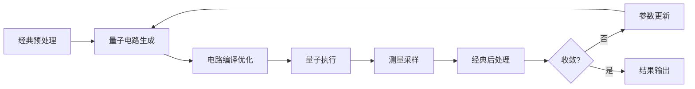
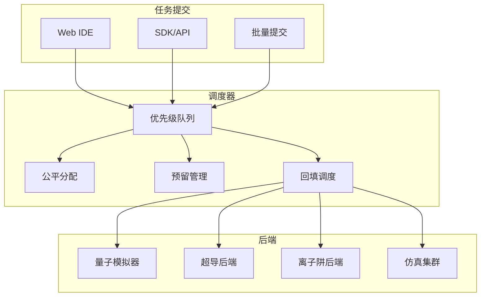

---title: 量子计算云平台架构设计 — 阿里云视角
description: 'title: 量子计算云平台架构设计'
summary: 'title: 量子计算云平台架构设计'
category: general
tags:
- architecture
- best-practice
- scheduler
- gpu
tier: supporting
created: '2026-05-23'
last_updated: 2026-05
difficulty: intermediate
reading_level: intermediate
audience:
- 所有工程师
estimated_read_time: 25min
intent_queries:
- 量子计算云平台架构设计 — 阿里云视角 是什么
- 如何 量子计算云平台架构设计 — 阿里云视角
- Kubernetes 20 application patterns 最佳实践
trigger_keywords:
- 量子计算云平台架构设计
- 阿里云视角
- application
- patterns
prerequisites:
- kubectl-basics
- prometheus-basics
- gpu-scheduling-basics
authors:
- name: Dillan Teagle
  role: contributor

---

> **生产环境安全提示**
>
> 本文档包含可直接执行的运维命令。执行前请确认：当前目标集群与 Namespace 是否正确；是否具备足够的 RBAC 权限；是否已在非生产环境验证。命令风险等级标注：🔴 高风险（可能造成数据丢失或服务中断）、🟡 中风险（会修改集群状态，但通常可回滚）、🟢 低风险/只读（信息收集，无副作用）。


title: 量子计算云平台架构设计
description: '# 量子计算云平台架构设计 — 阿里云视角'
category: application-architecture
tags:
- k8s
- architecture
- industry
- scheduler
- gpu
last_updated: 2026-05-18
difficulty: expert
reading_level: expert
audience:
- 量子计算研究员
- 高性能计算架构师
- 算法工程师
estimated_read_time: 5min
intent_queries:
- 量子计算云平台 [[Kubernetes|Kubernetes]] 架构
- 量子线路 QASM 编译执行
- VQE 变分量子本征求解器
- 量子经典混合计算调度
- 量子模拟器 GPU 集群
trigger_keywords:
- 量子计算
- 量子云平台
- 量子线路
- QASM
- VQE
- 量子纠缠
- 量子模拟器
- NISQ
- 量子纠错
- 量子机器学习
related_domains:
- domain-03-networking-traffic
- domain-10-troubleshooting-diagnostics
related_topics:
- topic-hpc-architecture
- topic-ai-algorithm
k8s_versions:
- '1.28'
- '1.29'
- '1.30'
- '1.31'
- '1.32'
---

# 量子计算云平台架构设计 — 阿里云视角

> **适用版本**: Kubernetes v1.29 - v1.33 | **最后更新**: 2026-04-24
> **作者**: 阿里云解决方案架构师 | **标签**: `#量子计算` `#量子云` `#混合计算` `#阿里云`

---

<!-- chunk: 目录 -->## 目录

1. [概述](#1-概述)
2. [设计原则](#2-设计原则)
3. [架构模式](#3-架构模式)
4. [实现示例](#4-实现示例)
5. [在 Kubernetes 上的部署](#5-在-kubernetes-上的部署)
6. [最佳实践](#6-最佳实践)
7. [反模式](#7-反模式)
8. [参考资源](#8-参考资源)

---

<!-- chunk: 1. 概述 -->## 1. 概述

量子计算是利用量子力学原理（叠加态、纠缠、干涉）进行信息处理的全新计算范式。量子计算在某些特定问题上具有远超经典计算的潜力：大整数分解（Shor 算法）、无结构搜索（Grover 算法）、量子模拟（分子/材料/药物）、组合优化（QAOA）、量子机器学习。

量子计算云平台将稀缺的量子计算资源通过云服务方式提供给用户。用户无需拥有物理量子计算机，通过 Web IDE 或 SDK 编写量子程序，提交到云端执行，获取测量结果。这种模式类似于早期大型机的分时共享，但面对的是量子比特数量有限、退相干时间短、量子纠错尚未实现的物理层约束。

当前量子计算处于 NISQ（Noisy Intermediate-Scale Quantum）时代：量子比特数在 50-1000 之间，噪声和错误率较高。实际应用中，量子计算通常与经典计算混合使用（量子-经典混合算法），量子部分负责核心计算步骤，经典部分负责预处理、后处理、参数优化和错误缓解。

云原生架构为量子计算云平台提供了理想的运维底座：任务调度、用户隔离、资源配额、弹性伸缩、可观测性等能力都可以直接复用 Kubernetes 生态。

## 1.1 行业背景

| 挑战 | 说明 | 架构影响 |
|:---|:---|:---|
| 极低温环境 | 超导量子芯片需 mK 级温度 | 物理机专用 + 经典控制 |
| 量子比特脆弱 | 退相干时间 μs-ms 级 | 误差缓解 + 纠错编码 |
| 混合计算 | 经典-量子交替执行 | 任务编排 + 低延迟通信 |
| 算法适配 | 量子算法设计门槛高 | 算法库 + 可视化编程 |
| 资源稀缺 | 量子比特数量有限 | 公平调度 + 优先级队列 |

## 1.2 核心场景

- **量子模拟**: 分子基态能量计算、化学反应模拟、新材料设计
- **优化求解**: 物流路径优化、金融组合优化、排产调度
- **量子机器学习**: 量子神经网络、变分量子本征求解器（VQE）
- **密码分析**: Shor 算法破解 RSA、抗量子密码研究
- **量子编程教育**: 量子算法教学、量子编程竞赛

---

<!-- chunk: 2. 设计原则 -->## 2. 设计原则

## 2.1 混合优先原则

在 NISQ 时代，纯量子计算的应用场景非常有限。平台设计以"混合计算"为核心模式：经典计算负责参数优化和数据处理，量子计算负责核心量子电路执行。两种计算资源需要紧密协同，经典-量子接口的延迟直接影响混合算法的收敛速度。

## 2.2 公平调度原则

量子计算资源（物理量子比特）极其稀缺，需要公平高效的调度策略。平台需要支持：优先级调度（紧急任务优先）、公平共享（长期用户公平分配）、预留机制（为重要项目预留时间窗口）、回填调度（利用碎片时间执行短任务）。

## 2.3 用户隔离原则

不同用户的量子程序需要严格隔离：电路数据加密传输、执行结果安全返回、算法代码保密。即使用户共享同一物理量子计算机，也不能通过侧信道获取其他用户的信息。

## 2.4 抽象分层原则

量子计算技术栈层次分明：物理层（量子芯片）、控制层（脉冲控制）、电路层（量子门）、算法层（量子算法）、应用层（行业应用）。平台设计需要对每层提供清晰的抽象，让用户可以在任意层次进行操作——从高级算法到低级脉冲控制。

---

<!-- chunk: 3. 架构模式 -->## 3. 架构模式

## 3.1 量子计算云平台全景架构



## 3.2 量子-经典混合执行流程



## 3.3 任务调度架构



---

<!-- chunk: 4. 实现示例 -->## 4. 实现示例

## 4.1 量子电路构建与编译

```python
import numpy as np
from dataclasses import dataclass
from typing import List, Tuple

@dataclass
class QuantumGate:
    name: str
    qubits: List[int]
    params: List[float] = None
    matrix: np.ndarray = None

class QuantumCircuit:
    def __init__(self, n_qubits: int):
        self.n_qubits = n_qubits
        self.gates: List[QuantumGate] = []
        self.measurements = set()

    def h(self, qubit: int) -> 'QuantumCircuit':
        self.gates.append(QuantumGate('h', [qubit]))
        return self

    def x(self, qubit: int) -> 'QuantumCircuit':
        self.gates.append(QuantumGate('x', [qubit]))
        return self

    def cx(self, control: int, target: int) -> 'QuantumCircuit':
        self.gates.append(QuantumGate('cx', [control, target]))
        return self

    def rz(self, theta: float, qubit: int) -> 'QuantumCircuit':
        self.gates.append(QuantumGate('rz', [qubit], [theta]))
        return self

    def measure(self, qubits: List[int] = None) -> 'QuantumCircuit':
        if qubits is None:
            qubits = list(range(self.n_qubits))
        self.measurements.update(qubits)
        return self

    def depth(self) -> int:
        if not self.gates:
            return 0
        active = [0] * self.n_qubits
        for gate in self.gates:
            max_d = max(active[q] for q in gate.qubits)
            for q in gate.qubits:
                active[q] = max_d + 1
        return max(active)

    def gate_count(self) -> int:
        return len(self.gates)

    def to_qasm(self) -> str:
        lines = [f"OPENQASM 2.0;",
                 f"include 'qelib1.inc';",
                 f"qreg q[{self.n_qubits}];",
                 f"creg c[{self.n_qubits}];"]
        for gate in self.gates:
            if gate.name == 'h':
                lines.append(f"h q[{gate.qubits[0]}];")
            elif gate.name == 'x':
                lines.append(f"x q[{gate.qubits[0]}];")
            elif gate.name == 'cx':
                lines.append(f"cx q[{gate.qubits[0]}],q[{gate.qubits[1]}];")
            elif gate.name == 'rz':
                lines.append(f"rz({gate.params[0]}) q[{gate.qubits[0]}];")
        for q in sorted(self.measurements):
            lines.append(f"measure q[{q}] -> c[{q}];")
        return "\n".join(lines)


class QuantumSimulator:
    def __init__(self):
        self.state = None

    def run(self, circuit: QuantumCircuit,
            shots: int = 1024) -> dict:
        n = circuit.n_qubits
        state = np.zeros(2**n, dtype=complex)
        state[0] = 1.0

        for gate in circuit.gates:
            matrix = self._get_gate_matrix(gate, n)
            state = matrix @ state

        if not circuit.measurements:
            return {"state": state}

        probs = np.abs(state) ** 2
        measured = sorted(circuit.measurements)
        counts = {}
        for _ in range(shots):
            outcome = np.random.choice(2**n, p=probs)
            bits = format(outcome, f'0{n}b')
            key = ''.join(bits[i] for i in measured)
            counts[key] = counts.get(key, 0) + 1

        return {"counts": counts, "shots": shots}

    def _get_gate_matrix(self, gate: QuantumGate,
                          n_qubits: int) -> np.ndarray:
        gate_matrices = {
            'h': np.array(1, 1], [1, -1) / np.sqrt(2),
            'x': np.array(0, 1], [1, 0),
        }

        if gate.name in gate_matrices:
            base = gate_matrices[gate.name]
        elif gate.name == 'rz':
            theta = gate.params[0]
            base = np.array([[np.exp(-1j*theta/2), 0],
                             [0, np.exp(1j*theta/2)]])
        elif gate.name == 'cx':
            base = np.array(1,0,0,0],[0,1,0,0],[0,0,0,1],[0,0,1,0)
        else:
            return np.eye(2**n_qubits)

        result = np.eye(1)
        for i in range(n_qubits):
            if gate.name == 'cx':
                if i == gate.qubits[0]:
                    result = np.kron(result, np.eye(2))
                elif i == gate.qubits[1]:
                    pass
                else:
                    result = np.kron(result, np.eye(2))
            elif i in gate.qubits:
                result = np.kron(result, base)
            else:
                result = np.kron(result, np.eye(2))

        return result
```

## 4.2 VQE 变分量子本征求解器

```python
import numpy as np
from scipy.optimize import minimize

class VQESolver:
    def __init__(self, simulator: QuantumSimulator,
                 n_qubits: int, hamiltonian: dict):
        self.simulator = simulator
        self.n_qubits = n_qubits
        self.hamiltonian = hamiltonian
        self.energy_history = []

    def solve(self, ansatz_layers: int = 2,
              max_iter: int = 100) -> dict:
        n_params = ansatz_layers * self.n_qubits * 2
        initial_params = np.random.uniform(0, 2*np.pi, n_params)

        result = minimize(
            self._objective,
            initial_params,
            method='COBYLA',
            options={'maxiter': max_iter, 'rhobeg': 0.5}
        )

        return {
            'optimal_energy': result.fun,
            'optimal_params': result.x,
            'iterations': len(self.energy_history),
            'converged': result.success,
            'energy_history': self.energy_history,
        }

    def _objective(self, params: np.ndarray) -> float:
        circuit = self._build_ansatz(params)
        result = self.simulator.run(circuit, shots=4096)

        energy = 0.0
        for pauli_string, coefficient in self.hamiltonian.items():
            expectation = self._estimate_expectation(
                pauli_string, result.get("counts", {}))
            energy += coefficient * expectation

        self.energy_history.append(energy)
        return energy

    def _build_ansatz(self, params: np.ndarray) -> QuantumCircuit:
        qc = QuantumCircuit(self.n_qubits)

        for i in range(self.n_qubits):
            qc.h(i)

        idx = 0
        for _ in range(len(params) // (self.n_qubits * 2)):
            for i in range(self.n_qubits - 1):
                qc.cx(i, i + 1)
            for i in range(self.n_qubits):
                if idx < len(params):
                    qc.rz(params[idx], i)
                    idx += 1
                if idx < len(params):
                    qc.rz(params[idx], i)
                    idx += 1

        qc.measure()
        return qc

    def _estimate_expectation(self, pauli: str,
                               counts: dict) -> float:
        if not counts:
            return 0.0
        total = sum(counts.values())
        expectation = 0.0
        for bitstring, count in counts.items():
            parity = bitstring.count('1') % 2
            expectation += (-1)**parity * count / total
        return expectation
```

## 4.3 任务调度器

```go
package quantum

import (
    "context"
    "fmt"
    "sort"
    "sync"
    "time"
)

type TaskPriority int

const (
    PriorityLow    TaskPriority = 1
    PriorityNormal TaskPriority = 5
    PriorityHigh   TaskPriority = 10
    PriorityUrgent TaskPriority = 20
)

type QuantumTask struct {
    ID           string
    UserID       string
    CircuitRef   string
    Backend      string
    Shots        int
    Priority     TaskPriority
    Status       string
    SubmittedAt  time.Time
    StartedAt    time.Time
    CompletedAt  time.Time
    ResultRef    string
}

type FairShareScheduler struct {
    queue       []*QuantumTask
    userShares  map[string]int
    userUsage   map[string]float64
    backends    map[string]bool
    mu          sync.Mutex
}

func NewFairShareScheduler() *FairShareScheduler {
    return &FairShareScheduler{
        queue:      make([]*QuantumTask, 0),
        userShares: make(map[string]int),
        userUsage:  make(map[string]float64),
        backends:   make(map[string]bool),
    }
}

func (s *FairShareScheduler) Submit(task *QuantumTask) error {
    s.mu.Lock()
    defer s.mu.Unlock()

    task.Status = "queued"
    task.SubmittedAt = time.Now()
    s.queue = append(s.queue, task)

    if _, ok := s.userShares[task.UserID]; !ok {
        s.userShares[task.UserID] = 1
    }

    return nil
}

func (s *FairShareScheduler) Schedule() (*QuantumTask, error) {
    s.mu.Lock()
    defer s.mu.Unlock()

    if len(s.queue) == 0 {
        return nil, fmt.Errorf("no tasks in queue")
    }

    sort.SliceStable(s.queue, func(i, j int) bool {
        pi := s._effectivePriority(s.queue[i])
        pj := s._effectivePriority(s.queue[j])
        return pi > pj
    })

    task := s.queue[0]
    s.queue = s.queue[1:]

    task.Status = "running"
    task.StartedAt = time.Now()

    s.userUsage[task.UserID] += float64(task.Shots)

    return task, nil
}

func (s *FairShareScheduler) _effectivePriority(task *QuantumTask) float64 {
    base := float64(task.Priority)
    share := float64(s.userShares[task.UserID])
    totalShares := 0.0
    for _, sh := range s.userShares {
        totalShares += float64(sh)
    }

    entitlement := share / totalShares
    actualUsage := 0.0
    totalUsage := 0.0
    for _, u := range s.userUsage {
        totalUsage += u
    }
    if totalUsage > 0 {
        actualUsage = s.userUsage[task.UserID] / totalUsage
    }

    fairnessFactor := 1.0
    if actualUsage > entitlement && entitlement > 0 {
        fairnessFactor = entitlement / actualUsage
    }

    waitTime := time.Since(task.SubmittedAt).Minutes()
    waitBonus := waitTime * 0.1

    return base * fairnessFactor + waitBonus
}

func (s *FairShareScheduler) Complete(taskID string, resultRef string) {
    s.mu.Lock()
    defer s.mu.Unlock()

    for _, t := range s.queue {
        if t.ID == taskID {
            t.Status = "completed"
            t.CompletedAt = time.Now()
            t.ResultRef = resultRef
            break
        }
    }
}

func (s *FairShareScheduler) QueueLength() int {
    s.mu.Lock()
    defer s.mu.Unlock()
    return len(s.queue)
}
```

---

<!-- chunk: 5. 在 Kubernetes 上的部署 -->## 5. 在 Kubernetes 上的部署

## 5.1 量子任务调度服务

```yaml
apiVersion: apps/v1
kind: Deployment
metadata:
  name: quantum-scheduler
  namespace: quantum-cloud
  labels:
    app: quantum-scheduler
    tier: core
spec:
  replicas: 3
  selector:
    matchLabels:
      app: quantum-scheduler
  template:
    metadata:
      labels:
        app: quantum-scheduler
    spec:
      affinity:
        podAntiAffinity:
          preferredDuringSchedulingIgnoredDuringExecution:
            - weight: 100
              podAffinityTerm:
                labelSelector:
                  matchLabels:
                    app: quantum-scheduler
                topologyKey: topology.kubernetes.io/zone
      containers:
        - name: scheduler
          image: registry.cn-hangzhou.aliyuncs.com/quantum/scheduler:v2.0.0
          ports:
            - containerPort: 8080
            - containerPort: 9090
          env:
            - name: QUEUE_STRATEGY
              value: "fair-share"
            - name: MAX_QUBITS
              value: "128"
            - name: DEFAULT_SHOTS
              value: "1024"
            - name: DB_HOST
              valueFrom:
                configMapKeyRef:
                  name: quantum-config
                  key: db-host
          resources:
            requests:
              memory: "2Gi"
              cpu: "1000m"
            limits:
              memory: "4Gi"
              cpu: "2000m"
```

## 5.2 量子模拟器集群

```yaml
apiVersion: apps/v1
kind: Deployment
metadata:
  name: quantum-simulator
  namespace: quantum-cloud
spec:
  replicas: 10
  selector:
    matchLabels:
      app: quantum-simulator
  template:
    metadata:
      labels:
        app: quantum-simulator
    spec:
      containers:
        - name: simulator
          image: registry.cn-hangzhou.aliyuncs.com/quantum/simulator:v2.0.0
          ports:
            - containerPort: 8080
          env:
            - name: MAX_QUBITS
              value: "32"
            - name: NUM_WORKERS
              value: "4"
          resources:
            requests:
              memory: "16Gi"
              cpu: "8000m"
            limits:
              memory: "32Gi"
              cpu: "16000m"
```

## 5.3 混合计算编排器

```yaml
apiVersion: apps/v1
kind: Deployment
metadata:
  name: hybrid-orchestrator
  namespace: quantum-cloud
spec:
  replicas: 2
  selector:
    matchLabels:
      app: hybrid-orchestrator
  template:
    metadata:
      labels:
        app: hybrid-orchestrator
    spec:
      containers:
        - name: orchestrator
          image: registry.cn-hangzhou.aliyuncs.com/quantum/orchestrator:v2.0.0
          ports:
            - containerPort: 8080
          env:
            - name: QUANTUM_BACKEND_URL
              value: "http://quantum-scheduler:8080"
            - name: CLASSICAL_BACKEND_URL
              value: "http://classical-compute:8080"
            - name: MAX_ITERATIONS
              value: "200"
          resources:
            requests:
              memory: "2Gi"
              cpu: "1000m"
            limits:
              memory: "4Gi"
              cpu: "2000m"
```

---

<!-- chunk: 6. 最佳实践 -->## 6. 最佳实践

## 6.1 任务管理

- **分层队列**: 模拟任务（免费/无限）和物理量子任务（付费/有限）分开调度
- **智能路由**: 根据量子电路特征（宽度、深度、门类型）自动选择最优后端
- **错误缓解**: 使用零噪声外推（ZNE）、概率误差消除（PEC）等技术提升 NISQ 计算精度
- **电路优化**: 编译时自动优化量子电路——门合并、冗余消除、拓扑映射

## 6.2 资源利用

- **批量执行**: 将多个小电路打包成一批执行，减少量子芯片校准开销
- **电路缓存**: 相同电路+相同参数的结果缓存，避免重复执行
- **模拟器分流**: 验证阶段使用 GPU 模拟器（免费），验证通过后再提交物理量子任务
- **自适应采样**: 根据统计精度需求动态调整采样次数（shots），避免过度采样

## 6.3 安全与隔离

- **电路加密**: 用户量子电路在传输和存储过程中加密
- **执行隔离**: 不同用户的任务在量子芯片上分时执行，中间进行校准重置
- **结果签名**: 执行结果使用数字签名，防止篡改
- **访问审计**: 记录所有量子计算资源的访问和使用日志

---

<!-- chunk: 7. 反模式 -->## 7. 反模式

## 7.1 纯量子计算

试图将所有计算都放在量子计算机上执行，忽视经典计算的基础作用。

**解决方案**: 采用量子-经典混合架构。经典计算负责数据预处理、参数优化、结果后处理；量子计算只负责核心量子电路执行。VQE、QAOA 等变分算法是混合计算的典型范例。

## 7.2 忽视噪声影响

假设量子计算是精确的，忽视 NISQ 时代的噪声和错误。

**解决方案**: 在量子电路设计阶段考虑噪声影响，使用错误缓解技术（ZNE、PEC、随机编译）提升结果精度。为用户提供带误差条的结果，而非点估计。

## 7.3 过度追求量子比特数

以量子比特数量作为唯一指标，忽视量子比特质量（保真度、连通性、相干时间）。

**解决方案**: 综合评估量子体积（Quantum Volume）、CLOPS（Circuit Layer Operations Per Second）等指标。100 个高保真度比特可能比 1000 个低保真度比特更有用。

## 7.4 通用量子算法设计

试图设计通用的量子算法解决所有问题，忽视量子计算在特定问题上的优势。

**解决方案**: 聚焦量子优势场景：量子模拟、组合优化、密码学。对于经典计算已经很好地解决的问题（如简单搜索、排序），不需要量子计算。

## 7.5 忽视经典-量子接口延迟

忽视经典参数优化和量子电路执行之间的通信延迟，导致混合算法性能低下。

**解决方案**: 优化经典-量子接口，减少通信轮次。将参数优化逻辑部署在靠近量子硬件的经典服务器上。考虑使用异步执行模式，减少等待时间。

---

<!-- chunk: 8. 参考资源 -->## 8. 参考资源

## 8.1 阿里云组件映射

| 功能域 | **阿里云云原生方案** |
|:---|:---|
| 容器平台 | **ACK Pro** |
| 量子计算 | **阿里云量子计算服务** |
| GPU 模拟 | **GN10（A100）实例** |
| 数据库 | **PolarDB** |
| 对象存储 | **OSS（加密存储）** |
| 可观测性 | **ARMS + SLS** |
| 工作流 | **[[Argo|Argo]]go Workflows|Argo Workflows]]** |

## 8.2 生产检查清单

- [ ] 量子比特校准验证（门保真度 > 99.5%）
- [ ] 量子电路编译正确性验证
- [ ] 任务调度公平性测试
- [ ] 量子-经典接口延迟 < 100ms
- [ ] 用户电路数据加密
- [ ] 执行结果数字签名验证
- [ ] 模拟器结果与理论值一致性
- [ ] 错误缓解效果验证

## 8.3 外部参考

- Qiskit (IBM) — Python 量子计算框架
- Cirq (Google) — 量子计算框架
- PennyLane (Xanadu) — 量子机器学习框架
- OpenQASM 3.0 — 量子汇编语言标准
- Quantum Volume (IBM) — 量子计算机性能指标
- NIST PQC — 抗量子密码标准化

---

**维护者**: 阿里云解决方案架构师团队 | **许可证**: MIT

---

<!-- chunk: Obsidian 相关文档 -->## Obsidian 相关文档

- topic-application-architecture MOC
- [[domain-20-application-patterns/topic-application-architecture/README.md|Topic 应用层架构设计最佳实践]]
- [[domain-20-application-patterns/topic-application-architecture/01-ecommerce-architecture.md|电商系统 Kubernetes 生产架构设计]]
- [[domain-20-application-patterns/topic-application-architecture/02-mini-program-architecture.md|小程序平台架构设计]]
- [[domain-20-application-patterns/topic-application-architecture/03-cms-architecture.md|内容管理系统 CMS 架构设计]]
- [[domain-20-application-patterns/topic-application-architecture/04-im-rtc-architecture.md|实时通信 IM/RTC 架构设计]]
- [[domain-20-application-patterns/topic-application-architecture/05-online-education-architecture.md|在线教育平台 Kubernetes 生产架构设计]]
- [[domain-20-application-patterns/topic-application-architecture/06-fintech-architecture.md|金融科技FinTech Kubernetes生产架构设计]]
- [[domain-20-application-patterns/topic-application-architecture/07-iot-platform-architecture.md|物联网 IoT 平台架构设计]]
- [[domain-20-application-patterns/topic-application-architecture/08-ai-ml-inference-architecture.md|AI/ML 推理服务 Kubernetes 生产架构设计]]
- [[domain-20-application-patterns/topic-application-architecture/09-gaming-backend-architecture.md|游戏后端 Kubernetes 生产架构设计]]
- [[domain-20-application-patterns/topic-application-architecture/10-social-media-architecture.md|社交媒体平台Kubernetes生产架构设计]]

## See Also

- 66-space-internet
- 67-brain-computer-interface
- 69-6g-core-network
- 70-ecny-cbdc

## Related

- topic-application-architecture MOC — Cross-reference


<!-- risk-assessed -->
