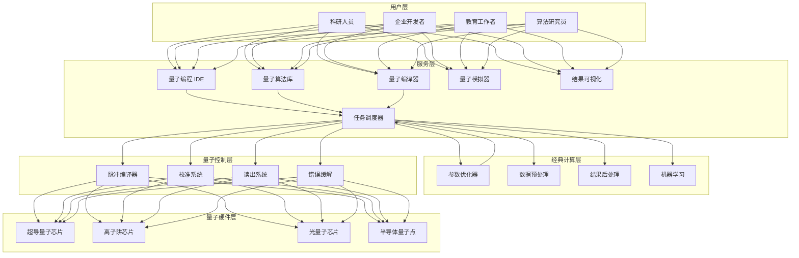
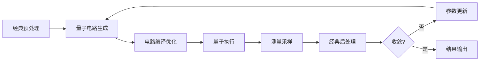
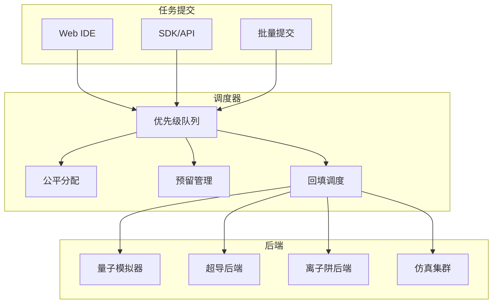

# Quantum Computing Cloud Platform Architecture Design — From Alibaba Cloud Perspective

> **Applicable Version**: Kubernetes v1.29 - v1.33 | **Last Updated**: 2026-04-24
> **Author**: Alibaba Cloud Solution Architect | **Tags**: `#Quantum Computing` `#Quantum Cloud` `#Hybrid Computing` `#Alibaba Cloud`

---

## Table of Contents

1. [Overview](#1-overview)
2. [Design Principles](#2-design-principles)
3. [Architecture Patterns](#3-architecture-patterns)
4. [Implementation Examples](#4-implementation-examples)
5. [Deployment on Kubernetes](#5-deployment-on-kubernetes)
6. [Best Practices](#6-best-practices)
7. [Anti-patterns](#7-anti-patterns)
8. [Reference Resources](#8-references)

---

## 1. Overview

Quantum computing is a new computational paradigm that leverages principles from quantum mechanics (superposition, entanglement, interference) for information processing. Quantum computing has the potential to outperform classical computing in certain specific problems: integer factorization (Shor's algorithm), unstructured search (Grover's algorithm), quantum simulation (molecular/material/drug), combinatorial optimization (QAOA), and quantum machine learning.

A quantum computing cloud platform provides scarce quantum computing resources through cloud services to users. Users do not need to own physical quantum computers; they can write quantum programs using Web IDEs or SDKs, submit them to the cloud for execution, and obtain measurement results. This model is similar to time-sharing of early mainframes but faces constraints such as limited number of qubits, short decoherence times, and lack of quantum error correction at the physical layer.

Quantum computing is currently in the NISQ (Noisy Intermediate-Scale Quantum) era: the number of qubits ranges from 50 to 1,000, with high levels of noise and errors. In practical applications, quantum computing is often used in conjunction with classical computing (quantum-classical hybrid algorithms). The quantum part handles core computational steps, while the classical part handles preprocessing, postprocessing, parameter optimization, and error mitigation.

The cloud-native architecture provides an ideal operational foundation for a quantum computing cloud platform: capabilities such as task scheduling, user isolation, resource quotas, elasticity scaling, and observability can be directly reused from the Kubernetes ecosystem.

## 1.1 Industry Background

| Challenge | Explanation | Impact on Architecture |
|:---|:---|:---|
| Ultra-low temperature environment | Superconducting quantum chips require temperatures in the mK range | Dedicated physical machines + classical control |
| Fragile qubits | Decoherence times in the μs-ms range | Error mitigation + error correction codes |
| Mixed computation | Alternating execution of classical and quantum computations | Task orchestration + low-latency communication |
| Algorithm adaptation | High barrier to designing quantum algorithms | Algorithm libraries + visual programming |
| Scarce resources | Limited number of qubits | Fair scheduling + priority queues |

## 1.2 Core Scenarios

- **Quantum Simulation**: Molecular ground-state energy calculations, chemical reaction simulations, material design
- **Optimization Solving**: Logistics path optimization, financial portfolio optimization, production scheduling
- **Quantum Machine Learning**: Quantum neural networks, variational quantum eigensolver (VQE)
- **Cryptography Analysis**: Breaking RSA with Shor's algorithm, research on post-quantum cryptography
- **Quantum Programming Education**: Teaching quantum algorithms, quantum programming competitions

---

## 2. Design Principles

## 2.1 Hybrid Priority Principle

In the NISQ era, the application scenarios for pure quantum computing are very limited. The platform design centers around a "hybrid computation" model: classical computing handles parameter optimization and data processing, while quantum computing executes the core quantum circuits. Both computational resources need to work closely together, and the delay in the classical-quantum interface directly affects the convergence speed of the hybrid algorithm.

## 2.2 Fair Scheduling Principle

Quantum computing resources (physical qubits) are extremely scarce and require fair and efficient scheduling strategies. The platform needs to support: priority scheduling (urgent tasks take precedence), fairness sharing (long-term users are fairly allocated), reservation mechanisms (reserving time windows for important projects), and backfill scheduling (executing short tasks during fragmented time).

## 2.3 User Isolation Principle

Different users' quantum programs need strict isolation: encrypted transmission of circuit data, secure return of execution results, and confidentiality of algorithm codes. Even if users share the same physical quantum computer, they cannot obtain information from other users through side channels.

## 2.4 Abstract Layering Principle

Quantum computing technology stack has distinct layers: physical layer (quantum chip), control layer (pulse control), circuit layer (quantum gates), algorithm layer (quantum algorithms), and application layer (industry applications). Platform design needs to provide clear abstractions for each layer so that users can operate at any level — from high-level algorithms to low-level pulse controls.

---

## 3. Architecture Patterns

## 3.1 Panorama Architecture of Quantum Computing Cloud Platform


```mermaid
graph TB
    subgraph 用户层
        U1[科研人员]
        U2[企业开发者]
        U3[教育工作者]
        U4[算法研究员]
    end

    subgraph 服务层
        S1[量子编程 IDE]
        S2[量子算法库]
        S3[量子编译器]
        S4[任务调度器]
        S5[量子模拟器]
        S6[结果可视化]
    end

    subgraph 经典计算层
        C1[参数优化器]
        C2[数据预处理]
        C3[结果后处理]
        C4[机器学习]
    end

    subgraph 量子控制层
        Q1[脉冲编译器]
        Q2[校准系统]
        Q3[读出系统]
        Q4[错误缓解]
    end

    subgraph 量子硬件层
        H1[超导量子芯片]
        H2[离子阱芯片]
        H3[光量子芯片]
        H4[半导体量子点]
    end

    U1 & U2 & U3 & U4 --> S1 & S2 & S3 & S5 & S6
    S1 & S2 & S3 --> S4
    S4 --> C1 & C2 & C3 & C4
    S4 --> Q1 & Q2 & Q3 & Q4
    Q1 & Q2 & Q3 & Q4 --> H1 & H2 & H3 & H4
    C1 --> S4
```

## 3.2 Hybrid Execution Flow of Quantum and Classical Computing


```mermaid
flowchart LR
    A[经典预处理] --> B[量子电路生成]
    B --> C[电路编译优化]
    C --> D[量子执行]
    D --> E[测量采样]
    E --> F[经典后处理]
    F --> G{收敛?}
    G -->|否| H[参数更新]
    H --> B
    G -->|是| I[结果输出]
```

## 3.3 Task Scheduling Architecture


```mermaid
graph TB
    subgraph 任务提交
        T1[Web IDE]
        T2[SDK/API]
        T3[批量提交]
    end

    subgraph 调度器
        S1[优先级队列]
        S2[公平分配]
        S3[预留管理]
        S4[回填调度]
    end

    subgraph 后端
        B1[量子模拟器]
        B2[超导后端]
        B3[离子阱后端]
        B4[仿真集群]
    end

    T1 & T2 & T3 --> S1
    S1 --> S2 & S3 & S4
    S4 --> B1 & B2 & B3 & B4
```

---

## 4. Implementation Examples

## 4.1 Construction and Compilation of Quantum Circuits

```python
import numpy as np
from dataclasses import dataclass
from typing import List, Tuple

@dataclass
class QuantumGate:
    name: str
    qubits: List[int]
    params: List[float] = None
    matrix: np.ndarray = None

class QuantumCircuit:
    def __init__(self, n_qubits: int):
        self.n_qubits = n_qubits
        self.gates: List[QuantumGate] = []
        self.measurements = set()

    def h(self, qubit: int) -> 'QuantumCircuit':
        self.gates.append(QuantumGate('h', [qubit]))
        return self

    def x(self, qubit: int) -> 'QuantumCircuit':
        self.gates.append(QuantumGate('x', [qubit]))
        return self

    def cx(self, control: int, target: int) -> 'QuantumCircuit':
        self.gates.append(QuantumGate('cx', [control, target]))
        return self

    def rz(self, theta: float, qubit: int) -> 'QuantumCircuit':
        self.gates.append(QuantumGate('rz', [qubit], [theta]))
        return self

    def measure(self, qubits: List[int] = None) -> 'QuantumCircuit':
        if qubits is None:
            qubits = list(range(self.n_qubits))
        self.measurements.update(qubits)
        return self

    def depth(self) -> int:
        if not self.gates:
            return 0
        active = [0] * self.n_qubits
        for gate in self.gates:
            max_d = max(active[q] for q in gate.qubits)
            for q in gate.qubits:
                active[q] = max_d + 1
        return max(active)

    def gate_count(self) -> int:
        return len(self.gates)

    def to_qasm(self) -> str:
        lines = [f"OPENQASM 2.0;",
                 f"include 'qelib1.inc';",
                 f"qreg q[{self.n_qubits}];",
                 f"creg c[{self.n_qubits}];"]
        for gate in self.gates:
            if gate.name == 'h':
                lines.append(f"h q[{gate.qubits[0]}];")
            elif gate.name == 'x':
                lines.append(f"x q[{gate.qubits[0]}];")
            elif gate.name == 'cx':
                lines.append(f"cx q[{gate.qubits[0]}],q[{gate.qubits[1]}];")
            elif gate.name == 'rz':
                lines.append(f"rz({gate.params[0]}) q[{gate.qubits[0]}];")
        for q in sorted(self.measurements):
            lines.append(f"measure q[{q}] -> c[{q}];")
        return "\n".join(lines)


class QuantumSimulator:
    def __init__(self):
        self.state = None

    def run(self, circuit: QuantumCircuit,
            shots: int = 1024) -> dict:
        n = circuit.n_qubits
        state = np.zeros(2**n, dtype=complex)
        state[0] = 1.0

        for gate in circuit.gates:
            matrix = self._get_gate_matrix(gate, n)
            state = matrix @ state

        if not circuit.measurements:
            return {"state": state}

        probs = np.abs(state) ** 2
        measured = sorted(circuit.measurements)
        counts = {}
        for _ in range(shots):
            outcome = np.random.choice(2**n, p=probs)
            bits = format(outcome, f'0{n}b')
            key = ''.join(bits[i] for i in measured)
            counts[key] = counts.get(key, 0) + 1

        return {"counts": counts, "shots": shots}

    def _get_gate_matrix(self, gate: QuantumGate,
                          n_qubits: int) -> np.ndarray:
        gate_matrices = {
            'h': np.array(1, 1], [1, -1) / np.sqrt(2),
            'x': np.array(0, 1], [1, 0),
        }

        if gate.name in gate_matrices:
            base = gate_matrices[gate.name]
        elif gate.name == 'rz':
            theta = gate.params[0]
            base = np.array([[np.exp(-1j*theta/2), 0],
                             [0, np.exp(1j*theta/2)]])
        elif gate.name == 'cx':
            base = np.array(1,0,0,0],[0,1,0,0],[0,0,0,1],[0,0,1,0)
        else:
            return np.eye(2**n_qubits)

        result = np.eye(1)
        for i in range(n_qubits):
            if gate.name == 'cx':
                if i == gate.qubits[0]:
                    result = np.kron(result, np.eye(2))
                elif i == gate.qubits[1]:
                    pass
                else:
                    result = np.kron(result, np.eye(2))
            elif i in gate.qubits:
                result = np.kron(result, base)
            else:
                result = np.kron(result, np.eye(2))

        return result
```

## 4.2 Variational Quantum Eigensolver Solver

```python
import numpy as np
from scipy.optimize import minimize

class VQESolver:
    def __init__(self, simulator: QuantumSimulator,
                 n_qubits: int, hamiltonian: dict):
        self.simulator = simulator
        self.n_qubits = n_qubits
        self.hamiltonian = hamiltonian
        self.energy_history = []

    def solve(self, ansatz_layers: int = 2,
              max_iter: int = 100) -> dict:
        n_params = ansatz_layers * self.n_qubits * 2
        initial_params = np.random.uniform(0, 2*np.pi, n_params)

        result = minimize(
            self._objective,
            initial_params,
            method='COBYLA',
            options={'maxiter': max_iter, 'rhobeg': 0.5}
        )

        return {
            'optimal_energy': result.fun,
            'optimal_params': result.x,
            'iterations': len(self.energy_history),
            'converged': result.success,
            'energy_history': self.energy_history,
        }

    def _objective(self, params: np.ndarray) -> float:
        circuit = self._build_ansatz(params)
        result = self.simulator.run(circuit, shots=4096)

        energy = 0.0
        for pauli_string, coefficient in self.hamiltonian.items():
            expectation = self._estimate_expectation(
                pauli_string, result.get("counts", {}))
            energy += coefficient * expectation

        self.energy_history.append(energy)
        return energy

    def _build_ansatz(self, params: np.ndarray) -> QuantumCircuit:
        qc = QuantumCircuit(self.n_qubits)

        for i in range(self.n_qubits):
            qc.h(i)

        idx = 0
        for _ in range(len(params) // (self.n_qubits * 2)):
            for i in range(self.n_qubits - 1):
                qc.cx(i, i + 1)
            for i in range(self.n_qubits):
                if idx < len(params):
                    qc.rz(params[idx], i)
                    idx += 1
                if idx < len(params):
                    qc.rz(params[idx], i)
                    idx += 1

        qc.measure()
        return qc

    def _estimate_expectation(self, pauli: str,
                               counts: dict) -> float:
        if not counts:
            return 0.0
        total = sum(counts.values())
        expectation = 0.0
        for bitstring, count in counts.items():
            parity = bitstring.count('1') % 2
            expectation += (-1)**parity * count / total
        return expectation
```

## 4.3 Task Scheduler

```go
package quantum

import (
    "context"
    "fmt"
    "sort"
    "sync"
    "time"
)

type TaskPriority int

const (
    PriorityLow    TaskPriority = 1
    PriorityNormal TaskPriority = 5
    PriorityHigh   TaskPriority = 10
    PriorityUrgent TaskPriority = 20
)

type QuantumTask struct {
    ID           string
    UserID       string
    CircuitRef   string
    Backend      string
    Shots        int
    Priority     TaskPriority
    Status       string
    SubmittedAt  time.Time
    StartedAt    time.Time
    CompletedAt  time.Time
    ResultRef    string
}

type FairShareScheduler struct {
    queue       []*QuantumTask
    userShares  map[string]int
    userUsage   map[string]float64
    backends    map[string]bool
    mu          sync.Mutex
}

func NewFairShareScheduler() *FairShareScheduler {
    return &FairShareScheduler{
        queue:      make([]*QuantumTask, 0),
        userShares: make(map[string]int),
        userUsage:  make(map[string]float64),
        backends:   make(map[string]bool),
    }
}

func (s *FairShareScheduler) Submit(task *QuantumTask) error {
    s.mu.Lock()
    defer s.mu.Unlock()

    task.Status = "queued"
    task.SubmittedAt = time.Now()
    s.queue = append(s.queue, task)

    if _, ok := s.userShares[task.UserID]; !ok {
        s.userShares[task.UserID] = 1
    }

    return nil
}

func (s *FairShareScheduler) Schedule() (*QuantumTask, error) {
    s.mu.Lock()
    defer s.mu.Unlock()

    if len(s.queue) == 0 {
        return nil, fmt.Errorf("no tasks in queue")
    }

    sort.SliceStable(s.queue, func(i, j int) bool {
        pi := s._effectivePriority(s.queue[i])
        pj := s._effectivePriority(s.queue[j])
        return pi > pj
    })

    task := s.queue[0]
    s.queue = s.queue[1:]

    task.Status = "running"
    task.StartedAt = time.Now()

    s.userUsage[task.UserID] += float64(task.Shots)

    return task, nil
}

func (s *FairShareScheduler) _effectivePriority(task *QuantumTask) float64 {
    base := float64(task.Priority)
    share := float64(s.userShares[task.UserID])
    totalShares := 0.0
    for _, sh := range s.userShares {
        totalShares += float64(sh)
    }

    entitlement := share / totalShares
    actualUsage := 0.0
    totalUsage := 0.0
    for _, u := range s.userUsage {
        totalUsage += u
    }
    if totalUsage > 0 {
        actualUsage = s.userUsage[task.UserID] / totalUsage
    }

    fairnessFactor := 1.0
    if actualUsage > entitlement && entitlement > 0 {
        fairnessFactor = entitlement / actualUsage
    }

    waitTime := time.Since(task.SubmittedAt).Minutes()
    waitBonus := waitTime * 0.1

    return base * fairnessFactor + waitBonus
}

func (s *FairShareScheduler) Complete(taskID string, resultRef string) {
    s.mu.Lock()
    defer s.mu.Unlock()

    for _, t := range s.queue {
        if t.ID == taskID {
            t.Status = "completed"
            t.CompletedAt = time.Now()
            t.ResultRef = resultRef
            break
        }
    }
}

func (s *FairShareScheduler) QueueLength() int {
    s.mu.Lock()
    defer s.mu.Unlock()
    return len(s.queue)
}
```

---

## 5. Deployment on Kubernetes

## 5.1 Quantum Task Scheduler Service

```yaml
apiVersion: apps/v1
kind: Deployment
metadata:
  name: quantum-scheduler
  namespace: quantum-cloud
  labels:
    app: quantum-scheduler
    tier: core
spec:
  replicas: 3
  selector:
    matchLabels:
      app: quantum-scheduler
  template:
    metadata:
      labels:
        app: quantum-scheduler
    spec:
      affinity:
        podAntiAffinity:
          preferredDuringSchedulingIgnoredDuringExecution:
            - weight: 100
              podAffinityTerm:
                labelSelector:
                  matchLabels:
                    app: quantum-scheduler
                topologyKey: topology.kubernetes.io/zone
      containers:
        - name: scheduler
          image: registry.cn-hangzhou.aliyuncs.com/quantum/scheduler:v2.0.0
          ports:
            - containerPort: 8080
            - containerPort: 9090
          env:
            - name: QUEUE_STRATEGY
              value: "fair-share"
            - name: MAX_QUBITS
              value: "128"
            - name: DEFAULT_SHOTS
              value: "1024"
            - name: DB_HOST
              valueFrom:
                configMapKeyRef:
                  name: quantum-config
                  key: db-host
          resources:
            requests:
              memory: "2Gi"
              cpu: "1000m"
            limits:
              memory: "4Gi"
              cpu: "2000m"
```

## 5.2 Quantum Simulator Cluster

```yaml
apiVersion: apps/v1
kind: Deployment
metadata:
  name: quantum-simulator
  namespace: quantum-cloud
spec:
  replicas: 10
  selector:
    matchLabels:
      app: quantum-simulator
  template:
    metadata:
      labels:
        app: quantum-simulator
    spec:
      containers:
        - name: simulator
          image: registry.cn-hangzhou.aliyuncs.com/quantum/simulator:v2.0.0
          ports:
            - containerPort: 8080
          env:
            - name: MAX_QUBITS
              value: "32"
            - name: NUM_WORKERS
              value: "4"
          resources:
            requests:
              memory: "16Gi"
              cpu: "8000m"
            limits:
              memory: "32Gi"
              cpu: "16000m"
```

## 5.3 Hybrid Computation Orchestrator

```yaml
apiVersion: apps/v1
kind: Deployment
metadata:
  name: hybrid-orchestrator
  namespace: quantum-cloud
spec:
  replicas: 2
  selector:
    matchLabels:
      app: hybrid-orchestrator
  template:
    metadata:
      labels:
        app: hybrid-orchestrator
    spec:
      containers:
        - name: orchestrator
          image: registry.cn-hangzhou.aliyuncs.com/quantum/orchestrator:v2.0.0
          ports:
            - containerPort: 8080
          env:
            - name: QUANTUM_BACKEND_URL
              value: "http://quantum-scheduler:8080"
            - name: CLASSICAL_BACKEND_URL
              value: "http://classical-compute:8080"
            - name: MAX_ITERATIONS
              value: "200"
          resources:
            requests:
              memory: "2Gi"
              cpu: "1000m"
            limits:
              memory: "4Gi"
              cpu: "2000m"
```

---

## 6. Best Practices

## 6.1 Task Management

- **Multi-layer Queue**: Simulate tasks (free/unlimited) and physical quantum tasks (paid/fixed) separately for scheduling
- **Smart Routing**: Automatically select the optimal backend based on the characteristics of the quantum circuit (width, depth, gate type) using intelligent routing
- **Error Mitigation**: Use techniques such as zero-noise extrapolation (ZNE) and probability error correction (PEC) to improve the precision of NISQ computations
- **Circuit Optimization**: Automatically optimize quantum circuits during compilation — merging gates, eliminating redundancies, topological mapping

## 6.2 Resource Utilization

- **Batch Execution**: Bundle multiple small circuits into a batch for execution to reduce calibration costs for quantum chips
- **Circuit Caching**: Cache results for the same circuit + same parameters to avoid repeated executions
- **Simulator Sharding**: Use GPU simulators (free) during verification stages, then submit physical quantum tasks after verification
- **Adaptive Sampling**: Dynamically adjust the number of samples (shots) based on statistical accuracy requirements to avoid over-sampling

## 6.3 Security and Isolation

- **Circuit Encryption**: Encrypt user quantum circuits during transmission and storage
- **Execution Isolation**: Execute different users' tasks on the quantum chip in turn, performing calibration resets between tasks
- **Result Signing**: Sign execution results to prevent tampering
- **Access Auditing**: Record all access and usage logs for quantum computing resources

---

## 7. Anti-patterns

## 7.1 Pure Quantum Computing

Attempting to execute all calculations on a quantum computer, ignoring the foundational role of classical computing.

**Solution**: Adopt a hybrid architecture combining quantum and classical computing. Classical computing handles data preprocessing, parameter optimization, and result post-processing; quantum computing only executes the core quantum circuits. Variational algorithms like VQE and QAOA are typical examples of hybrid computation.

## 7.2 Ignoring Noise Effects

Assume quantum computing is precise, ignoring the noise and errors in the NISQ era.

**Solution**: Consider noise impact during the design phase of quantum circuits and use error mitigation techniques (ZNE, PEC, random compilation) to enhance result accuracy. Provide results with error bars instead of point estimates to users.

## 7.3 Overemphasis on the Number of Quantum Bits

Consider the number of qubits as the sole metric, neglecting the quality of qubits (fidelity, connectivity, coherence time).

**Solution**: Evaluate metrics such as Quantum Volume and CLOPS (Circuit Layer Operations Per Second). 100 high-fidelity qubits may be more useful than 1000 low-fidelity qubits.

## 7.4 Designing General Quantum Algorithms

Try to design general quantum algorithms to solve all problems, ignoring the advantages of quantum computing in specific problems.

**Solution**: Focus on scenarios where quantum advantage is present: quantum simulation, combinatorial optimization, cryptography. For classic problems that are well-solved by classical computation (e.g., simple search, sorting), quantum computing is not necessary.

## 7.5 Ignoring the Latency of the Classical-Quantum Interface

Ignore the communication delay between classical parameter optimization and the execution of quantum circuits, leading to suboptimal performance of hybrid algorithms.

**Solution**: Optimize the classical-quantum interface to reduce communication rounds. Deploy parameter optimization logic on a classical server near the quantum hardware. Consider using asynchronous execution modes to reduce waiting times.

---

## 8. References

## 8.1 AliCloud Component Mapping

| Function Domain | **AliCloud Native Solutions** |
|:---|:---|
| Container Platform | **ACK Pro** |
| Quantum Computing | **AliCloud Quantum Computing Service** |
| GPU Simulation | **GN10 (A100) Instance** |
| Database | **PolarDB** |
| Object Storage | **OSS (Encrypted Storage)** |
| Observability | **ARMS + SLS** |
| Workflow | **[[Argo|Argo]] Go Workflows|Argo Workflows]]** |

## 8.2 Production Checklist

- [ ] Quantum Bit Calibration Verification (Gate Fidelity > 99.5%)
- [ ] Correctness Verification of Quantum Circuits Compilation
- [ ] Fairness Testing of Task Scheduling
- [ ] Quantum-Classical Interface Latency < 100ms
- [ ] Encryption of User Circuit Data
- [ ] Digital Signature Verification of Execution Results
- [ ] Consistency of Simulator Results with Theoretical Values
- [ ] Effectiveness Verification of Error Mitigation

## 8.3 External References

- Qiskit (IBM) — Python Quantum Computing Framework
- Cirq (Google) — Quantum Computing Framework
- PennyLane (Xanadu) — Quantum Machine Learning Framework
- OpenQASM 3.0 — Quantum Assembly Language Standard
- Quantum Volume (IBM) — Performance Metric for Quantum Computers
- NIST PQC — Standardization of Post-Quantum Cryptography

---

**Maintainer**: Alibaba Cloud Solution Architect Team | **License**: MIT

---

## Obsidian Related Documentation

- topic-application-architecture MOC
- [[domain-20-application-patterns/topic-application-architecture/README.md|Topic Application Architecture Design Best Practices]]
- [[domain-20-application-patterns/topic-application-architecture/01-ecommerce-architecture.md|E-commerce System Kubernetes Production Architecture Design]]
- [[domain-20-application-patterns/topic-application-architecture/02-mini-program-architecture.md|Mini Program Platform Architecture Design]]
- [[domain-20-application-patterns/topic-application-architecture/03-cms-architecture.md|Content Management System CMS Architecture Design]]
- [[domain-20-application-patterns/topic-application-architecture/04-im-rtc-architecture.md|Real-Time Communication IM/RTC Architecture Design]]
- [[domain-20-application-patterns/topic-application-architecture/05-online-education-architecture.md|Online Education Platform Kubernetes Production Architecture Design]]
- [[domain-20-application-patterns/topic-application-architecture/06-fintech-architecture.md|Financial Technology FinTech Kubernetes Production Architecture Design]]
- [[domain-20-application-patterns/topic-application-architecture/07-iot-platform-architecture.md|Internet of Things IoT Platform Architecture Design]]
- [[domain-20-application-patterns/topic-application-architecture/08-ai-ml-inference-architecture.md|Artificial Intelligence/ Machine Learning Inference Service Kubernetes Production Architecture Design]]
- [[domain-20-application-patterns/topic-application-architecture/09-gaming-backend-architecture.md|Game Backend Kubernetes Production Architecture Design]]
- [[domain-20-application-patterns/topic-application-architecture/10-social-media-architecture.md|Social Media Platform Kubernetes Production Architecture Design]]

## See Also

- 66-space-internet
- 67-brain-computer-interface
- 69-6g-core-network
- 70-ecny-cbdc

## Related

- topic-application-architecture MOC — Cross-reference


<!-- risk-assessed -->
