> **Production Environment Security Notice**
>
> This document contains directly executable operations commands. Before execution, please verify: whether the target cluster and namespace are correct; whether you have sufficient RBAC permissions; whether the commands have been tested in non-production environments. Command risk levels are marked as: 🔴 High risk (may cause data loss or service interruption), 🟡 Medium risk (modifies cluster state, but usually rollbackable), 🟢 Low risk/read-only (information gathering, no side effects).

title: SaaS Multi-Tenant Platform Kubernetes Production Architecture Design
description: '# SaaS Multi-Tenant Platform [[Kubernetes|Kubernetes]] Production Architecture Design'
category: application-architecture
tags:
- k8s
- architecture
- industry
- [[Helm|helm]]
- redis
- mysql
- elasticsearch
- [[Ingress|ingress]]
- gateway
- rbac
last_updated: '2026-05-18'
difficulty: expert
reading_level: expert
audience:
- SaaS Architects
- Cloud Platform Technology Leads
- Alibaba Cloud Solution Architects
- Database Developers
estimated_read_time: 5min
intent_queries:
- SaaS Multi-Tenant Platform Architecture Design
- ShardingSphere Database Sharding
- vCluster Virtual Cluster Isolation
- Tenant Billing Metering Architecture
- Multi-Tenant Data Security Isolation
trigger_keywords:
- SaaS
- Multi-Tenant
- vCluster
- ShardingSphere
- Tenant Isolation
- Billing
- Metering
- RBAC
- Open Platform
- ISV
related_domains:
- domain-01-cluster-fundamentals
- domain-03-networking-traffic
- domain-7-observability
- domain-8-storage
related_topics:
- domain-20-application-patterns/topic-application-architecture/43-enterprise-im
- domain-20-application-patterns/topic-application-architecture/11-smart-retail-architecture
- domain-02-workloads-applications/topic-functions/04-high-concurrency-system
- domain-02-workloads-applications/topic-functions/07-distributed-transaction
authors:
- name: KUDIG Team
  role: contributor
k8s_versions:
- '1.28'
- '1.29'
- '1.30'
- '1.31'
- '1.32'
---

# SaaS Multi-Tenant Platform Kubernetes Production Architecture Design

> **Applicable Scenarios**: Enterprise SaaS / Industry Cloud / Low-Code Platform / Cloud Native Application Market / B2B Service Platform  
> **Cloud Provider**: Alibaba Cloud ACK + Product Ecosystem  
> **Applicable Versions**: Kubernetes v1.29 - v1.33  
> **Last Updated**: 2026-04-24  
> **Target Readers**: SaaS Architects, Cloud Platform Technology Leads, Alibaba Cloud Solution Architects

---

## Table of Contents

- [I. Comprehensive Architecture Overview](#i-comprehensive-architecture-overview)
- [II. Tenant Isolation Model Comparison](#ii-tenant-isolation-model-comparison)
- [III. Database Multi-Tenant Architecture](#iii-database-multi-tenant-architecture)
- [IV. Tenant Configuration and Customization Architecture](#iv-tenant-configuration-and-customization-architecture)
- [V. Billing and Metering Architecture](#v-billing-and-metering-architecture)
- [VI. Tenant Lifecycle Management Architecture](#vi-tenant-lifecycle-management-architecture)
- [VII. Open Platform and Integration Architecture](#vii-open-platform-and-integration-architecture)
- [VIII. ACK Alibaba Cloud Deployment Architecture](#viii-ack-alibaba-cloud-deployment-architecture)

---

## I. Comprehensive Architecture Overview

```mermaid
flowchart TB
    subgraph Tenants["Tenants"]
        T1["Tenant A<br/>Large Enterprise"]
        T2["Tenant B<br/>Medium Enterprise"]
        T3["Tenant C<br/>SMB"]
        T4["Tenant D<br/>Individual Developer"]
    end

    subgraph Access["Access Layer"]
        CUSTOM_DOMAIN["Custom Domain<br/>tenant.example.com"]
        SSO["SSO Login<br/>SAML/OIDC"]
        API_GATE_SAAS["API Gateway<br/>Rate Limiting/Routing/Authentication"]
    end

    subgraph Platform["Platform Layer (ACK)"]
        TENANT_MGMT["Tenant Management<br/>Create/Configure/Suspend"]
        RBAC_SAAS["Permission Management<br/>Roles/Resources/Data Scope"]
        CONFIG_SAAS["Config Center<br/>Tenant-level/User-level"]
        WORKFLOW_SAAS["Workflow Engine<br/>Tenant Customizable"]
        EXTENSION["Extension Center<br/>Plugins/App Market"]
    end

    subgraph Shared["Shared Services"]
        MSG_SAAS["Messaging Service<br/>Notifications/Site Messages"]
        FILE_SAAS["File Service<br/>OSS Isolation"]
        SEARCH_SAAS["Search Service<br/>Multi-Tenant Index"]
        ANALYTICS_SAAS["Data Analytics<br/>Tenant-level Reports"]
    end

    subgraph Infra["Infrastructure"]
        DB_POOL["Database Pool<br/>Shared/Independent"]
        CACHE_POOL["Cache Pool<br/>Namespace Isolation"]
        MQ_POOL["Message Queue<br/>Topic Isolation"]
    end

    Tenants --> Access --> Platform --> Shared --> Infra

    style Platform fill:#e3f2fd
    style Shared fill:#fff8e1
    style Infra fill:#e8f5e9
```



## Alibaba Cloud Product Mapping

| Architecture Layer | Alibaba Cloud Solution | Multi-Tenant Adaptation |
|:---|:---|:---|
| Container Platform | **ACK Pro** + **vCluster** | Virtual Cluster Isolation for Large Tenants |
| API Gateway | **MSE Cloud Native Gateway** / **API Gateway** | Tenant-level Routing/Rate Limiting |
| Database | **PolarDB** + **RDS MySQL** | Schema/Row Level Isolation |
| Cache | **Tair Enterprise Edition** | Key Prefix / DB Isolation |
| Search | **OpenSearch** / **Elasticsearch** | Index / Alias Isolation |
| Object Storage | **OSS** | Bucket / Prefix Isolation |
| Message Queue | **RocketMQ** | Topic / Group Isolation |
| Monitoring | **ARMS** + **SLS** | Tenant-level Logs/Metrics |

---

## II. Tenant Isolation Models

### Isolation Model Selection Matrix

| Dimension | Shared Database | Schema Isolation | Independent Database | Independent Cluster |
|:---|:---|:---|:---|:---|
| **Isolation Level** | 2/5 | 3/5 | 4/5 | 5/5 |
| **Cost** | Low | Medium | High | Extreme |
| **Operations Complexity** | Low | Medium | High | Extreme |
| **Customization** | Poor | Medium | Good | Excellent |
| **Applicable Tenants** | SMB | Medium | Large | Enterprise/Government |
| **Data Volume** | < 1TB | < 10TB | > 10TB | Any |

---

## III. Database Multi-Tenant Architecture

ShardingSphere database configuration for multi-tenant data source routing:

```yaml
apiVersion: v1
kind: ConfigMap
metadata:
  name: sharding-config
  namespace: saas-platform
data:
  server.yaml: |
    mode:
      type: Cluster
      repository:
        type: ZooKeeper
        props:
          namespace: governance_ds
          server-lists: zk-0.zk:2181
          retryIntervalMilliseconds: 500
          timeToLiveSeconds: 60

    authority:
      users:
        - user: root@%
          password: root
      privilege:
        type: ALL_PERMITTED

    transaction:
      defaultType: XA
      providerType: Atomikos

    sqlParser:
      sqlCommentParseEnabled: true
---
apiVersion: apps/v1
kind: Deployment
metadata:
  name: saas-app-service
  namespace: saas-platform
spec:
  replicas: 10
  selector:
    matchLabels:
      app: saas-app
  template:
    metadata:
      labels:
        app: saas-app
    spec:
      containers:
        - name: app
          image: registry.cn-hangzhou.aliyuncs.com/saas/app-service:v2.0
          ports:
            - containerPort: 8080
          env:
            - name: TENANT_ISOLATION_MODE
              value: "schema"
            - name: POLARDB_RW_ENDPOINT
              valueFrom:
                secretKeyRef:
                  name: saas-db-secret
                  key: rw-endpoint
            - name: POLARDB_RO_ENDPOINT
              valueFrom:
                secretKeyRef:
                  name: saas-db-secret
                  key: ro-endpoint
          resources:
            requests:
              cpu: "1"
              memory: "2Gi"
            limits:
              cpu: "4"
              memory: "8Gi"
          volumeMounts:
            - name: sharding-config
              mountPath: /config
      volumes:
        - name: sharding-config
          configMap:
            name: sharding-config
```

---

## IV. vCluster Isolation for Large Tenants

```yaml
apiVersion: v1
kind: Namespace
metadata:
  name: vc-tenant-a
  labels:
    tenant: tenant-a
    plan: enterprise
---
apiVersion: v1
kind: Namespace
metadata:
  name: tenant-d
  labels:
    tenant: tenant-d
    plan: basic
    pod-security.kubernetes.io/enforce: restricted
---
apiVersion: v1
kind: ResourceQuota
metadata:
  name: tenant-d-quota
  namespace: tenant-d
spec:
  hard:
    requests.cpu: "10"
    requests.memory: 20Gi
    limits.cpu: "20"
    limits.memory: 40Gi
    pods: "50"
    services: "10"
    persistentvolumeclaims: "10"
---
apiVersion: networking.k8s.io/v1
kind: NetworkPolicy
metadata:
  name: tenant-d-isolation
  namespace: tenant-d
spec:
  podSelector: {}
  policyTypes:
    - Ingress
    - Egress
  ingress:
    - from:
        - namespaceSelector:
            matchLabels:
              tenant: tenant-d
  egress:
    - to:
        - namespaceSelector:
            matchLabels:
              tenant: tenant-d
    - to:
        - namespaceSelector:
            matchLabels:
              name: kube-system
```

---

**Maintainer**: Alibaba Cloud Solution Architect Team | **License**: MIT

---

## Obsidian Related Documents

- topic-application-architecture MOC
- [[domain-20-application-patterns/topic-application-architecture/README.md|Topic Application Layer Architecture Design Best Practices]]
- [[domain-20-application-patterns/topic-application-architecture/01-ecommerce-architecture.md|E-Commerce System Kubernetes Production Architecture Design]]

## See Also

- 15-energy-power-architecture
- 16-video-shortform-architecture
- 18-data-midplatform-architecture
- 19-cloudnative-devops-architecture


<!-- risk-assessed -->
