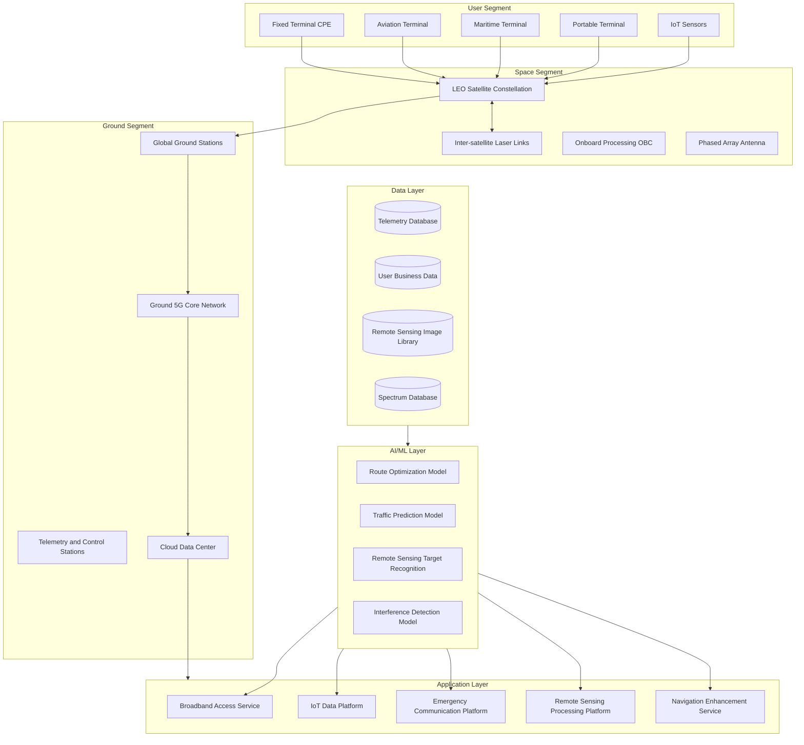
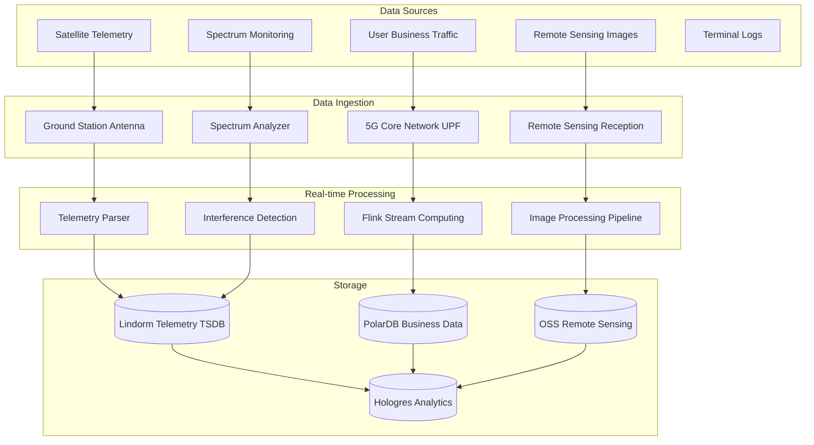

> **Production Environment Security Notice**
>
> This document contains directly executable operations commands. Before execution, please verify: whether the target cluster and namespace are correct; whether you have sufficient RBAC permissions; whether the commands have been tested in non-production environments. Command risk levels are marked as: 🔴 High risk (may cause data loss or service interruption), 🟡 Medium risk (modifies cluster state, but usually rollbackable), 🟢 Low risk/read-only (information gathering, no side effects).

title: Satellite Internet Architecture Design
description: '# Satellite Internet Architecture Design — Alibaba Cloud Perspective'
category: application-architecture
tags:
- k8s
- architecture
- industry
- [[Prometheus|prometheus]]
- grafana
- opa
- postgresql
- kafka
- operator
- gpu
last_updated: 2026-05-18
difficulty: advanced
reading_level: advanced
audience:
- Satellite Communication Architects
- Remote Sensing Data Processing Engineers
- Satellite IoT Developers
- Alibaba Cloud Big Data Solution Architects
estimated_read_time: 5min
intent_queries:
- Low-Orbit LEO Satellite Constellation [[Kubernetes|Kubernetes]] Deployment
- Satellite Remote Sensing Data Processing GPU Cluster Architecture
- Satellite IoT Data Collection Architecture
- TLE Orbital Prediction Data Processing
- Satellite Network Simulation and Ground Station Deployment
trigger_keywords:
- Satellite Internet
- Low-Orbit Satellite
- LEO
- Remote Sensing Data
- Satellite IoT
- Orbital Prediction
- Ground Station
- Inter-satellite Links
- Satellite Communication
- Heaven-Earth Integration
related_domains:
- domain-7-ai-ml-platform
- domain-03-networking-traffic
- domain-12-observability-comprehensive
- domain-5-edge-computing
related_topics:
- domain-20-application-patterns/topic-application-architecture/66-space-internet
- domain-20-application-patterns/topic-application-architecture/72-digital-twin-city
authors:
- name: KUDIG Team
  role: contributor
k8s_versions:
- '1.28'
- '1.29'
- '1.30'
- '1.31'
- '1.32'
---

# Satellite Internet Architecture Design — Alibaba Cloud Perspective

> **Applicable Versions**: Kubernetes v1.29 - v1.33 | **Last Updated**: 2026-05-18
> **Authors**: Alibaba Cloud Solution Architects | **Tags**: `#SatelliteInternet` `#LEOSatellite` `#Heaven-EarthIntegration` `#AlibabCloud`

---

## Table of Contents

1. [Industry Overview](#1-industry-overview)
2. [Business Scenarios](#2-business-scenarios)
3. [Architecture Design](#3-architecture-design)
4. [Core Technology Stack](#4-core-technology-stack)
5. [Kubernetes Deployment](#5-kubernetes-deployment)
6. [Data Architecture](#6-data-architecture)
7. [AI/ML Components](#7-aiml-components)
8. [Security and Compliance](#8-security-and-compliance)
9. [Best Practices](#9-best-practices)
10. [Anti-Patterns](#10-anti-patterns)
11. [Reference Resources](#11-reference-resources)

---

## 1. Industry Overview

### 1.1 Market Scale and Trends

Satellite internet provides global broadband coverage through LEO satellite constellations, becoming a core component of 6G heaven-earth integrated networks. Global market size projected from $18B in 2024 to $65B by 2030. Starlink has deployed over 6000 satellites, China Star Net (GW) plans about 13000 satellites, OneWeb, Amazon Kuiper also accelerating deployment.

| Metric | 2024 | 2026 (Projection) | 2030 (Projection) |
|:---|:---|:---|:---|
| Global LEO Satellites | ~8000 | ~15000 | ~50000 |
| Market Size | $18B | $35B | $65B |
| Per-satellite Bandwidth | 20 Gbps | 50 Gbps | 200 Gbps |
| End-to-End Latency | 40-60 ms | 20-40 ms | 10-20 ms |
| Terminal Cost | $500-1000 | $200-500 | $100-200 |

---

## 2. Business Scenarios

### 2.1 Broadband Access Service

Providing high-speed internet access for remote areas, oceans, aviation. User terminals access information stations via satellite links, connecting to ground core networks. System supports thousands of users sharing single-satellite bandwidth through dynamic bandwidth allocation and QoS policies. Typical scenarios: ocean shipping, desert oilfields, remote villages, in-flight WiFi.

### 2.2 Global IoT Data Collection

Collecting sensor data globally through satellite narrowband IoT (NB-IoT over Satellite), applied to weather monitoring, ocean buoys, wildlife tracking, ocean fisheries, pipeline monitoring. Low-power terminals support months of operation on single charge.

### 2.3 Emergency Communication

During disasters (earthquakes, floods, wars) where ground infrastructure is damaged, providing emergency communication via satellite. System supports rapid portable ground station deployment, providing voice, data, video communication services.

### 2.4 Navigation Enhancement

Broadcasting enhancement signals via LEO satellites to improve GNSS positioning precision to centimeter-level. Applications: autonomous driving, precision agriculture, surveying engineering, intelligent transportation. System requires millisecond timing synchronization and global coverage.

### 2.5 Remote Sensing Data Transmission and Processing

Downloading remote sensing images from satellites to ground stations, processing involves radiometric correction, geometric correction, target recognition. Single remote sensing satellite generates TB-level daily data, requiring high-performance parallel processing pipelines and AI target detection.

---

## 3. Architecture Design

### 3.1 Satellite Internet Comprehensive Architecture



---

## 4. Core Technology Stack

| Component | Purpose | Technology | License |
|:---|:---|:---|:---|
| Container Orchestration | Ground station workload management | ACK Pro (Kubernetes 1.29+) | Proprietary |
| Stream Processing | Real-time telemetry & traffic | Apache Flink 1.18+ | Apache 2.0 |
| Batch Processing | Remote sensing image pipeline | MaxCompute / Apache Spark | Proprietary / Apache 2.0 |
| AI Platform | Route optimization & image analysis | PAI / PyTorch 2.x | Proprietary / BSD |
| Time-Series DB | Satellite telemetry storage | Lindorm TSDB | Proprietary |
| Relational DB | Business & subscriber data | PolarDB PostgreSQL | Proprietary |
| Object Storage | Remote sensing images & logs | Aliyun OSS | Proprietary |
| Message Queue | Event-driven telemetry pipeline | Apache RocketMQ 5.x | Apache 2.0 |
| CDN | Content delivery & acceleration | Aliyun DCDN | Proprietary |
| Monitoring | End-to-end observability | ARMS + SLS + Grafana | Proprietary / Apache 2.0 |

---

## 5. Kubernetes Deployment

### 5.1 Satellite Data Processing Deployment

```yaml
apiVersion: apps/v1
kind: Deployment
metadata:
  name: satellite-data-processor
  namespace: satellite
  labels:
    app: satellite-data-processor
    tier: backend
spec:
  replicas: 5
  selector:
    matchLabels:
      app: satellite-data-processor
  strategy:
    rollingUpdate:
      maxSurge: 2
      maxUnavailable: 1
  template:
    metadata:
      labels:
        app: satellite-data-processor
        tier: backend
      annotations:
        prometheus.io/scrape: "true"
        prometheus.io/port: "9090"
    spec:
      affinity:
        podAntiAffinity:
          requiredDuringSchedulingIgnoredDuringExecution:
            - labelSelector:
                matchLabels:
                  app: satellite-data-processor
              topologyKey: topology.kubernetes.io/zone
      nodeSelector:
        region: ground-station
        node-pool: data-processor
      tolerations:
        - key: "dedicated"
          operator: "Equal"
          value: "satellite"
          effect: "NoSchedule"
      containers:
        - name: processor
          image: registry.cn-hangzhou.aliyuncs.com/satellite/data-processor:v2.1.0
          ports:
            - containerPort: 8080
              name: http
            - containerPort: 9090
              name: metrics
          env:
            - name: SATELLITE_TLE_PATH
              value: "/data/tle"
            - name: GROUND_STATION_ID
              value: "GS-BEIJING-01"
            - name: PROCESSING_MODE
              value: "realtime"
            - name: KAFKA_BOOTSTRAP
              valueFrom:
                configMapKeyRef:
                  name: satellite-config
                  key: kafka-bootstrap
            - name: DB_PASSWORD
              valueFrom:
                secretKeyRef:
                  name: satellite-secrets
                  key: db-password
          resources:
            requests:
              memory: "8Gi"
              cpu: "4000m"
            limits:
              memory: "16Gi"
              cpu: "8000m"
          readinessProbe:
            httpGet:
              path: /health/ready
              port: 8080
            initialDelaySeconds: 15
            periodSeconds: 10
          livenessProbe:
            httpGet:
              path: /health/live
              port: 8080
            initialDelaySeconds: 30
            periodSeconds: 15
          volumeMounts:
            - name: tle-data
              mountPath: /data/tle
              readOnly: true
            - name: processing-tmp
              mountPath: /tmp/processing
      volumes:
        - name: tle-data
          configMap:
            name: satellite-tle
        - name: processing-tmp
          emptyDir:
            medium: "Memory"
            sizeLimit: "8Gi"
```

---

## 6. Data Architecture

### 6.1 Data Flow Panorama



---

## 7. AI/ML Components

### 7.1 Core Models

| Model | Purpose | Input | Output | Framework |
|:---|:---|:---|:---|:---|
| Route Optimization | Inter-satellite/satellite-ground routing decision | Topology state / Business needs | Optimal path | DRL (PPO) |
| Traffic Prediction | User bandwidth demand prediction | Historical traffic / Position | Predicted bandwidth | LSTM |
| Remote Sensing Target Recognition | Automatic ground target recognition | Satellite imagery | Target class + location | YOLOv8 / SAM |
| Interference Detection | Spectrum interference detection | Spectrum data | Interference type + location | CNN + Attention |
| Handover Prediction | Satellite switching timing prediction | Orbital parameters / Signal strength | Switch time + target satellite | GNN |
| Orbit Prediction | Accurate satellite orbital prediction | TLE / Telemetry data | Orbital prediction | Kalman Filter + NN |

---

## 8. Security and Compliance

### 8.1 Industry Regulations and Standards

| Regulation/Standard | Applicable Scope | Architecture Requirement |
|:---|:---|:---|
| ITU Radio Regulations | International frequency coordination | Spectrum management system |
| 3GPP NTN | Non-terrestrial network standard | 5G NTN protocol stack |
| CCSDS | Space data system standards | Telemetry/telecommand protocol |
| Information Security Level 3 | Telecom infrastructure security | Network isolation + audit |
| GDPR / PIPL | User data privacy protection | Data desensitization + encryption |
| WRC Resolution | World Radio Conference resolution | Frequency segment compliance |
| Space Debris Mitigation | Orbital safety | Collision warning system |

---

## 9. Best Practices

1. **Multi-ground-station load balancing**: Globally deploy multiple ground stations, intelligently select optimal downlink station based on satellite position and ground station load
2. **Edge caching**: Cache hot content at ground station side, reducing backhaul bandwidth
3. **Adaptive Coding and Modulation (ACM)**: Dynamically adjust modulation based on weather/link quality
4. **On-board processing offloading**: Offload compute tasks to satellite processors, reducing ground station dependency
5. **TLE data real-time updates**: Update orbital parameters every 5 minutes for routing accuracy
6. **Hierarchical QoS policies**: Implement differentiated QoS for different services (voice/video/data/IoT)
7. **Global distributed deployment**: Deploy ground stations and data nodes near users, reducing backhaul latency
8. **Remote sensing data tiered storage**: Archive original data in OSS, processed products in standard OSS, retrieval metadata in PolarDB
9. **Dynamic spectrum sharing**: Use AI to predict spectrum usage patterns, enabling multi-system dynamic sharing
10. **Disaster recovery drills**: Regularly conduct ground station failover drills ensuring communication continuity

---

**Maintainer**: Alibaba Cloud Solution Architect Team | **License**: MIT

---

## Obsidian Related Documents

- topic-application-architecture MOC
- [[domain-20-application-patterns/topic-application-architecture/README.md|Topic Application Layer Architecture Design Best Practices]]
- [[domain-20-application-patterns/topic-application-architecture/01-ecommerce-architecture.md|E-Commerce System Kubernetes Production Architecture Design]]

## See Also

- 44-martech-adtech
- 45-smart-port-shipping
- 47-smart-mining
- 48-vocational-edtech


<!-- risk-assessed -->
