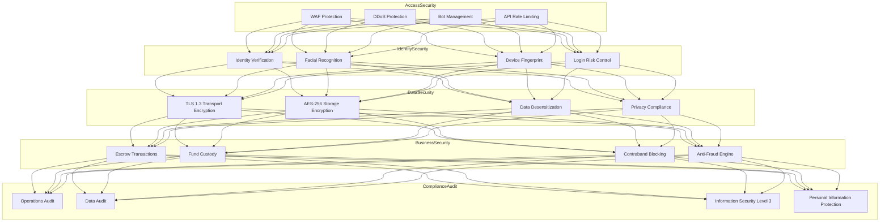

> **Production Environment Security Notice**
>
> This document contains directly executable operations commands. Before execution, please verify: whether the target cluster and namespace are correct; whether you have sufficient RBAC permissions; whether the commands have been tested in non-production environments. Command risk levels are marked as: 🔴 High risk (may cause data loss or service interruption), 🟡 Medium risk (modifies cluster state, but usually rollbackable), 🟢 Low risk/read-only (information gathering, no side effects).

title: Secondhand Trading and Circular Economy Architecture Design
description: '# Secondhand Trading and Circular Economy Architecture Design — Alibaba Cloud Perspective'
category: application-architecture
tags:
- k8s
- architecture
- industry
- [[Prometheus|prometheus]]
- redis
- mysql
- hpa
- [[StatefulSet|statefulset]]
- [[Ingress|ingress]]
- networkpolicy
last_updated: 2026-05-18
difficulty: advanced
reading_level: advanced
audience:
- Secondhand Platform Architects
- AI Algorithm Engineers
- Risk Control Systems Experts
estimated_read_time: 5min
intent_queries:
- Secondhand Trading Kubernetes C2C Platform
- Circular Economy AI Smart Pricing K8s
- Image-Based Search Milvus Kubernetes
- Secondhand Trading Risk Control Credit System K8s
- Carbon Reduction Green Points Kubernetes
trigger_keywords:
- Secondhand Trading
- Circular Economy
- C2C
- AI Pricing
- Image-Based Search
- Vector Retrieval
- Milvus
- Carbon Reduction
- Alibaba Cloud
related_domains:
- domain-01-cluster-fundamentals
- domain-11-production-operations
- domain-11-ai-infra
related_topics:
- 36-carbon-esg-management
- 01-ecommerce-architecture
- 53-new-retail-dtc
authors:
- name: KUDIG Team
  role: contributor
k8s_versions:
- '1.28'
- '1.29'
- '1.30'
- '1.31'
- '1.32'
---

# Secondhand Trading and Circular Economy Architecture Design — Alibaba Cloud Perspective

> **Applicable Versions**: Kubernetes v1.29 - v1.33 | **Last Updated**: 2026-05-18
> **Authors**: Alibaba Cloud Solution Architects | **Tags**: `#SecondhandTrading` `#CircularEconomy` `#C2C` `#AlibabCloud`

---

## Table of Contents

1. [Industry Overview](#1-industry-overview)
2. [Business Scenarios](#2-business-scenarios)
3. [Architecture Design](#3-architecture-design)
4. [Core Technology Stack](#4-core-technology-stack)
5. [Kubernetes Deployment](#5-kubernetes-deployment)
6. [Data Architecture](#6-data-architecture)
7. [AI/ML Components](#7-aiml-components)
8. [Security and Compliance](#8-security-and-compliance)
9. [Best Practices](#9-best-practices)
10. [Anti-Patterns](#10-anti-patterns)
11. [Reference Resources](#11-reference-resources)

---

## 1. Industry Overview

### 1.1 Industry Background and Trends

Secondhand trading and circular economy are rapidly growing sectors. Global secondhand market expected to reach $500B by 2026, China's market growing > 20% annually. Under carbon neutrality, circular economy becomes priority, secondhand trading platforms as core infrastructure for extending product lifespan, reducing waste, lowering emissions.

China's secondhand market shows: mobile-first (90%+ transactions), youth-led (Gen Z/Millennials core), category diverse (3C to fashion/luxury/books/furniture/cars), trust mechanisms improving (platform guarantees, quality inspection).

### 1.2 Core Challenges and Architecture Impact

| Challenge | Description | Architecture Impact |
|:---|:---|:---|
| Trust Gap C2C | Stranger transactions lack trust | Credit system + escrow + identity verification |
| Non-Standardized Goods | Large condition variance, inconsistent descriptions | AI pricing + image recognition + quality standards |
| Fraud Risk | False goods, fraudulent transactions | Risk control engine + behavior analysis + identity verification |
| Search Difficulty | Long-tail goods low retrieval efficiency | Image-based search + semantic matching + vector retrieval |
| Transaction Fulfillment | Complex logistics, payment, after-sales | Escrow transaction + logistics integration + dispute mediation |
| Environmental Value Quantification | Carbon reduction calculation and incentives | Green points system + carbon footprint tracking |
| Regulatory Compliance | Minor protection, contraband control | Content review + age verification + compliance engine |

---

## 2. Business Scenarios

### 2.1 Core Business Scenarios

- **Goods Publishing and Intelligent Descriptions**: Photo upload triggers AI auto-description, classification, condition assessment, price suggestion
- **Image-Based Search and Smart Recommendations**: Photo search for similar items, semantic search support
- **AI Smart Pricing**: Dynamic pricing based on photos, brand, condition, transaction history
- **Credit Trading and Escrow Payment**: Platform escrow, buyer/seller credit scores, Sesame credit free deposits
- **Quality Inspection and Verification**: Official inspection centers, video verification, third-party inspection reports
- **Recycling and Trade-In**: Pick-up recycling, store recycling, trade-in subsidies
- **Community and Content**: Secondhand sharing, Q&A community, eco-warrior incentives

---

## 3. Architecture Design

### 3.1 System Comprehensive Architecture

```mermaid
graph TB
    subgraph UserTouchpoints
        U1[Buyer App]
        U2[Seller App]
        U3[H5/Mini Program]
        U4[Web]
        U5[Recycler Terminal]
        U6[Inspector Terminal]
    end

    subgraph AccessLayer
        G1[API Gateway]
        G2[WebSocket Gateway]
        G3[CDN Acceleration]
    end

    subgraph BusinessServiceLayer
        B1[Goods Service]
        B2[Search Recommendation Service]
        B3[Trading Order Service]
        B4[Escrow Payment Service]
        B5[Logistics Service]
        B6[Quality Inspection Service]
        B7[Credit Rating Service]
        B8[Message Notification Service]
    end

    subgraph AIIntelligenceLayer
        A1[Image Recognition Engine]
        A2[Smart Pricing Engine]
        A3[Image-Based Search Service]
        A4[Risk Control Model Engine]
        A5[Content Compliance Engine]
        A6[Recommendation Algorithm Service]
    end

    subgraph DataMiddleware
        D1[User Profiles]
        D2[Goods Knowledge Graph]
        D3[Price Data Warehouse]
        D4[Carbon Reduction Computation Engine]
        D5[Trading Risk Control Models]
    end

    subgraph Infrastructure
        I1[PolarDB MySQL]
        I2[Redis Cluster]
        I3[Milvus Vector Database]
        I4[RocketMQ]
        I5[OSS Object Storage]
        I6[Lindorm TSDB]
    end

    U1 & U2 & U3 & U4 & U5 & U6 --> G1 & G2 & G3
    G1 & G2 --> B1 & B2 & B3 & B4 & B5 & B6 & B7 & B8
    B1 & B2 & B3 & B4 --> A1 & A2 & A3 & A4 & A5 & A6
    A1 & A2 & A3 & A4 & A5 & A6 --> D1 & D2 & D3 & D4 & D5
    B1 & B2 & B3 & B4 & B5 & B6 & B7 & B8 --> I1 & I2 & I3 & I4 & I5 & I6
```



---

## 4. Core Technology Stack

| Layer | Technology | Description |
|:---|:---|:---|
| Frontend | React Native + Flutter | Cross-platform mobile |
| Web | Next.js SSR | SEO optimization + fast loading |
| API Gateway | Kong / APISIX | Rate limiting, authentication, routing |
| Microservices | Spring Cloud Alibaba | Registration, config center |
| Message Queue | RocketMQ | Async order processing, delayed messages |
| Primary Database | PolarDB MySQL | Transactional data storage |
| Cache | Redis Cluster | Hot data, distributed locks |
| Vector Retrieval | Milvus | Image-based search, semantic search |
| Object Storage | OSS + CDN | Image/video storage distribution |
| Search Engine | OpenSearch | Full-text search, structured search |
| Real-time Computing | Flink | Real-time risk control, real-time recommendations |
| Offline Computing | MaxCompute | User profiles, data reports |
| AI Inference | PAI + GPU | Image recognition, pricing models |
| Container Orchestration | ACK Pro | Managed K8s cluster |
| Observability | ARMS + SLS | APM, logs, monitoring |
| Time-Series DB | Lindorm | Carbon reduction data, behavior data |

---

## 5. Kubernetes Deployment

### 5.1 Image Search GPU Service

```yaml
apiVersion: apps/v1
kind: Deployment
metadata:
  name: image-search-service
  namespace: secondhand
  labels:
    app: image-search
    tier: ai
spec:
  replicas: 3
  selector:
    matchLabels:
      app: image-search
  strategy:
    rollingUpdate:
      maxSurge: 1
      maxUnavailable: 0
  template:
    metadata:
      labels:
        app: image-search
        tier: ai
      annotations:
        prometheus.io/scrape: "true"
        prometheus.io/port: "9090"
    spec:
      nodeSelector:
        accelerator: nvidia-t4
      runtimeClassName: nvidia
      affinity:
        podAntiAffinity:
          preferredDuringSchedulingIgnoredDuringExecution:
            - weight: 100
              podAffinityTerm:
                labelSelector:
                  matchExpressions:
                    - key: app
                      operator: In
                      values: ["image-search"]
                topologyKey: topology.kubernetes.io/zone
      tolerations:
        - key: nvidia.com/gpu
          operator: Exists
          effect: NoSchedule
      containers:
        - name: search
          image: registry.cn-hangzhou.aliyuncs.com/secondhand/image-search:v2.0.0-gpu
          ports:
            - containerPort: 8080
              name: http
            - containerPort: 9090
              name: metrics
          env:
            - name: VECTOR_DB_URL
              value: "http://milvus-cluster:19530"
            - name: MODEL_PATH
              value: "/models/clip-vit-large-patch14"
            - name: EMBEDDING_DIM
              value: "768"
            - name: TOP_K
              value: "20"
            - name: SEARCH_TIMEOUT_MS
              value: "500"
          resources:
            requests:
              nvidia.com/gpu: 1
              memory: "8Gi"
              cpu: "4000m"
            limits:
              nvidia.com/gpu: 1
              memory: "16Gi"
              cpu: "8000m"
          volumeMounts:
            - name: model-volume
              mountPath: /models
              readOnly: true
          readinessProbe:
            httpGet:
              path: /health
              port: 8080
            initialDelaySeconds: 30
            periodSeconds: 10
          livenessProbe:
            httpGet:
              path: /health
              port: 8080
            initialDelaySeconds: 60
            periodSeconds: 30
      volumes:
        - name: model-volume
          persistentVolumeClaim:
            claimName: ai-model-pvc
---
apiVersion: v1
kind: Service
metadata:
  name: image-search-service
  namespace: secondhand
spec:
  selector:
    app: image-search
  ports:
    - port: 8080
      targetPort: 8080
      name: http
    - port: 9090
      targetPort: 9090
      name: metrics
  type: ClusterIP
```

---

## 6. Data Architecture

### 6.1 Data Stratification

| Data Domain | Core Entities | Storage Engine | Volume | Retention |
|:---|:---|:---|:---|:---|
| Goods | Goods Info, Classification, Attributes | PolarDB + OpenSearch | Millions | Permanent |
| Trading | Orders, Payment, Refunds | PolarDB | Tens of millions | 5 years |
| Users | User Profiles, Credit Scores | PolarDB + Redis | Millions | Permanent |
| Images | Product Images, Feature Vectors | OSS + Milvus | Hundreds of millions | 3 years |
| Behavior | Browse, Search, Click | Lindorm + MaxCompute | Trillions | 2 years |
| Logistics | Waybills, Tracking | PolarDB + Lindorm | Tens of millions | 3 years |
| Credit | Credit Scores, Reviews | PolarDB + Redis | Millions | Permanent |

---

## 7. AI/ML Components

### 7.1 AI Capability Matrix

| AI Capability | Model Type | Input | Output | Performance |
|:---|:---|:---|:---|:---|
| Goods Classification | ResNet-152 / EfficientNet | Product Photo | Category+Brand+Model | P99 < 200ms |
| Condition Assessment | Custom CV Model | Photo+Description | Condition Grade (A/B/C/D) | P99 < 500ms |
| Image-Based Search | CLIP + Faiss | Product Photo | Top-20 Similar Goods | P99 < 300ms |
| Smart Pricing | XGBoost + DNN | Goods Features+Market Data | Suggested Price Range | P99 < 100ms |
| Risk Control Model | GNN + XGBoost | User Behavior+Transaction Features | Risk Score (0-100) | P99 < 50ms |
| Content Review | Multi-modal Model | Image+Text | Compliant/Violation/Pending | P99 < 300ms |
| Recommendation Ranking | DeepFM + DIN | User Profile+Goods Pool | Ranked Goods List | P99 < 100ms |

---

## 8. Security and Compliance

### 8.1 Security Architecture



---

## 9. Best Practices

- **Escrow Model**: All funds through platform escrow, frozen until buyer receipt confirmation
- **AI Smart Pricing**: Auto-recommend price ranges on new item publishing, lower barriers to pricing
- **Vector Retrieval Optimization**: CLIP model extracts semantic vectors, Milvus enables millisecond image search
- **Multi-Level Caching**: L1 local cache + L2 Redis cluster + L3 database for hot goods
- **Asynchronous Processing**: Order creation, payment callbacks, logistics updates via RocketMQ async processing
- **Flexible Transactions**: Cross-service transactions via Saga pattern, compensation ensures eventual consistency
- **Carbon Reduction Tracking**: Calculate carbon reduction per transaction, accumulate user green points
- **Tiered Storage**: Hot PolarDB, warm Lindorm, cold OSS archival

---

## 10. Anti-Patterns

| Anti-Pattern | Problem | Solution |
|:---|:---|:---|
| Unguaranteed Direct Transfer | Direct transfer lacks fraud protection | Platform escrow, funds release after receipt |
| Single Text Search | Keyword-only, low match rate | Combine image search + semantic + vector |
| Manual Pricing No Reference | Seller self-pricing, market deviation | AI suggestions provide market reference |
| No Credit System | No user credit evaluation | Multi-dimensional credit scoring, tie to transaction rights |
| Uncompressed Images | High-res slow loading | Multi-spec thumbnails + WebP + CDN |
| Ignore Carbon Value | Focus transactions not environmental | Build carbon reduction model, incentivize circular |
| Risk Control Delayed | Fraud happens before detection | Real-time pre-trade risk assessment, block anomalies |
| Strong Consistency Cross-Service Transactions | Locks hurt performance | Saga flexible transactions + eventual consistency |

---

## 11. Reference Resources

### 11.1 Alibaba Cloud Component Mapping

| Functional Domain | Alibaba Cloud Solution | Description |
|:---|:---|:---|
| Container Platform | **ACK Pro** | Managed K8s, GPU node pool support |
| AI Image | **PAI / Vision Intelligence** | Image recognition, object detection training |
| Vector Retrieval | **Milvus on ACK** | Product image vector search |
| Database | **PolarDB MySQL** | Transactional data, read-write separation |
| Cache | **Redis Enterprise** | Hot data caching, distributed locks |
| Object Storage | **OSS + CDN** | Picture/video storage distribution |
| Message Queue | **RocketMQ** | Async messages, delayed messages |
| Search | **OpenSearch** | Full-text search, structured search |
| Real-time Computing | **Flink** | Real-time risk control, real-time recommendations |
| Observability | **ARMS + SLS** | APM, log analysis, monitoring alerts |
| Security | **WAF + Cloud Shield** | Web protection, DDoS protection |
| Blockchain | **Ant Chain BaaS** | Goods traceability, carbon reduction notarization |

### 11.2 Production Checklist

- [ ] Image search P99 latency < 500ms
- [ ] Smart pricing accuracy > 85% (±15% error)
- [ ] Risk control fraud interception > 99%
- [ ] Contraband detection coverage > 95%
- [ ] Escrow transaction fund safety audit pass
- [ ] Image-based search Top-10 recall > 80%
- [ ] Goods recommendation CTR > 8%
- [ ] Order creation P99 latency < 200ms
- [ ] Information Security Level 3 compliance pass
- [ ] Personal information protection audit pass
- [ ] Disaster recovery RTO < 30min, RPO < 5min

---

**Maintainer**: Alibaba Cloud Solution Architect Team | **License**: MIT

---

## Obsidian Related Documents

- topic-application-architecture MOC
- [[domain-20-application-patterns/topic-application-architecture/README.md|Topic Application Layer Architecture Design Best Practices]]
- [[domain-20-application-patterns/topic-application-architecture/01-ecommerce-architecture.md|E-Commerce System Kubernetes Production Architecture Design]]

## See Also

- 40-cloud-gaming
- 41-beauty-ecommerce
- 43-enterprise-im
- 44-martech-adtech


<!-- risk-assessed -->
