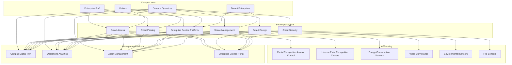
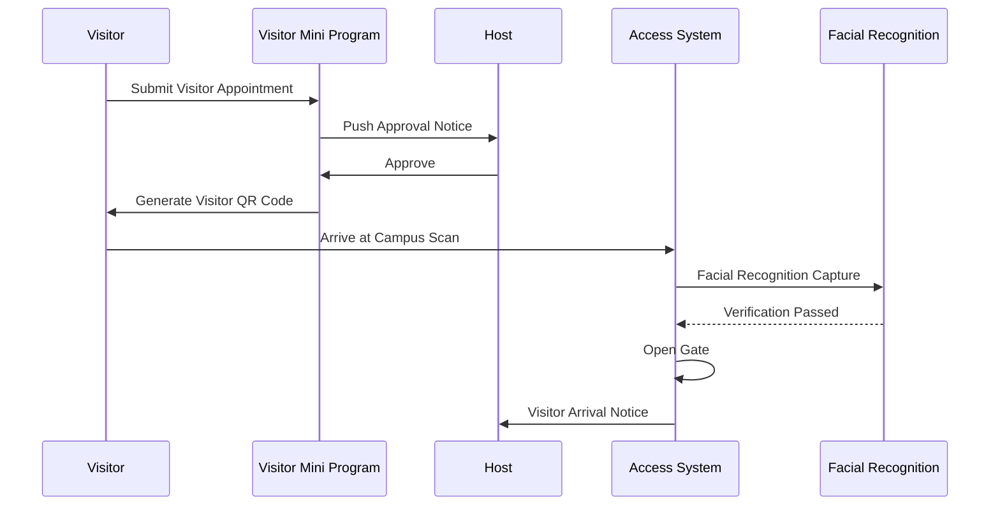
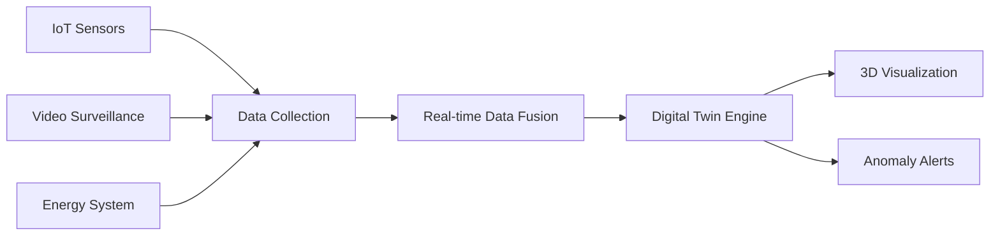

> **Production Environment Security Notice**
>
> This document contains directly executable operations commands. Before execution, please verify: whether the target cluster and namespace are correct; whether you have sufficient RBAC permissions; whether the commands have been tested in non-production environments. Command risk levels are marked as: 🔴 High risk (may cause data loss or service interruption), 🟡 Medium risk (modifies cluster state, but usually rollbackable), 🟢 Low risk/read-only (information gathering, no side effects).

title: Smart Campus Architecture Design
description: '# Smart Campus Architecture Design — Alibaba Cloud Perspective'
category: application-architecture
tags:
- k8s
- architecture
- industry
- job
- [[CronJob|cronjob]]
last_updated: 2026-05-18
difficulty: intermediate
reading_level: intermediate
audience:
- Smart Campus Architects
- Building Intelligence Engineers
- Campus IT Managers
- Smart City Developers
estimated_read_time: 5min
intent_queries:
- smart campus [[Kubernetes|kubernetes]] architecture
- Smart Campus K8s Deployment
- Smart Building IoT Platform
- Smart Campus Digital Twin
- Smart Campus Security AI System
trigger_keywords:
- Smart Campus
- Smart Building
- Campus Management
- Smart Access
- Smart Parking
- Energy Management
- Smart Security
- Smart Campus Architecture
- Smart Building K8s
- Campus IoT
related_domains:
- domain-01-cluster-fundamentals
- domain-10-troubleshooting-diagnostics
- domain-03-networking-traffic
related_topics:
- digital-twin-city
- energy-power-architecture
- smart-water
authors:
- name: KUDIG Team
  role: contributor
k8s_versions:
- '1.28'
- '1.29'
- '1.30'
- '1.31'
- '1.32'
---

# Smart Campus Architecture Design — Alibaba Cloud Perspective

> **Applicable Versions**: Kubernetes v1.29 - v1.33 | **Last Updated**: 2026-04-24
> **Authors**: Alibaba Cloud Solution Architects | **Tags**: `#SmartCampus` `#SmartBuilding` `#CampusManagement` `#AlibabCloud`

---

## Table of Contents

1. [Industry Background](#1-industry-background)
2. [Business Architecture](#2-business-architecture)
3. [Technical Architecture](#3-technical-architecture)
4. [Core Data Flow](#4-core-data-flow)
5. [Security and Compliance](#5-security-and-compliance)
6. [Observability](#6-observability)
7. [Alibaba Cloud Component Mapping](#7-alibaba-cloud-component-mapping)
8. [Production Checklist](#8-production-checklist)

---

## 1. Industry Background

### 1.1 Business Characteristics

Smart campus integrates campus operations, enterprise services, security management, energy optimization:

| Challenge | Description | Architecture Impact |
|:---|:---|:---|
| Multi-System Silos | Access/Parking/Energy/Property independent | Unified IoT platform |
| High Security Requirements | Personnel/Vehicle/Asset safety | AI video analysis |
| Energy Optimization | Carbon neutrality goals | Intelligent control |
| Enterprise Services | Diverse tenant needs | Service marketplace |
| Space Management | Workstation/Meeting room/Factory utilization | Space digitalization |

### 1.2 Core Scenarios

- **Access Management**: Facial/License plate/QR code contactless access
- **Smart Parking**: Parking guidance/reverse search/contactless payment
- **Energy Management**: Lighting/HVAC/Elevator intelligent control
- **Security Monitoring**: AI video analysis/Electronic patrol/Fire integration
- **Enterprise Services**: Repair/Payment/Meeting room booking/Visitor appointment

---

## 2. Business Architecture

### 2.1 Smart Campus Comprehensive Architecture



### 2.2 Visitor Access Sequence



---

## 3. Technical Architecture

### 3.1 Kubernetes Deployment

```yaml
# Campus IoT Data Processing Deployment
apiVersion: apps/v1
kind: Deployment
metadata:
  name: campus-iot-processor
  namespace: smart-campus
spec:
  replicas: 3
  selector:
    matchLabels:
      app: campus-iot-processor
  template:
    metadata:
      labels:
        app: campus-iot-processor
    spec:
      containers:
        - name: processor
          image: registry.cn-hangzhou.aliyuncs.com/campus/iot-processor:v2.0.0
          ports:
            - containerPort: 8080
          env:
            - name: MQTT_BROKER
              value: "mqtt://iot-campus.aliyuncs.com:1883"
            - name: AI_VIDEO_ENDPOINT
              value: "http://ai-video-service:8080"
          resources:
            requests:
              memory: "2Gi"
              cpu: "1000m"
            limits:
              memory: "4Gi"
              cpu: "2000m"
```

```yaml
# Energy Management CronJob
apiVersion: batch/v1
kind: CronJob
metadata:
  name: energy-optimization
  namespace: smart-campus
spec:
  schedule: "0 */1 * * *"
  jobTemplate:
    spec:
      template:
        spec:
          containers:
            - name: optimizer
              image: registry.cn-hangzhou.aliyuncs.com/campus/energy-opt:v1.2.0
              env:
                - name: OPTIMIZATION_STRATEGY
                  value: "predictive-hvac"
              resources:
                requests:
                  memory: "1Gi"
                  cpu: "500m"
          restartPolicy: OnFailure
```

---

## 4. Core Data Flow

### 4.1 Campus Digital Twin Data Flow



---

## 5. Security and Compliance

- **Personnel Safety**: Facial recognition privacy compliance
- **Fire Safety**: Fire system integration
- **Data Security**: Campus data tiered protection

---

## 6. Observability

- **Device Online Rate**: > 98%
- **Security Alert Response**: < 5s
- **Energy Reduction**: > 15%

---

## 7. Alibaba Cloud Component Mapping

| Functional Domain | **Alibaba Cloud Cloud Native Solution** |
|:---|:---|
| Container Platform | **ACK Pro** |
| IoT | **Alibaba Cloud IoT Platform** |
| AI | **Vision Intelligence** |
| Database | **PolarDB + Lindorm** |
| Object Storage | **OSS** |
| Real-time Computing | **Flink** |
| Observability | **ARMS + SLS** |
| Digital Twin | **DataV** |

---

## 8. Production Checklist

- [ ] IoT device access coverage
- [ ] Facial recognition accuracy > 99%
- [ ] Fire integration response < 3s
- [ ] Energy optimization strategy verification
- [ ] Visitor system end-to-end testing

---

**Maintainer**: Alibaba Cloud Solution Architect Team | **License**: MIT

---

## Obsidian Related Documents

- topic-application-architecture KUDIG Database — Global MOC
- [[domain-20-application-patterns/topic-application-architecture/README.md|Topic Application Layer Architecture Design Best Practices]]
- [[domain-20-application-patterns/topic-application-architecture/01-ecommerce-architecture.md|E-Commerce System Kubernetes Production Architecture Design]]

## See Also

- 37-pet-economy
- 38-supply-chain-finance
- 40-cloud-gaming
- 41-beauty-ecommerce


<!-- risk-assessed -->
