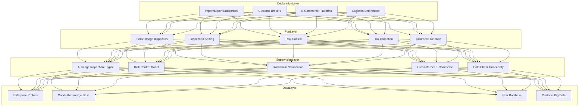
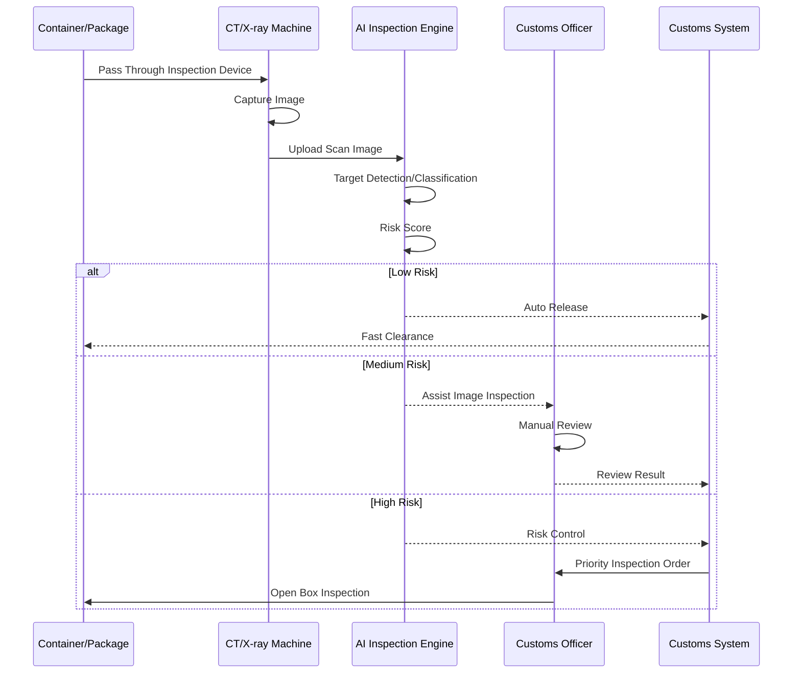
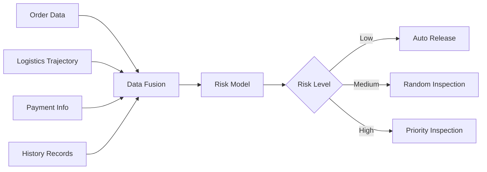

> **Production Environment Security Notice**
>
> This document contains directly executable operations commands. Before execution, please verify: whether the target cluster and namespace are correct; whether you have sufficient RBAC permissions; whether the commands have been tested in non-production environments. Command risk levels are marked as: 🔴 High risk (may cause data loss or service interruption), 🟡 Medium risk (modifies cluster state, but usually rollbackable), 🟢 Low risk/read-only (information gathering, no side effects).

title: Smart Customs Architecture Design
description: '# Smart Customs Architecture Design — Alibaba Cloud Perspective'
category: application-architecture
tags:
- k8s
- architecture
- industry
- gpu
- nvidia
last_updated: '2026-05-18'
difficulty: advanced
reading_level: advanced
audience:
- Customs Information Infrastructure Architects
- Clearance System Developers
- AI Vision Engineers
- Alibaba Cloud Solution Architects
estimated_read_time: 5min
intent_queries:
- Smart Customs System Architecture Design
- AI Image Inspection CT/X-ray Plate Recognition
- Risk Control Large Data Analysis
- Cross-border E-Commerce Clearance
- Cold Chain Traceability Blockchain
trigger_keywords:
- Smart Customs
- Smart Port
- AI Image Inspection
- Risk Control
- Cross-border E-Commerce
- Cold Chain Supervision
- Paperless Clearance
- Smuggling Detection
- Customs Risk Control
- CT Image Inspection
related_domains:
- domain-01-cluster-fundamentals
- domain-9-ai-ml
- domain-7-observability
- domain-03-networking-traffic
related_topics:
- domain-20-application-patterns/topic-application-architecture/25-quantitative-trading
- domain-20-application-patterns/topic-application-architecture/12-smart-logistics-architecture
- domain-20-application-patterns/topic-application-architecture/58-web3-gamefi
- domain-02-workloads-applications/topic-functions/09-data-security-privacy
authors:
- name: KUDIG Team
  role: contributor
k8s_versions:
- '1.28'
- '1.29'
- '1.30'
- '1.31'
- '1.32'
---

# Smart Customs Architecture Design — Alibaba Cloud Perspective

> **Applicable Versions**: [[Kubernetes|Kubernetes]] v1.29 - v1.33 | **Last Updated**: 2026-04-24
> **Authors**: Alibaba Cloud Solution Architects | **Tags**: `#SmartCustoms` `#SmartPort` `#AIImageInspection` `#RiskControl` `#AlibabCloud`

---

## Table of Contents

1. [Industry Background](#1-industry-background)
2. [Business Architecture](#2-business-architecture)
3. [Technical Architecture](#3-technical-architecture)
4. [Core Data Flow](#4-core-data-flow)
5. [Security and Compliance](#5-security-and-compliance)
6. [Observability](#6-observability)
7. [Alibaba Cloud Component Mapping](#7-alibaba-cloud-component-mapping)
8. [Production Checklist](#8-production-checklist)

---

## 1. Industry Background

### 1.1 Business Characteristics

Smart customs improves clearance efficiency and monitoring precision through technology:

| Challenge | Description | Architecture Impact |
|:---|:---|:---|
| Clearance Time | Fast cargo clearance demands | Advanced declaration + smart inspection |
| Risk Prevention | Smuggling/Contraband detection | AI image inspection + big data risk control |
| Cross-Border E-Commerce | Massive small package regulation | Automated sorting + risk scanning |
| Port Coordination | Multi-department data sharing | Data exchange platform |
| Cold Chain Supervision | Import cold chain food safety | Full-chain temperature traceability |

### 1.2 Core Scenarios

- **Smart Image Inspection**: CT/X-ray machine AI automatic recognition
- **Risk Control**: Big data risk analysis prediction
- **Cross-Border E-Commerce Clearance**: 9610/9710/9810 modes
- **Cold Chain Supervision**: Import cold chain food traceability
- **Smart Port**: Paperless clearance/One-stop operations

---

## 2. Business Architecture

### 2.1 Smart Customs Comprehensive Architecture



### 2.2 Smart Image Inspection Sequence



---

## 3. Technical Architecture

### 3.1 Kubernetes Deployment

```yaml
# AI Image Inspection Engine GPU Deployment
apiVersion: apps/v1
kind: Deployment
metadata:
  name: ai-image-inspection
  namespace: smart-customs
spec:
  replicas: 5
  selector:
    matchLabels:
      app: ai-image-inspection
  template:
    metadata:
      labels:
        app: ai-image-inspection
    spec:
      nodeSelector:
        accelerator: nvidia-t4
      runtimeClassName: nvidia
      containers:
        - name: inspector
          image: registry.cn-hangzhou.aliyuncs.com/customs/ai-inspection:v3.0.0-gpu
          ports:
            - containerPort: 8080
          env:
            - name: DETECTION_CLASSES
              value: "weapons,drugs,contraband"
            - name: CONFIDENCE_THRESHOLD
              value: "0.85"
          resources:
            requests:
              nvidia.com/gpu: 1
              memory: "8Gi"
              cpu: "4000m"
            limits:
              nvidia.com/gpu: 1
              memory: "16Gi"
              cpu: "8000m"
```

---

## 4. Core Data Flow

### 4.1 Cross-Border E-Commerce Risk Scanning



---

## 5. Security and Compliance

- **Border Security**: Contraband detection rate > 99%
- **Data Security**: Enterprise declaration data encryption
- **Information Security Level 3**: Customs system protection

---

## 6. Observability

- **Inspection Speed**: Single container < 3s
- **Recognition Accuracy**: > 95%
- **Clearance Time**: Compress 50%+

---

## 7. Alibaba Cloud Component Mapping

| Functional Domain | **Alibaba Cloud Cloud Native Solution** |
|:---|:---|
| Container Platform | **ACK Pro + GPU** |
| AI | **PAI / Vision Intelligence** |
| Blockchain | **Ant Blockchain BaaS** |
| Database | **PolarDB** |
| Big Data | **MaxCompute** |
| Observability | **ARMS + SLS** |

---

## 8. Production Checklist

- [ ] AI image inspection accuracy > 95%
- [ ] Contraband detection zero miss rate
- [ ] Cross-border e-commerce data real-time sync
- [ ] Cold chain traceability link completion
- [ ] Information Security Level 3 compliance audit

---

**Maintainer**: Alibaba Cloud Solution Architect Team | **License**: MIT

---

## Obsidian Related Documents

- topic-application-architecture KUDIG Database — Global MOC
- [[domain-20-application-patterns/topic-application-architecture/README.md|Topic Application Layer Architecture Design Best Practices]]
- [[domain-20-application-patterns/topic-application-architecture/01-ecommerce-architecture.md|E-Commerce System Kubernetes Production Architecture Design]]

## See Also

- 79-polar-research
- 80-tsn-network
- 82-legaltech
- 83-cultural-digitization

## Related

- topic-application-architecture MOC — Cross-reference


<!-- risk-assessed -->
