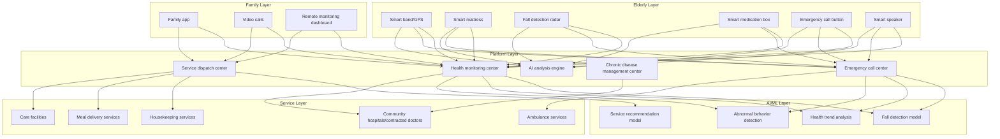
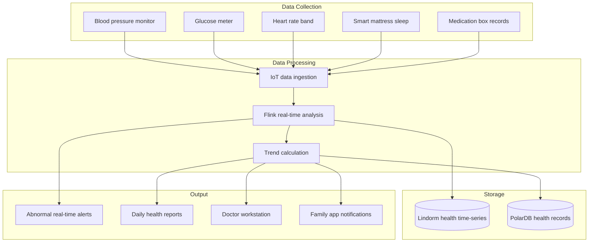

# Smart Elderly Care Architecture Design - Alibaba Cloud Perspective

> **Applicable Versions**: Kubernetes v1.29 - v1.33 | **Last Updated**: 2026-04-24
> **Authors**: Alibaba Cloud Solution Architects | **Tags**: `#SmartElderlycare` `#Homebased` `#Wellness` `#AlibabCloud`

---

## Table of Contents

1. [Industry Overview](#1-industry-overview)
2. [Business Scenarios](#2-business-scenarios)
3. [Architecture Design](#3-architecture-design)
4. [Core Technology Stack](#4-core-technology-stack)
5. [Kubernetes Deployment Plan](#5-kubernetes-deployment-plan)
6. [Data Architecture](#6-data-architecture)
7. [AI/ML Components](#7-aiml-components)
8. [Security and Compliance](#8-security-and-compliance)
9. [Best Practices](#9-best-practices)
10. [Anti-Patterns](#10-anti-patterns)
11. [Reference Resources](#11-reference-resources)

---

## 1. Industry Overview

## 1.1 Market Size and Trends

Smart elderly care enhances the quality of life and safety for seniors through technology, addressing population aging challenges. China's elderly population (60+) has reached 300 million and is projected to exceed 400 million by 2035. The smart elderly care market is expected to grow from 600 billion yuan in 2024 to 2 trillion yuan by 2030. Core technologies include IoT wearables, AI fall detection, telemedicine, smart homes, and community service aggregation platforms.

| Metric | 2024 | 2026 (Projected) | 2030 (Projected) |
|:---|:---|:---|:---|
| China's Elderly Population | 300M | 330M | 400M |
| Smart Elderly Care Market | ¥600B | ¥1000B | ¥2000B |
| Home-Based Care Proportion | 90% | 90% | 90% |
| Fall Detection Accuracy | 90% | 95% | 98% |
| Wearable Device Penetration | 5% | 15% | 40% |

## 1.2 Industry Pain Points

| Pain Point | Description | Digital Transformation Driver |
|:---|:---|:---|
| Age-Appropriate Design | Seniors have unique operational habits | Large font/Voice interaction/Simplified workflows |
| Emergency Assistance | Slow response to falls/sudden illness | Real-time monitoring + Automatic alerts |
| Health Management | Chronic disease management/Medication reminders | IoT wearables + AI analysis |
| Social Isolation | Loneliness in elderly living alone | Video calls/Community activities/Digital companions |
| Service Integration | Fragmented medical/housekeeping/meal services | Service platform aggregation |
| Privacy Concerns | Surveillance devices invade privacy | Edge computing + Data masking |

## 1.3 Digital Transformation Architecture Impact

Smart elderly care architecture needs to cover the elderly layer (wearables/smart mattresses/fall detection radar/smart medication box/emergency buttons), home layer (family apps/video calls), platform layer (health monitoring/emergency calls/service dispatch/chronic disease management), and service layer (community hospitals/housekeeping/meal delivery/care facilities). The core challenge is age-appropriate interaction and false alarm rate control.

---

## 2. Business Scenarios

## 2.1 Home Safety Monitoring

Through millimeter-wave radar (fall detection), gas detectors, door/window sensors, and water leakage sensors, 24-hour monitoring of elderly living alone at home is enabled. Fall detection requires no cameras, protecting privacy. When a fall occurs, automatic alerts are triggered within 30 seconds to family and call centers.

## 2.2 Chronic Disease Health Management

Continuous health monitoring through smart bands/blood pressure monitors/glucose meters. AI analyzes trends and notifies contracted doctors and family when anomalies occur. Supports medication reminders (smart medication boxes), follow-up reminders, and health report generation.

## 2.3 Emergency Calling and Rescue

Elderly can trigger emergency rescue through one-click calling buttons or voice commands. The system automatically locates the elderly, notifies family, community service stations, and ambulance services. Supports automatic fall detection triggering (no manual operation needed).

## 2.4 Smart Care Devices

Smart mattresses monitor sleep quality, breathing, and heart rate; smart medication boxes provide dose-based reminders; GPS bands prevent getting lost (geofencing); smart speakers provide voice interaction and companionship.

## 2.5 Elderly Care Service Aggregation Platform

Integrates community surrounding meal assistance, cleaning, medical assistance, mobility assistance, and bathing services. Elderly or family can book services through the app with one click. The platform unified manages service quality and billing.

---

## 3. Architecture Design

## 3.1 Smart Elderly Care Panoramic Architecture



---

## 4. Core Technology Stack

| Component | Purpose | Technology | License |
|:---|:---|:---|:---|
| Container Orchestration | Platform management | ACK Pro | Proprietary |
| IoT Platform | Device management | Alibaba Cloud IoT Platform | Proprietary |
| AI Vision | Fall detection (camera-based) | PAI + Visual Intelligence | Proprietary |
| Radar Processing | mmWave radar fall detection | Proprietary radar algorithms | Proprietary |
| Time-Series DB | Health data storage | Lindorm TSDB | Proprietary |
| Relational DB | Business data | PolarDB MySQL | Proprietary |
| Message Queue | Alert delivery | RocketMQ 5.x | Apache 2.0 |
| RTC | Video calling | Alibaba Cloud RTC | Proprietary |
| Voice | Voice interaction | Alibaba Cloud voice services | Proprietary |
| Object Storage | Health reports | OSS | Proprietary |
| Cache | Real-time state | Redis Enterprise | Proprietary |
| Monitoring | Observability | ARMS + SLS | Proprietary |

---

## 5. Kubernetes Deployment Plan

## 5.1 Health Monitoring Service Deployment

```yaml
apiVersion: apps/v1
kind: Deployment
metadata:
  name: health-monitor
  namespace: smart-elderly
  labels:
    app: health-monitor
    tier: core-service
spec:
  replicas: 4
  selector:
    matchLabels:
      app: health-monitor
  strategy:
    rollingUpdate:
      maxSurge: 1
      maxUnavailable: 0
  template:
    metadata:
      labels:
        app: health-monitor
      annotations:
        prometheus.io/scrape: "true"
        prometheus.io/port: "9090"
    spec:
      affinity:
        podAntiAffinity:
          preferredDuringSchedulingIgnoredDuringExecution:
            - weight: 100
              podAffinityTerm:
                labelSelector:
                  matchLabels:
                    app: health-monitor
                topologyKey: topology.kubernetes.io/zone
      containers:
        - name: monitor
          image: registry.cn-hangzhou.aliyuncs.com/elderly/health-monitor:v2.0.0
          ports:
            - containerPort: 8080
              name: http
            - containerPort: 9090
              name: metrics
          env:
            - name: ALERT_THRESHOLD_HEART_RATE
              value: "120"
            - name: FALL_DETECTION_ENABLED
              value: "true"
            - name: BLOOD_PRESSURE_ALERT
              value: "160/100"
            - name: BLOOD_SUGAR_ALERT_HIGH
              value: "11.1"
            - name: DB_CONNECTION
              valueFrom:
                secretKeyRef:
                  name: elderly-secrets
                  key: db-connection
            - name: REDIS_URL
              valueFrom:
                secretKeyRef:
                  name: elderly-secrets
                  key: redis-url
          resources:
            requests:
              memory: "2Gi"
              cpu: "1000m"
            limits:
              memory: "4Gi"
              cpu: "2000m"
          readinessProbe:
            httpGet:
              path: /health/ready
              port: 8080
            initialDelaySeconds: 10
            periodSeconds: 5
          livenessProbe:
            httpGet:
              path: /health/live
              port: 8080
            initialDelaySeconds: 20
            periodSeconds: 10
```

## 5.2 Emergency Call Center Deployment

```yaml
apiVersion: apps/v1
kind: Deployment
metadata:
  name: emergency-call-center
  namespace: smart-elderly
spec:
  replicas: 3
  selector:
    matchLabels:
      app: emergency-call-center
  template:
    metadata:
      labels:
        app: emergency-call-center
    spec:
      containers:
        - name: call-center
          image: registry.cn-hangzhou.aliyuncs.com/elderly/call-center:v2.0.0
          ports:
            - containerPort: 8080
          env:
            - name: OPERATORS_ONLINE
              value: "10"
            - name: AUTO_ESCALATE_SECONDS
              value: "30"
            - name: AMBULANCE_API_URL
              value: "http://ambulance-service:8080"
          resources:
            requests:
              memory: "2Gi"
              cpu: "1000m"
            limits:
              memory: "4Gi"
              cpu: "2000m"
```

## 5.3 ConfigMap, Service and Secret

```yaml
apiVersion: v1
kind: ConfigMap
metadata:
  name: elderly-config
  namespace: smart-elderly
data:
  health-thresholds: |
    {
      "heart_rate": {"low": 50, "high": 120, "critical": 150},
      "blood_pressure": {"systolic_high": 160, "diastolic_high": 100},
      "blood_sugar": {"low": 3.9, "high": 11.1},
      "spo2_low": 90,
      "temperature_high": 38.0
    }
  fall-detection: |
    {
      "radar_enabled": true,
      "camera_enabled": false,
      "confidence_threshold": 0.9,
      "auto_alert_seconds": 30,
      "false_positive_filter": true
    }
  service-types: |
    [
      {"id": "meal", "name": "Meal assistance", "providers": 50},
      {"id": "clean", "name": "Cleaning assistance", "providers": 30},
      {"id": "medical", "name": "Medical assistance", "providers": 20},
      {"id": "transport", "name": "Mobility assistance", "providers": 15},
      {"id": "bath", "name": "Bathing assistance", "providers": 10}
    ]
---
apiVersion: v1
kind: Service
metadata:
  name: health-monitor
  namespace: smart-elderly
spec:
  selector:
    app: health-monitor
  ports:
    - name: http
      port: 8080
      targetPort: 8080
    - name: metrics
      port: 9090
      targetPort: 9090
  type: ClusterIP
---
apiVersion: v1
kind: Secret
metadata:
  name: elderly-secrets
  namespace: smart-elderly
type: Opaque
stringData:
  db-connection: "mysql://elderly@polardb.elderly.rds.aliyuncs.com:3306/elderly_db"
  redis-url: "redis://:password@redis-elderly.rds.aliyuncs.com:6379/0"
  encryption-key: "aes-256-gcm-key-placeholder"
  sms-api-key: "sms-service-key-placeholder"
```

---

## 6. Data Architecture

## 6.1 Chronic Disease Management Data Flow



## 6.2 Data Flow Description

- **Health data flow**: Wearable/home medical device data uploaded via Bluetooth/WiFi, written to Lindorm after IoT platform ingestion
- **Alert data flow**: Abnormal data triggers graded alerts in real-time (mild → family notification, severe → ambulance)
- **Service data flow**: Service reservation/dispatch/completion status updated in real-time with service quality evaluation support
- **Fall data flow**: Radar data preprocessed at edge, suspected falls uploaded to cloud for AI second confirmation

---

## 7. AI/ML Components

## 7.1 Core Models

| Model | Purpose | Input | Output | Framework |
|:---|:---|:---|:---|:---|
| Fall Detection | mmWave radar fall recognition | Radar signals | Fall probability + Posture | 1D-CNN |
| Health Trends | Chronic disease metric trend prediction | Historical health data | Abnormal trend warning | LSTM |
| Abnormal Behavior | Daily behavior anomaly detection | Sensor patterns | Anomaly marks | AutoEncoder |
| Medication Adherence | Missed/incorrect dose detection | Medication box records/prescriptions | Adherence score | Rule engine |
| Wandering Risk | Cognitive decline wandering prediction | Location/behavior patterns | Wandering risk level | GNN |
| Service Recommendation | Intelligent elderly care service recommendation | Needs assessment/history | Recommended services | Collaborative Filtering |

---

## 8. Security and Compliance

## 8.1 Regulatory Framework and Standards

| Regulation/Standard | Scope | Architecture Requirements |
|:---|:---|:---|
| Elderly Rights Protection Law | Elderly rights protection | Service quality assurance |
| Personal Information Protection Law | Health data protection | Data encryption + Minimization |
| Grade 3 Cybersecurity | Elderly care platform security | Network security + Audit |
| Healthcare Data Management | Health data management | Data classification management |
| Smart Healthy Elderly Care Standards | Industry technical standards | Device interoperability |
| Internet Telemedicine Management | Remote medical care compliance | Medical qualifications + Data security |

## 8.2 Security Architecture Key Points

- **Privacy First**: Fall detection uses mmWave radar (no camera), protecting home privacy
- **Data Masking**: Health data masked in storage, with original data encryption
- **Multi-Factor Authentication**: Family remote app view requires dual authentication
- **24×7 Call Center**: Emergency call center operates year-round with human backup

---

## 9. Best Practices

1. **Radar Over Cameras**: Use mmWave radar for fall detection, protecting elderly home privacy
2. **Edge Preprocessing**: Radar/sensor data preprocessed at home gateway, reducing cloud load and latency
3. **False Positive Control**: Fall detection uses multi-sensor fusion (radar+band+mattress), reducing false positives to < 5%
4. **Graded Alerts**: Light anomalies push to family, moderate to community doctors, severe directly to ambulance
5. **Age-Appropriate UI**: Large fonts, high contrast, voice interaction, one-click operation
6. **Long Device Battery**: Wearables last > 7 days, reducing charging burden
7. **Electronic Geofencing**: Cognitive decline patients set geographic fences with automatic notifications
8. **Service Quality Rating**: Family can rate services post-completion, closing quality feedback loop
9. **Health Record Continuity**: Elderly health records shared across facilities, avoiding duplicate tests
10. **Gamified Incentives**: Reward points/badges encouraging consistent health management and rehabilitation

---

## 10. Anti-Patterns

1. **Over-Camera Surveillance**: Installing cameras throughout to monitor elderly invades privacy severely. Use non-visual sensors like radar
2. **Ignoring False Positive Rate**: High false positives cause "boy who cried wolf" where real alerts are ignored. Use multi-sensor fusion
3. **Ignoring Age-Appropriate Design**: Complex interface and small fonts prevent elderly use. Use large fonts+voice+simplified flows
4. **Lacking Human Backup**: Completely relying on AI judgment without human intervention. Implement AI + 24×7 human call center
5. **Insufficient Device Battery**: Wearables needing daily charging often forgotten. Target > 7 day battery life

---

## 11. Reference Resources

- [Smart Healthy Elderly Care Industry Development Action Plan](https://www.miit.gov.cn/)
- [mmWave Radar Fall Detection Paper](https://ieeexplore.ieee.org/)
- [Alibaba Cloud IoT Platform Documentation](https://help.aliyun.com/product/30520.html)
- [Alibaba Cloud RTC Documentation](https://help.aliyun.com/product/61339.html)
- [Huawei HDC Smart Elderly Care Solution](https://developer.huawei.com/)

---

**Maintainers**: Alibaba Cloud Solution Architect Team | **License**: MIT

---

## Obsidian Related Documents

- topic-application-architecture MOC
- [[domain-20-application-patterns/topic-application-architecture/README.md|Topic Application Layer Architecture Design Best Practices]]
- [[domain-20-application-patterns/topic-application-architecture/01-ecommerce-architecture.md|E-Commerce System Kubernetes Production Architecture Design]]
- [[domain-20-application-patterns/topic-application-architecture/02-mini-program-architecture.md|Mini Program Platform Architecture Design]]
- [[domain-20-application-patterns/topic-application-architecture/03-cms-architecture.md|Content Management System CMS Architecture Design]]
- [[domain-20-application-patterns/topic-application-architecture/04-im-rtc-architecture.md|Real-Time Communication IM/RTC Architecture Design]]
- [[domain-20-application-patterns/topic-application-architecture/05-online-education-architecture.md|Online Education Platform Kubernetes Production Architecture Design]]
- [[domain-20-application-patterns/topic-application-architecture/06-fintech-architecture.md|FinTech Kubernetes Production Architecture Design]]
- [[domain-20-application-patterns/topic-application-architecture/07-iot-platform-architecture.md|IoT Platform Architecture Design]]
- [[domain-20-application-patterns/topic-application-architecture/08-ai-ml-inference-architecture.md|AI/ML Inference Service Kubernetes Production Architecture Design]]
- [[domain-20-application-patterns/topic-application-architecture/09-gaming-backend-architecture.md|Gaming Backend Kubernetes Production Architecture Design]]
- [[domain-20-application-patterns/topic-application-architecture/10-social-media-architecture.md|Social Media Platform Kubernetes Production Architecture Design]]

## See Also

- 54-social-gaming-metaverse
- 55-crossborder-dtc
- 57-digital-therapeutics
- 58-web3-gamefi

## Related

- topic-application-architecture MOC — Cross-reference


<!-- risk-assessed -->
