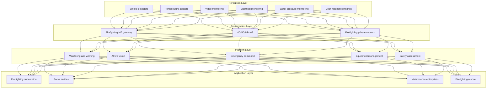
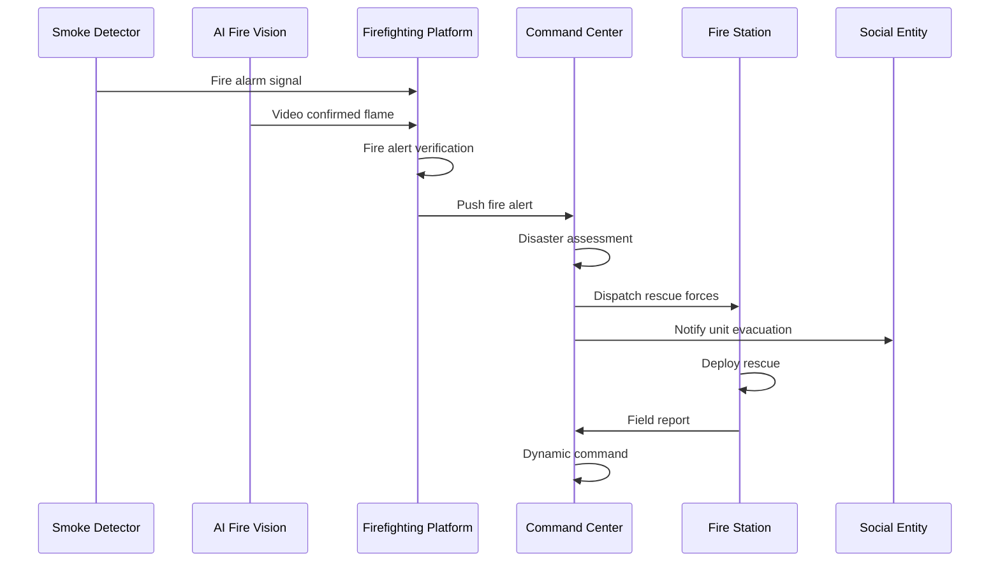
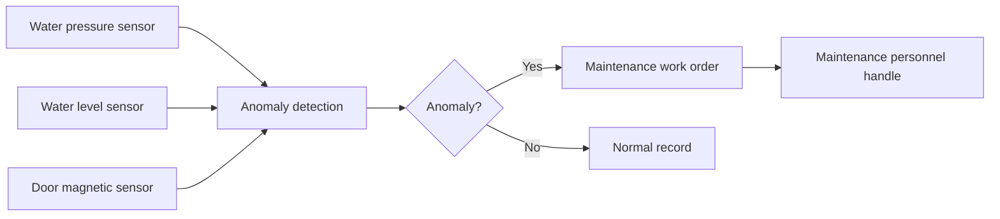

# Smart Firefighting Architecture Design - Alibaba Cloud Perspective

> **Applicable Versions**: Kubernetes v1.29 - v1.33 | **Last Updated**: 2026-04-24
> **Authors**: Alibaba Cloud Solution Architects | **Tags**: `#SmartFirefighting` `#FirefightingIoT` `#EmergencyCommand` `#AlibabCloud`

---

## Table of Contents

1. [Industry Background](#1-industry-background)
2. [Business Architecture](#2-business-architecture)
3. [Technical Architecture](#3-technical-architecture)
4. [Core Data Flows](#4-core-data-flows)
5. [Security and Compliance](#5-security-and-compliance)
6. [Observability](#6-observability)
7. [Alibaba Cloud Component Mapping](#7-alibaba-cloud-component-mapping)
8. [Production Checklist](#8-production-checklist)

---

## 1. Industry Background

### 1.1 Business Characteristics

Smart firefighting realizes fire prevention and emergency rescue intelligence through IoT + AI:

| Challenge | Description | Architecture Impact |
|:---|:---|:---|
| Prevention First | Fire prevention better than fighting | AI prediction + Monitoring |
| Multi-Source Sensing | Smoke/Temperature/Video monitoring | Sensor fusion |
| Emergency Response | Golden 3 minutes for rescue | Automatic alerts + Linkage |
| Complex Environment | High-rise buildings/underground spaces | 3D navigation + Positioning |
| Command Coordination | Multi-department joint operations | Unified command platform |

### 1.2 Core Scenarios

- **Fire Monitoring**: Smoke/temperature/electrical/gas monitoring
- **AI Fire Vision**: Video flame/smoke recognition
- **Emergency Command**: Disaster assessment/force dispatch
- **Firefighting Equipment**: Water pressure/level/door magnetic monitoring
- **Safety Assessment**: Building fire risk assessment

---

## 2. Business Architecture

### 2.1 Smart Firefighting Panoramic Architecture



### 2.2 Fire Emergency Command Sequence



---

## 3. Technical Architecture

### 3.1 K8s Deployment

```yaml
# AI Fire Vision Video Analysis Deployment
apiVersion: apps/v1
kind: Deployment
metadata:
  name: ai-fire-eye
  namespace: smart-firefighting
spec:
  replicas: 3
  selector:
    matchLabels:
      app: ai-fire-eye
  template:
    metadata:
      labels:
        app: ai-fire-eye
    spec:
      nodeSelector:
        accelerator: nvidia-t4
      runtimeClassName: nvidia
      containers:
        - name: fire-eye
          image: registry.cn-hangzhou.aliyuncs.com/fire/ai-fire-eye:v2.0.0-gpu
          ports:
            - containerPort: 8080
          env:
            - name: DETECTION_CLASSES
              value: "flame,smoke"
            - name: ALERT_CONFIDENCE
              value: "0.9"
          resources:
            requests:
              nvidia.com/gpu: 1
              memory: "8Gi"
              cpu: "4000m"
            limits:
              nvidia.com/gpu: 1
              memory: "16Gi"
              cpu: "8000m"
```

---

## 4. Core Data Flows

### 4.1 Firefighting Equipment Status Monitoring



---

## 5. Security and Compliance

- **Life Safety**: Fire prevention zero false negatives
- **Data Security**: Firefighting equipment data confidentiality
- **Grade 3 Cybersecurity**: Firefighting system grade protection

---

## 6. Observability

- **Fire Response**: < 3s
- **Video Recognition**: Accuracy > 98%
- **Equipment Online Rate**: > 98%

---

## 7. Alibaba Cloud Component Mapping

| Functional Domain | **Alibaba Cloud Cloud-Native Solution** |
|:---|:---|
| Container Platform | **ACK Pro + GPU** |
| IoT | **Alibaba Cloud IoT Platform** |
| AI | **PAI / Visual Intelligence** |
| Database | **PolarDB + Lindorm** |
| Object Storage | **OSS** |
| Observability | **ARMS + SLS** |
| Video | **Alibaba Cloud Live Video** |

---

## 8. Production Checklist

- [ ] Smoke detector false alarm rate < 1%
- [ ] AI fire vision recognition accuracy > 98%
- [ ] Firefighting equipment online rate > 98%
- [ ] Emergency command response < 3s
- [ ] Grade 3 cybersecurity compliance audit

---

**Maintainers**: Alibaba Cloud Solution Architect Team | **License**: MIT

---

## Obsidian Related Documents

- topic-application-architecture MOC
- [[domain-20-application-patterns/topic-application-architecture/README.md|Topic Application Layer Architecture Design Best Practices]]
- [[domain-20-application-patterns/topic-application-architecture/01-ecommerce-architecture.md|E-Commerce System Kubernetes Production Architecture Design]]
- [[domain-20-application-patterns/topic-application-architecture/02-mini-program-architecture.md|Mini Program Platform Architecture Design]]
- [[domain-20-application-patterns/topic-application-architecture/03-cms-architecture.md|Content Management System CMS Architecture Design]]
- [[domain-20-application-patterns/topic-application-architecture/04-im-rtc-architecture.md|Real-Time Communication IM/RTC Architecture Design]]
- [[domain-20-application-patterns/topic-application-architecture/05-online-education-architecture.md|Online Education Platform Kubernetes Production Architecture Design]]
- [[domain-20-application-patterns/topic-application-architecture/06-fintech-architecture.md|FinTech Kubernetes Production Architecture Design]]
- [[domain-20-application-patterns/topic-application-architecture/07-iot-platform-architecture.md|IoT Platform Architecture Design]]
- [[domain-20-application-patterns/topic-application-architecture/08-ai-ml-inference-architecture.md|AI/ML Inference Service Kubernetes Production Architecture Design]]
- [[domain-20-application-patterns/topic-application-architecture/09-gaming-backend-architecture.md|Gaming Backend Kubernetes Production Architecture Design]]
- [[domain-20-application-patterns/topic-application-architecture/10-social-media-architecture.md|Social Media Platform Kubernetes Production Architecture Design]]

## See Also

- 71-smart-tax
- 72-digital-twin-city
- 74-immersive-xr
- 75-affective-computing

## Related

- topic-application-architecture MOC — Cross-reference


<!-- risk-assessed -->
