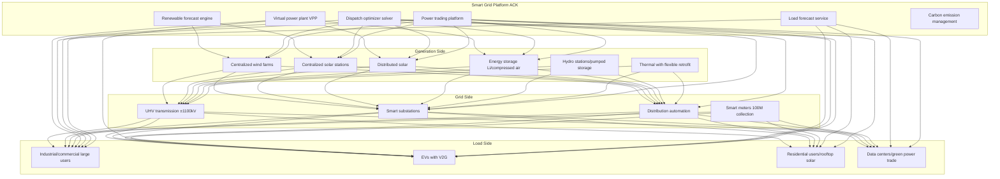
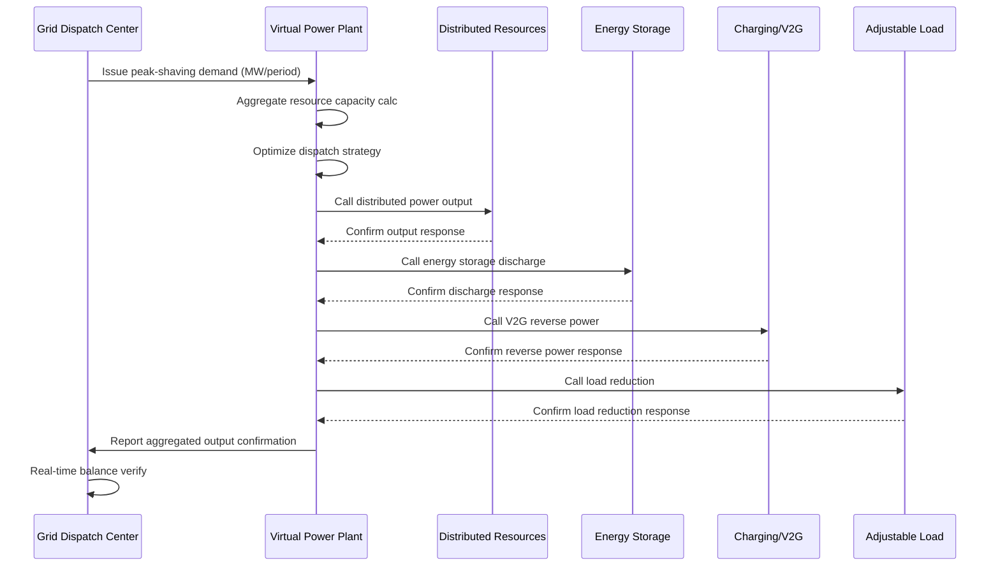
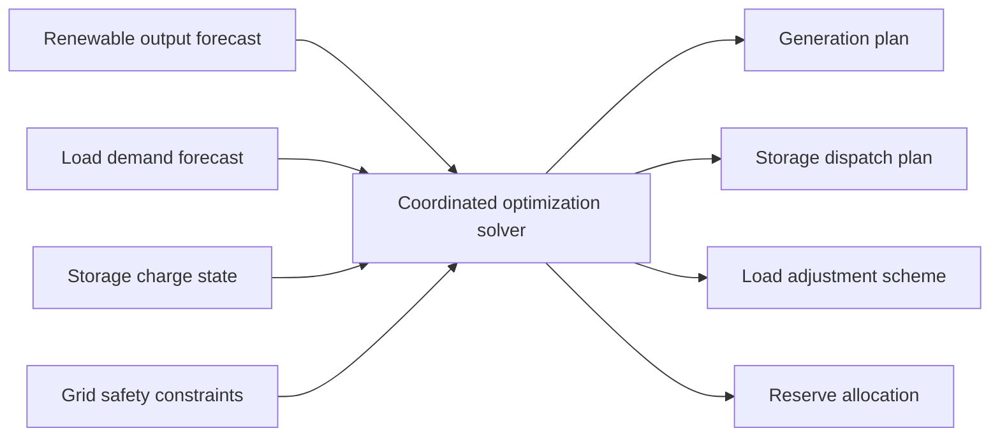
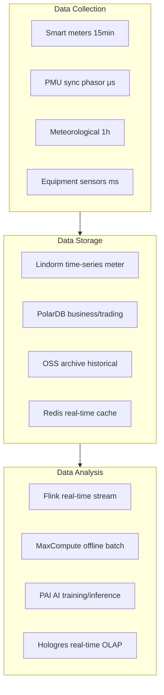

# Smart Grid Architecture Design - Alibaba Cloud Perspective

> **Applicable Versions**: Kubernetes v1.29 - v1.33 | **Last Updated**: 2026-04-24
> **Authors**: Alibaba Cloud Solution Architects | **Tags**: `#SmartGrid` `#VirtualPowerPlant` `#LoadForecast` `#AlibabCloud`

---

## Table of Contents

1. [Industry Overview](#1-industry-overview)
2. [Business Scenarios](#2-business-scenarios)
3. [Architecture Design](#3-architecture-design)
4. [Core Technology Stack](#4-core-technology-stack)
5. [K8s Deployment Plan](#5-k8s-deployment-plan)
6. [Data Architecture](#6-data-architecture)
7. [AI/ML Components](#7-aiml-components)
8. [Security and Compliance](#8-security-and-compliance)
9. [Best Practices](#9-best-practices)
10. [Anti-Patterns](#10-anti-patterns)
11. [Reference Resources](#11-reference-resources)

---

## 1. Industry Overview

## 1.1 Industry Background

Smart grids are core infrastructure for new power systems, achieving source-grid-load-storage coordination. Under "dual carbon" targets, China's power system is undergoing profound transformation from traditional coal-based to renewables-based. By end of 2025, China's wind and solar capacity exceeded 400 million and 600 million kW respectively, with continuous rising proportions. This transformation brings fundamental changes to grid operations: renewable output exhibits intermittency and fluctuation requiring more flexible dispatch; mass distributed power injection demands smarter distribution management; deepening power market reforms require supporting diverse trading products.

Smart grid platform information needs span: renewable power forecasting (short/ultra-short/long-term), virtual power plant (VPP) resource aggregation and dispatch, demand response (DR) management, distribution automation (FA), source-grid-load-storage coordinated optimization, power spot market trading. These needs demand extreme computational resources (AI inference+optimization solving), storage resources (massive time-series meter data), and real-timeliness (millisecond-level protection control).

## 1.2 Industry Challenges

| Challenge | Description | Architecture Impact |
|:---|:---|:---|
| Renewable Fluctuation | Wind/solar intermittent output, large forecast errors | AI prediction + Storage dispatch |
| Load Peak-Valley Gap | High-peak supply-demand contradiction, sharp peaks frequent | Demand response + VPP peak shaving |
| Distributed Access | Mass distributed power sources plug-and-play needs | Edge ACK@Edge + Protocol adaptation |
| Grid Security | Rising network attack risks, state-level threats | Zero-trust architecture + Grade 3 |
| Real-Time Balance | Real-time power balance, frequency stability requirements | Millisecond control + Safety devices |
| Market Trading | Spot market real-time clearing, multi-product parallel | High-concurrency trading engine + Settlement |
| Massive Data | 100-million meter data collection, PB-scale storage | Lindorm time-series DB + Data lake |

## 1.3 Market Structure

China's grid investment continues rising, with "14th Five-Year" total > 3 trillion yuan. State Grid and Southern Power Grid are two major operators serving 26 and 5 provinces respectively. Smart grid construction is grid-operator led, catalyzing tech service providers: traditional power equipment firms (NARI, XJ Electric, State Grid Communications) and cloud vendors (Alibaba Cloud, Huawei Cloud). Virtual power plants, power trading, and integrated energy services attract numerous startups.

---

## 2. Business Scenarios

## 2.1 Renewable Power Forecasting

Wind and solar power forecasting are grid dispatch fundamentals. Short-term (next 72 hours) for day-ahead planning and maintenance; ultra-short-term (next 4 hours, 15-min resolution) for real-time dispatch and AGC; long-term (monthly/annual) for medium/long-term trading. Requires fusing meteorological data (NWP numerical weather), historical power data, equipment status etc., using AI models (LSTM, Transformer, graph neural networks) for high-accuracy forecasting.

## 2.2 Virtual Power Plants (VPP)

VPP aggregates distributed power, storage, adjustable loads as one unit participating in grid dispatch and power markets. Core functions: resource registration, real-time monitoring, aggregation capability assessment, optimized dispatch generation, command execution and tracking, revenue settlement. Coordinating thousands of distributed resources, dispatch instruction response < 100ms.

## 2.3 Demand Response (DR)

Price signals or incentives guide load-side behavior adjustment during grid stress. Scenarios: peak shaving (reduce high-load), valley filling (increase low-load), emergency response (sudden imbalance). Requires real-time load monitoring, quick available capacity calculation, automatic response strategy execution.

## 2.4 Distribution Automation

Quick fault locating, isolating, supply restoration. Core functions: feeder automation (FA) fault location/isolation, distribution self-healing reconstruction, distributed generator islanding detection, distribution state estimation. Millisecond problem detection, second-level isolation/transfer.

## 2.5 Source-Grid-Load-Storage Coordination

Multi-energy complementary optimized dispatch is new power system core operation. Coordinating wind, solar, hydro, thermal, storage, adjustable load with grid safety constraints for economic optimum. Requires large-scale mathematical programming models (MILP), solving in minutes.

---

## 3. Architecture Design

## 3.1 Smart Grid Panoramic Architecture



## 3.2 Virtual Power Plant Dispatch Sequence



## 3.3 Source-Grid-Load-Storage Coordinated Optimization



---

## 4. Core Technology Stack

| Category | Open Source/Platform | Alibaba Cloud Solution | Description |
|:---|:---|:---|:---|
| Power Forecasting | Prophet, N-BEATS, Transformer | PAI Model Training | Wind/solar forecasting |
| Optimization Solving | Pyomo, Gurobi, CPLEX | E-HPC Distributed Solving | MILP dispatch |
| Time-Series DB | InfluxDB, TDengine | Lindorm Time-Series Engine | 100M meter high-frequency |
| Real-Time Compute | Flink, Kafka Streams | Real-Time Flink | Power/load real-time |
| Edge Computing | KubeEdge, OpenYurt | ACK@Edge | Substation/site edge |
| Protocol Adaptation | IEC 61850, IEC 104, Modbus | IoT Platform Protocol Parse | Power device comms |
| Simulation | PSS/E, PowerWorld, OpenDSS | E-HPC Simulation Cluster | Power flow/stability |
| Digital Twin | Unity, Cesium | DataV + 3D Visualization | Full grid panoramic |
| Message Queue | Kafka, Pulsar | RocketMQ | Event-driven/async |
| Database | MySQL, PostgreSQL | PolarDB + OceanBase | Structured business |

---

## 5. K8s Deployment Plan

## 5.1 Renewable Forecast Engine

```yaml
apiVersion: apps/v1
kind: Deployment
metadata:
  name: power-forecast-engine
  namespace: smart-grid
spec:
  replicas: 3
  selector:
    matchLabels:
      app: power-forecast
  template:
    metadata:
      labels:
        app: power-forecast
    spec:
      nodeSelector:
        accelerator: nvidia-t4
      runtimeClassName: nvidia
      affinity:
        podAntiAffinity:
          preferredDuringSchedulingIgnoredDuringExecution:
            - weight: 100
              podAffinityTerm:
                labelSelector:
                  matchLabels:
                    app: power-forecast
                topologyKey: topology.kubernetes.io/zone
      containers:
        - name: forecast
          image: registry.cn-hangzhou.aliyuncs.com/grid/power-forecast:v3.0.0-gpu
          ports:
            - containerPort: 8080
              name: http
            - containerPort: 9090
              name: metrics
          env:
            - name: FORECAST_HORIZON_HOURS
              value: "72"
            - name: FORECAST_RESOLUTION
              value: "15min"
            - name: WEATHER_API_KEY
              valueFrom:
                secretKeyRef:
                  name: weather-api-secret
                  key: key
            - name: LINDORM_URL
              valueFrom:
                secretKeyRef:
                  name: grid-db-secret
                  key: lindorm-url
            - name: MODEL_PATH
              value: "/models/wind-solar-transformer-v3"
          resources:
            requests:
              nvidia.com/gpu: 1
              memory: "8Gi"
              cpu: "4000m"
            limits:
              nvidia.com/gpu: 1
              memory: "16Gi"
              cpu: "8000m"
          volumeMounts:
            - name: model-storage
              mountPath: /models
      volumes:
        - name: model-storage
          persistentVolumeClaim:
            claimName: forecast-model-pvc
```

## 5.2 Edge Controller DaemonSet

```yaml
apiVersion: apps/v1
kind: DaemonSet
metadata:
  name: substation-edge-controller
  namespace: smart-grid
spec:
  selector:
    matchLabels:
      app: substation-edge-controller
  template:
    metadata:
      labels:
        app: substation-edge-controller
    spec:
      hostNetwork: true
      nodeSelector:
        node-type: substation-edge
      tolerations:
        - key: "dedicated"
          operator: "Equal"
          value: "power-grid"
          effect: "NoSchedule"
      containers:
        - name: controller
          image: registry.cn-hangzhou.aliyuncs.com/grid/substation-ctrl:v2.5.0
          securityContext:
            privileged: true
          env:
            - name: IEC61850_SERVER
              value: "192.168.100.1"
            - name: IEC104_SLAVE_ADDR
              value: "192.168.100.2:2404"
            - name: CONTROL_CYCLE_MS
              value: "100"
            - name: CLOUD_SYNC_URL
              value: "https://grid-platform.aliyuncs.com/api/edge/sync"
            - name: EDGE_NODE_ID
              valueFrom:
                fieldRef:
                  fieldPath: spec.nodeName
          resources:
            requests:
              memory: "2Gi"
              cpu: "2000m"
            limits:
              memory: "4Gi"
              cpu: "4000m"
          volumeMounts:
            - name: edge-data
              mountPath: /data
            - name: certs
              mountPath: /etc/certs
              readOnly: true
      volumes:
        - name: edge-data
          hostPath:
            path: /opt/grid/edge-data
            type: DirectoryOrCreate
        - name: certs
          secret:
            secretName: grid-edge-certs
```

## 5.3 VPP Optimizer Service

```yaml
apiVersion: apps/v1
kind: Deployment
metadata:
  name: vpp-optimizer
  namespace: smart-grid
spec:
  replicas: 2
  selector:
    matchLabels:
      app: vpp-optimizer
  template:
    metadata:
      labels:
        app: vpp-optimizer
    spec:
      containers:
        - name: optimizer
          image: registry.cn-hangzhou.aliyuncs.com/grid/vpp-optimizer:v2.0.0
          ports:
            - containerPort: 8080
          env:
            - name: SOLVER_TYPE
              value: "cplex"
            - name: MAX_RESOURCES
              value: "100000"
            - name: OPTIMIZATION_WINDOW_HOURS
              value: "24"
            - name: DB_URL
              valueFrom:
                secretKeyRef:
                  name: grid-db-secret
                  key: polardb-url
          resources:
            requests:
              memory: "16Gi"
              cpu: "8000m"
            limits:
              memory: "32Gi"
              cpu: "16000m"
```

---

## 6. Data Architecture

## 6.1 Data Stratification



## 6.2 Data Storage Strategy

| Data Type | Storage Plan | Retention | Write Frequency | Data Volume |
|:---|:---|:---|:---|:---|
| Meter collection | Lindorm time-series | 3yr hot + 7yr cold | 15min | 100M meters |
| PMU phasor | Lindorm time-series | 1mo hot + 1yr cold | Millisecond | TB/day |
| Weather forecast | PolarDB + OSS | 1 year | 1 hour | GB/day |
| Power trading | PolarDB MySQL | Permanent | Per-second | GB/day |
| Equipment registry | PolarDB MySQL | Permanent | Daily | TB-scale |
| Dispatch logs | OSS + SLS | 10 years | Per-second | TB/month |

---

## 7. AI/ML Components

## 7.1 AI Application Matrix

| AI Scenario | Model/Algorithm | Input Data | Output | Hardware |
|:---|:---|:---|:---|:---|
| Wind power forecast | Transformer + CNN | NWP + History power | 72h power curve | T4 GPU |
| Solar forecast | LSTM + Attention | Irradiance + Cloud map | 72h power curve | T4 GPU |
| Load forecast | Prophet + DeepAR | Historical load + Weather | 96-point curve | CPU |
| VPP resource assessment | Graph neural network | Resource topology + History | Dispatch capacity | CPU |
| Fault diagnosis | CNN + Knowledge graph | Waveform + Alerts | Issue type/location | T4 GPU |
| Line loss analysis | XGBoost + Regression | Measurement data | Line loss rate/anomaly | CPU |
| Voltage violation warn | LSTM anomaly | PMU data | Warning signal | CPU |
| Carbon emission account | Rule engine + ML | Generation + Fuel | Carbon emission | CPU |

---

## 8. Security and Compliance

## 8.1 Security System

| Security Level | Measures | Technical Implementation |
|:---|:---|:---|
| Network Security | Isolate production from admin | Gateway + VLAN + NetworkPolicy |
| Authentication | Unified identity and access | IDaaS + RBAC + MFA |
| Comm Encryption | Power data transmission encrypt | TLS 1.3 + SM2/SM4 national |
| Data Security | Sensitive data mask/encrypt | KMS + Field-level encryption |
| Audit Trail | Operation logs immutable | SLS audit + WORM storage |
| Security Monitor | Network traffic/intrusion detect | Security Center + Situational awareness |

## 8.2 Compliance Framework

- **Power Monitoring System Security Protection**: Security zones, dedicated network, horizontal isolation, vertical auth
- **Grade 2.0 Level 3**: Critical power infrastructure
- **Critical Information Infrastructure Protection Regulations**: Power CII security
- **Power Industry Information Security Grade Protection**: Industry compliance
- **Data Security Law**: Power data classification management

---

## 9. Best Practices

- **Forecast Accuracy Guarantee**: Wind > 85%, solar > 90%, via ensemble and multi-model fusion
- **Dispatch Real-Time Response**: VPP < 100ms end-to-end, using Redis state cache
- **Edge Autonomous Capability**: Edge nodes operate 24h offline, preserving basic control
- **Data Quality Management**: Assess meter quality, auto-identify bad/missing data
- **Elastic Scaling**: Afternoon peak and extreme weather compute flexibility, HPA + warming
- **Digital Twin**: Build grid digital twin, supporting simulation and contingency verification

---

## 10. Anti-Patterns

## 10.1 Ignoring Power Security Zones

Deploying production and admin zones on same network violates power monitoring security rules.

**Solution**: Strictly enforce security zones - production (I/II) and admin (III/IV) physically isolated via gateway. Deploy ACK clusters in different security zones.

## 10.2 Edge Nodes Without Autonomy

Edge fully depends on cloud control; network outage paralyzes substations.

**Solution**: Deploy ACK@Edge with local autonomy. Critical logic executes locally; data auto-syncs when network recovers.

## 10.3 Forecast Models Never Updated

Post-training models age, prediction accuracy continuous decline.

**Solution**: Establish auto-retraining with latest daily data, periodic accuracy evaluation triggering full retraining.

---

## 11. Reference Resources

## 11.1 Alibaba Cloud Component Mapping

| Functional Domain | Alibaba Cloud Cloud-Native Solution | Description |
|:---|:---|:---|
| Container Platform | **ACK Pro + ACK@Edge** | Center+edge cloud-edge synergy |
| AI Platform | **PAI** | Power forecast model training/inference |
| Time-Series DB | **Lindorm** | 100M meter high-frequency storage |
| Real-Time Compute | **Real-Time Flink** | Power/load real-time stream |
| Relational Database | **PolarDB + OceanBase** | Trading/registry business data |
| Object Storage | **OSS + DLF** | Historical archive and data lake |
| IoT Platform | **Alibaba Cloud IoT** | Device access and protocol parse |
| Digital Twin | **DataV + 3D Visualization** | Full grid digital twin |
| Observability | **ARMS + SLS** | Full-chain monitoring and audit |

## 11.2 Production Checklist

- [ ] Renewable forecast model accuracy verify (wind > 85%, solar > 90%)
- [ ] VPP resource aggregation end-to-end test
- [ ] Grid safety stability constraint verification
- [ ] Edge controller real-time < 100ms verify
- [ ] Power monitoring Grade 3 compliance audit
- [ ] Edge node offline autonomy 24h test
- [ ] Data quality management system establish
- [ ] Security zone and gateway isolation verify

---

**Maintainers**: Alibaba Cloud Solution Architect Team | **License**: MIT

---

## Obsidian Related Documents

- topic-application-architecture MOC
- [[domain-20-application-patterns/topic-application-architecture/README.md|Topic Application Layer Architecture Design Best Practices]]
- [[domain-20-application-patterns/topic-application-architecture/01-ecommerce-architecture.md|E-Commerce System Kubernetes Production Architecture Design]]
- [[domain-20-application-patterns/topic-application-architecture/02-mini-program-architecture.md|Mini Program Platform Architecture Design]]
- [[domain-20-application-patterns/topic-application-architecture/03-cms-architecture.md|Content Management System CMS Architecture Design]]
- [[domain-20-application-patterns/topic-application-architecture/04-im-rtc-architecture.md|Real-Time Communication IM/RTC Architecture Design]]
- [[domain-20-application-patterns/topic-application-architecture/05-online-education-architecture.md|Online Education Platform Kubernetes Production Architecture Design]]
- [[domain-20-application-patterns/topic-application-architecture/06-fintech-architecture.md|FinTech Kubernetes Production Architecture Design]]
- [[domain-20-application-patterns/topic-application-architecture/07-iot-platform-architecture.md|IoT Platform Architecture Design]]
- [[domain-20-application-patterns/topic-application-architecture/08-ai-ml-inference-architecture.md|AI/ML Inference Service Kubernetes Production Architecture Design]]
- [[domain-20-application-patterns/topic-application-architecture/09-gaming-backend-architecture.md|Gaming Backend Kubernetes Production Architecture Design]]
- [[domain-20-application-patterns/topic-application-architecture/10-social-media-architecture.md|Social Media Platform Kubernetes Production Architecture Design]]

## See Also

- 59-industrial-internet-platform
- 60-v2x-autonomous-driving
- 62-distributed-energy
- 63-industrial-visual-inspection

## Related

- topic-application-architecture MOC — Cross-reference


<!-- risk-assessed -->
