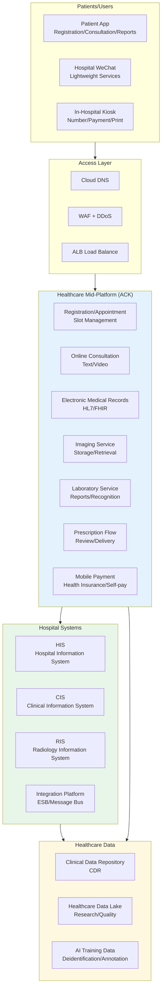
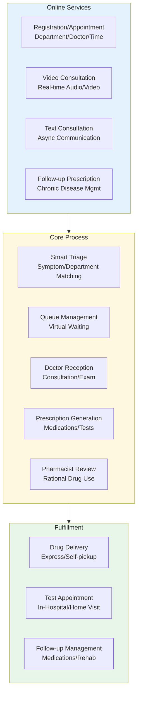
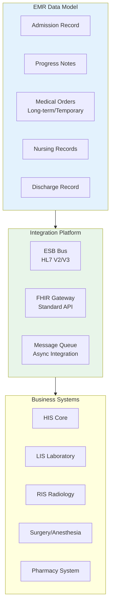
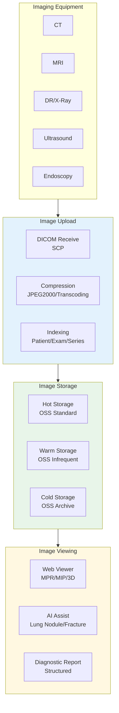
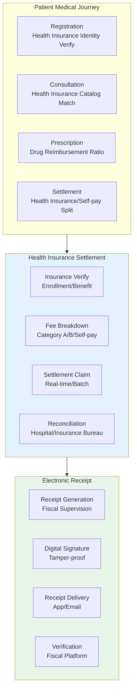
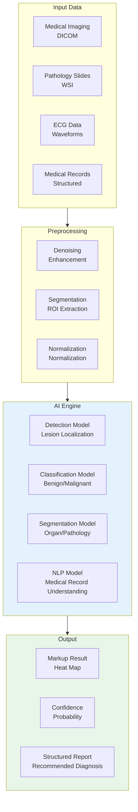
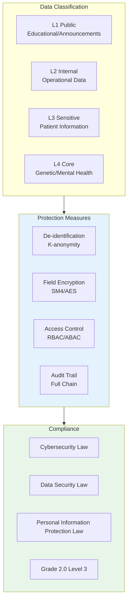

# Smart Healthcare Kubernetes Production Architecture Design

> **Applicable Scenarios**: Internet Hospital / Smart Hospital / Regional Healthcare Platform / Health Insurance Settlement / Medical Imaging AI / Chronic Disease Management  
> **Cloud Vendor**: Alibaba Cloud ACK + Product Suite (Grade 3 / Interoperability Testing)  
> **Applicable Versions**: Kubernetes v1.29 - v1.33  
> **Last Updated**: 2026-04-24  
> **Target Readers**: Healthcare IT Architects, HIS Technical Directors, Alibaba Cloud Solution Architects

---

## Table of Contents

- [One: Overall Architecture Panorama](#one-overall-architecture-panorama)
- [Two: Internet Hospital Architecture](#two-internet-hospital-architecture)
- [Three: HIS/EMR Core System Architecture](#three-hisemr-core-system-architecture)
- [Four: Medical Imaging Cloud (PACS) Architecture](#four-medical-imaging-cloud-pacs-architecture)
- [Five: Health Insurance Settlement and Electronic Receipt Architecture](#five-health-insurance-settlement-and-electronic-receipt-architecture)
- [Six: Healthcare AI Auxiliary Diagnosis Architecture](#six-healthcare-ai-auxiliary-diagnosis-architecture)
- [Seven: Data Security and Privacy Protection Architecture](#seven-data-security-and-privacy-protection-architecture)
- [Eight: ACK Alibaba Cloud Deployment Architecture](#eight-ack-alibaba-cloud-deployment-architecture)

---

## One: Overall Architecture Panorama



## Alibaba Cloud Product Mapping

| Architecture Layer | Alibaba Cloud Solution | Healthcare Compliance |
|:---|:---|:---|
| Container Platform | **ACK Pro** / **ACK Proprietary** | Grade 3 cybersecurity |
| Database | **PolarDB** + **Lindorm** | Data persistence |
| Object Storage | **OSS** (Archive/Infrequent) | Long-term image storage |
| Big Data | **MaxCompute** + **PAI** | Research/AI analysis |
| Security | **Cloud Security Center** + **Operation Audit** | Grade 3/Density evaluation |
| Video | **Alibaba Cloud Live Video** | Remote consultation/Surgery demo |
| IoT | **Alibaba Cloud IoT** | Medical device access |
| Network | **Cloud Enterprise Network CEN** + **Direct Connect** | Hospital-cloud interconnect |

---

## Two: Internet Hospital Architecture



---

## Three: HIS/EMR Core System Architecture



---

## Four: Medical Imaging Cloud (PACS) Architecture



## PACS Image Storage K8s Configuration

```yaml
apiVersion: apps/v1
kind: Deployment
metadata:
  name: dicom-gateway
  namespace: healthcare-pacs
spec:
  replicas: 3
  selector:
    matchLabels:
      app: dicom-gateway
  template:
    metadata:
      labels:
        app: dicom-gateway
    spec:
      containers:
        - name: dicom
          image: registry.cn-hangzhou.aliyuncs.com/healthcare/dicom-gateway:v1.0
          ports:
            - containerPort: 11112
              name: dicom-scp
          env:
            - name: DICOM_AET
              value: "PACS_GATEWAY"
            - name: DICOM_PORT
              value: "11112"
            - name: OSS_BUCKET
              value: "medical-images-hz"
            - name: OSS_ENDPOINT
              value: "oss-cn-hangzhou.aliyuncs.com"
            - name: METADATA_DB_URL
              valueFrom:
                secretKeyRef:
                  name: pacs-db-secret
                  key: url
          resources:
            requests:
              cpu: "1"
              memory: "2Gi"
            limits:
              cpu: "4"
              memory: "8Gi"
          volumeMounts:
            - name: dicom-temp
              mountPath: /tmp/dicom
      volumes:
        - name: dicom-temp
          emptyDir:
            sizeLimit: 100Gi
```

---

## Five: Health Insurance Settlement and Electronic Receipt Architecture



---

## Six: Healthcare AI Auxiliary Diagnosis Architecture



---

## Seven: Data Security and Privacy Protection Architecture



---

## Eight: ACK Alibaba Cloud Deployment Architecture

## Healthcare Grade 3 Cybersecurity Deployment

```yaml
apiVersion: apps/v1
kind: Deployment
metadata:
  name: emr-core-service
  namespace: healthcare-critical
spec:
  replicas: 3
  selector:
    matchLabels:
      app: emr-core
  template:
    metadata:
      labels:
        app: emr-core
        data-classification: L3
    spec:
      serviceAccountName: emr-service-account
      securityContext:
        runAsNonRoot: true
        seccompProfile:
          type: RuntimeDefault
      affinity:
        podAntiAffinity:
          requiredDuringSchedulingIgnoredDuringExecution:
            - labelSelector:
                matchExpressions:
                  - key: app
                    operator: In
                    values:
                      - emr-core
              topologyKey: kubernetes.io/hostname
      containers:
        - name: emr
          image: registry.cn-hangzhou.aliyuncs.com/healthcare/emr-core:v2.0
          securityContext:
            allowPrivilegeEscalation: false
            readOnlyRootFilesystem: true
            runAsUser: 10001
            capabilities:
              drop:
                - ALL
          ports:
            - containerPort: 8443
          env:
            - name: DB_HOST
              valueFrom:
                secretKeyRef:
                  name: emr-db-secret
                  key: host
            - name: FHIR_ENDPOINT
              value: "http://fhir-gateway:8080"
            - name: AUDIT_ENABLED
              value: "true"
          resources:
            requests:
              cpu: "2"
              memory: "4Gi"
            limits:
              cpu: "8"
              memory: "16Gi"
```

---

## Reference Links

- [Alibaba Cloud Healthcare Industry Solutions](https://www.aliyun.com/solution/scenario/healthcare)
- [FHIR Standard](https://www.hl7.org/fhir/)
- [Grade 2.0 Cybersecurity Healthcare](https://www.miit.gov.cn/)

---

## Multi-Cloud Deployment Comparison

## Alibaba Cloud → Multi-Cloud Mapping Table

| Capability Domain | Alibaba Cloud Service | AWS | GCP | Azure |
|:---|:---|:---|:---|:---|
| Container Orchestration | **ACK Pro / Proprietary** | **EKS** | **GKE** | **AKS** |
| Relational Database | **PolarDB** | **Aurora** | **AlloyDB / Cloud SQL** | **Azure Database** |
| Time-Series/Wide-Table | **Lindorm** | **Timestream / DynamoDB** | **Bigtable** | **Cosmos DB** |
| Object Storage (Imaging) | **OSS** | **S3** | **GCS** | **Blob Storage** |
| Big Data Platform | **MaxCompute** | **EMR / Athena** | **BigQuery / Dataproc** | **Synapse Analytics** |
| AI/ML Platform | **PAI** | **SageMaker** | **Vertex AI** | **Azure ML** |
| Security Center | **Cloud Security Center** | **Security Hub / GuardDuty** | **Security Command Center** | **Microsoft Defender** |
| Operation Audit | **Operation Audit (ActionTrail)** | **CloudTrail** | **Cloud Audit Logs** | **Activity Log** |
| Video Service | **Alibaba Cloud Live Video** | **IVS / Chime** | **Live Stream API** | **Azure Communication** |
| IoT Platform | **Alibaba Cloud IoT** | **IoT Core** | **Cloud IoT Core** | **IoT Hub** |
| Enterprise Network | **Cloud Enterprise Network CEN** | **Transit Gateway** | **Cloud Interconnect** | **Virtual WAN** |
| Direct Connect | **Direct Connect** | **Direct Connect** | **Dedicated Interconnect** | **ExpressRoute** |
| Load Balance | **ALB** | **ALB** | **Cloud Load Balancing** | **App Gateway** |
| DNS | **Cloud DNS** | **Route 53** | **Cloud DNS** | **Azure DNS** |
| Video Transcoding | **Media Processing** | **Elemental MediaConvert** | **Transcoder API** | **Media Services** |
| Logging | **SLS** | **CloudWatch Logs** | **Cloud Logging** | **Log Analytics** |

## Multi-Cloud Deployment Considerations

1. **Healthcare Compliance (Grade 3/HIPAA)**: Different cloud vendors' healthcare compliance scope varies. In China focus on Grade 3 and interoperability testing; overseas on HIPAA BAA. Multi-cloud deployment requires each cloud independent compliance.
2. **Imaging Data Storage**: PACS imaging PB-scale per hospital, high cross-cloud migration cost. Recommend main cloud imaging storage, expose via S3-compatible API to cross-cloud apps. Cold data uses each cloud's archive (S3 Glacier / OSS Archive).
3. **Data Privacy and De-identification**: Healthcare data is sensitive, cross-cloud transmission must meet Data Security Law and Personal Information Protection Law requirements. Recommend data stays in-Region, only deidentified metadata synced.
4. **IoT Device Access**: Medical devices (CT/MRI) usually DICOM protocol-based, unrelated to cloud IoT platforms. Multi-cloud deployment use standard DICOM SCP rather than cloud-specific SDK.
5. **AI Model Deployment**: Medical AI (lung nodule detection) use ONNX format, avoid single cloud binding. KServe / Triton support multi-cloud deployment.
6. **Health Insurance Settlement**: Usually direct dedicated line to insurance bureau, vendor-independent. Multi-cloud deployment ensure settlement chain on main cloud, avoid cross-cloud calls increasing latency and risk.

## Cloud-Neutral Solutions (Open Source Alternatives)

| Capability Domain | Open Source Solution | Description |
|:---|:---|:---|
| Container Orchestration | **Kubernetes** (Native) | Managed or self-hosted both viable |
| Object Storage | **MinIO** | S3-compatible, suitable for DICOM imaging |
| DICOM Gateway | **Orthanc** / **dcm4che** | Open DICOM server, K8s deployment proven |
| FHIR Gateway | **HAPI FHIR** | Open FHIR R4 server |
| Database | **PostgreSQL** (Operator) | Supports FHIR resource storage |
| Big Data | **Apache Spark** (K8s Operator) | MaxCompute alternative |
| AI Inference | **KServe** / **Triton** | ONNX models, vendor-neutral |
| Video Communication | **Jitsi** / **LiveKit** | Open real-time audio/video |
| IoT | **EMQX** (K8s Deployment) | Open MQTT Broker, cloud-agnostic |
| Networking | **Cilium** (Cluster Mesh) | Cross-cluster / cross-cloud policies |
| Observability | **Prometheus** + **Grafana** + **Loki** + **Jaeger** | Full-stack open-source |
| Security Scanning | **Trivy** + **Falco** | Image scanning + runtime security |
| Image Registry | **Harbor** | Suitable for healthcare private deployment |

---

## Obsidian Related Documents

- topic-application-architecture MOC
- [[domain-20-application-patterns/topic-application-architecture/README.md|Topic Application Layer Architecture Design Best Practices]]
- [[domain-20-application-patterns/topic-application-architecture/01-ecommerce-architecture.md|E-Commerce System Kubernetes Production Architecture Design]]
- [[domain-20-application-patterns/topic-application-architecture/02-mini-program-architecture.md|Mini Program Platform Architecture Design]]
- [[domain-20-application-patterns/topic-application-architecture/03-cms-architecture.md|Content Management System CMS Architecture Design]]
- [[domain-20-application-patterns/topic-application-architecture/04-im-rtc-architecture.md|Real-Time Communication IM/RTC Architecture Design]]
- [[domain-20-application-patterns/topic-application-architecture/05-online-education-architecture.md|Online Education Platform Kubernetes Production Architecture Design]]
- [[domain-20-application-patterns/topic-application-architecture/06-fintech-architecture.md|FinTech Kubernetes Production Architecture Design]]
- [[domain-20-application-patterns/topic-application-architecture/07-iot-platform-architecture.md|IoT Platform Architecture Design]]
- [[domain-20-application-patterns/topic-application-architecture/08-ai-ml-inference-architecture.md|AI/ML Inference Service Kubernetes Production Architecture Design]]
- [[domain-20-application-patterns/topic-application-architecture/09-gaming-backend-architecture.md|Gaming Backend Kubernetes Production Architecture Design]]
- [[domain-20-application-patterns/topic-application-architecture/10-social-media-architecture.md|Social Media Platform Kubernetes Production Architecture Design]]

## See Also

- 12-smart-logistics-architecture
- 13-digital-government-architecture
- 15-energy-power-architecture
- 16-video-shortform-architecture


<!-- risk-assessed -->
