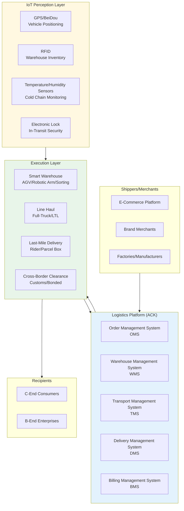
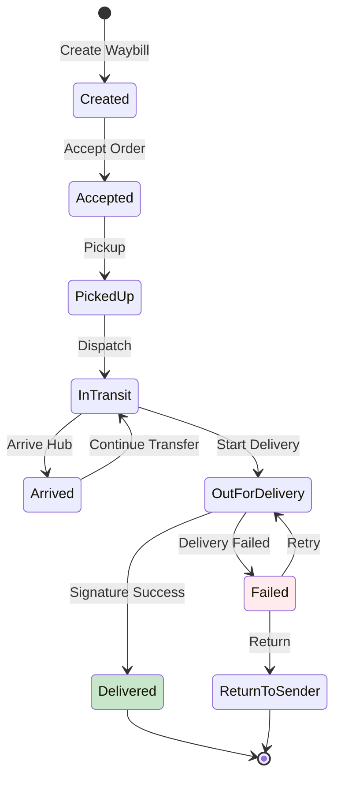
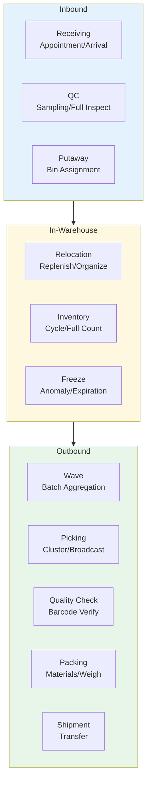
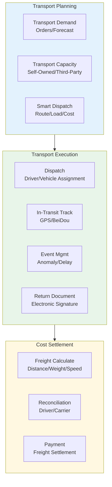
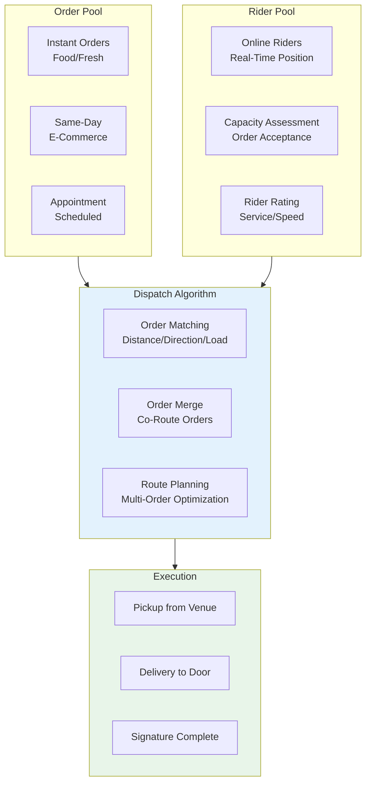
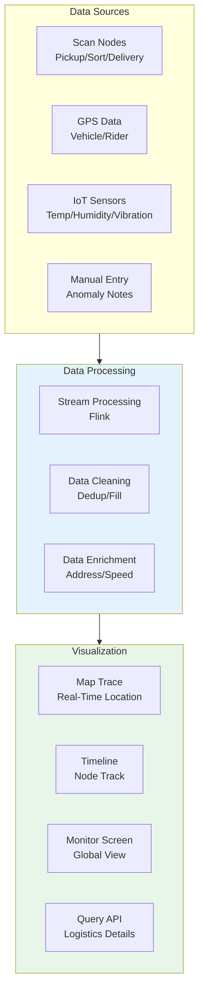
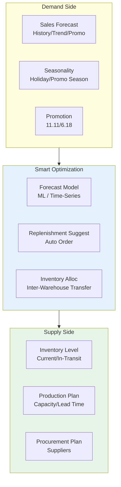
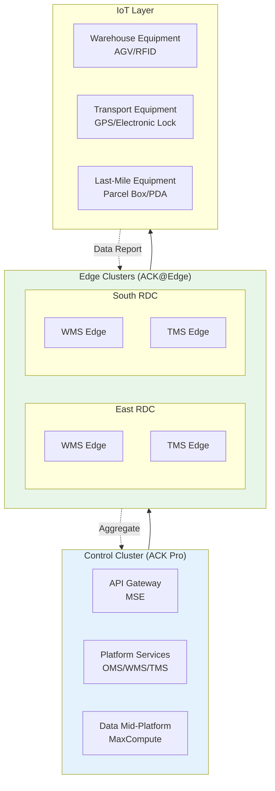

# Smart Logistics and Supply Chain Kubernetes Production Architecture Design

> **Applicable Scenarios**: Express/Logistics / Warehouse-Distribution Integration / Cold Chain Logistics / Cross-Border Logistics / Same-Day Delivery / Supply Chain Coordination  
> **Cloud Vendor**: Alibaba Cloud ACK + Product Suite  
> **Applicable Versions**: Kubernetes v1.29 - v1.33  
> **Last Updated**: 2026-04-24  
> **Target Readers**: Logistics Industry Architects, Supply Chain Technology Directors, Alibaba Cloud Solution Architects

---

## Table of Contents

- [One: Overall Architecture Panorama](#one-overall-architecture-panorama)
- [Two: Order Fulfillment Full-Chain Architecture](#two-order-fulfillment-full-chain-architecture)
- [Three: Warehouse Management (WMS) Architecture](#three-warehouse-management-wms-architecture)
- [Four: Transport Management (TMS) and Route Optimization](#four-transport-management-tms-and-route-optimization)
- [Five: Last-Mile Delivery and Rider Dispatch Architecture](#five-last-mile-delivery-and-rider-dispatch-architecture)
- [Six: Logistics Tracking and Visualization Architecture](#six-logistics-tracking-and-visualization-architecture)
- [Seven: Supply Chain Coordination and Forecast Architecture](#seven-supply-chain-coordination-and-forecast-architecture)
- [Eight: ACK Alibaba Cloud Deployment Architecture](#eight-ack-alibaba-cloud-deployment-architecture)

---

## One: Overall Architecture Panorama



## Alibaba Cloud Product Mapping

| Architecture Layer | Alibaba Cloud Solution | Description |
|:---|:---|:---|
| Container Platform | **ACK Pro** + **ACK@Edge** | Center dispatch + Warehouse/site edge nodes |
| API Gateway | **MSE Cloud-Native Gateway** / **API Gateway** | Open platform to shipper system integration |
| Database | **PolarDB-X** (Distributed) / **Lindorm** | Massive waybill/trajectory data |
| Cache | **Cloud Database Redis Enterprise (Tair)** | Route/state/session |
| Message Queue | **RocketMQ 5.0** | Async decoupling/event-driven |
| Big Data | **MaxCompute** + **Real-Time Flink** | Route optimization/forecasting |
| Map Service | **Alibaba Cloud Maps** / **Amap** | Route planning/geofencing |
| IoT Platform | **Alibaba Cloud IoT Platform** | Device access/rule engine |
| Monitoring | **ARMS** + **SLS** | Full-chain tracing |

---

## Two: Order Fulfillment Full-Chain Architecture

```mermaid
flowchart LR
    subgraph Step1["① Receiving Order"]
        RECEIVE["Receive Order<br/>E-Commerce/OMS"]
        SPLIT["Order Split<br/>Sub-orders/Parcels"]
    end

    subgraph Step2["② Warehouse"]
        ALLOCATE["Inventory Allocation<br/>Nearest/Cost/Speed"]
        PICK["Picking<br/>Wave/Route"]
        PACK["Packing<br/>Weigh/Label"]
        HANDOVER["Warehouse Transfer"]
    end

    subgraph Step3["③ Transport"]
        COLLECT["Pickup<br/>Site/On-demand"]
        SORT["Sorting Hub<br/>Auto Sort"]
        LINEHAUL["Line Haul<br/>Full/Air"]
        DELIVERY_STATION["Hub Arrive"]
    end

    subgraph Step4["④ Last-Mile"]
        DISPATCH["Dispatch<br/>Rider/Courier Assignment"]
        OUT_DELIVERY["Out for Delivery"]
        SIGN["Signature<br/>Personal/Proxy/Parcel Box"]
    end

    Step1 --> Step2 --> Step3 --> Step4

    style Step1 fill:#e3f2fd
    style Step2 fill:#e8f5e9
    style Step3 fill:#fff8e1
    style Step4 fill:#ffccbc
```



## Fulfillment State Machine



---

## Three: Warehouse Management (WMS) Architecture



## Smart Warehouse K8s Edge Deployment

```yaml
apiVersion: apps/v1
kind: Deployment
metadata:
  name: wms-edge-controller
  namespace: logistics-edge
spec:
  replicas: 1
  selector:
    matchLabels:
      app: wms-edge-controller
  template:
    metadata:
      labels:
        app: wms-edge-controller
    spec:
      nodeName: edge-warehouse-hangzhou-001
      containers:
        - name: wms
          image: registry.cn-hangzhou.aliyuncs.com/logistics/wms-edge:v1.5
          ports:
            - containerPort: 8080
          env:
            - name: WAREHOUSE_ID
              value: "HZ-RDC-001"
            - name: AGV_CONTROLLER_ENDPOINT
              value: "http://agv-controller.local:5000"
            - name: CONVEYOR_CONTROLLER_ENDPOINT
              value: "http://conveyor.local:5001"
            - name: CLOUD_SYNC_MODE
              value: "realtime"
          resources:
            requests:
              cpu: "1"
              memory: "2Gi"
            limits:
              cpu: "4"
              memory: "8Gi"
          volumeMounts:
            - name: warehouse-data
              mountPath: /data
      volumes:
        - name: warehouse-data
          hostPath:
            path: /opt/wms/data
            type: DirectoryOrCreate
```

---

## Four: Transport Management (TMS) and Route Optimization



---

## Five: Last-Mile Delivery and Rider Dispatch Architecture



---

## Six: Logistics Tracking and Visualization Architecture



---

## Seven: Supply Chain Coordination and Forecast Architecture



---

## Eight: ACK Alibaba Cloud Deployment Architecture

## Logistics Platform ACK Multi-Cluster Architecture



## Logistics Trajectory Data Lindorm Configuration

```yaml
# Lindorm Time-Series Table (Logistics Trajectory)
# Suitable for massive GPS/scan event storage
apiVersion: v1
kind: ConfigMap
metadata:
  name: lindorm-schema
  namespace: logistics-data
data:
  trajectory.sql: |
    CREATE TABLE logistics_trajectory (
      waybill_id VARCHAR,
      event_time TIMESTAMP,
      event_type VARCHAR,
      location_geo POINT,
      warehouse_code VARCHAR,
      operator_id VARCHAR,
      device_id VARCHAR,
      status VARCHAR,
      PRIMARY KEY (waybill_id, event_time)
    )
    WITH (
      TTL = '90d',
      COMPRESSION = 'ZSTD'
    );
---
# Trajectory Query Service
apiVersion: apps/v1
kind: Deployment
metadata:
  name: trajectory-query-service
  namespace: logistics-data
spec:
  replicas: 5
  selector:
    matchLabels:
      app: trajectory-query
  template:
    metadata:
      labels:
        app: trajectory-query
    spec:
      containers:
        - name: query
          image: registry.cn-hangzhou.aliyuncs.com/logistics/trajectory-query:v1.0
          env:
            - name: LINDORM_URL
              valueFrom:
                secretKeyRef:
                  name: lindorm-credentials
                  key: url
            - name: CACHE_REDIS
              value: "r-bp1xxxxxxxxx.redis.rds.aliyuncs.com:6379"
          resources:
            requests:
              cpu: "1"
              memory: "2Gi"
            limits:
              cpu: "4"
              memory: "8Gi"
```

---

## Reference Links

- [Alibaba Cloud Logistics Industry Solutions](https://www.aliyun.com/solution/scenario/logistics)
- [Alibaba Cloud IoT Platform](https://www.aliyun.com/product/iot)
- [Alibaba Cloud Lindorm](https://www.aliyun.com/product/lindorm)
- [Alibaba Cloud PolarDB-X](https://www.aliyun.com/product/drds)

---

## Obsidian Related Documents

- topic-application-architecture MOC
- [[domain-20-application-patterns/topic-application-architecture/README.md|Topic Application Layer Architecture Design Best Practices]]
- [[domain-20-application-patterns/topic-application-architecture/01-ecommerce-architecture.md|E-Commerce System Kubernetes Production Architecture Design]]
- [[domain-20-application-patterns/topic-application-architecture/02-mini-program-architecture.md|Mini Program Platform Architecture Design]]
- [[domain-20-application-patterns/topic-application-architecture/03-cms-architecture.md|Content Management System CMS Architecture Design]]
- [[domain-20-application-patterns/topic-application-architecture/04-im-rtc-architecture.md|Real-Time Communication IM/RTC Architecture Design]]
- [[domain-20-application-patterns/topic-application-architecture/05-online-education-architecture.md|Online Education Platform Kubernetes Production Architecture Design]]
- [[domain-20-application-patterns/topic-application-architecture/06-fintech-architecture.md|FinTech Kubernetes Production Architecture Design]]
- [[domain-20-application-patterns/topic-application-architecture/07-iot-platform-architecture.md|IoT Platform Architecture Design]]
- [[domain-20-application-patterns/topic-application-architecture/08-ai-ml-inference-architecture.md|AI/ML Inference Service Kubernetes Production Architecture Design]]
- [[domain-20-application-patterns/topic-application-architecture/09-gaming-backend-architecture.md|Gaming Backend Kubernetes Production Architecture Design]]
- [[domain-20-application-patterns/topic-application-architecture/10-social-media-architecture.md|Social Media Platform Kubernetes Production Architecture Design]]

## See Also

- 10-social-media-architecture
- 11-smart-retail-architecture
- 13-digital-government-architecture
- 14-smart-healthcare-architecture


<!-- risk-assessed -->
