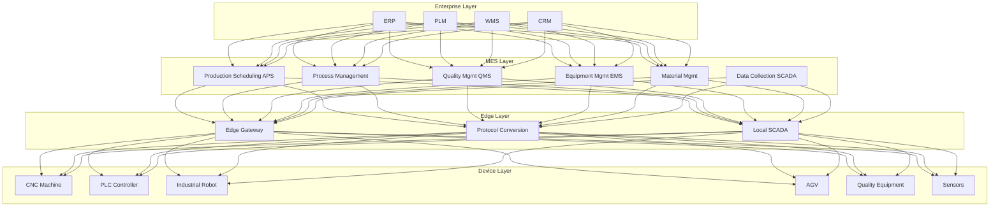
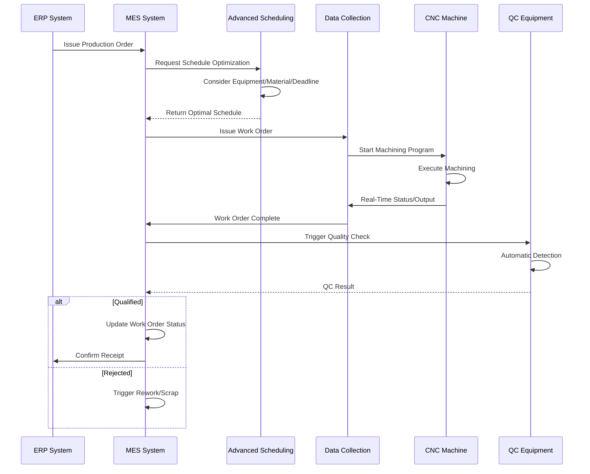
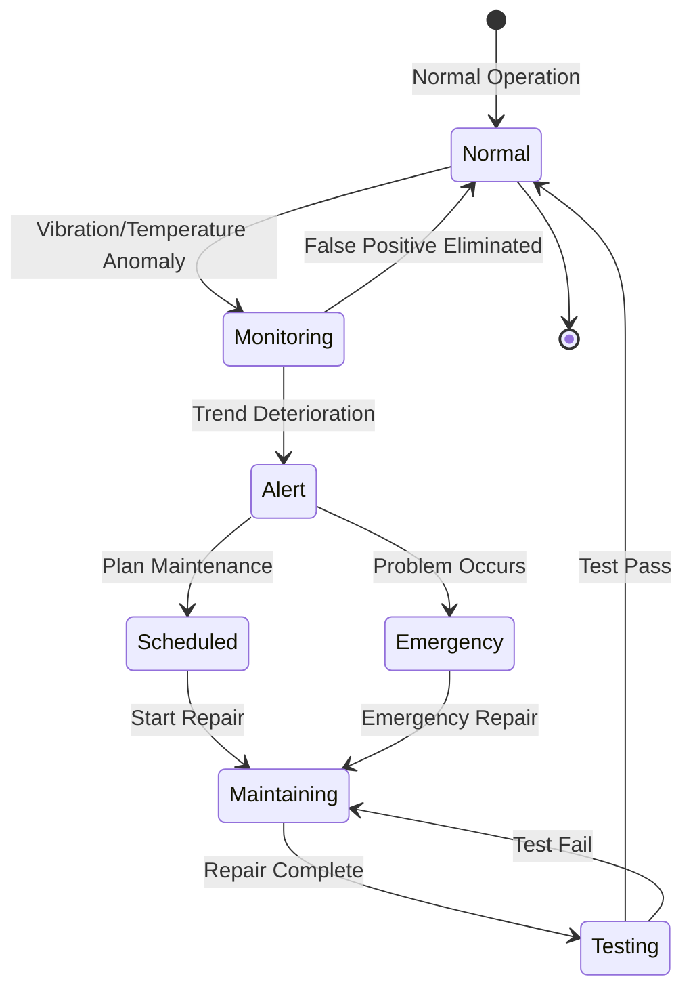
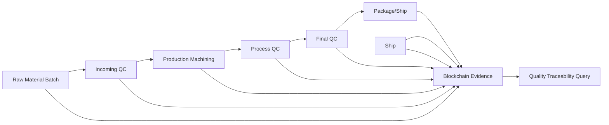
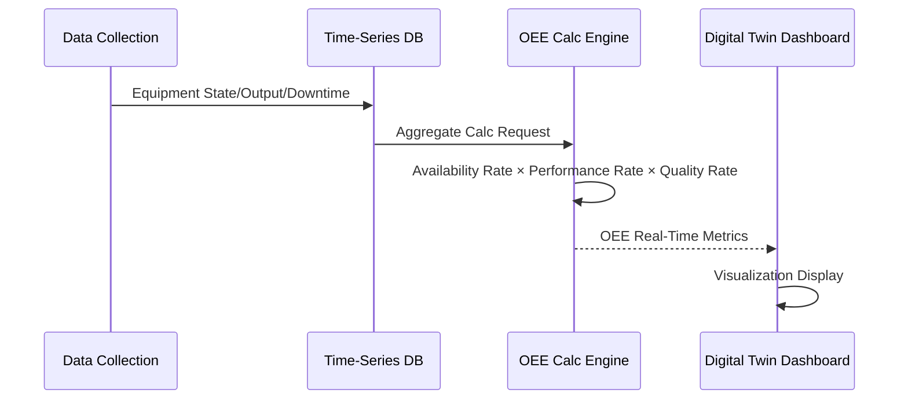

# Smart Manufacturing MES Architecture Design - Alibaba Cloud Perspective

> **Applicable Versions**: Kubernetes v1.29 - v1.33 | **Last Updated**: 2026-04-24
> **Authors**: Alibaba Cloud Solution Architects | **Tags**: `#SmartManufacturing` `#MES` `#Industry40` `#AlibabCloud`

---

## Table of Contents

1. [Industry Background](#1-industry-background)
2. [Business Architecture](#2-business-architecture)
3. [Technical Architecture](#3-technical-architecture)
4. [Core Data Flows](#4-core-data-flows)
5. [Security and Compliance](#5-security-and-compliance)
6. [Observability](#6-observability)
7. [Alibaba Cloud Component Mapping](#7-alibaba-cloud-component-mapping)
8. [Production Checklist](#8-production-checklist)

---

## 1. Industry Background

### 1.1 Business Characteristics

Manufacturing Execution System (MES) is the core of smart manufacturing, connecting planning and device layers:

| Challenge | Description | Architecture Impact |
|:---|:---|:---|
| Production Line Real-Time | Millisecond device data collection | Edge computing + Time-series DB |
| Multi-Product Small Batch | Flexible production frequent switching | Dynamic scheduling + Digital twin |
| Quality Traceability | Full lifecycle quality data | Blockchain evidence |
| Device Interconnection | CNC/PLC/Robot protocols vary | Protocol gateway + OPC UA |
| OEE Optimization | Equipment efficiency improvement | Real-time analysis + AI prediction |

### 1.2 Core Scenarios

- **Production Scheduling**: Intelligent scheduling based on orders/materials/equipment
- **Process Management**: Process digitization and version control
- **Quality Control**: SPC statistical control/defect traceability
- **Equipment Management**: Predictive maintenance/problem alerts
- **Material Traceability**: Batch/serial number full-chain tracking

---

## 2. Business Architecture

### 2.1 Smart Manufacturing MES Panoramic Architecture



### 2.2 Work Order Execution Sequence



### 2.3 Equipment Predictive Maintenance State Machine



---

## 3. Technical Architecture

### 3.1 K8s Deployment

```yaml
# MES Core Service Deployment
apiVersion: apps/v1
kind: Deployment
metadata:
  name: mes-core
  namespace: smart-manufacturing
spec:
  replicas: 5
  selector:
    matchLabels:
      app: mes-core
  template:
    metadata:
      labels:
        app: mes-core
    spec:
      affinity:
        podAntiAffinity:
          requiredDuringSchedulingIgnoredDuringExecution:
            - labelSelector:
                matchExpressions:
                  - key: app
                    operator: In
                    values: [mes-core]
              topologyKey: topology.kubernetes.io/zone
      containers:
        - name: mes
          image: registry.cn-hangzhou.aliyuncs.com/mfg/mes-core:v6.0.0
          ports:
            - containerPort: 8080
          env:
            - name: DATABASE_URL
              value: "polardb-mfg.rds.aliyuncs.com"
            - name: SCADA_GATEWAY_URL
              value: "http://scada-gateway:8080"
            - name: WORK_SHIFT_MODE
              value: "three-shift"
          resources:
            requests:
              memory: "4Gi"
              cpu: "2000m"
            limits:
              memory: "8Gi"
              cpu: "4000m"
          livenessProbe:
            httpGet:
              path: /health
              port: 8080
            initialDelaySeconds: 60
            periodSeconds: 15
```

```yaml
# Edge Data Collection DaemonSet
apiVersion: apps/v1
kind: DaemonSet
metadata:
  name: edge-scada-collector
  namespace: smart-manufacturing
spec:
  selector:
    matchLabels:
      app: edge-scada-collector
  template:
    metadata:
      labels:
        app: edge-scada-collector
    spec:
      hostNetwork: true
      nodeSelector:
        node-type: factory-edge
      tolerations:
        - key: "dedicated"
          operator: "Equal"
          value: "factory"
          effect: "NoSchedule"
      containers:
        - name: collector
          image: registry.cn-hangzhou.aliyuncs.com/mfg/scada-collector:v3.2.0
          securityContext:
            privileged: true
          env:
            - name: OPC_UA_ENDPOINT
              value: "opc.tcp://plc-gateway:4840"
            - name: MODBUS_TCP_HOST
              value: "192.168.1.100"
            - name: COLLECTION_INTERVAL_MS
              value: "100"
          resources:
            requests:
              memory: "1Gi"
              cpu: "1000m"
            limits:
              memory: "2Gi"
              cpu: "2000m"
          volumeMounts:
            - name: device-config
              mountPath: /etc/scada/devices
      volumes:
        - name: device-config
          configMap:
            name: scada-device-config
```

```yaml
# AI Quality Inspection GPU Deployment
apiVersion: apps/v1
kind: Deployment
metadata:
  name: ai-quality-inspection
  namespace: smart-manufacturing
spec:
  replicas: 2
  selector:
    matchLabels:
      app: ai-quality-inspection
  template:
    metadata:
      labels:
        app: ai-quality-inspection
    spec:
      nodeSelector:
        accelerator: nvidia-t4
      runtimeClassName: nvidia
      containers:
        - name: inspector
          image: registry.cn-hangzhou.aliyuncs.com/mfg/ai-inspection:v2.1.0-gpu
          ports:
            - containerPort: 8080
          env:
            - name: INSPECTION_MODEL
              value: "defect-detection-v3"
            - name: CONFIDENCE_THRESHOLD
              value: "0.92"
          resources:
            requests:
              nvidia.com/gpu: 1
              memory: "8Gi"
              cpu: "4000m"
            limits:
              nvidia.com/gpu: 1
              memory: "16Gi"
              cpu: "8000m"
          volumeMounts:
            - name: model-volume
              mountPath: /models
      volumes:
        - name: model-volume
          persistentVolumeClaim:
            claimName: ai-inspection-model-pvc
```

---

## 4. Core Data Flows

### 4.1 Full-Chain Quality Traceability



### 4.2 OEE Real-Time Calculation



---

## 5. Security and Compliance

### 5.1 Industrial Safety System

| Level | Measures | K8s Implementation |
|:---|:---|:---|
| Network Security | Industrial Control Network Isolation | NetworkPolicy Industrial Isolation |
| Data Security | Production Data Transmission Encrypt | TLS + mTLS |
| Access Control | Operator Permission Grading | RBAC + Namespace Isolation |
| Audit Trail | Critical Operations Immutable | Audit Logs + Blockchain |

---

## 6. Observability

- **Data Collection Latency**: < 100ms
- **MES Response Time**: P99 < 500ms
- **Equipment Online Rate**: > 99.5%
- **OEE Real-Time Update**: < 5s

---

## 7. Alibaba Cloud Component Mapping

| Functional Domain | Self-Build/Open Source | **Alibaba Cloud Cloud-Native Solution** | Selection Rationale |
|:---|:---|:---|:---|
| Container Platform | Self-Built K8s | **ACK Pro + ACK Edge** | Cloud-Edge Unified Mgmt |
| Time-Series DB | InfluxDB/TDengine | **Lindorm Time-Series Engine** | PB-scale Industrial Time-Series |
| Relational DB | MySQL/Oracle | **PolarDB MySQL** | High-Concurrency Transactions |
| Message Queue | Kafka | **RocketMQ** | High-Reliability Device Messages |
| AI Quality | Self-Developed Models | **PAI / Visual Intelligence** | Industrial Defect Detection |
| Digital Twin | Unity/UE Self-Built | **DataV + Alibaba Cloud Digital Twin** | 3D Production Line Visualization |
| IoT Platform | Self-Built Gateway | **Alibaba Cloud IoT Platform** | Multi-Protocol Device Access |
| Object Storage | MinIO | **OSS** | QC Image Long-Term Storage |
| Blockchain | Self-Built Chain | **Ant Chain BaaS** | Quality Data Evidence Storage |
| Observability | Prometheus + Grafana | **ARMS + SLS** | Industrial KPI Monitoring |

---

## 8. Production Checklist

### 8.1 Pre-Deployment Verification

- [ ] OPC UA/Modbus Device Protocol Compatibility Verify
- [ ] Edge Gateway Offline Autonomy Test (Disconnect 24h)
- [ ] Time-Series DB Write Performance Stress Test (1M point/sec)
- [ ] AI QC Model Accuracy > 95%
- [ ] MES to ERP/WMS Interface Integration Pass
- [ ] Industrial Control Network and Enterprise Network Security Isolation Verify
- [ ] Digital Twin 3D Model and Physical Production Line Sync Delay < 1s
- [ ] Grade 3 Cybersecurity/Industrial Control Security Compliance Audit

### 8.2 Daily Operations

- [ ] Every Day: OEE Metrics, Equipment Problem Rate, Quality Pass Rate
- [ ] Every Week: Predictive Maintenance Model Accuracy Evaluation
- [ ] Every Month: Capacity Utilization Analysis, Bottleneck Optimization
- [ ] Every Quarter: Security Vulnerability Scan, Disaster Recovery Drill

---

**Maintainers**: Alibaba Cloud Solution Architect Team | **License**: MIT

---

## Obsidian Related Documents

- topic-application-architecture MOC
- [[domain-20-application-patterns/topic-application-architecture/README.md|Topic Application Layer Architecture Design Best Practices]]
- [[domain-20-application-patterns/topic-application-architecture/01-ecommerce-architecture.md|E-Commerce System Kubernetes Production Architecture Design]]
- [[domain-20-application-patterns/topic-application-architecture/02-mini-program-architecture.md|Mini Program Platform Architecture Design]]
- [[domain-20-application-patterns/topic-application-architecture/03-cms-architecture.md|Content Management System CMS Architecture Design]]
- [[domain-20-application-patterns/topic-application-architecture/04-im-rtc-architecture.md|Real-Time Communication IM/RTC Architecture Design]]
- [[domain-20-application-patterns/topic-application-architecture/05-online-education-architecture.md|Online Education Platform Kubernetes Production Architecture Design]]
- [[domain-20-application-patterns/topic-application-architecture/06-fintech-architecture.md|FinTech Kubernetes Production Architecture Design]]
- [[domain-20-application-patterns/topic-application-architecture/07-iot-platform-architecture.md|IoT Platform Architecture Design]]
- [[domain-20-application-patterns/topic-application-architecture/08-ai-ml-inference-architecture.md|AI/ML Inference Service Kubernetes Production Architecture Design]]
- [[domain-20-application-patterns/topic-application-architecture/09-gaming-backend-architecture.md|Gaming Backend Kubernetes Production Architecture Design]]
- [[domain-20-application-patterns/topic-application-architecture/10-social-media-architecture.md|Social Media Platform Kubernetes Production Architecture Design]]

## See Also

- 49-livestream-ecommerce
- 50-unmanned-retail
- 52-smart-water
- 53-new-retail-dtc

## Related

- topic-application-architecture MOC — Cross-reference


<!-- risk-assessed -->
