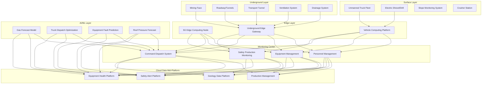
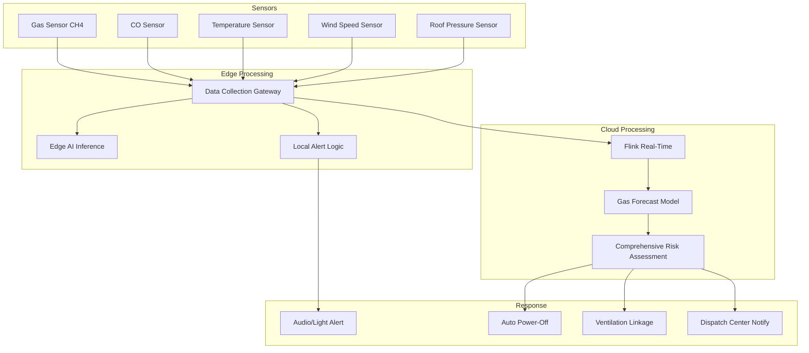

# Smart Mining Architecture Design - Alibaba Cloud Perspective

> **Applicable Versions**: Kubernetes v1.29 - v1.33 | **Last Updated**: 2026-04-24
> **Authors**: Alibaba Cloud Solution Architects | **Tags**: `#SmartMining` `#UnmannedTruck` `#SafetyMonitoring` `#AlibabCloud`

---

## Table of Contents

1. [Industry Overview](#1-industry-overview)
2. [Business Scenarios](#2-business-scenarios)
3. [Architecture Design](#3-architecture-design)
4. [Core Technology Stack](#4-core-technology-stack)
5. [Kubernetes Deployment Plan](#5-kubernetes-deployment-plan)
6. [Data Architecture](#6-data-architecture)
7. [AI/ML Components](#7-aiml-components)
8. [Security and Compliance](#8-security-and-compliance)
9. [Best Practices](#9-best-practices)
10. [Anti-Patterns](#10-anti-patterns)
11. [Reference Resources](#11-reference-resources)

---

## 1. Industry Overview

## 1.1 Market Size and Trends

Smart mining realizes safe, efficient, and green mining through 5G, AI, IoT, and autonomous driving technologies. China has 4700+ coal mines and tens of thousands of metal mines. Smart mining market expected to grow from 80 billion yuan in 2024 to 250 billion yuan by 2030. Policy drivers include "Guidance on Accelerating Coal Mine Intelligence Development", "Non-Coal Mining Safety Supervision Regulations", etc. Unmanned trucks, intelligent mining, and AI safety monitoring are three core directions.

| Metric | 2024 | 2026 (Projected) | 2030 (Projected) |
|:---|:---|:---|:---|
| China Smart Mining Market | ¥80B | ¥150B | ¥250B |
| Intelligent Coal Mine Coverage | 20% | 40% | 80% |
| Unmanned Truck Deployment | 500+ | 2000+ | 10000+ |
| Gas Monitoring Delay | 5s | 2s | 0.5s |
| Underground Personnel Positioning Accuracy | 1m | 0.3m | 0.1m |

## 1.2 Industry Pain Points

| Pain Point | Description | Digital Transformation Driver |
|:---|:---|:---|
| High Safety Risk | Gas explosion/water inrush/roof fall/fire | AI real-time monitoring + Multi-level alerts |
| Harsh Environment | Underground high-temp high-humidity dust | Industrial-grade equipment + Edge computing |
| Network Coverage Hard | Underground/remote mine weak network | 5G private network + Mesh + Satellite |
| Equipment Dispersed | Many mining/transport/ventilation devices | Unified IoT platform management |
| Strict Regulation | High safety production law requirements | Data traceability + Audit tracking |
| Talent Shortage | Miner aging, youth unwilling underground | Automation + Remote control |

## 1.3 Digital Transformation Architecture Impact

Smart mining architecture covers underground layer (coal face/roadway/transport/ventilation), surface layer (unmanned trucks/electric shovels/drills/slope), monitoring center (safety production/command/equipment/personnel), and data mid-platform (geology/equipment/safety/production). Core challenge is underground harsh environment communication and computing, plus zero-tolerance safety monitoring.

---

## 2. Business Scenarios

## 2.1 Open-Pit Unmanned Transport

Unmanned trucks operate 24/7 in open pit completing full-auto loading from shovel to crusher. Requires high-precision maps, RTK positioning, multi-sensor fusion (LiDAR/camera/radar), V2X communication, central dispatch. Single truck daily capacity 20% increase, 70% labor cost reduction.

## 2.2 Intelligent Shearer Faces

Shearer, hydraulic supports, scrapers three-machine coordination automation. Auto-adjust shearer parameters per geology model, supports auto-follow. Requires full face sensing, real-time control, and remote monitoring.

## 2.3 AI Safety Monitoring Alert

Real-time multi-parameter monitoring: gas concentration, roof pressure, water level, temperature, CO. AI analyzes history and trends, alerting 30+ minutes before incident. Supports graded alerts and auto-linkage (gas exceed auto power-off).

## 2.4 Underground Personnel Precise Positioning

UWB + 5G fusion positioning achieves centimeter-level accuracy underground. Supports e-attendance, zone management, emergency evacuation guidance, personnel rescue. Fast location during mining accidents.

## 2.5 Video AI Violation Recognition

Deploy AI cameras in key areas auto-identifying unhelmed, hazard zone entry, equipment anomaly, real-time dispatch center alert.

---

## 3. Architecture Design

## 3.1 Smart Mining Panoramic Architecture



---

## 4. Core Technology Stack

| Component | Purpose | Technology | License |
|:---|:---|:---|:---|
| Container Orchestration | Edge + Cloud management | ACK Edge + ACK Pro | Proprietary |
| 5G Private Network | Underground connectivity | 5G Private Network | Proprietary |
| UWB Positioning | Precision indoor tracking | UWB DW1000 | Proprietary |
| Autonomous Driving | Unmanned truck navigation | Apollo / Self-Developed | Apache 2.0 / Proprietary |
| IoT Platform | Sensor management | Alibaba Cloud IoT Platform | Proprietary |
| Edge Computing | On-site AI inference | NVIDIA Jetson / ACK Edge | Proprietary |
| AI Vision | Safety violation detection | PAI + Visual Intelligence | Proprietary |
| Time-Series DB | Sensor data storage | Lindorm TSDB | Proprietary |
| Relational DB | Business data | PolarDB MySQL | Proprietary |
| Message Queue | Event streaming | RocketMQ 5.x | Apache 2.0 |
| Object Storage | Video & geological data | OSS | Proprietary |
| Monitoring | Observability | ARMS + SLS | Proprietary |
| GIS | Geological modeling | Alibaba Cloud GIS | Proprietary |

---

## 5. Kubernetes Deployment Plan

## 5.1 Safety Monitoring Edge DaemonSet

```yaml
apiVersion: apps/v1
kind: DaemonSet
metadata:
  name: safety-monitor-edge
  namespace: smart-mining
  labels:
    app: safety-monitor-edge
    tier: edge
spec:
  selector:
    matchLabels:
      app: safety-monitor-edge
  updateStrategy:
    rollingUpdate:
      maxUnavailable: 1
  template:
    metadata:
      labels:
        app: safety-monitor-edge
        tier: edge
      annotations:
        prometheus.io/scrape: "true"
        prometheus.io/port: "9090"
    spec:
      hostNetwork: true
      nodeSelector:
        node-type: mining-edge
      tolerations:
        - key: "dedicated"
          operator: "Equal"
          value: "mining"
          effect: "NoSchedule"
        - key: "environment"
          operator: "Equal"
          value: "underground"
          effect: "NoSchedule"
      containers:
        - name: monitor
          image: registry.cn-hangzhou.aliyuncs.com/mining/safety-monitor:v3.0.0
          ports:
            - containerPort: 8080
              name: http
            - containerPort: 9090
              name: metrics
          env:
            - name: MINE_ID
              valueFrom:
                configMapKeyRef:
                  name: mining-config
                  key: mine-id
            - name: GAS_THRESHOLD_PPM
              value: "1000"
            - name: ALERT_MODE
              value: "multi-level"
            - name: LOCAL_CACHE_HOURS
              value: "72"
            - name: CLOUD_SYNC_ENABLED
              value: "true"
          resources:
            requests:
              memory: "1Gi"
              cpu: "1000m"
            limits:
              memory: "2Gi"
              cpu: "2000m"
          readinessProbe:
            httpGet:
              path: /health/ready
              port: 8080
            initialDelaySeconds: 10
            periodSeconds: 5
          livenessProbe:
            httpGet:
              path: /health/live
              port: 8080
            initialDelaySeconds: 20
            periodSeconds: 10
          volumeMounts:
            - name: local-data
              mountPath: /data/local
      volumes:
        - name: local-data
          hostPath:
            path: /opt/mining/data
            type: DirectoryOrCreate
```

## 5.2 Truck Dispatch Service Deployment

```yaml
apiVersion: apps/v1
kind: Deployment
metadata:
  name: truck-dispatcher
  namespace: smart-mining
spec:
  replicas: 3
  selector:
    matchLabels:
      app: truck-dispatcher
  template:
    metadata:
      labels:
        app: truck-dispatcher
    spec:
      containers:
        - name: dispatcher
          image: registry.cn-hangzhou.aliyuncs.com/mining/truck-dispatcher:v2.0.0
          ports:
            - containerPort: 8080
          env:
            - name: MAX_TRUCKS
              value: "50"
            - name: OPTIMIZATION_TARGET
              value: "throughput"
            - name: V2X_ENABLED
              value: "true"
          resources:
            requests:
              memory: "4Gi"
              cpu: "2000m"
            limits:
              memory: "8Gi"
              cpu: "4000m"
```

## 5.3 ConfigMap, Service and Secret

```yaml
apiVersion: v1
kind: ConfigMap
metadata:
  name: mining-config
  namespace: smart-mining
data:
  mine-id: "MINE-HB-001"
  safety-thresholds: |
    {
      "gas_ch4_ppm": {"warning": 500, "critical": 1000, "action": "power_off"},
      "co_ppm": {"warning": 24, "critical": 50},
      "temperature_c": {"warning": 30, "critical": 35},
      "roof_pressure_mpa": {"warning": 15, "critical": 20},
      "water_level_m": {"warning": 0.5, "critical": 1.0}
    }
  truck-routes: |
    {
      "loading_points": ["shovel-A", "shovel-B", "shovel-C"],
      "dumping_points": ["crusher-N", "crusher-S", "waste-dump"],
      "speed_limit_kmh": 30,
      "min_spacing_m": 50
    }
  evacuation-zones: |
    [
      {"id": "surface-safe-zone", "capacity": 5000},
      {"id": "underground-refuge-A", "capacity": 200}
    ]
---
apiVersion: v1
kind: Service
metadata:
  name: safety-monitor
  namespace: smart-mining
spec:
  selector:
    app: safety-monitor-edge
  ports:
    - name: http
      port: 8080
      targetPort: 8080
  type: ClusterIP
---
apiVersion: v1
kind: Secret
metadata:
  name: mining-secrets
  namespace: smart-mining
type: Opaque
stringData:
  db-connection: "mysql://mining@polardb.mining.rds.aliyuncs.com:3306/mining_db"
  v2x-security-key: "v2x-encryption-key-placeholder"
  video-storage-key: "oss-encryption-key"
```

---

## 6. Data Architecture

## 6.1 Gas Monitoring Alert Data Flow



---

## 7. AI/ML Components

## 7.1 Core Models

| Model | Purpose | Input | Output | Framework |
|:---|:---|:---|:---|:---|
| Gas Forecast | Gas trend prediction | History gas/ventilation/geology | Next 30min concentration | LSTM |
| Truck Dispatch Opt | Transport route/schedule | Vehicle state/loading/road | Optimal dispatch plan | OR-Tools + RL |
| Equipment Fault Predict | Predictive maintenance | Vibration/temp/current time-series | Issue probability + RUL | Transformer |
| Roof Pressure Forecast | Impact ground pressure | Stress/microseism/acoustic | Impact hazard level | XGBoost |
| Violation Detection | Safety violation auto ID | Video frame | Violation type + Screenshot | YOLOv8 |
| Personnel Behavior | Abnormal underground behavior | Position trajectory | Anomaly mark | LSTM-AE |

---

## 8. Security and Compliance

## 8.1 Regulatory Framework and Standards

| Regulation/Standard | Scope | Architecture Requirements |
|:---|:---|:---|
| Coal Mine Safety Rules | Coal safety production | Safety monitoring system compliance |
| Coal Mine Intelligence Guidelines | Smart mine standards | Intelligence system grading |
| AQ Standards | Coal safety industry standards | Safety data retention |
| Grade 3 Cybersecurity | Industrial control security | Network isolation + Audit |
| Mining Safety Law | Mining law requirements | Safety facility three-sync |
| Metal Mine Safety Rules | Non-coal mine safety | Safety monitoring system |

## 8.2 Security Architecture Key Points

- **OT/IT Isolation**: Mining control network and office network fully isolated
- **Local Priority**: Critical safety monitoring runs edge independently, no cloud dependency
- **Offline Capable**: Underground network interrupt, edge systems continue, local cache data
- **Data Traceability**: Safety monitoring data retention 3+ months for accident investigation
- **Redundant Communication**: Underground 5G + Industrial ring + Satellite multi-link redundancy

---

## 9. Best Practices

1. **Edge-First Architecture**: Safety monitoring and alerts complete at edge, no cloud dependency
2. **Local 72-Hour Cache**: Edge devices cache 72 hours data, offline no loss
3. **Multi-Level Alert Linkage**: Level-1 edge audio → Level-2 dispatch → Level-3 auto power-off
4. **5G Private Network**: Underground 5G coverage supporting bandwidth (video) and low-latency (remote)
5. **UWB + 5G Fusion**: UWB precision, 5G coverage, fusion full-mine precise positioning
6. **Gas Exceed Auto Power-Off**: Auto disconnect non-intrinsically-safe device power
7. **Unmanned Fleet Management**: Minimum safety spacing 50m, V2V prevent collision
8. **Regular Emergency Drills**: Quarterly full-mine evacuation drill, system reliability verify
9. **Equipment Predictive Maintenance**: AI analyze vibration/temperature trends, early alert
10. **Data Quality Monitoring**: Continuous sensor quality check, failed sensors prompt replacement

---

## 10. Anti-Patterns

1. **Safety Monitoring Cloud Dependent**: Critical safety judgment depends on cloud, network issue loses alert. Should edge run independently
2. **Single Communication Link**: Only one link, problem means disconnection. Should multi-link redundancy
3. **Ignoring Offline**: System design ignores offline, data lost unrecoverable. Should local persistent cache
4. **Insufficient Sensor Maintenance**: Gas sensor calibration infrequent, data corrupt miss alarms. Should auto periodic calibration
5. **Over-Automation**: Fully auto-dependent, ignore human safety awareness and emergency judgment. Should human-machine coordination

---

## 11. Reference Resources

- [Coal Mine Intelligence Guidelines](https://www.nea.gov.cn/)
- [Coal Mine Safety Rules](https://www.mem.gov.cn/)
- [5G+Smart Mining White Paper](https://www.imt-2020.cn/)
- [NVIDIA MineSmart](https://www.nvidia.com/en-us/industries/mining/)
- [UWB Positioning DW1000](https://www.qorvo.com/products/d/dw1000)
- [Alibaba Cloud ACK Edge Documentation](https://help.aliyun.com/product/146232.html)
- [Alibaba Cloud IoT Platform Documentation](https://help.aliyun.com/product/30520.html)

---

**Maintainers**: Alibaba Cloud Solution Architect Team | **License**: MIT

---

## Obsidian Related Documents

- topic-application-architecture MOC
- [[domain-20-application-patterns/topic-application-architecture/README.md|Topic Application Layer Architecture Design Best Practices]]
- [[domain-20-application-patterns/topic-application-architecture/01-ecommerce-architecture.md|E-Commerce System Kubernetes Production Architecture Design]]
- [[domain-20-application-patterns/topic-application-architecture/02-mini-program-architecture.md|Mini Program Platform Architecture Design]]
- [[domain-20-application-patterns/topic-application-architecture/03-cms-architecture.md|Content Management System CMS Architecture Design]]
- [[domain-20-application-patterns/topic-application-architecture/04-im-rtc-architecture.md|Real-Time Communication IM/RTC Architecture Design]]
- [[domain-20-application-patterns/topic-application-architecture/05-online-education-architecture.md|Online Education Platform Kubernetes Production Architecture Design]]
- [[domain-20-application-patterns/topic-application-architecture/06-fintech-architecture.md|FinTech Kubernetes Production Architecture Design]]
- [[domain-20-application-patterns/topic-application-architecture/07-iot-platform-architecture.md|IoT Platform Architecture Design]]
- [[domain-20-application-patterns/topic-application-architecture/08-ai-ml-inference-architecture.md|AI/ML Inference Service Kubernetes Production Architecture Design]]
- [[domain-20-application-patterns/topic-application-architecture/09-gaming-backend-architecture.md|Gaming Backend Kubernetes Production Architecture Design]]
- [[domain-20-application-patterns/topic-application-architecture/10-social-media-architecture.md|Social Media Platform Kubernetes Production Architecture Design]]

## See Also

- 45-smart-port-shipping
- 46-satellite-internet
- 48-vocational-edtech
- 49-livestream-ecommerce


<!-- risk-assessed -->
