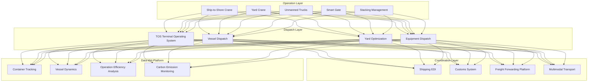
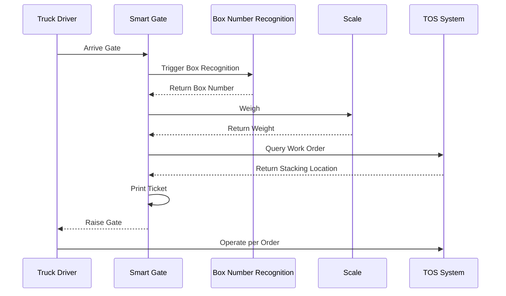
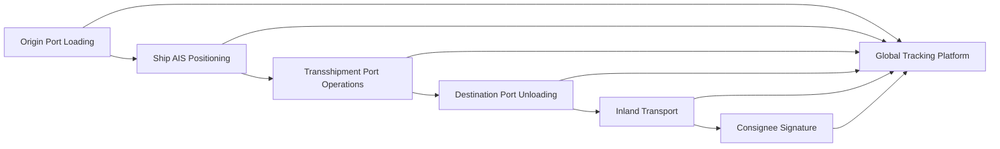

# Smart Port and Shipping Architecture Design - Alibaba Cloud Perspective

> **Applicable Versions**: Kubernetes v1.29 - v1.33 | **Last Updated**: 2026-04-24
> **Authors**: Alibaba Cloud Solution Architects | **Tags**: `#SmartPort` `#Shipping` `#Containers` `#AlibabCloud`

---

## Table of Contents

1. [Industry Background](#1-industry-background)
2. [Business Architecture](#2-business-architecture)
3. [Technical Architecture](#3-technical-architecture)
4. [Core Data Flows](#4-core-data-flows)
5. [Security and Compliance](#5-security-and-compliance)
6. [Observability](#6-observability)
7. [Alibaba Cloud Component Mapping](#7-alibaba-cloud-component-mapping)
8. [Production Checklist](#8-production-checklist)

---

## 1. Industry Background

### 1.1 Business Characteristics

Smart ports are shipping logistics hubs involving container management, vessel dispatch, customs clearance:

| Challenge | Description | Architecture Impact |
|:---|:---|:---|
| Multi-System Coordination | TOS/Customs/Shipping/Freight Forwarding | Data Exchange Platform |
| Automation Operations | Ship-to-shore/Yard/Unmanned Trucks | IoT + Edge Computing |
| Global Tracking | Container global position tracking | GPS + Satellite Communication |
| Customs Compliance | Import/Export Declaration/Inspection | E-Port Integration |
| Environmental Monitoring | Port Carbon/Noise | Environmental IoT |

### 1.2 Core Scenarios

- **Container Management**: Box position/status/flow full tracking
- **Vessel Dispatch**: Berth/Operations/Departure schedule optimization
- **Unmanned Operations**: Crane remote control/unmanned trucks
- **Customs Clearance**: Advance declaration/smart review/frictionless
- **Multimodal Transport**: Rail-Ocean/Sea-Land connections

---

## 2. Business Architecture

### 2.1 Smart Port Panoramic Architecture



### 2.2 Container Gate Entry/Exit Sequence



---

## 3. Technical Architecture

### 3.1 K8s Deployment

```yaml
# TOS Core Service Deployment
apiVersion: apps/v1
kind: Deployment
metadata:
  name: tos-core
  namespace: smart-port
spec:
  replicas: 5
  selector:
    matchLabels:
      app: tos-core
  template:
    metadata:
      labels:
        app: tos-core
    spec:
      containers:
        - name: tos
          image: registry.cn-hangzhou.aliyuncs.com/port/tos-core:v4.0.0
          ports:
            - containerPort: 8080
          env:
            - name: YARD_OPTIMIZATION
              value: "enabled"
            - name: VESSEL_SCHEDULE_API
              value: "http://vessel-schedule:8080"
          resources:
            requests:
              memory: "4Gi"
              cpu: "2000m"
            limits:
              memory: "8Gi"
              cpu: "4000m"
```

```yaml
# Edge Node Unmanned Truck Control DaemonSet
apiVersion: apps/v1
kind: DaemonSet
metadata:
  name: agv-controller
  namespace: smart-port
spec:
  selector:
    matchLabels:
      app: agv-controller
  template:
    metadata:
      labels:
        app: agv-controller
    spec:
      hostNetwork: true
      nodeSelector:
        node-type: edge-port
      containers:
        - name: controller
          image: registry.cn-hangzhou.aliyuncs.com/port/agv-controller:v2.0.0
          resources:
            requests:
              memory: "1Gi"
              cpu: "1000m"
```

---

## 4. Core Data Flows

### 4.1 Container Global Tracking



---

## 5. Security and Compliance

- **Operation Safety**: Port worker safety monitoring
- **Customs Compliance**: Accurate import/export data declaration
- **Network Security**: Port critical infrastructure protection

---

## 6. Observability

- **Gate Throughput**: < 30s
- **Crane Efficiency**: > 35 boxes/hour
- **System Availability**: 99.9%

---

## 7. Alibaba Cloud Component Mapping

| Functional Domain | **Alibaba Cloud Cloud-Native Solution** |
|:---|:---|
| Container Platform | **ACK Pro + ACK Edge** |
| IoT | **Alibaba Cloud IoT Platform** |
| Database | **PolarDB + Lindorm** |
| Real-Time Compute | **Flink** |
| AI | **PAI / Visual Intelligence** |
| Object Storage | **OSS** |
| Observability | **ARMS + SLS** |
| Digital Twin | **DataV** |

---

## 8. Production Checklist

- [ ] Gate Automation Recognition Accuracy > 99%
- [ ] Unmanned Truck Safety Testing
- [ ] Customs EDI Integration Verify
- [ ] Container Tracking Data Completeness
- [ ] Port Critical Infrastructure Grade Protection

---

**Maintainers**: Alibaba Cloud Solution Architect Team | **License**: MIT

---

## Obsidian Related Documents

- topic-application-architecture MOC
- [[domain-20-application-patterns/topic-application-architecture/README.md|Topic Application Layer Architecture Design Best Practices]]
- [[domain-20-application-patterns/topic-application-architecture/01-ecommerce-architecture.md|E-Commerce System Kubernetes Production Architecture Design]]
- [[domain-20-application-patterns/topic-application-architecture/02-mini-program-architecture.md|Mini Program Platform Architecture Design]]
- [[domain-20-application-patterns/topic-application-architecture/03-cms-architecture.md|Content Management System CMS Architecture Design]]
- [[domain-20-application-patterns/topic-application-architecture/04-im-rtc-architecture.md|Real-Time Communication IM/RTC Architecture Design]]
- [[domain-20-application-patterns/topic-application-architecture/05-online-education-architecture.md|Online Education Platform Kubernetes Production Architecture Design]]
- [[domain-20-application-patterns/topic-application-architecture/06-fintech-architecture.md|FinTech Kubernetes Production Architecture Design]]
- [[domain-20-application-patterns/topic-application-architecture/07-iot-platform-architecture.md|IoT Platform Architecture Design]]
- [[domain-20-application-patterns/topic-application-architecture/08-ai-ml-inference-architecture.md|AI/ML Inference Service Kubernetes Production Architecture Design]]
- [[domain-20-application-patterns/topic-application-architecture/09-gaming-backend-architecture.md|Gaming Backend Kubernetes Production Architecture Design]]
- [[domain-20-application-patterns/topic-application-architecture/10-social-media-architecture.md|Social Media Platform Kubernetes Production Architecture Design]]

## See Also

- 43-enterprise-im
- 44-martech-adtech
- 46-satellite-internet
- 47-smart-mining

## Related

- topic-application-architecture MOC — Cross-reference


<!-- risk-assessed -->
