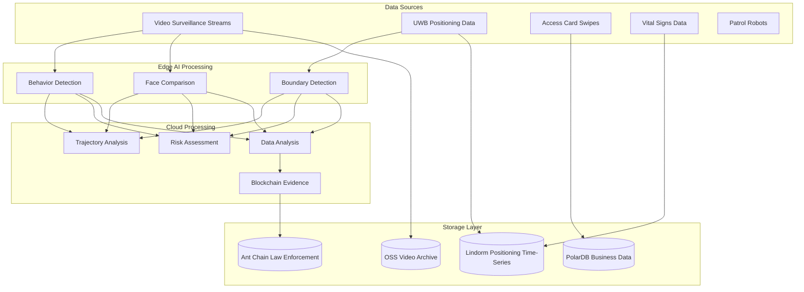

# Smart Prison Architecture Design - Alibaba Cloud Perspective

> **Applicable Versions**: Kubernetes v1.29 - v1.33 | **Last Updated**: 2026-04-24
> **Authors**: Alibaba Cloud Solution Architects | **Tags**: `#SmartPrison` `#JudicialCorrections` `#AIMonitoring` `#SmartSafeguards` `#AlibabCloud`

---

## Table of Contents

1. [Industry Overview](#1-industry-overview)
2. [Business Scenarios](#2-business-scenarios)
3. [Architecture Design](#3-architecture-design)
4. [Core Technology Stack](#4-core-technology-stack)
5. [Kubernetes Deployment Plan](#5-kubernetes-deployment-plan)
6. [Data Architecture](#6-data-architecture)
7. [AI/ML Components](#7-aiml-components)
8. [Security and Compliance](#8-security-and-compliance)
9. [Best Practices](#9-best-practices)
10. [Anti-Patterns](#10-anti-patterns)
11. [Reference Resources](#11-reference-resources)

---

## 1. Industry Overview

## 1.1 Market Size and Trends

Smart prisons digitally transform judicial systems, improving safeguarding and prisoner rehabilitation through AI, IoT, and big data. China has 680+ prisons. Smart prison market expected to grow from 12 billion yuan in 2024 to 30 billion yuan by 2028. Policy drivers include "Smart Prison Technical Specifications" (SF/T 0028-2021), "Prison Informatization Standards", etc.

| Metric | 2024 | 2026 (Projected) | 2028 (Projected) |
|:---|:---|:---|:---|
| Smart Prison Coverage | 30% | 55% | 80% |
| Single Prison Investment | 500-1000M | 800-1500M | 1000-2000M |
| AI Behavior Recognition Accuracy | 85% | 92% | 96% |
| UWB Positioning Accuracy | 0.5m | 0.3m | 0.1m |
| Robot Patrol Coverage | 10% | 30% | 60% |

## 1.2 Industry Pain Points

| Pain Point | Description | Digital Transformation Driver |
|:---|:---|:---|
| Safeguarding | Prevent escape/riot/suicide/violations | AI video + Full-spectrum smart sensing |
| Personnel Mgmt | Prisoner behavior/psychology assessment | AI behavior + Psychology evaluation |
| Law Enforcement | Sentence reduction/commutation transparency | Blockchain evidence + Smart assessment |
| Rehabilitation | Insufficient personalized reform plans | AI recommend course + Skill training |
| Medical Care | Emergency response slow | Remote medicine + IoT vital monitoring |
| System Silos | Sub-systems data disconnected | Data mid-platform + Unified dispatch |

## 1.3 Digital Transformation Architecture Impact

Smart prison systems span perception (video/positioning/access/perimeter/vitals), intelligence (behavior/trajectory/risk/face recognition), application (safeguarding/law enforcement/rehabilitation/living), and decision (command/risk assessment/data analysis) layers. Requires strict physical isolation, Grade 3 compliance, and multi-level data security.

---

## 2. Business Scenarios

## 2.1 Smart Video Monitoring and Behavior Analysis

Deploy thousands of cameras covering prison areas, cellblocks, workshops, yards, cafeterias. AI real-time analyzes fights, climbing, gathering, suicide attempts, contraband passing. System detects anomalies within 3 seconds triggering graded alerts.

**Core Flow**: Video Stream → Human Detection → Posture Estimation → Behavior Classification → Risk Scoring → Graded Alert → Dispatch

## 2.2 Personnel Precise Positioning and Trajectory Tracking

UWB + Bluetooth fusion achieves centimeter-level real-time positioning for incarcerated persons and guards. Supports e-attendance, zone management, geofence alert, anomaly trajectory detection, headcount, etc. UWB base stations deployed across cellblocks, workshops, yards for full coverage.

## 2.3 Intelligent Patrol Robots

Patrol robots autonomously navigate prison corridors/perimeters with high-def cameras, thermal imaging, gas sensors. 24-hour continuous patrol, auto-detect anomalies, remote teleoperation and autonomous navigation both supported.

## 2.4 Remote Video Visitation and Smart Control

Families video-visit incarcerated persons via remote system. Requires face verification, call recording, sensitive content detection, duration control. AI real-time analyzes conversation, detects policy violations with auto-alert.

## 2.5 Education, Correction and Online Learning

Offers personalized education and vocational training. System recommends courses by crime type, education level, correction performance. Supports online exams, certificate management, correction assessment.

---

## 3. Architecture Design

## 3.1 Smart Prison Panoramic Architecture

```mermaid
graph TB
    subgraph PerceptionLayer["Perception Layer"]
        S1[Thousands Video Cameras]
        S2[UWB/Bluetooth Positioning]
        S3[Smart Access Control]
        S4[Perimeter Infrared/Radar]
        S5[Vital Signs Wristband]
        S6[Patrol Robot]
    end

    subgraph AILayer["AI Intelligence Layer"]
        I1[Behavior Analysis Engine]
        I2[Trajectory Analysis Engine]
        I3[Risk Alert Model]
        I4[Face Recognition Engine]
        I5[Speech Analysis]
        I6[Anomaly Detection Model]
    end

    subgraph AppLayer["Application Layer"]
        B1[Safeguarding Management]
        B2[Law Enforcement System]
        B3[Rehabilitation Platform]
        B4[Living/Hygiene Mgmt]
        B5[Labor/Reform Mgmt]
        B6[Remote Visitation System]
    end

    subgraph DecisionLayer["Decision Layer"]
        D1[Command Dispatch Center]
        D2[Risk Assessment Dashboard]
        D3[Data Analysis]
        D4[Emergency Command System]
    end

    subgraph DataLayer["Data Layer"]
        DL1[(Video Storage OSS)]
        DL2[(Positioning Time-Series)]
        DL3[(Business Database)]
        DL4[(Blockchain Evidence)]
    end

    S1 & S2 & S3 & S4 & S5 & S6 --> I1 & I2 & I3 & I4 & I5 & I6
    I1 & I2 & I3 & I4 & I5 & I6 --> B1 & B2 & B3 & B4 & B5 & B6
    B1 & B2 & B3 & B4 & B5 & B6 --> D1 & D2 & D3 & D4
    S1 & S2 & S5 --> DL1 & DL2
    B1 & B2 & B3 --> DL3
    B2 --> DL4
```



---

## 4. Core Technology Stack

| Component | Purpose | Technology | License |
|:---|:---|:---|:---|
| Container Orchestration | Workload management | ACK Pro + GPU (Physical isolation) | Proprietary |
| AI Video Analysis | Behavior recognition | PAI + Self-developed model | Proprietary |
| Object Detection | Person/object detection | YOLOv8 / RT-DETR | GPL / Apache 2.0 |
| Pose Estimation | Human pose estimation | MMPose / MediaPipe | Apache 2.0 |
| Face Recognition | Incarcerated identity verify | ArcFace / Visual Intelligence | Proprietary |
| UWB Positioning | Indoor precise positioning | UWB DW1000 / Decawave | Proprietary |
| Time-Series DB | Location & sensor data | Lindorm TSDB | Proprietary |
| Relational DB | Business data | PolarDB MySQL | Proprietary |
| Object Storage | Video & evidence storage | OSS | Proprietary |
| Blockchain | Law enforcement evidence | Ant Chain BaaS | Proprietary |
| IoT Platform | Device management | Alibaba Cloud IoT Platform | Proprietary |
| Message Queue | Event streaming | Apache RocketMQ 5.x | Apache 2.0 |
| Edge Computing | On-premise AI inference | ACK Edge + NVIDIA Jetson | Proprietary |
| Monitoring | Observability | ARMS + SLS | Proprietary |

---

## 5. Kubernetes Deployment Plan

## 5.1 AI Behavior Analysis GPU Deployment

```yaml
apiVersion: apps/v1
kind: Deployment
metadata:
  name: prison-behavior-ai
  namespace: smart-prison
  labels:
    app: prison-behavior-ai
    tier: ai-inference
spec:
  replicas: 6
  selector:
    matchLabels:
      app: prison-behavior-ai
  strategy:
    rollingUpdate:
      maxSurge: 1
      maxUnavailable: 0
  template:
    metadata:
      labels:
        app: prison-behavior-ai
        tier: ai-inference
      annotations:
        prometheus.io/scrape: "true"
        prometheus.io/port: "9090"
    spec:
      nodeSelector:
        accelerator: nvidia-t4
        zone: prison-datacenter
      runtimeClassName: nvidia
      tolerations:
        - key: "dedicated"
          operator: "Equal"
          value: "prison-ai"
          effect: "NoSchedule"
      containers:
        - name: analyzer
          image: registry.cn-hangzhou.aliyuncs.com/prison/behavior-ai:v3.0.0-gpu
          ports:
            - containerPort: 8080
              name: http
            - containerPort: 9090
              name: metrics
          env:
            - name: DETECTION_CLASSES
              value: "fight,climb,gather,suicide_risk,smuggle,fall"
            - name: ALERT_THRESHOLD
              value: "0.75"
            - name: MAX_VIDEO_STREAMS
              value: "50"
            - name: MODEL_PATH
              value: "/models/behavior-v3"
            - name: ALERT_WEBHOOK
              valueFrom:
                secretKeyRef:
                  name: prison-secrets
                  key: alert-webhook-url
            - name: DB_CONNECTION
              valueFrom:
                secretKeyRef:
                  name: prison-secrets
                  key: db-connection
          resources:
            requests:
              nvidia.com/gpu: 1
              memory: "8Gi"
              cpu: "4000m"
            limits:
              nvidia.com/gpu: 1
              memory: "16Gi"
              cpu: "8000m"
          readinessProbe:
            httpGet:
              path: /health/ready
              port: 8080
            initialDelaySeconds: 30
            periodSeconds: 10
          livenessProbe:
            httpGet:
              path: /health/live
              port: 8080
            initialDelaySeconds: 60
            periodSeconds: 15
          volumeMounts:
            - name: model-data
              mountPath: /models
              readOnly: true
            - name: tmp-cache
              mountPath: /tmp/cache
      volumes:
        - name: model-data
          persistentVolumeClaim:
            claimName: ai-model-pvc
        - name: tmp-cache
          emptyDir:
            medium: "Memory"
            sizeLimit: "4Gi"
```

## 5.2 Positioning Service Deployment

```yaml
apiVersion: apps/v1
kind: Deployment
metadata:
  name: positioning-service
  namespace: smart-prison
spec:
  replicas: 3
  selector:
    matchLabels:
      app: positioning-service
  template:
    metadata:
      labels:
        app: positioning-service
    spec:
      containers:
        - name: positioning
          image: registry.cn-hangzhou.aliyuncs.com/prison/positioning:v2.0.0
          ports:
            - containerPort: 8080
          env:
            - name: UWB_ENABLED
              value: "true"
            - name: BLE_ENABLED
              value: "true"
            - name: FUSION_ALGORITHM
              value: "kalman-filter"
            - name: UPDATE_RATE_HZ
              value: "10"
            - name: GEO_FENCE_COUNT
              value: "50"
          resources:
            requests:
              memory: "4Gi"
              cpu: "2000m"
            limits:
              memory: "8Gi"
              cpu: "4000m"
```

## 5.3 ConfigMap, Service and Secret

```yaml
apiVersion: v1
kind: ConfigMap
metadata:
  name: prison-config
  namespace: smart-prison
data:
  alert-rules: |
    {
      "fight": {"threshold": 0.80, "level": "critical", "response_time_s": 3},
      "climb": {"threshold": 0.85, "level": "critical", "response_time_s": 2},
      "gather": {"threshold": 0.70, "level": "warning", "response_time_s": 10},
      "suicide_risk": {"threshold": 0.75, "level": "critical", "response_time_s": 2},
      "smuggle": {"threshold": 0.80, "level": "warning", "response_time_s": 5},
      "fall": {"threshold": 0.85, "level": "critical", "response_time_s": 3}
    }
  geo-fences: |
    [
      {"id": "perimeter-01", "type": "forbidden", "alert_level": "critical"},
      {"id": "workshop-01", "type": "allowed", "schedule": "08:00-17:00"},
      {"id": "dorm-01", "type": "allowed", "schedule": "21:00-06:00"}
    ]
  video-retention: "90d"
  blockchain-endpoint: "http://antchain-baas:8080"
---
apiVersion: v1
kind: Service
metadata:
  name: prison-behavior-ai
  namespace: smart-prison
spec:
  selector:
    app: prison-behavior-ai
  ports:
    - name: http
      port: 8080
      targetPort: 8080
    - name: metrics
      port: 9090
      targetPort: 9090
  type: ClusterIP
---
apiVersion: v1
kind: Secret
metadata:
  name: prison-secrets
  namespace: smart-prison
type: Opaque
stringData:
  alert-webhook-url: "https://dispatch.prison.example.com/api/alerts"
  db-connection: "mysql://prison_app@polardb.prison.rds.aliyuncs.com:3306/prison_db"
  blockchain-key: "antchain-private-key-placeholder"
  video-storage-key: "oss-encryption-key-placeholder"
```

---

## 6. Data Architecture

## 6.1 Data Flow Panorama



## 6.2 Data Flow Description

- **Video Data Flow**: RTSP streams from cameras → edge AI inference box → anomaly frame screenshots → OSS, metadata → PolarDB
- **Positioning Data Flow**: UWB base stations aggregate → edge gateway → Lindorm, geofence alert real-time push
- **Law Enforcement Evidence Flow**: Sentence reduction/commutation/parole blockchain evidence, ensuring immutability
- **Vital Signs Flow**: Wristband collection → alert on abnormal data → medical alert triggered

---

## 7. AI/ML Components

## 7.1 Core Models

| Model | Purpose | Input | Output | Framework |
|:---|:---|:---|:---|:---|
| Behavior Recognition | Fight/climb/gather/suicide detect | Video clip | Behavior category + Confidence | SlowFast / VideoMAE |
| Human Pose | Human keypoint detection | Image frame | 17 keypoint coords | HRNet / MMPose |
| Face Recognition | Incarcerated identity verify | Face image | Identity ID + Similarity | ArcFace |
| Trajectory Anomaly | Anomalous trajectory detect | Location time-series | Anomaly type + Location | LSTM-AE |
| Psychology Assessment | Psychology health risk assess | Behavior/survey/vitals | Risk level (1-5) | XGBoost Ensemble |
| Speech Analysis | Conversation compliance check | Speech stream | Sensitive topic mark | Whisper + NER |
| Crowd Density | Area personnel density estimate | Overhead video | Density heatmap | CSRNet |

## 7.2 Model Training and Deployment

Models trained on isolated GPU cluster using deidentified historical monitoring data. Inference deployed on local prison ACK Edge cluster. Critical models (behavior/face recognition) require offline availability, no external dependency.

---

## 8. Security and Compliance

## 8.1 Regulatory Framework and Standards

| Regulation/Standard | Scope | Architecture Requirements |
|:---|:---|:---|
| SF/T 0028-2021 | Smart Prison Technical Specifications | Overall architecture compliance |
| Grade 2.0 Level 3 Cybersecurity | Prison IT systems security | Network isolation + Audit + Encryption |
| Prison Law | Prison management legal basis | Law enforcement process compliance |
| Criminal Law/Criminal Procedure | Sentence reduction legal basis | Law enforcement data complete traceability |
| Personal Information Protection Law | Incarcerated data protection | Data deidentification + Least privilege |
| Justice Ministry Standards | Prison informatization standards | System interoperability |
| GB/T 35273 | Personal Information Security Standards | Information classification/grading |

## 8.2 Security Architecture Key Points

- **Physical Isolation**: Prison business network physically isolated from internet
- **Data Security**: Incarcerated data encrypted storage, access requires dual authorization
- **Video Security**: Video never external, storage+transmission encrypted, watermark tracking
- **Law Enforcement Evidence**: Sentence reduction data blockchain evidence, ensuring fairness
- **Emergency Backup**: System problem auto-switches to basic security mode, maintaining minimum standards

---

## 9. Best Practices

1. **Edge AI Priority**: Video behavior analysis on edge, only alerts and keyframes cloud, saves 90%+ bandwidth
2. **Multi-Modal Fusion Alert**: Fuse video analysis, positioning trajectory, access records, reduce false positives < 1%
3. **Graded Response**: Auto-trigger per risk (notify duty officer → dispatch patrol → full-prison alert)
4. **Smart Video Storage**: Normal low-frame-rate, anomaly preserves full, saves 60%+ storage
5. **UWB + Bluetooth Fusion**: UWB precision indoors, Bluetooth coverage outdoors, lower cost
6. **Quarterly Blind Area Audit**: Check video coverage quarterly, ensure 100% no-dead-zone
7. **Law Enforcement Data On-Chain**: Real-time sentence reduction/assessment/parole on-chain evidence
8. **System Redundancy**: AI inference 2+ replicas, DB primary-standby < 30s failover, 7×24 operation
9. **Deidentify Training Data**: Use deidentified data for model training, protect incarcerated privacy
10. **Semi-Annual Stress Testing**: Full system stress test twice yearly, verify stable peak scenario

---

## 10. Anti-Patterns

1. **All Video to Cloud**: Upload all video streams for cloud analysis, insufficient bandwidth high latency. Should edge AI inference
2. **Offline AI Dependency**: AI fully depends on external network, internet problem loses monitoring. Should ensure critical AI offline
3. **Single Alert Channel**: All alerts same channel, surge drowns critical alerts. Should tier alerts with multi-channel
4. **Unarmed Data**: Law enforcement data only DB storage, modify risk and credibility. Should blockchain evidence
5. **Ignore Psychology**: Only physical safety, ignore prisoner psychology. Should deploy psychology assessment

---

## 11. Reference Resources

- [SF/T 0028-2021 Smart Prison Technical Specifications](https://www.moj.gov.cn/)
- [Justice Ministry Prison Informatization Standards](https://www.moj.gov.cn/)
- [GB/T 22239-2019 Network Security Grade Protection](https://openstd.samr.gov.cn/)
- [NVIDIA Metropolis Intelligent Video Analytics](https://www.nvidia.com/en-us/autonomous-machines/intelligent-video-analytics-platform/)
- [YOLOv8 Real-Time Object Detection](https://github.com/ultralytics/ultralytics)
- [OpenMMLab MMPose Pose Estimation](https://github.com/open-mmlab/mmpose)
- [Ant Chain BaaS Blockchain Service](https://www.antchain.net/)
- [Alibaba Cloud IoT Platform Documentation](https://help.aliyun.com/product/30520.html)

---

**Maintainers**: Alibaba Cloud Solution Architect Team | **License**: MIT

---

## Obsidian Related Documents

- topic-application-architecture MOC
- [[domain-20-application-patterns/topic-application-architecture/README.md|Topic Application Layer Architecture Design Best Practices]]
- [[domain-20-application-patterns/topic-application-architecture/01-ecommerce-architecture.md|E-Commerce System Kubernetes Production Architecture Design]]
- [[domain-20-application-patterns/topic-application-architecture/02-mini-program-architecture.md|Mini Program Platform Architecture Design]]
- [[domain-20-application-patterns/topic-application-architecture/03-cms-architecture.md|Content Management System CMS Architecture Design]]
- [[domain-20-application-patterns/topic-application-architecture/04-im-rtc-architecture.md|Real-Time Communication IM/RTC Architecture Design]]
- [[domain-20-application-patterns/topic-application-architecture/05-online-education-architecture.md|Online Education Platform Kubernetes Production Architecture Design]]
- [[domain-20-application-patterns/topic-application-architecture/06-fintech-architecture.md|FinTech Kubernetes Production Architecture Design]]
- [[domain-20-application-patterns/topic-application-architecture/07-iot-platform-architecture.md|IoT Platform Architecture Design]]
- [[domain-20-application-patterns/topic-application-architecture/08-ai-ml-inference-architecture.md|AI/ML Inference Service Kubernetes Production Architecture Design]]
- [[domain-20-application-patterns/topic-application-architecture/09-gaming-backend-architecture.md|Gaming Backend Kubernetes Production Architecture Design]]
- [[domain-20-application-patterns/topic-application-architecture/10-social-media-architecture.md|Social Media Platform Kubernetes Production Architecture Design]]

## See Also

- 92-smart-sports-venue
- 93-digital-twin-factory
- 95-industrial-metaverse
- 96-carbon-capture

## Related

- topic-application-architecture MOC — Cross-reference


<!-- risk-assessed -->
