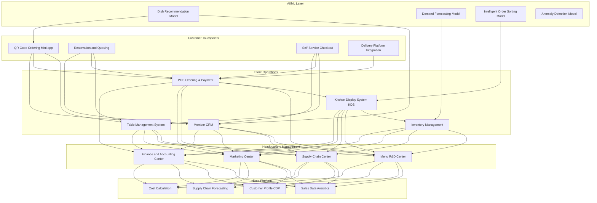
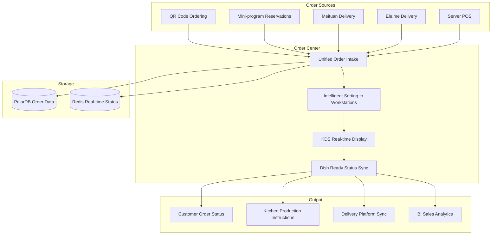

# Smart Restaurant Architecture Design - Alibaba Cloud Perspective

> **Applicable Version**: Kubernetes v1.29 - v1.33 | **Last Updated**: 2026-04-24
> **Author**: Alibaba Cloud Solutions Architect | **Tags**: `#smart-restaurant` `#ordering-system` `#kitchen-management` `#alibaba-cloud`

---

<!-- chunk: Table of Contents -->## Table of Contents

1. [Industry Overview](#1-industry-overview)
2. [Business Scenarios](#2-business-scenarios)
3. [Architecture Design](#3-architecture-design)
4. [Core Technology Stack](#4-core-technology-stack)
5. [Kubernetes Deployment](#5-kubernetes-deployment)
6. [Data Architecture](#6-data-architecture)
7. [AI/ML Components](#7-aiml-components)
8. [Security and Compliance](#8-security-and-compliance)
9. [Best Practices](#9-best-practices)
10. [Anti-Patterns](#10-anti-patterns)
11. [Reference Resources](#11-reference-resources)

---

<!-- chunk: 1. Industry Overview -->## 1. Industry Overview

## 1.1 Market Size and Trends

Smart restaurant platforms covering ordering, kitchen operations, supply chain, and membership management represent the core of restaurant digital transformation. China's restaurant market exceeds 5 trillion yuan, with the smart restaurant SaaS market projected to grow from 20 billion yuan in 2024 to 80 billion yuan in 2030. Major platforms like Meituan, Ele.me, Ketang.cloud, and Huala.la compete fiercely. Core trends include QR code ordering, intelligent kitchen display systems (KDS), AI dish recommendations, and supply chain forecasting.

| Metric | 2024 | 2026 (Forecast) | 2030 (Forecast) |
|:---|:---|:---|:---|
| China Restaurant Market Size | ¥5.2T | ¥6T | ¥8T |
| Smart Restaurant SaaS Market | ¥20B | ¥40B | ¥80B |
| QR Code Ordering Penetration | 70% | 85% | 95% |
| Smart KDS Deployment Rate | 20% | 40% | 70% |
| AI Recommendation Coverage | 5% | 20% | 50% |

## 1.2 Industry Pain Points

| Pain Point | Description | Digital Transformation Driver |
|:---|:---|:---|
| Peak Concurrency | Order burst during lunch/dinner hours | Elastic scaling + queue load shedding |
| Kitchen Coordination | Multi-dish parallel production coordination | Intelligent KDS order sorting |
| Table Management | High table turnover optimization | Real-time status synchronization |
| Member Operations | Precision marketing and repeat purchase | CDP + AI recommendations |
| Supply Chain | Food procurement and inventory management | AI demand forecasting + auto-replenishment |
| Food Safety | Open kitchen and traceability | Video monitoring + blockchain traceability |

## 1.3 Digital Transformation Architecture Impact

Smart restaurant architecture requires coverage of customer touchpoints (QR code ordering/reservations/self-service checkout/delivery), store operations (tables/ordering/KDS kitchen/inventory/membership), headquarters management (menu R&D/supply chain/marketing/finance), and data platform (sales analysis/customer profiles/supply chain forecasting/cost calculation). Core challenges are handling peak hour concurrency and intelligent kitchen ordering.

---

<!-- chunk: 2. Business Scenarios -->## 2. Business Scenarios

## 2.1 QR Code Ordering and Self-Service Checkout

Customers scan QR code to access mini-program ordering, supporting dish customization (flavors/add-ons/dietary restrictions), package recommendations, and multiple payment methods. Orders are pushed to kitchen KDS system in real-time. Peak hours require supporting 100+ orders per minute per store.

## 2.2 Kitchen KDS Intelligent Order Sorting

Kitchen Display System distributes orders to workstations (cold appetizers/hot dishes/grilling/beverages) based on preparation time, equipment availability, and chef workload. Priority adjustments consider order wait time, reminders, and delivery time sensitivity. Kitchen status syncs in real-time to front-of-house.

## 2.3 Table and Queue Management

Real-time table status management (empty/occupied/cleaning), intelligent queue calling based on table type and available seating, auto turnover reminders and cleaning task assignment. Table turnover metrics used for scheduling optimization and layout adjustments.

## 2.4 Member Precision Marketing

Build customer profiles from transaction data, supporting multi-dimensional member operations (points/prepaid balances/coupons/birthday care). AI recommendation engine suggests dishes based on user taste preferences and purchase history. Precision marketing increases repeat purchase rate by 20%+.

## 2.5 Intelligent Supply Chain

Forecast ingredient requirements across stores based on historical sales, weather, and holidays, automatically generating purchase orders. Inventory management supports FIFO, expiration alerts, and waste analysis. Reduces food waste by 15%+.

---

<!-- chunk: 3. Architecture Design -->## 3. Architecture Design

## 3.1 Smart Restaurant Full-Stack Architecture



---

<!-- chunk: 4. Core Technology Stack -->## 4. Core Technology Stack

| Component | Purpose | Technology | License |
|:---|:---|:---|:---|
| Container Orchestration | Platform management | ACK Pro | Proprietary |
| Mini Program | Customer ordering | WeChat / Alipay Mini-program | Proprietary |
| POS System | Order & payment | Custom POS (Electron) | Proprietary |
| KDS | Kitchen display | Custom KDS (Web) | Proprietary |
| Relational DB | Business data | PolarDB MySQL | Proprietary |
| Cache | Session & hot data | Redis Enterprise | Proprietary |
| Message Queue | Real-time order sync | RocketMQ 5.x | Apache 2.0 |
| WebSocket | KDS real-time push | Spring WebSocket / Socket.IO | Apache 2.0 / MIT |
| Object Storage | Images & videos | OSS + CDN | Proprietary |
| AI Platform | Recommendation | PAI | Proprietary |
| Video | Open kitchen live stream | Alibaba Cloud Live | Proprietary |
| Monitoring | Observability | ARMS + SLS | Proprietary |

---

<!-- chunk: 5. Kubernetes Deployment -->## 5. Kubernetes Deployment

## 5.1 Ordering Service Deployment

```yaml
apiVersion: apps/v1
kind: Deployment
metadata:
  name: order-service
  namespace: smart-restaurant
  labels:
    app: order-service
    tier: core
spec:
  replicas: 8
  selector:
    matchLabels:
      app: order-service
  strategy:
    rollingUpdate:
      maxSurge: 2
      maxUnavailable: 1
  template:
    metadata:
      labels:
        app: order-service
        tier: core
      annotations:
        prometheus.io/scrape: "true"
        prometheus.io/port: "9090"
    spec:
      containers:
        - name: order
          image: registry.cn-hangzhou.aliyuncs.com/restaurant/order:v3.0.0
          ports:
            - containerPort: 8080
              name: http
            - containerPort: 9090
              name: metrics
          env:
            - name: REDIS_HOST
              valueFrom:
                configMapKeyRef:
                  name: restaurant-config
                  key: redis-host
            - name: KDS_WEBSOCKET_URL
              value: "ws://kds-service:8080/ws"
            - name: DB_CONNECTION
              valueFrom:
                secretKeyRef:
                  name: restaurant-secrets
                  key: db-connection
            - name: MAX_QPS_PER_INSTANCE
              value: "500"
            - name: PEAK_MODE_ENABLED
              value: "auto"
          resources:
            requests:
              memory: "2Gi"
              cpu: "1000m"
            limits:
              memory: "4Gi"
              cpu: "2000m"
          readinessProbe:
            httpGet:
              path: /health/ready
              port: 8080
            initialDelaySeconds: 10
            periodSeconds: 5
          livenessProbe:
            httpGet:
              path: /health/live
              port: 8080
            initialDelaySeconds: 20
            periodSeconds: 10
```

## 5.2 Kitchen Display System KDS Deployment

```yaml
apiVersion: apps/v1
kind: Deployment
metadata:
  name: kds-service
  namespace: smart-restaurant
spec:
  replicas: 3
  selector:
    matchLabels:
      app: kds-service
  template:
    metadata:
      labels:
        app: kds-service
    spec:
      containers:
        - name: kds
          image: registry.cn-hangzhou.aliyuncs.com/restaurant/kds:v2.5.0
          ports:
            - containerPort: 8080
          env:
            - name: WS_MAX_CONNECTIONS
              value: "200"
            - name: SORTING_STRATEGY
              value: "time-priority-with-cooking-time"
            - name: STATION_COUNT
              value: "6"
          resources:
            requests:
              memory: "1Gi"
              cpu: "500m"
            limits:
              memory: "2Gi"
              cpu: "1000m"
```

## 5.3 ConfigMap, Service and Secret

```yaml
apiVersion: v1
kind: ConfigMap
metadata:
  name: restaurant-config
  namespace: smart-restaurant
data:
  redis-host: "redis-cluster:6379"
  peak-config: |
    {
      "lunch_hours": ["11:00-13:30"],
      "dinner_hours": ["17:30-20:30"],
      "auto_scale_threshold_qps": 300,
      "scale_up_replicas": 12
    }
  kds-stations: |
    [
      {"id": "cold", "name": "Cold Appetizer Station", "avg_time_min": 5},
      {"id": "hot1", "name": "Hot Dish Station A", "avg_time_min": 10},
      {"id": "hot2", "name": "Hot Dish Station B", "avg_time_min": 12},
      {"id": "grill", "name": "Grilling Station", "avg_time_min": 15},
      {"id": "soup", "name": "Soup Station", "avg_time_min": 8},
      {"id": "drink", "name": "Beverage Station", "avg_time_min": 3}
    ]
  delivery-platforms: |
    {
      "meituan": {"api_url": "https://api.meituan.com", "timeout_s": 5},
      "eleme": {"api_url": "https://api.ele.me", "timeout_s": 5}
    }
---
apiVersion: v1
kind: Service
metadata:
  name: order-service
  namespace: smart-restaurant
spec:
  selector:
    app: order-service
  ports:
    - name: http
      port: 8080
      targetPort: 8080
    - name: metrics
      port: 9090
      targetPort: 9090
  type: ClusterIP
---
apiVersion: v1
kind: Secret
metadata:
  name: restaurant-secrets
  namespace: smart-restaurant
type: Opaque
stringData:
  db-connection: "mysql://restaurant@polardb.restaurant.rds.aliyuncs.com:3306/restaurant_db"
  redis-password: "redis-password-placeholder"
  payment-api-key: "payment-gateway-key"
  meituan-app-key: "meituan-key-placeholder"
  eleme-app-key: "eleme-key-placeholder"
```

---

<!-- chunk: 6. Data Architecture -->## 6. Data Architecture

## 6.1 Order Data Flow



## 6.2 Data Flow Description

- **Order Flow**: Multi-channel orders unified through OMS, then pushed to KDS after intelligent sorting
- **Real-time Status Flow**: Order status pushed via WebSocket to customers and kitchen in real-time
- **Delivery Integration Flow**: Delivery orders integrated through API Gateway, status auto-synced
- **Analytics Data Flow**: Sales data aggregated via Flink in real-time, generating store operation reports

---

<!-- chunk: 7. AI/ML Components -->## 7. AI/ML Components

## 7.1 Core Models

| Model | Purpose | Input | Output | Framework |
|:---|:---|:---|:---|---|
| Dish Recommendation | Personalized ordering recommendations | User profile/history/context | Recommended dish list | DeepFM |
| Demand Forecasting | Ingredient demand forecasting | Historical/weather/holidays | 7-day forecast by store | Prophet + LSTM |
| Intelligent Order Sorting | Optimal kitchen production sequence | Order queue/workstation status | Optimal sorting plan | Rules + RL |
| Churn Prediction | Member churn prediction | Purchase frequency/interval | Churn probability | XGBoost |
| Dynamic Pricing | Dish dynamic pricing | Cost/demand/competition | Optimal price | RL |
| Food Safety Detection | Open kitchen AI detection | Kitchen video | Rule violation flags | YOLOv8 |

---

<!-- chunk: 8. Security and Compliance -->## 8. Security and Compliance

## 8.1 Regulatory Requirements

| Regulation/Standard | Applicable Scope | Architecture Requirement |
|:---|:---|:---|
| Food Safety Law | Restaurant food safety | Open kitchen + traceability |
| Food Safety Rules | Online delivery | Delivery food safety management |
| PCI-DSS | Payment data security | Payment info tokenization |
| Personal Information Protection Law | Customer data protection | Data masking + authorization |
| Open Kitchen Engineering | Public kitchen video | Video storage compliance |

## 8.2 Security Architecture Points

- **Payment Security**: Payment info tokenization, PCI-DSS compliant
- **Food Safety**: Open kitchen video AI auto-detection of violations
- **Data Security**: Customer info encrypted storage, least privilege access
- **Delivery Integration Security**: Delivery platform API integration using OAuth2 signatures

---

<!-- chunk: 9. Best Practices -->## 9. Best Practices

1. **Elastic Scaling**: Auto-scale ordering service during peak lunch/dinner, scale down during off-hours
2. **WebSocket Real-time Push**: Push order status via WebSocket instead of polling
3. **Intelligent KDS Sorting**: Auto-sort by preparation time and reminder priority
4. **Multi-platform Unified Intake**: Meituan/Ele.me/self-owned channels unified through OMS
5. **Ingredient Demand Forecasting**: AI forecast 7 days ahead per store, reducing waste
6. **Member CDP**: Build unified customer profiles from multi-channel consumption
7. **Open Kitchen AI**: Auto-detect violations like no-hat/hand-washing from kitchen video
8. **QR Code Cost Reduction**: Replace manual ordering with QR codes to reduce labor costs
9. **Dish A/B Testing**: Test new dishes in limited scope before rollout
10. **Supply Chain Pooled Procurement**: Multi-store ingredient unified procurement for cost reduction

---

<!-- chunk: 10. Anti-Patterns -->## 10. Anti-Patterns

1. **Insufficient Peak Capacity**: System designed for average load, crashes during lunch peak. Should design for 3x peak
2. **Delayed KDS Updates**: KDS updates not real-time, chefs see old orders. Should use WebSocket real-time push
3. **Ignoring Delivery Peaks**: Delivery and dine-in orders mixed, delivery times exceeded. Should separate delivery queues
4. **Member Data Silos**: Member data scattered across platforms, can't unify operations. Should build CDP
5. **No Demand Forecasting**: Procurement based on experience causes waste or stockouts. Should use AI forecasting

---

<!-- chunk: 11. Reference Resources -->## 11. Reference Resources

- [Food Safety Law](https://www.gov.cn/)
- [Meituan Open Platform](https://developer.meituan.com/)
- [Ele.me Open Platform](https://open.ele.me/)
- [WeChat Mini-program Documentation](https://developers.weixin.qq.com/miniprogram/dev/framework/)
- [Alibaba Cloud Live Video Documentation](https://help.aliyun.com/product/29949.html)

---

**Maintainer**: Alibaba Cloud Solutions Architect Team | **License**: MIT

---

<!-- chunk: Obsidian Related Documents -->## Obsidian Related Documents

- topic-application-architecture MOC
- [[domain-20-application-patterns/topic-application-architecture/README.md|Topic Application Architecture Design Best Practices]]
- [[domain-20-application-patterns/topic-application-architecture/01-ecommerce-architecture.md|E-commerce System Kubernetes Production Architecture]]
- [[domain-20-application-patterns/topic-application-architecture/02-mini-program-architecture.md|Mini-program Platform Architecture]]
- [[domain-20-application-patterns/topic-application-architecture/03-cms-architecture.md|CMS Architecture]]
- [[domain-20-application-patterns/topic-application-architecture/04-im-rtc-architecture.md|Real-time Communication IM/RTC Architecture]]
- [[domain-20-application-patterns/topic-application-architecture/05-online-education-architecture.md|Online Education Platform Kubernetes Architecture]]
- [[domain-20-application-patterns/topic-application-architecture/06-fintech-architecture.md|FinTech Kubernetes Architecture]]
- [[domain-20-application-patterns/topic-application-architecture/07-iot-platform-architecture.md|IoT Platform Architecture]]
- [[domain-20-application-patterns/topic-application-architecture/08-ai-ml-inference-architecture.md|AI/ML Inference Service Kubernetes Architecture]]
- [[domain-20-application-patterns/topic-application-architecture/09-gaming-backend-architecture.md|Gaming Backend Kubernetes Architecture]]
- [[domain-20-application-patterns/topic-application-architecture/10-social-media-architecture.md|Social Media Platform Kubernetes Architecture]]

## See Also

- 30-hrtech-saas
- 31-instant-retail
- 33-crossborder-warehouse
- 34-sportstech

<!-- risk-assessed -->
