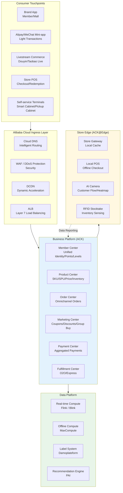
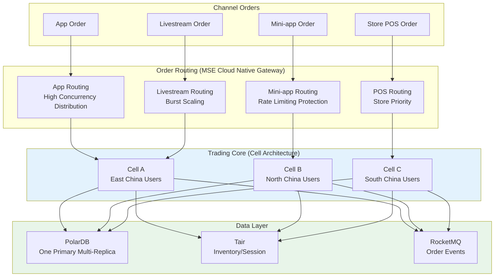
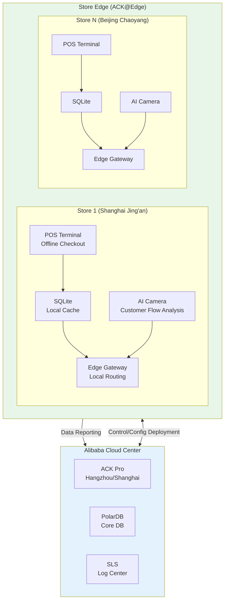
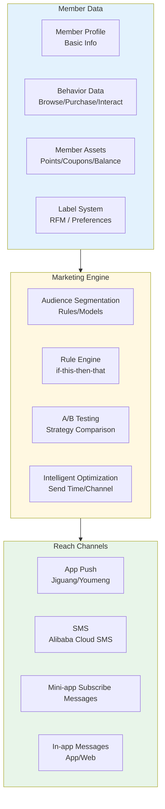
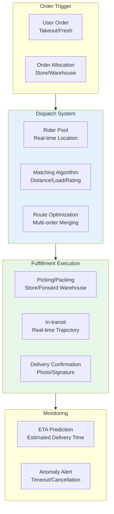
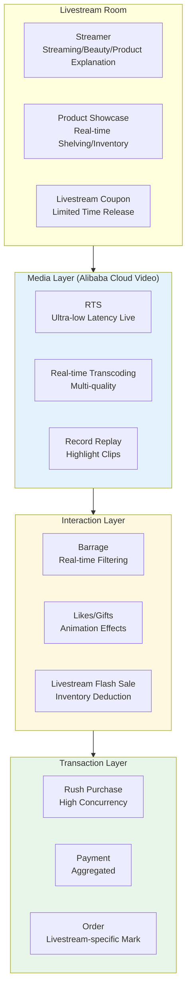
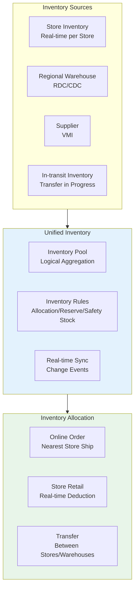
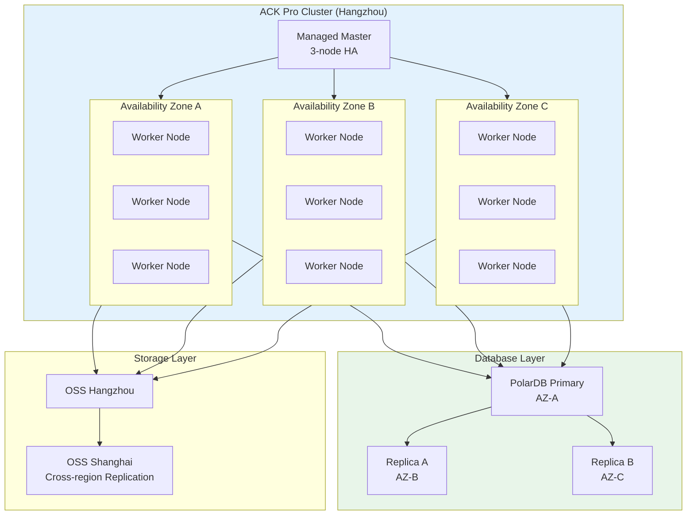

# Smart Retail and New Retail Kubernetes Production Architecture

> **Applicable Scenarios**: Chain store digitalization / Omnichannel retail / Member center / Intelligent shopping assistant / O2O same-day delivery / Livestream commerce  
> **Cloud Provider**: Alibaba Cloud ACK + Product Ecosystem  
> **Applicable Version**: Kubernetes v1.29 - v1.33  
> **Last Updated**: 2026-04-24  
> **Target Audience**: Retail industry architects, Alibaba Cloud solutions architects, technology leads

---

<!-- chunk: Table of Contents -->## 📋 Table of Contents

- [1. Overall Architecture Overview](#1-overall-architecture-overview)
- [2. Omnichannel Transaction Architecture](#2-omnichannel-transaction-architecture)
- [3. Store Digitalization Edge Architecture](#3-store-digitalization-edge-architecture)
- [4. Member Center and Marketing Architecture](#4-member-center-and-marketing-architecture)
- [5. Same-day Delivery and Fulfillment Architecture](#5-same-day-delivery-and-fulfillment-architecture)
- [6. Livestream Commerce and Content E-commerce Architecture](#6-livestream-commerce-and-content-e-commerce-architecture)
- [7. Unified Inventory Architecture](#7-unified-inventory-architecture)
- [8. ACK Alibaba Cloud Deployment Architecture](#8-ack-alibaba-cloud-deployment-architecture)

---

<!-- chunk: 1. Overall Architecture Overview -->## 1. Overall Architecture Overview



## Alibaba Cloud Product Mapping

| Architecture Layer | Open Source/K8s Solution | Alibaba Cloud Enterprise Solution | Selection Advice |
|:---|:---|:---|:---|
| Container Platform | Self-hosted K8s | **ACK Pro** / ACK Managed | Production must choose ACK Pro, no master maintenance |
| Load Balancing | Nginx Ingress | **ALB** (Application) / MSE Gateway | Large-scale use ALB, microservices use MSE |
| Database | MySQL | **PolarDB** (one-write-multi-read) / **RDS MySQL** | High concurrent read-write use PolarDB |
| Cache | Redis Cluster | **Cloud Database Redis Enterprise** (Tair) | Persistent in-memory type suits financial-grade cache |
| Message Queue | Kafka | **Message Queue RocketMQ 5.0** / **Kafka** | Trading scenarios prioritize RocketMQ |
| Object Storage | MinIO | **OSS** + CDN | Images/videos must use OSS |
| Big Data | Spark/Flink | **MaxCompute** + **Real-time Compute Flink** | Offline+real-time integrated |
| Monitoring | Prometheus | **ARMS** + **SLS** | Full-link tracing+logs |
| Edge | KubeEdge | **ACK@Edge** | Store/warehouse edge node management |

---

<!-- chunk: 2. Omnichannel Transaction Architecture -->## 2. Omnichannel Transaction Architecture



## Cell Architecture Order Service ACK Deployment

```yaml
# Cell Architecture: Route to different cells by user ID sharding
apiVersion: apps/v1
kind: Deployment
metadata:
  name: order-service-unit-a
  namespace: retail-unit-a
  labels:
    unit: a
    region: east-china
spec:
  replicas: 10
  selector:
    matchLabels:
      app: order-service
      unit: a
  template:
    metadata:
      labels:
        app: order-service
        unit: a
    spec:
      affinity:
        nodeAffinity:
          requiredDuringSchedulingIgnoredDuringExecution:
            nodeSelectorTerms:
              - matchExpressions:
                  - key: topology.kubernetes.io/zone
                    operator: In
                    values:
                      - cn-hangzhou-a
                      - cn-hangzhou-b
                      - cn-hangzhou-c
        podAntiAffinity:
          preferredDuringSchedulingIgnoredDuringExecution:
            - weight: 100
              podAffinityTerm:
                labelSelector:
                  matchExpressions:
                    - key: app
                      operator: In
                      values:
                        - order-service
                topologyKey: kubernetes.io/hostname
      containers:
        - name: order
          image: registry.cn-hangzhou.aliyuncs.com/retail/order-service:v2.1.0
          ports:
            - containerPort: 8080
          env:
            - name: UNIT_ID
              value: "A"
            - name: DB_HOST
              value: "pc-bp1xxxxxxxxxxxxx.mysql.polardb.rds.aliyuncs.com"
            - name: DB_NAME
              value: "retail_order_a"
            - name: REDIS_HOST
              value: "r-bp1xxxxxxxxxxxxx.redis.rds.aliyuncs.com"
            - name: ROCKETMQ_ENDPOINT
              value: "http://MQ_INST_xxxxxxx.cn-hangzhou.mq-internal.aliyuncs.com:8080"
            - name: ALICLOUD_ACCESS_KEY
              valueFrom:
                secretKeyRef:
                  name: alicloud-credentials
                  key: access-key-id
          resources:
            requests:
              cpu: "1"
              memory: "2Gi"
            limits:
              cpu: "4"
              memory: "8Gi"
          livenessProbe:
            httpGet:
              path: /health/live
              port: 8080
            initialDelaySeconds: 30
            periodSeconds: 10
          readinessProbe:
            httpGet:
              path: /health/ready
              port: 8080
            initialDelaySeconds: 5
            periodSeconds: 5
---
# MSE Cloud Native Gateway Routing Rules
apiVersion: networking.k8s.io/v1
kind: Ingress
metadata:
  name: retail-order-ingress
  namespace: retail
  annotations:
    alb.ingress.kubernetes.io/scheme: internet
    alb.ingress.kubernetes.io/listen-ports: '[{"HTTPS":443}]'
    alb.ingress.kubernetes.io/certificate-ids: "cert-xxxxxx"
    alb.ingress.io/routing-policy: "weighted"
spec:
  ingressClassName: alb
  rules:
    - host: api.retail.example.com
      http:
        paths:
          - path: /order
            pathType: Prefix
            backend:
              service:
                name: order-service-unit-a
                port:
                  number: 8080
```

---

<!-- chunk: 3. Store Digitalization Edge Architecture -->## 3. Store Digitalization Edge Architecture



## ACK@Edge Store Gateway Deployment

```yaml
apiVersion: apps/v1
kind: Deployment
metadata:
  name: store-edge-gateway
  namespace: retail-edge
spec:
  replicas: 1
  selector:
    matchLabels:
      app: store-edge-gateway
  template:
    metadata:
      labels:
        app: store-edge-gateway
    spec:
      nodeName: edge-node-store-001  # ACK@Edge edge node
      hostNetwork: true
      containers:
        - name: gateway
          image: registry.cn-hangzhou.aliyuncs.com/retail/edge-gateway:v1.0
          ports:
            - containerPort: 8080
              hostPort: 8080
            - containerPort: 8443
              hostPort: 8443
          env:
            - name: STORE_ID
              value: "SH-JINGAN-001"
            - name: CLOUD_SYNC_INTERVAL
              value: "30"
            - name: OFFLINE_MODE
              value: "auto"  # Auto switch to offline mode on network loss
            - name: LOCAL_DB_PATH
              value: "/data/store.db"
            - name: CLOUD_API_ENDPOINT
              value: "https://api.retail.example.com"
          resources:
            requests:
              cpu: "500m"
              memory: "1Gi"
            limits:
              cpu: "2"
              memory: "4Gi"
          volumeMounts:
            - name: local-data
              mountPath: /data
            - name: edge-certs
              mountPath: /certs
              readOnly: true
      volumes:
        - name: local-data
          hostPath:
            path: /opt/retail/data
            type: DirectoryOrCreate
        - name: edge-certs
          secret:
            secretName: store-edge-certs
```

---

<!-- chunk: 4. Member Center and Marketing Architecture -->## 4. Member Center and Marketing Architecture



---

<!-- chunk: 5. Same-day Delivery and Fulfillment Architecture -->## 5. Same-day Delivery and Fulfillment Architecture



---

<!-- chunk: 6. Livestream Commerce and Content E-commerce Architecture -->## 6. Livestream Commerce and Content E-commerce Architecture



---

<!-- chunk: 7. Unified Inventory Architecture -->## 7. Unified Inventory Architecture



---

<!-- chunk: 8. ACK Alibaba Cloud Deployment Architecture -->## 8. ACK Alibaba Cloud Deployment Architecture

## Multi-AZ High Availability Architecture



## ACK Cluster Node Pool Configuration

```yaml
# ACK Cluster Node Pool Configuration (Alibaba Cloud)
apiVersion: apps/v1
kind: Deployment
metadata:
  name: retail-core-service
  namespace: retail
spec:
  replicas: 12
  selector:
    matchLabels:
      app: retail-core
  template:
    metadata:
      labels:
        app: retail-core
    spec:
      topologySpreadConstraints:
        - maxSkew: 1
          topologyKey: topology.kubernetes.io/zone
          whenUnsatisfiable: DoNotSchedule
          labelSelector:
            matchLabels:
              app: retail-core
      affinity:
        podAntiAffinity:
          preferredDuringSchedulingIgnoredDuringExecution:
            - weight: 100
              podAffinityTerm:
                labelSelector:
                  matchExpressions:
                    - key: app
                      operator: In
                      values:
                        - retail-core
                topologyKey: kubernetes.io/hostname
      containers:
        - name: core
          image: registry.cn-hangzhou.aliyuncs.com/retail/core-service:v2.0
          ports:
            - containerPort: 8080
          env:
            - name: SPRING_PROFILES_ACTIVE
              value: "production,aliyun"
            - name: DB_URL
              valueFrom:
                secretKeyRef:
                  name: retail-db-secret
                  key: url
          resources:
            requests:
              cpu: "2"
              memory: "4Gi"
            limits:
              cpu: "8"
              memory: "16Gi"
---
# Alibaba Cloud ARMS Application Monitoring
apiVersion: arms.aliyun.com/v1beta1
kind: ArmsApplicationMonitor
metadata:
  name: retail-core-monitor
  namespace: retail
spec:
  appName: retail-core-service
  language: java
  agentVersion: "3.0"
  enable: true
  configs:
    - name: sampling_rate
      value: "10"
```

---

<!-- chunk: Reference Links -->## Reference Links

- [Alibaba Cloud ACK Documentation](https://www.aliyun.com/product/kubernetes)
- [Alibaba Cloud PolarDB](https://www.aliyun.com/product/polardb)
- [Alibaba Cloud MSE Microservice Engine](https://www.aliyun.com/product/aliware/mse)
- [New Retail Solution](https://www.aliyun.com/solution/newretail)

---

<!-- chunk: Obsidian Related Documents -->## Obsidian Related Documents

- topic-application-architecture MOC
- [[domain-20-application-patterns/topic-application-architecture/README.md|Topic Application Architecture Design Best Practices]]
- [[domain-20-application-patterns/topic-application-architecture/01-ecommerce-architecture.md|E-commerce System Kubernetes Production Architecture]]
- [[domain-20-application-patterns/topic-application-architecture/02-mini-program-architecture.md|Mini-program Platform Architecture]]
- [[domain-20-application-patterns/topic-application-architecture/03-cms-architecture.md|CMS Architecture]]
- [[domain-20-application-patterns/topic-application-architecture/04-im-rtc-architecture.md|Real-time Communication IM/RTC Architecture]]
- [[domain-20-application-patterns/topic-application-architecture/05-online-education-architecture.md|Online Education Platform Kubernetes Architecture]]
- [[domain-20-application-patterns/topic-application-architecture/06-fintech-architecture.md|FinTech Kubernetes Architecture]]
- [[domain-20-application-patterns/topic-application-architecture/07-iot-platform-architecture.md|IoT Platform Architecture]]
- [[domain-20-application-patterns/topic-application-architecture/08-ai-ml-inference-architecture.md|AI/ML Inference Service Kubernetes Architecture]]
- [[domain-20-application-patterns/topic-application-architecture/09-gaming-backend-architecture.md|Gaming Backend Kubernetes Architecture]]
- [[domain-20-application-patterns/topic-application-architecture/10-social-media-architecture.md|Social Media Platform Kubernetes Architecture]]

## See Also

- 09-gaming-backend-architecture
- 10-social-media-architecture
- 12-smart-logistics-architecture
- 13-digital-government-architecture

<!-- risk-assessed -->
