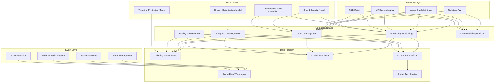
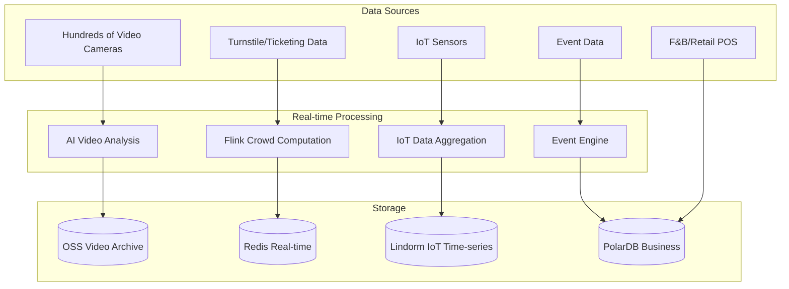

# Smart Sports Venue Architecture Design - Alibaba Cloud Perspective

> **Applicable Version**: Kubernetes v1.29 - v1.33 | **Last Updated**: 2026-04-24
> **Author**: Alibaba Cloud Solutions Architect | **Tags**: `#smart-sports-venue` `#sports-operations` `#audience-experience` `#digital-twin-venue` `#alibaba-cloud`

---

## Table of Contents

1. [Industry Overview](#1-industry-overview)
2. [Business Scenarios](#2-business-scenarios)
3. [Architecture Design](#3-architecture-design)
4. [Core Technology Stack](#4-core-technology-stack)
5. [Kubernetes Deployment](#5-kubernetes-deployment)
6. [Data Architecture](#6-data-architecture)
7. [AI/ML Components](#7-aiml-components)
8. [Security and Compliance](#8-security-and-compliance)
9. [Best Practices](#9-best-practices)
10. [Anti-Patterns](#10-anti-patterns)
11. [Reference Resources](#11-reference-resources)

---

## 1. Industry Overview

### 1.1 Market Size and Trends

Smart sports venues combine digital technology with sports operations to enhance event experience and operational efficiency. Global smart venue market size projected to grow from USD 25 billion in 2024 to USD 80 billion in 2030. Drivers include major sporting events (Olympics/World Cup), fan experience upgrades, venue operation cost reduction, and green/low-carbon requirements. Key technologies include 5G+8K streaming, digital twin venues, AI security monitoring, and IoT energy management.

| Metric | 2024 | 2026 (Forecast) | 2030 (Forecast) |
|:---|:---|:---|:---|
| Global Smart Venue Market | $25B | $45B | $80B |
| 5G Venue Coverage | 20% | 50% | 90% |
| AI Security Deployment | 30% | 60% | 95% |
| Digital Twin Venues | 100+ | 500+ | 2000+ |
| Venue Energy Reduction | 10% | 20% | 35% |

### 1.2 Industry Pain Points

| Pain Point | Description | Digital Transformation Driver |
|:---|:---|:---|
| Large Crowd Management | Tens of thousands entering/exiting | High concurrency ticketing/turnstiles/crowd analysis |
| Event Streaming | 4K/8K ultra-low latency | CDN + edge nodes + 5G |
| Security Assurance | Emergency response capability | AI video analysis + crowd density monitoring |
| Energy Management | Large venue green operations | IoT + AI optimization of HVAC/lighting |
| Multi-use Operations | Flexible runtime/non-runtime switching | Business platform + digital twin |

---

## 2. Business Scenarios

### 2.1 Intelligent Ticketing and Contactless Entry

Electronic ticketing system with facial recognition entry, dynamic pricing, and scalper prevention. Turnstile gates support >30 people/minute/lane throughput, entry data real-time synced to crowd management system. Multi-channel ticket sales (official App/mini-program/third-party platforms) with unified inventory.

### 2.2 Multi-angle VR Sports Streaming

Deploy dozens of camera angles (including drones/robots/athlete-worn), supporting viewers to freely switch perspectives. 4K/8K encoding distributed via CDN to audience phones/VR devices, end-to-end latency <3 seconds. Overlay real-time stats (player data/speed/trajectory) enhancing viewer experience.

### 2.3 AI Security Monitoring

Deploy hundreds of AI cameras throughout venue, real-time analysis of crowd density, abnormal behavior (fighting/trespassing/smoke), abandoned objects. Anomaly events trigger 5-second alerts to command center, coordinating security personnel response.

### 2.4 Smart Parking and Contactless Payment

Vehicle guidance system shows available spaces in real-time, supports license plate recognition entry/exit and contactless payment. Tidal scheduling dynamically opens/closes parking areas by event timing. New energy charging dock integrated management.

### 2.5 Digital Twin Venue Operations

Build 3D digital twin model of venue, overlay real-time IoT data (crowd/energy/device status). Support remote inspection, energy optimization simulation, emergency drill rehearsal, and facility lifecycle management.

---

## 3. Architecture Design

### 3.1 Smart Sports Venue Full-Stack Architecture



---

## 4. Core Technology Stack

| Component | Purpose | Technology | License |
|:---|:---|:---|:---|
| Container | Platform | ACK Pro + GPU | Proprietary |
| CDN | Live streaming | Alibaba CDN + DCDN | Proprietary |
| Live Streaming | 4K/8K encoding | Alibaba Cloud Live | Proprietary |
| AI Vision | Security behavior | PAI + Vision AI | Proprietary |
| Object Detection | Crowd detection | YOLOv8 / RT-DETR | GPL / Apache 2.0 |
| IoT | Sensor management | Alibaba Cloud IoT | Proprietary |
| Time-Series DB | Sensor data | Lindorm TSDB | Proprietary |
| Relational DB | Business data | PolarDB MySQL | Proprietary |
| Cache | Hot data | Redis Enterprise | Proprietary |
| Message Queue | Events | RocketMQ 5.x | Apache 2.0 |
| Object Storage | Video archive | OSS | Proprietary |
| 3D Rendering | Digital twin | DataV / Cesium | Proprietary / Apache 2.0 |
| Monitoring | Observability | ARMS + SLS + Grafana | Proprietary / Apache 2.0 |

---

## 5. Kubernetes Deployment

### 5.1 AI Security Analysis GPU Deployment

```yaml
apiVersion: apps/v1
kind: Deployment
metadata:
  name: venue-security-ai
  namespace: smart-venue
spec:
  replicas: 6
  selector:
    matchLabels:
      app: venue-security-ai
  template:
    metadata:
      labels:
        app: venue-security-ai
        tier: ai-inference
    spec:
      nodeSelector:
        accelerator: nvidia-t4
        node-pool: venue-ai
      runtimeClassName: nvidia
      containers:
        - name: analyzer
          image: registry.cn-hangzhou.aliyuncs.com/venue/security-ai:v3.0.0-gpu
          env:
            - name: VIDEO_STREAMS
              value: "300"
            - name: DETECTION_CLASSES
              value: "crowd_density,abnormal_behavior,fire_smoke,intrusion,left_luggage"
            - name: ALERT_THRESHOLD
              value: "0.80"
          resources:
            requests:
              nvidia.com/gpu: 1
              memory: "8Gi"
              cpu: "4000m"
            limits:
              nvidia.com/gpu: 1
              memory: "16Gi"
              cpu: "8000m"
```

### 5.2 Ticketing Service Deployment

```yaml
apiVersion: apps/v1
kind: Deployment
metadata:
  name: ticketing-service
  namespace: smart-venue
spec:
  replicas: 8
  selector:
    matchLabels:
      app: ticketing-service
  template:
    metadata:
      labels:
        app: ticketing-service
    spec:
      containers:
        - name: ticketing
          image: registry.cn-hangzhou.aliyuncs.com/venue/ticketing:v3.0.0
          env:
            - name: MAX_QPS
              value: "50000"
            - name: ANTI_SCALPER_ENABLED
              value: "true"
            - name: FACE_VERIFY_URL
              value: "http://face-service:8080/verify"
          resources:
            requests:
              memory: "2Gi"
              cpu: "1000m"
            limits:
              memory: "4Gi"
              cpu: "2000m"
```

---

## 6. Data Architecture

### 6.1 Venue Data Flow Overview



---

## 7. AI/ML Components

| Model | Purpose | Input | Output | Framework |
|:---|:---|:---|:---|:---|
| Crowd Density | Area crowd monitoring | Overhead video | Density heatmap | CSRNet |
| Anomaly Behavior | Fight/trespass/smoke detection | Video clips | Behavior + location | SlowFast |
| Face Recognition | Ticket entry verification | Face image | Identity ID | ArcFace |
| Energy Prediction | Venue energy optimization | Historical/weather/schedule | Predicted energy | LSTM |
| Ticketing Prediction | Dynamic pricing and forecast | Historical/event heat | Optimal pricing | XGBoost |
| Parking Prediction | Space need forecast | Event time/history | Space need forecast | Prophet |

---

## 8. Security and Compliance

| Regulation/Standard | Scope | Architecture Requirement |
|:---|:---|:---|
| Large Gathering Safety Management | Major event safety | Crowd monitoring + emergency procedures |
| Information Protection Level 3 | Venue IT systems | Network security + data protection |
| Personal Information Protection | Audience privacy | Face data masking + minimization |
| Food Safety Law | Venue F&B | Traceability system |
| Fire Safety Law | Venue fire safety | Smoke detection + evacuation guidance |
| Sports Law | Event compliance | Fair judging systems |

---

## 9. Best Practices

1. **Edge AI First**: Video behavior analysis at venue edge, only structured results uploaded, reducing latency
2. **CDN Pre-warming**: Warm CDN nodes 1 hour before event start for smooth streaming
3. **Elastic Scaling**: Auto-scale ticketing/streaming services pre-event, scale down post-event
4. **Crowd Level Control**: Auto-trigger tiered crowd control (blue/yellow/orange/red) by density
5. **Smart Energy**: AI-optimize HVAC/lighting by event schedule and weather forecast
6. **Multi-carrier 5G**: Deploy multi-carrier 5G indoor systems for tens of thousands simultaneous
7. **Digital Twin Operations**: Digital twin overlays real-time IoT, replacing manual inspections
8. **F&B Demand Forecast**: Predict F&B needs by event type/audience, reducing waste
9. **Post-event Report**: Auto-generate operations report (crowd/security/energy/revenue)
10. **Green Low-carbon**: IoT + AI optimize energy, reducing venue operations CO2 by 20%+

---

## 10. Anti-Patterns

1. **All Video to Cloud**: Uploading hundreds of video streams to cloud overloads bandwidth. Use edge AI analysis
2. **Ignoring Peak Design**: Designed for daily load, crashes at event time. Design for 10x peak with scaling
3. **Single Source Crowd Data**: Relying only on turnstile data lacks accuracy. Fuse video/turnstile/WiFi
4. **Alert Storm**: Flooding operators with alerts loses critical ones. Use alert routing/escalation
5. **Event-only Focus**: Only supporting event operations, poor off-time utilization. Design flexible runtime/non-runtime

---

## 11. Reference Resources

- [Large Gathering Safety Management](https://www.gov.cn/)
- [Alibaba Cloud Live Video Docs](https://help.aliyun.com/product/29949.html)
- [YOLOv8 Object Detection](https://github.com/ultralytics/ultralytics)
- [Cesium 3D Digital Twin](https://cesium.com/)
- [DataV Data Visualization](https://help.aliyun.com/product/446557.html)
- [Alibaba Cloud CDN Docs](https://help.aliyun.com/product/270996.html)

---

**Maintainer**: Alibaba Cloud Solutions Architect Team | **License**: MIT

---

## Obsidian Related Documents

- topic-application-architecture MOC
- [[domain-20-application-patterns/topic-application-architecture/README.md|Topic Application Architecture Design Best Practices]]
- [[domain-20-application-patterns/topic-application-architecture/01-ecommerce-architecture.md|E-commerce System Kubernetes Production Architecture]]

## See Also

- 90-neuromorphic-computing
- 91-urban-air-mobility
- 93-digital-twin-factory
- 94-smart-prison

<!-- risk-assessed -->
