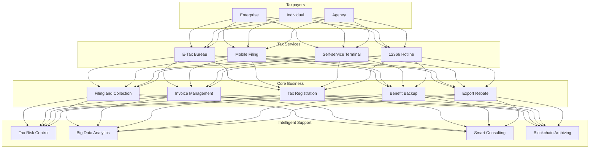
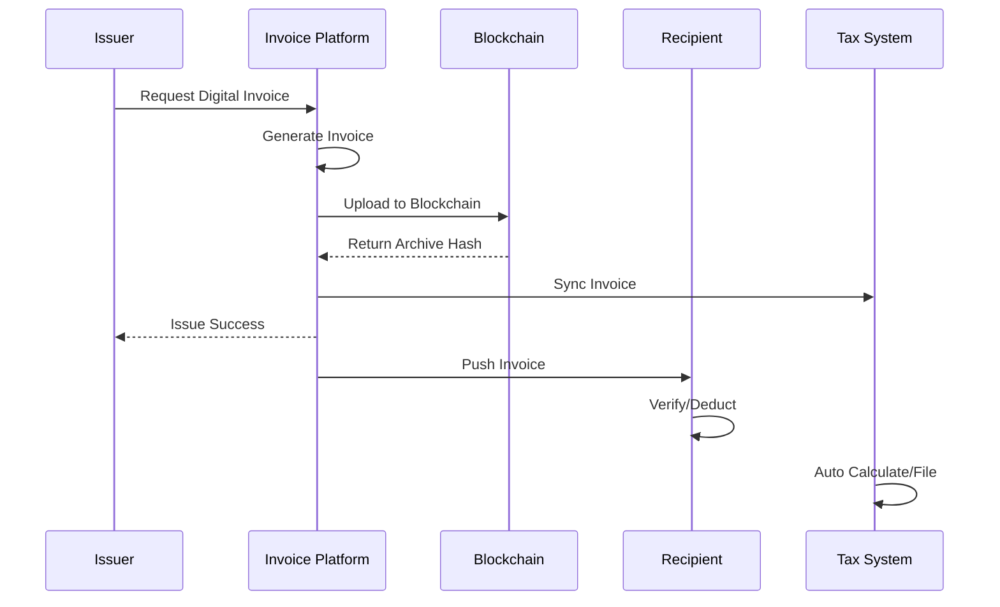
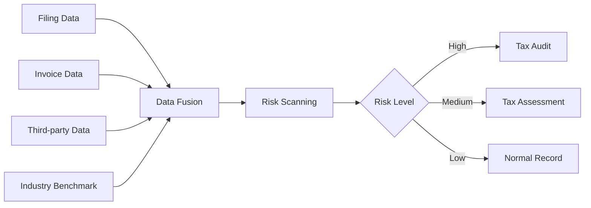

# Smart Tax Architecture Design - Alibaba Cloud Perspective

> **Applicable Version**: Kubernetes v1.29 - v1.33 | **Last Updated**: 2026-04-24
> **Author**: Alibaba Cloud Solutions Architect | **Tags**: `#smart-tax` `#e-tax-bureau` `#invoice` `#alibaba-cloud`

---

## Table of Contents

1. [Industry Background](#1-industry-background)
2. [Business Architecture](#2-business-architecture)
3. [Technical Architecture](#3-technical-architecture)
4. [Core Data Flow](#4-core-data-flow)
5. [Security and Compliance](#5-security-and-compliance)
6. [Observability](#6-observability)
7. [Alibaba Cloud Component Mapping](#7-alibaba-cloud-component-mapping)
8. [Production Checklist](#8-production-checklist)

---

## 1. Industry Background

### 1.1 Business Characteristics

Smart taxation improves tax governance effectiveness through digitalization:

| Challenge | Description | Architecture Impact |
|:---|:---|:---|
| High Concurrency Filing | Peak filing concentration | Elastic scaling + rate limiting |
| Invoice Management | Full digital invoice rollout | Blockchain archiving |
| Risk Control Precision | Fake invoice/tax evasion detection | Big data + AI |
| Data Fusion | Cross-department data sharing | Data exchange platform |
| Citizen Services | Taxpayer filing experience | Multi-channel unified |

### 1.2 Core Scenarios

- **E-Tax Bureau**: Online filing/mobile filing
- **Digital Invoices**: Invoice issuance/circulation/archiving
- **Tax Risk Control**: Risk scanning/alerts/response
- **Big Data Taxation**: Revenue analysis/tax source monitoring
- **Bank-Tax Interaction**: Taxpayer credit loans

---

## 2. Business Architecture

### 2.1 Smart Tax Full-Stack Architecture



### 2.2 Digital Invoice Flow



---

## 3. Technical Architecture

### 3.1 K8s Deployment

```yaml
# E-Tax Bureau Frontend Deployment
apiVersion: apps/v1
kind: Deployment
metadata:
  name: etax-frontend
  namespace: smart-tax
spec:
  replicas: 10
  selector:
    matchLabels:
      app: etax-frontend
  template:
    metadata:
      labels:
        app: etax-frontend
    spec:
      containers:
        - name: frontend
          image: registry.cn-hangzhou.aliyuncs.com/tax/etax-frontend:v5.0.0
          ports:
            - containerPort: 3000
          resources:
            requests:
              memory: "1Gi"
              cpu: "500m"
            limits:
              memory: "2Gi"
              cpu: "1000m"
```

```yaml
# Tax Risk Engine Deployment (GPU)
apiVersion: apps/v1
kind: Deployment
metadata:
  name: tax-risk-engine
  namespace: smart-tax
spec:
  replicas: 5
  selector:
    matchLabels:
      app: tax-risk-engine
  template:
    metadata:
      labels:
        app: tax-risk-engine
    spec:
      nodeSelector:
        accelerator: nvidia-t4
      runtimeClassName: nvidia
      containers:
        - name: risk
          image: registry.cn-hangzhou.aliyuncs.com/tax/risk-engine:v3.0.0-gpu
          env:
            - name: RISK_MODEL_VERSION
              value: "v2026.04"
            - name: ALERT_THRESHOLD
              value: "0.85"
          resources:
            requests:
              nvidia.com/gpu: 1
              memory: "8Gi"
              cpu: "4000m"
            limits:
              nvidia.com/gpu: 1
              memory: "16Gi"
              cpu: "8000m"
```

---

## 4. Core Data Flow

### 4.1 Big Data Tax Risk Control



---

## 5. Security and Compliance

- **Data Security**: Taxpayer info encrypted
- **Information Protection Level 3**: Tax system protection
- **National Crypto SM2/SM3/SM4**: Compliance
- **Audit Trail**: Full operation logging
- **Invoice Authenticity**: Blockchain verification

---

## 6. Observability

- **Filing Response**: P99 < 3s
- **Invoice Issuance**: P99 < 1s
- **System Availability**: 99.99%

---

## 7. Alibaba Cloud Component Mapping

| Functionality | **Alibaba Cloud Solution** |
|:---|:---|
| Container Platform | **ACK Pro** |
| Database | **PolarDB** |
| Cache | **Redis Enterprise** |
| Blockchain | **Ant Chain BaaS** |
| AI | **PAI** |
| Big Data | **MaxCompute** |
| Observability | **ARMS + SLS** |

---

## 8. Production Checklist

- [ ] Filing season scaling verification
- [ ] Digital invoice blockchain integrity
- [ ] Risk model accuracy > 95%
- [ ] National crypto full-chain verification
- [ ] Information Protection Level 3 audit

---

**Maintainer**: Alibaba Cloud Solutions Architect Team | **License**: MIT

<!-- risk-assessed -->
