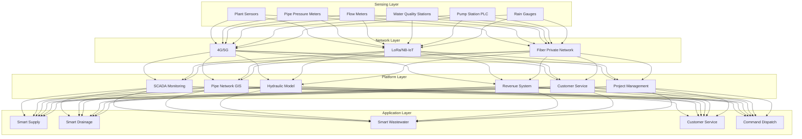
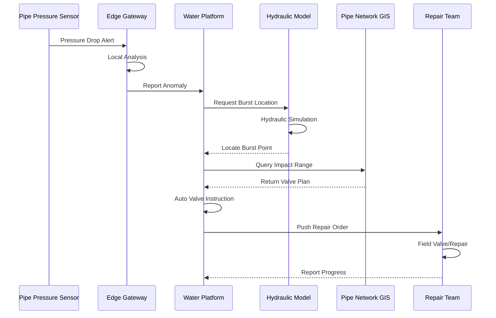
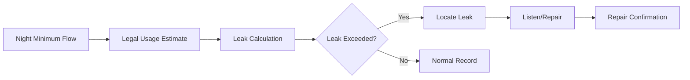

# Smart Water Architecture Design - Alibaba Cloud Perspective

> **Applicable Version**: Kubernetes v1.29 - v1.33 | **Last Updated**: 2026-05-18
> **Author**: Alibaba Cloud Solutions Architect | **Tags**: `#smart-water` `#supply` `#drainage` `#alibaba-cloud`

---

## Table of Contents

1. [Industry Background](#1-industry-background)
2. [Business Architecture](#2-business-architecture)
3. [Technical Architecture](#3-technical-architecture)
4. [Core Data Flow](#4-core-data-flow)
5. [Security and Compliance](#5-security-and-compliance)
6. [Observability](#6-observability)
7. [Alibaba Cloud Component Mapping](#7-alibaba-cloud-component-mapping)
8. [Production Checklist](#8-production-checklist)

---

## 1. Industry Background

### 1.1 Business Characteristics

Smart water covers raw water, supply, drainage, wastewater across full process:

| Challenge | Description | Architecture Impact |
|:---|:---|:---|
| Large Pipe Network | City underground pipes tens of thousands km | GIS + district management |
| Leak Control | Supply leakage rate must drop to 9% | Pressure monitoring + AI |
| Water Quality Safety | Source to tap water quality guarantee | Real-time monitoring + alert |
| Flood Prevention | Rainy season urban flooding risk | Water level prediction + pump scheduling |
| Wastewater Treatment | Treatment standard discharge | Process optimization + online monitoring |

### 1.2 Core Scenarios

- **Smart Supply**: Pipe monitoring/pressure control/leak control
- **Smart Drainage**: Rain-sewage separation/pump scheduling/flood alert
- **Smart Wastewater**: Process optimization/energy management/discharge compliance
- **Customer Service**: Meter reading/payment/repair/water quality query
- **Project Management**: Construction supervision/asset ledger/maintenance

---

## 2. Business Architecture

### 2.1 Smart Water Full-Stack Architecture



### 2.2 Pipe Burst Alert and Valve Sequence



---

## 3. Technical Architecture

### 3.1 K8s Deployment

```yaml
# Hydraulic Model Deployment
apiVersion: apps/v1
kind: Deployment
metadata:
  name: hydraulic-model
  namespace: smart-water
spec:
  replicas: 3
  selector:
    matchLabels:
      app: hydraulic-model
  template:
    metadata:
      labels:
        app: hydraulic-model
    spec:
      containers:
        - name: model
          image: registry.cn-hangzhou.aliyuncs.com/water/hydraulic-model:v2.0.0
          ports:
            - containerPort: 8080
          env:
            - name: PIPE_NETWORK_DATA
              value: "/data/pipe-network.json"
            - name: SIMULATION_TIME_STEP
              value: "60"
          resources:
            requests:
              memory: "8Gi"
              cpu: "4000m"
            limits:
              memory: "16Gi"
              cpu: "8000m"
          volumeMounts:
            - name: pipe-data
              mountPath: /data
      volumes:
        - name: pipe-data
          persistentVolumeClaim:
            claimName: pipe-network-pvc
```

```yaml
# Water Quality Collection CronJob
apiVersion: batch/v1
kind: CronJob
metadata:
  name: water-quality-collection
  namespace: smart-water
spec:
  schedule: "*/5 * * * *"
  jobTemplate:
    spec:
      template:
        spec:
          containers:
            - name: collector
              image: registry.cn-hangzhou.aliyuncs.com/water/quality-collector:v1.0.0
              env:
                - name: MONITOR_STATIONS
                  value: "station-001,station-002,station-003"
          restartPolicy: OnFailure
```

---

## 4. Core Data Flow

### 4.1 DMA District Leak Analysis



---

## 5. Security and Compliance

- **Water Quality Safety**: Drinking water health standard compliance
- **Data Security**: Critical infrastructure protection
- **Information Protection Level 3**: Water system protection

---

## 6. Observability

- **Water Quality Data**: Real-time update < 5min
- **Pipe Pressure**: Real-time monitoring < 1min
- **Leak Rate**: Monthly statistical analysis

---

## 7. Alibaba Cloud Component Mapping

| Functionality | **Alibaba Cloud Solution** |
|:---|:---|
| Container Platform | **ACK Pro** |
| IoT | **Alibaba Cloud IoT Platform** |
| Time-Series Database | **Lindorm** |
| Database | **PolarDB** |
| GIS | **Alibaba Cloud GIS** |
| AI | **PAI** |
| Observability | **ARMS + SLS** |
| Object Storage | **OSS** |

---

## 8. Production Checklist

- [ ] Water quality sensor calibration verification
- [ ] Pipe network hydraulic model accuracy
- [ ] Burst alert accuracy > 85%
- [ ] Pump station automation safety
- [ ] Information Protection Level 3 audit

---

**Maintainer**: Alibaba Cloud Solutions Architect Team | **License**: MIT

<!-- risk-assessed -->
