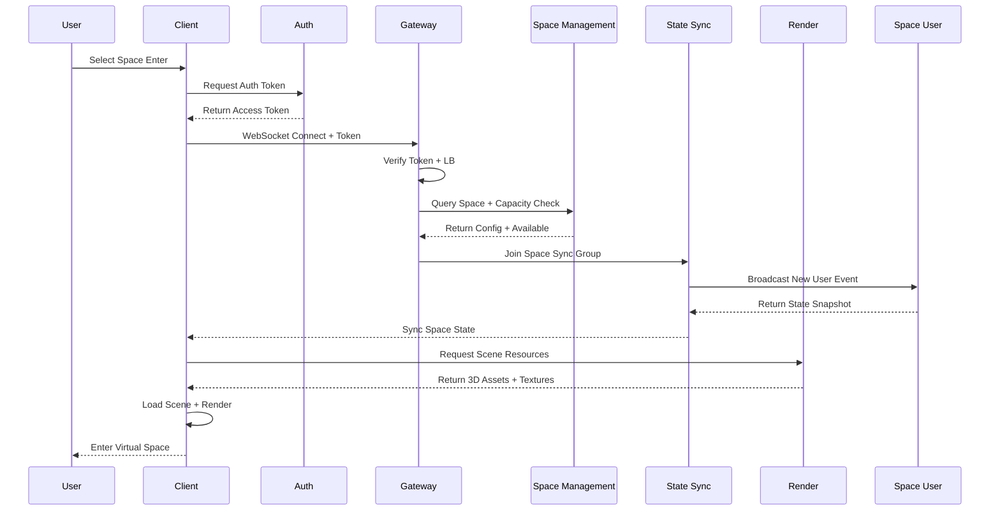
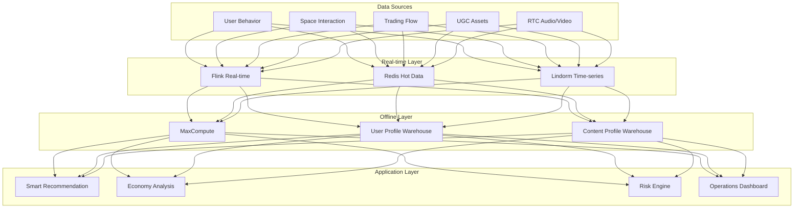
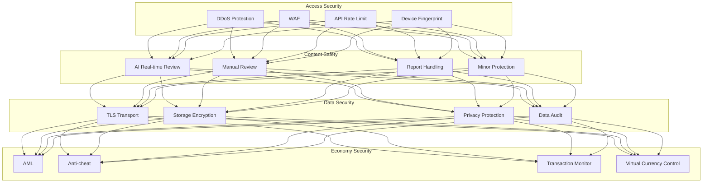

# Social Gaming and Metaverse Social Architecture Design - Alibaba Cloud Perspective

> **Applicable Version**: Kubernetes v1.29 - v1.33 | **Last Updated**: 2026-05-18
> **Author**: Alibaba Cloud Solutions Architect | **Tags**: `#social-gaming` `#metaverse` `#virtual-social` `#alibaba-cloud`

---

## Table of Contents

1. [Industry Overview](#1-industry-overview)
2. [Business Scenarios](#2-business-scenarios)
3. [Architecture Design](#3-architecture-design)
4. [Core Technology Stack](#4-core-technology-stack)
5. [K8s Deployment](#5-k8s-deployment)
6. [Data Architecture](#6-data-architecture)
7. [AI/ML Components](#7-aiml-components)
8. [Security and Compliance](#8-security-and-compliance)
9. [Best Practices](#9-best-practices)
10. [Anti-Patterns](#10-anti-patterns)
11. [Reference Resources](#11-reference-resources)

---

## 1. Industry Overview

### 1.1 Industry Background and Trends

Social gaming and metaverse social represents the most innovative and growth-potential digital economy domain. Global metaverse social market size projected to exceed USD 100 billion in 2026, CAGR over 30%. China's social gaming user base exceeds 600 million, metaverse social transitioning from concept exploration to commercialization.

Metaverse social combines gamification interaction, virtual identity, digital assets, and social relationship chains creating new online social experience. Core features include immersive 3D environments, real-time multi-user interaction, user-generated content (UGC) ecosystem, virtual economy, cross-platform interoperability. Technology drivers include GPU cloud rendering, 5G low-latency, AI digital humans, blockchain asset confirmation.

### 1.2 Core Challenges and Architecture Impact

| Challenge | Description | Architecture Impact |
|:---|:---|:---|
| Real-time State Sync | User position/action sync in virtual spaces | State sync servers + UDP optimization |
| Thousands On Screen | Large virtual events high concurrency | Space partitioning + interest management + LOD |
| UGC Content Ecosystem | User creation security and storage | Content review + asset storage + copyright |
| Cross-platform Rendering | PC/VR/mobile consistent experience | Cloud rendering + multi-endpoint adaptation |
| Virtual Economy | Currency issuance, circulation, anti-inflation | Economic model + trading + blockchain |
| Audio-Video Interaction | Real-time voice/expression/action | RTC + motion capture + expression driving |
| Content Safety | UGC compliance and minor protection | AI review + real-time monitoring + rating |

---

## 2. Business Scenarios

### 2.1 Core Business Scenarios

- **Virtual Space Management**: 3D world/room/scene creation, management, persistence
- **Avatar System**: Avatar creation, customization, expression/action driving
- **Social Interaction**: Voice chat, text, actions, gift tipping
- **UGC Creation**: Virtual construction/props/clothing/scenes creation and trading
- **Virtual Economy**: Virtual currency, virtual goods, marketplace, creator revenue share
- **Virtual Events**: Concerts, exhibitions, launches, social parties
- **Digital Human Service**: AI-driven virtual customer service, hosts, NPCs

### 2.2 Virtual Space Entry Flow



---

## 3. Architecture Design

### 3.1 System Full-Stack Architecture

```mermaid
graph TB
    subgraph ClientLayer["Client Layer"]
        C1[PC Client]
        C2[Mobile App]
        C3[VR Headset]
        C4[Web Browser]
    end

    subgraph GatewayLayer["Ingress Layer"]
        G1[WebSocket Gateway]
        G2[UDP State Sync Gateway]
        G3[RTC Audio/Video Gateway]
        G4[API Gateway]
    end

    subgraph CoreServices["Core Service Layer"]
        S1[Space Management]
        S2[Avatar Service]
        S3[UGC Asset Service]
        S4[Social Graph]
        S5[Virtual Economy]
        S6[Content Review]
        S7[Messaging]
        S8[Event Management]
    end

    subgraph AI["AI Intelligence"]
        A1[Digital Human AI]
        A2[Content Review AI]
        A3[Recommendation]
        A4[Speech Recognition/TTS]
    end

    subgraph Infrastructure["Infrastructure"]
        I1[GPU Render Cluster]
        I2[Object Storage OSS]
        I3[CDN]
        I4[Blockchain BaaS]
        I5[Lindorm Time-series]
        I6[PolarDB Database]
        I7[Redis Cache]
        I8[RocketMQ Message]
    end

    C1 & C2 & C3 & C4 --> G1 & G2 & G3 & G4
    G1 & G2 & G3 & G4 --> S1 & S2 & S3 & S4 & S5 & S6 & S7 & S8
    S1 & S2 & S3 & S6 --> A1 & A2 & A3 & A4
    S1 & S2 & S3 & S4 & S5 & S6 & S7 & S8 --> I1 & I2 & I3 & I4 & I5 & I6 & I7 & I8
```



---

## 4. Core Technology Stack

| Layer | Technology Selection | Description |
|:---|:---|:---|
| Client Engine | Unity / Unreal Engine | 3D Rendering |
| Mobile | Flutter + Unity | Cross-platform |
| Web | Three.js + WebXR | Browser 3D |
| State Sync | Custom Framework | Deterministic + client predict |
| API Gateway | APISIX | Routing, rate limit, auth |
| Microservices | Spring Cloud Alibaba | Service governance |
| Message Queue | RocketMQ | Async messaging |
| Primary DB | PolarDB MySQL | Core business |
| Cache | Redis Cluster | Hot data + session |
| Time-Series DB | Lindorm | Behavior, status |
| Object Storage | OSS + CDN | 3D models, textures |
| RTC | Alibaba Cloud RTC | Voice, video |
| GPU Rendering | GN7/GN10 | Cloud rendering |
| AI | PAI + Vision AI | Content review, digital humans |
| Blockchain | Ant Chain BaaS | Asset confirmation |
| Search | OpenSearch | UGC search |
| Container | ACK Pro + GPU | K8s cluster |
| Observability | ARMS + SLS | Full-link monitoring |

---

## 5. K8s Deployment

### 5.1 State Sync Service (StatefulSet)

```yaml
apiVersion: apps/v1
kind: StatefulSet
metadata:
  name: state-sync-server
  namespace: social-gaming
spec:
  serviceName: state-sync-server
  replicas: 10
  selector:
    matchLabels:
      app: state-sync-server
  template:
    metadata:
      labels:
        app: state-sync-server
        tier: core
    spec:
      hostNetwork: true
      affinity:
        podAntiAffinity:
          requiredDuringSchedulingIgnoredDuringExecution:
            - labelSelector:
                matchExpressions:
                  - key: app
                    operator: In
                    values: ["state-sync-server"]
              topologyKey: kubernetes.io/hostname
      containers:
        - name: sync
          image: registry.cn-hangzhou.aliyuncs.com/social/state-sync:v3.0.0
          ports:
            - containerPort: 8080
              name: http-api
            - containerPort: 9999
              name: udp-sync
              protocol: UDP
          env:
            - name: SYNC_MODE
              value: "deterministic-lockstep"
            - name: MAX_PLAYERS_PER_ROOM
              value: "100"
            - name: TICK_RATE
              value: "60"
          resources:
            requests:
              memory: "4Gi"
              cpu: "2000m"
            limits:
              memory: "8Gi"
              cpu: "4000m"
```

### 5.2 Content Review AI Service (GPU)

```yaml
apiVersion: apps/v1
kind: Deployment
metadata:
  name: content-moderation
  namespace: social-gaming
spec:
  replicas: 5
  selector:
    matchLabels:
      app: content-moderation
  template:
    metadata:
      labels:
        app: content-moderation
        tier: ai
    spec:
      nodeSelector:
        accelerator: nvidia-t4
      runtimeClassName: nvidia
      containers:
        - name: moderation
          image: registry.cn-hangzhou.aliyuncs.com/social/content-moderation:v3.0.0-gpu
          env:
            - name: MODERATION_TYPES
              value: "image,text,audio,3d-model"
            - name: CONFIDENCE_THRESHOLD
              value: "0.85"
          resources:
            requests:
              nvidia.com/gpu: 1
              memory: "8Gi"
              cpu: "4000m"
            limits:
              nvidia.com/gpu: 1
              memory: "16Gi"
              cpu: "8000m"
```

---

## 6. Data Architecture

### 6.1 Data Layered Architecture



---

## 7. AI/ML Components

| AI Capability | Model Type | Input | Output | Performance |
|:---|:---|:---|:---|:---|
| Digital Human Drive | Multi-modal Custom | Text/Voice | Action+Expression+Voice | Latency < 200ms |
| Content Review | Multi-modal Detection | Image/Text/3D | Compliant/Violation/Pending | P99 < 300ms |
| Smart Recommendation | DeepFM + Transformer | User Profile+Context | Recommend Space/Friend/Good | P99 < 100ms |
| Voice Transcription | Whisper Fine-tuned | Voice Stream | Text | Real-time Stream |
| 3D Asset Classification | PointNet++/3D-CNN | 3D Model File | Category+Tags | P99 < 500ms |
| Anti-cheat | GNN + Anomaly | User Behavior | Risk Score | P99 < 50ms |

---

## 8. Security and Compliance

### 8.1 Security Architecture



---

## 9. Best Practices

1. **Deterministic Sync**: Use lockstep with client prediction and server rollback
2. **Space Partitioning**: Partition large spaces, users only receive relevant area updates
3. **LOD Rendering**: Far objects low-precision, near objects progressive loading
4. **UGC Review Pipeline**: AI auto-review 95%, manual 5%, suspicious human re-review
5. **Virtual Economy Balance**: Cap currency inflation, periodic economic analysis
6. **Cloud Render Fallback**: Degrade to low-res or client render on poor network
7. **Blockchain Asset**: On-chain UGC confirmation, support secondary marketplace
8. **Audio-Video Adaptive**: Adjust encoding rate/FPS by bandwidth

---

## 10. Anti-Patterns

1. **Full State Sync**: All users receive full scene state, bandwidth overload. Use partitioning
2. **Unlimited Currency**: Unlimited issuance causes inflation. Set cap + economic balance
3. **No Content Review**: UGC direct shelving, violations spread. AI+manual dual review
4. **Single Render**: All devices unified cloud or client. Adaptive by capability/network
5. **No Anti-addic**: No time/spending limits. Mandatory anti-addiction + minor protection
6. **Real-time Large Files**: 3D model real-time transfer, slow loading. Preload+progressive+LOD
7. **Full State Storage**: Save every frame, high storage. Keyframe + delta + periodic compress

---

## 11. Reference Resources

### 11.1 Alibaba Cloud Component Mapping

| Functionality | Alibaba Cloud | Description |
|:---|:---|:---|
| Container | ACK Pro + GPU | K8s + GPU Cloud Render |
| GPU | GN7/GN10 | Cloud Render GPU |
| RTC | Alibaba RTC | Voice/Video |
| Object Storage | OSS + CDN | 3D Asset Storage |
| Database | PolarDB + Lindorm | Structured + Time-series |
| Cache | Redis Enterprise | Session, Hot Data |
| AI | PAI / Vision AI | Review, Digital Human |
| Blockchain | Ant Chain BaaS | Asset Confirmation |
| Message Queue | RocketMQ | Async Messaging |
| Observability | ARMS + SLS | Full-link Monitoring |

### 11.2 Production Checklist

- [ ] State sync P99 latency < 100ms
- [ ] Thousands-on-screen stress test pass
- [ ] Voice MOS > 4.0
- [ ] UGC review coverage > 99%
- [ ] Anti-inflation testing
- [ ] Anti-addiction system verification
- [ ] VR 90FPS stability
- [ ] Cloud render session < 3s
- [ ] Blockchain asset confirmation complete
- [ ] Disaster recovery RTO < 15min

---

**Maintainer**: Alibaba Cloud Solutions Architect Team | **License**: MIT

<!-- risk-assessed -->
