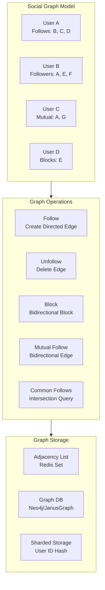
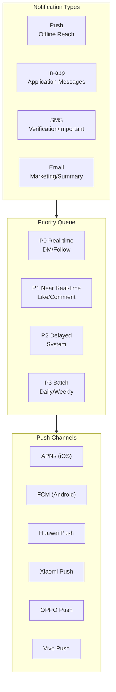
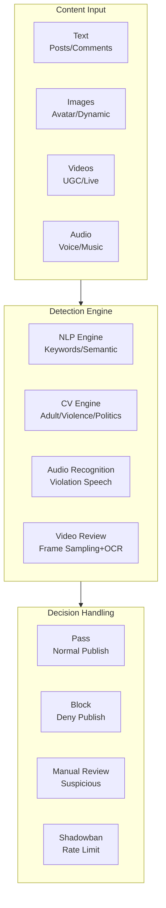
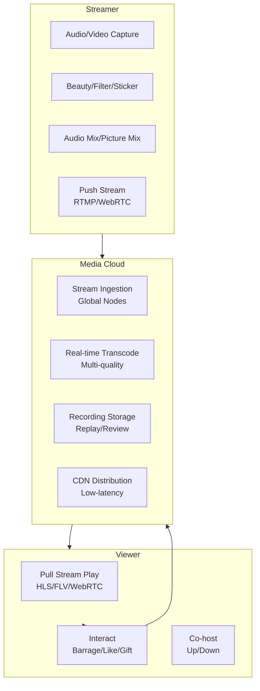
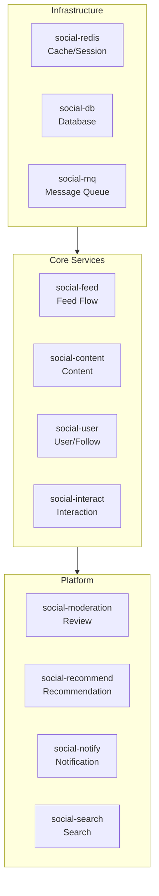

# Social Media Platform Kubernetes Production Architecture

> **Applicable Scenarios**: Community forums / Short video / Live social / Interest-based social / Professional social / Anonymous social
> **Applicable Version**: Kubernetes v1.29 - v1.33
> **Last Updated**: 2026-04-24
> **Target Audience**: Social product architects, technology leads, SRE

---

## Table of Contents

- [1. Overall Architecture Overview](#1-overall-architecture-overview)
- [2. Content Publishing and Feed Architecture](#2-content-publishing-and-feed-architecture)
- [3. Follow Relationships and Social Graph](#3-follow-relationships-and-social-graph)
- [4. Messaging and Notifications](#4-messaging-and-notifications)
- [5. Content Review and Security](#5-content-review-and-security)
- [6. Recommendations and Personalization](#6-recommendations-and-personalization)
- [7. Live Streaming and Real-time Interaction](#7-live-streaming-and-real-time-interaction)
- [8. K8s Deployment Architecture](#8-k8s-deployment-architecture)

---

## 1. Overall Architecture Overview

```mermaid
flowchart TB
    subgraph Users["User Layer"]
        CREATOR["Content Creators<br/>UGC/PGC"]
        CONSUMER["Content Consumers<br/>Browse/Interact"]
        INFLUENCER["KOLs / Influencers<br/>Fan Management"]
    end

    subgraph Gateway["Gateway Layer"]
        DNS["Smart DNS"]
        CDN["CDN<br/>Static+Dynamic"]
        API_GW["API Gateway<br/>Rate Limit/Auth/Route"]
    end

    subgraph CoreServices["Core Service Layer"]
        FEED["Feed Service<br/>Push/Pull"]
        CONTENT["Content Service<br/>Publish/Edit/Manage"]
        USER_SVC["User Service<br/>Profile/Follow/Followers"]
        INTERACT["Interaction Service<br/>Like/Comment/Share"]
        SEARCH["Search Service<br/>Content/User/Topic"]
        RECOMMEND["Recommendation<br/>Personalized Feed"]
    end

    subgraph PlatformServices["Platform Services"]
        NOTIFICATION["Notification Center<br/>Push/In-app"]
        MODERATION["Content Review<br/>Machine+Manual"]
        ANALYTICS["Analytics<br/>Creator Dashboard"]
        MONETIZE["Monetization<br/>Ads/Shopping/Rewards"]
    end

    subgraph DataLayer["Data Layer"]
        FEED_CACHE["Feed Cache<br/>Redis/TiKV"]
        GRAPH_DB["Graph DB<br/>Neo4j/JanusGraph"]
        MEDIA_STORE["Media Storage<br/>Object Storage+CDN"]
        TS_DB["Time-series<br/>Activity/Trends"]
    end

    Users --> Gateway --> CoreServices --> PlatformServices --> DataLayer
    CoreServices --> DataLayer
```



---

## 2. Content Publishing and Feed Architecture

### Feed Push/Pull Model

```mermaid
flowchart TB
    subgraph PushModel["Push Model"]
        P_PUBLISH["User A Publish"]
        P_FANS["Followers List<br/>100k Followers"]
        P_WRITE["Write to Follower Inbox<br/>100k Writes"]
        P_READ["Followers Read<br/>1 Read"]
        P_PUBLISH --> P_FANS --> P_WRITE --> P_READ
    end

    subgraph PullModel["Pull Model"]
        L_PUBLISH["User A Publish<br/>Write Own Inbox"]
        L_FANS["Followers Read"]
        L_QUERY["Query Follow List<br/>1000 Follows"]
        L_MERGE["Merge Timeline<br/>Aggregate Sort"]
        L_PUBLISH --> L_FANS --> L_QUERY --> L_MERGE
    end

    subgraph Hybrid["Hybrid Model"]
        H_PUBLISH["User A Publish"]
        H_FANS_ACTIVE["Active Followers<br/>Push to Inbox"]
        H_FANS_INACTIVE["Inactive Followers<br/>Pull on Read"]
        H_READ["Followers Read"]
        H_PUBLISH --> H_FANS_ACTIVE --> H_READ
        H_PUBLISH --> H_FANS_INACTIVE
        H_FANS_INACTIVE --> H_READ
    end

    style PushModel fill:#e3f2fd
    style PullModel fill:#fff8e1
    style Hybrid fill:#c8e6c9
```



### Feed Write Flow

```yaml
# Feed Service K8s Configuration
apiVersion: apps/v1
kind: Deployment
metadata:
  name: feed-service
  namespace: social-media
spec:
  replicas: 10
  selector:
    matchLabels:
      app: feed-service
  template:
    metadata:
      labels:
        app: feed-service
    spec:
      containers:
        - name: feed
          image: social/feed-service:v2.0
          env:
            - name: REDIS_CLUSTER
              value: "redis-cluster:6379"
            - name: CASSANDRA_HOSTS
              value: "cassandra-0:9042,cassandra-1:9042"
            - name: FANOUT_BATCH_SIZE
              value: "1000"
          resources:
            requests:
              cpu: "2"
              memory: "4Gi"
            limits:
              cpu: "8"
              memory: "16Gi"
---
# Fanout Worker for Large Accounts
apiVersion: apps/v1
kind: Deployment
metadata:
  name: fanout-worker
  namespace: social-media
spec:
  replicas: 20
  selector:
    matchLabels:
      app: fanout-worker
  template:
    metadata:
      labels:
        app: fanout-worker
    spec:
      containers:
        - name: worker
          image: social/fanout-worker:v2.0
          env:
            - name: KAFKA_BROKERS
              value: "kafka:9092"
            - name: CONSUMER_GROUP
              value: "fanout-workers"
          resources:
            requests:
              cpu: "1"
              memory: "2Gi"
            limits:
              cpu: "4"
              memory: "8Gi"
```

---

## 3. Follow Relationships and Social Graph



---

## 4. Messaging and Notifications



---

## 5. Content Review and Security



---

## 6. Recommendations and Personalization

```yaml
# Content Moderation Worker K8s Deployment
apiVersion: apps/v1
kind: Deployment
metadata:
  name: content-moderation-worker
  namespace: social-moderation
spec:
  replicas: 30
  selector:
    matchLabels:
      app: moderation-worker
  template:
    metadata:
      labels:
        app: moderation-worker
    spec:
      nodeSelector:
        node-type: gpu-inference
      tolerations:
        - key: nvidia.com/gpu
          operator: Exists
          effect: NoSchedule
      containers:
        - name: moderation
          image: social/moderation-ai:v2.0
          env:
            - name: MODEL_PATH
              value: "/models/content-safety"
            - name: CONFIDENCE_THRESHOLD
              value: "0.85"
          resources:
            requests:
              cpu: "2"
              memory: "8Gi"
              nvidia.com/gpu: "1"
            limits:
              cpu: "8"
              memory: "32Gi"
              nvidia.com/gpu: "1"
```

---

## 7. Live Streaming and Real-time Interaction



---

## 8. K8s Deployment Architecture

### Social Media Namespace Organization



---

**Maintainer**: Alibaba Cloud Solutions Architect Team | **License**: MIT

<!-- risk-assessed -->
