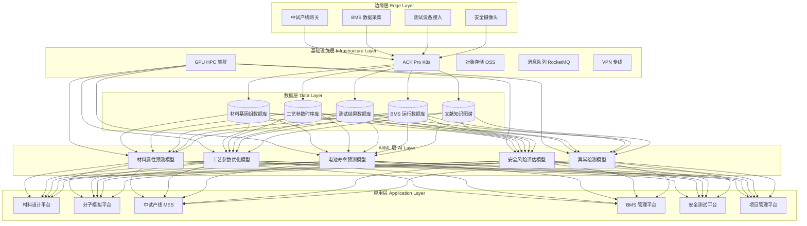
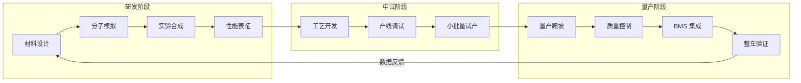
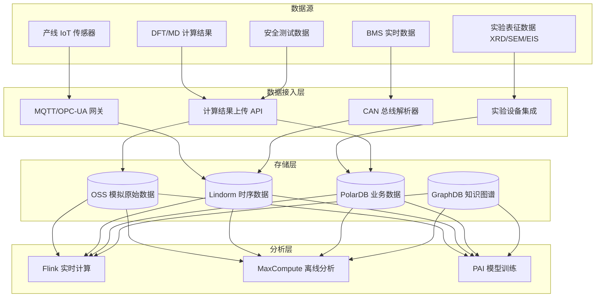
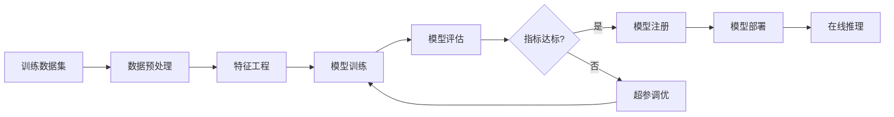

---title: 固态电池架构设计 — 阿里云视角
description: 'title: 固态电池架构设计'
summary: 'title: 固态电池架构设计'
category: general
tags:
- architecture
- best-practice
- scheduler
- prometheus
- argocd
- flux
- opa
- mysql
- job
- gpu
tier: supporting
created: '2026-05-23'
last_updated: 2026-05
difficulty: intermediate
reading_level: intermediate
audience:
- 所有工程师
estimated_read_time: 15min
intent_queries:
- 固态电池架构设计 — 阿里云视角 是什么
- 如何 固态电池架构设计 — 阿里云视角
- Kubernetes 20 application patterns 最佳实践
trigger_keywords:
- 固态电池架构设计
- 阿里云视角
- application
- patterns
prerequisites:
- kubectl-basics
- prometheus-basics
- gitops-basics
- mysql-basics
- gpu-scheduling-basics
- policy-basics
authors:
- name: Dillan Teagle
  role: contributor

---

> **生产环境安全提示**
>
> 本文档包含可直接执行的运维命令。执行前请确认：当前目标集群与 Namespace 是否正确；是否具备足够的 RBAC 权限；是否已在非生产环境验证。命令风险等级标注：🔴 高风险（可能造成数据丢失或服务中断）、🟡 中风险（会修改集群状态，但通常可回滚）、🟢 低风险/只读（信息收集，无副作用）。


title: 固态电池架构设计
description: '# 固态电池架构设计 — 阿里云视角'
category: application-architecture
tags:
- k8s
- architecture
- industry
- scheduler
- [[Prometheus|prometheus]]
- [[ArgoCD|argocd]]
- [[Flux|flux]]
- opa
- mysql
- job
last_updated: 2026-05-18
difficulty: advanced
reading_level: advanced
audience:
- 新能源电池架构师
- 材料科学计算工程师
- BMS 系统开发者
- 阿里云 HPC 解决方案架构师
estimated_read_time: 5min
intent_queries:
- 固态电池材料研发 HPC 高性能计算架构
- BMS 电池管理系统 Kubernetes 部署
- DFT 分子动力学模拟集群
- 电池 SOH 预测 AI 模型部署
- 固态电池中试产线数字孪生
trigger_keywords:
- 固态电池
- BMS
- 电池管理系统
- 材料模拟
- DFT计算
- 分子动力学
- SOC估算
- SOH预测
- 电池安全
- 储能
related_domains:
- domain-7-ai-ml-platform
- domain-03-networking-traffic
- domain-9-security-compliance
related_topics:
- domain-20-application-patterns/topic-application-architecture/88-nanomaterials
- domain-20-application-patterns/topic-application-architecture/15-energy-power-architecture
k8s_versions:
- '1.28'
- '1.29'
- '1.30'
- '1.31'
- '1.32'
---

# 固态电池架构设计 — 阿里云视角

> **适用版本**: Kubernetes v1.29 - v1.33 | **最后更新**: 2026-05-18
> **作者**: 阿里云解决方案架构师 | **标签**: `#固态电池` `#电池研发` `#BMS` `#材料模拟` `#阿里云`

---

<!-- chunk: 目录 -->## 目录

1. [行业概述](#1-行业概述)
2. [业务场景](#2-业务场景)
3. [架构设计](#3-架构设计)
4. [核心技术栈](#4-核心技术栈)
5. [Kubernetes 部署方案](#5-kubernetes-部署方案)
6. [数据架构](#6-数据架构)
7. [AI/ML 组件](#7-aiml-组件)
8. [安全与合规](#8-安全与合规)
9. [最佳实践](#9-最佳实践)
10. [反模式](#10-反模式)
11. [参考资源](#11-参考资源)

---

<!-- chunk: 1. 行业概述 -->## 1. 行业概述

## 1.1 市场规模与趋势

固态电池是下一代动力电池的核心方向，全球市场规模预计在 2030 年突破 400 亿美元。主要驱动力包括电动汽车续航焦虑、储能安全需求以及消费电子轻薄化趋势。丰田、三星 SDI、宁德时代、QuantumScape 等企业已投入数十亿美元进行研发。全固态电池能量密度有望达到 500 Wh/kg，远超当前液态锂电池的 250-300 Wh/kg。

| 指标 | 2024 年 | 2026 年（预测） | 2030 年（预测） |
|:---|:---|:---|:---|
| 全球市场规模 | $25B | $65B | $400B |
| 能量密度（实验室） | 400 Wh/kg | 450 Wh/kg | 500+ Wh/kg |
| 循环寿命 | 500 次 | 1000 次 | 3000+ 次 |
| 固态电解质类型 | 硫化物/氧化物/聚合物 | 硫化物为主流 | 复合固态电解质 |
| 主要应用 | 消费电子/医疗 | 低速车/储能 | EV/航空航天 |

## 1.2 行业痛点

| 痛点 | 说明 | 数字化转型驱动 |
|:---|:---|:---|
| 材料研发 | 固态电解质筛选空间巨大，传统试错法效率低 | AI + 高通量计算加速材料发现 |
| 界面问题 | 固-固界面阻抗大，接触不良导致性能衰减 | 分子动力学模拟界面行为 |
| 生产工艺 | 全固态电池制造难度大，良率低 | 产线数字孪生 + 工艺参数优化 |
| 安全管理 | 热失控预防与电池寿命预测 | BMS 实时监控 + AI 预测性维护 |
| 性能验证 | 长循环寿命测试周期长达数月 | 加速老化模型 + 数据闭环 |
| 成本控制 | 硫化物电解质成本高 | 工艺仿真优化降本 |

## 1.3 数字化转型架构影响

固态电池研发到量产涉及大量计算密集型任务（DFT/MD/FEA）、高吞吐数据采集（中试产线）、实时监控（BMS）和安全合规（电池安全标准）。整体架构需要覆盖 HPC 高性能计算、IoT 数据采集、AI 模型训练与推理、以及完整的数据溯源与审计链路。

---

<!-- chunk: 2. 业务场景 -->## 2. 业务场景

## 2.1 材料设计与筛选

通过高通量计算和 AI 模型筛选固态电解质和电极材料。系统需要支持 DFT（密度泛函理论）、MD（分子动力学）等第一性原理计算，结合材料基因组数据库进行大规模虚拟筛选。每日计算任务可达数千个，需要 GPU 集群和 HPC 调度系统支撑。

**核心流程**: 目标属性定义 → 候选材料生成 → DFT/MD 计算 → 性能评估 → AI 排序 → 实验验证 → 数据反馈

## 2.2 分子模拟与界面分析

针对固态电解质与电极的界面问题，进行原子尺度的分子动力学模拟。模拟系统需要支持数百万原子的长时间模拟，分析离子传导路径、界面副反应和机械应力分布。输出包括离子电导率、界面阻抗谱、以及机械稳定性评估。

## 2.3 中试产线数字化

中试产线包含配料搅拌、涂布烘干、叠片封装、化成测试等环节。通过 IoT 传感器实时采集温度、湿度、压力、厚度等工艺参数，结合数字孪生模型进行工艺参数优化和良率预测。

**核心流程**: 原料配比 → 搅拌涂布 → 辊压分切 → 叠片/卷绕 → 注液/固化 → 化成分容 → 性能测试

## 2.4 BMS 电池管理系统

固态电池 BMS 需要实现电池状态估计（SOC/SOH/SOP）、均衡控制、热管理、故障诊断和寿命预测。通过实时采集电压、电流、温度数据，结合 AI 模型进行精准的状态估算和问题预警。

## 2.5 安全测试与认证

支持针刺、挤压、过充、热箱等安全测试的数字化管理。测试数据需要完整记录、可追溯，满足 UN38.3、GB/T 31485、IEC 62660 等标准要求。

---

<!-- chunk: 3. 架构设计 -->## 3. 架构设计

## 3.1 固态电池全景架构



## 3.2 研发到量产全流程



---

<!-- chunk: 4. 核心技术栈 -->## 4. 核心技术栈

| Component | Purpose | Technology | License |
|:---|:---|:---|:---|
| Container Orchestration | Workload scheduling & management | ACK Pro (Kubernetes 1.29+) | Proprietary |
| GPU Computing | DFT/MD/ML training | NVIDIA A100/H100, CUDA 12.x | Proprietary |
| HPC Scheduler | Job queue & resource allocation | Slurm / E-HPC | GPL / Proprietary |
| DFT Engine | First-principles electronic structure | VASP 6.x / Quantum ESPRESSO | Academic / GPL |
| MD Engine | Molecular dynamics simulation | GROMACS / LAMMPS | LGPL / GPL |
| AI Framework | Model training & inference | PyTorch 2.x / PAI | BSD / Proprietary |
| Time-Series DB | IoT sensor data storage | Lindorm TSDB / InfluxDB | Proprietary / MIT |
| Relational DB | Business data management | PolarDB MySQL 8.x | Proprietary |
| Object Storage | Simulation results & model artifacts | Aliyun OSS | Proprietary |
| Message Queue | Async event processing | Apache RocketMQ 5.x | Apache 2.0 |
| Data Lake | Large-scale analytics | MaxCompute / DataWorks | Proprietary |
| Visualization | 3D molecular / battery rendering | DataV / Three.js | Proprietary / MIT |
| Monitoring | Observability & alerting | ARMS + SLS + Prometheus | Proprietary / Apache 2.0 |
| IoT Platform | Device management & data collection | Aliyun IoT Platform | Proprietary |
| CI/CD | Automated build & deploy | CloudFlow / ArgoCD | Proprietary / Apache 2.0 |
| Knowledge Graph | Materials & literature relationships | Graph Database (GDB) | Proprietary |

---

<!-- chunk: 5. Kubernetes 部署方案 -->## 5. Kubernetes 部署方案

## 5.1 材料模拟 GPU Job

```yaml
apiVersion: batch/v1
kind: Job
metadata:
  name: dft-calculation-001
  namespace: solid-state-battery
  labels:
    app: dft-calculation
    type: material-simulation
spec:
  completions: 1
  parallelism: 1
  backoffLimit: 3
  activeDeadlineSeconds: 86400
  template:
    metadata:
      labels:
        app: dft-calculation
    spec:
      nodeSelector:
        accelerator: nvidia-a100
      runtimeClassName: nvidia
      priorityClassName: high-priority
      containers:
        - name: dft
          image: registry.cn-hangzhou.aliyuncs.com/battery/vasp:v6.4.0-gpu
          command: ["mpirun", "-np", "8", "vasp_std"]
          env:
            - name: OMP_NUM_THREADS
              value: "8"
            - name: MPI_DURING_DP
              value: "true"
          resources:
            requests:
              nvidia.com/gpu: 2
              memory: "128Gi"
              cpu: "32000m"
              ephemeral-storage: "100Gi"
            limits:
              nvidia.com/gpu: 2
              memory: "256Gi"
              cpu: "64000m"
              ephemeral-storage: "200Gi"
          volumeMounts:
            - name: input-potential
              mountPath: /input
              readOnly: true
            - name: output-results
              mountPath: /output
            - name: potcar-data
              mountPath: /potcars
              readOnly: true
            - name: tmp-scratch
              mountPath: /tmp/vasp-scratch
          livenessProbe:
            exec:
              command: ["test", "-f", "/tmp/vasp-running"]
            initialDelaySeconds: 60
            periodSeconds: 120
            failureThreshold: 3
      volumes:
        - name: input-potential
          persistentVolumeClaim:
            claimName: dft-input-pvc
        - name: output-results
          persistentVolumeClaim:
            claimName: dft-output-pvc
        - name: potcar-data
          persistentVolumeClaim:
            claimName: potcar-library-pvc
        - name: tmp-scratch
          emptyDir:
            medium: "Memory"
            sizeLimit: "64Gi"
      restartPolicy: Never
```

## 5.2 BMS 数据采集 Deployment

```yaml
apiVersion: apps/v1
kind: Deployment
metadata:
  name: bms-data-collector
  namespace: solid-state-battery
  labels:
    app: bms-data-collector
spec:
  replicas: 4
  selector:
    matchLabels:
      app: bms-data-collector
  strategy:
    rollingUpdate:
      maxSurge: 1
      maxUnavailable: 0
  template:
    metadata:
      labels:
        app: bms-data-collector
      annotations:
        prometheus.io/scrape: "true"
        prometheus.io/port: "9090"
    spec:
      affinity:
        podAntiAffinity:
          preferredDuringSchedulingIgnoredDuringExecution:
            - weight: 100
              podAffinityTerm:
                labelSelector:
                  matchLabels:
                    app: bms-data-collector
                topologyKey: topology.kubernetes.io/zone
      containers:
        - name: collector
          image: registry.cn-hangzhou.aliyuncs.com/battery/bms-collector:v2.1.0
          ports:
            - containerPort: 8080
              name: http
            - containerPort: 9090
              name: metrics
          env:
            - name: MQTT_BROKER
              valueFrom:
                secretKeyRef:
                  name: bms-secrets
                  key: mqtt-broker-url
            - name: DB_CONNECTION_STRING
              valueFrom:
                secretKeyRef:
                  name: bms-secrets
                  key: db-connection
            - name: SAMPLING_RATE_HZ
              value: "100"
            - name: BATCH_SIZE
              value: "1000"
            - name: FLUSH_INTERVAL_MS
              value: "500"
          resources:
            requests:
              memory: "2Gi"
              cpu: "1000m"
            limits:
              memory: "4Gi"
              cpu: "2000m"
          readinessProbe:
            httpGet:
              path: /health/ready
              port: 8080
            initialDelaySeconds: 10
            periodSeconds: 5
          livenessProbe:
            httpGet:
              path: /health/live
              port: 8080
            initialDelaySeconds: 15
            periodSeconds: 10
```

## 5.3 BMS 服务与 ConfigMap

```yaml
apiVersion: v1
kind: Service
metadata:
  name: bms-data-collector
  namespace: solid-state-battery
spec:
  selector:
    app: bms-data-collector
  ports:
    - name: http
      port: 8080
      targetPort: 8080
    - name: metrics
      port: 9090
      targetPort: 9090
  type: ClusterIP
---
apiVersion: v1
kind: ConfigMap
metadata:
  name: bms-config
  namespace: solid-state-battery
data:
  SOC_MODEL_PATH: "/models/soc_estimator_v3.onnx"
  SOH_MODEL_PATH: "/models/soh_predictor_v2.onnx"
  THERMAL_MODEL_PATH: "/models/thermal_predictor_v1.onnx"
  ALERT_THRESHOLDS: |
    {
      "voltage_high": 4.25,
      "voltage_low": 2.5,
      "temperature_high": 60,
      "temperature_low": -20,
      "current_high": 300,
      "soc_delta_alert": 5
    }
  SAMPLING_CONFIG: |
    {
      "voltage_interval_ms": 10,
      "current_interval_ms": 10,
      "temperature_interval_ms": 1000,
      "aggregate_window_s": 60
    }
---
apiVersion: v1
kind: Secret
metadata:
  name: bms-secrets
  namespace: solid-state-battery
type: Opaque
stringData:
  mqtt-broker-url: "ssl://mqtt.bms.example.com:8883"
  db-connection: "mysql://bms_user@polardb.battery.rds.aliyuncs.com:3306/bms_db"
  encryption-key: "aes-256-gcm-key-placeholder"
```

---

<!-- chunk: 6. 数据架构 -->## 6. 数据架构

## 6.1 数据流全景



## 6.2 数据流说明

- **计算数据流**: DFT/MD 计算结果通过 API 上传至 OSS，元数据存入 PolarDB，支持结果检索与复用
- **IoT 数据流**: 产线传感器通过 MQTT 网关接入，经 Flink 实时清洗后写入 Lindorm 时序库
- **BMS 数据流**: 电池运行数据通过 CAN 总线解析，经边缘计算节点预处理后上传云端
- **知识图谱**: 材料-工艺-性能关系建模为知识图谱，支撑材料推荐与工艺优化

---

<!-- chunk: 7. AI/ML 组件 -->## 7. AI/ML 组件

## 7.1 模型训练流水线



## 7.2 核心模型

| 模型 | 用途 | 输入 | 输出 | 框架 |
|:---|:---|:---|:---|:---|
| 材料属性预测 | 预测固态电解质离子电导率 | 晶体结构 / 分子描述符 | 电导率 / 稳定性评分 | PyTorch + DGL |
| 工艺参数优化 | 优化涂布/烘干/叠片参数 | 工艺参数 + 良率数据 | 最优参数推荐 | PAI AutoML |
| SOC 估算 | 电池荷电状态精准估算 | V/I/T 时序数据 | SOC 值 (%) | LSTM + Attention |
| SOH 预测 | 电池健康度与寿命预测 | 历史循环数据 | SOH (%) / RUL (cycles) | Transformer |
| 安全风险预测 | 热失控风险预警 | 实时运行数据 | 风险等级 (1-5) | XGBoost Ensemble |
| 异常检测 | 产线异常检测 | 传感器时序数据 | 异常分数 + 位置 | AutoEncoder |

## 7.3 数据管道

训练数据通过 DataWorks 数据集成管道从多个数据源汇聚到 MaxCompute 数据湖，经特征工程处理后生成训练样本集。在线推理服务部署在 ACK 上的 PAI-EAS 端点，支持 A/B 测试和模型灰度发布。

---

<!-- chunk: 8. 安全与合规 -->## 8. 安全与合规

## 8.1 行业法规与标准

| 法规/标准 | 适用范围 | 架构要求 |
|:---|:---|:---|
| GB/T 31485 | 电动汽车用动力蓄电池安全要求 | 安全测试数据完整追溯 |
| GB/T 38031 | 电动汽车用动力蓄电池安全要求 | 热失控预警系统 |
| UN38.3 | 锂电池运输安全测试 | 测试报告管理 |
| IEC 62660 | 二次锂离子电池性能测试 | 测试数据标准化 |
| ISO 26262 | 功能安全（汽车电子） | BMS 功能安全等级 ASIL-D |
| GB/T 35273 | 个人信息安全规范 | 实验人员数据保护 |
| 等保三级 | 工业控制系统安全 | 网络隔离 + 审计日志 |

## 8.2 安全架构要点

- **配方保密**: 核心固态电解质配方数据加密存储，访问需多因素认证
- **实验数据**: 全链路审计日志，操作不可抵赖
- **网络安全**: 研发网络与办公网络物理隔离，VPN 专线访问
- **灾备**: 跨区域数据备份，RPO < 1h，RTO < 4h

---

<!-- chunk: 9. 最佳实践 -->## 9. 最佳实践

1. **GPU 资源调度**: 使用 K8s PriorityClass 和预占策略，确保 DFT 计算高优先级任务优先获得 GPU 资源，避免材料研发任务被低优先级工作阻塞
2. **计算结果版本管理**: 对每次 DFT/MD 计算的输入参数、软件版本、计算结果建立版本化追踪，确保科研可重复性
3. **数据闭环设计**: 实验验证结果自动反馈至 AI 模型训练数据集，持续提升材料预测准确率
4. **中试产线数字孪生**: 在工艺参数变更前先在数字孪生环境验证，减少物理试错次数
5. **BMS 模型在线更新**: 通过 OTA 方式持续更新 SOC/SOH 估算模型，无需更换硬件
6. **分级存储策略**: 热数据（最近 30 天 BMS 运行数据）存 Lindorm，温数据（1 年内测试数据）存 PolarDB，冷数据（历史模拟结果）归档至 OSS 低频存储
7. **多租户项目管理**: 不同研发项目组数据逻辑隔离，共享 GPU 集群算力池
8. **安全测试自动化**: 针刺/挤压/过充测试设备自动联网，测试数据实时上传并自动生成合规报告
9. **材料知识图谱**: 构建材料-结构-性能-工艺多维知识图谱，支撑跨项目知识复用
10. **弹性计算**: 利用云端弹性 HPC 能力，在材料筛选高峰期临时扩容 GPU 节点

---

<!-- chunk: 10. 反模式 -->## 10. 反模式

1. **忽视计算可重复性**: 不记录软件版本、计算参数和环境配置，导致 DFT 计算结果无法复现。应使用容器化镜像 + 完整参数记录
2. **BMS 数据全量上云**: 将所有 100Hz 采样数据全量传输至云端，造成带宽浪费和延迟。应在边缘端进行聚合压缩，仅上传关键特征和告警
3. **单点 HPC 集群**: 所有计算任务依赖单一 HPC 集群，无故障切换能力。应采用混合云架构，关键计算任务可跨集群调度
4. **配方明文存储**: 核心电解质配方以明文存储在数据库中，任何有数据库访问权限的人都可以查看。应采用应用层加密 + 密钥管理服务（KMS）
5. **忽视安全标准更新**: 安全测试系统未跟进最新版 GB/T 标准更新，导致测试报告不被认可。应建立标准变更监控机制

---

<!-- chunk: 11. 参考资源 -->## 11. 参考资源

- [QuantumScape 技术白皮书](https://www.quantumscape.com/technology/)
- [Toyota Solid-State Battery Roadmap](https://global.toyota/newsroom/corporate/)
- [Materials Project - 开放材料数据库](https://materialsproject.org/)
- [VASP 官方文档](https://www.vasp.at/wiki/)
- [GROMACS 分子动力学手册](https://manual.gromacs.org/)
- [GB/T 31485-2015 电动汽车用动力蓄电池安全要求](https://openstd.samr.gov.cn/)
- [IEC 62660 二次锂离子电池标准](https://www.iec.ch/)
- [阿里云 E-HPC 文档](https://help.aliyun.com/product/118515.html)
- [PAI 机器学习平台](https://help.aliyun.com/product/30347.html)

---

**维护者**: 阿里云解决方案架构师团队 | **许可证**: MIT

---

<!-- chunk: Obsidian 相关文档 -->## Obsidian 相关文档

- topic-application-architecture MOC
- [[domain-20-application-patterns/topic-application-architecture/README.md|Topic 应用层架构设计最佳实践]]
- [[domain-20-application-patterns/topic-application-architecture/01-ecommerce-architecture.md|电商系统 Kubernetes 生产架构设计]]
- [[domain-20-application-patterns/topic-application-architecture/02-mini-program-architecture.md|小程序平台架构设计]]
- [[domain-20-application-patterns/topic-application-architecture/03-cms-architecture.md|内容管理系统 CMS 架构设计]]
- [[domain-20-application-patterns/topic-application-architecture/04-im-rtc-architecture.md|实时通信 IM/RTC 架构设计]]
- [[domain-20-application-patterns/topic-application-architecture/05-online-education-architecture.md|在线教育平台 Kubernetes 生产架构设计]]
- [[domain-20-application-patterns/topic-application-architecture/06-fintech-architecture.md|金融科技FinTech Kubernetes生产架构设计]]
- [[domain-20-application-patterns/topic-application-architecture/07-iot-platform-architecture.md|物联网 IoT 平台架构设计]]
- [[domain-20-application-patterns/topic-application-architecture/08-ai-ml-inference-architecture.md|AI/ML 推理服务 Kubernetes 生产架构设计]]
- [[domain-20-application-patterns/topic-application-architecture/09-gaming-backend-architecture.md|游戏后端 Kubernetes 生产架构设计]]
- [[domain-20-application-patterns/topic-application-architecture/10-social-media-architecture.md|社交媒体平台Kubernetes生产架构设计]]

## See Also

- 84-national-park
- 85-hydrogen-energy
- 87-flexible-manufacturing
- 88-nanomaterials

## Related

- topic-application-architecture MOC — Cross-reference


<!-- risk-assessed -->
