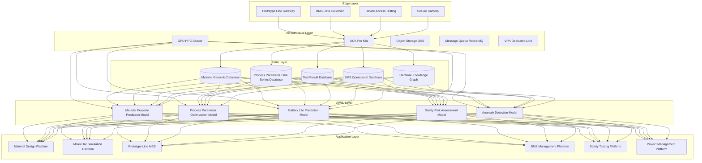
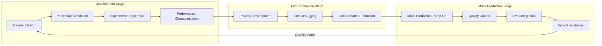
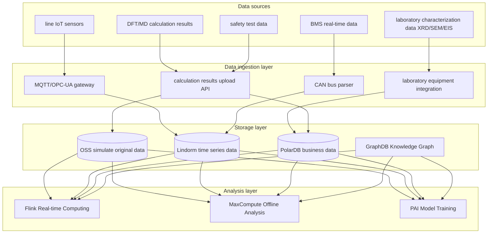
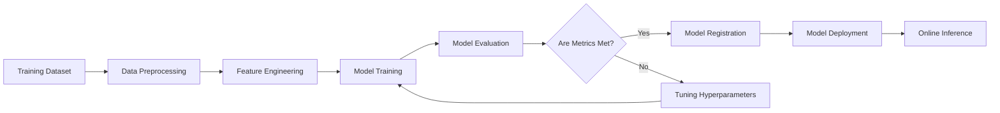

> **Production Environment Security Tips**
>
> This document contains executable operational commands. Execute them only after confirming: the target cluster and Namespace are correct; you have sufficient RBAC permissions; and the commands have been validated in a non-production environment. Risk level annotations for commands: 🔴 High Risk (may cause data loss or service disruption), 🟡 Medium Risk (modifies cluster state but usually rollbackable), 🟢 Low Risk/Read-Only (information gathering, no side effects).


title: Solid State Battery Architecture Design
description: '# Solid State Battery Architecture Design — From an Alibaba Cloud Perspective'
category: application-architecture
tags:
- k8s
- architecture
- industry
- scheduler
- [[Prometheus|prometheus]]
- [[ArgoCD|argocd]]
- [[Flux|flux]]
- opa
- mysql
- job
last_updated: 2026-05-18
difficulty: advanced
reading_level: advanced
audience:
- Solid State Battery Architect
- Material Science Computational Engineer
- BMS System Developer
- Alibaba Cloud HPC Solution Architect
estimated_read_time: 5min
intent_queries:
- HPC High-Performance Computing Architecture for Solid State Battery Materials Research
- Kubernetes Deployment for BMS Battery Management System
- DFT Molecular Dynamics Simulation Cluster
- Battery SOH Prediction AI Model Deployment
- Digital Twin for Solid-State Battery Pilot Line
trigger_keywords:
- Solid-State Battery
- BMS
- Battery Management System
- Material Simulation
- DFT Calculations
- Molecular Dynamics
- SOC Estimation
- SOH Prediction
- Battery Safety
- Storage
related_domains:
- domain-7-ai-ml-platform
- domain-03-networking-traffic
- domain-9-security-compliance
related_topics:
- domain-20-application-patterns/topic-application-architecture/88-nanomaterials
- domain-20-application-patterns/topic-application-architecture/15-energy-power-architecture
k8s_versions:
- '1.28'
- '1.29'
- '1.30'
- '1.31'
- '1.32'
---

# Solid-State Battery Architecture Design — From Alibaba Cloud Perspective

> **Applicable Version**: Kubernetes v1.29 - v1.33 | **Last Updated**: 2026-05-18
> **Author**: Alibaba Cloud Solution Architect | **Tags**: `#Solid-State-Battery` `#Battery-Research` `#BMS` `#Material-Simulation` `#Alibaba Cloud`

---

## Table of Contents

1. [Industry Overview](#1-industry-overview)
2. [Business Scenarios](#2-business-scenarios)
3. [Architecture Design](#3-architecture-design)
4. [Core Technology Stack](#4-core-technology-stack)
5. [Kubernetes Deployment Solution](#5-kubernetes-deployment-solution)
6. [Data Architecture](#6-data-architecture)
7. [AI/ML Components](#7-aiml-components)
8. [Security and Compliance](#8-security-and-compliance)
9. [Best Practices](#9-best-practices)
10. [Anti-pattern](#10-anti-patterns)
11. [Reference Resources](#11-references)

---

## 1. Industry Overview

## 1.1 Market Size and Trends

Solid-state batteries are the core direction for next-generation power battery systems, with global market size expected to exceed $40 billion by 2030. Key drivers include concerns over electric vehicle range anxiety, safety needs for energy storage, and trends towards lightweight and compact consumer electronics. Companies such as Toyota, Samsung SDI, CATL, and QuantumScape have invested billions in research and development. The theoretical energy density of solid-state batteries could reach 500 Wh/kg, significantly higher than the current 250-300 Wh/kg of liquid electrolyte batteries.

| Metric | 2024 | 2026 (forecast) | 2030 (forecast) |
|:---|:---|:---|:---|
| Global Market Size | $25B | $65B | $400B |
| Energy Density (laboratory) | 400 Wh/kg | 450 Wh/kg | 500+ Wh/kg |
| Cycle Life | 500 cycles | 1000 cycles | 3000+ cycles |
| Solid-State Electrolyte Type | Sulphides/Oxides/Polymer | Sulphides as mainstream | Composite solid-state electrolytes |
| Main Applications | Consumer Electronics/Medical | Low-speed vehicles/Storages | EV/Aerospace |

## 1.2 Industry Pain Points

| Pain Point | Description | Digital Transformation Driven |
|:---|:---|:---|
| Material Research | Significant space for screening solid-state electrolytes, traditional trial-and-error methods are inefficient | AI + High-throughput computing accelerate material discovery |
| Interface Issues | Large impedance at solid-solid interfaces leads to performance degradation due to poor contact | Molecular dynamics simulations of interface behavior |
| Production Processes | High difficulty and low yield in manufacturing solid-state batteries | Digital twin production lines + process parameter optimization |
| Security Management | Thermal Runaway Prevention and Battery Lifespan Prediction | Real-time Monitoring by BMS + Predictive Maintenance by AI |
| Performance Validation | Long-cycle Life Test Periods Lasting Several Months | Accelerated Aging Model + Data Loop |
| Cost Control | High Cost of Sulfide Electrolytes | Process Simulation Optimization for Cost Reduction |

## 1.3 Digital Transformation Architecture Impact

Developing and transitioning solid-state batteries to mass production involves numerous computationally intensive tasks (DFT/MD/FEA), high-throughput data collection (scale-up line), real-time monitoring (BMS), and safety compliance (battery safety standards). The overall architecture needs to cover HPC high-performance computing, IoT data collection, AI model training and inference, and complete data traceability and audit chains.

---

## 2. Business Scenarios

## 2.1 Material Design and Screening

Utilize high-throughput computing and AI models to screen solid-state electrolytes and electrode materials. The system should support DFT (Density Functional Theory), MD (Molecular Dynamics), and other first-principles calculations, combined with a material genome database for large-scale virtual screening. Daily computational tasks can reach several thousand, requiring support from GPU clusters and HPC scheduling systems.

**Core Workflow**: Define Target Attributes → Generate Candidate Materials → Perform DFT/MD Calculations → Evaluate Performance → Sort by AI → Experimental Verification → Feedback Data

## 2.2 Molecular Simulations and Interface Analysis

Conduct atomistic molecular dynamics simulations on interface issues between solid-state electrolytes and electrodes. The simulation system needs to support long-term simulations of millions of atoms, analyzing ion conduction pathways, interface side reactions, and mechanical stress distribution. Outputs include ion conductivity, interface impedance spectra, and stability assessments.

## 2.3 Digitalization of Pilot Production Lines

The pilot production line includes stages such as raw material mixing, coating drying, lamination packaging, and capacity testing. Real-time collection of parameters like temperature, humidity, pressure, and thickness through IoT sensors is combined with digital twin models to optimize process parameters and predict yield.

**Core Workflow**: Raw Material Ratio → Mixing Coating → Rolling Cutting → Lamination/Winding → Liquid Injection/Curing → Capacity Testing → Performance Testing

## 2.4 Solid-State Battery Management System (BMS)

The BMS for solid-state batteries must implement battery state estimation (SOC/SOH/SOP), equalization control, thermal management, fault diagnosis, and lifespan prediction. By real-time collecting voltage, current, and temperature data, AI models are used for precise state estimation and problem warnings.

## 2.5 Safety Testing and Certification

Supports digital management of safety tests including puncture, compression, overcharge, and thermal box tests. Test data must be fully recorded and traceable, meeting requirements for UN38.3, GB/T 31485, IEC 62660, among others.

---

## 3. Architecture Design

## 3.1 Panoramic Architecture of Solid-State Batteries


```mermaid
graph TB
    subgraph DataLayer["Data Layer"]
        D1[(Material Genomic Database)]
        D2[(Process Parameter Time Series Database)]
        D3[(Test Result Database)]
        D4[(BMS Operational Database)]
        D5[(Literature Knowledge Graph)]
    end

    subgraph AppLayer["Application Layer"]
        A1[Material Design Platform]
        A2[Molecular Simulation Platform]
        A3[Prototype Line MES]
        A4[BMS Management Platform]
        A5[Safety Testing Platform]
        A6[Project Management Platform]
    end

    subgraph AILayer["AI/ML Layer"]
        AI1[Material Property Prediction Model]
        AI2[Process Parameter Optimization Model]
        AI3[Battery Life Prediction Model]
        AI4[Safety Risk Assessment Model]
        AI5[Anomaly Detection Model]
    end

    subgraph InfraLayer["Infrastructure Layer"]
        I1[GPU HPC Cluster]
        I2[ACK Pro K8s]
        I3[Object Storage OSS]
        I4[Message Queue RocketMQ]
        I5[VPN Dedicated Line]
    end

    subgraph EdgeLayer["Edge Layer"]
        E1[Prototype Line Gateway]
        E2["BMS Data Collection"]
        E3[Device Access Testing]
        E4["Secure Camera"]
    end

    E1 & E2 & E3 & E4 --> I2
    I1 --> AI1 & AI2 & AI3 & AI4 & AI5
    D1 & D2 & D3 & D4 & D5 --> AI1 & AI2 & AI3 & AI4 & AI5
    AI1 & AI2 & AI3 & AI4 & AI5 --> A1 & A2 & A3 & A4 & A5 & A6
    I2 --> D1 & D2 & D3 & D4 & D5
```

## 3.2 Research to Mass Production Workflow


```mermaid
flowchart LR
    subgraph Development Stage 
        R1[Material Design]  --> R2[Molecular Simulation] 
        R2 --> R3[Experimental Synthesis] 
        R3 --> R4[Performance Characterization] 
    end
    subgraph Pilot Production Stage 
        R4 --> P1[Process Development] 
        P1 --> P2[Line Debugging] 
        P2 --> P3[Limited Batch Production] 
    end
    subgraph Mass Production Stage 
        P3 --> Q1[Mass Production Ramp-Up] 
        Q1 --> Q2[Quality Control] 
        Q2 --> Q3[BMS integration]
        Q3 --> Q4[Vehicle validation]
    end
    Q4 -->|data feedback| R1
```

---

## 4. Core Technology Stack

| Component | Purpose | Technology | License |
|:---|:---|:---|:---|
| Container Orchestration | Workload scheduling & management | ACK Pro (Kubernetes 1.29+) | Proprietary |
| GPU Computing | DFT/MD/ML training | NVIDIA A100/H100, CUDA 12.x | Proprietary |
| HPC Scheduler | Job queue & resource allocation | Slurm / E-HPC | GPL / Proprietary |
| DFT Engine | First-principles electronic structure | VASP 6.x / Quantum ESPRESSO | Academic / GPL |
| MD Engine | Molecular dynamics simulation | GROMACS / LAMMPS | LGPL / GPL |
| AI Framework | Model training & inference | PyTorch 2.x / PAI | BSD / Proprietary |
| Time-Series DB | IoT sensor data storage | Lindorm TSDB / InfluxDB | Proprietary / MIT |
| Relational DB | Business data management | PolarDB MySQL 8.x | Proprietary |
| Object Storage | Simulation results & model artifacts | Aliyun OSS | Proprietary |
| Message Queue | Async event processing | Apache RocketMQ 5.x | Apache 2.0 |
| Data Lake | Large-scale analytics | MaxCompute / DataWorks | Proprietary |
| Visualization | 3D molecular / battery rendering | DataV / Three.js | Proprietary / MIT |
| Monitoring | Observability & alerting | ARMS + SLS + Prometheus | Proprietary / Apache 2.0 |
| IoT Platform | Device management & data collection | Aliyun IoT Platform | Proprietary |
| CI/CD | Automated build & deploy | CloudFlow / ArgoCD | Proprietary / Apache 2.0 |
| Knowledge Graph | Materials & literature relationships | Graph Database (GDB) | Proprietary |

---

## 5. Kubernetes Deployment Solution

## 5.1 Material Simulation GPU Job

```yaml
apiVersion: batch/v1
kind: Job
metadata:
  name: dft-calculation-001
  namespace: solid-state-battery
  labels:
    app: dft-calculation
    type: material-simulation
spec:
  completions: 1
  parallelism: 1
  backoffLimit: 3
  activeDeadlineSeconds: 86400
  template:
    metadata:
      labels:
        app: dft-calculation
    spec:
      nodeSelector:
        accelerator: nvidia-a100
      runtimeClassName: nvidia
      priorityClassName: high-priority
      containers:
        - name: dft
          image: registry.cn-hangzhou.aliyuncs.com/battery/vasp:v6.4.0-gpu
          command: ["mpirun", "-np", "8", "vasp_std"]
          env:
            - name: OMP_NUM_THREADS
              value: "8"
            - name: MPI_DURING_DP
              value: "true"
          resources:
            requests:
              nvidia.com/gpu: 2
              memory: "128Gi"
              cpu: "32000m"
              ephemeral-storage: "100Gi"
            limits:
              nvidia.com/gpu: 2
              memory: "256Gi"
              cpu: "64000m"
              ephemeral-storage: "200Gi"
          volumeMounts:
            - name: input-potential
              mountPath: /input
              readOnly: true
            - name: output-results
              mountPath: /output
            - name: potcar-data
              mountPath: /potcars
              readOnly: true
            - name: tmp-scratch
              mountPath: /tmp/vasp-scratch
          livenessProbe:
            exec:
              command: ["test", "-f", "/tmp/vasp-running"]
            initialDelaySeconds: 60
            periodSeconds: 120
            failureThreshold: 3
      volumes:
        - name: input-potential
          persistentVolumeClaim:
            claimName: dft-input-pvc
        - name: output-results
          persistentVolumeClaim:
            claimName: dft-output-pvc
        - name: potcar-data
          persistentVolumeClaim:
            claimName: potcar-library-pvc
        - name: tmp-scratch
          emptyDir:
            medium: "Memory"
            sizeLimit: "64Gi"
      restartPolicy: Never
```

## 5.2 Battery Management System Data Collection Deployment

```yaml
apiVersion: apps/v1
kind: Deployment
metadata:
  name: bms-data-collector
  namespace: solid-state-battery
  labels:
    app: bms-data-collector
spec:
  replicas: 4
  selector:
    matchLabels:
      app: bms-data-collector
  strategy:
    rollingUpdate:
      maxSurge: 1
      maxUnavailable: 0
  template:
    metadata:
      labels:
        app: bms-data-collector
      annotations:
        prometheus.io/scrape: "true"
        prometheus.io/port: "9090"
    spec:
      affinity:
        podAntiAffinity:
          preferredDuringSchedulingIgnoredDuringExecution:
            - weight: 100
              podAffinityTerm:
                labelSelector:
                  matchLabels:
                    app: bms-data-collector
                topologyKey: topology.kubernetes.io/zone
      containers:
        - name: collector
          image: registry.cn-hangzhou.aliyuncs.com/battery/bms-collector:v2.1.0
          ports:
            - containerPort: 8080
              name: http
            - containerPort: 9090
              name: metrics
          env:
            - name: MQTT_BROKER
              valueFrom:
                secretKeyRef:
                  name: bms-secrets
                  key: mqtt-broker-url
            - name: DB_CONNECTION_STRING
              valueFrom:
                secretKeyRef:
                  name: bms-secrets
                  key: db-connection
            - name: SAMPLING_RATE_HZ
              value: "100"
            - name: BATCH_SIZE
              value: "1000"
            - name: FLUSH_INTERVAL_MS
              value: "500"
          resources:
            requests:
              memory: "2Gi"
              cpu: "1000m"
            limits:
              memory: "4Gi"
              cpu: "2000m"
          readinessProbe:
            httpGet:
              path: /health/ready
              port: 8080
            initialDelaySeconds: 10
            periodSeconds: 5
          livenessProbe:
            httpGet:
              path: /health/live
              port: 8080
            initialDelaySeconds: 15
            periodSeconds: 10
```

## 5.3 Battery Management System Service and ConfigMap

```yaml
apiVersion: v1
kind: Service
metadata:
  name: bms-data-collector
  namespace: solid-state-battery
spec:
  selector:
    app: bms-data-collector
  ports:
    - name: http
      port: 8080
      targetPort: 8080
    - name: metrics
      port: 9090
      targetPort: 9090
  type: ClusterIP
---
apiVersion: v1
kind: ConfigMap
metadata:
  name: bms-config
  namespace: solid-state-battery
data:
  SOC_MODEL_PATH: "/models/soc_estimator_v3.onnx"
  SOH_MODEL_PATH: "/models/soh_predictor_v2.onnx"
  THERMAL_MODEL_PATH: "/models/thermal_predictor_v1.onnx"
  ALERT_THRESHOLDS: |
    {
      "voltage_high": 4.25,
      "voltage_low": 2.5,
      "temperature_high": 60,
      "temperature_low": -20,
      "current_high": 300,
      "soc_delta_alert": 5
    }
  SAMPLING_CONFIG: |
    {
      "voltage_interval_ms": 10,
      "current_interval_ms": 10,
      "temperature_interval_ms": 1000,
      "aggregate_window_s": 60
    }
---
apiVersion: v1
kind: Secret
metadata:
  name: bms-secrets
  namespace: solid-state-battery
type: Opaque
stringData:
  mqtt-broker-url: "ssl://mqtt.bms.example.com:8883"
  db-connection: "mysql://bms_user@polardb.battery.rds.aliyuncs.com:3306/bms_db"
  encryption-key: "aes-256-gcm-key-placeholder"
```

---

## 6. Data Architecture

## 6.1 Data Flow Panorama


```mermaid
flowchart TB
    subgraph Sources["Data sources"]
        S1[DFT/MD calculation results]
        S2[laboratory characterization data XRD/SEM/EIS]
        S3[line IoT sensors]
        S4[BMS real-time data]
        S5[safety test data]
    end

    subgraph Ingestion["Data ingestion layer"]
        I1[calculation results upload API]
        I2[laboratory equipment integration]
        I3[MQTT/OPC-UA gateway]
        I4[CAN bus parser]
    end

    subgraph Storage["Storage layer"]
        ST1[(OSS simulate original data)]
        ST2[(Lindorm time series data)]
        ST3[(PolarDB business data)]
        ST4["GraphDB Knowledge Graph"]
    end

    subgraph Analytics["Analysis layer"]
        A1[Flink Real-time Computing]
        A2[MaxCompute Offline Analysis]
        A3[PAI Model Training]
    end

    S1 --> I1 --> ST1
    S2 --> I2 --> ST3
    S3 --> I3 --> ST2
    S4 --> I4 --> ST2
    S5 --> I1 --> ST3
    ST1 & ST2 & ST3 & ST4 --> A1 & A2 & A3
```

## 6.2 Data Flow Explanation

- **Computational Data Flow**: DFT/MD calculation results are uploaded to OSS via API, metadata stored in PolarDB, supporting result retrieval and reuse
- **IoT Data Flow**: Production-line sensors connect through MQTT gateways, data cleaned in real-time by Flink and written to Lindorm time-series database
- **BMS Data Flow**: Battery operation data are parsed via CAN bus, preprocessed by edge computing nodes before uploading to the cloud
- **Knowledge Graph**: Material-process-performance relationships are modeled into a knowledge graph, supporting material recommendations and process optimization

---

## 7. AI/ML Components

## 7.1 Model Training Pipeline


```mermaid
flowchart LR
    A[Training Dataset] --> B[Data Preprocessing]
    B --> C[Feature Engineering]
    C --> D[Model Training]
    D --> E[Model Evaluation]
    E --> F{Are Metrics Met?}
    F -->|Yes| G[Model Registration]
    F -->|No| H[Tuning Hyperparameters]
    H --> D
    G --> I[Model Deployment]
    I --> J[Online Inference]
```

## 7.2 Core Models

| Model | Purpose | Input | Output | Framework |
|:---|:---|:---|:---|:---|
| Material Property Prediction | Predict solid electrolyte ion conductivity | Crystal structure / Molecular descriptors | Conductivity / Stability score | PyTorch + DGL |
| Process Parameter Optimization | Optimize coating/drying/fold parameters | Process parameters + yield data | Optimal parameter recommendation | PAI AutoML |
| SOC Estimation | Precise estimation of battery state of charge | Time-sequence data of V/I/T | SOC value (%) | LSTM + Attention |
| SOH Prediction | Battery Health and Lifespan Forecasting | Historical Cycle Data | SOH (%) / RUL (cycles) | Transformer |
| Risk Forecasting | Thermal Runaway Warning | Real-time Operational Data | Risk Level (1-5) | XGBoost Ensemble Ensemble |
| Anomaly Detection | Line Abnormality Detection | Sensor Time Series Data | Anomaly Score + Location | AutoEncoder |

## 7.3 Data Pipeline

Training data is aggregated from multiple data sources through Alibaba Cloud DataWorks data integration pipelines to MaxCompute data lake. After feature engineering, it generates a training sample set. The online inference service is deployed on the PAI-EAS endpoint of ACK, supporting A/B testing and model gray release.

---

## 8. Security and Compliance

## 8.1 Industry Regulations and Standards

| Regulation/Standard | Scope | Architecture Requirements |
|:---|:---|:---|
| GB/T 31485 | Safety Requirements for Electric Vehicle Power Battery | Complete Traceability of Safety Test Data |
| GB/T 38031 | Safety Requirements for Electric Vehicle Power Battery | Thermal Runaway Warning System |
| UN38.3 | Safety Testing for Lithium Batteries During Transportation | Management of Test Reports |
| IEC 62660 | Performance Testing for Secondary Lithium-Ion Batteries | Standardization of Test Data |
| ISO 26262 | Functional Safety (Automotive Electronics) | BMS Functional Safety Level ASIL-D |
| GB/T 35273 | Personal Information Security Specification | Protection of Experimental Personnel Data |
| Graded Protection Level 3 | Industrial Control System Security | Network Isolation + Audit Logs |

## 8.2 Security Architecture Highlights

- **Formula Confidentiality**: Core solid electrolyte formula data is encrypted and stored, requiring multi-factor authentication for access
- **Experimental Data**: Full-chain audit logs, operations cannot be denied
- **Network Security**: Research network and office network are physically isolated, accessing via VPN dedicated line
- **Disaster Recovery**: Cross-regional data backup, RPO < 1 hour, RTO < 4 hours

---

## 9. Best Practices

1. **GPU Resource Scheduling**: Use K8s PriorityClass and reservation strategies to ensure high-priority DFT computation tasks get GPU resources first, avoiding blocking material research tasks with low priority work
2. **Version Management of Computational Results**: Establish version tracking for each DFT/MD computation's input parameters, software versions, and results to ensure reproducibility of scientific research
3. **Design of Data Loop**: Automatically feed experimental validation results back into the AI model training dataset to continuously improve material prediction accuracy
4. **Digital Twin of Pilot Production Line**: Validate process parameter changes in the digital twin environment before physical trials to reduce the number of physical trials
5. **OTA Model Updates for BMS**: Update SOC/SOH estimation models via OTA without replacing hardware
6. **Hierarchical Storage Strategy**: Store hot data (recent 30 days' BMS operational data) in Lindorm, warm data (test data within the last year) in PolarDB, and cold data (historical simulation results) archive in OSS low-frequency storage
7. **Multi-tenant Project Management**: Logical isolation of data among different R&D project groups while sharing GPU cluster computing power
8. **Automated Safety Testing**: Automatic network connection of puncture/bend/excessive charge testing devices, real-time upload of test data, and generation of compliant reports
9. **Material Knowledge Graph**: Construct a multi-dimensional knowledge graph of materials, structures, properties, and processes to support cross-project knowledge reuse
10. **Elastic Computing**: Utilize cloud elastic HPC capabilities during material screening peaks to temporarily expand GPU nodes

---

## 10. Anti-patterns

1. **Ignoring Computational Reproducibility**: Lack of recording software versions, computation parameters, and environment configurations leads to un-reproducible DFT computation results. Use containerized images + complete parameter records instead
2. **Full Upload of BMS Data to Cloud**: Transmit all 100Hz sampling data fully to the cloud, wasting bandwidth and causing latency. Aggregate and compress data at the edge before uploading key features and alerts
3. **Single Point HPC Cluster**: All computational tasks rely on a single HPC cluster with no fault tolerance switching capability. Adopt a hybrid cloud architecture, allowing key computations to be scheduled across clusters
4. **Explicit Storage of Electrolyte Formulas**: Core electrolyte formulas are stored in plaintext in the database, making them accessible to anyone with database access permissions. Encrypt at the application layer + use Key Management Service (KMS)
5. **Ignoring Standard Updates**: Safety testing systems do not update to the latest GB/T standards, rendering test reports invalid. Establish a standard change monitoring mechanism

---

## 11. References

- [QuantumScape Technology Whitepaper](https://www.quantumscape.com/technology/)
- [Toyota Solid-State Battery Roadmap](https://global.toyota/newsroom/corporate/)
- [Materials Project - Open Materials Database](https://materialsproject.org/)
- [VASP Official Documentation](https://www.vasp.at/wiki/)
- [GROMACS Molecular Dynamics Manual](https://manual.gromacs.org/)
- [GB/T 31485-2015 Electric Vehicle Power Battery Safety Requirements](https://openstd.samr.gov.cn/)
- [IEC 62660 Secondary Lithium-Ion Battery Standard](https://www.iec.ch/)
- [AliCloud E-HPC Documentation](https://help.aliyun.com/product/118515.html)
- [PAI Machine Learning Platform](https://help.aliyun.com/product/30347.html)

---

**Maintainers**: AliCloud Solution Architects Team | **License**: MIT

---

## Obsidian Related Documentation

- topic-application-architecture MOC
- [[domain-20-application-patterns/topic-application-architecture/README.md|Topic Application Architecture Best Practices]]
- [[domain-20-application-patterns/topic-application-architecture/01-ecommerce-architecture.md|E-commerce System Kubernetes Production Architecture Design]]
- [[domain-20-application-patterns/topic-application-architecture/02-mini-program-architecture.md|Mini Program Platform Architecture Design]]
- [[domain-20-application-patterns/topic-application-architecture/03-cms-architecture.md|Content Management System CMS Architecture Design]]
- [[domain-20-application-patterns/topic-application-architecture/04-im-rtc-architecture.md|Real-Time Communication IM/RTC Architecture Design]]
- [[domain-20-application-patterns/topic-application-architecture/05-online-education-architecture.md|Online Education Platform Kubernetes Production Architecture Design]]
- [[domain-20-application-patterns/topic-application-architecture/06-fintech-architecture.md|Financial Technology FinTech Kubernetes Production Architecture Design]]
- [[domain-20-application-patterns/topic-application-architecture/07-iot-platform-architecture.md|Internet of Things IoT Platform Architecture Design]]
- [[domain-20-application-patterns/topic-application-architecture/08-ai-ml-inference-architecture.md|AI/ML Inference Service Kubernetes Production Architecture Design]]
- [[domain-20-application-patterns/topic-application-architecture/09-gaming-backend-architecture.md|Game Backend Kubernetes Production Architecture Design]]
- [[domain-20-application-patterns/topic-application-architecture/10-social-media-architecture.md|Social Media Platform Kubernetes Production Architecture Design]]

## See Also

- 84-national-park
- 85-hydrogen-energy
- 87-flexible-manufacturing
- 88-nanomaterials

## Related

- topic-application-architecture MOC — Cross-reference


<!-- risk-assessed -->
