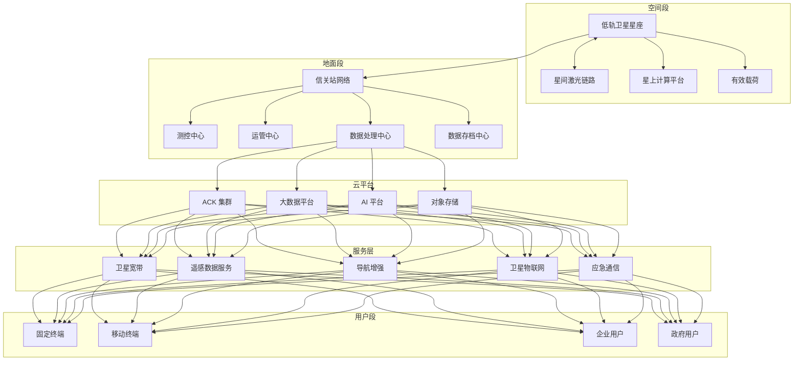
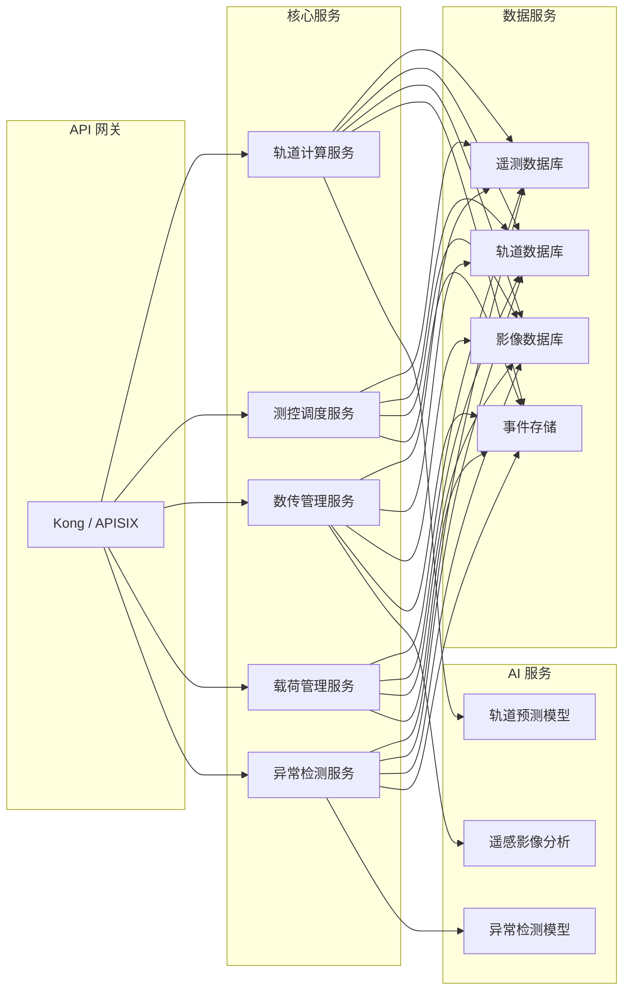
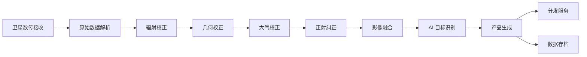
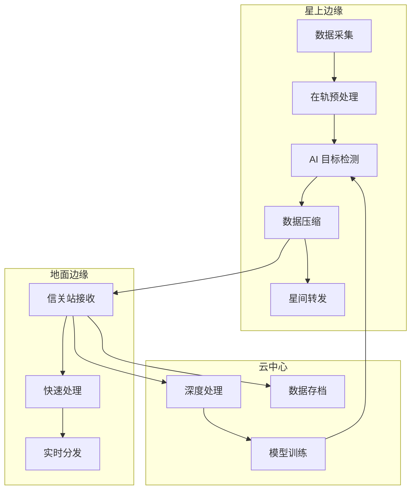

---title: 太空互联网架构设计 — 阿里云视角
description: 'title: 太空互联网架构设计'
summary: 'title: 太空互联网架构设计'
category: general
tags:
- architecture
- best-practice
- scheduler
- prometheus
- grafana
- opa
- redis
- kafka
- job
- cronjob
tier: supporting
created: '2026-05-23'
last_updated: 2026-05
difficulty: intermediate
reading_level: intermediate
audience:
- 所有工程师
estimated_read_time: 25min
intent_queries:
- 太空互联网架构设计 — 阿里云视角 是什么
- 如何 太空互联网架构设计 — 阿里云视角
- Kubernetes 20 application patterns 最佳实践
trigger_keywords:
- 太空互联网架构设计
- 阿里云视角
- application
- patterns
prerequisites:
- kubectl-basics
- prometheus-basics
- monitoring-basics
- kafka-basics
- redis-basics
- gpu-scheduling-basics
- policy-basics
- observability-basics
authors:
- name: Dillan Teagle
  role: contributor

---

> **生产环境安全提示**
>
> 本文档包含可直接执行的运维命令。执行前请确认：当前目标集群与 Namespace 是否正确；是否具备足够的 RBAC 权限；是否已在非生产环境验证。命令风险等级标注：🔴 高风险（可能造成数据丢失或服务中断）、🟡 中风险（会修改集群状态，但通常可回滚）、🟢 低风险/只读（信息收集，无副作用）。


title: 太空互联网架构设计
description: '# 太空互联网架构设计 — 阿里云视角'
category: application-architecture
tags:
- k8s
- architecture
- industry
- scheduler
- [[Prometheus|prometheus]]
- grafana
- opa
- redis
- kafka
- job
last_updated: 2026-05-18
difficulty: expert
reading_level: expert
audience:
- 卫星互联网架构师
- 航天科技IT负责人
- 卫星数据处理工程师
- 天地一体化网络工程师
estimated_read_time: 5min
intent_queries:
- space internet satellite [[Kubernetes|kubernetes]]
- 太空互联网K8s架构
- 卫星运管微服务设计
- 遥感数据处理平台
- 卫星物联网架构
trigger_keywords:
- 太空互联网
- 低轨卫星
- 遥感
- 卫星物联网
- 卫星运管
- 星间链路
- 太空互联网架构
- 卫星数据处理
- 轨道计算
- 卫星通信
related_domains:
- domain-01-cluster-fundamentals
- domain-03-networking-traffic
related_topics:
- satellite-internet
- digital-twin-city
- energy-power-architecture
k8s_versions:
- '1.28'
- '1.29'
- '1.30'
- '1.31'
- '1.32'
---

# 太空互联网架构设计 — 阿里云视角

> **适用版本**: Kubernetes v1.29 - v1.33 | **最后更新**: 2026-04-24
> **作者**: 阿里云解决方案架构师 | **标签**: `#太空互联网` `#低轨卫星` `#遥感` `#阿里云`

---

<!-- chunk: 目录 -->## 目录

1. [概述](#1-概述)
2. [设计原则](#2-设计原则)
3. [架构模式](#3-架构模式)
4. [实现示例](#4-实现示例)
5. [在 Kubernetes 上的部署](#5-在-kubernetes-上的部署)
6. [最佳实践](#6-最佳实践)
7. [反模式](#7-反模式)
8. [参考资源](#8-参考资源)

---

<!-- chunk: 1. 概述 -->## 1. 概述

太空互联网是通过低轨卫星（LEO）星座为全球用户提供宽带通信、遥感数据服务、导航增强和物联网数据采集的新一代空间信息基础设施。随着 SpaceX Starlink、OneWeb、中国星网等项目的推进，低轨卫星星座已从概念验证进入大规模商用阶段。预计到 2030 年，全球在轨低轨卫星数量将超过 10 万颗，覆盖全球 99% 以上的地表面积。

太空互联网的核心技术挑战在于：卫星在 500-1200km 轨道以约 7.5km/s 的速度运动，导致网络拓扑以分钟级频率变化；星间激光链路需要在数千公里距离上实现 Gbps 级通信；遥感数据以 PB/天级别产生，需要在轨处理与地面协同；卫星平台资源受限，计算与存储需要高度优化。

从架构角度看，太空互联网是一个典型的天地一体化分布式系统。空间段、地面段和用户段需要紧密协同，形成一个自适应、自愈合的智能网络。云原生技术为太空互联网的地面系统提供了弹性伸缩、快速迭代和高效运维的能力，使得卫星运管、数据处理、业务运营等核心系统能够以微服务方式敏捷交付。

## 1.1 行业背景

| 挑战 | 说明 | 架构影响 |
|:---|:---|:---|
| 卫星规模化 | 万颗级卫星管理 | 自动化运维 + 批量调度 |
| 轨道动态 | 星座拓扑快速变化 | 自适应路由 + SDN |
| 星地协同 | 天地一体化网络 | 协议适配 + 延迟容忍 |
| 遥感大数据 | PB 级遥感图像 | 分布式处理 + AI 推理 |
| 低延迟通信 | 卫星互联网接入 | 边缘计算 + 本地缓存 |

## 1.2 核心场景

- **卫星宽带**: 全球互联网接入服务，面向个人和企业用户
- **遥感服务**: 对地观测数据服务，支撑农业、环保、国防等领域
- **导航增强**: 高精度定位服务，厘米级 RTK 增强
- **卫星物联网**: 广域物联网数据采集，覆盖海洋、沙漠等偏远区域
- **应急通信**: 灾害应急通信保障，地面网络中断时的备份手段

---

<!-- chunk: 2. 设计原则 -->## 2. 设计原则

## 2.1 天地一体化原则

太空互联网的架构设计必须将空间段和地面段作为统一系统考虑。卫星星座是网络的边缘节点，地面站是核心锚点，云平台是数据处理和业务运营的中枢。三者之间通过统一的控制平面进行协调管理。

天地一体化的核心是建立标准的星地接口协议，包括测控协议、数传协议和业务协议。测控协议负责卫星平台的状态监控和指令上注，数传协议负责遥感数据和其他有效载荷数据的下行传输，业务协议负责用户面数据的管理和调度。

## 2.2 高可用弹性原则

卫星运管系统需要 7x24 不间断运行，任何中断都可能导致卫星失控或数据丢失。系统设计需要采用多活架构，在不同地域部署独立的运管中心，实现问题自动切换。数据处理系统需要根据卫星过境频率和数据量动态伸缩，在卫星过境窗口内快速处理海量数据。

## 2.3 数据驱动原则

太空互联网的核心价值在于数据。从卫星遥感到用户行为，从轨道参数到网络性能，所有数据都需要被采集、存储、分析和利用。架构设计需要建立完整的数据管道，从数据采集到数据消费形成闭环。AI/ML 技术广泛应用于遥感图像分析、轨道预测、网络优化等场景。

## 2.4 安全可靠原则

太空互联网涉及国家安全，需要从物理安全、网络安全、数据安全多个维度进行防护。卫星测控链路需要加密保护，遥感数据需要分级管理，用户隐私需要端到端加密。系统需要具备抗干扰、抗毁伤能力，在部分节点失效时仍能维持核心服务。

---

<!-- chunk: 3. 架构模式 -->## 3. 架构模式

## 3.1 太空互联网全景架构



## 3.2 卫星运管微服务架构

卫星运管系统采用微服务架构，将传统的大型运管软件拆分为独立可部署的服务单元。每个服务专注于单一职责，通过 API 网关统一暴露接口，通过事件总线进行异步通信。



## 3.3 遥感数据处理流水线架构

遥感数据从卫星下传到最终产品生成，需要经过辐射校正、几何校正、大气校正、融合拼接、目标识别等多个处理步骤。采用流水线架构可以将处理步骤编排为有向无环图（DAG），支持并行处理和增量更新。



## 3.4 星地协同边缘计算架构

在卫星上部署轻量级计算节点，实现数据的在轨处理和智能筛选。只有在轨处理结果和关键原始数据才通过星地链路下传，大幅降低数据传输量和地面处理压力。



---

<!-- chunk: 4. 实现示例 -->## 4. 实现示例

## 4.1 轨道计算服务

轨道计算服务基于 SGP4/SDP4 模型，根据 TLE（Two-Line Element）数据计算卫星的实时位置和未来轨道预报。

```go
package orbit

import (
    "fmt"
    "time"

    "github.com/astrogreg/satellite"
)

type OrbitService struct {
    tleStore TLEStore
}

type SatellitePosition struct {
    SatelliteID string    `json:"satellite_id"`
    Latitude    float64   `json:"latitude"`
    Longitude   float64   `json:"longitude"`
    Altitude    float64   `json:"altitude"`
    Velocity    float64   `json:"velocity"`
    Timestamp   time.Time `json:"timestamp"`
}

func (s *OrbitService) GetPosition(satID string, t time.Time) (*SatellitePosition, error) {
    tle, err := s.tleStore.Get(satID)
    if err != nil {
        return nil, fmt.Errorf("TLE not found for %s: %w", satID, err)
    }

    sat, err := satellite.ParseTLE(tle.Line1, tle.Line2, satID)
    if err != nil {
        return nil, fmt.Errorf("parse TLE failed: %w", err)
    }

    loc := sat.Location(t)

    return &SatellitePosition{
        SatelliteID: satID,
        Latitude:    loc.Latitude,
        Longitude:   loc.Longitude,
        Altitude:    loc.Altitude,
        Velocity:    loc.Velocity,
        Timestamp:   t,
    }, nil
}

func (s *OrbitService) GetPassPredictions(satID string, groundLat, groundLon float64, duration time.Duration) ([]PassInfo, error) {
    tle, err := s.tleStore.Get(satID)
    if err != nil {
        return nil, err
    }

    now := time.Now().UTC()
    var passes []PassInfo
    step := 30 * time.Second

    for t := now; t.Before(now.Add(duration)); t = t.Add(step) {
        pos, _ := s.GetPosition(satID, t)
        if pos == nil {
            continue
        }

        elevation := calculateElevation(pos.Latitude, pos.Longitude, pos.Altitude, groundLat, groundLon)
        if elevation > 5.0 {
            passes = append(passes, PassInfo{
                StartTime:  t,
                EndTime:    t.Add(10 * time.Minute),
                MaxElev:    elevation,
                Duration:   10 * time.Minute,
            })
            t = t.Add(10 * time.Minute)
        }
    }
    return passes, nil
}
```

## 4.2 遥感数据处理工作流

使用 Argo Workflows 编排遥感数据处理流水线：

```yaml
apiVersion: argoproj.io/v1alpha1
kind: Workflow
metadata:
  name: remote-sensing-pipeline
  namespace: space-internet
spec:
  entrypoint: processing-dag
  templates:
    - name: radiometric-correction
      container:
        image: registry.cn-hangzhou.aliyuncs.com/space/radiometric-correct:v2.0.0
        command: [python, correct.py]
        args:
          - "--input=/data/raw/{{workflow.parameters.scene_id}}"
          - "--output=/data/corrected/{{workflow.parameters.scene_id}}"
          - "--sensor={{workflow.parameters.sensor_type}}"
        resources:
          requests:
            memory: "16Gi"
            cpu: "8000m"

    - name: geometric-correction
      container:
        image: registry.cn-hangzhou.aliyuncs.com/space/geometric-correct:v2.0.0
        command: [python, geo_correct.py]
        args:
          - "--input=/data/corrected/{{workflow.parameters.scene_id}}"
          - "--output=/data/geo/{{workflow.parameters.scene_id}}"
          - "--dem=/data/dem/srtm_30m"
        resources:
          requests:
            memory: "32Gi"
            cpu: "16000m"

    - name: ai-target-detection
      container:
        image: registry.cn-hangzhou.aliyuncs.com/space/ai-detect:v2.0.0-gpu
        command: [python, detect.py]
        args:
          - "--input=/data/geo/{{workflow.parameters.scene_id}}"
          - "--output=/data/results/{{workflow.parameters.scene_id}}"
          - "--model=/models/target-detect-v3.onnx"
        resources:
          requests:
            nvidia.com/gpu: 1
            memory: "16Gi"

    - name: product-generation
      container:
        image: registry.cn-hangzhou.aliyuncs.com/space/product-gen:v2.0.0
        command: [python, generate.py]
        args:
          - "--input=/data/geo/{{workflow.parameters.scene_id}}"
          - "--detection=/data/results/{{workflow.parameters.scene_id}}"
          - "--output=/data/products/{{workflow.parameters.scene_id}}"

  dag:
    tasks:
      - name: radiometric
        template: radiometric-correction
      - name: geometric
        template: geometric-correction
        dependencies: [radiometric]
      - name: ai-detect
        template: ai-target-detection
        dependencies: [geometric]
      - name: product
        template: product-generation
        dependencies: [geometric, ai-detect]
```

## 4.3 卫星测控调度服务

```python
import heapq
from datetime import datetime, timedelta
from dataclasses import dataclass, field
from typing import List, Optional

@dataclass(order=True)
class TeleCommand:
    priority: int
    satellite_id: str = field(compare=False)
    command_type: str = field(compare=False)
    parameters: dict = field(compare=False)
    deadline: datetime = field(compare=False)
    retry_count: int = field(default=0, compare=False)

class TelecommandScheduler:
    def __init__(self, max_retries: int = 3, timeout: int = 300):
        self.max_retries = max_retries
        self.timeout = timeout
        self.queue: List[TeleCommand] = []
        self.pass_schedule = {}

    def submit(self, cmd: TeleCommand) -> bool:
        if datetime.utcnow() > cmd.deadline:
            return False
        heapq.heappush(self.queue, cmd)
        return True

    def schedule_for_pass(self, satellite_id: str, pass_start: datetime,
                          pass_end: datetime, max_commands: int = 50):
        window = (pass_end - pass_start).total_seconds()
        allocated = []
        remaining = []

        while self.queue and len(allocated) < max_commands:
            cmd = heapq.heappop(self.queue)
            if cmd.satellite_id == satellite_id:
                allocated.append(cmd)
            else:
                remaining.append(cmd)

        for cmd in remaining:
            heapq.heappush(self.queue, cmd)

        self.pass_schedule[satellite_id] = {
            "pass_start": pass_start,
            "pass_end": pass_end,
            "commands": allocated,
            "total_window_sec": window,
        }
        return allocated

    def get_next_command(self, satellite_id: str) -> Optional[TeleCommand]:
        schedule = self.pass_schedule.get(satellite_id)
        if not schedule or not schedule["commands"]:
            return None
        return schedule["commands"].pop(0)
```

---

<!-- chunk: 5. 在 Kubernetes 上的部署 -->## 5. 在 Kubernetes 上的部署

## 5.1 卫星运管核心服务部署

```yaml
apiVersion: apps/v1
kind: Deployment
metadata:
  name: satellite-ops
  namespace: space-internet
  labels:
    app: satellite-ops
    tier: core
spec:
  replicas: 3
  selector:
    matchLabels:
      app: satellite-ops
  strategy:
    type: RollingUpdate
    rollingUpdate:
      maxSurge: 1
      maxUnavailable: 0
  template:
    metadata:
      labels:
        app: satellite-ops
        tier: core
      annotations:
        prometheus.io/scrape: "true"
        prometheus.io/port: "9090"
    spec:
      affinity:
        podAntiAffinity:
          preferredDuringSchedulingIgnoredDuringExecution:
            - weight: 100
              podAffinityTerm:
                labelSelector:
                  matchExpressions:
                    - key: app
                      operator: In
                      values: ["satellite-ops"]
                topologyKey: topology.kubernetes.io/zone
      containers:
        - name: ops
          image: registry.cn-hangzhou.aliyuncs.com/space/sat-ops:v2.0.0
          ports:
            - containerPort: 8080
            - containerPort: 9090
          env:
            - name: TLE_DATA_URL
              value: "https://tle-data.space/track"
            - name: DB_HOST
              valueFrom:
                configMapKeyRef:
                  name: space-config
                  key: db-host
            - name: DB_PASSWORD
              valueFrom:
                secretKeyRef:
                  name: space-secrets
                  key: db-password
          resources:
            requests:
              memory: "4Gi"
              cpu: "2000m"
            limits:
              memory: "8Gi"
              cpu: "4000m"
          livenessProbe:
            httpGet:
              path: /healthz
              port: 8080
            initialDelaySeconds: 30
            periodSeconds: 10
          readinessProbe:
            httpGet:
              path: /ready
              port: 8080
            initialDelaySeconds: 10
            periodSeconds: 5
          volumeMounts:
            - name: config
              mountPath: /etc/sat-ops
      volumes:
        - name: config
          configMap:
            name: sat-ops-config
```

## 5.2 遥感数据处理 GPU 节点池

```yaml
apiVersion: apps/v1
kind: Deployment
metadata:
  name: rs-image-processor
  namespace: space-internet
spec:
  replicas: 5
  selector:
    matchLabels:
      app: rs-image-processor
  template:
    metadata:
      labels:
        app: rs-image-processor
    spec:
      nodeSelector:
        accelerator: nvidia-a10
      runtimeClassName: nvidia
      tolerations:
        - key: "nvidia.com/gpu"
          operator: "Exists"
          effect: "NoSchedule"
      containers:
        - name: processor
          image: registry.cn-hangzhou.aliyuncs.com/space/rs-processor:v2.0.0-gpu
          ports:
            - containerPort: 8080
          env:
            - name: GPU_MEMORY_LIMIT
              value: "20Gi"
            - name: BATCH_SIZE
              value: "8"
          resources:
            requests:
              nvidia.com/gpu: 1
              memory: "32Gi"
              cpu: "8000m"
            limits:
              nvidia.com/gpu: 1
              memory: "64Gi"
              cpu: "16000m"
```

## 5.3 KEDA 自动伸缩配置

```yaml
apiVersion: keda.sh/v1alpha1
kind: ScaledObject
metadata:
  name: rs-processor-scaler
  namespace: space-internet
spec:
  scaleTargetRef:
    name: rs-image-processor
  minReplicaCount: 2
  maxReplicaCount: 50
  cooldownPeriod: 60
  triggers:
    - type: kafka
      metadata:
        topic: rs-raw-images
        bootstrapServers: kafka.space-internet.svc:9092
        consumerGroup: rs-processor-group
        lagThreshold: "10"
```

## 5.4 关键 ConfigMap 和 Secret

```yaml
apiVersion: v1
kind: ConfigMap
metadata:
  name: space-config
  namespace: space-internet
data:
  db-host: "polardb-space.cn-hangzhou.rds.aliyuncs.com"
  redis-host: "redis-space-master.space-internet.svc"
  kafka-brokers: "kafka-0.kafka:9092,kafka-1.kafka:9092,kafka-2.kafka:9092"
  tle-refresh-interval: "3600"
  max-orbit-prediction-hours: "72"
  image-compression-level: "6"
---
apiVersion: v1
kind: Secret
metadata:
  name: space-secrets
  namespace: space-internet
type: Opaque
stringData:
  db-password: CHANGE_ME_IN_PRODUCTION
  api-key: CHANGE_ME_IN_PRODUCTION
  encryption-key: CHANGE_ME_IN_PRODUCTION
```

---

<!-- chunk: 6. 最佳实践 -->## 6. 最佳实践

## 6.1 卫星运管自动化

- **TLE 数据自动同步**: 建立定时任务每 4 小时从 Space-Track 等来源同步 TLE 数据，并通过消息队列广播到所有运管微服务
- **过境自动调度**: 根据轨道预报自动生成过境调度计划，提前分配信关站资源和测控任务
- **异常自动检测**: 基于历史遥测数据训练异常检测模型，实时监控卫星健康状态，自动告警并触发应急处置流程
- **批量操作管理**: 使用 Kubernetes Job 和 CronJob 管理批量卫星操作，如星座轨道维持、载荷标定等

## 6.2 遥感数据处理优化

- **分级存储策略**: 热数据存储在 SSD，温数据存储在 HDD，冷数据归档到 OSS 归档存储。根据访问频率自动迁移
- **GPU 加速推理**: 使用 TensorRT 或 ONNX Runtime 优化 AI 模型推理性能，在 NVIDIA GPU 上实现批量影像的实时目标检测
- **分布式处理**: 使用 Spark 或 Flink 对大规模遥感数据进行分布式批处理和流处理
- **增量更新**: 对于重复覆盖区域，采用增量处理策略，只处理变化部分，减少计算量

## 6.3 网络与通信优化

- **延迟容忍网络 (DTN)**: 在星地链路不可用时，使用 DTN 协议栈实现数据的存储转发，确保数据最终送达
- **自适应编码调制 (ACM)**: 根据链路质量动态调整调制编码方式，最大化链路吞吐量
- **星间路由优化**: 使用强化学习算法优化星间路由策略，降低端到端延迟
- **多信关站负载均衡**: 根据卫星可视性和链路负载，动态选择最优信关站

## 6.4 可观测性实践

- **三层监控体系**: 基础设施层（CPU/内存/GPU/磁盘）、应用层（延迟/吞吐/错误率）、业务层（轨道精度/处理时效/用户满意度）
- **分布式追踪**: 使用 OpenTelemetry 对跨服务请求进行全链路追踪，快速定位性能瓶颈
- **告警分级**: 将告警分为 P0（系统不可用）、P1（核心功能降级）、P2（非核心功能异常）、P3（需要关注）四级，分别设置不同的响应时间要求

---

<!-- chunk: 7. 反模式 -->## 7. 反模式

## 7.1 单一地面站瓶颈

将所有卫星通信集中在单一地面站，导致该站成为系统瓶颈。一旦地面站问题，整颗卫星或整个星座的通信中断。

**解决方案**: 部署多个地理分布的地面站，实现地面站冗余和负载均衡。使用站点分集技术，同一颗卫星可以同时被多个地面站接收。

## 7.2 忽视轨道动态性

将卫星网络视为静态拓扑，使用静态路由表。由于卫星高速运动，网络拓扑以分钟级变化，静态路由很快失效。

**解决方案**: 采用软件定义网络（SDN）技术，根据实时轨道参数动态计算和更新路由表。使用星座仿真器在部署前验证路由算法的有效性。

## 7.3 遥感数据全量下传

试图将卫星采集的所有原始数据全量下传到地面处理。卫星数据量可达 TB/天，远超星地链路带宽。

**解决方案**: 在卫星上部署边缘计算能力，实现数据在轨预处理、智能筛选和压缩。只下传处理结果和关键原始数据，大幅降低数据传输量。

## 7.4 紧耦合的运管系统

将轨道计算、测控调度、数据处理等功能紧耦合在单一系统中，导致系统难以扩展和维护。

**解决方案**: 采用微服务架构，将功能拆分为独立可部署的服务。通过 API 网关和事件总线进行松耦合通信。每个服务可以独立扩展和升级。

## 7.5 忽视安全合规

太空互联网涉及国家安全和频谱资源管理，忽视安全合规可能导致严重后果。常见问题包括：测控链路未加密、遥感数据未分级、用户隐私未保护。

**解决方案**: 建立完善的安全体系，包括测控链路加密、数据分级管理、访问控制、安全审计等。定期进行安全评估和渗透测试。

---

<!-- chunk: 8. 参考资源 -->## 8. 参考资源

## 8.1 阿里云组件映射

| 功能域 | **阿里云云原生方案** |
|:---|:---|
| 容器平台 | **ACK Pro** |
| 大数据 | **MaxCompute + DataWorks** |
| AI | **PAI + 视觉智能** |
| 对象存储 | **OSS + 归档存储** |
| 数据库 | **PolarDB + Lindorm** |
| 消息队列 | **RocketMQ** |
| 可观测性 | **ARMS + SLS + Grafana** |
| 工作流 | **Argo Workflows on ACK** |

## 8.2 生产检查清单

- [ ] TLE 数据同步频率与轨道预报精度验证
- [ ] 星地链路连通性与数传速率测试
- [ ] 遥感数据产品质量评估（几何精度、辐射精度）
- [ ] 频谱干扰监测系统部署
- [ ] 空间碎片碰撞预警系统联调
- [ ] 地面站冗余切换演练
- [ ] 安全渗透测试与合规审计
- [ ] 遥感数据分级保护策略实施
- [ ] 应急通信保障预案演练

## 8.3 外部参考

- ITU Radio Regulations — 国际电联无线电规则
- CCSDS Standards — 空间数据系统咨询委员会标准
- SGP4/SDP4 Orbit Propagation Model — 轨道传播模型
- NASA EOSDIS — 地球观测系统数据和信息系统
- Starlink Technical Overview — SpaceX 星链技术概览

---

**维护者**: 阿里云解决方案架构师团队 | **许可证**: MIT

---

<!-- chunk: Obsidian 相关文档 -->## Obsidian 相关文档

- topic-application-architecture MOC
- [[domain-20-application-patterns/topic-application-architecture/README.md|Topic 应用层架构设计最佳实践]]
- [[domain-20-application-patterns/topic-application-architecture/01-ecommerce-architecture.md|电商系统 Kubernetes 生产架构设计]]
- [[domain-20-application-patterns/topic-application-architecture/02-mini-program-architecture.md|小程序平台架构设计]]
- [[domain-20-application-patterns/topic-application-architecture/03-cms-architecture.md|内容管理系统 CMS 架构设计]]
- [[domain-20-application-patterns/topic-application-architecture/04-im-rtc-architecture.md|实时通信 IM/RTC 架构设计]]
- [[domain-20-application-patterns/topic-application-architecture/05-online-education-architecture.md|在线教育平台 Kubernetes 生产架构设计]]
- [[domain-20-application-patterns/topic-application-architecture/06-fintech-architecture.md|金融科技FinTech Kubernetes生产架构设计]]
- [[domain-20-application-patterns/topic-application-architecture/07-iot-platform-architecture.md|物联网 IoT 平台架构设计]]
- [[domain-20-application-patterns/topic-application-architecture/08-ai-ml-inference-architecture.md|AI/ML 推理服务 Kubernetes 生产架构设计]]
- [[domain-20-application-patterns/topic-application-architecture/09-gaming-backend-architecture.md|游戏后端 Kubernetes 生产架构设计]]
- [[domain-20-application-patterns/topic-application-architecture/10-social-media-architecture.md|社交媒体平台Kubernetes生产架构设计]]

## See Also

- 64-ai-drug-discovery
- 65-autonomous-driving-sim
- 67-brain-computer-interface
- 68-quantum-computing-cloud

## Related

- topic-application-architecture MOC — Cross-reference


<!-- risk-assessed -->
