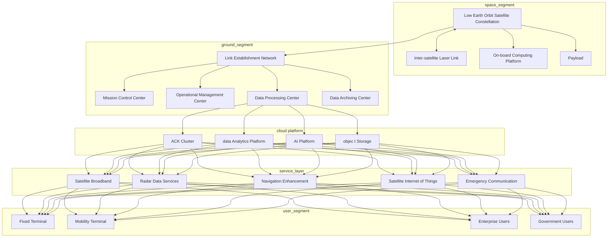
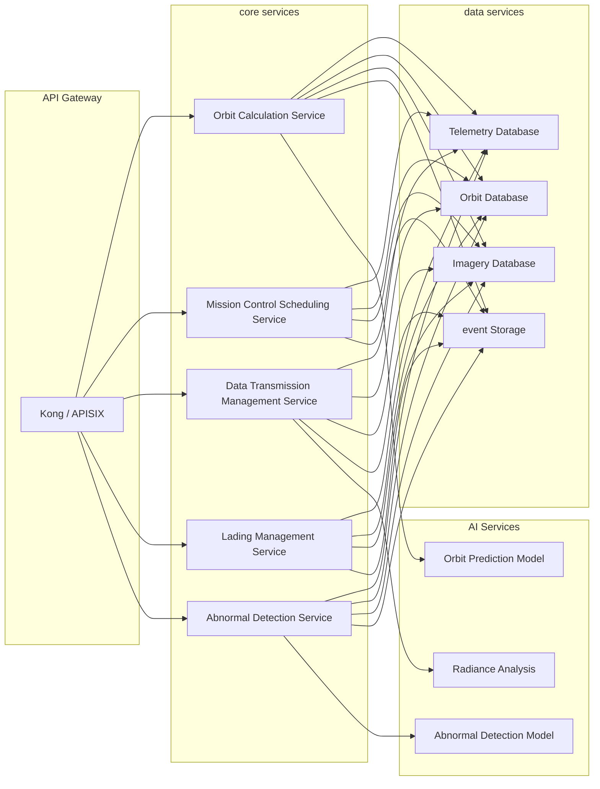
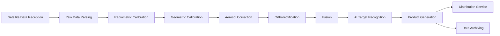
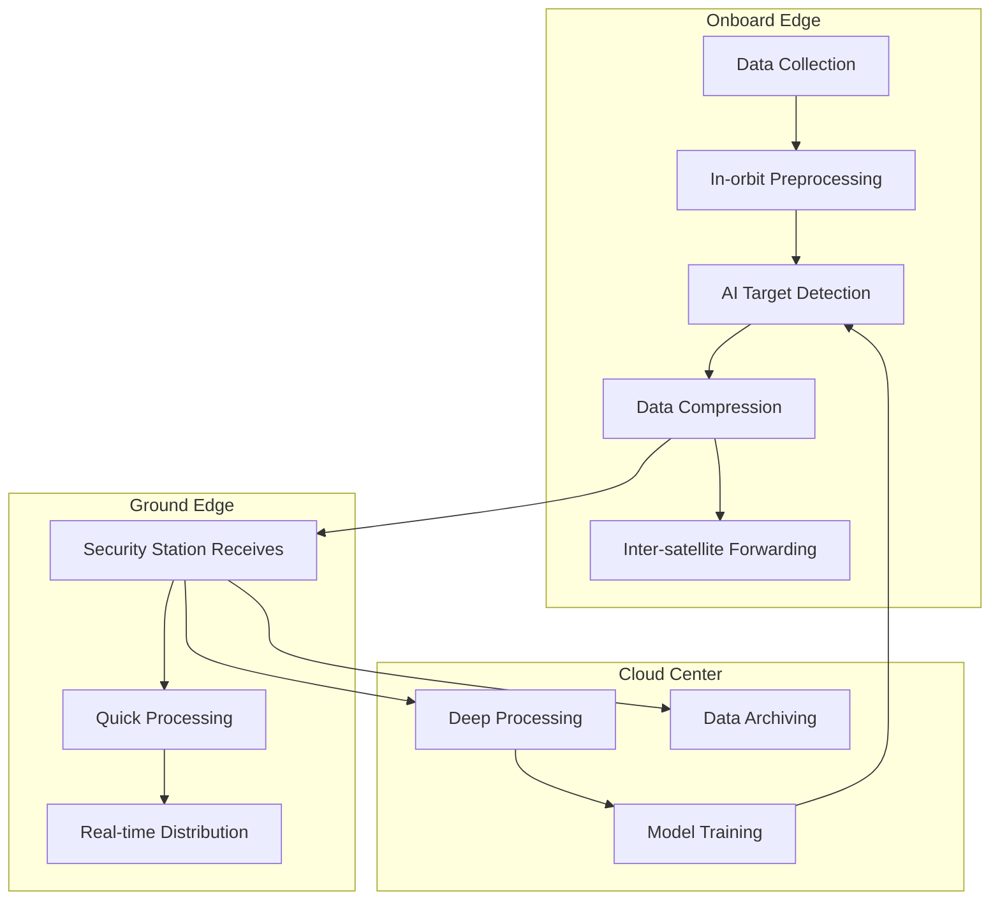

# Space Internet Architecture Design — From Alibaba Cloud Perspective

## Table of Contents

1. [Overview](#1-overview)
2. [Design Principles](#2-design-principles)
3. [Architecture Patterns](#3-architecture-patterns)
4. [Example Implementation](#4-implementation-examples)
5. [Deployment on Kubernetes](#5-deployment-on-kubernetes)
6. [Best Practices](#6-best-practices)
7. [Anti-patterns](#7-anti-patterns)
8. [Reference Resources](#8-reference-resources)

---

## 1. Overview

Space Internet is a new generation of space information infrastructure that provides broadband communication, remote sensing data services, navigation enhancement, and IoT data collection for global users through low Earth orbit (LEO) constellations. With the advancement of projects such as SpaceX Starlink, OneWeb, and China's StarNet, LEO constellation projects have transitioned from concept validation to large-scale commercialization. By 2030, it is expected that there will be over 100,000 operational LEO satellites in orbit, covering more than 99% of the Earth's surface area.

The core technical challenges of Space Internet include: satellites moving at an orbital altitude of 500-1200km with speeds of approximately 7.5km/s, resulting in network topologies changing at minute frequencies; star-to-star laser links requiring Gbps-level communications over thousands of kilometers; remote sensing data generating at PB/day levels, necessitating in-orbit processing and ground coordination; limited satellite platform resources requiring highly optimized computing and storage.

From an architectural perspective, Space Internet is a typical end-to-end distributed system combining space segments, ground segments, and user segments. The space segment, ground segment, and user segment need to work closely together to form an adaptive and self-healing intelligent network. Cloud-native technologies provide elastic scaling, rapid iteration, and efficient operation capabilities for the ground systems of Space Internet, enabling core systems such as satellite operations, data processing, and business operations to be delivered in microservices.

## 1.1 Industry Background

| Challenge | Explanation | Impact on Architecture |
|:---|:---|:---|
| Satellite Scale | Managing thousands of satellites | Automated Operations + Batch Scheduling |
| Orbital Dynamics | Rapid changes in constellation topology | Adaptive Routing + SDN |
| Ground-Space Coordination | End-to-end integrated networks | Protocol Adaptation + Delay Tolerance |
| Remote Sensing Big Data | PB-sized remote sensing images | Distributed Processing + AI Inference |
| Low-Latency Communication | Satellite Internet Access | Edge Computing + Local Caching |

## 1.2 Core Scenarios

- **Satellite Broadband**: Global internet access service, targeting personal and corporate users
- **Remote Sensing Services**: Remote sensing data services supporting agriculture, environmental protection, defense, and other fields
- **Navigation Enhancement**: High-precision positioning services, centimeter-grade RTK enhancement
- **Satellite IoT**: Wide-area IoT data collection covering remote areas such as oceans and deserts
- **Emergency Communications**: Backup means for disaster emergency communication when ground networks are interrupted

---

## 2. Design Principles

## 2.1 Integrated Earth-Space Principle

The architecture design for space internet must consider the space segment and ground segment as a unified system. Satellite constellations are edge nodes of the network, while ground stations serve as core anchors, and cloud platforms act as the central hub for data processing and business operations. These three components coordinate through a unified control plane.

The core of integrated earth-space lies in establishing standard star-ground interface protocols, including telemetry protocols, data transmission protocols, and service protocols. Telemetry protocols handle state monitoring and command injection for satellite platforms, while data transmission protocols manage downlink transmission of sensing data and other payload data. Service protocols manage and schedule user-plane data.

## 2.2 High-Availability Elastic Principle

The satellite operation management system needs to operate continuously 7x24 hours without interruption. Any disruption could lead to satellite loss of control or data loss. System design should adopt a multi-active architecture, deploying independent operation centers in different regions to achieve automatic failover. The data processing system should dynamically scale based on the frequency of satellite passes and data volume, quickly processing massive amounts of data within the satellite pass window.

## 2.3 Data-Driven Principle

The core value of space internet lies in data. From satellite sensing to user behavior, from orbital parameters to network performance, all data must be collected, stored, analyzed, and utilized. The architecture design should establish a complete data pipeline, forming a loop from data collection to consumption. AI/ML technologies are widely applied in scenarios such as remote sensing image analysis, orbit prediction, and network optimization.

## 2.4 Secure Reliable Principle

Space internet involves national security and requires protection from multiple dimensions including physical security, network security, and data security. Satellite telemetry links need encryption protection, while remote sensing data needs graded management. User privacy should be end-to-end encrypted. The system should have anti-interference and anti-destruction capabilities, maintaining core services even when some nodes fail.

---

## 3. Architecture Patterns

## 3.1 Panoramic Architecture of Space Internet


```mermaid
graph TB
    subgraph space_segment
        SAT1[Low Earth Orbit Satellite Constellation]
        SAT2[Inter-satellite Laser Link]
        SAT3[On-board Computing Platform]
        SAT4[Payload]
    end

    subgraph ground_segment
        G1[Link Establishment Network]
        G2[Mission Control Center]
        G3[Operational Management Center]
        G4[Data Processing Center]
        G5[Data Archiving Center]
    end

    subgraph user_segment
        U1[Fixed Terminal]
        U2[Mobility Terminal]
        U3[Enterprise Users]
        U4[Government Users]
    end

    subgraph service_layer
        S1[Satellite Broadband]
        S2[Radar Data Services]
        S3[Navigation Enhancement]
        S4[Satellite Internet of Things]
        S5[Emergency Communication]
    end

    subgraph cloud platform
        C1[ACK Cluster]
        C2[data Analytics Platform]
        C3[AI Platform]
        C4[objec t Storage]
    end

    SAT1 <--> SAT2
    SAT1 --> SAT3
    SAT1 --> SAT4
    SAT1 --> G1
    G1 --> G2 & G3 & G4 & G5
    G4 --> C1 & C2 & C3 & C4
    C1 & C2 & C3 & C4 --> S1 & S2 & S3 & S4 & S5
    S1 & S2 & S3 & S4 & S5 --> U1 & U2 & U3 & U4
```

## 3.2 Microservices Architecture for Satellite Operation Management

The satellite operation management system adopts a microservices architecture, breaking down traditional large-scale operation software into independent deployable service units. Each service focuses on a single responsibility, exposing interfaces through an API gateway, and communicating asynchronously via an event bus.


```mermaid
graph LR
    subgraph API Gateway
        GW[Kong / APISIX]
    end

    subgraph core services
        S1[Orbit Calculation Service]
        S2[Mission Control Scheduling Service]
        S3[Data Transmission Management Service]
        S4[Lading Management Service]
        S5[Abnormal Detection Service]
    end

    subgraph data services
        D1[Telemetry Database]
        D2[Orbit Database]
        D3[Imagery Database]
        D4[event Storage]
    end

    subgraph AI Services
        A1[Orbit Prediction Model]
        A2[Abnormal Detection Model]
        A3[Radiance Analysis]
    end

    GW --> S1 & S2 & S3 & S4 & S5
    S1 & S2 & S3 & S4 & S5 --> D1 & D2 & D3 & D4
    S1 --> A1
    S5 --> A2
    S3 --> A3
```

## 3.3 Streaming Pipeline Architecture for Remote Sensing Data Processing

Radiance correction, geometric correction, atmospheric correction, fusion stitching, target recognition, and other processing steps are required for remote sensing data from satellites to final product generation. A pipeline architecture can compile these steps into a directed acyclic graph (DAG), supporting parallel processing and incremental updates.


```mermaid
flowchart LR
    A[Satellite Data Reception] --> B[Raw Data Parsing]
    B --> C[Radiometric Calibration]
    C --> D[Geometric Calibration]
    D --> E[Aerosol Correction]
    E --> F[Orthorectification]
    F --> G[Fusion]
    G --> H[AI Target Recognition]
    H --> I[Product Generation]
    I --> J[Distribution Service]
    I --> K[Data Archiving]
```

## 3.4 Edge Computing Architecture for Star-Ground Collaboration

Deploy lightweight computing nodes on satellites for in-orbit processing and intelligent filtering of data. Only in-orbit processing results and critical original data are transmitted via the star-ground link, significantly reducing data transmission volume and ground processing pressure.


```mermaid
graph TB
    subgraph Onboard Edge
        E1[Data Collection]
        E2[In-orbit Preprocessing]
        E3[AI Target Detection]
        E4[Data Compression]
        E5[Inter-satellite Forwarding]
    end

    subgraph Ground Edge
        G1[Security Station Receives]
        G2[Quick Processing]
        G3[Real-time Distribution]
    end

    subgraph Cloud Center
        C1[Deep Processing]
        C2[Model Training]
        C3[Data Archiving]
    end

    E1 --> E2 --> E3 --> E4
    E4 --> E5
    E4 --> G1 --> G2 --> G3
    G1 --> C1 & C3
    C1 --> C2
    C2 --> E3
```

---

## 4. Implementation Examples

## 4.1 Orbit Calculation Service

Track calculation services are based on the SGP4/SDP4 model, calculating the real-time position and future orbital predictions of satellites using TLE (Two-Line Element) data.

```go
package orbit

import (
    "fmt"
    "time"

    "github.com/astrogreg/satellite"
)

type OrbitService struct {
    tleStore TLEStore
}

type SatellitePosition struct {
    SatelliteID string    `json:"satellite_id"`
    Latitude    float64   `json:"latitude"`
    Longitude   float64   `json:"longitude"`
    Altitude    float64   `json:"altitude"`
    Velocity    float64   `json:"velocity"`
    Timestamp   time.Time `json:"timestamp"`
}

func (s *OrbitService) GetPosition(satID string, t time.Time) (*SatellitePosition, error) {
    tle, err := s.tleStore.Get(satID)
    if err != nil {
        return nil, fmt.Errorf("TLE not found for %s: %w", satID, err)
    }

    sat, err := satellite.ParseTLE(tle.Line1, tle.Line2, satID)
    if err != nil {
        return nil, fmt.Errorf("parse TLE failed: %w", err)
    }

    loc := sat.Location(t)

    return &SatellitePosition{
        SatelliteID: satID,
        Latitude:    loc.Latitude,
        Longitude:   loc.Longitude,
        Altitude:    loc.Altitude,
        Velocity:    loc.Velocity,
        Timestamp:   t,
    }, nil
}

func (s *OrbitService) GetPassPredictions(satID string, groundLat, groundLon float64, duration time.Duration) ([]PassInfo, error) {
    tle, err := s.tleStore.Get(satID)
    if err != nil {
        return nil, err
    }

    now := time.Now().UTC()
    var passes []PassInfo
    step := 30 * time.Second

    for t := now; t.Before(now.Add(duration)); t = t.Add(step) {
        pos, _ := s.GetPosition(satID, t)
        if pos == nil {
            continue
        }

        elevation := calculateElevation(pos.Latitude, pos.Longitude, pos.Altitude, groundLat, groundLon)
        if elevation > 5.0 {
            passes = append(passes, PassInfo{
                StartTime:  t,
                EndTime:    t.Add(10 * time.Minute),
                MaxElev:    elevation,
                Duration:   10 * time.Minute,
            })
            t = t.Add(10 * time.Minute)
        }
    }
    return passes, nil
}
```

## 4.2 Remote Sensing Data Processing Workflow

Use Argo Workflows to orchestrate the remote sensing data processing pipeline:

```yaml
apiVersion: argoproj.io/v1alpha1
kind: Workflow
metadata:
  name: remote-sensing-pipeline
  namespace: space-internet
spec:
  entrypoint: processing-dag
  templates:
    - name: radiometric-correction
      container:
        image: registry.cn-hangzhou.aliyuncs.com/space/radiometric-correct:v2.0.0
        command: [python, correct.py]
        args:
          - "--input=/data/raw/{{workflow.parameters.scene_id}}"
          - "--output=/data/corrected/{{workflow.parameters.scene_id}}"
          - "--sensor={{workflow.parameters.sensor_type}}"
        resources:
          requests:
            memory: "16Gi"
            cpu: "8000m"

    - name: geometric-correction
      container:
        image: registry.cn-hangzhou.aliyuncs.com/space/geometric-correct:v2.0.0
        command: [python, geo_correct.py]
        args:
          - "--input=/data/corrected/{{workflow.parameters.scene_id}}"
          - "--output=/data/geo/{{workflow.parameters.scene_id}}"
          - "--dem=/data/dem/srtm_30m"
        resources:
          requests:
            memory: "32Gi"
            cpu: "16000m"

    - name: ai-target-detection
      container:
        image: registry.cn-hangzhou.aliyuncs.com/space/ai-detect:v2.0.0-gpu
        command: [python, detect.py]
        args:
          - "--input=/data/geo/{{workflow.parameters.scene_id}}"
          - "--output=/data/results/{{workflow.parameters.scene_id}}"
          - "--model=/models/target-detect-v3.onnx"
        resources:
          requests:
            nvidia.com/gpu: 1
            memory: "16Gi"

    - name: product-generation
      container:
        image: registry.cn-hangzhou.aliyuncs.com/space/product-gen:v2.0.0
        command: [python, generate.py]
        args:
          - "--input=/data/geo/{{workflow.parameters.scene_id}}"
          - "--detection=/data/results/{{workflow.parameters.scene_id}}"
          - "--output=/data/products/{{workflow.parameters.scene_id}}"

  dag:
    tasks:
      - name: radiometric
        template: radiometric-correction
      - name: geometric
        template: geometric-correction
        dependencies: [radiometric]
      - name: ai-detect
        template: ai-target-detection
        dependencies: [geometric]
      - name: product
        template: product-generation
        dependencies: [geometric, ai-detect]
```

## 4.3 Satellite Tracking and Control Scheduling Service

```python
import heapq
from datetime import datetime, timedelta
from dataclasses import dataclass, field
from typing import List, Optional

@dataclass(order=True)
class TeleCommand:
    priority: int
    satellite_id: str = field(compare=False)
    command_type: str = field(compare=False)
    parameters: dict = field(compare=False)
    deadline: datetime = field(compare=False)
    retry_count: int = field(default=0, compare=False)

class TelecommandScheduler:
    def __init__(self, max_retries: int = 3, timeout: int = 300):
        self.max_retries = max_retries
        self.timeout = timeout
        self.queue: List[TeleCommand] = []
        self.pass_schedule = {}

    def submit(self, cmd: TeleCommand) -> bool:
        if datetime.utcnow() > cmd.deadline:
            return False
        heapq.heappush(self.queue, cmd)
        return True

    def schedule_for_pass(self, satellite_id: str, pass_start: datetime,
                          pass_end: datetime, max_commands: int = 50):
        window = (pass_end - pass_start).total_seconds()
        allocated = []
        remaining = []

        while self.queue and len(allocated) < max_commands:
            cmd = heapq.heappop(self.queue)
            if cmd.satellite_id == satellite_id:
                allocated.append(cmd)
            else:
                remaining.append(cmd)

        for cmd in remaining:
            heapq.heappush(self.queue, cmd)

        self.pass_schedule[satellite_id] = {
            "pass_start": pass_start,
            "pass_end": pass_end,
            "commands": allocated,
            "total_window_sec": window,
        }
        return allocated

    def get_next_command(self, satellite_id: str) -> Optional[TeleCommand]:
        schedule = self.pass_schedule.get(satellite_id)
        if not schedule or not schedule["commands"]:
            return None
        return schedule["commands"].pop(0)
```

---

## 5. Deployment on Kubernetes

## 5.1 Core Services for Satellite Management Deployment

```yaml
apiVersion: apps/v1
kind: Deployment
metadata:
  name: satellite-ops
  namespace: space-internet
  labels:
    app: satellite-ops
    tier: core
spec:
  replicas: 3
  selector:
    matchLabels:
      app: satellite-ops
  strategy:
    type: RollingUpdate
    rollingUpdate:
      maxSurge: 1
      maxUnavailable: 0
  template:
    metadata:
      labels:
        app: satellite-ops
        tier: core
      annotations:
        prometheus.io/scrape: "true"
        prometheus.io/port: "9090"
    spec:
      affinity:
        podAntiAffinity:
          preferredDuringSchedulingIgnoredDuringExecution:
            - weight: 100
              podAffinityTerm:
                labelSelector:
                  matchExpressions:
                    - key: app
                      operator: In
                      values: ["satellite-ops"]
                topologyKey: topology.kubernetes.io/zone
      containers:
        - name: ops
          image: registry.cn-hangzhou.aliyuncs.com/space/sat-ops:v2.0.0
          ports:
            - containerPort: 8080
            - containerPort: 9090
          env:
            - name: TLE_DATA_URL
              value: "https://tle-data.space/track"
            - name: DB_HOST
              valueFrom:
                configMapKeyRef:
                  name: space-config
                  key: db-host
            - name: DB_PASSWORD
              valueFrom:
                secretKeyRef:
                  name: space-secrets
                  key: db-password
          resources:
            requests:
              memory: "4Gi"
              cpu: "2000m"
            limits:
              memory: "8Gi"
              cpu: "4000m"
          livenessProbe:
            httpGet:
              path: /healthz
              port: 8080
            initialDelaySeconds: 30
            periodSeconds: 10
          readinessProbe:
            httpGet:
              path: /ready
              port: 8080
            initialDelaySeconds: 10
            periodSeconds: 5
          volumeMounts:
            - name: config
              mountPath: /etc/sat-ops
      volumes:
        - name: config
          configMap:
            name: sat-ops-config
```

## 5.2 GPU Node Pools for Remote Sensing Data Processing

```yaml
apiVersion: apps/v1
kind: Deployment
metadata:
  name: rs-image-processor
  namespace: space-internet
spec:
  replicas: 5
  selector:
    matchLabels:
      app: rs-image-processor
  template:
    metadata:
      labels:
        app: rs-image-processor
    spec:
      nodeSelector:
        accelerator: nvidia-a10
      runtimeClassName: nvidia
      tolerations:
        - key: "nvidia.com/gpu"
          operator: "Exists"
          effect: "NoSchedule"
      containers:
        - name: processor
          image: registry.cn-hangzhou.aliyuncs.com/space/rs-processor:v2.0.0-gpu
          ports:
            - containerPort: 8080
          env:
            - name: GPU_MEMORY_LIMIT
              value: "20Gi"
            - name: BATCH_SIZE
              value: "8"
          resources:
            requests:
              nvidia.com/gpu: 1
              memory: "32Gi"
              cpu: "8000m"
            limits:
              nvidia.com/gpu: 1
              memory: "64Gi"
              cpu: "16000m"
```

## 5.3 Auto-scaling Configuration with KEDA

```yaml
apiVersion: keda.sh/v1alpha1
kind: ScaledObject
metadata:
  name: rs-processor-scaler
  namespace: space-internet
spec:
  scaleTargetRef:
    name: rs-image-processor
  minReplicaCount: 2
  maxReplicaCount: 50
  cooldownPeriod: 60
  triggers:
    - type: kafka
      metadata:
        topic: rs-raw-images
        bootstrapServers: kafka.space-internet.svc:9092
        consumerGroup: rs-processor-group
        lagThreshold: "10"
```

## 5.4 Key ConfigMaps and Secrets

```yaml
apiVersion: v1
kind: ConfigMap
metadata:
  name: space-config
  namespace: space-internet
data:
  db-host: "polardb-space.cn-hangzhou.rds.aliyuncs.com"
  redis-host: "redis-space-master.space-internet.svc"
  kafka-brokers: "kafka-0.kafka:9092,kafka-1.kafka:9092,kafka-2.kafka:9092"
  tle-refresh-interval: "3600"
  max-orbit-prediction-hours: "72"
  image-compression-level: "6"
---
apiVersion: v1
kind: Secret
metadata:
  name: space-secrets
  namespace: space-internet
type: Opaque
stringData:
  db-password: CHANGE_ME_IN_PRODUCTION
  api-key: CHANGE_ME_IN_PRODUCTION
  encryption-key: CHANGE_ME_IN_PRODUCTION
```

---

## 6. Best Practices

## 6.1 Automated Satellite Management

- **Automated Synchronization of TLE Data**: Establish a scheduled task that synchronizes TLE data from sources such as Space-Track every 4 hours and broadcasts it to all satellite management microservices via a message queue
- **Automatic Overflight Scheduling**: Generate overflight scheduling plans based on orbital predictions and automatically allocate resources and tasks at ground stations
- **Automatic Detection of Abnormalities**: Train anomaly detection models based on historical telemetry data to monitor the health status of satellites in real time, automatically alert, and trigger emergency response procedures
- **Management of Batch Operations**: Use Kubernetes Jobs and CronJobs to manage batch satellite operations, such as constellation orbit maintenance, payload calibration, etc.

## 6.2 Optimization of Remote Sensing Data Processing

- **Hierarchical Storage Strategy**: Store hot data on SSDs, warm data on HDDs, and cold data archive them in OSS archival storage. Automatically migrate data based on access frequency
- **GPU-Accelerated Inference**: Optimize AI model inference performance using TensorRT or ONNX Runtime on NVIDIA GPUs to achieve real-time object detection for batches of images
- **Distributed Processing**: Perform distributed batch processing and stream processing on large-scale remote sensing data using Spark or Flink
- **Incremental Updates**: For repeated coverage areas, adopt an incremental processing strategy, only processing the changed parts to reduce computational load

## 6.3 Network and Communication Optimization

- **Delay-Tolerant Networking (DTN)**: Use the DTN protocol stack to forward data when ground links are unavailable, ensuring final delivery of data
- **Adaptive Coding Modulation (ACM)**: Dynamically adjust modulation coding schemes based on link quality to maximize link throughput
- **Optimized Inter-Satellite Routing**: Use reinforcement learning algorithms to optimize inter-satellite routing strategies, reducing end-to-end latency
- **Dynamic Load Balancing at Ground Stations**: Choose the optimal ground station based on satellite visibility and link load dynamically

## 6.4 Observability Practices

- **Three-tier Monitoring System**: Infrastructure layer (CPU/memory/GPU/disk), application layer (latency/bandwidth/error rate), business layer (orbital accuracy/process efficiency/user satisfaction)
- **Distributed Tracing**: Use OpenTelemetry for full-chain tracing of cross-service requests, quickly identifying performance bottlenecks
- **Alert Grading**: Categorize alerts into P0 (system unavailability), P1 (core functionality degradation), P2 (non-core functionality anomalies), and P3 (needs attention), setting different response time requirements for each level

---

## 7. Anti-patterns

## 7.1 Single Ground Station Bottleneck

Concentrating all satellite communications at a single ground station makes it a system bottleneck. If there's an issue with the ground station, communication to the entire satellite or constellation is interrupted.

**Solution**: Deploy multiple geographically distributed ground stations for redundancy and load balancing. Use site diversity techniques so that a single satellite can be received by multiple ground stations simultaneously.

## 7.2 Ignoring Orbital Dynamics

Treat the satellite network as a static topology and use static routing tables. Due to the high-speed movement of satellites, the network topology changes every few minutes, making static routing ineffective quickly.

**Solution**: Use Software-Defined Networking (SDN) technology to dynamically calculate and update routing tables based on real-time orbital parameters. Validate the routing algorithm before deployment using a constellation simulator.

## 7.3 Full-Volume Downlink of Remote Sensing Data

Attempt to fully transmit all raw data collected by the satellite to the ground for processing. Satellite data volume can reach TB/day, far exceeding the bandwidth of the ground-link.

**Solution**: Deploy edge computing capabilities on the satellite to perform in-orbit preprocessing, intelligent filtering, and compression of data. Only transmit processed results and critical raw data, significantly reducing data transmission volume.

## 7.4 Tight Coupling of Operations and Management Systems

Combine track calculations, control scheduling, and data processing functions within a single system, leading to difficulty in scaling and maintenance.

**Solution**: Adopt a microservices architecture, dividing functions into independent deployable services. Communicate via an API gateway and event bus for loose coupling. Each service can be independently scaled and upgraded.

## 7.5 Neglecting Security Compliance

Space internet involves national security and spectrum resource management, neglecting security compliance can lead to severe consequences. Common issues include: unencrypted control links, ungraded remote sensing data, and lack of user privacy protection.

**Solution**: Establish a robust security framework including encrypted control links, graded data management, access controls, and security audits. Regularly conduct security assessments and penetration testing.

---

## 8. Reference Resources

## 8.1 AliCloud Component Mapping

| Function Domain | **AliCloud Native Solutions** |
|:---|:---|
| Container Platform | **ACK Pro** |
| Big Data | **MaxCompute + DataWorks** |
| AI | **PAI + Visual Intelligence** |
| Object Storage | **OSS + Archive Storage** |
| Database | **PolarDB + Lindorm** |
| Message Queue | **RocketMQ** |
| Observability | **ARMS + SLS + Grafana** |
| Workflow | **Argo Workflows on ACK** |

## 8.2 Production Checklist

- [ ] Verify TLE data synchronization frequency against orbital prediction accuracy
- [ ] Test link connectivity between ground stations and data transmission rates
- [ ] Evaluate quality of remote sensing data products (geometric precision, radiometric precision)
- [ ] Spectrum Interference Monitoring System Deployment
- [ ] Space Debris Collision Warning System Integration
- [ ] Ground Station Redundancy Switching Exercise
- [ ] Security Penetration Testing and Compliance Audits
- [ ] Remote Sensing Data Categorization Protection Strategy Implementation
- [ ] Emergency Communication Assurance Plan Exercise

## 8.3 External References

- ITU Radio Regulations — International Telecommunication Union Radio Regulations
- CCSDS Standards — Consultative Committee for Space Data Systems Standards
- SGP4/SDP4 Orbit Propagation Model — SGP4/SDP4 Orbit Propagation Model
- NASA EOSDIS — Earth Observing System Data and Information System
- Starlink Technical Overview — SpaceX Starlink Technical Overview

---

**Maintainer**: Alibaba Cloud Solution Architects Team | **License**: MIT

---

## Obsidian Related Documentation

- topic-application-architecture MOC
- [[domain-20-application-patterns/topic-application-architecture/README.md|Topic Application Architecture Best Practices]]
- [[domain-20-application-patterns/topic-application-architecture/01-ecommerce-architecture.md|E-commerce System Kubernetes Production Architecture Design]]
- [[domain-20-application-patterns/topic-application-architecture/02-mini-program-architecture.md|Mini Program Platform Architecture Design]]
- [[domain-20-application-patterns/topic-application-architecture/03-cms-architecture.md|Content Management System CMS Architecture Design]]
- [[domain-20-application-patterns/topic-application-architecture/04-im-rtc-architecture.md|Real-time Communication IM/RTC Architecture Design]]
- [[domain-20-application-patterns/topic-application-architecture/05-online-education-architecture.md|Online Education Platform Kubernetes Production Architecture Design]]
- [[domain-20-application-patterns/topic-application-architecture/06-fintech-architecture.md|Financial Technology FinTech Kubernetes Production Architecture Design]]
- [[domain-20-application-patterns/topic-application-architecture/07-iot-platform-architecture.md|Internet of Things IoT Platform Architecture Design]]
- [[domain-20-application-patterns/topic-application-architecture/08-ai-ml-inference-architecture.md|Artificial Intelligence Machine Learning Inference Services Kubernetes Production Architecture Design]]
- [[domain-20-application-patterns/topic-application-architecture/09-gaming-backend-architecture.md|Game Backend Kubernetes Production Architecture Design]]
- [[domain-20-application-patterns/topic-application-architecture/10-social-media-architecture.md|Social Media Platform Kubernetes Production Architecture Design]]

## See Also

- 64-ai-drug-discovery
- 65-autonomous-driving-sim
- 67-brain-computer-interface
- 68-quantum-computing-cloud

## Related

- topic-application-architecture MOC — Cross-reference


<!-- risk-assessed -->
