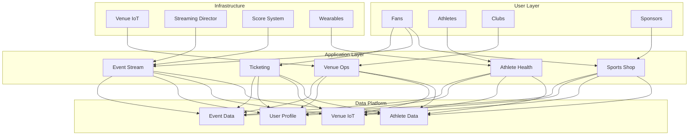
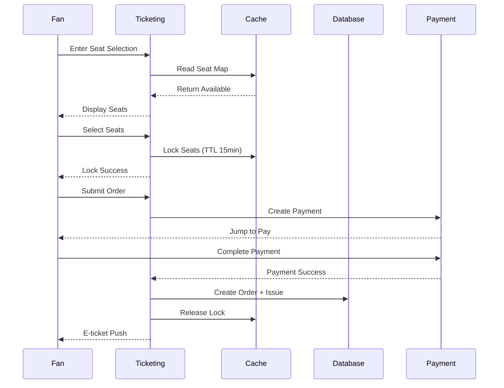
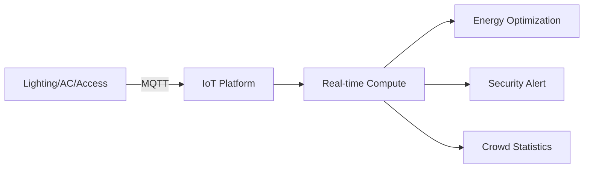

# Sports Technology Architecture Design - Alibaba Cloud Perspective

> **Applicable Version**: Kubernetes v1.29 - v1.33 | **Last Updated**: 2026-04-24
> **Author**: Alibaba Cloud Solutions Architect | **Tags**: `#sports-technology` `#smart-venue` `#events` `#alibaba-cloud`

---

## Table of Contents

1. [Industry Background](#1-industry-background)
2. [Business Architecture](#2-business-architecture)
3. [Technical Architecture](#3-technical-architecture)
4. [Core Data Flow](#4-core-data-flow)
5. [Security and Compliance](#5-security-and-compliance)
6. [Observability](#6-observability)
7. [Alibaba Cloud Component Mapping](#7-alibaba-cloud-component-mapping)
8. [Production Checklist](#8-production-checklist)

---

## 1. Industry Background

### 1.1 Business Characteristics

Sports technology covers smart venues, event operations, athlete health, ticketing and marketing:

| Challenge | Description | Architecture Impact |
|:---|:---|:---|
| Event High Concurrency | Ticket sales 100k+ QPS at launch | Cache + queue + rate limit |
| Venue IoT | Lighting/AC/access/displays | Edge computing + IoT |
| Stream Low Latency | Event stream < 3s latency | CDN + edge nodes |
| Ticket Security | Scalpers/fake tickets | Risk control + real-name |
| Athlete Data | Wearable device data collection | Time-series database |

### 1.2 Core Scenarios

- **Smart Venue**: Smart lighting/temperature/crowd/security
- **Event Streaming**: Multi-angle/slow-mo/data analytics
- **Ticketing System**: Seat selection/rush purchase/e-ticket/transfer
- **Athlete Health**: Wearable data/training plan/social
- **Sports Marketing**: Member/merchandise/sponsor management

---

## 2. Business Architecture

### 2.1 Sports Technology Full-Stack Architecture



### 2.2 Event Ticketing Sequence



---

## 3. Technical Architecture

### 3.1 K8s Deployment

```yaml
# Ticketing Service Deployment
apiVersion: apps/v1
kind: Deployment
metadata:
  name: ticket-service
  namespace: sportstech
spec:
  replicas: 20
  selector:
    matchLabels:
      app: ticket-service
  template:
    metadata:
      labels:
        app: ticket-service
    spec:
      affinity:
        podAntiAffinity:
          requiredDuringSchedulingIgnoredDuringExecution:
            - labelSelector:
                matchExpressions:
                  - key: app
                    operator: In
                    values: [ticket-service]
              topologyKey: topology.kubernetes.io/zone
      containers:
        - name: ticket
          image: registry.cn-hangzhou.aliyuncs.com/sportstech/ticket:v2.5.0
          ports:
            - containerPort: 8080
          env:
            - name: REDIS_CLUSTER
              value: "redis-cluster:6379"
            - name: SEAT_LOCK_TTL_SECONDS
              value: "900"
          resources:
            requests:
              memory: "2Gi"
              cpu: "1000m"
            limits:
              memory: "4Gi"
              cpu: "2000m"
```

---

## 4. Core Data Flow

### 4.1 Venue IoT Data Flow



---

## 5. Security and Compliance

- **Ticket Security**: Real-name + face recognition entry
- **Data Security**: Athlete privacy protection
- **Stream Copyright**: DRM content protection

---

## 6. Observability

- **Ticket Concurrency**: Support 100k QPS
- **Stream Latency**: P99 < 3s
- **System Availability**: 99.99%

---

## 7. Alibaba Cloud Component Mapping

| Functionality | **Alibaba Cloud Solution** |
|:---|:---|
| Container | **ACK Pro** |
| Streaming | **Live Video + CDN** |
| Database | **PolarDB MySQL** |
| Cache | **Redis Enterprise** |
| IoT | **Alibaba Cloud IoT** |
| AI | **Vision AI** |
| Observability | **ARMS + SLS** |

---

## 8. Production Checklist

- [ ] Ticket concurrency stress test pass
- [ ] Streaming CDN pre-warm
- [ ] Venue IoT device integration
- [ ] Face recognition accuracy > 99%
- [ ] E-ticket anti-counterfeit

---

**Maintainer**: Alibaba Cloud Solutions Architect Team | **License**: MIT

<!-- risk-assessed -->
