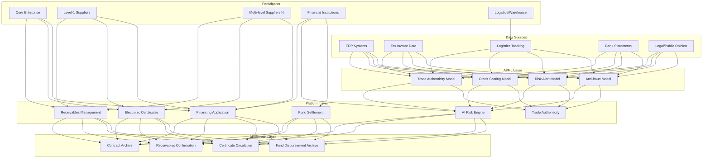
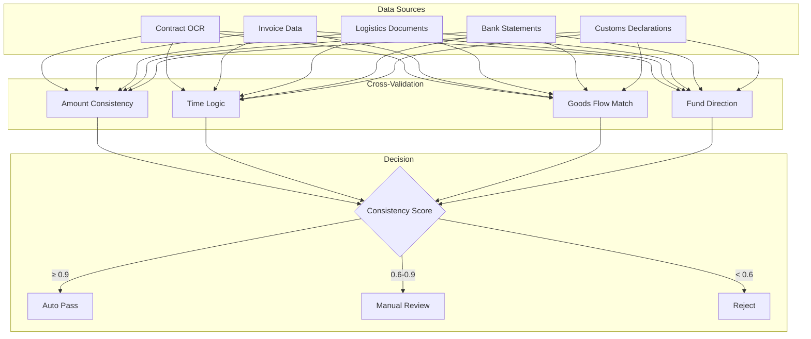

# Supply Chain Finance Architecture Design - Alibaba Cloud Perspective

> **Applicable Version**: Kubernetes v1.29 - v1.33 | **Last Updated**: 2026-04-24
> **Author**: Alibaba Cloud Solutions Architect | **Tags**: `#supply-chain-finance` `#blockchain` `#factoring` `#alibaba-cloud`

---

## Table of Contents

1. [Industry Overview](#1-industry-overview)
2. [Business Scenarios](#2-business-scenarios)
3. [Architecture Design](#3-architecture-design)
4. [Core Technology Stack](#4-core-technology-stack)
5. [Kubernetes Deployment](#5-kubernetes-deployment)
6. [Data Architecture](#6-data-architecture)
7. [AI/ML Components](#7-aiml-components)
8. [Security and Compliance](#8-security-and-compliance)
9. [Best Practices](#9-best-practices)
10. [Anti-Patterns](#10-anti-patterns)
11. [Reference Resources](#11-reference-resources)

---

## 1. Industry Overview

### 1.1 Market Size and Trends

Supply chain finance addresses SME financing challenges, transmitting core enterprise credit through multi-level suppliers to reduce financing costs. China's supply chain finance market projected to grow from 35 trillion yuan in 2024 to 60 trillion yuan in 2030. Blockchain, AI risk control, and electronic receivable certificates are three key technology drivers. Policy support includes Guidelines on Standardizing Development of Supply Chain Finance to Support Supply Chain Stability.

| Metric | 2024 | 2026 (Forecast) | 2030 (Forecast) |
|:---|:---|:---|:---|
| China Supply Chain Finance Balance | ¥35T | ¥45T | ¥60T |
| Blockchain Archive Coverage | 20% | 45% | 80% |
| AI Risk Control Penetration | 30% | 55% | 85% |
| Electronic Receivable Certificate Scale | ¥5T | ¥15T | ¥40T |
| Financing Approval Time | 3-7 days | 1-3 days | Real-time |

### 1.2 Industry Pain Points

| Pain Point | Description | Digital Transformation Driver |
|:---|:---|:---|
| Trust Transmission | Hard to transmit core enterprise credit | Blockchain archive + e-certificates |
| Trade Authenticity | Fake trade/repeat financing risk | Cross-validation of goods/tax/logistics/cash flow |
| Capital Efficiency | Long accounts, slow turnover | Auto disbursement + smart contracts |
| Risk Transmission | Supply chain risk cascades | Real-time AI risk control + alerts |
| Multi-party Collaboration | Core/suppliers/finance coordination | Alliance chain + unified platform |
| Regulatory Compliance | CBIRC/PBoC oversight | Audit trail + data reporting |

---

## 2. Business Scenarios

### 2.1 Accounts Receivable Factoring

Suppliers apply for financing based on receivables from core enterprises. Core enterprise confirms payable on platform, blockchain archive confirms rights, financial institutions assess risk and disburse. Financing rate 2-5 percentage points lower than traditional loans.

### 2.2 Electronic Receivable Certificate Splitting

Core enterprise issues e-certificate (like digital IOU), certificates split and circulate in supply chain. Level-1 supplier can split and transfer to level-2 supplier, transmitting core enterprise credit multi-level. Certificate matures, core enterprise repays.

### 2.3 Order Financing

Supply finance based on core enterprise purchase orders. Suppliers access financing pre-shipment. System validates order authenticity, supplier fulfillment, sets appropriate financing ratios (typically 60-80% of order value).

### 2.4 Inventory Pledge Financing

Suppliers pledge inventory goods for financing. System via IoT sensors real-time monitor warehouse inventory, AI analyzes inventory value and liquidity, dynamically adjusts pledge rate and alert lines.

### 2.5 AI Supply Chain Risk Monitoring

Real-time monitor up-downstream enterprise operations, public opinion, legal risk, financial health. Alert automatically when core enterprise or key suppliers show risk signals, suggesting risk mitigation measures.

---

## 3. Architecture Design

### 3.1 Supply Chain Finance Full-Stack Architecture



---

## 4. Core Technology Stack

| Component | Purpose | Technology | License |
|:---|:---|:---|:---|
| Orchestration | Platform | ACK Pro | Proprietary |
| Blockchain | Trade evidence | Ant Chain BaaS / Hyperledger | Proprietary / Apache 2.0 |
| Smart Contract | Certificate lifecycle | Solidity / Chaincode | Open |
| AI Platform | Risk modeling | PAI / PyTorch | Proprietary / BSD |
| Database | Business data | PolarDB MySQL | Proprietary |
| Cache | Hot data | Redis Enterprise | Proprietary |
| Message Queue | Event processing | RocketMQ 5.x | Apache 2.0 |
| Identity | KYC/eKYC | Alibaba Real Authentication | Proprietary |
| OCR | Invoice/contract recognition | Alibaba Cloud OCR | Proprietary |
| Search | Risk data search | OpenSearch | Apache 2.0 |
| Storage | Document (encrypted) | OSS | Proprietary |
| Monitoring | Observability | ARMS + SLS | Proprietary |

---

## 5. Kubernetes Deployment

### 5.1 Supply Chain Finance Platform Deployment

```yaml
apiVersion: apps/v1
kind: Deployment
metadata:
  name: scf-platform
  namespace: supply-chain-finance
spec:
  replicas: 6
  selector:
    matchLabels:
      app: scf-platform
  template:
    metadata:
      labels:
        app: scf-platform
        tier: core-service
    spec:
      affinity:
        podAntiAffinity:
          requiredDuringSchedulingIgnoredDuringExecution:
            - labelSelector:
                matchLabels:
                  app: scf-platform
              topologyKey: topology.kubernetes.io/zone
      containers:
        - name: platform
          image: registry.cn-hangzhou.aliyuncs.com/scf/platform:v4.0.0
          ports:
            - containerPort: 8080
              name: http
          env:
            - name: BLOCKCHAIN_NODE
              valueFrom:
                configMapKeyRef:
                  name: scf-config
                  key: blockchain-node-url
            - name: RISK_ENGINE_URL
              value: "http://risk-engine:8080"
            - name: DB_CONNECTION
              valueFrom:
                secretKeyRef:
                  name: scf-secrets
                  key: db-connection
            - name: AUDIT_ENABLED
              value: "true"
          resources:
            requests:
              memory: "4Gi"
              cpu: "2000m"
            limits:
              memory: "8Gi"
              cpu: "4000m"
```

### 5.2 AI Risk Engine Deployment

```yaml
apiVersion: apps/v1
kind: Deployment
metadata:
  name: risk-engine
  namespace: supply-chain-finance
spec:
  replicas: 4
  selector:
    matchLabels:
      app: risk-engine
  template:
    metadata:
      labels:
        app: risk-engine
    spec:
      containers:
        - name: risk
          image: registry.cn-hangzhou.aliyuncs.com/scf/risk-engine:v3.0.0
          env:
            - name: MODEL_PATH
              value: "/models/risk-v5"
            - name: MAX_INFERENCE_MS
              value: "500"
            - name: CROSS_VALIDATION_ENABLED
              value: "true"
          resources:
            requests:
              memory: "4Gi"
              cpu: "2000m"
            limits:
              memory: "8Gi"
              cpu: "4000m"
```

---

## 6. Data Architecture

### 6.1 Trade Authenticity Validation Data Flow



---

## 7. AI/ML Components

| Model | Purpose | Input | Output | Framework |
|:---|:---|:---|:---|:---|
| Credit Scoring | Enterprise credit rating | Financial/Trading/Legal | Credit Score (300-850) | XGBoost |
| Trade Authenticity | Trade background verification | Contract/Invoice/Logistics/Flow | Consistency Score (0-1) | Rules + ML |
| Anti-fraud | Fake trade/repeat financing | Trade data/Behavior | Fraud Probability | GNN |
| Risk Alert | Supply chain risk cascade | Public Opinion/Legal/Operation | Risk Level + Cause | BERT + GNN |
| Liquidity Forecast | Capital need prediction | Historical Financing | Future Need | LSTM |
| Invoice Verification | Fake invoice detection | Invoice Image/Data | Real/Fake | OCR + Rules |

---

## 8. Security and Compliance

| Regulation | Scope | Architecture Requirement |
|:---|:---|:---|
| CBIRC Supply Chain Finance Notice | Supply chain finance oversight | Trade authenticity + risk management |
| AML | Anti-money laundering | Customer ID + suspicious monitoring |
| Electronic Signature Law | E-contract validity | CA Digital Signature + timestamp |
| Network Security Law | Financial data security | Information Protection Level 3 + encryption |
| Personal Information Protection | Enterprise info protection | Classification + least privilege |
| PBoC Credit Management | Credit data management | Credit data compliance usage |
| Blockchain Service Backup | Blockchain compliance | Service backup |

---

## 9. Best Practices

1. **Four-flow Validation**: Contract, invoice, logistics, cash flow cross-validation
2. **Blockchain Key Nodes**: All confirmation, transfer, disbursement, repayment on-chain
3. **Certificate Split Limit**: Limit split levels (≤5), prevent excess credit transfer
4. **Real-time Risk Control**: Shift from post-risk to real-time, seconds response
5. **Privacy Computing**: Inter-financial data fusion using privacy computing, no raw exchange
6. **Auto Compliance**: Auto AML checks, KYC, regulatory reporting
7. **Alliance Chain**: Bank/Factoring/Core enterprise shared chain
8. **Dynamic Credit Lines**: Adjust by enterprise real-time operations
9. **Early Alert**: AI alerts 30-90 days before default
10. **Fund Loop**: Directed payment, ensure usage authenticity

---

## 10. Anti-Patterns

1. **Blockchain Formalism**: Surface blockchain use, key data off-chain modifiable. Force core data on-chain
2. **Ignore Trade Authenticity**: Only relying on core enterprise guarantee, no background verification. Use four-flow validation
3. **Excess Credit Transfer**: Unlimited certificate splitting, 5+ levels severe credit decay. Limit split levels
4. **Single-source Risk Control**: Risk assessment only on one data source. Cross-source validation
5. **Ignore AML**: No AML/KYC checks, enable laundering. Enforce AML compliance

---

## 11. Reference Resources

- [CBIRC Supply Chain Finance Notice](https://www.cbirc.gov.cn/)
- [Ant Chain BaaS Docs](https://help.aliyun.com/product/85221.html)
- [Hyperledger Fabric](https://www.hyperledger.org/projects/fabric)
- [Supply Chain Finance White Paper](https://www.nifa.org.cn/)
- [Alibaba Real Authentication Docs](https://help.aliyun.com/product/28308.html)
- [Alibaba Cloud OCR Docs](https://help.aliyun.com/product/30413.html)

---

**Maintainer**: Alibaba Cloud Solutions Architect Team | **License**: MIT

---

## Obsidian Related Documents

- topic-application-architecture MOC
- [[domain-20-application-patterns/topic-application-architecture/README.md|Topic Application Architecture Design Best Practices]]
- [[domain-20-application-patterns/topic-application-architecture/01-ecommerce-architecture.md|E-commerce System Kubernetes Production Architecture]]

## See Also

- 36-carbon-esg-management
- 37-pet-economy
- 39-smart-campus
- 40-cloud-gaming

<!-- risk-assessed -->
