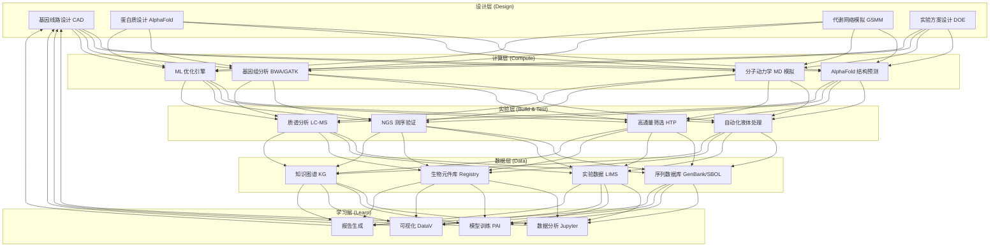
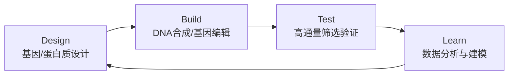
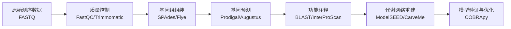
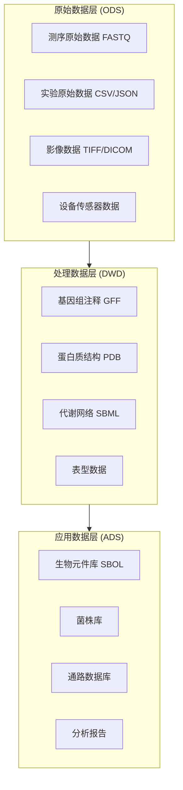

---title: 合成生物学架构设计 — 阿里云视角
description: 'title: 合成生物学架构设计'
summary: 'title: 合成生物学架构设计'
category: general
tags:
- architecture
- best-practice
- docker
- mysql
- kafka
- pdb
- job
- rbac
- operator
- gpu
tier: supporting
created: '2026-05-23'
last_updated: 2026-05
difficulty: intermediate
reading_level: intermediate
audience:
- 所有工程师
estimated_read_time: 15min
intent_queries:
- 合成生物学架构设计 — 阿里云视角 是什么
- 如何 合成生物学架构设计 — 阿里云视角
- Kubernetes 20 application patterns 最佳实践
trigger_keywords:
- 合成生物学架构设计
- 阿里云视角
- application
- patterns
prerequisites:
- kubectl-basics
- prometheus-basics
- kafka-basics
- mysql-basics
- gpu-scheduling-basics
authors:
- name: Dillan Teagle
  role: contributor

---

> **生产环境安全提示**
>
> 本文档包含可直接执行的运维命令。执行前请确认：当前目标集群与 Namespace 是否正确；是否具备足够的 RBAC 权限；是否已在非生产环境验证。命令风险等级标注：🔴 高风险（可能造成数据丢失或服务中断）、🟡 中风险（会修改集群状态，但通常可回滚）、🟢 低风险/只读（信息收集，无副作用）。


title: 合成生物学架构设计
description: '# 合成生物学架构设计 — 阿里云视角'
category: application-architecture
tags:
- k8s
- architecture
- industry
- docker
- mysql
- kafka
- pdb
- job
- rbac
- operator
last_updated: '2026-05-18'
difficulty: expert
reading_level: expert
audience:
- 生物科技架构师
- 计算生物学家
- 基因工程开发者
- 阿里云解决方案架构师
estimated_read_time: 5min
intent_queries:
- 合成生物学平台架构设计
- AlphaFold蛋白质结构预测K8s
- 基因设计CAD软件
- DBTL工程化研发
- LIMS实验室数据管理
trigger_keywords:
- 合成生物学
- 基因设计
- AlphaFold
- 蛋白质工程
- DBTL
- 代谢工程
- 生物制造
- LIMS
- SBOL
- 生物安全
related_domains:
- domain-01-cluster-fundamentals
- domain-9-ai-ml
- domain-7-observability
- domain-03-networking-traffic
related_topics:
- domain-20-application-patterns/topic-application-architecture/57-digital-therapeutics
- domain-20-application-patterns/topic-application-architecture/14-smart-healthcare-architecture
- domain-02-workloads-applications/topic-functions/04-high-concurrency-system
- domain-02-workloads-applications/topic-functions/10-message-queue
k8s_versions:
- '1.28'
- '1.29'
- '1.30'
- '1.31'
- '1.32'
---

# 合成生物学架构设计 — 阿里云视角

> **适用版本**: [[Kubernetes|Kubernetes]] v1.29 - v1.33 | **最后更新**: 2026-04-24
> **作者**: 阿里云解决方案架构师 | **标签**: `#合成生物学` `#基因设计` `#生物制造` `#阿里云`

---

<!-- chunk: 目录 -->## 目录

1. [行业概述](#1-行业概述)
2. [业务场景](#2-业务场景)
3. [架构设计](#3-架构设计)
4. [核心技术栈](#4-核心技术栈)
5. [K8s 部署方案](#5-k8s-部署方案)
6. [数据架构](#6-数据架构)
7. [AI/ML 组件](#7-aiml-组件)
8. [安全合规](#8-安全合规)
9. [最佳实践](#9-最佳实践)
10. [反模式](#10-反模式)
11. [参考资源](#11-参考资源)

---

<!-- chunk: 1. 行业概述 -->## 1. 行业概述

## 1.1 行业背景

合成生物学（Synthetic Biology）是利用工程化原理设计和构建新型生物系统的交叉学科，被公认为继信息技术之后的下一代颠覆性技术。通过标准化生物元件（BioBrick）、DNA 合成技术、基因编辑工具和自动化实验平台，合成生物学实现了"设计-构建-测试-学习"（DBTL）的工程化研发范式。全球合成生物学市场规模预计到 2030 年将超过 1000 亿美元，涵盖生物医药（新药开发、细胞治疗、mRNA 疫苗）、生物制造（生物基化学品、可降解材料、生物燃料）、农业（合成肥料、抗病作物、替代蛋白）和环境（生物修复、碳捕获）等战略领域。

## 1.2 行业挑战

| 挑战 | 说明 | 架构影响 |
|:---|:---|:---|
| 数据爆炸 | 基因测序数据指数增长，单个基因组 100GB+ | 高性能存储 OSS + 数据湖 DLF |
| 计算密集 | 蛋白质折叠/分子动力学模拟需要海量算力 | GPU 集群 GN10 + E-HPC 弹性调度 |
| 实验自动化 | 液相机器人高通量筛选需要精确控制 | IoT 设备控制 + LIMS 集成 |
| 知识图谱 | 生物元件标准化和复用需要结构化知识 | 图数据库 GDB + SBOL 标准接口 |
| 生物安全 | 基因编辑伦理风险和致病序列筛查 | 权限管控 + 审批流程 + 审计日志 |
| 跨学科协作 | 生物学家/计算科学家/工程师协同 | 统一数据平台 + 可视化分析 |
| 监管合规 | GMO 释放监管、基因治疗临床审批 | 数据溯源 + 电子签名 + 合规报告 |

## 1.3 市场格局

全球合成生物学行业呈现出北美领先、欧洲追赶、亚洲崛起的格局。北美拥有 Ginkgo Bioworks、Zymergen、Twist Bioscience 等头部企业；欧洲在工业生物技术方面具有传统优势（BASF、Novozymes）；亚洲市场以中国为代表，华大基因、凯赛生物、蓝晶微生物等企业快速成长。中国在国家"十四五"规划中将合成生物学列为战略性前沿技术，在天津、深圳、上海等地建立了合成生物学研究中心。

---

<!-- chunk: 2. 业务场景 -->## 2. 业务场景

## 2.1 基因设计

DNA 序列设计与优化是合成生物学的基础环节。核心功能包括密码子优化（根据宿主偏好调整密码子使用频率）、基因元件组装（启动子-编码序列-终止子的标准化组装）、调控元件设计（核糖体结合位点强度预测、启动子库筛选）。业务流程为：目标蛋白序列输入→密码子优化→元件选择与组装→序列验证（BLAST 比对/酶切位点分析）→DNA 合成订单提交。

## 2.2 蛋白质工程

基于 AlphaFold2/3 的蛋白质结构预测与改造是合成生物学的核心计算任务。场景包括：全新蛋白质设计（从零设计具有特定功能的蛋白质序列）、蛋白质改造（在现有蛋白质基础上优化稳定性、活性、表达量）、蛋白质-蛋白质相互作用预测、酶催化活性预测。蛋白质工程的计算流程需要 GPU 集群支撑，单次 AlphaFold 预测需要约 30 分钟到数小时的 GPU 时间。

## 2.3 代谢工程

代谢网络模拟与菌株优化是生物制造的核心环节。通过基因组规模代谢网络模型（GSMM），模拟微生物菌株在各种条件下的代谢通量分布，预测基因敲除/过表达对目标产物产量的影响。核心工具包括 COBRApy（约束基建模）、MEMOTE（模型质量评估）、 cameo （菌株设计算法）。代谢工程需要构建高质量的基因组注释和代谢网络数据库。

## 2.4 自动化实验

高通量筛选平台与液体处理机器人的集成管理。场景包括：自动化克隆构建（Golden Gate 组装、Gibson 组装）、高通量筛选（96/384 孔板的自动化培养和检测）、发酵过程监控（DO/pH/温度实时监测）。自动化实验平台需要与 LIMS 系统紧密集成，实现实验设计→设备调度→数据采集→结果分析的全流程自动化。

## 2.5 生物信息学

基因组组装/注释/比较分析流水线。涵盖短读长（Illumina）和长读长（PacBio/Nanopore）测序数据的处理流程：原始数据质控→基因组组装→基因预测与注释→变异检测→比较基因组学分析。生物信息学流水线通常以 CWL/WDL/Nexflow 等工作流语言描述，在 K8s 上以 Argo Workflows 或 Nextflow 调度执行。

---

<!-- chunk: 3. 架构设计 -->## 3. 架构设计

## 3.1 合成生物学平台全景架构



## 3.2 DBTL 闭环流程



## 3.3 生物信息学流水线架构



---

<!-- chunk: 4. 核心技术栈 -->## 4. 核心技术栈

## 4.1 计算工具链

| 类别 | 开源工具/平台 | 阿里云方案 | 说明 |
|:---|:---|:---|:---|
| 蛋白质预测 | AlphaFold2/3, RoseTTAFold | PAI-EAS 部署 | GPU 推理服务 |
| 分子动力学 | GROMACS, AMBER, LAMMPS | E-HPC 集群 | 高性能并行模拟 |
| 序列分析 | BWA, GATK, BLAST+ | ACK 批处理 Job | 基因组比对与变异检测 |
| 代谢建模 | COBRApy, cameo, MEMOTE | ACK + PAI-DSW | 菌株设计优化 |
| 工作流引擎 | Nextflow, Snakemake, Argo | ACK + Argo Workflows | 流水线编排 |
| 基因设计 | DNAWorks, GenSmart, Benchling | 自研 SaaS 服务 | 序列设计与优化 |
| 生物元件库 | iGEM Registry, SynBioHub | PolarDB + 图数据库 GDB | 标准化元件管理 |
| 可视化 | Jupyter, NGL Viewer, DataV | PAI-DSW + DataV | 数据分析与可视化 |

## 4.2 实验自动化技术栈

| 类别 | 工具/协议 | 说明 |
|:---|:---|:---|
| LIMS 系统 | LabKey, Labware, 自研 | 实验数据管理 |
| 液体处理 | Hamilton, Tecan, Opentrons | 自动化移液 |
| 高通量筛选 | BMG, BioTek 酶标仪 | 96/384 孔板检测 |
| 发酵监控 | Sartorius, Eppendorf 生物反应器 | DO/pH/OD 实时监测 |
| 协议标准 | SiLA2, OPC UA, REST API | 设备通信协议 |
| 数据标准 | SBOL, GenBank, FASTA, PDB | 生物数据格式 |

---

<!-- chunk: 5. K8s 部署方案 -->## 5. K8s 部署方案

## 5.1 AlphaFold 推理服务

```yaml
apiVersion: apps/v1
kind: Deployment
metadata:
  name: alphafold-inference
  namespace: synthetic-biology
spec:
  replicas: 2
  selector:
    matchLabels:
      app: alphafold-inference
  template:
    metadata:
      labels:
        app: alphafold-inference
    spec:
      nodeSelector:
        accelerator: nvidia-a100
      runtimeClassName: nvidia
      containers:
        - name: alphafold
          image: registry.cn-hangzhou.aliyuncs.com/synbio/alphafold:v2.3.0-gpu
          ports:
            - containerPort: 8080
              name: http-api
            - containerPort: 8501
              name: grpc-api
          command: ["python", "run_alphafold.py"]
          args:
            - "--fasta_paths=/input/sequence.fasta"
            - "--output_dir=/output"
            - "--use_gpu_relax=true"
            - "--model_preset=monomer_ptm"
          env:
            - name: NVIDIA_VISIBLE_DEVICES
              value: "all"
            - name: ALPHAFOLD_DB_PATH
              value: "/data/alphafold_db"
          resources:
            requests:
              nvidia.com/gpu: 1
              memory: "128Gi"
              cpu: "32000m"
            limits:
              nvidia.com/gpu: 1
              memory: "256Gi"
              cpu: "64000m"
          volumeMounts:
            - name: alphafold-db
              mountPath: /data/alphafold_db
              readOnly: true
            - name: input-data
              mountPath: /input
            - name: output-data
              mountPath: /output
      volumes:
        - name: alphafold-db
          persistentVolumeClaim:
            claimName: alphafold-db-pvc
        - name: input-data
          emptyDir: {}
        - name: output-data
          persistentVolumeClaim:
            claimName: alphafold-output-pvc
```

## 5.2 生物信息学批处理作业

```yaml
apiVersion: batch/v1
kind: Job
metadata:
  name: genome-annotation-${RUN_ID}
  namespace: synthetic-biology
  labels:
    pipeline: genome-annotation
spec:
  backoffLimit: 3
  ttlSecondsAfterFinished: 86400
  template:
    spec:
      containers:
        - name: annotation
          image: registry.cn-hangzhou.aliyuncs.com/synbio/genome-annotation:v1.5.0
          command: ["nextflow", "run", "main.nf"]
          args:
            - "-profile,k8s"
            - "--input,/data/assembly.fasta"
            - "--output,/data/annotation"
            - "--threads,32"
          env:
            - name: NXF_WORK
              value: "/work"
            - name: GENOME_REF
              value: "GRCh38"
          resources:
            requests:
              memory: "64Gi"
              cpu: "32000m"
            limits:
              memory: "128Gi"
              cpu: "64000m"
          volumeMounts:
            - name: data
              mountPath: /data
            - name: work
              mountPath: /work
      volumes:
        - name: data
          persistentVolumeClaim:
            claimName: bioinfo-data-pvc
        - name: work
          emptyDir:
            medium: Memory
            sizeLimit: 32Gi
      restartPolicy: Never
```

## 5.3 LIMS 数据管理服务

```yaml
apiVersion: apps/v1
kind: Deployment
metadata:
  name: lims-service
  namespace: synthetic-biology
spec:
  replicas: 3
  selector:
    matchLabels:
      app: lims-service
  template:
    metadata:
      labels:
        app: lims-service
    spec:
      affinity:
        podAntiAffinity:
          preferredDuringSchedulingIgnoredDuringExecution:
            - weight: 100
              podAffinityTerm:
                labelSelector:
                  matchExpressions:
                    - key: app
                      operator: In
                      values:
                        - lims-service
                topologyKey: kubernetes.io/hostname
      containers:
        - name: lims
          image: registry.cn-hangzhou.aliyuncs.com/synbio/lims-service:v2.0.0
          ports:
            - containerPort: 8080
          env:
            - name: DB_HOST
              valueFrom:
                secretKeyRef:
                  name: synbio-db-secret
                  key: host
            - name: OSS_BUCKET
              value: "synbio-experiment-data"
            - name: KAFKA_BROKERS
              value: "kafka-synbio:9092"
          resources:
            requests:
              memory: "4Gi"
              cpu: "2000m"
            limits:
              memory: "8Gi"
              cpu: "4000m"
          livenessProbe:
            httpGet:
              path: /actuator/health/liveness
              port: 8080
            initialDelaySeconds: 30
            periodSeconds: 15
          readinessProbe:
            httpGet:
              path: /actuator/health/readiness
              port: 8080
            initialDelaySeconds: 10
            periodSeconds: 5
```

---

<!-- chunk: 6. 数据架构 -->## 6. 数据架构

## 6.1 数据分层



## 6.2 数据存储策略

| 数据类型 | 存储方案 | 保留策略 | 说明 |
|:---|:---|:---|:---|
| 测序原始数据 | OSS 归档存储 | 永久 | 单次测序 100GB+，冷数据归档 |
| 蛋白质结构 | OSS 标准存储 | 永久 | PDB 文件，高频访问 |
| 基因组数据库 | PolarDB + Lindorm | 永久 | 参考基因组索引 |
| 实验数据 | PolarDB MySQL | 10 年 | LIMS 结构化数据 |
| 分析结果 | OSS + Hologres | 按需 | 交互式查询 |
| 元数据 | 图数据库 GDB | 永久 | 生物元件关系图谱 |

---

<!-- chunk: 7. AI/ML 组件 -->## 7. AI/ML 组件

## 7.1 密码子优化模型

```python
from typing import Dict, List
import numpy as np

class CodonOptimizer:
    CODON_TABLE: Dict[str, list] = {
        'F': ['TTT', 'TTC'],
        'L': ['TTA', 'TTG', 'CTT', 'CTC', 'CTA', 'CTG'],
        'I': ['ATT', 'ATC', 'ATA'],
        'M': ['ATG'],
        'V': ['GTT', 'GTC', 'GTA', 'GTG'],
        'S': ['TCT', 'TCC', 'TCA', 'TCG', 'AGT', 'AGC'],
        'P': ['CCT', 'CCC', 'CCA', 'CCG'],
        'T': ['ACT', 'ACC', 'ACA', 'ACG'],
        'A': ['GCT', 'GCC', 'GCA', 'GCG'],
        'Y': ['TAT', 'TAC'],
        'H': ['CAT', 'CAC'],
        'Q': ['CAA', 'CAG'],
        'N': ['AAT', 'AAC'],
        'K': ['AAA', 'AAG'],
        'D': ['GAT', 'GAC'],
        'E': ['GAA', 'GAG'],
        'C': ['TGT', 'TGC'],
        'W': ['TGG'],
        'R': ['CGT', 'CGC', 'CGA', 'CGG', 'AGA', 'AGG'],
        'G': ['GGT', 'GGC', 'GGA', 'GGG'],
    }

    def __init__(self, host: str = "ecoli"):
        self.host = host
        self.codon_usage = self._load_codon_usage(host)

    def optimize(self, protein_seq: str) -> str:
        dna = []
        for aa in protein_seq.upper():
            if aa in self.CODON_TABLE:
                codons = self.CODON_TABLE[aa]
                best = self._select_codon(aa, codons)
                dna.append(best)
            elif aa == '*':
                dna.append('TAA')
        return ''.join(dna)

    def _select_codon(self, aa: str, codons: list) -> str:
        if not self.codon_usage:
            return codons[0]
        scores = [(c, self.codon_usage.get(c, 0.01)) for c in codons]
        scores.sort(key=lambda x: x[1], reverse=True)
        return scores[0][0]

    def _load_codon_usage(self, host: str) -> dict:
        usage_tables = {
            "ecoli": {
                'ATG': 1.0, 'TGG': 1.0, 'TTT': 0.58, 'TTC': 0.42,
                'ATT': 0.49, 'ATC': 0.39, 'ATA': 0.12,
            },
        }
        return usage_tables.get(host, {})
```

## 7.2 AI 应用矩阵

| AI 场景 | 模型/算法 | 输入 | 输出 | 硬件需求 |
|:---|:---|:---|:---|:---|
| 蛋白质结构预测 | AlphaFold2/3 | 氨基酸序列 | 3D 结构 PDB | A100 1-4 卡 |
| 蛋白质设计 | ProteinMPNN, RFdiffusion | 功能约束 | 序列候选 | A100 1-2 卡 |
| gRNA 效率预测 | DeepCRISPR, CRISPR-ML | gRNA 序列 | 评分/排名 | T4 1 卡 |
| 代谢通量预测 | GNN + 约束优化 | 基因组+环境 | 通量分布 | CPU 密集 |
| 菌株优化 | 贝叶斯优化/BO | 历史实验数据 | 改造方案 | CPU |
| 表型预测 | CNN/Transformer | 基因型 | 表型预测 | T4/A100 |
| 实验异常检测 | Isolation Forest, LSTM | 设备传感器流 | 异常告警 | CPU |

---

<!-- chunk: 8. 安全合规 -->## 8. 安全合规

## 8.1 生物安全管控

| 安全层级 | 措施 | 技术实现 |
|:---|:---|:---|
| 序列筛查 | 致病序列自动筛查 | BLAST 比对致病数据库 |
| 权限管控 | 敏感操作审批流程 | RBAC + 工作流审批 |
| 数据加密 | 基因数据端到端加密 | AES-256 + TLS 1.3 |
| 审计追踪 | 操作日志不可篡改 | SLS 审计日志 + 区块链存证 |
| 伦理合规 | 人类基因编辑审批 | 电子签名 + 伦理委员会审批流 |
| 物理安全 | 实验室门禁控制 | IoT 门禁 + 视频监控 |

## 8.2 合规框架

- **生物安全法**: 高风险病原微生物实验审批，基因编辑生物安全管理
- **人类遗传资源管理条例**: 人类基因组数据出境审批，采样知情同意
- **GMO 监管**: 基因修饰 organism 环境释放审批
- **GMP/GLP**: 药品生产质量管理规范，实验室良好操作规范
- **数据安全法**: 基因数据分级分类管理，敏感数据脱敏处理

---

<!-- chunk: 9. 最佳实践 -->## 9. 最佳实践

- **容器化生信软件**: 使用 Docker/Singularity 封装生物信息学软件（BWA、GATK、AlphaFold），确保分析环境可复现
- **GPU 加速推理**: AlphaFold 等深度学习模型使用 A100 GPU 加速，推理时间从数小时降至数十分钟
- **LIMS 深度集成**: 实验数据自动采集进入 LIMS 系统，消除手工录入错误
- **生物安全筛查**: 基因合成请求自动比对致病序列数据库（NCBI Pathogen），命中后触发人工审核
- **DBTL 工作流闭环**: 建立从设计到学习的数据自动回流机制，每轮实验数据自动进入知识库指导下一轮设计
- **数据标准化**: 采用 SBOL（合成生物学开源语言）标准描述生物元件，GenBank/FASTA 标准存储序列数据
- **弹性计算调度**: 利用 E-HPC 的弹性调度能力，在计算高峰期自动扩容 GPU 节点，低谷期自动释放

---

<!-- chunk: 10. 反模式 -->## 10. 反模式

## 10.1 忽视生物安全

基因合成不筛查致病序列，直接下单合成。

**解决方案**: 集成致病序列数据库（NCBI Pathogen Detection、BacDive），所有基因合成请求自动 BLAST 筛查，命中致病序列的订单触发安全委员会人工审核。

## 10.2 计算与实验脱节

计算预测不与实验验证闭环，设计和实验数据分散在不同系统中。

**解决方案**: 建立 DBTL 工作流引擎，将计算设计结果自动转换为实验方案，实验数据自动回流到分析平台，形成闭环迭代。

## 10.3 数据不标准化

实验数据格式不统一，不同实验员使用不同模板，数据难以横向比较。

**解决方案**: 采用 SBOL/GenBank 标准格式描述生物元件和序列数据，LIMS 系统强制使用标准实验协议模板，数据入库前自动校验格式。

## 10.4 单体架构处理大规模数据

将基因组比对等大规模计算任务放在单体应用中处理，无法利用集群并行能力。

**解决方案**: 使用 Argo Workflows/Nextflow 构建分布式计算流水线，将计算任务拆分为可并行的子任务在 K8s 集群上执行。

---

<!-- chunk: 11. 参考资源 -->## 11. 参考资源

## 11.1 阿里云组件映射

| 功能域 | 阿里云云原生方案 | 说明 |
|:---|:---|:---|
| 容器平台 | **ACK Pro + GPU 节点池** | GPU 任务调度 |
| GPU 计算 | **GN10/GN7 实例** | A100/V100 GPU |
| 高性能计算 | **E-HPC** | 分子动力学并行计算 |
| 对象存储 | **OSS + DLF** | PB 级测序数据湖 |
| 数据库 | **PolarDB + 图数据库 GDB** | 结构化数据+生物元件图谱 |
| AI 平台 | **PAI-DSW + PAI-EAS** | 模型开发与推理服务 |
| 工作流 | **ACK + Argo Workflows** | 生信流水线编排 |
| 可观测性 | **ARMS + SLS** | 全链路监控 |

## 11.2 生产检查清单

- [ ] AlphaFold 预测精度验证（GDT-TS > 85）
- [ ] 高通量实验设备 SiLA2/OPC UA 集成测试
- [ ] 基因数据隐私保护（加密存储+脱敏展示）
- [ ] 生物安全伦理审批流程完整
- [ ] 计算环境可复现性（Docker 镜像版本锁定）
- [ ] 致病序列筛查覆盖率 > 99%
- [ ] LIMS 数据备份与灾难恢复演练
- [ ] 数据标准格式符合 SBOL/GenBank 规范

---

**维护者**: 阿里云解决方案架构师团队 | **许可证**: MIT

---

<!-- chunk: Obsidian 相关文档 -->## Obsidian 相关文档

- topic-application-architecture MOC
- [[domain-20-application-patterns/topic-application-architecture/README.md|Topic 应用层架构设计最佳实践]]
- [[domain-20-application-patterns/topic-application-architecture/01-ecommerce-architecture.md|电商系统 Kubernetes 生产架构设计]]
- [[domain-20-application-patterns/topic-application-architecture/02-mini-program-architecture.md|小程序平台架构设计]]
- [[domain-20-application-patterns/topic-application-architecture/03-cms-architecture.md|内容管理系统 CMS 架构设计]]
- [[domain-20-application-patterns/topic-application-architecture/04-im-rtc-architecture.md|实时通信 IM/RTC 架构设计]]
- [[domain-20-application-patterns/topic-application-architecture/05-online-education-architecture.md|在线教育平台 Kubernetes 生产架构设计]]
- [[domain-20-application-patterns/topic-application-architecture/06-fintech-architecture.md|金融科技FinTech Kubernetes生产架构设计]]
- [[domain-20-application-patterns/topic-application-architecture/07-iot-platform-architecture.md|物联网 IoT 平台架构设计]]
- [[domain-20-application-patterns/topic-application-architecture/08-ai-ml-inference-architecture.md|AI/ML 推理服务 Kubernetes 生产架构设计]]
- [[domain-20-application-patterns/topic-application-architecture/09-gaming-backend-architecture.md|游戏后端 Kubernetes 生产架构设计]]
- [[domain-20-application-patterns/topic-application-architecture/10-social-media-architecture.md|社交媒体平台Kubernetes生产架构设计]]

## See Also

- 74-immersive-xr
- 75-affective-computing
- 77-fusion-energy-monitoring
- 78-deep-sea-exploration

## Related

- topic-application-architecture MOC — Cross-reference


<!-- risk-assessed -->
