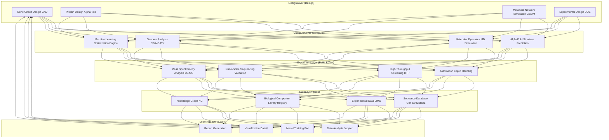
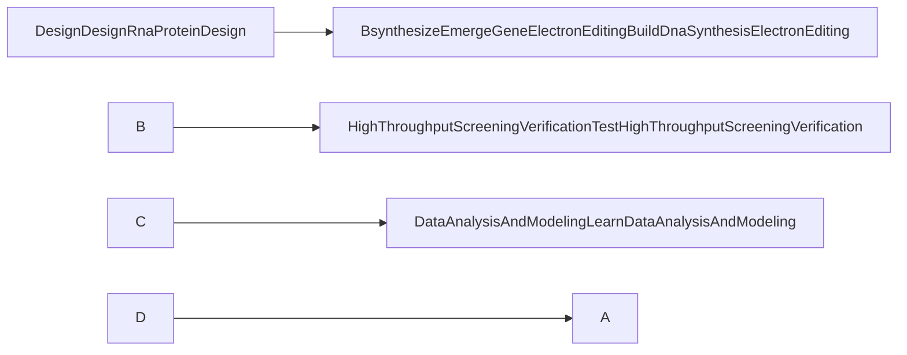
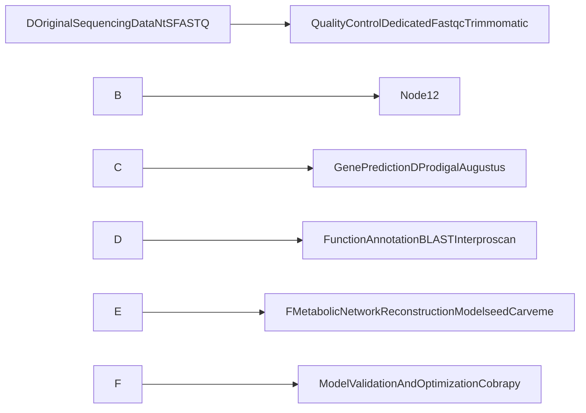
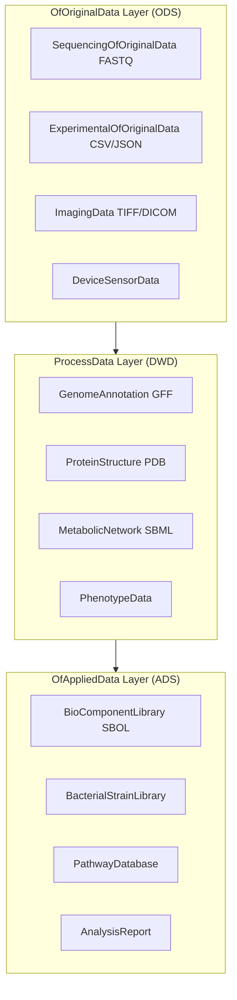

# Synthetic Biology Architecture Design — Alibaba Cloud Perspective

> **Applicable Version**: [[Kubernetes|Kubernetes]] v1.29 - v1.33 | **Last Updated**: 2026-04-24
> **Author**: Alibaba Cloud Solution Architect | **Tags**: `#synthetic biology` `#gene design` `#biomanufacturing` `#alibaba cloud`

---

## Table of Contents

1. [Industry Overview](#1-industry-overview)
2. [Business Scenarios](#2-business-scenarios)
3. [Architecture Design](#3-architecture-design)
4. [Core Technology Stack](#4-core-technology-stack)
5. [K8s Deployment Plan](#5-kubernetes-deployment-solutions)
6. [Data Architecture](#6-data-architecture)
7. [AI/ML Components](#7-aiml-components)
8. [Compliance and Security](#8-compliance-and-security)
9. [Best Practices](#9-best-practices)
10. [Anti-patterns](#10-anti-patterns)
11. [Reference Resources](#11-reference-resources)

---

## 1. Industry Overview

## 1.1 Industry Background

Synthetic Biology (SynBio) is an interdisciplinary field that designs and builds new biological systems using engineering principles. It is widely recognized as the next disruptive technology following Information Technology. Through standardized biological components (BioBricks), DNA synthesis technologies, gene editing tools, and automated experimental platforms, SynBio has established the "Design-Build-Test-Learn" (DBTL) engineering research paradigm. The global market size for SynBio is expected to exceed $100 billion by 2030, covering strategic fields such as biomedicine (new drug development, cell therapy, mRNA vaccines), bio-manufacturing (biobased chemicals, degradable materials, biofuels), agriculture (synthetic fertilizers, disease-resistant crops, alternative proteins), and environment (bioremediation, carbon capture).

## 1.2 Industry Challenges

| Challenge | Description | Impact on Architecture |
|:---|:---|:---|
| Data Explosion | Genomic sequencing data is growing exponentially, with a single genome exceeding 100GB | High-performance storage OSS + Data Lake DLF |
| Compute Intensive | Protein folding/molecular dynamics simulations require massive computational power | GPU cluster GN10 + Elastic HPC scheduling |
| Experiment Automation | High-throughput screening with liquid-phase robots requires precise control | IoT device control + LIMS integration |
| Knowledge Graph | Standardization and reuse of biological components require structured knowledge | Graph database GDB + SBOL standard interface |
| Biosecurity | Ethical risks associated with gene editing and screening for pathogenic sequences | Permission management + Approval process + Audit logs |
| Interdisciplinary Collaboration | Collaboration between biologists, computational scientists, and engineers | Unified data platform + Visualization analysis |
| Regulatory Compliance | Oversight of GMO releases, clinical approval for gene therapies | Data provenance + Electronic signatures + Compliance reports |

## 1.3 Market Landscape

There is a global landscape where the synthetic biology industry leads in North America, follows in Europe, and rises in Asia. North America boasts leading companies such as Ginkgo Bioworks, Zymergen, and Twist Bioscience; Europe has traditional strengths in industrial biotechnology (BASF, Novozymes); the Asian market is represented by China, where companies like Dawei Gene, Kaisai Bio, and Blue Crystal Microbes are rapidly growing. In China's "14th Five-Year Plan," synthetic biology is listed as a strategic emerging technology, and research centers for synthetic biology have been established in Tianjin, Shenzhen, and Shanghai.

---

## 2. Business Scenarios

## 2.1 Gene Design

DNA sequence design and optimization are foundational steps in SynBio. Core functions include codon optimization (adjusting the frequency of codon usage according to host preferences), assembly of genetic elements (standardized assembly of promoters-coding sequences-terminators), and design of regulatory elements (predicting ribosome binding site strength and screening promoter libraries). The business process involves: inputting target protein sequence → codon optimization → selection and assembly of elements → sequence validation (BLAST comparison/enzyme cutting site analysis) → submission of DNA synthesis orders.

## 2.2 Protein Engineering

Protein structure prediction and optimization based on AlphaFold2/3 are core computational tasks in synthetic biology. Scenarios include: designing new proteins from scratch (creating specific functional protein sequences), optimizing existing proteins (improving stability, activity, expression levels), predicting protein-protein interactions, and predicting enzyme catalytic activities. The computational workflow for protein engineering requires support from GPU clusters, with a single AlphaFold prediction taking about 30 minutes to several hours of GPU time.

## 2.3 Metabolic Engineering

Metabolic network simulation and strain optimization are core components of biomanufacturing. Using genome-scale metabolic network models (GSMM), simulate metabolic flux distributions in microbial strains under various conditions, and predict the impact of gene knockout/overexpression on target product yields. Core tools include COBRApy (constraint-based modeling), MEMOTE (model quality assessment), and cameo (strain design algorithms). Metabolic engineering requires building high-quality genome annotations and metabolic network databases.

## 2.4 Automation Experiments

Integrating high-throughput screening platforms with liquid handling robots for integrated management. Scenarios include: automated cloning construction (Golden Gate assembly, Gibson assembly), high-throughput screening (automated cultivation and detection in 96/384 well plates), fermentation process monitoring (real-time monitoring of DO/pH/temperature). Automation experimental platforms need to be tightly integrated with LIMS systems to achieve full automation from experimental design to device scheduling, data collection, and result analysis.

## 2.5 Bioinformatics

Genome assembly/annotation/comparative analysis pipelines. Covering processing workflows for short-read (Illumina) and long-read (PacBio/Nanopore) sequencing data: raw data quality control → genome assembly → gene prediction and annotation → variant detection → comparative genomics analysis. Bioinformatics pipelines are typically described using CWL/WDL/Nexflow workflows and executed on K8s using Argo Workflows or Nextflow schedulers.

---

## 3. Architecture Design

## 3.1 Panorama Architecture of Synthetic Biology Platform


```mermaid
graph TB
    subgraph DesignLayer["DesignLayer (Design)"]
        D1[Gene Circuit Design CAD]
        D2[Protein Design AlphaFold]
        D3[Metabolic Network Simulation GSMM]
        D4[Experimental Design DOE]
    end

    subgraph ComputeLayer["ComputeLayer (Compute)"]
        C1[AlphaFold Structure Prediction]
        C2[Molecular Dynamics MD Simulation]
        C3[Genome Analysis BWA/GATK]
        C4[Machine Learning Optimization Engine]
    end

    subgraph ExperimentLayer["ExperimentLayer (Build & Test)"]
        E1[Automation Liquid Handling]
        E2[High-Throughput Screening HTP]
        E3[Nano-Scale Sequencing Validation]
        E4[Mass Spectrometry Analysis LC-MS]
    end

    subgraph DataLayer["DataLayer (Data)"]
        DATA1[Sequence Database GenBank/SBOL]
        DATA2[Experimental Data LIMS]
        DATA3[Biological Component Library Registry]
        DATA4[Knowledge Graph KG]
    end

    subgraph LearningLayer["LearningLayer (Learn)"]
        L1[Data Analysis Jupyter]
        L2[Model Training PAI]
        L3[Visualization DataV]
        L4[Report Generation]
    end

    D1 & D2 & D3 & D4 --> C1 & C2 & C3 & C4
    C1 & C2 & C3 & C4 --> E1 & E2 & E3 & E4
    E1 & E2 & E3 & E4 --> DATA1 & DATA2 & DATA3 & DATA4
    DATA1 & DATA2 & DATA3 & DATA4 --> L1 & L2 & L3 & L4
    L1 & L2 & L3 & L4 --> D1
```

## 3.2 Closed-loop Process of DBTL


```mermaid
flowchart LR
    DesignDesignRnaProteinDesign --> BsynthesizeEmergeGeneElectronEditingBuildDnaSynthesisElectronEditing
    B --> HighThroughputScreeningVerificationTestHighThroughputScreeningVerification
    C --> DataAnalysisAndModelingLearnDataAnalysisAndModeling
    D --> A
```

## 3.3 Bioinformatics Pipeline Architecture


```mermaid
flowchart LR
    DOriginalSequencingDataNtSFASTQ --> QualityControlDedicatedFastqcTrimmomatic
    B --> Node12
    C --> GenePredictionDProdigalAugustus
    D --> FunctionAnnotationBLASTInterproscan
    E --> FMetabolicNetworkReconstructionModelseedCarveme
    F --> ModelValidationAndOptimizationCobrapy
```

---

## 4. Core Technology Stack

## 4.1 Computational Toolchain

| Category | Open Source Tools/Platforms | Alibaba Cloud Solution | Description |
|:---|:---|:---|:---|
| Protein Prediction | AlphaFold2/3, RoseTTAFold | PAI-EAS Deployment | GPU inference service |
| Molecular Dynamics | GROMACS, AMBER, LAMMPS | E-HPC Cluster | High-performance parallel simulation |
| Sequence Analysis | BWA, GATK, BLAST+ | ACK Batch Job | Genome alignment and variant detection |
| Metabolic Modeling | COBRApy, cameo, MEMOTE | ACK + PAI-DSW | Strain design optimization |
| Workflow Engine | Nextflow, Snakemake, Argo | ACK + Argo Workflows | Pipeline orchestration |
| Gene Design | DNAWorks, GenSmart, Benchling | Self-developed SaaS service | Sequence design and optimization |
| Biobrick Library | iGEM Registry, SynBioHub | PolarDB + Graph database GDB | Standardized component management |
| Visualization | Jupyter, NGL Viewer, DataV | PAI-DSW + DataV | Data analysis and visualization |

## 4.2 Experimental Automation Technology Stack

| Category | Tool/Protocol | Description |
|:---|:---|:---|
| LIMS System | LabKey, Labware, Self-developed | Experiment data management |
| Liquid Handling | Hamilton, Tecan, Opentrons | Automated pipetting |
| High-throughput Screening | BMG, BioTek microplate readers | Detection in 96/384 wells |
| Fermentation Monitoring | Sartorius, Eppendorf bioreactors | Real-time monitoring of DO/pH/OD |
| Protocol Standards | SiLA2, OPC UA, REST API | Device communication protocols |
| Data Standards | SBOL, GenBank, FASTA, PDB | Biological data formats |

---

## 5. Kubernetes Deployment Solutions

## 5.1 AlphaFold Inference Service

```yaml
apiVersion: apps/v1
kind: Deployment
metadata:
  name: alphafold-inference
  namespace: synthetic-biology
spec:
  replicas: 2
  selector:
    matchLabels:
      app: alphafold-inference
  template:
    metadata:
      labels:
        app: alphafold-inference
    spec:
      nodeSelector:
        accelerator: nvidia-a100
      runtimeClassName: nvidia
      containers:
        - name: alphafold
          image: registry.cn-hangzhou.aliyuncs.com/synbio/alphafold:v2.3.0-gpu
          ports:
            - containerPort: 8080
              name: http-api
            - containerPort: 8501
              name: grpc-api
          command: ["python", "run_alphafold.py"]
          args:
            - "--fasta_paths=/input/sequence.fasta"
            - "--output_dir=/output"
            - "--use_gpu_relax=true"
            - "--model_preset=monomer_ptm"
          env:
            - name: NVIDIA_VISIBLE_DEVICES
              value: "all"
            - name: ALPHAFOLD_DB_PATH
              value: "/data/alphafold_db"
          resources:
            requests:
              nvidia.com/gpu: 1
              memory: "128Gi"
              cpu: "32000m"
            limits:
              nvidia.com/gpu: 1
              memory: "256Gi"
              cpu: "64000m"
          volumeMounts:
            - name: alphafold-db
              mountPath: /data/alphafold_db
              readOnly: true
            - name: input-data
              mountPath: /input
            - name: output-data
              mountPath: /output
      volumes:
        - name: alphafold-db
          persistentVolumeClaim:
            claimName: alphafold-db-pvc
        - name: input-data
          emptyDir: {}
        - name: output-data
          persistentVolumeClaim:
            claimName: alphafold-output-pvc
```

## 5.2 Batch Processing Jobs in Bioinformatics

```yaml
apiVersion: batch/v1
kind: Job
metadata:
  name: genome-annotation-${RUN_ID}
  namespace: synthetic-biology
  labels:
    pipeline: genome-annotation
spec:
  backoffLimit: 3
  ttlSecondsAfterFinished: 86400
  template:
    spec:
      containers:
        - name: annotation
          image: registry.cn-hangzhou.aliyuncs.com/synbio/genome-annotation:v1.5.0
          command: ["nextflow", "run", "main.nf"]
          args:
            - "-profile,k8s"
            - "--input,/data/assembly.fasta"
            - "--output,/data/annotation"
            - "--threads,32"
          env:
            - name: NXF_WORK
              value: "/work"
            - name: GENOME_REF
              value: "GRCh38"
          resources:
            requests:
              memory: "64Gi"
              cpu: "32000m"
            limits:
              memory: "128Gi"
              cpu: "64000m"
          volumeMounts:
            - name: data
              mountPath: /data
            - name: work
              mountPath: /work
      volumes:
        - name: data
          persistentVolumeClaim:
            claimName: bioinfo-data-pvc
        - name: work
          emptyDir:
            medium: Memory
            sizeLimit: 32Gi
      restartPolicy: Never
```

## 5.3 LIMS Data Management Service

```yaml
apiVersion: apps/v1
kind: Deployment
metadata:
  name: lims-service
  namespace: synthetic-biology
spec:
  replicas: 3
  selector:
    matchLabels:
      app: lims-service
  template:
    metadata:
      labels:
        app: lims-service
    spec:
      affinity:
        podAntiAffinity:
          preferredDuringSchedulingIgnoredDuringExecution:
            - weight: 100
              podAffinityTerm:
                labelSelector:
                  matchExpressions:
                    - key: app
                      operator: In
                      values:
                        - lims-service
                topologyKey: kubernetes.io/hostname
      containers:
        - name: lims
          image: registry.cn-hangzhou.aliyuncs.com/synbio/lims-service:v2.0.0
          ports:
            - containerPort: 8080
          env:
            - name: DB_HOST
              valueFrom:
                secretKeyRef:
                  name: synbio-db-secret
                  key: host
            - name: OSS_BUCKET
              value: "synbio-experiment-data"
            - name: KAFKA_BROKERS
              value: "kafka-synbio:9092"
          resources:
            requests:
              memory: "4Gi"
              cpu: "2000m"
            limits:
              memory: "8Gi"
              cpu: "4000m"
          livenessProbe:
            httpGet:
              path: /actuator/health/liveness
              port: 8080
            initialDelaySeconds: 30
            periodSeconds: 15
          readinessProbe:
            httpGet:
              path: /actuator/health/readiness
              port: 8080
            initialDelaySeconds: 10
            periodSeconds: 5
```

---

## 6. Data Architecture

## 6.1 Data Layering


```mermaid
flowchart TB
    subgraph OfOriginalData["OfOriginalData Layer (ODS)"]
        SEQ[SequencingOfOriginalData FASTQ]
        EXP[ExperimentalOfOriginalData CSV/JSON]
        IMG[ImagingData TIFF/DICOM]
        DEV[DeviceSensorData]
    end

    subgraph ProcessData["ProcessData Layer (DWD)"]
        ANNO[GenomeAnnotation GFF]
        STRUCT[ProteinStructure PDB]
        META[MetabolicNetwork SBML]
        PHENO[PhenotypeData]
    end

    subgraph OfAppliedData["OfAppliedData Layer (ADS)"]
        ELEMENT[BioComponentLibrary SBOL]
        STRAIN[BacterialStrainLibrary]
        PATHWAY[PathwayDatabase]
        REPORT[AnalysisReport]
    end

    OfOriginalData --> ProcessData --> OfAppliedData
```

## 6.2 Data Storage Strategy

| Data Type | Storage Solution | Retention Policy | Description |
|:---|:---|:---|:---|
| Sequencing Raw Data | Archival Storage | Permanent | More than 100GB for a single sequencing run, cold data archiving |
| Protein Structure 	| OSS Standard Storage 	| Permanent 	| PDB Files, High Frequency Access 	|
| Genome Database 	| PolarDB + Lindorm 	| Permanent 	| Reference Genome Index 	|
| Experimental Data 	| PolarDB MySQL 	| 10 Years 	| LIMS Structured Data 	|
| Analysis Results 	| OSS + Hologres 	| On Demand 	| Interactive Query 	|
| Metadata 	| Graph Database GDB 	| Permanent 	| Biological Element Relationship Map 	|

---

## 7. AI/ML Components

## 7.1 Codon Optimization Model

```python
from typing import Dict, List
import numpy as np

class CodonOptimizer:
    CODON_TABLE: Dict[str, list] = {
        'F': ['TTT', 'TTC'],
        'L': ['TTA', 'TTG', 'CTT', 'CTC', 'CTA', 'CTG'],
        'I': ['ATT', 'ATC', 'ATA'],
        'M': ['ATG'],
        'V': ['GTT', 'GTC', 'GTA', 'GTG'],
        'S': ['TCT', 'TCC', 'TCA', 'TCG', 'AGT', 'AGC'],
        'P': ['CCT', 'CCC', 'CCA', 'CCG'],
        'T': ['ACT', 'ACC', 'ACA', 'ACG'],
        'A': ['GCT', 'GCC', 'GCA', 'GCG'],
        'Y': ['TAT', 'TAC'],
        'H': ['CAT', 'CAC'],
        'Q': ['CAA', 'CAG'],
        'N': ['AAT', 'AAC'],
        'K': ['AAA', 'AAG'],
        'D': ['GAT', 'GAC'],
        'E': ['GAA', 'GAG'],
        'C': ['TGT', 'TGC'],
        'W': ['TGG'],
        'R': ['CGT', 'CGC', 'CGA', 'CGG', 'AGA', 'AGG'],
        'G': ['GGT', 'GGC', 'GGA', 'GGG'],
    }

    def __init__(self, host: str = "ecoli"):
        self.host = host
        self.codon_usage = self._load_codon_usage(host)

    def optimize(self, protein_seq: str) -> str:
        dna = []
        for aa in protein_seq.upper():
            if aa in self.CODON_TABLE:
                codons = self.CODON_TABLE[aa]
                best = self._select_codon(aa, codons)
                dna.append(best)
            elif aa == '*':
                dna.append('TAA')
        return ''.join(dna)

    def _select_codon(self, aa: str, codons: list) -> str:
        if not self.codon_usage:
            return codons[0]
        scores = [(c, self.codon_usage.get(c, 0.01)) for c in codons]
        scores.sort(key=lambda x: x[1], reverse=True)
        return scores[0][0]

    def _load_codon_usage(self, host: str) -> dict:
        usage_tables = {
            "ecoli": {
                'ATG': 1.0, 'TGG': 1.0, 'TTT': 0.58, 'TTC': 0.42,
                'ATT': 0.49, 'ATC': 0.39, 'ATA': 0.12,
            },
        }
        return usage_tables.get(host, {})
```

## 7.2 AI Application Matrix

| AI Scenario 	| Model/Algorithm 	| Input 	| Output 	| Hardware Requirements 	|
|:---|:---|:---|:---|:---|
| Protein Structure Prediction 	| AlphaFold2/3 	| Amino Acid Sequence 	| 3D Structure PDB 	| A100 1-4 Cards 	|
| Protein Design 	| ProteinMPNN, RFdiffusion 	| Functional Constraints 	| Sequence Candidates 	| A100 1-2 Cards 	|
| gRNA Efficiency Prediction 	| DeepCRISPR, CRISPR-ML 	| gRNA Sequence 	| Scoring/Ranking 	| T4 1 Card 	|
| Metabolic Flux Prediction 	| GNN + Constraint Optimization 	| Genome+Environment 	| Flux Distribution 	| CPU Intensive 	|
| Strain Optimization 	| Bayesian Optimization/BO 	| Historical Experiment Data 	| Improvement Schemes 	| CPU 	|
| Phenotype Prediction 	| CNN/Transformer 	| Genotype 	| Phenotype Prediction 	| T4/A100 	|
| Experiment Abnormal Detection 	| Isolation Forest, LSTM 	| Device Sensor Stream 	| Abnormal Alerts 	| CPU 	|

---

## 8. Compliance and Security

## 8.1 Biosecurity Management

| Security Level 	| Measures 	| Technical Implementation 	|
|:---|:---|:---|
| Sequence Screening 	| Automatic Screening of Pathogenic Sequences 	| BLAST Comparison to Pathogenic Databases 	|
| Permission Control | Approval Process for Sensitive Operations | RBAC + Workflow Approval |
| Data Encryption | End-to-End Encryption of Genomic Data | AES-256 + TLS 1.3 |
| Audit Tracing | Immutable Operation Logs | SLS Audit Logs + Blockchain Evidence |
| Ethical Compliance | Approval for Human Gene Editing | Electronic Signature + Ethical Review Process |
| Physical Security | Laboratory Access Control | IoT Access Control + Video Surveillance |

## 8.2 Compliance Framework

- **Biological Safety Law**: Approval for High-Risk Pathogenic Microbial Experiments, Management of Genetic Editing Biosafety
- **Human Genetic Resources Management Regulations**: Approval for Export of Human Genome Data, Informed Consent for Sampling
- **GMO Regulation**: Approval for Environmental Release of Genetically Modified Organisms
- **GMP/GLP**: Good Manufacturing Practice for Pharmaceuticals, Good Laboratory Practice
- **Data Security Law**: Classification and Management of Genomic Data, De-Identification of Sensitive Data

---

## 9. Best Practices

- **Containerized Bioinformatics Software**: Encapsulate bioinformatics software (BWA, GATK, AlphaFold) using Docker/Singularity to ensure reproducible analysis environments
- **GPU Accelerated Inference**: Accelerate models like AlphaFold using A100 GPUs, reducing inference time from hours to minutes
- **Deep Integration of LIMS**: Automatically collect experimental data into the LIMS system to eliminate manual entry errors
- **Biosecurity Screening**: Automatically compare gene synthesis requests against pathogen databases (NCBI Pathogen) and trigger manual review if a hit is found
- **DBTL Workflows Loop Closure**: Establish an automatic feedback mechanism from design to learning, where each round of experimental data automatically enters the knowledge base to guide the next design
- **Data Standardization**: Describe biological components using the SBOL (Synthetic Biology Open Language) standard and store sequence data using GenBank/FASTA standards
- **Elastic Computing Scheduling**: Utilize the elastic scheduling capabilities of E-HPC to automatically scale up GPU nodes during peak computing periods and release them during low periods

---

## 10. Anti-patterns

## 10.1 Neglecting Biosafety

Genome synthesis without screening for pathogenic sequences, directly placing an order for synthesis.

**Solution**: Integrate a database of pathogenic sequences (NCBI Pathogen Detection, BacDive), automatically BLAST-screen all gene synthesis requests, and orders hitting pathogenic sequences trigger manual review by the security committee.

## 10.2 Calculation and Experiment Disconnected

Calculations do not loop back to experimental validation, design and experimental data are scattered across different systems.

**Solution**: Establish a DBTL workflow engine, automatically convert computational design results into experimental plans, and have experimental data automatically flow back to the analysis platform to form a closed-loop iteration.

## 10.3 Data Not Standardized

Experimental data formats are inconsistent, different lab members use different templates, making it difficult to compare data horizontally.

**Solution**: Use SBOL/GenBank standard format to describe biological components and sequence data, enforce standard experimental protocol templates in LIMS systems, and automatically validate data formats before they are entered into the database.

## 10.4 Single-Threaded Architecture Handling Large-Scale Data

Place large-scale computing tasks such as genome alignment in single-threaded applications, unable to leverage cluster parallel capabilities.

**Solution**: Build distributed computing pipelines using Argo Workflows/Nextflow, decompose computing tasks into parallel sub-tasks that can be executed on a K8s cluster.

---

## 11. Reference Resources

## 11.1 AliCloud Component Mapping

| Function Domain | AliCloud Cloud-Native Solutions | Description |
|:---|:---|:---|
| Container Platform | **ACK Pro + GPU Node Pools** | GPU Task Scheduling |
| GPU Computing | **GN10/GN7 Instances** | A100/V100 GPUs |
| High-Performance Computing | **E-HPC** | Parallel Molecular Dynamics Calculations |
| Object Storage | **OSS + DLF** | PB-scale sequencing data lake |
| Database | **PolarDB + Graph Database GDB** | Structured Data + Biological Element Graph |
| AI Platform | **PAI-DSW + PAI-EAS** | Model Development and Inference Service |
| Workflow | **ACK + Argo Workflows** | Biostatistics Pipeline Orchestration |
| Observability | **ARMS + SLS** | Full-Link Monitoring |

## 11.2 Production Checklists

- [ ] AlphaFold Precision Validation (GDT-TS > 85)
- [ ] High-Throughput Experiment Equipment SiLA2/OPC UA Integration Testing
- [ ] Gene Data Privacy Protection (Encryption Storage + De-Identification Display)
- [ ] Biomedical Safety Ethical Approval Process Complete
- [ ] Compute Environment Repeatability (Locked Docker Image Versions)
- [ ] Pathogenic Sequence Screening Coverage > 99%
- [ ] LIMS Data Backup and Disaster Recovery Drill
- [ ] Data Standard Formats Compliant with SBOL/GenBank Standards

---

**Maintainer**: Alibaba Cloud Solution Architects Team | **License**: MIT

---

## Obsidian Documentation

- topic-application-architecture MOC
- [[domain-20-application-patterns/topic-application-architecture/README.md|Topic Application Architecture Best Practices]]
- [[domain-20-application-patterns/topic-application-architecture/01-ecommerce-architecture.md|E-commerce System Kubernetes Production Architecture Design]]
- [[domain-20-application-patterns/topic-application-architecture/02-mini-program-architecture.md|Mini Program Platform Architecture Design]]
- [[domain-20-application-patterns/topic-application-architecture/03-cms-architecture.md|Content Management System CMS Architecture Design]]
- [[domain-20-application-patterns/topic-application-architecture/04-im-rtc-architecture.md|Real-Time Communication IM/RTC Architecture Design]]
- [[domain-20-application-patterns/topic-application-architecture/05-online-education-architecture.md|Online Education Platform Kubernetes Production Architecture Design]]
- [[domain-20-application-patterns/topic-application-architecture/06-fintech-architecture.md|Financial Technology FinTech Kubernetes Production Architecture Design]]
- [[domain-20-application-patterns/topic-application-architecture/07-iot-platform-architecture.md|Internet of Things IoT Platform Architecture Design]]
- [[domain-20-application-patterns/topic-application-architecture/08-ai-ml-inference-architecture.md|Artificial Intelligence Machine Learning Inference Services Kubernetes Production Architecture Design]]
- [[domain-20-application-patterns/topic-application-architecture/09-gaming-backend-architecture.md|Game Backend Kubernetes Production Architecture Design]]
- [[domain-20-application-patterns/topic-application-architecture/10-social-media-architecture.md|Social Media Platform Kubernetes Production Architecture Design]]

## See Also

- 74-immersive-xr
- 75-affective-computing
- 77-fusion-energy-monitoring
- 78-deep-sea-exploration

## Related

- topic-application-architecture MOC — Cross-reference


<!-- risk-assessed -->
