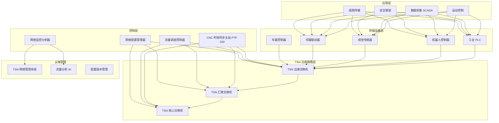
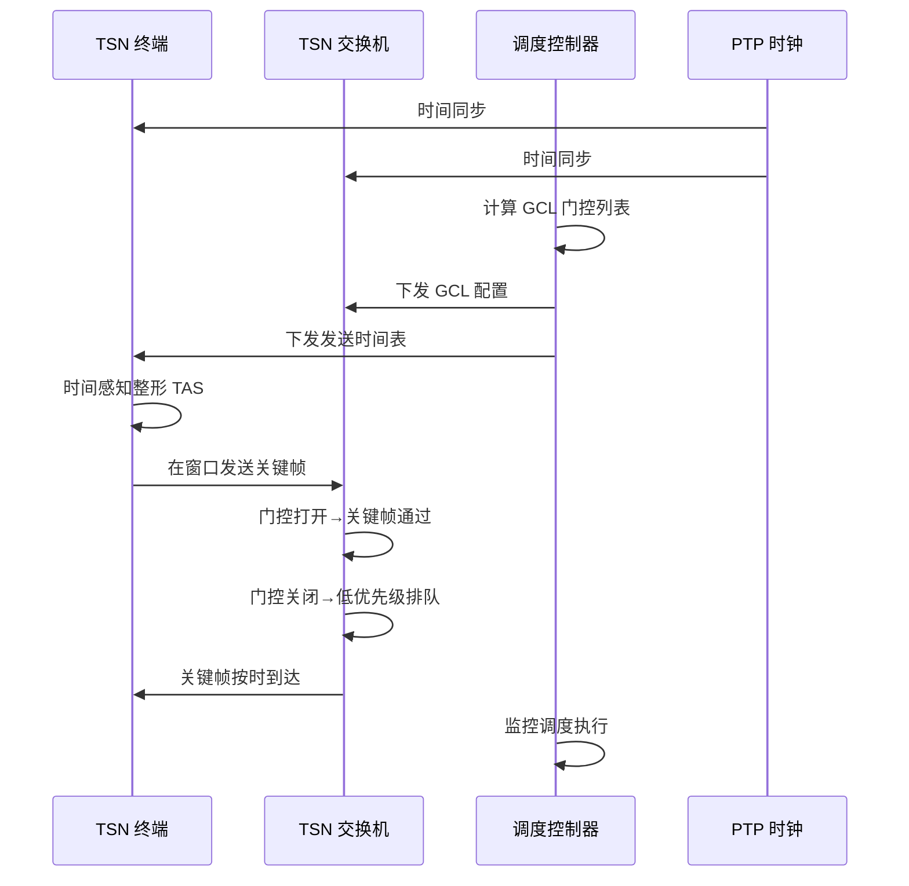
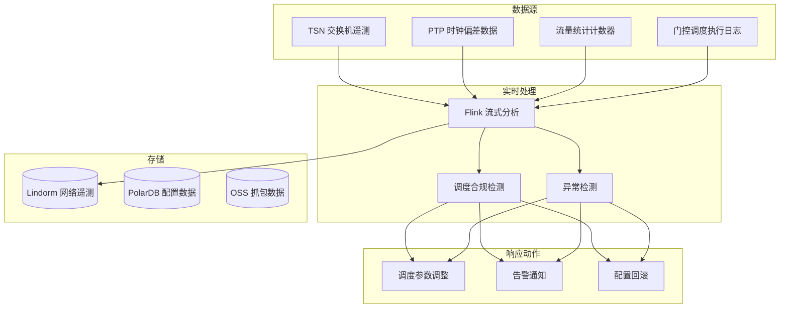

---title: 时间敏感网络 TSN 架构设计 — 阿里云视角
description: 'title: 时间敏感网络TSN架构设计'
summary: 'title: 时间敏感网络TSN架构设计'
category: general
tags:
- architecture
- best-practice
- networking
- prometheus
- grafana
- opa
- mysql
- operator
- rag
tier: supporting
created: '2026-05-23'
last_updated: 2026-05
difficulty: intermediate
reading_level: intermediate
audience:
- 所有工程师
estimated_read_time: 15min
intent_queries:
- 时间敏感网络 TSN 架构设计 — 阿里云视角 是什么
- 如何 时间敏感网络 TSN 架构设计 — 阿里云视角
- Kubernetes 20 application patterns 最佳实践
trigger_keywords:
- 时间敏感网络
- TSN
- 架构设计
- 阿里云视角
- application
- patterns
prerequisites:
- kubectl-basics
- prometheus-basics
- monitoring-basics
- mysql-basics
- policy-basics
authors:
- name: Dillan Teagle
  role: contributor

---

> **生产环境安全提示**
>
> 本文档包含可直接执行的运维命令。执行前请确认：当前目标集群与 Namespace 是否正确；是否具备足够的 RBAC 权限；是否已在非生产环境验证。命令风险等级标注：🔴 高风险（可能造成数据丢失或服务中断）、🟡 中风险（会修改集群状态，但通常可回滚）、🟢 低风险/只读（信息收集，无副作用）。


title: 时间敏感网络TSN架构设计
description: '# 时间敏感网络 TSN 架构设计 — 阿里云视角'
category: application-architecture
tags:
- k8s
- architecture
- industry
- [[Prometheus|prometheus]]
- grafana
- opa
- mysql
- operator
- rag
last_updated: '2026-05-18'
difficulty: expert
reading_level: expert
audience:
- 工业网络架构师
- OT系统工程师
- 5G专网开发者
- 阿里云解决方案架构师
estimated_read_time: 5min
intent_queries:
- 时间敏感网络TSN架构设计
- 工业4.0确定性网络K8s部署
- PTP时钟同步IEEE 1588配置
- TSN门控调度GCL配置
- 5G+TSN融合工业互联网
trigger_keywords:
- TSN
- 时间敏感网络
- 确定性网络
- IEEE 802.1
- PTP时钟同步
- GCL门控
- 工业互联网
- 5G-TSN
- IEEE 1588
- IEEE 802.1Qbv
related_domains:
- domain-01-cluster-fundamentals
- domain-12-networking
- domain-9-ai-ml
- domain-03-networking-traffic
related_topics:
- domain-20-application-patterns/topic-application-architecture/60-v2x-autonomous-driving
- domain-20-application-patterns/topic-application-architecture/51-smart-manufacturing-mes
- domain-20-application-patterns/topic-application-architecture/61-smart-grid
- domain-02-workloads-applications/topic-functions/05-iot-edge-computing
k8s_versions:
- '1.28'
- '1.29'
- '1.30'
- '1.31'
- '1.32'
---

# 时间敏感网络 TSN 架构设计 — 阿里云视角

> **适用版本**: Kubernetes v1.29 - v1.33 | **最后更新**: 2026-04-24
> **作者**: 阿里云解决方案架构师 | **标签**: `#TSN` `#时间敏感网络` `#确定性网络` `#工业互联网` `#阿里云`

---

<!-- chunk: 目录 -->## 目录

1. [行业概述](#1-行业概述)
2. [业务场景](#2-业务场景)
3. [架构设计](#3-架构设计)
4. [核心技术栈](#4-核心技术栈)
5. [Kubernetes 部署方案](#5-kubernetes-部署方案)
6. [数据架构](#6-数据架构)
7. [AI/ML 组件](#7-aiml-组件)
8. [安全与合规](#8-安全与合规)
9. [最佳实践](#9-最佳实践)
10. [反模式](#10-反模式)
11. [参考资源](#11-参考资源)

---

<!-- chunk: 1. 行业概述 -->## 1. 行业概述

## 1.1 市场规模与趋势

TSN（Time-Sensitive Networking）是在标准以太网上实现确定性传输的技术，是工业 4.0 和工业互联网的关键网络基础。全球 TSN 市场规模预计从 2024 年的 8 亿美元增长到 2030 年的 50 亿美元。主要驱动力包括工业自动化升级、车载以太网普及、5G + TSN 融合。IEEE 802.1 TSN 工作组已发布 20+ 标准，涵盖时间同步、流量调度、冗余和安全性。

| 指标 | 2024 年 | 2026 年（预测） | 2030 年（预测） |
|:---|:---|:---|:---|
| 全球 TSN 市场规模 | $0.8B | $2B | $5B |
| TSN 工业部署渗透率 | 5% | 15% | 40% |
| 时间同步精度 | < 1μs | < 100ns | < 10ns |
| 最大确定性延迟 | < 1ms | < 100μs | < 10μs |
| TSN 交换机端口数 | 8-24 口 | 24-48 口 | 48-96 口 |

## 1.2 行业痛点

| 痛点 | 说明 | 数字化转型驱动 |
|:---|:---|:---|
| 确定性延迟 | 关键控制帧需要微秒级有界延迟 | IEEE 802.1Qbv 门控调度 |
| 零丢包 | 关键控制帧不允许丢失 | IEEE 802.1CB 帧复制与消除 |
| 时间同步 | 全网纳秒级时间同步 | IEEE 1588 PTP / 802.1AS |
| 混合流量 | 实时/音视频/管理流量共存 | 流量分类 + 优先级调度 |
| 与传统兼容 | 需与现有以太网设备互通 | 桥接互通 + 渐进升级 |
| 网络配置复杂 | TSN 网络配置管理难度大 | NETCONF/YANG 自动化配置 |

## 1.3 数字化转型架构影响

TSN 架构需要覆盖终端设备层（PLC/机器人/传感器/驱动器）、TSN 交换网络层（边缘/汇聚/核心交换机）、控制层（时钟同步/流量调度/网络配置/监控分析）和应用层（运动控制/数据采集/安全联锁/视觉同步）。核心挑战是时间同步精度和流量调度的确定性保障。

---

<!-- chunk: 2. 业务场景 -->## 2. 业务场景

## 2.1 工业运动控制

TSN 网络连接 PLC、伺服驱动器和机器人控制器，实现微秒级确定性通信。多轴协调运动需要所有轴同步到微秒级，TSN 通过 IEEE 802.1Qbv 门控调度确保控制帧在确定时间窗口传输。典型场景包括 CNC 数控、机器人协同、高速包装线。

## 2.2 车载以太网

汽车电子电气架构从域控制器向中央计算演进，需要 TSN 提供确定性车载通信。ADAS 传感器数据、底盘控制指令和车载信息娱乐共享同一以太网 backbone，TSN 确保安全关键数据的确定性传输。

## 2.3 专业音视频传输

电视台、演播室和现场演出的专业音视频传输需要精确同步和有界延迟。TSN 支持 IEEE 802.1BA 音视频桥接（AVB），确保多路音视频信号精确同步到微秒级。

## 2.4 智能电网

电力保护装置通信需要在问题发生后 5ms 内完成保护和隔离。TSN 确保保护指令在确定时间内传输到位，避免大面积停电。

## 2.5 5G + TSN 融合

5G 网络通过 TSN 转换器接入工业 TSN 网络，实现无线 + 有线端到端确定性通信。3GPP Release 16+ 定义了 5G-TSN 互操作架构。

---

<!-- chunk: 3. 架构设计 -->## 3. 架构设计

## 3.1 TSN 网络全景架构



## 3.2 TSN 门控调度时序



---

<!-- chunk: 4. 核心技术栈 -->## 4. 核心技术栈

| Component | Purpose | Technology | License |
|:---|:---|:---|:---|
| Container Orchestration | TSN management platform | ACK Edge (边缘集群) | Proprietary |
| TSN Switch | Deterministic Ethernet switching | TSN-capable L2 Switch | Proprietary |
| PTP Protocol | Time synchronization | IEEE 1588-2019 / 802.1AS | Standard |
| Gate Control | Scheduled traffic | IEEE 802.1Qbv | Standard |
| Frame Replication | Redundancy | IEEE 802.1CB | Standard |
| Stream Reservation | Bandwidth reservation | IEEE 802.1Qat/MSRP | Standard |
| Network Config | TSN configuration | NETCONF/YANG + IEEE 802.1Qcc | Standard |
| Time-Series DB | Network telemetry storage | Lindorm TSDB | Proprietary |
| Relational DB | Configuration management | PolarDB MySQL | Proprietary |
| AI Platform | Traffic analysis & optimization | PAI | Proprietary |
| Message Queue | Event notification | RocketMQ | Apache 2.0 |
| Monitoring | Network observability | ARMS + SLS + Grafana | Proprietary / Apache 2.0 |
| Protocol Analyzer | TSN frame analysis | Wireshark (TSN plugins) | GPL |

---

<!-- chunk: 5. Kubernetes 部署方案 -->## 5. Kubernetes 部署方案

## 5.1 TSN 网络管理 Deployment

```yaml
apiVersion: apps/v1
kind: Deployment
metadata:
  name: tsn-network-manager
  namespace: tsn-network
  labels:
    app: tsn-network-manager
    tier: control-plane
spec:
  replicas: 3
  selector:
    matchLabels:
      app: tsn-network-manager
  strategy:
    rollingUpdate:
      maxSurge: 1
      maxUnavailable: 0
  template:
    metadata:
      labels:
        app: tsn-network-manager
        tier: control-plane
      annotations:
        prometheus.io/scrape: "true"
        prometheus.io/port: "9090"
    spec:
      hostNetwork: true
      affinity:
        podAntiAffinity:
          requiredDuringSchedulingIgnoredDuringExecution:
            - labelSelector:
                matchLabels:
                  app: tsn-network-manager
              topologyKey: kubernetes.io/hostname
      nodeSelector:
        node-type: tsn-controller
      tolerations:
        - key: "dedicated"
          operator: "Equal"
          value: "tsn"
          effect: "NoSchedule"
      containers:
        - name: manager
          image: registry.cn-hangzhou.aliyuncs.com/tsn/network-manager:v2.0.0
          ports:
            - containerPort: 8080
              name: http
            - containerPort: 9090
              name: metrics
          env:
            - name: PTP_DOMAIN
              value: "0"
            - name: GATE_CONTROL_ENABLED
              value: "true"
            - name: SCHEDULE_COMPUTE_INTERVAL
              value: "60s"
            - name: MAX_JITTER_NS
              value: "500"
            - name: NETCONF_SSH_KEY
              valueFrom:
                secretKeyRef:
                  name: tsn-secrets
                  key: netconf-ssh-key
            - name: DB_CONNECTION
              valueFrom:
                secretKeyRef:
                  name: tsn-secrets
                  key: db-connection
          resources:
            requests:
              memory: "2Gi"
              cpu: "1000m"
            limits:
              memory: "4Gi"
              cpu: "2000m"
          readinessProbe:
            httpGet:
              path: /health/ready
              port: 8080
            initialDelaySeconds: 10
            periodSeconds: 5
          livenessProbe:
            httpGet:
              path: /health/live
              port: 8080
            initialDelaySeconds: 20
            periodSeconds: 10
          securityContext:
            capabilities:
              add: ["NET_ADMIN", "NET_RAW", "SYS_TIME"]
```

## 5.2 流量分析 AI Deployment

```yaml
apiVersion: apps/v1
kind: Deployment
metadata:
  name: tsn-traffic-analyzer
  namespace: tsn-network
spec:
  replicas: 2
  selector:
    matchLabels:
      app: tsn-traffic-analyzer
  template:
    metadata:
      labels:
        app: tsn-traffic-analyzer
    spec:
      containers:
        - name: analyzer
          image: registry.cn-hangzhou.aliyuncs.com/tsn/traffic-analyzer:v1.5.0
          ports:
            - containerPort: 8080
          env:
            - name: ANALYSIS_WINDOW_S
              value: "60"
            - name: ANOMALY_THRESHOLD
              value: "0.95"
            - name: MODEL_PATH
              value: "/models/tsn-anomaly-v2"
          resources:
            requests:
              memory: "2Gi"
              cpu: "1000m"
            limits:
              memory: "4Gi"
              cpu: "2000m"
```

## 5.3 ConfigMap, Service 与 Secret

```yaml
apiVersion: v1
kind: ConfigMap
metadata:
  name: tsn-config
  namespace: tsn-network
data:
  ptp-config: |
    {
      "domain": 0,
      "priority1": 128,
      "priority2": 128,
      "clock_class": 248,
      "sync_interval_log": -3,
      "announce_interval_log": 1,
      "delay_req_interval_log": -3
    }
  gcl-template: |
    {
      "cycle_time_ns": 1000000,
      "gate_states": ["open_critical", "open_avb", "open_best_effort"],
      "durations_ns": [100000, 300000, 600000]
    }
  switch-inventory: |
    [
      {"id": "sw-edge-01", "ip": "192.168.1.10", "ports": 24, "model": "TSN-2400"},
      {"id": "sw-agg-01", "ip": "192.168.1.1", "ports": 48, "model": "TSN-4800"}
    ]
---
apiVersion: v1
kind: Service
metadata:
  name: tsn-network-manager
  namespace: tsn-network
spec:
  selector:
    app: tsn-network-manager
  ports:
    - name: http
      port: 8080
      targetPort: 8080
    - name: metrics
      port: 9090
      targetPort: 9090
  type: ClusterIP
---
apiVersion: v1
kind: Secret
metadata:
  name: tsn-secrets
  namespace: tsn-network
type: Opaque
stringData:
  netconf-ssh-key: "ssh-private-key-placeholder"
  db-connection: "mysql://tsn_app@polardb.tsn.rds.aliyuncs.com:3306/tsn_db"
  snmp-community: "encrypted-community-string"
```

---

<!-- chunk: 6. 数据架构 -->## 6. 数据架构

## 6.1 TSN 流量调度数据流



## 6.2 数据流说明

- **遥测数据流**: TSN 交换机以 10Hz 上报端口统计、队列深度、时延测量数据，经 Flink 实时分析
- **时钟数据流**: PTP 时钟偏差数据持续监控，偏差超过阈值自动告警
- **调度数据流**: 门控列表（GCL）执行情况实时监控，确保调度与计划一致
- **配置数据流**: 网络配置变更通过 NETCONF 下发，版本化管理和审计追踪

---

<!-- chunk: 7. AI/ML 组件 -->## 7. AI/ML 组件

## 7.1 核心模型

| 模型 | 用途 | 输入 | 输出 | 框架 |
|:---|:---|:---|:---|:---|
| 调度优化 | GCL 门控列表优化 | 流量需求/拓扑/约束 | 最优 GCL | OR-Tools + RL |
| 异常检测 | 网络异常行为检测 | 遥测时序数据 | 异常类型 + 置信度 | LSTM-AE |
| 流量预测 | 未来流量需求预测 | 历史流量模式 | 预测流量矩阵 | STGCN |
| 延迟分析 | 端到端延迟最坏情况分析 | 网络拓扑/调度配置 | 最坏延迟上界 | Network Calculus |
| 拓扑发现 | 网络拓扑自动发现 | LLDP/PTP 数据 | 网络拓扑图 | Graph Algorithm |

---

<!-- chunk: 8. 安全与合规 -->## 8. 安全与合规

## 8.1 行业法规与标准

| 法规/标准 | 适用范围 | 架构要求 |
|:---|:---|:---|
| IEEE 802.1AS | 时间同步标准 | PTP GM 冗余配置 |
| IEEE 802.1Qbv | 门控调度标准 | GCL 确定性调度 |
| IEEE 802.1CB | 帧复制与消除 | 关键流量冗余传输 |
| IEEE 802.1Qcc | 网络配置标准 | 集中式网络配置 |
| IEC 62443 | 工控系统信息安全 | 纵深防御架构 |
| 功能安全 SIL | 安全完整性等级 | 网络冗余 + 故障检测 |

## 8.2 安全架构要点

- **工控网络隔离**: TSN 控制网络与办公网络物理隔离
- **帧完整性**: IEEE 802.1CB 帧复制消除，关键帧不丢失
- **时间安全**: PTP 时钟防攻击（IEEE 802.1AS-Rev），防止时间欺骗
- **访问控制**: TSN 交换机配置需双重认证
- **审计追踪**: 所有网络配置变更完整记录

---

<!-- chunk: 9. 最佳实践 -->## 9. 最佳实践

1. **PTP GM 冠军主时钟冗余**: 部署至少 2 台 PTP Grand Master，实现时钟源冗余
2. **GCL 离线计算 + 在线微调**: 先离线计算门控列表，运行中根据实际流量微调
3. **流量分类优先**: 将网络流量按 TSN 标准（Critical/AVB/Best-Effort）严格分类
4. **渐进式 TSN 部署**: 先在非关键产线试点，验证后逐步推广到全产线
5. **网络仿真先行**: 每次配置变更前先在网络仿真器中验证
6. **延迟预算分配**: 从端到端延迟预算逐级分配到各网段和交换机
7. **监控时钟偏差**: 持续监控全网 PTP 时钟偏差，偏差 > 100ns 自动告警
8. **配置版本管理**: 所有 TSN 配置版本化管理，支持快速回滚
9. **混合流量隔离**: 关键控制流量与视频/管理流量通过 VLAN + 优先级严格隔离
10. **定期延迟测试**: 使用专用测试仪定期测量端到端延迟，验证确定性

---

<!-- chunk: 10. 反模式 -->## 10. 反模式

1. **忽视时钟同步精度**: 不持续监控 PTP 时钟偏差，偏差累积导致调度失效。应持续监控并自动告警
2. **手工配置门控列表**: 依赖网络工程师手工编写 GCL，配置复杂且易错。应使用自动化调度工具
3. **单一时钟源**: 只部署一台 PTP Grand Master，时钟源问题全网失步。应冗余部署
4. **混合流量不分类**: 所有流量共享同一队列，关键控制帧被视频帧阻塞。应严格分类和隔离
5. **忽视与传统网络互通**: TSN 网络与现有以太网不兼容，导致渐进升级困难。应使用 TSN 桥接方案

---

<!-- chunk: 11. 参考资源 -->## 11. 参考资源

- [IEEE 802.1 TSN Task Group](https://1.ieee802.org/tsn/)
- [IEEE 1588-2019 PTP Standard](https://standards.ieee.org/ieee/1588/6825/)
- [IEC 62443 Industrial Security](https://www.isa.org/standards-and-publications/isa-standards/isa-iec-62443-series-of-standards)
- [5G-ACIA TSN Integration](https://www.5g-acia.org/)
- [Linux TSN Tools](https://github.com/tsn-for-linux)
- [OpenAvnu TSN Stack](https://github.com/Avnu/OpenAvnu)
- [阿里云 ACK Edge 文档](https://help.aliyun.com/product/146232.html)

---

**维护者**: 阿里云解决方案架构师团队 | **许可证**: MIT

---

<!-- chunk: Obsidian 相关文档 -->## Obsidian 相关文档

- topic-application-architecture MOC
- [[domain-20-application-patterns/topic-application-architecture/README.md|Topic 应用层架构设计最佳实践]]
- [[domain-20-application-patterns/topic-application-architecture/01-ecommerce-architecture.md|电商系统 Kubernetes 生产架构设计]]
- [[domain-20-application-patterns/topic-application-architecture/02-mini-program-architecture.md|小程序平台架构设计]]
- [[domain-20-application-patterns/topic-application-architecture/03-cms-architecture.md|内容管理系统 CMS 架构设计]]
- [[domain-20-application-patterns/topic-application-architecture/04-im-rtc-architecture.md|实时通信 IM/RTC 架构设计]]
- [[domain-20-application-patterns/topic-application-architecture/05-online-education-architecture.md|在线教育平台 Kubernetes 生产架构设计]]
- [[domain-20-application-patterns/topic-application-architecture/06-fintech-architecture.md|金融科技FinTech Kubernetes生产架构设计]]
- [[domain-20-application-patterns/topic-application-architecture/07-iot-platform-architecture.md|物联网 IoT 平台架构设计]]
- [[domain-20-application-patterns/topic-application-architecture/08-ai-ml-inference-architecture.md|AI/ML 推理服务 Kubernetes 生产架构设计]]
- [[domain-20-application-patterns/topic-application-architecture/09-gaming-backend-architecture.md|游戏后端 Kubernetes 生产架构设计]]
- [[domain-20-application-patterns/topic-application-architecture/10-social-media-architecture.md|社交媒体平台Kubernetes生产架构设计]]

## Related

- 69-6g-core-network
- topic-application-architecture MOC — Cross-reference

## See Also

- 78-deep-sea-exploration
- 79-polar-research
- 81-smart-customs
- 82-legaltech


<!-- risk-assessed -->
