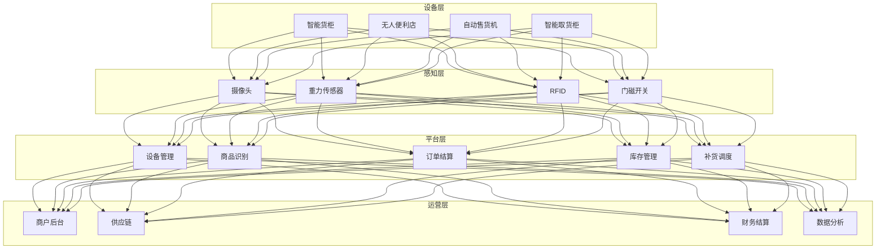
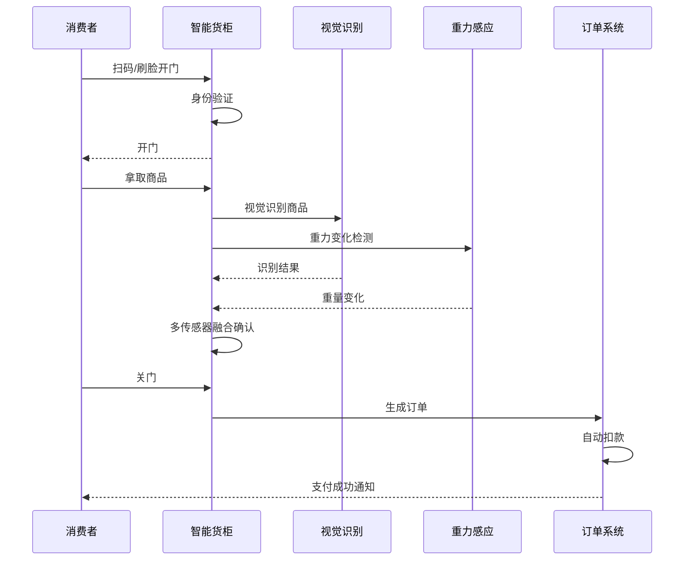
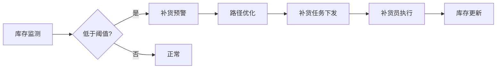

---title: 无人零售与智能货柜架构设计 — 阿里云视角
description: 'title: 无人零售与智能货柜架构设计'
summary: 'title: 无人零售与智能货柜架构设计'
category: general
tags:
- architecture
- best-practice
- daemonset
- gpu
- nvidia
tier: supporting
created: '2026-05-23'
last_updated: 2026-05
difficulty: intermediate
reading_level: intermediate
audience:
- 所有工程师
estimated_read_time: 5min
intent_queries:
- 无人零售与智能货柜架构设计 — 阿里云视角 是什么
- 如何 无人零售与智能货柜架构设计 — 阿里云视角
- Kubernetes 20 application patterns 最佳实践
trigger_keywords:
- 无人零售与智能货柜架构设计
- 阿里云视角
- application
- patterns
prerequisites:
- kubectl-basics
- prometheus-basics
- gpu-scheduling-basics
authors:
- name: Dillan Teagle
  role: contributor

---

> **生产环境安全提示**
>
> 本文档包含可直接执行的运维命令。执行前请确认：当前目标集群与 Namespace 是否正确；是否具备足够的 RBAC 权限；是否已在非生产环境验证。命令风险等级标注：🔴 高风险（可能造成数据丢失或服务中断）、🟡 中风险（会修改集群状态，但通常可回滚）、🟢 低风险/只读（信息收集，无副作用）。


title: 无人零售与智能货柜架构设计
description: '# 无人零售与智能货柜架构设计 — 阿里云视角'
category: application-architecture
tags:
- k8s
- architecture
- industry
- [[DaemonSet|daemonset]]
- gpu
- nvidia
last_updated: 2026-05-18
difficulty: intermediate
reading_level: intermediate
audience:
- 新零售架构师
- IoT工程师
- 边缘计算专家
estimated_read_time: 5min
intent_queries:
- 无人零售 [[Kubernetes|Kubernetes]] 边缘计算
- 智能货柜 AI视觉 Kubernetes
- IoT零售 阿里云 Kubernetes
- 商品识别 GPU Kubernetes
- 无人零售 离线自治 K8s
trigger_keywords:
- 无人零售
- 智能货柜
- 自动售货
- AI视觉
- IoT
- 边缘计算
- 商品识别
- 阿里云
related_domains:
- domain-01-cluster-fundamentals
- domain-11-production-operations
- domain-11-ai-infra
related_topics:
- 31-instant-retail
- 11-smart-retail-architecture
- 32-smart-restaurant
k8s_versions:
- '1.28'
- '1.29'
- '1.30'
- '1.31'
- '1.32'
---

# 无人零售与智能货柜架构设计 — 阿里云视角

> **适用版本**: Kubernetes v1.29 - v1.33 | **最后更新**: 2026-04-24
> **作者**: 阿里云解决方案架构师 | **标签**: `#无人零售` `#智能货柜` `#自动售货` `#阿里云`

---

## 目录

1. [行业背景](#1-行业背景)
2. [业务架构](#2-业务架构)
3. [技术架构](#3-技术架构)
4. [核心数据流](#4-核心数据流)
5. [安全与合规](#5-安全与合规)
6. [可观测性](#6-可观测性)
7. [阿里云组件映射](#7-阿里云组件映射)
8. [生产检查清单](#8-生产检查清单)

---

## 1. 行业背景

### 1.1 业务特点

无人零售通过 IoT + AI 实现 24h 自助购物：

| 挑战 | 说明 | 架构影响 |
|:---|:---|:---|
| 设备分散 | 成百上千台设备分布 | 边缘计算 + 统一管理 |
| 网络不稳定 | 部分点位 4G 弱信号 | 离线自治能力 |
| 货损防盗 | 商品被盗/损坏 | AI 视觉监控 |
| 库存精准 | 自动识别商品拿取 | 传感器融合 |
| 支付多样 | 刷脸/扫码/免密支付 | 聚合支付 |

### 1.2 核心场景

- **视觉识别**: 消费者拿取商品自动识别
- **重力感应**: 货道重量变化检测
- **动态定价**: 基于库存/时段的自动调价
- **智能补货**: 缺货预警 + 最优补货路径
- **远程运维**: 设备状态监控 + 问题预警

---

## 2. 业务架构

### 2.1 无人零售全景架构



### 2.2 购物流程时序



---

## 3. 技术架构

### 3.1 K8s 部署

```yaml
# 边缘设备管理 DaemonSet
apiVersion: apps/v1
kind: DaemonSet
metadata:
  name: device-edge-manager
  namespace: unmanned-retail
spec:
  selector:
    matchLabels:
      app: device-edge-manager
  template:
    metadata:
      labels:
        app: device-edge-manager
    spec:
      nodeSelector:
        node-type: retail-edge
      containers:
        - name: manager
          image: registry.cn-hangzhou.aliyuncs.com/retail/edge-manager:v2.0.0
          env:
            - name: OFFLINE_MODE
              value: "enabled"
            - name: SYNC_INTERVAL_SECONDS
              value: "60"
          resources:
            requests:
              memory: "512Mi"
              cpu: "500m"
```

```yaml
# 商品识别 AI 服务 GPU Deployment
apiVersion: apps/v1
kind: Deployment
metadata:
  name: product-recognition
  namespace: unmanned-retail
spec:
  replicas: 3
  selector:
    matchLabels:
      app: product-recognition
  template:
    metadata:
      labels:
        app: product-recognition
    spec:
      nodeSelector:
        accelerator: nvidia-t4
      runtimeClassName: nvidia
      containers:
        - name: recognizer
          image: registry.cn-hangzhou.aliyuncs.com/retail/product-recognition:v1.5.0-gpu
          ports:
            - containerPort: 8080
          env:
            - name: MODEL_VERSION
              value: "v3.2"
            - name: CONFIDENCE_THRESHOLD
              value: "0.95"
          resources:
            requests:
              nvidia.com/gpu: 1
              memory: "4Gi"
              cpu: "2000m"
            limits:
              nvidia.com/gpu: 1
              memory: "8Gi"
              cpu: "4000m"
```

---

## 4. 核心数据流

### 4.1 智能补货调度



---

## 5. 安全与合规

- **食品安全**: 冷链商品温控监控
- **支付安全**: 免密支付限额保护
- **隐私保护**: 人脸数据加密存储

---

## 6. 可观测性

- **识别准确率**: > 99%
- **交易成功率**: > 99.5%
- **设备在线率**: > 98%

---

## 7. 阿里云组件映射

| 功能域 | **阿里云云原生方案** |
|:---|:---|
| 容器平台 | **ACK Edge** |
| IoT | **阿里云 IoT 平台** |
| AI | **PAI / 视觉智能** |
| 数据库 | **PolarDB + Lindorm** |
| 对象存储 | **OSS** |
| 支付 | **支付宝** |
| 可观测性 | **ARMS + SLS** |

---

## 8. 生产检查清单

- [ ] 商品识别准确率验证
- [ ] 离线模式自治测试
- [ ] 冷链温控数据完整性
- [ ] 支付安全限额配置
- [ ] 人脸隐私数据加密

---

**维护者**: 阿里云解决方案架构师团队 | **许可证**: MIT

---

## Obsidian 相关文档

- topic-application-architecture KUDIG Database — Global MOC
- [[domain-20-application-patterns/topic-application-architecture/README.md|Topic 应用层架构设计最佳实践]]
- [[domain-20-application-patterns/topic-application-architecture/01-ecommerce-architecture.md|电商系统 Kubernetes 生产架构设计]]
- [[domain-20-application-patterns/topic-application-architecture/02-mini-program-architecture.md|小程序平台架构设计]]
- [[domain-20-application-patterns/topic-application-architecture/03-cms-architecture.md|内容管理系统 CMS 架构设计]]
- [[domain-20-application-patterns/topic-application-architecture/04-im-rtc-architecture.md|实时通信 IM/RTC 架构设计]]
- [[domain-20-application-patterns/topic-application-architecture/05-online-education-architecture.md|在线教育平台 Kubernetes 生产架构设计]]
- [[domain-20-application-patterns/topic-application-architecture/06-fintech-architecture.md|金融科技FinTech Kubernetes生产架构设计]]
- [[domain-20-application-patterns/topic-application-architecture/07-iot-platform-architecture.md|物联网 IoT 平台架构设计]]
- [[domain-20-application-patterns/topic-application-architecture/08-ai-ml-inference-architecture.md|AI/ML 推理服务 Kubernetes 生产架构设计]]
- [[domain-20-application-patterns/topic-application-architecture/09-gaming-backend-architecture.md|游戏后端 Kubernetes 生产架构设计]]
- [[domain-20-application-patterns/topic-application-architecture/10-social-media-architecture.md|社交媒体平台Kubernetes生产架构设计]]

## See Also

- 48-vocational-edtech
- 49-livestream-ecommerce
- 51-smart-manufacturing-mes
- 52-smart-water


<!-- risk-assessed -->
