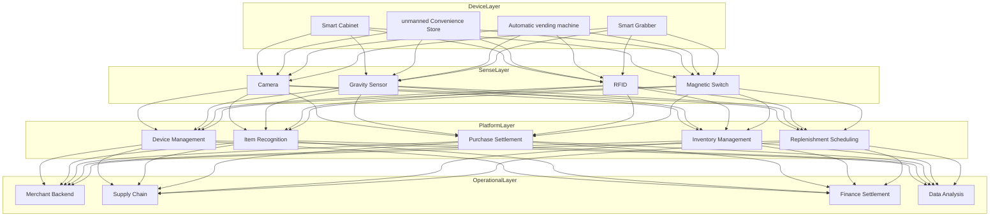
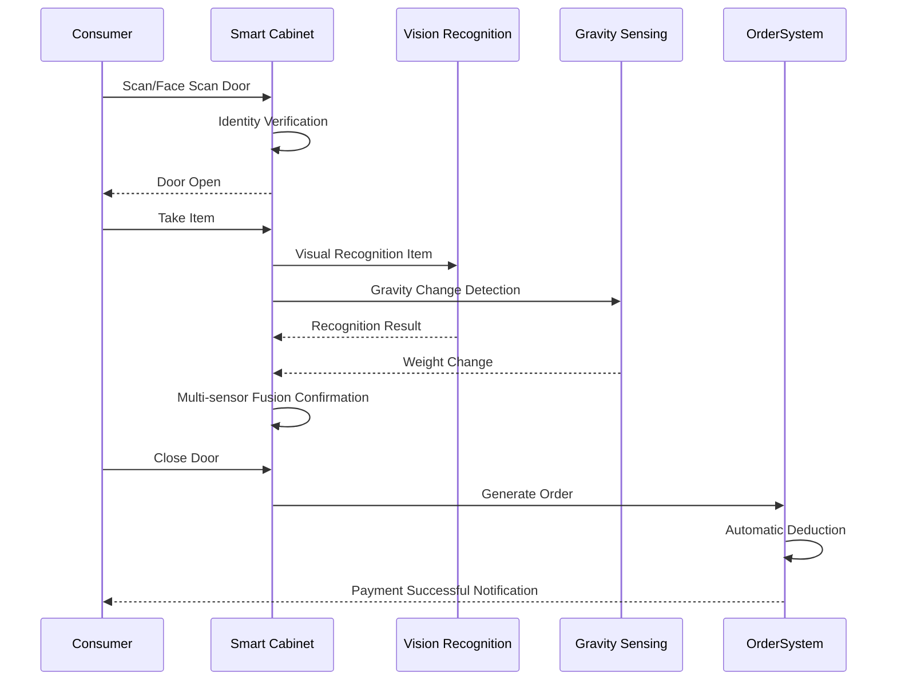

# Unmanned Retail and Smart Dispenser Architecture Design — From Alibaba Cloud Perspective

## Table of Contents

1. [Industry Background](#1-industry-background)
2. [Business Architecture](#2-business-architecture)
3. [Technical Architecture](#3-technical-architecture)
4. [Core Data Flow](#4-core-data-flow)
5. [Security and Compliance](#5-security-and-compliance)
6. [Observability](#6-observability)
7. [Alibaba Cloud Component Mapping](#7-alibaba-cloud-component-mapping)
8. [Production Checklist](#8-production-checklist)

---

## 1. Industry Background

### 1.1 Business Characteristics

Unmanned retail achieves 24-hour self-service shopping through IoT + AI:

| Challenge | Explanation | Impact on Architecture |
|:---|:---|:---|
| Device Dispersion | Hundreds or Thousands of Devices Distributed | Edge Computing + Unified Management |
| Device dispersion | Hundreds or thousands of distributed devices | Edge computing + Unified Management |
| Network instability | Weak 4G signal at some points | Offline autonomous capability |
| Loss and theft prevention | Theft/damage of goods | AI visual monitoring |
| Precise inventory | Automatic recognition of goods picked up | Sensor fusion |

### 1.2 Core Scenarios

- **Visual Recognition**: Automatic identification of goods when consumers take them
- **Gravity Sensing**: Detection of changes in cargo weight in aisles
- **Dynamic Pricing**: Automatic price adjustment based on inventory/periods
- **Smart Replenishment**: Stock shortage warning + optimal replenishment path
- **Remote Maintenance**: Monitoring of device status + problem warnings

---

## 2. Business Architecture

### 2.1 Omnichannel Architecture of Unmanned Retail


```mermaid
graph TB
    subgraph DeviceLayer
        D1[Smart Cabinet]
        D2[unmanned Convenience Store]
        D3[Automatic vending machine]
        D4[Smart Grabber]
    end

    subgraph SenseLayer
        S1[Camera]
        S2[Gravity Sensor]
        S3[RFID]
        S4[Magnetic Switch]
    end

    subgraph PlatformLayer
        P1[Device Management]
        P2[Item Recognition]
        P3[Purchase Settlement]
        P4[Inventory Management]
        P5[Replenishment Scheduling]
    end

    subgraph OperationalLayer
        O1[Merchant Backend]
        O2[Supply Chain]
        O3[Finance Settlement]
        O4[Data Analysis]
    end

    D1 & D2 & D3 & D4 --> S1 & S2 & S3 & S4
    S1 & S2 & S3 & S4 --> P1 & P2 & P3 & P4 & P5
    P1 & P2 & P3 & P4 & P5 --> O1 & O2 & O3 & O4
```

### 2.2 Purchase Flow Sequence


```mermaid
sequenceDiagram
    participant USER as Consumer
    participant DEVICE as Smart Cabinet
    participant VISION as Vision Recognition
    participant WEIGHT as Gravity Sensing
    participant ORDER as OrderSystem

    USER->>DEVICE: Scan/Face Scan Door
    DEVICE->>DEVICE: Identity Verification
    DEVICE-->>USER: Door Open
    USER->>DEVICE: Take Item
    DEVICE->>VISION: Visual Recognition Item
    DEVICE->>WEIGHT: Gravity Change Detection
    VISION-->>DEVICE: Recognition Result
    WEIGHT-->>DEVICE: Weight Change
    DEVICE->>DEVICE: Multi-sensor Fusion Confirmation
    USER->>DEVICE: Close Door
    DEVICE->>ORDER: Generate Order
    ORDER->>ORDER: Automatic Deduction
    ORDER-->>USER: Payment Successful Notification
```

---

## 3. Technical Architecture

### 3.1 Kubernetes Deployment

```yaml
# Edge Device Management DaemonSet
apiVersion: apps/v1
kind: DaemonSet
metadata:
  name: device-edge-manager
  namespace: unmanned-retail
spec:
  selector:
    matchLabels:
      app: device-edge-manager
  template:
    metadata:
      labels:
        app: device-edge-manager
    spec:
      nodeSelector:
        node-type: retail-edge
      containers:
        - name: manager
          image: registry.cn-hangzhou.aliyuncs.com/retail/edge-manager:v2.0.0
          env:
            - name: OFFLINE_MODE
              value: "enabled"
            - name: SYNC_INTERVAL_SECONDS
              value: "60"
          resources:
            requests:
              memory: "512Mi"
              cpu: "500m"
```

```yaml
# Product Recognition AI Service GPU Deployment
apiVersion: apps/v1
kind: Deployment
metadata:
  name: product-recognition
  namespace: unmanned-retail
spec:
  replicas: 3
  selector:
    matchLabels:
      app: product-recognition
  template:
    metadata:
      labels:
        app: product-recognition
    spec:
      nodeSelector:
        accelerator: nvidia-t4
      runtimeClassName: nvidia
      containers:
        - name: recognizer
          image: registry.cn-hangzhou.aliyuncs.com/retail/product-recognition:v1.5.0-gpu
          ports:
            - containerPort: 8080
          env:
            - name: MODEL_VERSION
              value: "v3.2"
            - name: CONFIDENCE_THRESHOLD
              value: "0.95"
          resources:
            requests:
              nvidia.com/gpu: 1
              memory: "4Gi"
              cpu: "2000m"
            limits:
              nvidia.com/gpu: 1
              memory: "8Gi"
              cpu: "4000m"
```

---

## 4. Core Data Flow

### 4.1 Intelligent Replenishment Scheduling

```mermaid
flowchart LR
    InventoryMonitoring --> BelowThreshold
    B -->Yes C[Replenishment Warning]
    C --> PathOptimization
    D --> ReplenishmentTaskDispatching
    E --> ReplenishmentExecutionByStaff
    F --> UpdateInventory
    B -->No H[Normal]
```

---

## 5. Security and Compliance

- **Food Safety**: Cold-chain Product Temperature Control Monitoring
- **Payment Safety**: Limit Protection for Contactless Payments
- **Privacy Protection**: Face Data Encryption Storage

---

## 6. Observability

- **Recognition Accuracy**: > 99%
- **Transaction Success Rate**: > 99.5%
- **Device Online Rate**: > 98%

---

## 7. Alibaba Cloud Component Mapping

| Function Domain | **Alibaba Cloud Native Solution** |
|:---|:---|
| Container Platform | **ACK Edge** |
| IoT | **Alibaba Cloud IoT Platform** |
| AI | **PAI / Visual Intelligence** |
| Database | **PolarDB + Lindorm** |
| Object Storage | **OSS** |
| Payment | **Alipay** |
| Observability | **ARMS + SLS** |

---

## 8. Production Checklist

- [ ] Product recognition accuracy verification
- [ ] Offline autonomous testing
- [ ] Integrity of cold chain temperature control data
- [ ] Payment security limit configuration
- [ ] Privacy encryption of facial data

---

**Maintainer**: Alibaba Cloud Solution Architects Team | **License**: MIT

---

## Obsidian Related Documentation

- topic-application-architecture KUDIG Database — Global MOC
- [[domain-20-application-patterns/topic-application-architecture/README.md|Topic Application Architecture Best Practices]]
- [[domain-20-application-patterns/topic-application-architecture/01-ecommerce-architecture.md|E-commerce System Kubernetes Production Architecture Design]]
- [[domain-20-application-patterns/topic-application-architecture/02-mini-program-architecture.md|Mini Program Platform Architecture Design]]
- [[domain-20-application-patterns/topic-application-architecture/03-cms-architecture.md|Content Management System CMS Architecture Design]]
- [[domain-20-application-patterns/topic-application-architecture/04-im-rtc-architecture.md|Real-time Communication IM/RTC Architecture Design]]
- [[domain-20-application-patterns/topic-application-architecture/05-online-education-architecture.md|Online Education Platform Kubernetes Production Architecture Design]]
- [[domain-20-application-patterns/topic-application-architecture/06-fintech-architecture.md|Financial Technology FinTech Kubernetes Production Architecture Design]]
- [[domain-20-application-patterns/topic-application-architecture/07-iot-platform-architecture.md|IoT Platform Architecture Design]]
- [[domain-20-application-patterns/topic-application-architecture/08-ai-ml-inference-architecture.md|AI/ML Inference Service Kubernetes Production Architecture Design]]
- [[domain-20-application-patterns/topic-application-architecture/09-gaming-backend-architecture.md|Game Backend Kubernetes Production Architecture Design]]
- [[domain-20-application-patterns/topic-application-architecture/10-social-media-architecture.md|Social Media Platform Kubernetes Production Architecture Design]]

## See Also

- 48-vocational-edtech
- 49-livestream-ecommerce
- 51-smart-manufacturing-mes
- 52-smart-water


<!-- risk-assessed -->
