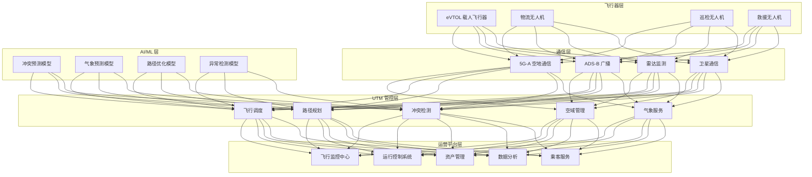
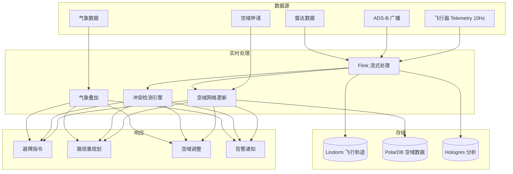

---title: 低空经济（eVTOL/UAM）架构设计 — 阿里云视角
description: 'title: 低空经济 UAM 架构设计'
summary: 'title: 低空经济 UAM 架构设计'
category: general
tags:
- architecture
- best-practice
- prometheus
- grafana
- opa
- redis
- postgresql
- job
- rag
tier: supporting
created: '2026-05-23'
last_updated: 2026-05
difficulty: intermediate
reading_level: intermediate
audience:
- 所有工程师
estimated_read_time: 15min
intent_queries:
- 低空经济（eVTOL/UAM）架构设计 — 阿里云视角 是什么
- 如何 低空经济（eVTOL/UAM）架构设计 — 阿里云视角
- Kubernetes 20 application patterns 最佳实践
trigger_keywords:
- 低空经济
- eVTOL
- UAM
- 架构设计
- 阿里云视角
- application
- patterns
prerequisites:
- kubectl-basics
- prometheus-basics
- monitoring-basics
- redis-basics
- policy-basics
authors:
- name: Dillan Teagle
  role: contributor

---

> **生产环境安全提示**
>
> 本文档包含可直接执行的运维命令。执行前请确认：当前目标集群与 Namespace 是否正确；是否具备足够的 RBAC 权限；是否已在非生产环境验证。命令风险等级标注：🔴 高风险（可能造成数据丢失或服务中断）、🟡 中风险（会修改集群状态，但通常可回滚）、🟢 低风险/只读（信息收集，无副作用）。


title: 低空经济 UAM 架构设计
description: '# 低空经济（eVTOL/UAM）架构设计 — 阿里云视角'
category: application-architecture
tags:
- k8s
- architecture
- industry
- [[Prometheus|prometheus]]
- grafana
- opa
- redis
- postgresql
- job
- rag
last_updated: 2026-05-18
difficulty: expert
reading_level: expert
audience:
- 低空经济架构师
- 无人机系统工程师
- 航空管制专家
estimated_read_time: 5min
intent_queries:
- eVTOL 城市空中交通 UTM 系统
- 无人机物流配送调度平台
- 5G 空天地一体化通信
- 实时冲突检测低空管理
- 阿里云 Flink 实时计算
trigger_keywords:
- 低空经济
- eVTOL
- UAM城市空中交通
- 无人机
- UTM空管系统
- 5G通信
- 卫星通信
- 冲突检测
- 无人机配送
- 空域管理
related_domains:
- domain-03-networking-traffic
- domain-10-troubleshooting-diagnostics
related_topics:
- topic-iot-platform-architecture
- topic-telecom-architecture
k8s_versions:
- '1.28'
- '1.29'
- '1.30'
- '1.31'
- '1.32'
---

# 低空经济（eVTOL/UAM）架构设计 — 阿里云视角

> **适用版本**: [[Kubernetes|Kubernetes]] v1.29 - v1.33 | **最后更新**: 2026-04-24
> **作者**: 阿里云解决方案架构师 | **标签**: `#低空经济` `#eVTOL` `#UAM` `#空域管理` `#阿里云`

---

<!-- chunk: 目录 -->## 目录

1. [行业概述](#1-行业概述)
2. [业务场景](#2-业务场景)
3. [架构设计](#3-架构设计)
4. [核心技术栈](#4-核心技术栈)
5. [Kubernetes 部署方案](#5-kubernetes-部署方案)
6. [数据架构](#6-数据架构)
7. [AI/ML 组件](#7-aiml-组件)
8. [安全与合规](#8-安全与合规)
9. [最佳实践](#9-最佳实践)
10. [反模式](#10-反模式)
11. [参考资源](#11-参考资源)

---

<!-- chunk: 1. 行业概述 -->## 1. 行业概述

## 1.1 市场规模与趋势

低空经济以 eVTOL（电动垂直起降飞行器）和无人机为核心，涵盖城市空中交通（UAM）、物流配送、应急救援等场景。全球低空经济市场规模预计从 2024 年的 500 亿美元增长到 2030 年的 5000 亿美元。Joby、Lilium、亿航、峰飞等 eVTOL 企业加速适航认证，中国已有 20+ 个城市启动低空经济试点。

| 指标 | 2024 年 | 2026 年（预测） | 2030 年（预测） |
|:---|:---|:---|:---|
| 全球低空经济规模 | $50B | $150B | $500B |
| eVTOL 适航认证 | 3 款 | 10+ 款 | 30+ 款 |
| 城市空中交通航线 | 10 条 | 50 条 | 500 条 |
| 无人机配送日单量 | 10 万 | 100 万 | 1000 万 |
| UTM 管理系统覆盖 | 5 城市 | 20 城市 | 100+ 城市 |

## 1.2 行业痛点

| 痛点 | 说明 | 数字化转型驱动 |
|:---|:---|:---|
| 空域管理 | 低空空域动态分配复杂 | 实时空域网格化 + UTM |
| 飞行安全 | eVTOL 载人安全要求极高 | 多重冗余 + 故障切换 |
| 通信延迟 | 空地实时通信保障 | 5G-A/卫星低延迟链路 |
| 高密度飞行 | 城市上空多机协同 | 分布式调度算法 |
| 法规合规 | 适航认证/空域审批复杂 | 审计追踪 + 合规平台 |
| 公众接受度 | 噪声/隐私/安全担忧 | 透明运营 + 安全数据公示 |

## 1.3 数字化转型架构影响

低空经济架构需要覆盖飞行器层（eVTOL/无人机）、通信层（5G-A/卫星/ADS-B/雷达）、管控层（UTM 空域管理/飞行调度/路径规划/冲突检测/气象）和平台层（飞行监控/运行控制/资产/数据分析）。核心挑战是毫秒级冲突检测和 99.999% 系统可用性。

---

<!-- chunk: 2. 业务场景 -->## 2. 业务场景

## 2.1 城市空中交通 eVTOL 通勤

eVTOL 在城市垂直起降场之间运行，提供 10-50 公里的短途空中通勤服务。单座成本目标降至出租车 2-3 倍，飞行时间仅为地面交通的 1/5。需要 UTM 空管系统实时监控所有飞行器。

## 2.2 无人机末端配送

无人机从配送中心起飞，将外卖/药品/快递送达小区起降台。支持 5-20 公里范围，单程 < 30 分钟。系统需要多机调度、路径规划和禁飞区避让。

## 2.3 应急救援

医疗急救物资/血液/器官通过无人机快速送达，空中消防监测和救援。需要最高优先级的空域和路径保障。

## 2.4 低空巡检

无人机巡检电力线路、油气管道、桥梁和铁路。AI 自动识别缺陷并生成巡检报告。巡检数据叠加至 GIS 地图。

## 2.5 飞行培训与模拟

eVTOL 飞行员通过数字孪生模拟器进行培训。模拟器复现城市低空环境、气象变化和应急场景。

---

<!-- chunk: 3. 架构设计 -->## 3. 架构设计

## 3.1 低空经济全景架构



---

<!-- chunk: 4. 核心技术栈 -->## 4. 核心技术栈

| Component | Purpose | Technology | License |
|:---|:---|:---|:---|
| Container Orchestration | Platform management | ACK Pro (多可用区) | Proprietary |
| Real-time Compute | Telemetry processing | Flink + Hologres | Apache 2.0 / Proprietary |
| Time-Series DB | Flight data storage | Lindorm TSDB | Proprietary |
| Relational DB | Business data | PolarDB PostgreSQL | Proprietary |
| Message Queue | Event streaming | RocketMQ 5.x | Apache 2.0 |
| GIS Engine | Spatial analysis | 阿里云 GIS / PostGIS | Proprietary / Open |
| AI Platform | Prediction models | PAI / PyTorch | Proprietary / BSD |
| RTC | Passenger communication | 阿里云 RTC | Proprietary |
| Object Storage | Flight logs & images | OSS | Proprietary |
| Monitoring | Observability | ARMS + SLS + Grafana | Proprietary / Apache 2.0 |
| Simulation | eVTOL simulator | 自研 / X-Plane | Proprietary |

---

<!-- chunk: 5. Kubernetes 部署方案 -->## 5. Kubernetes 部署方案

## 5.1 UTM 核心系统 Deployment

```yaml
apiVersion: apps/v1
kind: Deployment
metadata:
  name: utm-core
  namespace: uam
  labels:
    app: utm-core
    tier: control-plane
    safety-critical: "true"
spec:
  replicas: 5
  selector:
    matchLabels:
      app: utm-core
  strategy:
    rollingUpdate:
      maxSurge: 1
      maxUnavailable: 0
  template:
    metadata:
      labels:
        app: utm-core
        tier: control-plane
      annotations:
        prometheus.io/scrape: "true"
        prometheus.io/port: "9090"
    spec:
      affinity:
        podAntiAffinity:
          requiredDuringSchedulingIgnoredDuringExecution:
            - labelSelector:
                matchLabels:
                  app: utm-core
              topologyKey: topology.kubernetes.io/zone
      containers:
        - name: utm
          image: registry.cn-hangzhou.aliyuncs.com/uam/utm-core:v3.0.0
          ports:
            - containerPort: 8080
              name: http
            - containerPort: 9090
              name: metrics
          env:
            - name: CONFLICT_DETECTION_RADIUS_M
              value: "500"
            - name: MAX_AIRCRAFT_CAPACITY
              value: "10000"
            - name: DETECTION_INTERVAL_MS
              value: "100"
            - name: GEO_FENCE_ENABLED
              value: "true"
            - name: DB_CONNECTION
              valueFrom:
                secretKeyRef:
                  name: uam-secrets
                  key: db-connection
            - name: REDIS_URL
              valueFrom:
                secretKeyRef:
                  name: uam-secrets
                  key: redis-url
          resources:
            requests:
              memory: "8Gi"
              cpu: "4000m"
            limits:
              memory: "16Gi"
              cpu: "8000m"
          readinessProbe:
            httpGet:
              path: /health/ready
              port: 8080
            initialDelaySeconds: 15
            periodSeconds: 5
          livenessProbe:
            httpGet:
              path: /health/live
              port: 8080
            initialDelaySeconds: 30
            periodSeconds: 10
```

## 5.2 飞行监控服务 Deployment

```yaml
apiVersion: apps/v1
kind: Deployment
metadata:
  name: flight-monitor
  namespace: uam
spec:
  replicas: 3
  selector:
    matchLabels:
      app: flight-monitor
  template:
    metadata:
      labels:
        app: flight-monitor
    spec:
      containers:
        - name: monitor
          image: registry.cn-hangzhou.aliyuncs.com/uam/flight-monitor:v2.0.0
          ports:
            - containerPort: 8080
          env:
            - name: TELEMETRY_RATE_HZ
              value: "10"
            - name: MAX_FLIGHTS
              value: "5000"
            - name: GIS_SERVICE_URL
              value: "http://gis-service:8080"
          resources:
            requests:
              memory: "4Gi"
              cpu: "2000m"
            limits:
              memory: "8Gi"
              cpu: "4000m"
```

## 5.3 ConfigMap, Service 与 Secret

```yaml
apiVersion: v1
kind: ConfigMap
metadata:
  name: uam-config
  namespace: uam
data:
  airspace-config: |
    {
      "grid_resolution_m": 100,
      "max_altitude_m": 300,
      "min_altitude_m": 50,
      "no_fly_zones": ["airport_5km", "military_area", "government_area"],
      "corridors": [
        {"id": "route-A", "alt_range": [100, 200], "width_m": 200},
        {"id": "route-B", "alt_range": [150, 250], "width_m": 200}
      ]
    }
  conflict-config: |
    {
      "horizontal_separation_m": 200,
      "vertical_separation_m": 50,
      "time_horizon_s": 60,
      "resolution_strategy": "priority_based"
    }
  vertiports: |
    [
      {"id": "VP-01", "name": "陆家嘴起降场", "lat": 31.24, "lon": 121.50, "capacity": 10},
      {"id": "VP-02", "name": "虹桥枢纽起降场", "lat": 31.20, "lon": 121.33, "capacity": 15},
      {"id": "VP-03", "name": "浦东机场起降场", "lat": 31.14, "lon": 121.81, "capacity": 20}
    ]
---
apiVersion: v1
kind: Service
metadata:
  name: utm-core
  namespace: uam
spec:
  selector:
    app: utm-core
  ports:
    - name: http
      port: 8080
      targetPort: 8080
    - name: metrics
      port: 9090
      targetPort: 9090
  type: ClusterIP
---
apiVersion: v1
kind: Secret
metadata:
  name: uam-secrets
  namespace: uam
type: Opaque
stringData:
  db-connection: "postgresql://uam@polardb.uam.rds.aliyuncs.com:5432/uam_db"
  redis-url: "redis://:password@redis-uam.rds.aliyuncs.com:6379/0"
  encryption-key: "aes-256-gcm-key-placeholder"
  ads-b-api-key: "ads-b-service-key"
```

---

<!-- chunk: 6. 数据架构 -->## 6. 数据架构

## 6.1 实时空域管理数据流



## 6.2 数据流说明

- **Telemetry 流**: 飞行器以 10Hz 上报位置/速度/高度，经 Flink 实时处理
- **冲突检测流**: 所有飞行器位置实时计算冲突概率，检测周期 < 1s
- **气象流**: 气象数据叠加至空域网格，影响路径规划
- **审计流**: 所有飞行计划和指令完整记录，满足适航审计要求

---

<!-- chunk: 7. AI/ML 组件 -->## 7. AI/ML 组件

## 7.1 核心模型

| 模型 | 用途 | 输入 | 输出 | 框架 |
|:---|:---|:---|:---|:---|
| 冲突预测 | 多机冲突预测 | 飞行器轨迹/意图 | 冲突概率 + 时间窗口 | GNN + Transformer |
| 路径优化 | 飞行路径规划 | 起终点/空域/气象 | 最优路径 | A* + RL |
| 气象预测 | 局部气象预测 | 气象站/雷达数据 | 风/能见度预报 | LSTM |
| 异常检测 | 飞行异常检测 | Telemetry 时序 | 异常类型 + 置信度 | LSTM-AE |
| 需求预测 | 航线客流预测 | 历史客流/事件 | 预测客流量 | Prophet |
| 视觉感知 | 无人机避障 | 摄像头/LiDAR | 障碍物检测 | YOLOv8 + PointPillars |

---

<!-- chunk: 8. 安全与合规 -->## 8. 安全与合规

## 8.1 行业法规与标准

| 法规/标准 | 适用范围 | 架构要求 |
|:---|:---|:---|
| CCAR-92 | 无人机运行管理 | 飞行许可 + 监控 |
| 适航审定规章 | eVTOL 适航认证 | 飞行数据完整追溯 |
| 空域管理条例 | 低空空域使用 | 空域申请/审批 |
| ADS-B Out 要求 | 飞行器广播要求 | 态势感知 |
| 数据安全法 | 飞行数据安全 | 数据加密 + 本地化 |
| 噪声标准 | eVTOL 噪声限制 | 噪声监测 |

## 8.2 安全架构要点

- **系统可用性 99.999%**: UTM 核心系统多可用区部署，故障切换 < 1s
- **通信冗余**: 5G-A + ADS-B + 卫星多链路冗余
- **冲突检测实时性**: 检测周期 < 1s，指令下发 < 100ms
- **适航数据审计**: 飞行数据完整记录 30 天以上

---

<!-- chunk: 9. 最佳实践 -->## 9. 最佳实践

1. **多可用区部署**: UTM 系统跨至少 3 个可用区部署，确保 5 个 9 可用性
2. **空域网格化**: 将低空空域划分为 100m 网格，实时标记占用状态
3. **优先级调度**: 应急救援 > 载人交通 > 物流配送 > 巡检，高优先级优先获得空域
4. **冲突检测双层**: 短期（30s）+ 长期（5min）双层冲突检测
5. **气象联动**: 风速 > 8 级自动暂停飞行，能见度 < 1km 限制飞行
6. **eVTOL 冗余设计**: 飞控/动力/通信三重冗余，单问题安全着陆
7. **噪声监测**: eVTOL 起降场周边部署噪声传感器，超标自动预警
8. **飞行数据记录**: 类似黑匣子的飞行数据完整记录，满足适航审计
9. **模拟验证先行**: 新航线先在仿真环境中验证安全性
10. **公众信息透明**: 飞行航线和时间公开透明，减少公众担忧

---

<!-- chunk: 10. 反模式 -->## 10. 反模式

1. **单可用区 UTM**: UTM 系统部署在单一可用区，问题即全面停飞。应多可用区
2. **忽视 ADS-B**: 不强制飞行器广播位置，态势感知不完整。应强制 ADS-B Out
3. **静态空域划分**: 空域固定分配不动态调整，利用率低。应动态空域网格化
4. **无气象联动**: 不考虑气象影响，大风天仍允许飞行。应气象联动自动停飞
5. **缺乏应急演练**: 未进行空管系统问题应急演练。应定期演练

---

<!-- chunk: 11. 参考资源 -->## 11. 参考资源

- [CCAR-92 无人机运行管理规定](https://www.caac.gov.cn/)
- [EASA UAM Regulatory Framework](https://www.easa.europa.eu/)
- [FAA UTM Concept of Operations](https://www.faa.gov/)
- [NASA UTM Project](https://utm.arc.nasa.gov/)
- [亿航 eVTOL](https://www.ehang.com/)
- [阿里云 Flink 文档](https://help.aliyun.com/product/72444.html)

---

**维护者**: 阿里云解决方案架构师团队 | **许可证**: MIT

---

<!-- chunk: Obsidian 相关文档 -->## Obsidian 相关文档

- topic-application-architecture MOC
- [[domain-20-application-patterns/topic-application-architecture/README.md|Topic 应用层架构设计最佳实践]]
- [[domain-20-application-patterns/topic-application-architecture/01-ecommerce-architecture.md|电商系统 Kubernetes 生产架构设计]]
- [[domain-20-application-patterns/topic-application-architecture/02-mini-program-architecture.md|小程序平台架构设计]]
- [[domain-20-application-patterns/topic-application-architecture/03-cms-architecture.md|内容管理系统 CMS 架构设计]]
- [[domain-20-application-patterns/topic-application-architecture/04-im-rtc-architecture.md|实时通信 IM/RTC 架构设计]]
- [[domain-20-application-patterns/topic-application-architecture/05-online-education-architecture.md|在线教育平台 Kubernetes 生产架构设计]]
- [[domain-20-application-patterns/topic-application-architecture/06-fintech-architecture.md|金融科技FinTech Kubernetes生产架构设计]]
- [[domain-20-application-patterns/topic-application-architecture/07-iot-platform-architecture.md|物联网 IoT 平台架构设计]]
- [[domain-20-application-patterns/topic-application-architecture/08-ai-ml-inference-architecture.md|AI/ML 推理服务 Kubernetes 生产架构设计]]
- [[domain-20-application-patterns/topic-application-architecture/09-gaming-backend-architecture.md|游戏后端 Kubernetes 生产架构设计]]
- [[domain-20-application-patterns/topic-application-architecture/10-social-media-architecture.md|社交媒体平台Kubernetes生产架构设计]]

## See Also

- 89-crispr-gene-editing
- 90-neuromorphic-computing
- 92-smart-sports-venue
- 93-digital-twin-factory

## Related

- topic-application-architecture MOC — Cross-reference


<!-- risk-assessed -->
