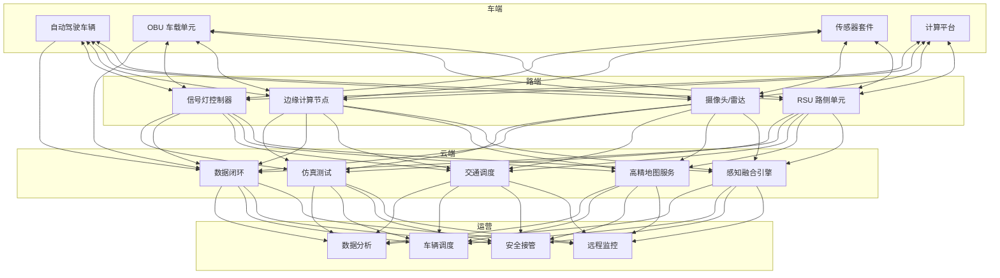
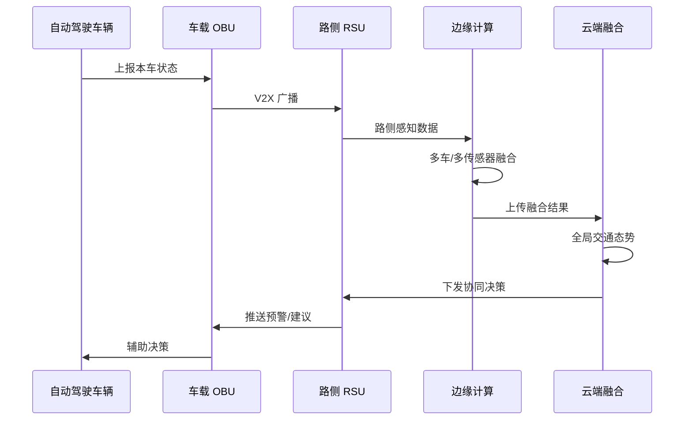
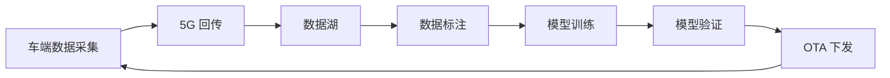

---title: 车路协同自动驾驶架构设计 — 阿里云视角
description: 'title: 车路协同自动驾驶V2X架构设计'
summary: 'title: 车路协同自动驾驶V2X架构设计'
category: general
tags:
- architecture
- best-practice
- daemonset
- gpu
- nvidia
tier: supporting
created: '2026-05-23'
last_updated: 2026-05
difficulty: intermediate
reading_level: intermediate
audience:
- 所有工程师
estimated_read_time: 5min
intent_queries:
- 车路协同自动驾驶架构设计 — 阿里云视角 是什么
- 如何 车路协同自动驾驶架构设计 — 阿里云视角
- Kubernetes 20 application patterns 最佳实践
trigger_keywords:
- 车路协同自动驾驶架构设计
- 阿里云视角
- application
- patterns
prerequisites:
- kubectl-basics
- prometheus-basics
- gpu-scheduling-basics
authors:
- name: Dillan Teagle
  role: contributor

---

> **生产环境安全提示**
>
> 本文档包含可直接执行的运维命令。执行前请确认：当前目标集群与 Namespace 是否正确；是否具备足够的 RBAC 权限；是否已在非生产环境验证。命令风险等级标注：🔴 高风险（可能造成数据丢失或服务中断）、🟡 中风险（会修改集群状态，但通常可回滚）、🟢 低风险/只读（信息收集，无副作用）。


title: 车路协同自动驾驶V2X架构设计
description: '# 车路协同自动驾驶架构设计 — 阿里云视角'
category: application-architecture
tags:
- k8s
- architecture
- industry
- [[DaemonSet|daemonset]]
- gpu
- nvidia
last_updated: '2026-05-18'
difficulty: expert
reading_level: expert
audience:
- 自动驾驶架构师
- V2X系统开发者
- 边缘计算工程师
- 阿里云解决方案架构师
estimated_read_time: 5min
intent_queries:
- 车路协同V2X系统架构设计
- 自动驾驶感知融合K8s部署
- RSU路侧单元边缘计算
- 高精地图数据闭环
- V2X功能安全ASIL-D
trigger_keywords:
- V2X
- 车路协同
- 自动驾驶
- 边缘计算
- 感知融合
- 高精地图
- RSU
- OBU
- 5G
- ASIL-D
related_domains:
- domain-01-cluster-fundamentals
- domain-9-ai-ml
- domain-5-iot-edge-computing
- domain-03-networking-traffic
related_topics:
- domain-20-application-patterns/topic-application-architecture/80-tsn-network
- domain-20-application-patterns/topic-application-architecture/51-smart-manufacturing-mes
- domain-20-application-patterns/topic-application-architecture/47-smart-mining
- domain-02-workloads-applications/topic-functions/05-iot-edge-computing
k8s_versions:
- '1.28'
- '1.29'
- '1.30'
- '1.31'
- '1.32'
---

# 车路协同自动驾驶架构设计 — 阿里云视角

> **适用版本**: [[Kubernetes|Kubernetes]] v1.29 - v1.33 | **最后更新**: 2026-04-24
> **作者**: 阿里云解决方案架构师 | **标签**: `#车路协同` `#自动驾驶` `#V2X` `#阿里云`

---

## 目录

1. [行业背景](#1-行业背景)
2. [业务架构](#2-业务架构)
3. [技术架构](#3-技术架构)
4. [核心数据流](#4-核心数据流)
5. [安全与合规](#5-安全与合规)
6. [可观测性](#6-可观测性)
7. [阿里云组件映射](#7-阿里云组件映射)
8. [生产检查清单](#8-生产检查清单)

---

## 1. 行业背景

### 1.1 业务特点

车路协同通过路侧基础设施增强自动驾驶能力：

| 挑战 | 说明 | 架构影响 |
|:---|:---|:---|
| 超低延迟 | 安全指令 < 20ms | 边缘计算 + 5G |
| 高精度定位 | 厘米级定位需求 | RTK + 高精地图 |
| 感知融合 | 车端+路端感知融合 | 多源数据融合 |
| 安全冗余 | 功能安全 ASIL-D | 冗余架构 |
| 海量数据 | 自动驾驶数据回传 | 数据湖 + 标注 |

### 1.2 核心场景

- **协同感知**: 路侧传感器扩展车辆感知范围
- **协同决策**: 路口信号灯/行人预警
- **协同控制**: 编队行驶/远程接管
- **高精地图**: 实时地图更新与分发
- **数据闭环**: 数据回传/标注/模型迭代

---

## 2. 业务架构

### 2.1 车路协同全景架构



### 2.2 协同感知时序



---

## 3. 技术架构

### 3.1 K8s 部署

```yaml
# 感知融合引擎 GPU Deployment
apiVersion: apps/v1
kind: Deployment
metadata:
  name: perception-fusion
  namespace: v2x-autonomous
spec:
  replicas: 3
  selector:
    matchLabels:
      app: perception-fusion
  template:
    metadata:
      labels:
        app: perception-fusion
    spec:
      nodeSelector:
        accelerator: nvidia-a10
      runtimeClassName: nvidia
      containers:
        - name: fusion
          image: registry.cn-hangzhou.aliyuncs.com/v2x/perception-fusion:v2.0.0-gpu
          ports:
            - containerPort: 8080
          env:
            - name: FUSION_ALGORITHM
              value: "multi-sensor-kalman"
            - name: MAX_LATENCY_MS
              value: "50"
          resources:
            requests:
              nvidia.com/gpu: 1
              memory: "16Gi"
              cpu: "8000m"
            limits:
              nvidia.com/gpu: 1
              memory: "32Gi"
              cpu: "16000m"
```

```yaml
# 边缘 RSU 控制 DaemonSet
apiVersion: apps/v1
kind: DaemonSet
metadata:
  name: rsu-controller
  namespace: v2x-autonomous
spec:
  selector:
    matchLabels:
      app: rsu-controller
  template:
    metadata:
      labels:
        app: rsu-controller
    spec:
      hostNetwork: true
      nodeSelector:
        node-type: roadside-edge
      containers:
        - name: rsu
          image: registry.cn-hangzhou.aliyuncs.com/v2x/rsu-controller:v1.5.0
          resources:
            requests:
              memory: "2Gi"
              cpu: "2000m"
            limits:
              memory: "4Gi"
              cpu: "4000m"
```

---

## 4. 核心数据流

### 4.1 数据闭环流水线



---

## 5. 安全与合规

- **功能安全**: ASIL-D 等级要求
- **网络安全**: V2X 通信加密
- **数据安全**: 高精地图数据保密

---

## 6. 可观测性

- **端到端延迟**: < 20ms
- **感知准确率**: > 99.9%
- **系统可用性**: 99.999%

---

## 7. 阿里云组件映射

| 功能域 | **阿里云云原生方案** |
|:---|:---|
| 容器平台 | **ACK Pro + ACK Edge** |
| GPU | **GN7/GN10 实例** |
| IoT | **阿里云 IoT 平台** |
| 5G | **5G 专网** |
| 高精地图 | **阿里云高精地图** |
| 数据湖 | **OSS + MaxCompute** |
| AI | **PAI** |
| 可观测性 | **ARMS + SLS** |

---

## 8. 生产检查清单

- [ ] V2X 通信延迟 < 20ms
- [ ] 感知融合准确率验证
- [ ] 功能安全 ASIL-D 认证
- [ ] 远程接管响应 < 100ms
- [ ] 高精地图数据安全

---

**维护者**: 阿里云解决方案架构师团队 | **许可证**: MIT

---

## Obsidian 相关文档

- topic-application-architecture KUDIG Database — Global MOC
- [[domain-20-application-patterns/topic-application-architecture/README.md|Topic 应用层架构设计最佳实践]]
- [[domain-20-application-patterns/topic-application-architecture/01-ecommerce-architecture.md|电商系统 Kubernetes 生产架构设计]]
- [[domain-20-application-patterns/topic-application-architecture/02-mini-program-architecture.md|小程序平台架构设计]]
- [[domain-20-application-patterns/topic-application-architecture/03-cms-architecture.md|内容管理系统 CMS 架构设计]]
- [[domain-20-application-patterns/topic-application-architecture/04-im-rtc-architecture.md|实时通信 IM/RTC 架构设计]]
- [[domain-20-application-patterns/topic-application-architecture/05-online-education-architecture.md|在线教育平台 Kubernetes 生产架构设计]]
- [[domain-20-application-patterns/topic-application-architecture/06-fintech-architecture.md|金融科技FinTech Kubernetes生产架构设计]]
- [[domain-20-application-patterns/topic-application-architecture/07-iot-platform-architecture.md|物联网 IoT 平台架构设计]]
- [[domain-20-application-patterns/topic-application-architecture/08-ai-ml-inference-architecture.md|AI/ML 推理服务 Kubernetes 生产架构设计]]
- [[domain-20-application-patterns/topic-application-architecture/09-gaming-backend-architecture.md|游戏后端 Kubernetes 生产架构设计]]
- [[domain-20-application-patterns/topic-application-architecture/10-social-media-architecture.md|社交媒体平台Kubernetes生产架构设计]]

## See Also

- 58-web3-gamefi
- 59-industrial-internet-platform
- 61-smart-grid
- 62-distributed-energy

## Related

- topic-application-architecture MOC — Cross-reference


<!-- risk-assessed -->
